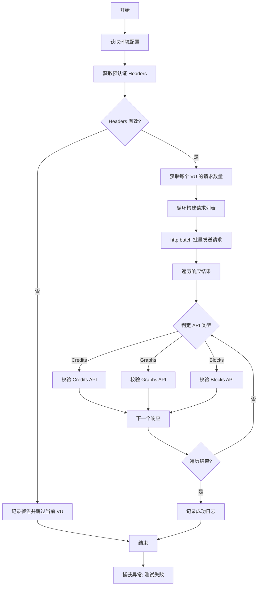
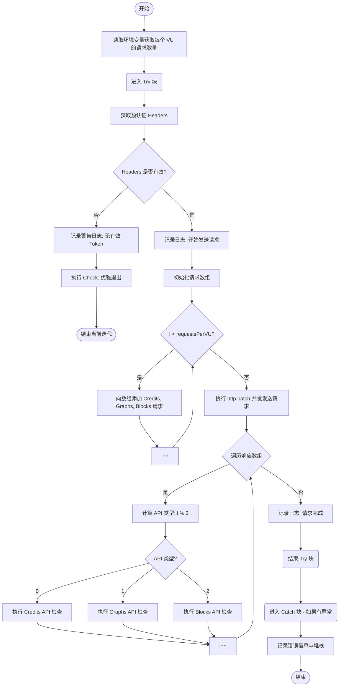

# `.\AutoGPT\autogpt_platform\backend\load-tests\tests\api\core-api-test.js` 详细设计文档

该 K6 脚本用于对 AutoGPT 平台的核心 API 端点进行负载测试和诊断验证，支持配置并发虚拟用户数与请求量，通过预认证令牌并发请求 Credits、Graphs 和 Blocks 接口，并对响应的状态码、JSON 结构及关键字段进行断言检查。

## 整体流程



## 类结构

```
core-api-validation.js (脚本文件)
├── Import Statements (导入模块)
├── Global Variables (全局变量/配置)
│   ├── config
│   └── options
└── Functions (导出函数)
    └── default function (主测试逻辑)
```

## 全局变量及字段


### `config`
    
从环境配置模块加载的配置对象，包含API基础URL等环境设置。

类型：`Object`
    


### `options`
    
K6测试执行选项配置对象，定义了负载测试的阶段、云设置及超时参数。

类型：`Object`
    


    

## 全局函数及方法


### `default`

该函数是 k6 负载测试脚本的主入口函数（Default Function）。它模拟虚拟用户（VU）向 AutoGPT 平台的 Core API（credits、graphs、blocks）发送并发 HTTP GET 请求。函数负责获取预认证的令牌，构建批量请求，执行并发调用，并对每个 API 的响应状态码、认证错误、JSON 格式及数据结构进行详细的验证检查。如果在测试过程中发生错误，它会捕获异常并记录堆栈信息，以防止单个 VU 崩溃影响整体测试。

参数：

-   无

返回值：`void`，无返回值

#### 流程图



#### 带注释源码

```javascript
export default function () {
  // 从环境变量中获取每个虚拟用户（VU）需要发送的并发请求数量，默认为 1
  const requestsPerVU = parseInt(__ENV.REQUESTS_PER_VU) || 1;

  try {
    // Step 1: 获取预认证的请求头（避免在测试中进行繁重的认证操作）
    // 使用当前 VU 的 ID (__VU) 获取对应的 Token
    const headers = getPreAuthenticatedHeaders(__VU);

    // 优雅处理 Token 缺失的情况
    if (!headers || !headers.Authorization) {
      console.log(
        `⚠️ VU ${__VU} has no valid pre-authenticated token - skipping core API test`,
      );
      // 即使失败也通过一个 Check，确保测试脚本因 Check 失败率而终止，而是记录状态
      check(null, {
        "Core API: Failed gracefully without crashing VU": () => true,
      });
      return; // 退出当前函数迭代，避免后续无 Token 请求
    }

    console.log(
      `🚀 VU ${__VU} making ${requestsPerVU} concurrent API requests...`,
    );

    // 初始化请求数组，用于批量并发执行
    const requests = [];

    // 根据配置的请求数量，循环构建请求体
    for (let i = 0; i < requestsPerVU; i++) {
      // 添加 Credits API 请求（代表用户查询积分场景）
      requests.push({
        method: "GET",
        url: `${config.API_BASE_URL}/api/credits`,
        params: { headers },
      });

      // 添加 Graphs API 请求（代表用户查询图谱场景）
      requests.push({
        method: "GET",
        url: `${config.API_BASE_URL}/api/graphs`,
        params: { headers },
      });

      // 添加 Blocks API 请求（代表用户查询块数据场景）
      requests.push({
        method: "GET",
        url: `${config.API_BASE_URL}/api/blocks`,
        params: { headers },
      });
    }

    // 使用 http.batch 并发执行所有请求，以提高测试效率
    const responses = http.batch(requests);

    // 初始化各 API 成功计数器（虽然代码中声明了但未实际累加使用，保留用于统计）
    let creditsSuccesses = 0;
    let graphsSuccesses = 0;
    let blocksSuccesses = 0;

    // 遍历所有响应进行验证
    for (let i = 0; i < responses.length; i++) {
      const response = responses[i];
      // 根据索引取模判断当前响应属于哪个 API（0=credits, 1=graphs, 2=blocks）
      const apiType = i % 3;

      if (apiType === 0) {
        // Credits API 验证逻辑
        check(response, {
          "Credits API: HTTP Status is 200": (r) => r.status === 200,
          "Credits API: Not Auth Error (401/403)": (r) =>
            r.status !== 401 && r.status !== 403,
          "Credits API: Response has valid JSON": (r) => {
            try {
              JSON.parse(r.body);
              return true;
            } catch (e) {
              return false;
            }
          },
          "Credits API: Response has credits field": (r) => {
            try {
              const data = JSON.parse(r.body);
              return data && typeof data.credits === "number";
            } catch (e) {
              return false;
            }
          },
          "Credits API: Overall Success": (r) => {
            try {
              if (r.status !== 200) return false;
              const data = JSON.parse(r.body);
              return data && typeof data.credits === "number";
            } catch (e) {
              return false;
            }
          },
        });
      } else if (apiType === 1) {
        // Graphs API 验证逻辑
        check(response, {
          "Graphs API: HTTP Status is 200": (r) => r.status === 200,
          "Graphs API: Not Auth Error (401/403)": (r) =>
            r.status !== 401 && r.status !== 403,
          "Graphs API: Response has valid JSON": (r) => {
            try {
              JSON.parse(r.body);
              return true;
            } catch (e) {
              return false;
            }
          },
          "Graphs API: Response is array": (r) => {
            try {
              const data = JSON.parse(r.body);
              return Array.isArray(data);
            } catch (e) {
              return false;
            }
          },
          "Graphs API: Overall Success": (r) => {
            try {
              if (r.status !== 200) return false;
              const data = JSON.parse(r.body);
              return Array.isArray(data);
            } catch (e) {
              return false;
            }
          },
        });
      } else {
        // Blocks API 验证逻辑
        check(response, {
          "Blocks API: HTTP Status is 200": (r) => r.status === 200,
          "Blocks API: Not Auth Error (401/403)": (r) =>
            r.status !== 401 && r.status !== 403,
          "Blocks API: Response has valid JSON": (r) => {
            try {
              JSON.parse(r.body);
              return true;
            } catch (e) {
              return false;
            }
          },
          "Blocks API: Response has blocks data": (r) => {
            try {
              const data = JSON.parse(r.body);
              return data && (Array.isArray(data) || typeof data === "object");
            } catch (e) {
              return false;
            }
          },
          "Blocks API: Overall Success": (r) => {
            try {
              if (r.status !== 200) return false;
              const data = JSON.parse(r.body);
              return data && (Array.isArray(data) || typeof data === "object");
            } catch (e) {
              return false;
            }
          },
        });
      }
    }

    console.log(
      `✅ VU ${__VU} completed ${responses.length} API requests with detailed auth/validation tracking`,
    );
  } catch (error) {
    // 捕获任何未预期的运行时错误，防止 VU 崩溃，并输出详细日志
    console.error(`💥 Test failed: ${error.message}`);
    console.error(`💥 Stack: ${error.stack}`);
  }
}
```


## 关键组件


### 负载测试配置策略

定义测试的执行阶段（爬坡、持续、爬降），使用环境变量动态调整并发虚拟用户数(VUs)和持续时间，并配置云报告项目ID。

### 预认证令牌管理

负责获取并验证预认证的请求头，确保只有在有效的 Authorization 令牌存在时才执行 API 调用，否则优雅地跳过当前迭代。

### 批量请求构造器

根据每个虚拟用户的并发请求乘数，动态构建针对 `/api/credits`、`/api/graphs` 和 `/api/blocks` 三个核心 API 端点的并发请求队列。

### 批量 HTTP 执行器

利用 k6 的 `http.batch` 方法并发发送所有构造好的 HTTP 请求，以模拟高并发场景下的真实用户流量。

### 响应校验与断言

针对不同的 API 端点（积分、图、块）分别执行详细的断言检查，验证 HTTP 状态码、授权状态、JSON 格式有效性及特定数据字段的存在性。


## 问题及建议


### 已知问题

-   **死代码与未使用变量**：在 `default` 函数中定义了 `creditsSuccesses`、`graphsSuccesses` 和 `blocksSuccesses` 三个变量，但在后续的校验逻辑中从未对其进行赋值或使用，属于无效代码。
-   **低效的重复解析**：在 `check` 回调函数中，对同一个响应体 `r.body` 进行了多次 `JSON.parse()` 操作（例如检查是否为有效 JSON、检查特定字段存在性、检查整体成功）。这不仅浪费 CPU 资源，还使得代码显得冗余。
-   **脆弱的映射逻辑**：使用 `const apiType = i % 3` 的方式来区分 API 类型（Credits, Graphs, Blocks）依赖于请求在数组中的严格顺序。这种“魔术数字”方式使得代码难以维护，一旦在请求循环中添加或修改端点顺序，校验逻辑将立即失效。
-   **高度重复的代码结构**：Credits、Graphs 和 Blocks 的校验逻辑块结构几乎完全一致，违反了 DRY（Don't Repeat Yourself）原则，增加了维护成本和出错概率。

### 优化建议

-   **重构校验逻辑（提取公共函数）**：创建一个通用的辅助函数（如 `validateResponse`），接受响应对象和预期的校验规则作为参数。在该函数内部只进行一次 JSON 解析，并根据解析结果执行所有断言，以减少冗余代码和计算开销。
-   **采用数据驱动的方式生成请求**：定义一个配置数组（例如 `[{name: 'credits', path: '/api/credits'}, ...]`），通过遍历该数组来生成请求列表。这能彻底消除 `i % 3` 的魔术数字，使增加新端点变得简单且不易出错。
-   **清理无用代码**：删除未使用的 `creditsSuccesses` 等计数器变量，保持代码整洁。
-   **优化阈值配置**：建议通过环境变量控制是否启用 `thresholds`，而不是完全注释掉。在生产环境或 CI/CD 流水线中应启用阈值以监控性能回归，仅在调试时禁用。
-   **改进响应处理的健壮性**：在循环处理响应时，可以结合请求生成的配置数据，直接通过索引关联对应的校验规则，而不是通过取模运算推断 API 类型，从而提高逻辑的清晰度。


## 其它


### 设计目标与约束

**设计目标：**
1.  **核心 API 验证**：对 AutoGPT 平台的关键 API 端点（`/api/credits`, `/api/graphs`, `/api/blocks`）进行负载测试，以验证其在高并发下的功能正确性、响应速度和稳定性。
2.  **模拟真实用户行为**：通过并发请求和预认证令牌，模拟真实用户在系统中的典型操作流程，而非简单的健康检查。
3.  **性能数据收集**：禁用了可能导致测试中止的阈值，旨在收集所有情况下的性能数据（包括失败场景），以便后续进行全面分析。

**约束：**
1.  **依赖外部预认证**：测试脚本依赖外部生成的预认证令牌（`getPreAuthenticatedHeaders`），不在测试运行时执行登录操作，以避免 Auth 服务成为瓶颈或干扰测试结果。
2.  **环境变量驱动**：测试的执行参数（如 VU 数量、持续时间、爬升时间）必须通过环境变量（`__ENV`）传入，脚本提供了默认值但依赖外部配置。
3.  **超时限制**：为了防止初始化或清理阶段过早终止，明确设置了 `setupTimeout` 和 `teardownTimeout` 为 60 秒。
4.  **无连接复用限制**：默认开启连接复用（`noConnectionReuse: false`），以模拟真实浏览器/客户端行为。

### 错误处理与异常设计

**全局异常捕获：**
*   在默认函数入口处包裹了 `try...catch` 块。如果测试逻辑中出现未预料的运行时错误（如未定义的属性访问），脚本会捕获异常并打印详细的错误信息（`message` 和 `stack`），防止整个 VU（虚拟用户）进程崩溃。

**认证容错机制：**
*   当无法获取有效的预认证 Headers 或缺少 `Authorization` 字段时，脚本不会抛出错误，而是打印警告日志（`⚠️ VU ... skipping`）。
*   执行一个虚拟的 Check 并标记为成功，然后提前返回。这确保了即使 Token 分配耗尽，测试结果也会被记录为“跳过”而非“失败”，保持了测试执行的健壮性。

**响应验证与容错：**
*   使用 `k6` 的 `check` 函数进行断言验证。Check 失败不会阻断脚本执行，只会影响通过率指标。
*   **JSON 解析防护**：所有涉及 `JSON.parse(r.body)` 的检查均包裹在 `try...catch` 块中。如果 API 返回非 JSON 格式的错误页面（如 500 HTML 错误），解析失败时函数返回 `false`，而不是抛出异常导致测试中断。

### 数据流与状态机

**数据流：**
1.  **配置输入阶段**：环境变量 (`__ENV`) -> `options` 对象 -> K6 执行引擎；外部配置文件 (`environment.js`) -> `config` 对象。
2.  **令牌获取阶段**：VU ID (`__VU`) -> `getPreAuthenticatedHeaders()` -> `headers` 对象。
3.  **请求构建阶段**：`config.API_BASE_URL` + 端点路径 + `headers` -> `requests` 数组。
4.  **执行与响应阶段**：`requests` 数组 -> `http.batch()` -> `responses` 数组。
5.  **验证与输出阶段**：`responses` 数组 -> `check()` 函数 -> 内部指标；控制台日志 (`console.log`)。

**状态机：**
*   **VU 生命周期状态**：
    *   **Init**：加载配置和模块。
    *   **Ramp Up**：VU 数量从 0 增加到目标值。
    *   **Sustained Load**：VU 数量保持不变，循环执行默认函数逻辑。
    *   **Ramp Down**：VU 数量减少到 0。
*   **单次迭代逻辑状态**：
    *   **Idle**：开始迭代。
    *   **Auth Check**：验证令牌是否存在。若否，跳转至 **End**；若是，继续。
    *   **Request Gen**：生成并发请求数组。
    *   **Batch Exec**：发送 HTTP 请求并等待响应。
    *   **Validation**：遍历响应数组并执行 Check 逻辑。
    *   **End**：迭代结束。

### 外部依赖与接口契约

**外部模块依赖：**
1.  **`k6/http`**：K6 内置模块，用于发起 HTTP 请求。
2.  **`k6`**：K6 内置模块，提供 `check` 等核心功能。
3.  **`../../configs/environment.js`**：
    *   **契约**：必须导出 `getEnvironmentConfig()` 函数。
    *   **返回值**：对象需包含 `API_BASE_URL` 字段（字符串类型），指向被测目标的基础 URL。
4.  **`../../configs/pre-authenticated-tokens.js`**：
    *   **契约**：必须导出 `getPreAuthenticatedHeaders(vuId)` 函数。
    *   **参数**：`vuId`（数字），当前虚拟用户的 ID。
    *   **返回值**：对象（Headers），必须包含 `Authorization` 字符串字段，用于 API 认证。

**API 接口契约（被测系统）：**
1.  **GET /api/credits**
    *   **Headers**：需包含有效的 `Authorization`。
    *   **预期响应**：HTTP 200；Content-Type 为 JSON；Body 为包含 `credits` (number) 字段的对象。
2.  **GET /api/graphs**
    *   **Headers**：需包含有效的 `Authorization`。
    *   **预期响应**：HTTP 200；Content-Type 为 JSON；Body 为数组。
3.  **GET /api/blocks**
    *   **Headers**：需包含有效的 `Authorization`。
    *   **预期响应**：HTTP 200；Content-Type 为 JSON；Body 为数组或对象。
    *   **通用错误码**：若认证失败，预期返回 401 或 403（测试逻辑中验证了非这些状态码）。

### 部署与运行环境要求

1.  **运行时环境**：必须安装 K6 性能测试工具。
2.  **Node.js 环境**：由于代码使用了 ES Modules 导入语法（`import ... from ...`）和 `.js` 扩展名，需要确保 K6 在支持 ES 模块的模式下运行（通常 K6 支持通过本地路径或 HTTP 导入，但需配合打包或特定的目录结构配置）。
3.  **环境变量配置**：
    *   `RAMP_UP`：爬升时间（默认 "1m"）。
    *   `DURATION`：持续时间（默认 "5m"）。
    *   `RAMP_DOWN`：下降时间（默认 "1m"）。
    *   `VUS`：虚拟用户数（默认 1）。
    *   `REQUESTS_PER_VU`：每个 VU 每次迭代的并发请求数（默认 1）。
    *   `K6_CLOUD_PROJECT_ID`：K6 Cloud 项目 ID（可选，用于云端结果上报）。
4.  **文件系统结构**：脚本依赖相对路径 `../../configs/`，因此必须在正确的目录层级下运行，或者将配置文件放置在预期的相对路径中。

### 扩展性设计

1.  **动态请求扩展**：目前的请求生成逻辑位于循环中。如需添加新的 API 端点进行测试，只需在 `for` 循环中向 `requests` 数组 `push` 新的对象配置，并相应调整响应验证逻辑中的取模判断（`apiType`）即可。
2.  **验证逻辑解耦**：当前的 Check 逻辑基于索引硬编码（`0=credits, 1=graphs, 2=blocks`）。若扩展性增强，可将验证逻辑抽象为基于 URL 或 Tag 的配置映射，以支持更多端点。
3.  **并发控制**：通过 `__ENV.REQUESTS_PER_VU` 参数，可以灵活控制测试的并发力度，既可以是低并发长连接，也可以是高并发 Burst 测试。

### 安全性考虑

1.  **Token 安全**：脚本依赖外部 Token 生成机制，本身不硬编码任何凭证，降低了代码泄露的风险。
2.  **数据敏感性**：测试结果可能包含 API 响应数据。在上传到 K6 Cloud 或日志时，需确保 `/api/credits` 等敏感接口返回的数据不包含个人隐私（PII），或者配置 K6 对敏感响应数据进行脱敏处理。

    