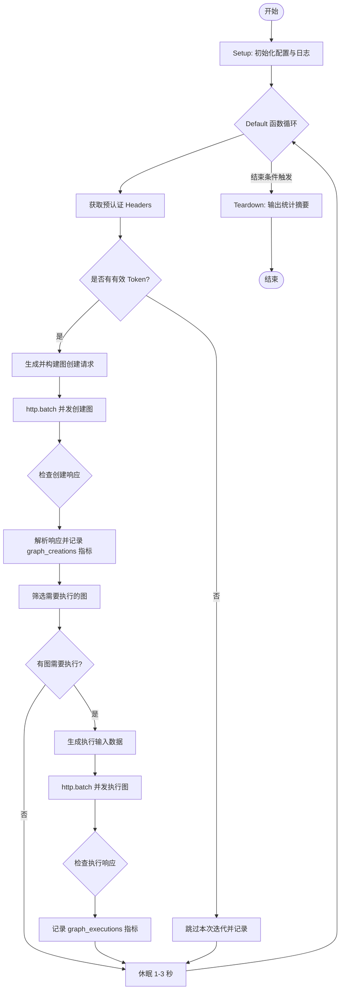
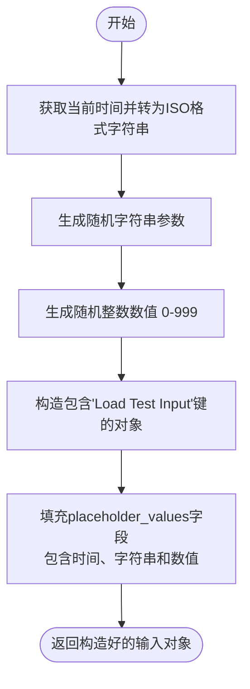
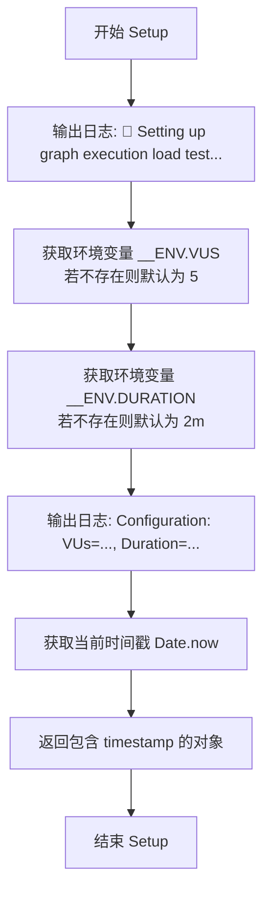
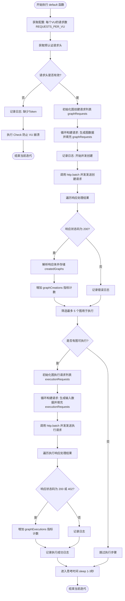
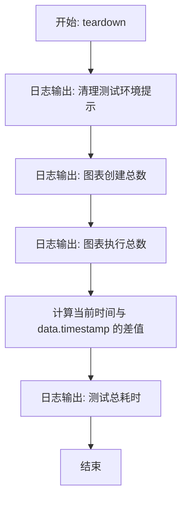

# `.\AutoGPT\autogpt_platform\backend\load-tests\tests\api\graph-execution-test.js` 详细设计文档

该代码是一个使用 K6 框架编写的负载测试脚本，旨在对 AutoGPT 平台的图创建与执行功能进行压力测试。脚本通过模拟多个并发虚拟用户，动态生成测试图数据，批量执行图创建与运行操作，并利用自定义指标收集性能数据，以验证系统在高并发场景下的稳定性和响应速度。

## 整体流程



## 类结构

```
Module Scope (全局作用域)
├── Imports (依赖库)
│   ├── k6/http
│   ├── k6 (check, sleep, group)
│   ├── k6/metrics (Rate, Trend, Counter)
│   └── Configs (environment, pre-authenticated-tokens)
├── Global Functions (工具函数)
│   ├── generateTestGraph
│   └── generateExecutionInputs
├── Global Variables (配置与指标)
│   ├── config
│   ├── graphCreations
│   ├── graphExecutions
│   ├── graphExecutionTime
│   ├── graphCreationTime
│   ├── executionErrors
│   └── options
└── Exported Functions (生命周期钩子)
   ├── setup
   ├── default
   └── teardown
```

## 全局变量及字段


### `config`
    
存储从配置模块加载的环境配置数据（如 API 基础 URL）的对象。

类型：`Object`
    


### `options`
    
k6 的配置对象，用于定义测试阶段、阈值和云项目设置。

类型：`Object`
    


### `graphCreations`
    
自定义计数器指标，用于跟踪图创建操作的总次数。

类型：`Counter`
    


### `graphExecutions`
    
自定义计数器指标，用于跟踪图执行操作的总次数。

类型：`Counter`
    


### `graphExecutionTime`
    
自定义趋势指标，用于记录和计算图执行持续时间的统计数据。

类型：`Trend`
    


### `graphCreationTime`
    
自定义趋势指标，用于记录和计算图创建持续时间的统计数据。

类型：`Trend`
    


### `executionErrors`
    
自定义速率指标，用于跟踪图执行检查中出现错误的比率。

类型：`Rate`
    


    

## 全局函数及方法


### `generateTestGraph`

生成用于负载测试目的的标准化图数据结构，该结构包含图的基本元数据、预定义的输入/输出节点配置以及节点间的连接关系。

参数：

- `name`：`string | null`，图的名称。如果未提供（即为 null），则系统将自动生成一个带有随机后缀的唯一名称。

返回值：`object`，一个包含完整图定义的 JavaScript 对象，可用于后续的 API 请求体中。

#### 流程图

```mermaid
flowchart TD
    A[开始: generateTestGraph] --> B{参数 name 是否存在?}
    B -- 否 --> C[生成随机字符串<br/>Math.random().toString(36).substr...]
    C --> D[设置 graphName 为<br/>'Load Test Graph ' + 随机字符串]
    B -- 是 --> E[设置 graphName 为传入的 name]
    E --> F[构建返回对象结构]
    D --> F
    F --> G[填充顶层字段<br/>name, description]
    F --> H[构建 graph 对象]
    H --> I[定义 nodes 数组<br/>(input_node, output_node)]
    H --> J[定义 links 数组<br/>(连接关系)]
    I --> K[返回构建好的完整图对象]
    J --> K
```

#### 带注释源码

```javascript
function generateTestGraph(name = null) {
  // 确定图的名称：如果未提供 name 参数，则生成一个包含随机字符串的唯一名称
  const graphName =
    name || `Load Test Graph ${Math.random().toString(36).substr(2, 9)}`;

  // 返回符合 API 预期的图数据结构
  return {
    name: graphName,
    description: "Generated graph for load testing purposes",
    graph: {
      name: graphName,
      description: "Load testing graph",
      // 定义图中的节点列表，包含输入节点和输出节点
      nodes: [
        {
          id: "input_node",
          name: "Agent Input",
          block_id: "c0a8e994-ebf1-4a9c-a4d8-89d09c86741b", // 特定的 Block ID
          input_default: {
            name: "Load Test Input",
            description: "Test input for load testing",
            placeholder_values: {},
          },
          input_nodes: [],
          output_nodes: ["output_node"], // 连接到输出节点
          metadata: { position: { x: 100, y: 100 } },
        },
        {
          id: "output_node",
          name: "Agent Output",
          block_id: "363ae599-353e-4804-937e-b2ee3cef3da4", // 特定的 Block ID
          input_default: {
            name: "Load Test Output",
            description: "Test output for load testing",
            value: "Test output value",
          },
          input_nodes: ["input_node"], // 接收来自输入节点的数据
          output_nodes: [],
          metadata: { position: { x: 300, y: 100 } },
        },
      ],
      // 定义节点间的连接关系
      links: [
        {
          source_id: "input_node",
          sink_id: "output_node",
          source_name: "result", // 输出字段名
          sink_name: "value",    // 输入字段名
        },
      ],
    },
  };
}
```


### `generateExecutionInputs`

该函数用于生成模拟图执行所需的输入数据对象，主要包含一个键为 "Load Test Input" 的配置项，其中填充了当前时间戳、随机字符串和随机数值，用于在负载测试中模拟动态输入场景。

参数：

无

返回值：`Object`，包含模拟输入数据的对象，其中包含 `placeholder_values` 字段用于存储动态生成的测试数据。

#### 流程图



#### 带注释源码

```javascript
function generateExecutionInputs() {
  return {
    "Load Test Input": {
      name: "Load Test Input",
      description: "Test input for load testing",
      // 定义占位符值，用于负载测试的数据生成
      placeholder_values: {
        // 包含当前执行时间的ISO字符串，确保每次请求数据具有唯一性
        test_data: `Test execution at ${new Date().toISOString()}`,
        // 生成一个随机的字母数字字符串作为测试参数
        test_parameter: Math.random().toString(36).substr(2, 9),
        // 生成一个0到999之间的随机整数
        numeric_value: Math.floor(Math.random() * 1000),
      },
    },
  };
}
```


### `setup`

该函数是 k6 测试脚本的生命周期初始化函数，用于在测试开始前执行一次性设置操作。它负责记录当前的测试配置（如虚拟用户数 VUs 和持续时间 Duration），并记录测试开始的时间戳，以便在测试结束后计算总运行时长。

参数：

-  无

返回值：`Object`，包含测试开始时间戳的对象，用于后续 teardown 阶段计算总耗时。

#### 流程图



#### 带注释源码

```javascript
export function setup() {
  // 输出测试初始化的日志信息
  console.log("🎯 Setting up graph execution load test...");
  
  // 从环境变量中获取并发用户数(VUs)和持续时间，若未设置则使用默认值，并输出当前配置
  console.log(
    `Configuration: VUs=${parseInt(__ENV.VUS) || 5}, Duration=${__ENV.DURATION || "2m"}`,
  );
  
  // 返回一个包含当前时间戳的对象，该对象将被传递给 default 函数和 teardown 函数
  return {
    timestamp: Date.now(),
  };
}
```


### `default`

该函数是 K6 负载测试脚本的核心入口函数，由每个虚拟用户（VU）重复执行。它负责并发创建测试图，并对创建成功的图子集进行并发执行，以测试后端 API 在高并发下的图创建与执行性能及稳定性。

参数：

- `data`：`Object`，由 `setup` 函数传递的数据对象，通常包含测试开始的时间戳等初始化信息。
- `__VU`：`Number` (全局)，当前虚拟用户的 ID（隐式上下文）。
- `__ENV`：`Object` (全局)，环境变量对象（隐式上下文）。

返回值：`void`，无直接返回值，主要通过发送 HTTP 请求、记录日志和更新 K6 指标来产生副作用。

#### 流程图



#### 带注释源码

```javascript
export default function (data) {
  // 获取环境变量配置的每个VU并发数，默认为1
  const requestsPerVU = parseInt(__ENV.REQUESTS_PER_VU) || 1;

  // 获取预认证的请求头，避免在负载测试中进行昂贵的Auth操作
  const headers = getPreAuthenticatedHeaders(__VU);

  // 优雅处理Token缺失的情况，防止VU因未授权错误而中断
  if (!headers || !headers.Authorization) {
    console.log(
      `⚠️ VU ${__VU} has no valid pre-authenticated token - skipping graph execution`,
    );
    check(null, {
      "Graph Execution: Failed gracefully without crashing VU": () => true,
    });
    return; // 退出当前迭代
  }

  console.log(
    `🚀 VU ${__VU} performing ${requestsPerVU} concurrent graph operations...`,
  );

  // 准备并发请求列表
  const graphRequests = [];

  for (let i = 0; i < requestsPerVU; i++) {
    // 生成随机的测试图数据
    const graphData = generateTestGraph();

    // 构建图创建的HTTP请求配置
    graphRequests.push({
      method: "POST",
      url: `${config.API_BASE_URL}/api/graphs`,
      body: JSON.stringify(graphData),
      params: { headers },
    });
  }

  // 使用 http.batch 并发发送所有图创建请求，模拟真实的高并发场景
  console.log(`📊 Creating ${requestsPerVU} graphs concurrently...`);
  const responses = http.batch(graphRequests);

  // 处理创建响应
  let successCount = 0;
  const createdGraphs = [];

  for (let i = 0; i < responses.length; i++) {
    const response = responses[i];

    // 检查HTTP状态码是否为200
    const success = check(response, {
      [`Graph ${i + 1} created successfully`]: (r) => r.status === 200,
    });

    if (success && response.status === 200) {
      successCount++;
      try {
        // 解析返回的图数据，保留ID用于后续执行测试
        const graph = JSON.parse(response.body);
        createdGraphs.push(graph);
        // 记录自定义指标：图创建总数
        graphCreations.add(1);
      } catch (e) {
        console.error(`Error parsing graph ${i + 1} response:`, e);
      }
    } else {
      console.log(`❌ Graph ${i + 1} creation failed: ${response.status}`);
    }
  }

  console.log(
    `✅ VU ${__VU} created ${successCount}/${requestsPerVU} graphs concurrently`,
  );

  // 只执行创建成功的图中的前5个（或更少），以避免过多的执行负载导致测试环境雪崩
  const graphsToExecute = createdGraphs.slice(
    0,
    Math.min(5, createdGraphs.length),
  );

  if (graphsToExecute.length > 0) {
    console.log(`⚡ Executing ${graphsToExecute.length} graphs...`);

    const executionRequests = [];

    for (const graph of graphsToExecute) {
      // 生成执行所需的输入数据
      const executionInputs = generateExecutionInputs();

      // 构建图执行的HTTP请求配置
      executionRequests.push({
        method: "POST",
        url: `${config.API_BASE_URL}/api/graphs/${graph.id}/execute/${graph.version}`,
        body: JSON.stringify({
          inputs: executionInputs,
          credentials_inputs: {},
        }),
        params: { headers },
      });
    }

    // 使用 http.batch 并发发送所有图执行请求
    const executionResponses = http.batch(executionRequests);

    let executionSuccessCount = 0;
    for (let i = 0; i < executionResponses.length; i++) {
      const response = executionResponses[i];

      // 检查执行请求是否成功（200表示成功，402通常表示欠费等业务逻辑限制，这里视为请求已受理）
      const success = check(response, {
        [`Graph ${i + 1} execution initiated`]: (r) =>
          r.status === 200 || r.status === 402,
      });

      if (success) {
        executionSuccessCount++;
        // 记录自定义指标：图执行总数
        graphExecutions.add(1);
      }
    }

    console.log(
      `✅ VU ${__VU} executed ${executionSuccessCount}/${graphsToExecute.length} graphs`,
    );
  }

  // 模拟用户思考时间，随机休眠1-3秒
  sleep(Math.random() * 2 + 1); 
}
```


### `teardown`

该函数是 k6 负载测试脚本的生命周期钩子函数，用于在测试结束后输出最终的测试统计数据，包括图表创建总数、执行总数以及测试的总持续时间。

参数：

- `data`：`Object`，从 `setup` 函数传递过来的共享数据对象，在本脚本中包含测试开始的时间戳。

返回值：`void`，该函数没有返回值。

#### 流程图



#### 带注释源码

```javascript
export function teardown(data) {
  // 输出清理提示信息
  console.log("🧹 Cleaning up graph execution load test...");
  
  // 输出图表创建的总数（使用自定义指标）
  console.log(`Total graph creations: ${graphCreations.value || 0}`);
  
  // 输出图表执行的总数（使用自定义指标）
  console.log(`Total graph executions: ${graphExecutions.value || 0}`);

  // 计算并输出测试的总持续时间（当前时间 - setup 中记录的时间戳）
  const testDuration = Date.now() - data.timestamp;
  console.log(`Test completed in ${testDuration}ms`);
}
```


## 关键组件


### 预认证 Token 管理

通过 `getPreAuthenticatedHeaders` 函数获取预认证的 Authorization 请求头，避免了在高并发负载测试期间进行重复的登录认证开销，确保测试主要集中在后端 API 的执行性能上。

### 并发请求批处理

利用 k6 的 `http.batch` 方法，在单个虚拟用户（VU）的迭代过程中并发发送多个 HTTP 请求（如图创建或执行），以更真实地模拟高并发用户场景，提高测试效率。

### 自定义指标收集

定义并使用了 `graphCreations`（Counter）、`graphExecutions`（Counter）、`graphExecutionTime`（Trend）和 `executionErrors`（Rate）等自定义 k6 指标，用于精细化统计和监控图的创建数量、执行成功率及响应时间趋势。

### 动态负载测试配置

通过 `options` 对象结合环境变量（如 `VUS`, `DURATION`, `RAMP_UP` 等）动态配置负载测试的阶段、虚拟用户数和持续时间，灵活适应不同强度的压力测试需求。

### 测试数据生成器

包含 `generateTestGraph` 和 `generateExecutionInputs` 函数，用于动态生成包含随机 ID、名称和参数的图结构数据及输入数据，防止因数据重复导致的服务端缓存影响测试结果的准确性。

### 测试生命周期管理

实现了标准的 k6 生命周期函数 `setup`（初始化配置）、`default`（执行核心测试逻辑）和 `teardown`（清理并输出统计摘要），确保测试过程的完整性和结果的可追溯性。


## 问题及建议


### 已知问题

-   **硬编码的 Block IDs 导致维护性差**：在 `generateTestGraph` 函数中，节点定义包含硬编码的 UUID（如 `c0a8e994-ebf1-4a9c-a4d8-89d09c86741b`）。如果后端系统中这些 Block ID 发生变更或环境不同，测试脚本将立即失效且难以配置。
-   **缺乏资源清理机制导致数据残留**：测试脚本在执行过程中创建了大量的 Graph 数据，但在 `teardown` 阶段并未调用删除接口。长期运行会导致数据库中堆积大量垃圾数据，可能影响系统性能和后续测试的数据准确性。
-   **高频日志输出影响性能**：在默认函数 `default` 中使用了大量的 `console.log` 输出状态。在高并发（VUs 较高）场景下，频繁的 I/O 操作会显著消耗测试机的资源，从而干扰负载测试结果的准确性。
-   **执行验证逻辑不严谨**：在验证执行结果时，`check` 函数接受 `status === 200 || r.status === 402`。将 402（Payment Required）视为成功可能掩盖计费错误或配额限制问题，且仅检查了请求发起状态，未验证异步任务的实际完成状态或最终结果。
-   **静态测试拓扑覆盖面有限**：生成的测试图结构固定（仅包含 Input 和 Output 节点），无法测试复杂拓扑、多分支或循环依赖场景下的系统表现，难以发现深层逻辑的性能瓶颈。

### 优化建议

-   **配置化 Block ID 与拓扑结构**：将硬编码的 Block ID 和图结构模板移至配置文件（如 `environment.js` 或专门的 JSON 文件）中，支持通过环境变量动态指定，提高脚本的灵活性和跨环境复用能力。
-   **增加自动清理逻辑**：在 `teardown` 阶段或每次迭代结束前，调用 Graph 删除接口清理本次创建的 Graph 数据。如果批量删除效率低，可以在 Graph 名称中加入时间戳或特定的 Tag，以便后续通过后台脚本统一清理。
-   **优化日志策略**：移除 `default` 函数中的 `console.log`，或通过设置 debug 标志来控制是否输出。利用 K6 的 Tags 功能标记关键步骤，依赖 K6 的汇总报告进行分析，而非实时打印日志。
-   **完善执行结果验证**：修改执行检查逻辑，严格区分 200 和非 200 状态码。对于异步执行任务，建议增加轮询（Polling）机制，检查任务状态直至完成，并校验输出结果的正确性，而不仅仅是校验 HTTP 状态码。
-   **启用阈值监控**：代码中注释掉了 `thresholds`，建议根据基准测试恢复并调整阈值设置（如 `p(95)<500`），以便在 CI/CD 流程中能自动判断性能是否达标。
-   **参数化并发执行数**：目前执行步数固定为 `Math.min(5, createdGraphs.length)`，建议将其提取为可配置的环境变量（如 `EXECUTION_SUBSET_COUNT`），以便更灵活地模拟读写比例。


## 其它


### 设计目标与约束

**设计目标**：
1.  **高并发性能验证**：模拟多虚拟用户 (VU) 同时创建和执行图 的场景，以测试 API 在高负载下的响应时间和吞吐量。
2.  **基准测试与指标收集**：通过自定义指标（如 `graph_execution_duration`, `graph_creations_total`）精确收集关键业务操作的性能数据，为系统扩容或优化提供数据支持。
3.  **稳定性测试**：在持续压力下验证系统是否能够稳定运行，不出现崩溃或严重资源泄漏。

**设计约束**：
1.  **认证机制约束**：为了减少登录流程对测试目标接口的干扰，脚本依赖预生成的认证 Token (`getPreAuthenticatedHeaders`)，不测试认证接口本身的性能。
2.  **执行负载限制**：为了防止执行端过载，代码逻辑中限制每次迭代最多只执行 5 个已创建的图，即使创建的数量更多。
3.  **环境依赖**：脚本依赖于外部环境变量 (`__ENV`) 来配置测试强度（VUs, Duration 等）以及 K6 Cloud 项目 ID。
4.  **阈值禁用**：为了收集完整的性能数据分布（包括长尾数据），代码中注释掉了阈值检查，防止测试在性能未达标时提前中止。

### 数据流与状态机

**数据流**：
1.  **配置阶段**：从环境变量和配置文件 (`environment.js`, `pre-authenticated-tokens.js`) 加载 API 基础 URL 和认证 Token。
2.  **初始化阶段 (`setup`)**：记录测试开始时间戳，传递给主函数和结束函数。
3.  **执行阶段 (`default function`)**：
    *   **输入生成**：调用 `generateTestGraph` 和 `generateExecutionInputs` 生成符合 API 契约的随机 JSON 数据。
    *   **并发请求**：将生成的数据封装为 HTTP 请求对象数组，通过 `http.batch` 发送。
    *   **响应处理**：接收批量响应数组，解析 JSON Body，提取 Graph ID 用于后续执行步骤。
    *   **执行子流**：从创建成功的 Graph 中选取最多 5 个，构造执行请求并再次批量发送。
    *   **指标记录**：根据响应状态更新自定义计数器 (`Counter`)、趋势 (`Trend`) 和错误率 (`Rate`)。
4.  **清理阶段 (`teardown`)**：汇总并打印本次测试的统计数据（创建总数、执行总数、总耗时）。

**状态机**：
脚本主要遵循 K6 的 VU (Virtual User) 生命周期状态：
*   **Init** -> **Setup** (全局一次) -> **VU Loop** (default function，循环执行) -> **Teardown** (全局一次)。
*   在 VU Loop 内部，逻辑状态流转为：`Check Auth` -> `Generate Data` -> `Batch Create` -> `Filter Success` -> `Batch Execute` -> `Sleep`。

### 错误处理与异常设计

1.  **优雅降级**：
    *   当获取预认证 Token 失败 (`!headers || !headers.Authorization`) 时，脚本不会抛出异常导致 VU 崩溃，而是打印警告日志并通过 `check` 返回 `true` (虚拟通过)，直接结束当前迭代。这确保了 Token 分配问题的存在不会干扰其他 VU 的运行或被误报为 API 错误。
2.  **业务状态码宽容处理**：
    *   在执行图的响应检查中，不仅接受 `200` (OK)，还接受 `402` (Payment Required/Quota Exceeded)。这意味着如果用户配额不足，测试仍视为“请求已成功受理”，避免因计费逻辑触发测试失败。
3.  **数据解析异常捕获**：
    *   在解析创建图返回的 JSON Body 时使用了 `try-catch` 块。如果 API 返回非 JSON 格式的错误响应（例如 500 错误时的 HTML 页面），脚本会捕获异常并打印错误日志，而不会中断后续的测试逻辑。
4.  **非致命日志记录**：
    *   使用 `console.log` 记录失败的请求状态码和详情，而不是抛出错误，保证测试流程能够持续进行直至设定的结束时间。

### 外部依赖与接口契约

**外部依赖**：
1.  **K6 核心库**：`k6/http`, `k6/metrics`, `k6/check`, `k6/sleep`。
2.  **本地配置模块**：
    *   `../../configs/environment.js`：提供 `getEnvironmentConfig()`，返回包含 `API_BASE_URL` 的配置对象。
    *   `../../configs/pre-authenticated-tokens.js`：提供 `getPreAuthenticatedHeaders(vuId)`，用于获取模拟用户身份的请求头。
3.  **目标 API 服务**：AutoGPT Platform 后端服务（隐式依赖）。

**接口契约**：
1.  **创建图接口**：
    *   **Method**: `POST`
    *   **URL**: `{API_BASE_URL}/api/graphs`
    *   **Headers**: 必须包含 `Authorization` (Bearer Token) 和 `Content-Type: application/json`。
    *   **Body**: 包含 `name`, `description`, `graph` (包含 `nodes`, `links`) 的 JSON 对象。
    *   **Response**:
        *   **Success (200)**: 返回创建的 Graph 对象 JSON，必须包含 `id` 和 `version` 字段。
2.  **执行图接口**：
    *   **Method**: `POST`
    *   **URL**: `{API_BASE_URL}/api/graphs/{graph_id}/execute/{graph_version}`
    *   **Headers**: 同创建接口。
    *   **Body**: 包含 `inputs` 和 `credentials_inputs` 的 JSON 对象。
    *   **Response**:
        *   **Success (200)**: 执行成功。
        *   **Accepted (402)**: 配额不足但请求已记录（视为逻辑成功）。

### 部署与配置策略

1.  **环境变量驱动的配置**：
    脚本通过 `__ENV` 对象动态读取配置，实现了代码与环境的解耦。关键配置项包括：
    *   `VUS`: 虚拟用户数量，默认值为 5。
    *   `RAMP_UP`: 加压时长，默认为 "1m"。
    *   `DURATION`: 持续测试时长，默认为 "5m"。
    *   `RAMP_DOWN`: 减压时长，默认为 "1m"。
    *   `REQUESTS_PER_VU`: 每个 VU 在单次迭代中并发生成的请求数。
    *   `K6_CLOUD_PROJECT_ID`: 用于将测试结果上传到 K6 Cloud 的项目标识符。
2.  **分阶段执行策略**：
    配置了 `stages` 数组，采用经典的“三阶段”负载模型（爬坡 -> 持续高压 -> 降落），便于观察系统在负载逐渐增加和释放过程中的表现。
3.  **连接复用配置**：
    `noConnectionReuse: false` 明确启用了 HTTP 连接复用（Keep-Alive），这是模拟真实浏览器行为并减少 TCP 握手开销的重要配置。
4.  **云集成**：
    通过 `cloud.projectID` 配置，支持将本地运行的负载测试数据实时同步到 K6 Cloud 平台进行可视化分析。

    