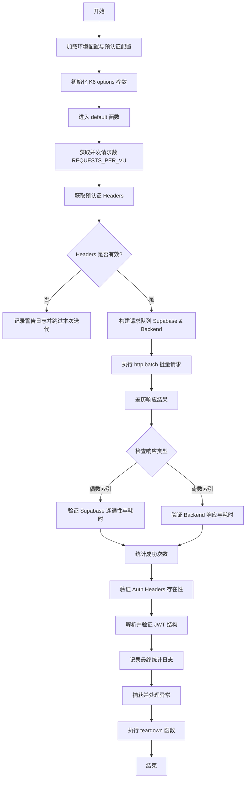
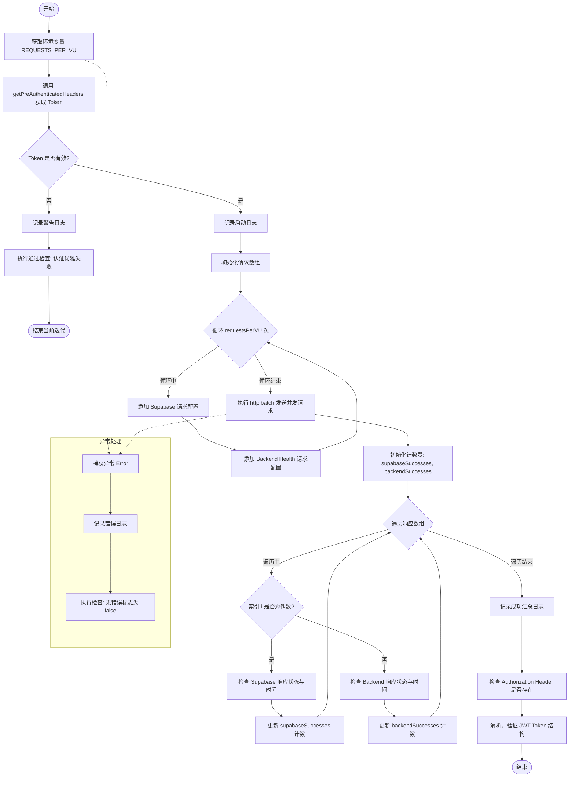
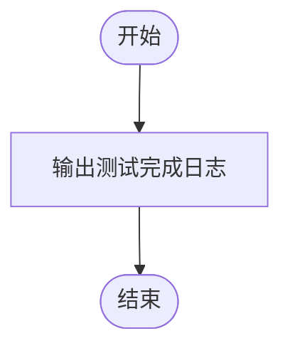

# `.\AutoGPT\autogpt_platform\backend\load-tests\tests\basic\connectivity-test.js` 详细设计文档

该脚本是一个基于 K6 的性能测试脚本，用于对 AutoGPT 平台进行基础连接性和认证测试，验证 Supabase 和后端 API 在高并发下的可用性、响应延迟以及认证令牌的有效性，无需后端 API 访问权限。

## 整体流程



## 类结构

```
basic-connectivity-test.js (脚本文件)
├── Imports (导入依赖)
│   ├── k6/http
│   ├── k6/check
│   └── configs/...
├── Global Variables (全局变量/配置)
│   ├── config
│   └── options
└── Functions (函数定义)
    ├── default (主测试逻辑)
    └── teardown (清理逻辑)
```

## 全局变量及字段


### `config`
    
从环境配置模块加载的配置对象，包含 API 基础 URL、Supabase URL 和匿名密钥等环境特定设置。

类型：`Object`
    


### `options`
    
K6 测试运行配置对象，定义了负载测试的阶段（VUs 和持续时间）、性能阈值和云项目设置。

类型：`Object`
    


    

## 全局函数及方法


### `default`

该函数是 k6 负载测试脚本的主入口函数（虚拟用户逻辑），用于测试基础连接性和认证机制。它获取预认证的头部信息，根据配置的并发数向 Supabase 和后端健康检查端点发起批量 HTTP 请求，并验证响应状态、响应时间以及 JWT Token 的结构完整性。

参数：

-  无

返回值：`void`，无返回值，主要通过执行 HTTP 请求、日志记录和检查断言来产生副作用。

#### 流程图



#### 带注释源码

```javascript
export default function () {
  // 获取每个虚拟用户（VU）需要发起的并发请求数量，默认为 1
  const requestsPerVU = parseInt(__ENV.REQUESTS_PER_VU) || 1;

  try {
    // 根据当前 VU 编号获取预认证的请求头（包含 Token）
    const headers = getPreAuthenticatedHeaders(__VU);

    // 优雅地处理认证失败的情况：如果没有拿到有效的 Token
    if (!headers || !headers.Authorization) {
      console.log(
        `⚠️ VU ${__VU} has no valid pre-authentication token - skipping iteration`,
      );
      // 即使失败也执行一次 check 以确保测试不会因为 VU 崩溃而停止
      check(null, {
        "Authentication: Failed gracefully without crashing VU": () => true,
      });
      return; // 退出当前迭代
    }

    console.log(`🚀 VU ${__VU} making ${requestsPerVU} concurrent requests...`);

    // 准备请求数组，用于批量发送
    const requests = [];

    // 根据配置的数量填充请求对象
    for (let i = 0; i < requestsPerVU; i++) {
      // 添加 Supabase 连接性测试请求
      requests.push({
        method: "GET",
        url: `${config.SUPABASE_URL}/rest/v1/`,
        params: { headers: { apikey: config.SUPABASE_ANON_KEY } },
      });

      // 添加后端 Health 端点测试请求（使用认证头）
      requests.push({
        method: "GET",
        url: `${config.API_BASE_URL}/health`,
        params: { headers },
      });
    }

    // 使用 http.batch 并发执行所有请求
    const responses = http.batch(requests);

    // 初始化成功计数器
    let supabaseSuccesses = 0;
    let backendSuccesses = 0;

    // 遍历所有响应进行验证
    for (let i = 0; i < responses.length; i++) {
      const response = responses[i];

      if (i % 2 === 0) {
        // 偶数索引对应 Supabase 请求
        const connectivityCheck = check(response, {
          "Supabase connectivity: Status is not 500": (r) => r.status !== 500,
          "Supabase connectivity: Response time < 5s": (r) =>
            r.timings.duration < 5000,
        });
        if (connectivityCheck) supabaseSuccesses++;
      } else {
        // 奇数索引对应后端请求
        const backendCheck = check(response, {
          "Backend server: Responds (any status)": (r) => r.status > 0,
          "Backend server: Response time < 5s": (r) =>
            r.timings.duration < 5000,
        });
        if (backendCheck) backendSuccesses++;
      }
    }

    // 记录本次迭代的成功汇总信息
    console.log(
      `✅ VU ${__VU} completed: ${supabaseSuccesses}/${requestsPerVU} Supabase, ${backendSuccesses}/${requestsPerVU} backend requests successful`,
    );

    // 验证认证 Header 的基本存在性
    const authCheck = check(headers, {
      "Authentication: Pre-auth token available": (h) =>
        h && h.Authorization && h.Authorization.length > 0,
    });

    // 验证 JWT Token 的结构完整性
    const token = headers.Authorization.replace("Bearer ", "");
    const tokenParts = token.split(".");
    const tokenStructureCheck = check(tokenParts, {
      "JWT token: Has 3 parts (header.payload.signature)": (parts) =>
        parts.length === 3,
      "JWT token: Header is base64": (parts) =>
        parts[0] && parts[0].length > 10,
      "JWT token: Payload is base64": (parts) =>
        parts[1] && parts[1].length > 50,
      "JWT token: Signature exists": (parts) =>
        parts[2] && parts[2].length > 10,
    });
  } catch (error) {
    // 捕获并处理执行过程中的任何未预见异常
    console.error(`💥 Test failed: ${error.message}`);
    check(null, {
      "Test execution: No errors": () => false,
    });
  }
}
```


### `teardown`

K6 测试脚本的生命周期钩子函数，在所有测试迭代和阶段执行完毕后调用，用于输出测试结束的日志信息，标志着测试运行的终止。

参数：

-  `data`：`object`，从 setup 函数传递过来的数据对象（当前代码中未显式定义 setup，但在标准 K6 流程中该参数用于接收上下文数据）。

返回值：`void`，无返回值。

#### 流程图



#### 带注释源码

```javascript
export function teardown(data) {
  // 在控制台输出测试完成的标志信息
  console.log(`🏁 Basic connectivity test completed`);
}
```


## 关键组件


### 负载测试配置管理
定义测试执行阶段、阈值和环境设置以控制负载模拟行为。

### 并发请求执行引擎
利用 `http.batch` 方法同时向 Supabase 和后端服务发出多个 HTTP 请求。

### 连接性与健康检查
验证来自 Supabase 和后端服务的 HTTP 响应，确保它们满足状态码和响应时间的要求。

### 身份验证与令牌验证
处理预认证令牌的检索，并验证 JWT 令牌的结构完整性，以确保有效的会话处理。


## 问题及建议


### 已知问题

-   **文档与实现不符**：文件头部的注释声称 "without requiring backend API access"（不要求后端 API 访问），但代码中实际执行了对 `${config.API_BASE_URL}/health` 的请求，这实际上依赖后端 API。
-   **脆弱的响应处理逻辑**：代码通过 `i % 2` 的索引奇偶性来区分 Supabase 和 Backend 的响应。这种硬编码的索引依赖非常脆弱，一旦请求构建的顺序发生变化，验证逻辑将立即失效。
-   **不可靠的 JWT 验证机制**：代码仅通过字符串长度（如 `parts[1].length > 50`）来判断 JWT Payload 的有效性。这种方式极不严谨，可能会因为 Token 结构紧凑而误报为无效，或者接受格式错误的字符串。
-   **过于宽松的性能阈值**：配置中的 `checks` 成功率阈值仅为 0.70（70%），`http_req_failed` 允许高达 0.6（60% 的失败率）。虽然这可能是为了应对云环境的不稳定性，但过低的阈值掩盖了实际的服务异常，使得测试失去了发现问题的意义。

### 优化建议

-   **解耦请求生成与验证逻辑**：建议将请求对象与其类型（如 'supabase' 或 'backend'）绑定，或者使用结构化数据（如数组 of objects）来生成请求，验证时根据请求元数据而非数组索引来匹配结果，提高代码的健壮性。
-   **增强 Token 验证逻辑**：建议使用正则表达式严格验证 Base64 字符格式，或者尝试对 Payload 进行 Base64 解码以确认其为有效的 JSON，从而替代简单的长度判断。
-   **动态调整测试阈值**：根据实际测试环境的成熟度，逐步收紧阈值。建议将 `http_req_failed` 降低到 0.05 以下，并将 `p(95)` 响应时间调整至符合实际业务预期的数值（如 < 2000ms）。
-   **改进错误日志的上下文信息**：在 `catch` 块中捕获错误时，建议增加当前的 VU ID (`__VU`) 和迭代 ID (`__ITER`)，以便在大量并发日志中快速定位问题来源。
-   **配置参数化**：目前 Supabase 和 Backend 的 URL 拼接直接写在循环中。建议将具体的端点路径（如 `/health`, `/rest/v1/`）提取为配置常量，便于统一管理和维护。


## 其它


### 设计目标与约束

**设计目标**
1.  **核心连通性验证**：在排除复杂后端业务逻辑的情况下，验证基础设施层（Supabase 和 API 网关）的基本网络可达性。
2.  **认证机制健壮性测试**：验证预认证令牌的分发机制以及在负载下的可用性，确保 JWT 结构正确且有效。
3.  **高并发基准测试**：通过模拟多个虚拟用户（VU）并发的场景，确立系统在基础连接层面的性能基线（如响应时间和成功率）。

**约束条件**
1.  **性能阈值（SLA）**：
    *   检查通过率必须大于 70%（`rate>0.70`），考虑到认证超时的可能性，该阈值较标准有所降低。
    *   95% 的请求响应时间必须低于 30 秒（`p(95)<30000`），适应云端高并发测试环境。
    *   失败率允许小于 60%（`rate<0.6`），主要为容忍认证层面的超时。
2.  **执行时间控制**：通过环境变量严格控制测试的爬坡阶段、持续阶段和冷却阶段的时长。
3.  **超时限制**：设置阶段（Setup）和拆除阶段的最长超时时间为 60 秒，防止初始化或清理挂起导致测试无限期等待。
4.  **资源复用**：默认开启连接复用（`noConnectionReuse: false`），模拟真实浏览器行为以利用 TCP 连接池。

### 错误处理与异常设计

**认证层容错**
当虚拟用户无法获取有效的预认证令牌（`headers` 为空或缺失 `Authorization` 字段）时，脚本采取“优雅降级”策略。
*   **行为**：打印警告日志，跳过当前迭代，不抛出异常中断测试。
*   **验证**：执行一个名为 `Authentication: Failed gracefully without crashing VU` 的检查并强制返回 `true`，确保测试报告能正确统计这种情况，而非将其标记为脚本错误。

**运行时异常捕获**
使用 `try-catch` 块包裹核心业务逻辑。
*   **行为**：捕获所有未预期的运行时错误（如网络配置错误、未定义变量引用等）。
*   **验证**：捕获错误后，打印详细的错误信息到控制台，并执行一个返回 `false` 的检查（`Test execution: No errors`），以便在最终结果中标记该次迭代失败，同时保证脚本继续运行。

**响应验证与断言**
对 HTTP 响应进行多层验证：
1.  **Supabase 连接**：状态码非 500 且响应时间小于 5 秒。
2.  **后端服务**：状态码大于 0（表明收到响应）且响应时间小于 5 秒。
3.  **令牌结构**：验证 JWT Token 包含 Header、Payload、Signature 三部分，且各部分 Base64 长度符合预期。

### 数据流与状态机

**整体数据流向**
`Environment Config/Token Store` -> `Load Generator (K6 VU)` -> `HTTP Batch Request` -> `Target Endpoints (Supabase/API)` -> `Response Validation & Metrics`

**执行状态机**
测试脚本的执行逻辑虽然主要是线性的，但遵循 K6 的生命周期状态机：

1.  **Init (初始化状态)**
    *   加载外部配置模块 (`environment.js`, `pre-authenticated-tokens.js`)。
    *   定义全局测试选项（`options`），包括阶段规划、阈值和云端配置。

2.  **Setup (前置状态 - 可选)**
    *   虽然 `setup` 函数未显式定义内容，但配置了 `setupTimeout: "60s"`，预留了初始化资源的状态空间。

3.  **Execution (执行状态 - 循环)**
    *   **状态 A：令牌检查**
        *   输入：`__VU` (虚拟用户ID)。
        *   判定：若令牌无效 -> 进入 `Skip` (跳过) 分支；若有效 -> 进入 `Request` (请求) 分支。
    *   **状态 B：并发请求构建**
        *   循环构建包含 Supabase 和 Backend 请求的数组。
    *   **状态 C：批处理执行与验证**
        *   发起 `http.batch` 调用。
        *   遍历响应数组，根据索引奇偶性分别验证 Supabase 和 Backend 的连通性。
    *   **状态 D：令牌结构验证**
        *   静态分析 JWT 字符串结构。

4.  **Teardown (结束状态)**
    *   执行 `teardown` 函数，打印测试结束日志。
    *   状态机终止。

### 外部依赖与接口契约

**外部依赖模块**
1.  **`../../configs/environment.js`**
    *   **契约**：必须导出 `getEnvironmentConfig` 函数。
    *   **返回值**：对象，必须包含 `SUPABASE_URL` (字符串), `API_BASE_URL` (字符串), `SUPABASE_ANON_KEY` (字符串)。
2.  **`../../configs/pre-authenticated-tokens.js`**
    *   **契约**：必须导出 `getPreAuthenticatedHeaders` 函数。
    *   **输入**：`vuId` (数字，虚拟用户ID)。
    *   **返回值**：对象，必须包含 `Authorization` (字符串，格式通常为 "Bearer <token>"，如果缺失则可能返回 null)。

**目标系统接口契约**
1.  **Supabase 接口**
    *   **端点**：`GET {SUPABASE_URL}/rest/v1/`
    *   **Headers**：必须包含 `apikey: {SUPABASE_ANON_KEY}`。
    *   **预期行为**：不返回 HTTP 500 状态码即视为连通。
2.  **Backend Health 接口**
    *   **端点**：`GET {API_BASE_URL}/health`
    *   **Headers**：必须包含预认证的 `Authorization` 头。
    *   **预期行为**：返回任何 HTTP 状态码（只要大于 0）即视为服务存活。

**运行时环境依赖**
*   **环境变量**：脚本依赖于 `__ENV` 命名空间下的变量，包括 `RAMP_UP`, `VUS`, `DURATION`, `RAMP_DOWN`, `REQUESTS_PER_VU`, `K6_CLOUD_PROJECT_ID`。若未设置，则使用代码中定义的默认值。

    