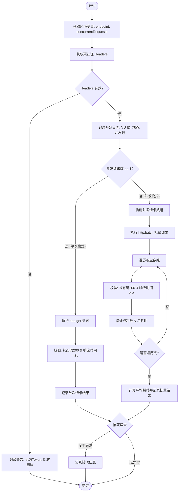

# `.\AutoGPT\autogpt_platform\backend\load-tests\tests\basic\single-endpoint-test.js` 详细设计文档

这是一个基于 K6 的性能测试脚本，旨在通过模拟并发虚拟用户（VU）来测试 AutoGPT 应用程序中单个 API 端点的性能瓶颈。脚本支持环境变量配置测试目标、并发数和持续时间，并集成了预认证机制，能够执行单次或批量并发请求，同时根据响应状态码和耗时记录测试结果与统计信息。

## 整体流程

```mermaid
graph TD
    A[开始: VU 迭代] --> B[获取环境变量: endpoint, concurrentRequests]
    B --> C[调用 getPreAuthenticatedHeaders 获取认证头]
    C --> D{Headers 有效?}
    D -- 否 --> E[记录警告日志并跳过]
    D -- 是 --> F{concurrentRequests == 1?}
    F -- 是 (单次请求模式) --> G[调用 http.get 发起请求]
    G --> H[检查响应状态(200)和耗时(<3s)]
    H --> I[记录成功/失败日志]
    F -- 否 (并发请求模式) --> J[构建请求数组]
    J --> K[调用 http.batch 批量发送]
    K --> L[遍历响应数组]
    L --> M[检查每个响应状态(200)和耗时(<5s)]
    M --> N[统计成功数并计算平均耗时]
    N --> O[记录聚合结果日志]
    E --> P[结束]
    I --> P
    O --> P
    P -.-> Q[捕获异常并记录错误]
    Q --> P
```

## 类结构

```
Script Module (api-endpoint-load-test.js)
├── Imports
│   ├── http (k6/http)
│   ├── check (k6)
│   ├── getEnvironmentConfig
│   └── getPreAuthenticatedHeaders
├── Global Variables
│   ├── config
│   └── options
└── Global Functions
    └── default function (主测试逻辑)
```

## 全局变量及字段


### `config`
    
存储从环境配置模块获取的配置信息，主要用于提供API基础地址等测试目标参数。

类型：`Object`
    


### `options`
    
K6负载测试的核心配置对象，定义了测试的加压阶段、性能阈值以及云服务项目ID。

类型：`Object`
    


    

## 全局函数及方法


### `default`

这是K6性能测试脚本的主入口函数，用于模拟虚拟用户（VU）行为。它根据环境变量配置的目标API端点执行性能测试。该函数支持两种测试模式：单次请求模式和并发请求模式。它会获取预认证的请求头，验证其有效性，然后发送HTTP请求，校验响应状态码和响应时间是否符合预期，并输出详细的测试日志，同时在出现错误时进行捕获和记录。

参数：

-   无

返回值：`void`，该函数主要执行测试逻辑和日志记录，不返回关键数据给调用者。

#### 流程图



#### 带注释源码

```javascript
export default function () {
  // 从环境变量获取测试的端点，默认为 "credits"
  const endpoint = __ENV.ENDPOINT || "credits"; 
  // 从环境变量获取并发请求数，默认为 1
  const concurrentRequests = parseInt(__ENV.CONCURRENT_REQUESTS) || 1;

  try {
    // 根据当前虚拟用户(VU) ID获取预认证的请求头
    const headers = getPreAuthenticatedHeaders(__VU);

    // 验证请求头是否有效，特别是 Authorization 字段
    if (!headers || !headers.Authorization) {
      console.log(
        `⚠️ VU ${__VU} has no valid pre-authentication token - skipping test`,
      );
      return; // 若无效则跳过本次迭代
    }

    console.log(
      `🚀 VU ${__VU} testing /api/${endpoint} with ${concurrentRequests} concurrent requests`,
    );

    if (concurrentRequests === 1) {
      // === 单次请求模式 ===
      const response = http.get(`${config.API_BASE_URL}/api/${endpoint}`, {
        headers,
      });

      // 检查响应状态码是否为200，且响应时间是否小于3秒
      const success = check(response, {
        [`${endpoint} API: Status is 200`]: (r) => r.status === 200,
        [`${endpoint} API: Response time < 3s`]: (r) =>
          r.timings.duration < 3000,
      });

      // 输出单次测试结果日志
      if (success) {
        console.log(
          `✅ VU ${__VU} /api/${endpoint} successful: ${response.timings.duration}ms`,
        );
      } else {
        console.log(
          `❌ VU ${__VU} /api/${endpoint} failed: ${response.status}, ${response.timings.duration}ms`,
        );
      }
    } else {
      // === 并发请求模式 ===
      const requests = [];
      // 构建请求数组
      for (let i = 0; i < concurrentRequests; i++) {
        requests.push({
          method: "GET",
          url: `${config.API_BASE_URL}/api/${endpoint}`,
          params: { headers },
        });
      }

      // 使用 http.batch 发送并发请求
      const responses = http.batch(requests);

      let successCount = 0;
      let totalTime = 0;

      // 遍历批量响应结果
      for (let i = 0; i < responses.length; i++) {
        const response = responses[i];
        // 检查每个响应的状态码是否为200，且响应时间是否小于5秒
        const success = check(response, {
          [`${endpoint} API Request ${i + 1}: Status is 200`]: (r) =>
            r.status === 200,
          [`${endpoint} API Request ${i + 1}: Response time < 5s`]: (r) =>
            r.timings.duration < 5000,
        });

        if (success) {
          successCount++;
        }
        totalTime += response.timings.duration;
      }

      // 计算平均响应时间并输出结果日志
      const avgTime = totalTime / responses.length;
      console.log(
        `✅ VU ${__VU} /api/${endpoint}: ${successCount}/${concurrentRequests} successful, avg: ${avgTime.toFixed(0)}ms`,
      );
    }
  } catch (error) {
    // 捕获并记录整个测试过程中的未处理异常
    console.error(`💥 VU ${__VU} error: ${error.message}`);
  }
}
```


## 关键组件


### 测试配置与阶段策略

定义负载测试的执行参数，包含阶梯式的压力测试阶段（爬坡、持续、衰减）、性能阈值（如成功率不低于 50%、P95 延迟低于 60s）以及 K6 Cloud 的项目 ID 和测试名称配置。

### 环境与认证上下文

负责从外部配置文件加载环境信息（API 基础 URL）并生成预认证的 HTTP 请求头，确保每个虚拟用户（VU）在执行测试前持有有效的授权 Token。

### 单请求执行模式

处理并发数为 1 时的测试逻辑，执行单个 HTTP GET 请求，并立即对响应的状态码（200）和响应时间（<3s）进行断言验证，输出详细的成功或失败日志。

### 批量并发执行模式

处理并发数大于 1 时的测试逻辑，利用 `http.batch` 方法构建并发请求队列，并行发送多个 HTTP 请求，统计成功数量并计算平均响应时间，以评估 API 在高并发下的性能表现。

### 响应断言与日志监控

通过 K6 的 `check` 函数对 API 响应结果进行业务规则验证，并结合 `console.log` 输出包含虚拟用户 ID、端点名称、状态码及耗时的详细调试信息。


## 问题及建议


### 已知问题

-   **控制台日志性能开销与可读性问题**：在高并发场景下，频繁使用 `console.log` 会产生显著的性能开销，影响测试结果的准确性。同时，大量的控制台输出导致日志难以解析和自动化分析。
-   **测试阈值设定过于宽松**：全局阈值配置（如成功率 > 50%、P95 < 60s）设置过低，可能导致严重的性能衰退或服务异常未能被及时发现，无法起到有效的质量门禁作用。
-   **硬编码的检查标准**：在代码逻辑中硬编码了响应时间的检查值（单请求 < 3000ms，并发请求 < 5000ms），这使得脚本无法灵活适应不同接口或不同环境下的性能指标要求。
-   **代码逻辑重复**：单请求模式与并发请求模式之间存在大量重复的逻辑（如 URL 拼接、请求头设置、响应状态检查），增加了维护成本和出错风险。

### 优化建议

-   **引入 K6 自定义指标**：使用 `const trend = new Trend('resp_time');` 和 `const rate = new Rate('success_rate');` 等自定义指标替代 `console.log`，将测试数据汇总到 K6 的内置结果输出或后端（如 Grafana），以便进行可视化和深度分析。
-   **参数化测试配置**：将关键参数（如响应时间阈值 `RESPONSE_TIME_THRESHOLD`、允许的最大失败率 `MAX_FAILURE_RATE` 等）提取为环境变量或配置文件参数，提高脚本的复用性和灵活性。
-   **重构代码消除重复**：将 HTTP 请求构造和响应检查逻辑封装为独立的通用函数（例如 `performRequest` 和 `checkResponse`），统一处理单次和批量请求场景，提升代码的可读性和可维护性。
-   **增强错误处理与日志结构化**：在 `catch` 块中增加更详细的上下文信息（如当前的 `endpoint`、`concurrentRequests` 数量等），并考虑使用 JSON 格式输出错误日志，便于后续通过日志工具进行检索和监控。
-   **调整合理的阈值基线**：根据实际业务 SLA 要求，调整全局 `thresholds` 设置（例如将 P95 调整为 500ms-2s 范围，成功率提升至 95%-99%），确保测试能真实反映用户体验。


## 其它


### 设计目标与约束

**设计目标**：
该脚本旨在通过隔离测试单个 API 端点来识别和定位性能瓶颈。设计支持灵活的负载模拟，包括可配置的爬坡时间、持续时间和并发虚拟用户数（VUs）。通过引入并发请求模式（`http.batch`），旨在测试单个虚拟用户在并发情况下的 API 表现，以及在高负载下的系统稳定性和响应时间。测试目标设定了较为宽松的阈值（如 50% 成功率和 P95 < 60s），表明其可能用于高压力下的极限测试或不稳定环境下的基准测试。

**设计约束**：
1. **运行时环境**：必须运行在 K6 测试框架环境中。
2. **认证依赖**：强依赖 `pre-authenticated-tokens.js` 提供的有效 Token，如果 Token 无效或缺失，测试逻辑将自动跳过。
3. **环境变量**：脚本的配置（如端点名称、VU 数量、持续时间等）高度依赖外部环境变量 (`__ENV`) 的注入，未提供时使用默认值。
4. **网络依赖**：测试结果的准确性受限于执行环境与目标 API 服务器之间的网络状况。

### 外部依赖与接口契约

**外部依赖**：
1. **K6 核心模块**：`k6/http` (用于发起 HTTP 请求), `k6` (内置 `check` 函数用于断言)。
2. **内部配置模块**：
   - `../../configs/environment.js`：提供 API 基础地址 (`API_BASE_URL`)。
   - `../../configs/pre-authenticated-tokens.js`：提供预认证的请求头 (`getPreAuthenticatedHeaders`)。
3. **目标 API 服务**：被测试的应用程序接口，需支持 HTTP GET 请求。

**接口契约**：
1. **输入契约**：
   - **环境变量**：接受 `ENDPOINT` (API 路径), `VUS` (虚拟用户数), `RAMP_UP`, `DURATION`, `RAMP_DOWN`, `CONCURRENT_REQUESTS` (单用户并发数) 等参数。
   - **配置函数**：`getPreAuthenticatedHeaders(vuId)` 需返回包含 `Authorization` 字段的对象。
2. **通信契约**：
   - **协议**：HTTP/HTTPS。
   - **方法**：GET。
   - **请求头**：必须包含合法的 Authorization Bearer Token。
   - **响应期望**：
     - 成功状态码：200。
     - 响应时间：单次请求 < 3s，批量请求 < 5s (Check 条件)。
     - 全局阈值：P95 响应时间 < 60s，成功率 > 50%。

### 错误处理与异常设计

1. **运行时异常捕获**：
   - 在 `default` 函数主体使用 `try...catch` 结构包裹所有核心逻辑。
   - 捕获到的任何同步错误（如网络配置错误、对象属性访问错误等）将通过 `console.error` 记录错误信息及 VU ID，防止单个 VU 的异常导致整个脚本崩溃。

2. **前置条件校验**：
   - 在发起请求前，显式检查 `headers` 对象是否存在以及 `headers.Authorization` 是否有值。
   - 若校验失败，打印警告日志 (`⚠️`) 并执行 `return` 语句，提前终止当前迭代，避免发送无认证的无效请求。

3. **业务逻辑断言**：
   - 使用 K6 的 `check` 函数进行非阻断式断言。检查 HTTP 响应的状态码是否为 200 以及响应时间是否在预期范围内。
   - 断言失败不会抛出异常，但会记录到 K6 的内部指标中，用于后续生成测试报告和触发阈值告警。

4. **阈值告警机制**：
   - 配置了 `thresholds`，如果测试结束时的 `checks` 成功率低于 50% 或 P95 响应时间超过 60s，K6 进程将返回非零退出码，指示 CI/CD 流程或其他监控系统测试未达标。

### 数据流与状态机

**数据流**：
1. **初始化流**：
   - 脚本加载 -> 导入配置模块 (`environment`, `pre-authenticated-tokens`)。
   - 解析环境变量 (`__ENV`) -> 构建 `options` 对象 (负载测试阶段、阈值配置)。
2. **执行流**：
   - VU 启动 -> 调用 `getPreAuthenticatedHeaders(__VU)` 获取认证凭证。
   - **决策分支**：根据 `CONCURRENT_REQUESTS` 参数选择执行路径：
     - **路径 A (并发数=1)**：构建单个请求对象 -> 执行 `http.get` -> 执行单次 `check` -> 记录结果日志。
     - **路径 B (并发数>1)**：循环构建请求数组 -> 执行 `http.batch` -> 循环遍历响应数组 -> 对每个响应执行 `check` -> 聚合统计总耗时和成功数 -> 计算平均值 -> 记录汇总日志。
   - **异常流**：任何步骤发生错误 -> 进入 `catch` 块 -> 记录错误日志。

**状态机**：
脚本本身是无状态的（Stateless），主要状态由 K6 引擎控制：
- **Init**：全局代码执行，加载配置。
- **Setup** (未显式使用，但在引擎概念中存在)。
- **VU Execution (Running)**：
  - **Idle**：等待调度。
  - **Active**：执行 `default` 函数。
    - 状态 1：校验 Token。
    - 状态 2：执行请求 (串行或并行)。
    - 状态 3：处理响应与校验。
    - 状态 4：日志输出与休眠。
- **Ramp Down**：VU 数量逐渐归零。
- **End**：测试结束，输出汇总报告，根据阈值判断最终状态。


    