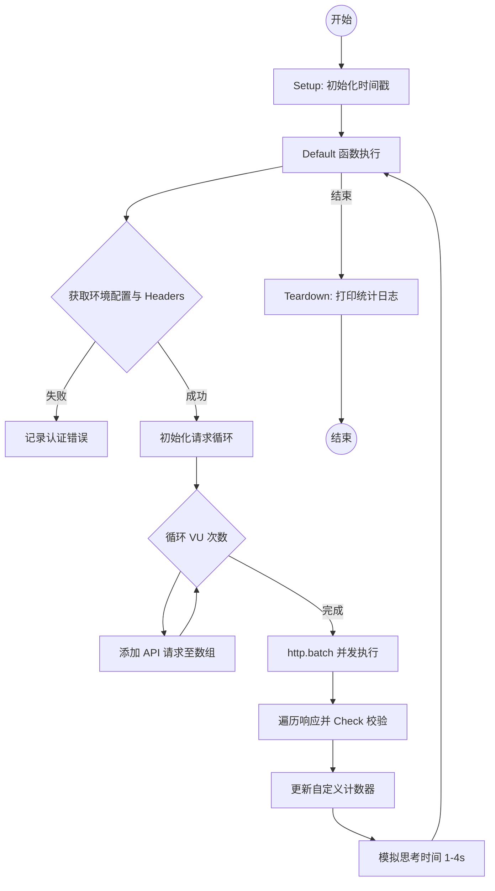
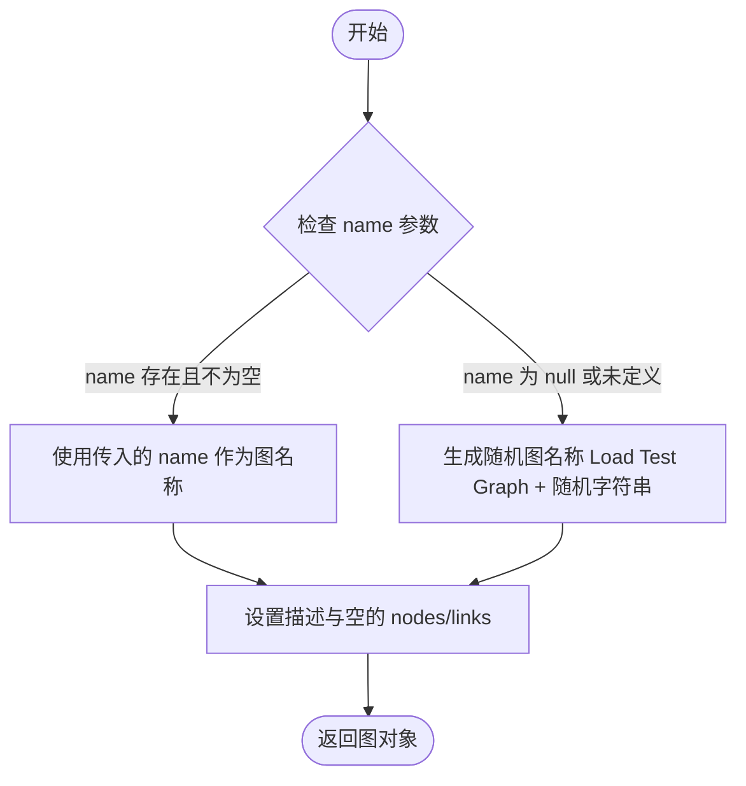
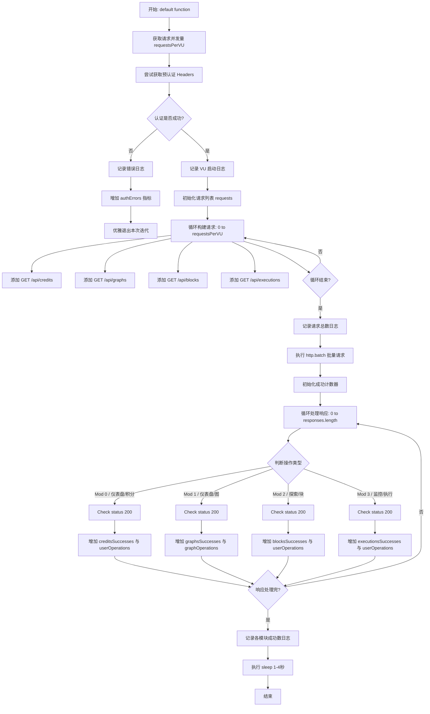
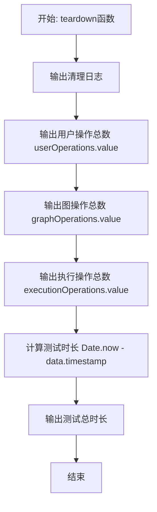
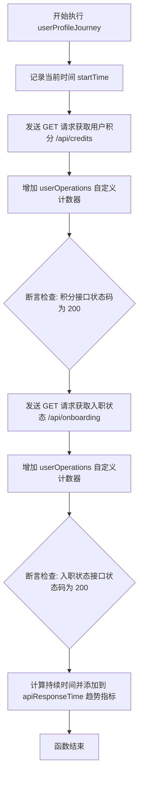
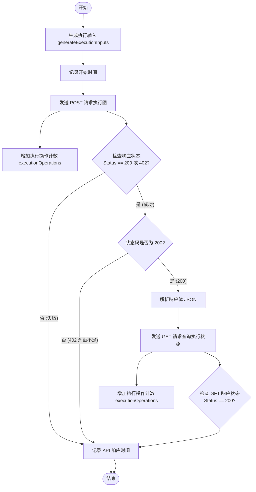
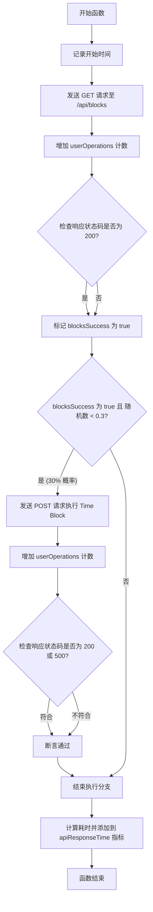
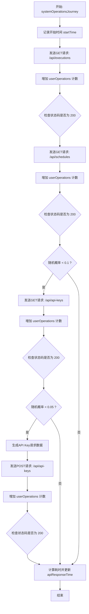

# `.\AutoGPT\autogpt_platform\backend\load-tests\tests\comprehensive\platform-journey-test.js` 详细设计文档

该代码是一个基于 k6 的性能测试脚本，用于模拟多用户并发访问 AutoGPT 平台 API，涵盖了仪表盘查看、图谱管理、模块探索及执行监控等核心业务流程，并实现了自定义指标的收集与响应时间的监控。

## 整体流程



## 类结构

```
Script Structure (Functional JavaScript)
├── Configurations & Imports (配置与导入)
├── Data Generators (数据生成工具)
├── Custom Metrics (自定义性能指标)
├── K6 Options (K6 测试配置)
├── Lifecycle Functions (生命周期函数)
│   ├── setup
│   ├── default
│   └── teardown
└── Helper Scenarios (辅助场景函数 - 未在 default 中直接调用)
    ├── userProfileJourney
    ├── graphManagementJourney
    ├── executeGraphScenario
    ├── createScheduleScenario
    ├── blockOperationsJourney
    └── systemOperationsJourney
```

## 全局变量及字段


### `config`
    
从环境配置中获取的配置对象，包含 API_BASE_URL 等运行时环境信息。

类型：`Object`
    


### `userOperations`
    
K6 自定义计数器指标，用于统计测试期间用户相关操作的总次数。

类型：`Counter`
    


### `graphOperations`
    
K6 自定义计数器指标，用于统计测试期间图相关操作的总次数。

类型：`Counter`
    


### `executionOperations`
    
K6 自定义计数器指标，用于统计测试期间执行相关操作的总次数。

类型：`Counter`
    


### `apiResponseTime`
    
K6 自定义趋势指标，用于记录和统计 API 响应时间的分布情况。

类型：`Trend`
    


### `authErrors`
    
K6 自定义比率指标，用于统计认证失败或错误发生的比率。

类型：`Rate`
    


### `options`
    
K6 测试配置对象，定义了负载测试的阶段（VUs）、阈值、超时及云项目配置。

类型：`Object`
    


    

## 全局函数及方法


### `generateTestGraph`

该函数用于在负载测试场景中生成模拟的图数据结构，支持自定义图名称或自动生成随机名称。

参数：

- `name`：`string | null`，可选参数，用于指定生成的图对象的名称。如果未提供或为 null，则自动生成随机名称。

返回值：`object`，返回一个包含名称、描述及空节点和链接结构的图对象。

#### 流程图



#### 带注释源码

```javascript
function generateTestGraph(name = null) {
  // 确定图名称：如果传入了 name 参数则使用，否则生成 "Load Test Graph " 加上 9 位随机字符串
  const graphName =
    name || `Load Test Graph ${Math.random().toString(36).substr(2, 9)}`;
  
  // 返回符合 API 格式的图数据对象
  return {
    name: graphName,
    description: "Generated graph for load testing purposes",
    graph: {
      nodes: [],
      links: [],
    },
  };
}
```


### `generateExecutionInputs`

该函数是一个内联测试数据生成器，用于为负载测试场景生成静态的图执行输入数据。

参数：

*（无）*

返回值：`Object`，包含测试输入数据的对象，结构为 `{ test_input: "load_test_value" }`。

#### 流程图

```mermaid
flowchart TD
    Start([开始]) --> CreateObject[创建对象: { test_input: 'load_test_value' }]
    CreateObject --> Return([返回对象])
    Return --> End([结束])
```

#### 带注释源码

```javascript
// 内联测试数据生成器（从 utils/test-data.js 简化而来）
function generateExecutionInputs() {
  // 返回一个包含预定义值的对象，用于模拟负载测试场景下的执行输入
  return { test_input: "load_test_value" };
}
```


### `generateScheduleData`

该函数是一个内联测试数据生成器，用于创建负载测试场景中的模拟调度配置数据。它返回一个表示禁用状态的配置对象。

参数：

-  无

返回值：`Object`，包含 `enabled: false` 属性的配置对象，用于模拟禁用调度的场景。

#### 流程图

```mermaid
flowchart TD
    Start([开始]) --> ReturnObj[返回对象 { enabled: false }]
    ReturnObj --> End([结束])
```

#### 带注释源码

```javascript
function generateScheduleData() {
  // 返回一个禁用状态的调度配置对象
  // 用于模拟负载测试中不需要实际触发调度执行的场景
  return { enabled: false };
}
```


### `generateAPIKeyRequest`

该函数用于生成负载测试场景中创建API密钥所需的请求数据对象，提供了一个固定的名称字段供测试使用。

参数：

-  `无`

返回值：`Object`，包含 `name` 属性的请求体对象，用于模拟API密钥创建请求。

#### 流程图

```mermaid
graph TD
    A[开始] --> B[返回对象 { name: 'Load Test API Key' }]
    B --> C[结束]
```

#### 带注释源码

```javascript
/**
 * 生成用于负载测试的 API 密钥创建请求数据。
 *
 * @returns {Object} 包含固定名称属性的请求体对象。
 */
function generateAPIKeyRequest() {
  // 返回一个包含预设名称的对象，用于在负载测试中模拟创建 API Key 的请求负载
  return { name: "Load Test API Key" };
}
```


### `setup`

负载测试的初始化函数，在测试开始阶段执行一次，负责记录测试开始的时间戳并返回，以便后续计算测试总时长。

参数：

-  无

返回值：`object`，包含 `timestamp` 字段（number类型），表示测试开始时的毫秒时间戳。

#### 流程图

```mermaid
graph TD
    A[开始执行 setup] --> B[输出日志: Setting up load test scenario]
    B --> C[获取当前时间 Date.now]
    C --> D[构建返回数据对象 {timestamp}]
    D --> E[返回对象]
    E --> F[结束]
```

#### 带注释源码

```javascript
export function setup() {
  // 向控制台输出初始化开始的日志信息
  console.log("🎯 Setting up load test scenario...");

  // 返回一个包含当前时间戳的对象
  // 该数据会被传递给 default function 和 teardown function
  return {
    timestamp: Date.now(),
  };
}
```


### `default`

AutoGPT 平台负载测试的核心主函数，负责模拟虚拟用户（VU）的并发行为，构建多类别的用户工作流请求（如仪表盘检查、图浏览、块探索和执行监控），批量执行这些请求，并根据响应结果进行校验和自定义指标统计。

参数：

- `data`：`object`，由 `setup` 函数传入的数据，通常包含测试开始的时间戳等初始化信息。

返回值：`void`，该函数不返回具体值，主要用于执行副作用（发起 HTTP 请求、记录指标）。

#### 流程图



#### 带注释源码

```javascript
export default function (data) {
  // 获取负载倍数 - 每个 VU 应该模拟多少个并发的用户旅程
  const requestsPerVU = parseInt(__ENV.REQUESTS_PER_VU) || 1;

  let headers;

  try {
    // 尝试获取预认证的请求头
    headers = getPreAuthenticatedHeaders(__VU);
  } catch (error) {
    console.error(`❌ Authentication failed:`, error);
    // 记录认证错误率
    authErrors.add(1);
    return;
  }

  // 优雅地处理认证失败情况
  if (!headers || !headers.Authorization) {
    console.log(
      `⚠️ VU ${__VU} has no valid pre-authentication token - skipping comprehensive platform test`,
    );
    check(null, {
      "Comprehensive Platform: Failed gracefully without crashing VU": () =>
        true,
    });
    return; // 优雅地退出迭代，不导致 VU 崩溃
  }

  console.log(
    `🚀 VU ${__VU} simulating ${requestsPerVU} realistic user workflows...`,
  );

  // 为所有用户旅程创建并发请求
  const requests = [];

  // 模拟真实的用户工作流，而不仅仅是简单的 API 疯狂请求
  for (let i = 0; i < requestsPerVU; i++) {
    // 工作流 1: 用户检查他们的仪表盘
    requests.push({
      method: "GET",
      url: `${config.API_BASE_URL}/api/credits`,
      params: { headers },
    });
    requests.push({
      method: "GET",
      url: `${config.API_BASE_URL}/api/graphs`,
      params: { headers },
    });

    // 工作流 2: 用户浏览可用的构建代理的块
    requests.push({
      method: "GET",
      url: `${config.API_BASE_URL}/api/blocks`,
      params: { headers },
    });

    // 工作流 3: 用户监控他们最近的执行记录
    requests.push({
      method: "GET",
      url: `${config.API_BASE_URL}/api/executions`,
      params: { headers },
    });
  }

  console.log(
    `📊 Executing ${requests.length} requests across realistic user workflows...`,
  );

  // 并发执行所有请求
  const responses = http.batch(requests);

  // 处理结果并统计成功次数
  let creditsSuccesses = 0,
    graphsSuccesses = 0,
    blocksSuccesses = 0,
    executionsSuccesses = 0;

  for (let i = 0; i < responses.length; i++) {
    const response = responses[i];
    const operationType = i % 4; // 每组 4 个请求: 0=credits, 1=graphs, 2=blocks, 3=executions

    switch (operationType) {
      case 0: // 仪表盘: 检查积分
        if (
          check(response, {
            "Dashboard: User credits loaded successfully": (r) =>
              r.status === 200,
          })
        ) {
          creditsSuccesses++;
          userOperations.add(1);
        }
        break;
      case 1: // 仪表盘: 查看图
        if (
          check(response, {
            "Dashboard: User graphs loaded successfully": (r) =>
              r.status === 200,
          })
        ) {
          graphsSuccesses++;
          graphOperations.add(1);
        }
        break;
      case 2: // 探索: 浏览可用块
        if (
          check(response, {
            "Block Explorer: Available blocks loaded successfully": (r) =>
              r.status === 200,
          })
        ) {
          blocksSuccesses++;
          userOperations.add(1);
        }
        break;
      case 3: // 监控: 检查执行历史
        if (
          check(response, {
            "Execution Monitor: Recent executions loaded successfully": (r) =>
              r.status === 200,
          })
        ) {
          executionsSuccesses++;
          userOperations.add(1);
        }
        break;
    }
  }

  console.log(
    `✅ VU ${__VU} completed realistic workflows: ${creditsSuccesses} dashboard checks, ${graphsSuccesses} graph views, ${blocksSuccesses} block explorations, ${executionsSuccesses} execution monitors`,
  );

  // 用户会话之间的思考时间
  sleep(Math.random() * 3 + 1); // 1-4 秒
}
```


### `teardown`

负载测试结束后的清理钩子函数，负责将测试期间积累的自定义指标（用户操作数、图操作数、执行操作数）以及基于 setup 时间戳计算出的总测试时长输出到控制台。

参数：

-  `data`：`Object`，从 setup 函数传递的数据对象，包含测试开始的时间戳 (`timestamp`)。

返回值：`void`，无返回值，仅执行日志记录。

#### 流程图



#### 带注释源码

```javascript
export function teardown(data) {
  // 输出清理提示信息，表明测试进入收尾阶段
  console.log("🧹 Cleaning up load test...");

  // 输出累计的用户相关操作总数（自定义计数器指标）
  console.log(`Total user operations: ${userOperations.value}`);

  // 输出累计的图相关操作总数（自定义计数器指标）
  console.log(`Total graph operations: ${graphOperations.value}`);

  // 输出累计的执行相关操作总数（自定义计数器指标）
  console.log(`Total execution operations: ${executionOperations.value}`);

  // 计算并记录总测试持续时间（当前时间减去setup阶段记录的时间戳）
  const testDuration = Date.now() - data.timestamp;
  console.log(`Test completed in ${testDuration}ms`);
}
```


### `userProfileJourney`

该函数模拟用户访问个人资料相关页面的负载测试场景，通过检查用户的信用点数和入职状态来验证用户个人资料相关接口的性能和可用性。

参数：

- `headers`：`Object`，包含认证信息（如 Authorization token）的 HTTP 请求头对象。

返回值：`void`，该函数不返回任何值，主要用于发起 HTTP 请求、记录自定义指标和执行断言检查。

#### 流程图



#### 带注释源码

```javascript
function userProfileJourney(headers) {
  // 记录函数开始执行的时间戳，用于计算后续操作的总体响应时间
  const startTime = Date.now();

  // 1. 获取用户积分信息 (这是一个仅需要 JWT 认证的端点)
  const creditsResponse = http.get(`${config.API_BASE_URL}/api/credits`, {
    headers,
  });

  // 增加用户操作计数器的值，用于统计总操作数
  userOperations.add(1);

  // 对获取积分的响应进行检查，验证状态码是否为 200
  check(creditsResponse, {
    "User credits loaded successfully": (r) => r.status === 200,
  });

  // 2. 检查用户的入职状态
  const onboardingResponse = http.get(`${config.API_BASE_URL}/api/onboarding`, {
    headers,
  });

  // 再次增加用户操作计数器
  userOperations.add(1);

  // 对入职状态的响应进行检查，验证状态码是否为 200
  check(onboardingResponse, {
    "Onboarding status loaded": (r) => r.status === 200,
  });

  // 计算本次旅程的总耗时，并添加到自定义的响应时间趋势指标中
  apiResponseTime.add(Date.now() - startTime);
}
```


### `graphManagementJourney`

该函数模拟了一个完整的图管理用户旅程，包括列出现有图、随机创建新图、查看图详情、以及按概率触发图执行和创建调度计划，旨在通过随机化的用户行为测试图管理API的性能和稳定性。

参数：

-  `headers`：`Object`，包含认证信息的HTTP请求头（通常包含Authorization字段）。

返回值：`void`，函数无返回值，主要通过执行HTTP请求和更新自定义指标来产生副作用。

#### 流程图

```mermaid
graph TD
    A[开始: 记录开始时间] --> B[GET /api/graphs 获取图列表]
    B --> C[graphOperations.add 1]
    C --> D{检查响应状态是否为 200}
    D -->|是| E{随机数 < 0.2? (创建新图)}
    D -->|否| Z[结束]
    
    %% 创建新图分支
    E -->|是| F[generateTestGraph 生成测试数据]
    F --> G[POST /api/graphs 创建新图]
    G --> H[graphOperations.add 1]
    H --> I{检查创建状态}
    I -->|成功| J[解析响应获取 createdGraph]
    J --> K[GET /api/graphs/{id} 获取详情]
    K --> L[graphOperations.add 1]
    L --> M{检查详情状态}
    M -->|成功| N{随机数 < 0.5? (执行图)}
    N -->|是| O[executeGraphScenario]
    N -->|否| P{随机数 < 0.1? (创建调度)}
    P -->|是| Q[createScheduleScenario]
    O --> R[记录API响应时间]
    Q --> R
    
    %% 使用现有图分支
    E -->|否| S{列表成功且图数量 > 0?}
    D -->|是| S
    S -->|是| T[随机选择一个图]
    T --> U[GET /api/graphs/{id} 获取详情]
    U --> V[graphOperations.add 1]
    V --> W[检查详情状态]
    W -->|成功| X{随机数 < 0.3? (执行图)}
    X -->|是| Y[executeGraphScenario]
    X -->|否| R
    Y --> R
    
    %% 结束
    S -->|否| R
    I -->|失败| R
    M -->|失败| R
    R --> Z[结束]
```

#### 带注释源码

```javascript
function graphManagementJourney(headers) {
  // 记录函数开始时间，用于计算API响应时间
  const startTime = Date.now();

  // 1. 列出现有的图
  const listResponse = http.get(`${config.API_BASE_URL}/api/graphs`, {
    headers,
  });

  // 增加图操作计数器
  graphOperations.add(1);

  // 检查列表请求是否成功 (HTTP 200)
  const listSuccess = check(listResponse, {
    "Graphs list loaded successfully": (r) => r.status === 200,
  });

  // 2. 模拟创建新图的操作 (20% 的概率执行)
  if (Math.random() < 0.2) {
    const graphData = generateTestGraph(); // 生成随机图数据

    const createResponse = http.post(
      `${config.API_BASE_URL}/api/graphs`,
      JSON.stringify(graphData),
      { headers },
    );

    graphOperations.add(1);

    // 检查创建请求是否成功
    const createSuccess = check(createResponse, {
      "Graph created successfully": (r) => r.status === 200,
    });

    // 如果创建成功，进行后续操作
    if (createSuccess && createResponse.status === 200) {
      try {
        const createdGraph = JSON.parse(createResponse.body);

        // 3. 获取刚创建的图的详细信息
        const getResponse = http.get(
          `${config.API_BASE_URL}/api/graphs/${createdGraph.id}`,
          { headers },
        );

        graphOperations.add(1);

        check(getResponse, {
          "Graph details loaded": (r) => r.status === 200,
        });

        // 4. 执行该图 (50% 的概率)
        if (Math.random() < 0.5) {
          executeGraphScenario(createdGraph, headers);
        }

        // 5. 为该图创建调度计划 (10% 的概率)
        if (Math.random() < 0.1) {
          createScheduleScenario(createdGraph.id, headers);
        }
      } catch (error) {
        console.error("Error handling created graph:", error);
      }
    }
  }

  // 3. 模拟操作现有图 (如果列表获取成功且有数据)
  if (listSuccess && listResponse.status === 200) {
    try {
      const existingGraphs = JSON.parse(listResponse.body);

      if (existingGraphs.length > 0) {
        // 从现有列表中随机选取一个图
        const randomGraph =
          existingGraphs[Math.floor(Math.random() * existingGraphs.length)];

        // 获取该图的详细信息
        const getResponse = http.get(
          `${config.API_BASE_URL}/api/graphs/${randomGraph.id}`,
          { headers },
        );

        graphOperations.add(1);

        check(getResponse, {
          "Existing graph details loaded": (r) => r.status === 200,
        });

        // 执行现有的图 (30% 的概率)
        if (Math.random() < 0.3) {
          executeGraphScenario(randomGraph, headers);
        }
      }
    } catch (error) {
      console.error("Error working with existing graphs:", error);
    }
  }

  // 记录整个旅程的API响应时间到趋势指标
  apiResponseTime.add(Date.now() - startTime);
}
```


### `executeGraphScenario`

该函数模拟用户执行特定图工作流的过程。它生成执行输入数据，向指定图的执行接口发起 POST 请求以触发执行，并处理可能出现的余额不足（402）状态。如果执行成功（状态码 200），它会进一步发送 GET 请求查询执行状态，模拟用户监控结果的场景，同时记录操作计数和 API 响应时间等性能指标。

参数：

-  `graph`：`Object`，包含图信息的对象，必须包含 `id` 和 `version` 字段，用于标识要执行的图及其版本。
-  `headers`：`Object`，包含认证信息（如 Authorization）的 HTTP 请求头对象，用于通过 API 验证。

返回值：`void`，无返回值。函数主要执行 HTTP 请求副作用并记录自定义指标。

#### 流程图



#### 带注释源码

```javascript
function executeGraphScenario(graph, headers) {
  // 记录开始时间，用于计算 API 响应时间
  const startTime = Date.now();

  // 生成执行图所需的输入数据
  const executionInputs = generateExecutionInputs();

  // 发送 POST 请求以触发图的执行
  const executeResponse = http.post(
    `${config.API_BASE_URL}/api/graphs/${graph.id}/execute/${graph.version}`,
    JSON.stringify({
      inputs: executionInputs,
      credentials_inputs: {},
    }),
    { headers },
  );

  // 记录执行操作次数
  executionOperations.add(1);

  // 检查响应：成功为 200，余额不足为 402 (视为业务逻辑正常，非系统错误)
  const executeSuccess = check(executeResponse, {
    "Graph execution initiated": (r) => r.status === 200 || r.status === 402,
  });

  // 如果执行成功且状态码为 200（即非余额不足情况），则进行状态监控
  if (executeSuccess && executeResponse.status === 200) {
    try {
      // 解析执行响应，获取执行 ID
      const execution = JSON.parse(executeResponse.body);

      // 监控执行状态（模拟用户检查结果）
      // 注意：k6 中不支持 setTimeout，所以这里立即检查状态
      const statusResponse = http.get(
        `${config.API_BASE_URL}/api/graphs/${graph.id}/executions/${execution.id}`,
        { headers },
      );

      // 记录执行查询操作次数
      executionOperations.add(1);

      // 检查状态查询请求是否成功
      check(statusResponse, {
        "Execution status retrieved": (r) => r.status === 200,
      });
    } catch (error) {
      console.error("Error monitoring execution:", error);
    }
  }

  // 记录该场景的 API 响应时间
  apiResponseTime.add(Date.now() - startTime);
}
```


### `createScheduleScenario`

模拟为特定的图 ID 创建调度计划的负载测试场景，发送 POST 请求并验证响应状态。

参数：

- `graphId`：`string | number`，要创建调度计划的目标图的唯一标识符。
- `headers`：`Object`，包含认证信息（如 Authorization 令牌）的 HTTP 请求头对象。

返回值：`void`，该函数不返回任何值，主要用于执行副作用（发送请求、记录指标）。

#### 流程图

```mermaid
flowchart TD
    A[开始: createScheduleScenario] --> B[调用 generateScheduleData 生成负载测试数据]
    B --> C[发送 HTTP POST 请求至 /api/graphs/{graphId}/schedules]
    C --> D[增加 graphOperations 计数器]
    D --> E{检查响应状态码是否为 200}
    E -->|是| F[断言: Schedule created successfully]
    E -->|否| G[断言失败]
    F --> H[结束]
    G --> H
```

#### 带注释源码

```javascript
function createScheduleScenario(graphId, headers) {
  // 生成用于创建调度的测试数据
  // 注意：虽然这里传入了 graphId，但根据定义 generateScheduleData 实际上不使用参数
  const scheduleData = generateScheduleData(graphId);

  // 发送 POST 请求创建调度计划
  const scheduleResponse = http.post(
    `${config.API_BASE_URL}/api/graphs/${graphId}/schedules`,
    JSON.stringify(scheduleData),
    { headers },
  );

  // 增加图操作的自定义计数器
  graphOperations.add(1);

  // 检查响应状态码是否为 200，验证调度是否创建成功
  check(scheduleResponse, {
    "Schedule created successfully": (r) => r.status === 200,
  });
}
```


### `blockOperationsJourney`

模拟用户在平台上探索可用区块并按概率执行特定区块（如时间区块）的负载测试场景，旨在验证区块列表的加载性能以及单个区块执行的稳定性。

参数：

-  `headers`：`object`，包含认证信息（如 Authorization token）的 HTTP 请求头对象。

返回值：`void`，无显式返回值，主要执行 HTTP 请求并更新自定义性能指标。

#### 流程图



#### 带注释源码

```javascript
function blockOperationsJourney(headers) {
  // 记录函数开始的时间戳，用于计算后续 API 调用的总耗时
  const startTime = Date.now();

  // 1. 获取可用区块列表
  const blocksResponse = http.get(`${config.API_BASE_URL}/api/blocks`, {
    headers,
  });

  // 记录一次用户操作指标
  userOperations.add(1);

  // 检查获取区块列表的请求是否成功 (HTTP 200)
  const blocksSuccess = check(blocksResponse, {
    "Blocks list loaded": (r) => r.status === 200,
  });

  // 2. 模拟直接执行某些区块以进行测试（30% 的概率触发）
  if (blocksSuccess && Math.random() < 0.3) {
    // 执行 GetCurrentTimeBlock（一个简单、快速的区块）
    const timeBlockResponse = http.post(
      `${config.API_BASE_URL}/api/blocks/a892b8d9-3e4e-4e9c-9c1e-75f8efcf1bfa/execute`,
      JSON.stringify({
        trigger: "test",
        format_type: {
          discriminator: "iso8601",
          timezone: "UTC",
        },
      }),
      { headers },
    );

    // 记录一次用户操作指标
    userOperations.add(1);

    // 检查执行结果
    // 注意：接受 500 状态码，因为在缺少 user_context 的情况下这是预期的错误行为
    check(timeBlockResponse, {
      "Time block executed or handled gracefully": (r) =>
        r.status === 200 || r.status === 500,
    });
  }

  // 记录该次 Journey 的总响应时间到自定义指标
  apiResponseTime.add(Date.now() - startTime);
}
```


### `systemOperationsJourney`

该函数模拟用户在平台中执行系统级监控和管理操作的用户旅程，包括获取执行历史列表、获取定时任务列表，以及基于特定概率检查或创建API密钥，同时记录操作指标和API响应时间。

参数：

-  `headers`：`Object`，包含认证信息的HTTP请求头（如Authorization），用于API调用鉴权。

返回值：`undefined`，该函数主要为副作用（发送HTTP请求、记录指标）而设计，不返回具体数值。

#### 流程图



#### 带注释源码

```javascript
function systemOperationsJourney(headers) {
  // 记录函数开始执行的时间戳，用于计算API响应时间
  const startTime = Date.now();

  // 1. 检查执行列表（模拟监控功能）
  // 发送GET请求获取执行历史，模拟用户查看过往任务运行情况
  const executionsResponse = http.get(`${config.API_BASE_URL}/api/executions`, {
    headers,
  });

  // 记录一次用户操作指标
  userOperations.add(1);

  // 验证响应状态码是否为200，用于判断请求是否成功
  check(executionsResponse, {
    "Executions list loaded": (r) => r.status === 200,
  });

  // 2. 检查定时任务列表（如果存在）
  // 发送GET请求获取所有计划任务
  const schedulesResponse = http.get(`${config.API_BASE_URL}/api/schedules`, {
    headers,
  });

  // 记录一次用户操作指标
  userOperations.add(1);

  // 验证响应状态码是否为200
  check(schedulesResponse, {
    "Schedules list loaded": (r) => r.status === 200,
  });

  // 3. 检查API密钥（模拟用户管理访问权限）
  // 通过随机数模拟，只有10%的用户会执行此分支
  if (Math.random() < 0.1) {
    // 发送GET请求获取API密钥列表
    const apiKeysResponse = http.get(`${config.API_BASE_URL}/api/api-keys`, {
      headers,
    });

    // 记录一次用户操作指标
    userOperations.add(1);

    // 验证响应状态码是否为200
    check(apiKeysResponse, {
      "API keys list loaded": (r) => r.status === 200,
    });

    // 偶尔创建新的API密钥（5%概率）
    if (Math.random() < 0.05) {
      // 生成创建API密钥所需的请求体数据
      const keyData = generateAPIKeyRequest();

      // 发送POST请求创建新的API密钥
      const createKeyResponse = http.post(
        `${config.API_BASE_URL}/api/api-keys`,
        JSON.stringify(keyData),
        { headers },
      );

      // 记录一次用户操作指标
      userOperations.add(1);

      // 验证响应状态码是否为200
      check(createKeyResponse, {
        "API key created successfully": (r) => r.status === 200,
      });
    }
  }

  // 计算整个旅程的耗时，并记录到响应时间趋势指标中
  apiResponseTime.add(Date.now() - startTime);
}
```


## 关键组件


### 负载测试配置引擎

定义并管理 K6 测试的生命周期、阶段、阈值和云执行参数，控制虚拟用户的爬升、持续和爬降策略，以模拟不同程度的负载压力。

### 认证与会话管理器

负责处理虚拟用户的认证流程，利用预认证令牌初始化请求头，并包含容错机制，在认证失败时优雅地跳过测试而非中断执行。

### 实时工作流模拟器

核心执行逻辑，模拟真实用户在平台上的并发行为，包括查看积分仪表盘、浏览图谱、探索可用区块和监控执行历史，通过批量 HTTP 请求提高并发效率。

### 可观测性指标收集器

一组自定义的 K6 指标，用于跟踪特定的业务操作（如用户操作、图谱操作、执行操作）以及认证错误和 API 响应时间趋势，提供比原生 HTTP 指标更高层次的业务洞察。

### 动态测试数据合成器

提供生成模拟测试数据的工具函数（如图谱结构、执行输入、调度数据），用于在负载测试中动态创建有效的 API 请求负载，支持写操作的性能测试。


## 问题及建议


### 已知问题

-   **死代码与功能缺失**: 代码定义了 `graphManagementJourney`、`executeGraphScenario`、`blockOperationsJourney` 等复杂的写操作和业务流程函数，但在 `default` 函数中并未被调用。目前的测试仅执行了简单的并发 GET 请求（积分、图、块、执行列表），未覆盖创建图、执行任务、创建计划等写操作，导致测试名为“全平台集成测试”实为“仪表盘读取测试”。
-   **脆弱的响应处理逻辑**: `default` 函数中使用 `switch (operationType)` 配合 `i % 4` 来判断响应类型。这种逻辑高度依赖于请求构建循环中 `push` 语句的顺序和数量。如果后续维护中调整了请求的数量或顺序，会导致统计分类完全错乱。
-   **硬编码的业务数据**: `blockOperationsJourney` 函数中硬编码了 Block ID (`a892b8d9-3e4e-4e9c-9c1e-75f8efcf1bfa`)，如果目标环境中该 ID 不存在或已被删除，将导致该部分测试无法验证功能。
-   **Teardown 统计数据不准确**: `teardown` 函数中尝试打印 `userOperations.value` 等自定义指标的值。在 k6 中，自定义指标通常在测试结束时由引擎聚合，直接在 VU 上下文中访问 `.value` 属性往往只能获取到当前 VU 本地的计数（甚至可能未定义），无法准确反映整个测试运行的全局总量，容易产生误导性日志。

### 优化建议

-   **重构主流程以覆盖全业务场景**: 建议重构 `default` 函数，将未使用的 `graphManagementJourney` 等函数纳入执行流。可以通过配置或随机权重（如 80% 读操作，20% 写操作）来混合调用这些旅程函数，以真实模拟用户行为并达到“全平台集成测试”的目标。
-   **改进响应匹配机制**: 建议利用 k6 的 `http.batch` 返回的响应对象特性，通过 `response.request.url` 或请求标记（如果 k6 版本支持）来匹配具体的检查逻辑，避免使用数组索引取模（`i % 4`）这种脆弱的硬编码方式。
-   **参数化配置与数据管理**: 将硬编码的 Block ID、概率阈值（如创建图的 20% 概率）提取到环境变量或 `PERFORMANCE_CONFIG` 配置文件中。这不仅能解决硬编码问题，还能在不修改代码的情况下灵活调整测试场景的负载模型。
-   **调整阈值与断言标准**: 当前 `thresholds` 中 `checks: ["rate>0.50"]` 允许 50% 的失败率，这对于常规负载测试来说过于宽松，只有在极端压力测试下才适用。建议针对不同阶段设置更合理的阈值（如 `rate>0.95`），以便及时发现系统的性能退化。
-   **增强错误处理与上下文传递**: 在 `default` 函数中，如果认证失败直接 `return` 会导致该 VU 在该周期内静默。建议在日志中增加 VU ID 和 Iteration ID 的关联，便于在分布式测试（如 k6 Cloud）中追踪特定错误的上下文。同时，对于解析失败（JSON.parse）的情况，增加响应体的摘要输出，以便排查 API 返回格式错误的问题。


## 其它


### 设计目标与约束

1.  **设计目标**
    *   **全平台集成测试**：模拟真实用户在 AutoGPT 平台上的完整操作流程，包括仪表盘查看、图表管理、积木探索和执行监控，而非单一接口的简单压测。
    *   **高并发稳定性验证**：通过阶梯式加压，验证系统在高并发下的 API 响应时间（P95 < 60s, P99 < 60s）和系统稳定性。
    *   **真实场景模拟**：引入了“思考时间”（Sleep 1-4s）和基于权重的操作分支（如 20% 用户创建图表，50% 执行图表），以更贴近真实用户行为。

2.  **约束条件**
    *   **环境变量驱动**：测试配置必须通过环境变量（`__ENV.VUS`, `__ENV.DURATION` 等）或配置文件注入，确保灵活性。
    *   **预认证依赖**：脚本严重依赖 `getPreAuthenticatedHeaders` 提供的有效 JWT Token，若无有效 Token，该 VU 将跳过测试。
    *   **超时限制**：Setup 和 Teardown 阶段限制为 60s，防止初始化或清理卡死导致测试无法正常结束。
    *   **阈值约束**：允许一定的失败率（< 50%）以适应高负载下的复杂操作，但通过率需保持在 50% 以上。
    *   **非阻塞执行**：禁用 `setTimeout`，所有状态检查必须同步进行或立即返回，避免阻塞 VU 执行线程。

### 外部依赖与接口契约

1.  **外部依赖**
    *   **k6 运行时**：依赖 `k6` 核心库提供 HTTP 请求、指标收集和虚拟用户管理功能。
    *   **配置模块 (`../../configs/environment.js`)**：提供 API 基础地址 (`API_BASE_URL`) 和性能配置 (`PERFORMANCE_CONFIG`)。
    *   **认证模块 (`../../configs/pre-authenticated-tokens.js`)**：提供基于 VU ID 的预认证 Token (`getPreAuthenticatedHeaders`)。
    *   **AutoGPT Platform API**：被测目标系统。

2.  **接口契约**
    *   **认证接口**：所有 API 请求必须携带 `Authorization` Header，值为 Bearer Token。
    *   **通用响应契约**：
        *   成功状态码：200 OK。
        *   特定业务状态码：402 Payment Required（表示积分不足，视为业务逻辑成功）。
        *   服务端错误：500 Internal Server Error（部分 Block 操作可容忍）。
    *   **关键端点契约**：
        *   `GET /api/credits`：返回用户积分信息，必须为 200。
        *   `GET /api/graphs`：返回图表列表数组，必须为 200。
        *   `POST /api/graphs`：接收 JSON 格式的 Graph 数据，成功 200，响应体需包含 `id` 和 `version` 字段。
        *   `POST /api/graphs/{id}/execute/{version}`：接收执行输入，成功 200，响应体需包含 `execution` 对象（含 `id`）。
        *   `GET /api/blocks`：返回可用 Block 列表，必须为 200。

### 错误处理与异常设计

1.  **认证异常处理**
    *   **策略**：快速失败。
    *   **机制**：在 `default` 函数入口捕获 `getPreAuthenticatedHeaders` 的异常。若捕获到异常或 Token 无效，增加 `authErrors` 指标计数，打印日志并直接 `return`，确保该 VU 不会因认证失败而导致整个测试崩溃或发送无效请求。

2.  **业务逻辑异常处理**
    *   **宽容检查**：使用 `check` 函数进行断言，而非抛出异常。即使断言失败（如 HTTP 500），脚本仍会继续执行后续流程，仅记录失败指标。
    *   **特定状态码容忍**：
        *   图表执行接口接受 `402` 状态码作为成功（视为业务逻辑限制而非系统错误）。
        *   Block 执行接口接受 `500` 状态码（因为缺少 `user_context` 是预期行为）。

3.  **数据解析异常处理**
    *   **机制**：在解析 JSON 响应体（如 `createResponse.body`）时使用 `try-catch` 块包裹。
    *   **后果**：若响应体非 JSON 格式导致解析失败，捕获错误并打印 `console.error`，防止 VU 因解析错误而终止运行。

### 数据流与状态机

1.  **数据流**
    *   **配置流入**：测试启动时，环境变量和配置文件被加载，构建 `options` 对象和 API 基础 URL。
    *   **认证数据获取**：每个 VU 迭代开始时，调用 `getPreAuthenticatedHeaders(__VU)` 获取 Token。
    *   **请求数据生成**：辅助函数（如 `generateTestGraph`）动态生成符合 API 契约的 JSON 负载。
    *   **批量请求发送**：构建 `requests` 数组，通过 `http.batch` 发送并发请求。
    *   **响应数据处理**：遍历响应数组，根据索引映射到具体业务场景（Credits, Graphs 等），执行 `check` 并更新自定义指标 (`userOperations`, `graphOperations` 等)。
    *   **状态流出**：指标数据流入 k6 内置引擎，最终输出到控制台或 K6 Cloud。

2.  **虚拟用户 (VU) 状态机**
    *   **Init 状态**：VU 初始化，加载脚本。
    *   **Setup 状态**：全局仅执行一次，记录测试开始时间戳。
    *   **Running 状态 (循环)**：
        *   **Auth Check**：验证 Token 是否存在。若不存在 -> **Skip** 状态（本迭代结束）；若存在 -> **Workflow** 状态。
        *   **Workflow 状态**：
            *   **Batch Exec**：并发执行 GET/POST 请求。
            *   **Metrics Update**：记录成功/失败数。
            *   **Sleep**：进入等待状态（模拟用户思考）。
            *   -> 返回 **Auth Check**（开始下一次迭代）。
    *   **Teardown 状态**：所有 VU 结束后执行，汇总并打印操作总数及耗时。

    