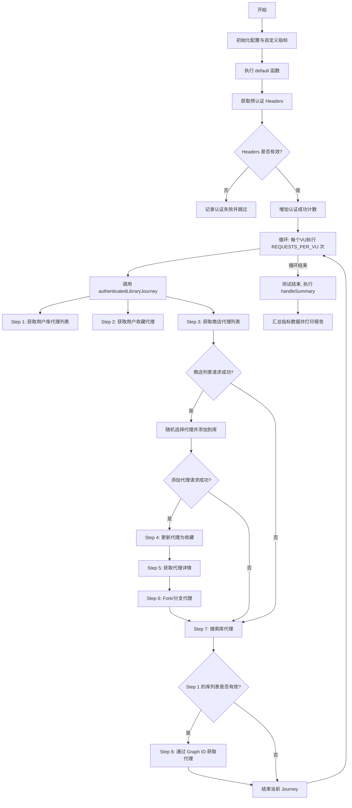
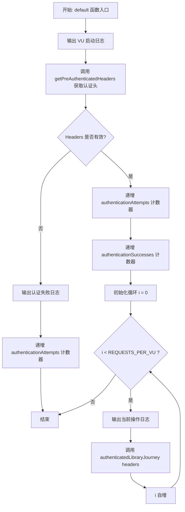
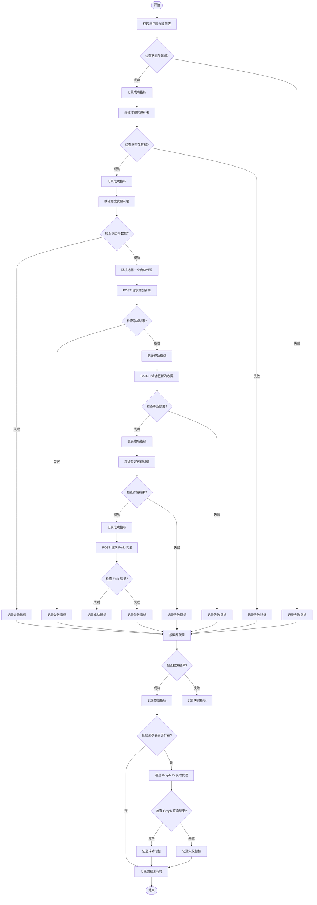
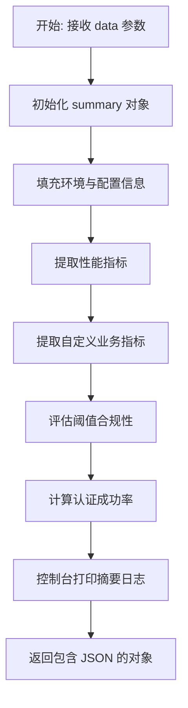

# `.\AutoGPT\autogpt_platform\backend\load-tests\tests\marketplace\library-access-test.js` 详细设计文档

该代码是一个基于 k6 的负载测试脚本，旨在模拟已认证用户对 Marketplace Library API 的一系列核心操作，包括获取库列表、浏览收藏、从商店添加代理、更新代理设置、分支代理、搜索及通过 ID 查询，以评估系统在特定并发和持续时间下的性能表现。

## 整体流程



## 类结构

```
Global Scope (k6 Script)
├── Custom Metrics (Counter)
│   ├── libraryRequests
│   ├── successfulRequests
│   ├── failedRequests
│   ├── authenticationAttempts
│   └── authenticationSuccesses
├── Configuration Variables
│   ├── config
│   ├── BASE_URL
│   ├── VUS, DURATION, RAMP_UP...
│   └── THRESHOLDS...
├── K6 Options
│   └── options (stages, thresholds)
└── Functions
    ├── default (Main Entry)
    ├── authenticatedLibraryJourney (Logic)
    └── handleSummary (Reporting)
```

## 全局变量及字段


### `config`
    
Holds environment configuration settings retrieved from the external configuration file.

类型：`Object`
    


### `BASE_URL`
    
The base URL for the API endpoints under test, derived from the configuration.

类型：`String`
    


### `libraryRequests`
    
K6 custom metric that counts the total number of library-related requests made.

类型：`Counter`
    


### `successfulRequests`
    
K6 custom metric that counts the number of successful requests determined by checks.

类型：`Counter`
    


### `failedRequests`
    
K6 custom metric that counts the number of failed requests determined by checks.

类型：`Counter`
    


### `authenticationAttempts`
    
K6 custom metric that counts the total number of authentication attempts.

类型：`Counter`
    


### `authenticationSuccesses`
    
K6 custom metric that counts the number of successful authentications.

类型：`Counter`
    


### `VUS`
    
The target number of virtual users to simulate during the test, defaults to 5.

类型：`Integer`
    


### `DURATION`
    
The duration string for the main load testing phase, defaults to '2m'.

类型：`String`
    


### `RAMP_UP`
    
The duration string for the ramp-up phase to reach target VUs, defaults to '30s'.

类型：`String`
    


### `RAMP_DOWN`
    
The duration string for the ramp-down phase to return to zero VUs, defaults to '30s'.

类型：`String`
    


### `REQUESTS_PER_VU`
    
The number of library operations each virtual user performs per iteration, defaults to 5.

类型：`Integer`
    


### `THRESHOLD_P95`
    
The performance threshold (in milliseconds) for the 95th percentile response time, defaults to 10000.

类型：`Integer`
    


### `THRESHOLD_P99`
    
The performance threshold (in milliseconds) for the 99th percentile response time, defaults to 20000.

类型：`Integer`
    


### `THRESHOLD_ERROR_RATE`
    
The maximum acceptable error rate for HTTP requests, defaults to 0.1 (10%).

类型：`Float`
    


### `THRESHOLD_CHECK_RATE`
    
The minimum acceptable success rate for check validations, defaults to 0.85 (85%).

类型：`Float`
    


### `options`
    
K6 configuration object defining test stages, performance thresholds, and metadata tags.

类型：`Object`
    


    

## 全局函数及方法


### `default`

该函数是K6负载测试脚本的默认入口函数，模拟已认证虚拟用户（VU）对应用市场库功能的访问流程。它负责获取预认证头信息，验证用户凭证的有效性，并根据配置的请求次数循环执行库操作的完整旅程。

参数：

-   无

返回值：`void`，无返回值。

#### 流程图



#### 带注释源码

```javascript
export default function () {
  // 输出虚拟用户启动的日志信息
  console.log(`📚 VU ${__VU} starting authenticated library journey...`);

  // 获取预认证的请求头，用于模拟已登录状态
  const headers = getPreAuthenticatedHeaders(__VU);
  
  // 检查是否成功获取到包含 Authorization 的请求头
  if (!headers || !headers.Authorization) {
    // 认证失败，记录日志并跳过本次迭代
    console.log(`❌ VU ${__VU} authentication failed, skipping iteration`);
    // 记录认证尝试次数（失败）
    authenticationAttempts.add(1);
    return;
  }

  // 认证成功，记录认证尝试和成功次数
  authenticationAttempts.add(1);
  authenticationSuccesses.add(1);

  // 根据配置的每个VU的请求数量，循环执行库操作旅程
  for (let i = 0; i < REQUESTS_PER_VU; i++) {
    console.log(
      `🔄 VU ${__VU} starting library operation ${i + 1}/${REQUESTS_PER_VU}...`,
    );
    // 调用核心业务逻辑函数，传入认证头
    authenticatedLibraryJourney(headers);
  }
}
```


### `authenticatedLibraryJourney`

该函数模拟了一个已认证用户在“市场/库”系统中的完整用户旅程，涵盖了从获取库列表、浏览收藏夹、从商店添加新代理、更新代理属性（收藏）、查看详情、Fork（复制）代理，以及搜索和通过 Graph ID 查找代理等一系列操作，旨在对已授权的端点进行负载测试和功能验证。

参数：

-  `headers`：`Object`，包含认证信息（如 `Authorization` 字段）的 HTTP 请求头对象，用于模拟已登录用户的请求上下文。

返回值：`void`，该函数没有返回值，主要通过执行 HTTP 请求、记录日志和更新自定义指标（`libraryRequests`, `successfulRequests` 等）来产生副作用。

#### 流程图



#### 带注释源码

```javascript
function authenticatedLibraryJourney(headers) {
  // 记录旅程开始时间，用于计算整个流程的总耗时
  const journeyStart = Date.now();

  // Step 1: 获取用户的库代理列表
  console.log(`📖 VU ${__VU} fetching user library agents...`);
  const libraryAgentsResponse = http.get(
    `${BASE_URL}/api/library/agents?page=1&page_size=20`,
    { headers },
  );

  // 增加请求计数器
  libraryRequests.add(1);
  // 校验响应状态码、数据结构存在性及响应时间
  const librarySuccess = check(libraryAgentsResponse, {
    "Library agents endpoint returns 200": (r) => r.status === 200,
    "Library agents response has data": (r) => {
      try {
        const json = r.json();
        return json && json.agents && Array.isArray(json.agents);
      } catch {
        return false;
      }
    },
    "Library agents response time < 10s": (r) => r.timings.duration < 10000,
  });

  // 根据校验结果更新成功或失败计数器，并记录日志
  if (librarySuccess) {
    successfulRequests.add(1);
  } else {
    failedRequests.add(1);
    console.log(
      `⚠️ VU ${__VU} library agents request failed: ${libraryAgentsResponse.status} - ${libraryAgentsResponse.body}`,
    );
  }

  // Step 2: 获取用户收藏的代理列表
  console.log(`⭐ VU ${__VU} fetching favorite library agents...`);
  const favoriteAgentsResponse = http.get(
    `${BASE_URL}/api/library/agents/favorites?page=1&page_size=10`,
    { headers },
  );

  libraryRequests.add(1);
  const favoritesSuccess = check(favoriteAgentsResponse, {
    "Favorite agents endpoint returns 200": (r) => r.status === 200,
    "Favorite agents response has data": (r) => {
      try {
        const json = r.json();
        return json && json.agents !== undefined && Array.isArray(json.agents);
      } catch {
        return false;
      }
    },
    "Favorite agents response time < 10s": (r) => r.timings.duration < 10000,
  });

  if (favoritesSuccess) {
    successfulRequests.add(1);
  } else {
    failedRequests.add(1);
    console.log(
      `⚠️ VU ${__VU} favorite agents request failed: ${favoriteAgentsResponse.status}`,
    );
  }

  // Step 3: 浏览市场并将代理添加到库中
  console.log(`🛍️ VU ${__VU} browsing marketplace to add agent...`);

  // 首先获取商店中可用的代理
  const storeAgentsResponse = http.get(
    `${BASE_URL}/api/store/agents?page=1&page_size=5`,
  );

  libraryRequests.add(1);
  const storeAgentsSuccess = check(storeAgentsResponse, {
    "Store agents endpoint returns 200": (r) => r.status === 200,
    "Store agents response has data": (r) => {
      try {
        const json = r.json();
        return (
          json &&
          json.agents &&
          Array.isArray(json.agents) &&
          json.agents.length > 0
        );
      } catch {
        return false;
      }
    },
  });

  if (storeAgentsSuccess) {
    successfulRequests.add(1);

    try {
      const storeAgentsJson = storeAgentsResponse.json();
      // 确保有可用的代理数据
      if (storeAgentsJson?.agents && storeAgentsJson.agents.length > 0) {
        const randomStoreAgent =
          storeAgentsJson.agents[
            Math.floor(Math.random() * storeAgentsJson.agents.length)
          ];

        // 确保代理有必要的 ID 字段
        if (randomStoreAgent?.store_listing_version_id) {
          console.log(
            `➕ VU ${__VU} adding agent "${randomStoreAgent.name || "Unknown"}" to library...`,
          );

          const addAgentPayload = {
            store_listing_version_id: randomStoreAgent.store_listing_version_id,
          };

          // 发送 POST 请求将代理添加到用户库
          const addAgentResponse = http.post(
            `${BASE_URL}/api/library/agents`,
            JSON.stringify(addAgentPayload),
            { headers },
          );

          libraryRequests.add(1);
          const addAgentSuccess = check(addAgentResponse, {
            "Add agent returns 201 or 200 (created/already exists)": (r) =>
              r.status === 201 || r.status === 200,
            "Add agent response has id": (r) => {
              try {
                const json = r.json();
                return json && json.id;
              } catch {
                return false;
              }
            },
            "Add agent response time < 15s": (r) => r.timings.duration < 15000,
          });

          if (addAgentSuccess) {
            successfulRequests.add(1);

            // Step 4: 更新添加的代理（标记为收藏）
            try {
              const addedAgentJson = addAgentResponse.json();
              if (addedAgentJson?.id) {
                console.log(`⭐ VU ${__VU} marking agent as favorite...`);

                const updatePayload = {
                  is_favorite: true,
                  auto_update_version: true,
                };

                // 发送 PATCH 请求更新代理属性
                const updateAgentResponse = http.patch(
                  `${BASE_URL}/api/library/agents/${addedAgentJson.id}`,
                  JSON.stringify(updatePayload),
                  { headers },
                );

                libraryRequests.add(1);
                const updateSuccess = check(updateAgentResponse, {
                  "Update agent returns 200": (r) => r.status === 200,
                  "Update agent response has updated data": (r) => {
                    try {
                      const json = r.json();
                      return json && json.id && json.is_favorite === true;
                    } catch {
                      return false;
                    }
                  },
                  "Update agent response time < 10s": (r) =>
                    r.timings.duration < 10000,
                });

                if (updateSuccess) {
                  successfulRequests.add(1);
                } else {
                  failedRequests.add(1);
                  console.log(
                    `⚠️ VU ${__VU} update agent failed: ${updateAgentResponse.status}`,
                  );
                }

                // Step 5: 获取特定库代理的详细信息
                console.log(`📄 VU ${__VU} fetching agent details...`);
                const agentDetailsResponse = http.get(
                  `${BASE_URL}/api/library/agents/${addedAgentJson.id}`,
                  { headers },
                );

                libraryRequests.add(1);
                const detailsSuccess = check(agentDetailsResponse, {
                  "Agent details returns 200": (r) => r.status === 200,
                  "Agent details response has complete data": (r) => {
                    try {
                      const json = r.json();
                      return json && json.id && json.name && json.graph_id;
                    } catch {
                      return false;
                    }
                  },
                  "Agent details response time < 10s": (r) =>
                    r.timings.duration < 10000,
                });

                if (detailsSuccess) {
                  successfulRequests.add(1);
                } else {
                  failedRequests.add(1);
                  console.log(
                    `⚠️ VU ${__VU} agent details failed: ${agentDetailsResponse.status}`,
                  );
                }

                // Step 6: Fork 库代理（模拟用户定制）
                console.log(`🍴 VU ${__VU} forking agent for customization...`);
                const forkAgentResponse = http.post(
                  `${BASE_URL}/api/library/agents/${addedAgentJson.id}/fork`,
                  "",
                  { headers },
                );

                libraryRequests.add(1);
                const forkSuccess = check(forkAgentResponse, {
                  "Fork agent returns 200": (r) => r.status === 200,
                  "Fork agent response has new agent data": (r) => {
                    try {
                      const json = r.json();
                      return json && json.id && json.id !== addedAgentJson.id; // Fork 后的 ID 应不同
                    } catch {
                      return false;
                    }
                  },
                  "Fork agent response time < 15s": (r) =>
                    r.timings.duration < 15000,
                });

                if (forkSuccess) {
                  successfulRequests.add(1);
                } else {
                  failedRequests.add(1);
                  console.log(
                    `⚠️ VU ${__VU} fork agent failed: ${forkAgentResponse.status}`,
                  );
                }
              }
            } catch (e) {
              console.warn(
                `⚠️ VU ${__VU} failed to parse added agent response: ${e}`,
              );
              failedRequests.add(1);
            }
          } else {
            failedRequests.add(1);
            console.log(
              `⚠️ VU ${__VU} add agent failed: ${addAgentResponse.status} - ${addAgentResponse.body}`,
            );
          }
        }
      }
    } catch (e) {
      console.warn(`⚠️ VU ${__VU} failed to parse store agents data: ${e}`);
      failedRequests.add(1);
    }
  } else {
    failedRequests.add(1);
    console.log(
      `⚠️ VU ${__VU} store agents request failed: ${storeAgentsResponse.status}`,
    );
  }

  // Step 7: 搜索库代理
  const searchTerms = ["automation", "api", "data", "social", "productivity"];
  const randomSearchTerm =
    searchTerms[Math.floor(Math.random() * searchTerms.length)];

  console.log(`🔍 VU ${__VU} searching library for "${randomSearchTerm}"...`);
  const searchLibraryResponse = http.get(
    `${BASE_URL}/api/library/agents?search_term=${encodeURIComponent(randomSearchTerm)}&page=1&page_size=10`,
    { headers },
  );

  libraryRequests.add(1);
  const searchLibrarySuccess = check(searchLibraryResponse, {
    "Search library returns 200": (r) => r.status === 200,
    "Search library response has data": (r) => {
      try {
        const json = r.json();
        return json && json.agents !== undefined && Array.isArray(json.agents);
      } catch {
        return false;
      }
    },
    "Search library response time < 10s": (r) => r.timings.duration < 10000,
  });

  if (searchLibrarySuccess) {
    successfulRequests.add(1);
  } else {
    failedRequests.add(1);
    console.log(
      `⚠️ VU ${__VU} search library failed: ${searchLibraryResponse.status}`,
    );
  }

  // Step 8: 通过 Graph ID 获取库代理
  if (libraryAgentsResponse.status === 200) {
    try {
      const libraryJson = libraryAgentsResponse.json();
      if (libraryJson?.agents && libraryJson.agents.length > 0) {
        const randomLibraryAgent =
          libraryJson.agents[
            Math.floor(Math.random() * libraryJson.agents.length)
          ];

        if (randomLibraryAgent?.graph_id) {
          console.log(
            `🔗 VU ${__VU} fetching agent by graph ID "${randomLibraryAgent.graph_id}"...`,
          );
          const agentByGraphResponse = http.get(
            `${BASE_URL}/api/library/agents/by-graph/${randomLibraryAgent.graph_id}`,
            { headers },
          );

          libraryRequests.add(1);
          const agentByGraphSuccess = check(agentByGraphResponse, {
            "Agent by graph ID returns 200": (r) => r.status === 200,
            "Agent by graph response has data": (r) => {
              try {
                const json = r.json();
                return (
                  json &&
                  json.id &&
                  json.graph_id === randomLibraryAgent.graph_id
                );
              } catch {
                return false;
              }
            },
            "Agent by graph response time < 10s": (r) =>
              r.timings.duration < 10000,
          });

          if (agentByGraphSuccess) {
            successfulRequests.add(1);
          } else {
            failedRequests.add(1);
            console.log(
              `⚠️ VU ${__VU} agent by graph request failed: ${agentByGraphResponse.status}`,
            );
          }
        }
      }
    } catch (e) {
      console.warn(
        `⚠️ VU ${__VU} failed to parse library agents for graph lookup: ${e}`,
      );
      failedRequests.add(1);
    }
  }

  // 计算并记录整个旅程的总耗时
  const journeyDuration = Date.now() - journeyStart;
  console.log(
    `✅ VU ${__VU} completed authenticated library journey in ${journeyDuration}ms`,
  );
}
```


### `handleSummary`

该函数是 K6 测试脚本中的生命周期钩子，用于在负载测试结束后处理和汇总测试数据。它从 K6 的原始数据对象中提取标准 HTTP 指标和自定义业务指标，对比预定义的性能阈值，计算认证成功率，并将结果格式化为可读的日志输出和 JSON 结构返回，以便进行测试结果分析。

参数：

-  `data`：`Object`，K6 在测试结束时传入的原始数据对象，包含所有内置及自定义指标的聚合数据（如请求计数、响应时间、错误率等）。

返回值：`Object`，包含 `stdout` 键的对象，其值为格式化后的测试摘要 JSON 字符串，用于在测试结束时的标准输出中显示详细报告。

#### 流程图



#### 带注释源码

```javascript
export function handleSummary(data) {
  // 初始化摘要对象，包含测试类型、环境、配置等元数据
  const summary = {
    test_type: "Marketplace Library Authorized Access Load Test",
    environment: __ENV.K6_ENVIRONMENT || "DEV",
    configuration: {
      virtual_users: VUS,
      duration: DURATION,
      ramp_up: RAMP_UP,
      ramp_down: RAMP_DOWN,
      requests_per_vu: REQUESTS_PER_VU,
    },
    // 从 data.metrics 中提取标准 HTTP 性能指标
    performance_metrics: {
      total_requests: data.metrics.http_reqs?.count || 0,
      failed_requests: data.metrics.http_req_failed?.values?.passes || 0,
      avg_response_time: data.metrics.http_req_duration?.values?.avg || 0,
      p95_response_time: data.metrics.http_req_duration?.values?.p95 || 0,
      p99_response_time: data.metrics.http_req_duration?.values?.p99 || 0,
    },
    // 从 data.metrics 中提取在脚本中定义的自定义计数器指标
    custom_metrics: {
      library_requests: data.metrics.library_requests_total?.values?.count || 0,
      successful_requests:
        data.metrics.successful_requests_total?.values?.count || 0,
      failed_requests: data.metrics.failed_requests_total?.values?.count || 0,
      authentication_attempts:
        data.metrics.authentication_attempts_total?.values?.count || 0,
      authentication_successes:
        data.metrics.authentication_successes_total?.values?.count || 0,
    },
    // 比较实际指标与预先定义的常量阈值，判断是否达标
    thresholds_met: {
      p95_threshold:
        (data.metrics.http_req_duration?.values?.p95 || 0) < THRESHOLD_P95,
      p99_threshold:
        (data.metrics.http_req_duration?.values?.p99 || 0) < THRESHOLD_P99,
      error_rate_threshold:
        (data.metrics.http_req_failed?.values?.rate || 0) <
        THRESHOLD_ERROR_RATE,
      check_rate_threshold:
        (data.metrics.checks?.values?.rate || 0) > THRESHOLD_CHECK_RATE,
    },
    // 计算认证成功率，防止除以零错误
    authentication_metrics: {
      auth_success_rate:
        (data.metrics.authentication_successes_total?.values?.count || 0) /
        Math.max(
          1,
          data.metrics.authentication_attempts_total?.values?.count || 0,
        ),
    },
    // 记录本次测试覆盖的用户旅程步骤列表
    user_journey_coverage: [
      "Authenticate with valid credentials",
      "Fetch user library agents",
      "Browse favorite library agents",
      "Discover marketplace agents",
      "Add marketplace agent to library",
      "Update agent preferences (favorites)",
      "View detailed agent information",
      "Fork agent for customization",
      "Search library agents by term",
      "Lookup agent by graph ID",
    ],
  };

  // 在控制台输出人类可读的格式化测试摘要
  console.log("\n📚 MARKETPLACE LIBRARY AUTHORIZED TEST SUMMARY");
  console.log("==============================================");
  console.log(`Environment: ${summary.environment}`);
  console.log(`Virtual Users: ${summary.configuration.virtual_users}`);
  console.log(`Duration: ${summary.configuration.duration}`);
  console.log(`Requests per VU: ${summary.configuration.requests_per_vu}`);
  console.log(`Total Requests: ${summary.performance_metrics.total_requests}`);
  console.log(
    `Successful Requests: ${summary.custom_metrics.successful_requests}`,
  );
  console.log(`Failed Requests: ${summary.custom_metrics.failed_requests}`);
  console.log(
    `Auth Success Rate: ${Math.round(summary.authentication_metrics.auth_success_rate * 100)}%`,
  );
  console.log(
    `Average Response Time: ${Math.round(summary.performance_metrics.avg_response_time)}ms`,
  );
  console.log(
    `95th Percentile: ${Math.round(summary.performance_metrics.p95_response_time)}ms`,
  );
  console.log(
    `99th Percentile: ${Math.round(summary.performance_metrics.p99_response_time)}ms`,
  );

  console.log("\n🎯 Threshold Status:");
  console.log(
    `P95 < ${THRESHOLD_P95}ms: ${summary.thresholds_met.p95_threshold ? "✅" : "❌"}`,
  );
  console.log(
    `P99 < ${THRESHOLD_P99}ms: ${summary.thresholds_met.p99_threshold ? "✅" : "❌"}`,
  );
  console.log(
    `Error Rate < ${THRESHOLD_ERROR_RATE * 100}%: ${summary.thresholds_met.error_rate_threshold ? "✅" : "❌"}`,
  );
  console.log(
    `Check Rate > ${THRESHOLD_CHECK_RATE * 100}%: ${summary.thresholds_met.check_rate_threshold ? "✅" : "❌"}`,
  );

  // 返回对象，K6 会将其写入标准输出，便于 CI/CD 工具捕获
  return {
    stdout: JSON.stringify(summary, null, 2),
  };
}
```


## 关键组件


### Test Configuration Manager

管理负载测试的执行参数，包括虚拟用户数量、加压阶段、持续时间以及性能阈值配置。

### Authentication Provider

负责获取并管理预认证的请求头，确保每个虚拟用户模拟已登录状态。

### Authorized User Journey

定义并执行一系列复杂的 API 交互流程，涵盖库代理查询、收藏夹管理、市场发现、代理添加、更新及复刻等功能。

### Custom Metrics System

通过自定义计数器和检查点，实时追踪库请求、认证尝试及业务操作的成功与失败状态。

### Result Aggregator

在测试结束后聚合原始指标数据，计算性能统计值，并输出结构化的控制台测试报告。


## 问题及建议


### 已知问题

-   **代码结构复杂度过高**：函数 `authenticatedLibraryJourney` 内部逻辑深度嵌套，层数达到 6-7 层，包含大量条件判断和异常捕获，这种“面条代码”严重降低了代码的可读性和可维护性。
-   **硬编码的阈值与配置**：在具体的业务逻辑检查中，直接使用了硬编码的数值（如 `r.timings.duration < 10000`），这与文件顶部定义的环境变量配置（如 `THRESHOLD_P95`）不一致，导致配置管理分散且难以调整。
-   **缺乏数据清理机制**：脚本包含写操作（如 POST 添加 Agent、POST Fork Agent），但在测试运行结束后没有任何清理逻辑。长期或高频运行将导致数据库充斥大量测试垃圾数据。
-   **日志输出影响性能测试准确性**：代码中包含大量的 `console.log`，在高并发（高 VU）场景下，密集的标准输出会产生显著的 I/O 阻塞，从而干扰对后端服务真实性能的评估。
-   **强依赖链导致测试覆盖盲区**：测试流程呈现强串联依赖（例如，必须先获取 Store Agents 才能添加，必须添加成功才能更新）。如果前置接口因非目标原因（如偶发网络抖动）失败，后续接口将无法被执行，掩盖了后端潜在的功能或性能问题。

### 优化建议

-   **模块化拆分与扁平化重构**：将 `authenticatedLibraryJourney` 中的各个业务步骤（获取列表、添加代理、Fork 等）拆分为独立的函数，通过顺序调用或 Promise 链来减少嵌套深度，提升代码清晰度。
-   **统一配置参数管理**：将硬编码的超时时间、分页大小以及搜索关键词列表等参数提取为全局常量或环境变量，确保测试行为和阈值的统一管理。
-   **引入可配置的日志级别**：增加环境变量（如 `LOG_LEVEL`）控制日志输出密度。在默认的高负载测试模式下仅记录错误和关键摘要，仅在调试模式下输出详细的步骤日志。
-   **实现测试数据的生命周期管理**：在执行写操作时记录生成的资源 ID，并在脚本的 `teardown` 阶段调用相应的删除接口进行数据清理，或者为测试数据打上特定标签以便后续批量清理。
-   **增强错误处理的韧性**：引入步骤跳过或重试机制。对于非核心依赖的失败，允许脚本继续执行后续步骤，以便在一次测试运行中尽可能多地覆盖不同的 API 端点。


## 其它


### 设计目标与约束

**设计目标：**
该脚本旨在模拟经过身份验证的用户在高并发场景下使用 Marketplace Library API 的完整行为。主要目标包括验证系统的功能性（API 返回正确的数据结构）、稳定性（在高负载下不崩溃）以及性能（响应时间在可接受范围内）。此外，脚本还致力于覆盖用户的关键使用路径，从浏览、搜索到添加、修改和 Fork Agent。

**设计约束：**
1. **运行环境：** 必须在 k6 测试运行器环境中执行，依赖 Node.js 模块进行配置管理。
2. **认证机制：** 强制使用预认证的 Token，脚本本身不负责登录逻辑，仅使用注入的 Headers。
3. **加载模型：** 采用基于阶段的加载策略（Ramp-up -> Sustain -> Ramp-down），不支持动态调整，必须预先定义 VU 数量和持续时间。
4. **资源限制：** 依赖环境变量 (`__ENV`) 传入配置，若未设置则使用硬编码的默认值。
5. **数据依赖：** 假设测试环境中存在足够的数据（如 Store 中的 Agent），以便脚本能够随机选取进行操作。

### 错误处理与异常设计

**错误处理策略：**
1. **防御性编程：** 所有的 JSON 解析操作（`r.json()`）都包裹在 `try-catch` 块中。如果响应体格式错误或无法解析，捕获异常并返回 `false` 给 `check` 函数，防止 VU 进程崩溃。
2. **条件跳过：** 采用“快速失败”逻辑。例如，如果获取 Store Agents 失败，则跳过后续的“添加 Agent”、“更新 Agent”和“Fork”步骤，避免产生无意义的错误级联。
3. **非阻塞检查：** 使用 k6 的 `check` 函数进行断言，即使断言失败也不会终止当前的 VU 迭代，而是记录失败并继续执行。
4. **日志记录：** 使用 `console.log` 和 `console.warn` 记录关键步骤的开始、结束以及具体的失败原因（如 HTTP 状态码、异常信息），便于调试。

**异常分类：**
- **网络/HTTP 错误：** 记录状态码非 2xx 的情况，增加 `http_req_failed` 指标。
- **业务逻辑错误：** 如响应体缺少预期的字段（`id`, `agents` 等），被捕获为 Check 失败。
- **数据解析错误：** JSON 解析异常被捕获并转换为 Check 失败。

### 外部依赖与接口契约

**外部依赖：**
1. **`../../configs/environment.js`**：依赖该模块导出 `getEnvironmentConfig()` 函数，用于获取当前测试环境的 `API_BASE_URL`。
2. **`../../configs/pre-authenticated-tokens.js`**：依赖该模块导出 `getPreAuthenticatedHeaders(vuId)` 函数，用于生成每个 VU 的授权头（Authorization Header）。
3. **系统环境变量 (`__ENV`)**：依赖运行时注入的环境变量来动态配置测试参数（如 `VUS`, `DURATION`, `K6_ENVIRONMENT` 等）。

**接口契约 (API 契约)：**
- **GET `/api/library/agents`**：契约要求返回状态码 200，响应体为包含 `agents` 数组的 JSON 对象。
- **GET `/api/library/agents/favorites`**：契约要求返回状态码 200，响应体包含 `agents` 数组。
- **GET `/api/store/agents`**：契约要求返回状态码 200，响应体包含非空的 `agents` 数组，且每个 Agent 应包含 `store_listing_version_id`。
- **POST `/api/library/agents`**：契约要求请求体为 JSON，包含 `store_listing_version_id`。成功时返回 201 (Created) 或 200 (Already Exists)，响应体包含新建 Agent 的 `id`。
- **PATCH `/api/library/agents/{id}`**：契约要求请求体支持更新 `is_favorite` 等字段，成功返回 200。
- **GET `/api/library/agents/{id}`**：契约要求返回 200，响应体包含完整的 Agent 信息 (`id`, `name`, `graph_id`)。
- **POST `/api/library/agents/{id}/fork`**：契约要求返回 200，响应体包含新的 Agent `id`，且必须不同于原 ID。
- **GET `/api/library/agents/by-graph/{graph_id}`**：契约要求返回 200，且响应体中的 `graph_id` 与路径参数匹配。

### 数据流与状态机

**数据流向：**
1. **配置加载阶段：** 从环境配置文件读取 `BASE_URL`，从环境变量读取负载参数。
2. **初始化阶段：** k6 初始化 VU，生成自定义指标实例。
3. **执行阶段 (VU 循环)：**
   - 获取预认证 Headers。
   - 发起一系列 HTTP 请求（GET Library -> GET Store -> POST Add -> PATCH Update -> POST Fork -> GET Details）。
   - 接收 HTTP 响应。
   - 解析 JSON 数据。
   - 将解析出的数据（如 `agent.id`, `agent.graph_id`）作为参数传递给下一个请求。
4. **度量阶段：** 根据 `check` 结果更新 `Counter` 指标。
5. **结束阶段：** 调用 `handleSummary`，聚合所有指标数据，生成 JSON 报告并输出到 Stdout。

**虚拟用户 (VU) 状态机：**
- **IDLE (初始状态)：** VU 启动，准备执行。
- **AUTH_CHECK (认证校验)：** 检查 Headers 是否有效。无效则跳回 IDLE（结束本次迭代），有效则进入 BROWSE。
- **BROWSE (浏览状态)：** 并行或串行获取 Library Agents 和 Favorites。完成后进入 ACQUIRE。
- **ACQUIRE (获取状态)：** 浏览 Store，随机选择一个 Agent 并添加到 Library。失败则跳转至 SEARCH，成功则进入 MANAGE。
- **MANAGE (管理状态)：** 对刚添加的 Agent 执行一系列操作：更新（设为收藏） -> 查看详情 -> Fork。完成后进入 SEARCH。
- **SEARCH (搜索状态)：** 执行关键词搜索和 Graph ID 查询。完成后进入 END。
- **END (结束状态)：** 完成本次迭代，等待下一次调度或退出。

### 性能指标与监控策略

**自定义性能指标：**
- **`library_requests_total`**：Counter 类型，统计所有发往 Library 相关接口的请求总数。
- **`successful_requests`**：Counter 类型，统计所有业务逻辑检查通过的请求数。
- **`failed_requests`**：Counter 类型，统计所有业务逻辑检查失败的请求数。
- **`authentication_attempts_total`**：Counter 类型，统计尝试进行认证操作的次数。
- **`authentication_successes_total`**：Counter 类型，统计成功获取认证 Headers 的次数。

**监控阈值：**
脚本在 `options.thresholds` 中定义了严格的性能 SLA：
1. **响应时间 (P95/P99)：** 95% 的请求响应时间必须小于 10000ms (10s)，99% 必须小于 20000ms (20s)。
2. **错误率 (`http_req_failed`)：** HTTP 请求失败率必须低于 10% (`0.1`)。
3. **业务成功率 (`checks`)：** 业务断言（Check）的通过率必须高于 85% (`0.85`)。

**监控策略与报告：**
- **实时监控：** 利用 k6 内置指标和自定义指标实时跟踪测试进度。通过控制台日志（带 Emoji 的日志）直观展示 VU 的当前动作，便于在测试运行时人工监控卡顿或错误。
- **结果聚合：** 使用 `handleSummary` 钩子函数在测试结束时自动计算并生成结构化的 JSON 报告。报告包含：
  - 测试环境配置。
  - 聚合性能数据（Total Requests, Avg/P95/P99 Response Time）。
  - 自定义业务指标汇总。
  - 阈值达成情况（Pass/Fail 标记）。
  - 认证成功率统计。
- **集成：** 输出为 JSON 格式 (`stdout: JSON.stringify(...)`)，便于后续 CI/CD 流水线解析或将结果发送到外部监控系统（如 InfluxDB, Grafana）。

    