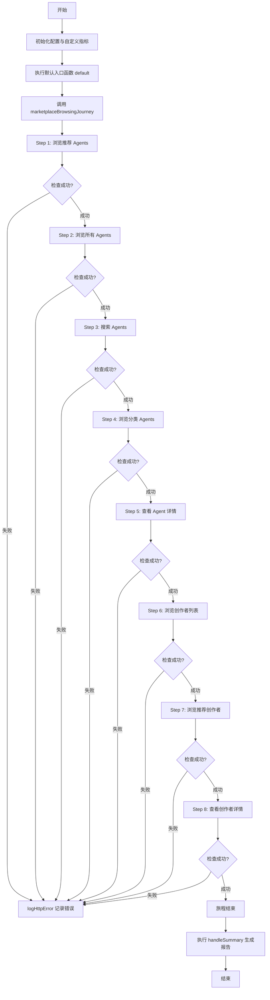
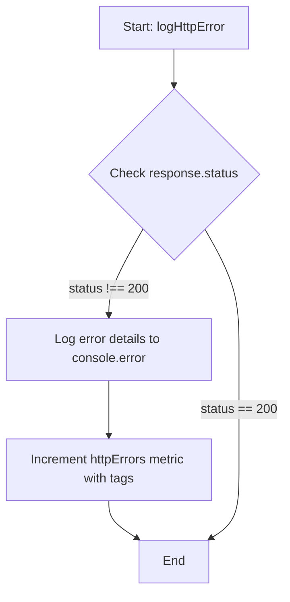
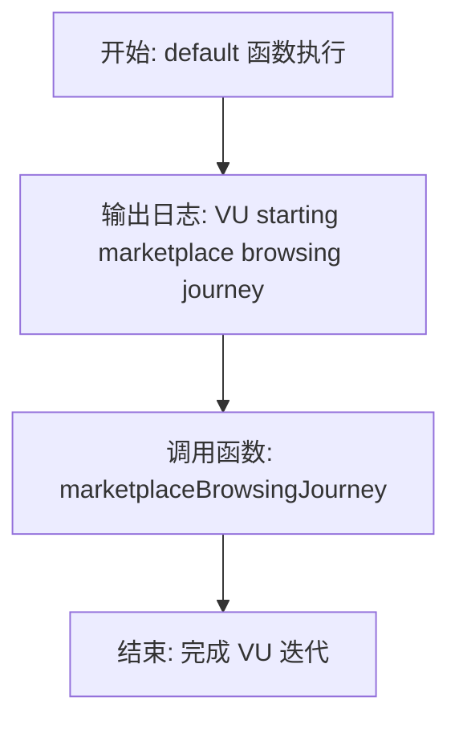
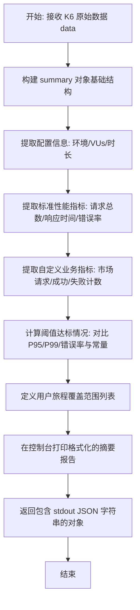

```mermaid
graph TD
    Start([函数开始]) --> Init[记录旅程开始时间]
    
    Init --> Step1[Step 1: 请求精选智能体列表]
    Step1 --> Process1[记录错误日志 & 更新请求计数]
    Process1 --> Check1{校验响应: 状态码, 数据结构, 超时}
    Check1 --> UpdateSuccess1[更新成功计数]
    Check1 -.-> UpdateFail1[更新失败计数]
    UpdateSuccess1 --> Step2
    UpdateFail1 --> Step2

    Step2[Step 2: 请求所有智能体列表] --> Process2[记录错误日志 & 更新请求计数]
    Process2 --> Check2{校验响应}
    Check2 --> UpdateSuccess2[更新成功计数]
    Check2 -.-> UpdateFail2[更新失败计数]
    UpdateSuccess2 --> Step3
    UpdateFail2 --> Step3

    Step3[Step 3: 随机关键词搜索智能体] --> Process3[记录错误日志 & 更新请求计数]
    Process3 --> Check3{校验响应}
    Check3 --> UpdateSuccess3[更新成功计数]
    Check3 -.-> UpdateFail3[更新失败计数]
    UpdateSuccess3 --> Step4
    UpdateFail3 --> Step4

    Step4[Step 4: 随机类别浏览智能体] --> Process4[记录错误日志 & 更新请求计数]
    Process4 --> Check4{校验响应}
    Check4 --> UpdateSuccess4[更新成功计数]
    Check4 -.-> UpdateFail4[更新失败计数]
    UpdateSuccess4 --> CheckAgentData{步骤2响应包含有效智能体数据?}
    Check4 -.-> CheckAgentData
    UpdateFail4 --> CheckAgentData

    CheckAgentData -- 是 --> Step5[Step 5: 随机选择智能体查看详情]
    CheckAgentData -- 否 --> Step6
    Step5 --> Process5[记录错误日志 & 更新请求计数]
    Process5 --> Check5{校验响应}
    Check5 --> UpdateSuccess5[更新成功计数]
    Check5 -.-> UpdateFail5[更新失败计数]
    UpdateSuccess5 --> Step6
    UpdateFail5 --> Step6

    Step6[Step 6: 请求创作者列表] --> Process6[记录错误日志 & 更新请求计数]
    Process6 --> Check6{校验响应}
    Check6 --> UpdateSuccess6[更新成功计数]
    Check6 -.-> UpdateFail6[更新失败计数]
    UpdateSuccess6 --> Step7
    UpdateFail6 --> Step7

    Step7[Step 7: 请求精选创作者列表] --> Process7[记录错误日志 & 更新请求计数]
    Process7 --> Check7{校验响应}
    Check7 --> UpdateSuccess7[更新成功计数]
    Check7 -.-> UpdateFail7[更新失败计数]
    UpdateSuccess7 --> CheckCreatorData{步骤6响应包含有效创作者数据?}
    Check7 -.-> CheckCreatorData
    UpdateFail7 --> CheckCreatorData

    CheckCreatorData -- 是 --> Step8[Step 8: 随机选择创作者查看详情]
    CheckCreatorData -- 否 --> LogEnd
    Step8 --> Process8[记录错误日志 & 更新请求计数]
    Process8 --> Check8{校验响应}
    Check8 --> UpdateSuccess8[更新成功计数]
    Check8 -.-> UpdateFail8[更新失败计数]
    UpdateSuccess8 --> LogEnd
    UpdateFail8 --> LogEnd

    LogEnd[记录旅程结束耗时] --> End([函数结束])
```

# `.\AutoGPT\autogpt_platform\backend\load-tests\tests\marketplace\public-access-test.js` 详细设计文档

该脚本是一个基于 k6 的负载测试文件，用于对 Marketplace（市场）的公开访问接口进行压力测试。它模拟了用户浏览主页、搜索、按分类筛选、查看代理详情以及浏览创作者详情的完整用户旅程，同时自定义了指标以跟踪请求成功率和失败情况，并在测试结束后生成详细的性能摘要报告。

## 整体流程



## 类结构

```
Global Scope (脚本全局作用域)
├── Constants & Configs (常量与配置)
│   ├── config
│   ├── BASE_URL
│   ├── options
│   ├── VUS, DURATION, etc.
│   └── THRESHOLDS
├── Metrics (自定义指标)
│   ├── marketplaceRequests
│   ├── successfulRequests
│   ├── failedRequests
│   └── httpErrors
└── Functions (全局函数)
    ├── logHttpError
    ├── default
    ├── marketplaceBrowsingJourney
    └── handleSummary
```

## 全局变量及字段


### `config`
    
Environment configuration object loaded from the external environment configuration file.

类型：`Object`
    


### `BASE_URL`
    
The base URL for the API endpoints, derived from the environment configuration.

类型：`String`
    


### `marketplaceRequests`
    
A custom K6 Counter metric that tracks the total number of requests made to the marketplace.

类型：`Counter`
    


### `successfulRequests`
    
A custom K6 Counter metric that tracks the number of successful requests.

类型：`Counter`
    


### `failedRequests`
    
A custom K6 Counter metric that tracks the number of failed requests.

类型：`Counter`
    


### `httpErrors`
    
A custom K6 Counter metric used for tracking HTTP errors, tagged by status code, endpoint, and method.

类型：`Counter`
    


### `VUS`
    
The number of virtual users to simulate during the load test, parsed from environment variable or defaulting to 10.

类型：`Number`
    


### `DURATION`
    
The duration string for the main load testing stage, defaulting to '2m'.

类型：`String`
    


### `RAMP_UP`
    
The duration string for the ramp-up stage where virtual users increase to the target, defaulting to '30s'.

类型：`String`
    


### `RAMP_DOWN`
    
The duration string for the ramp-down stage where virtual users decrease to zero, defaulting to '30s'.

类型：`String`
    


### `REQUEST_TIMEOUT`
    
The timeout threshold in milliseconds (60s) used to validate if a request responds within an acceptable time.

类型：`Number`
    


### `THRESHOLD_P95`
    
The performance threshold in milliseconds for the 95th percentile of response times, defaulting to 5000ms.

类型：`Number`
    


### `THRESHOLD_P99`
    
The performance threshold in milliseconds for the 99th percentile of response times, defaulting to 10000ms.

类型：`Number`
    


### `THRESHOLD_ERROR_RATE`
    
The maximum acceptable error rate (as a decimal, e.g., 0.05 for 5%), defaulting to 0.05.

类型：`Number`
    


### `THRESHOLD_CHECK_RATE`
    
The minimum acceptable success check rate (as a decimal, e.g., 0.95 for 95%), defaulting to 0.95.

类型：`Number`
    


### `options`
    
K6 configuration object defining the test execution stages, scenarios, and metadata tags.

类型：`Object`
    


    

## 全局函数及方法


### `logHttpError`

该函数用于在 K6 负载测试脚本中处理 HTTP 请求的响应对象。如果检测到非 200 状态码，它会向控制台输出详细的错误信息（包括虚拟用户 ID、请求方法、端点、状态码及响应体片段），并将错误记录到自定义的 `httpErrors` 计数器指标中，以便后续分析。

参数：

-  `response`：`Object`，K6 HTTP 请求返回的响应对象，包含状态码、响应体和错误信息。
-  `endpoint`：`String`，请求的目标 API 端点路径。
-  `method`：`String`，HTTP 请求方法（如 GET, POST），默认为 "GET"。

返回值：`void`，该函数没有返回值，主要执行日志记录和指标更新操作。

#### 流程图



#### 带注释源码

```javascript
// Enhanced error logging function
function logHttpError(response, endpoint, method = "GET") {
  // 检查响应状态码是否不为 200 (表示请求失败)
  if (response.status !== 200) {
    // 在控制台输出格式化的错误日志，包含虚拟用户ID、请求方法、端点、状态码、错误信息以及响应体的前200个字符
    console.error(
      `❌ VU ${__VU} ${method} ${endpoint} failed: status=${response.status}, error=${response.error || "unknown"}, body=${response.body ? response.body.substring(0, 200) : "empty"}`,
    );
    // 向自定义指标 httpErrors 添加一条记录，并附带状态码、端点和请求方法作为标签，用于按维度统计错误
    httpErrors.add(1, {
      status: response.status,
      endpoint: endpoint,
      method: method,
    });
  }
}
```


### `default`

该函数是 K6 负载测试脚本的主入口函数，代表一个虚拟用户（VU）的执行生命周期。它的核心功能是启动并模拟单个用户在市场上进行浏览的完整旅程。

参数：

-   无

返回值：`void`，不返回任何值。

#### 流程图



#### 带注释源码

```javascript
export default function () {
  // 记录日志，标识当前虚拟用户 (VU) 正在启动市场浏览流程
  console.log(`🛒 VU ${__VU} starting marketplace browsing journey...`);

  // 调用核心业务逻辑函数，模拟真实的用户市场浏览旅程
  // Simulate realistic user marketplace browsing journey
  marketplaceBrowsingJourney();
}
```


### `marketplaceBrowsingJourney`

该函数模拟了用户在 Marketplace 市场中的完整浏览旅程，涵盖了浏览首页、搜索智能体、按类别筛选、查看智能体详情、浏览创作者列表以及查看创作者详情等一系列操作。函数通过发送 HTTP 请求验证接口的响应状态、数据结构完整性及响应时间，并实时更新自定义的成功与失败计数指标。

参数：

无

返回值：`void`，无显式返回值，主要执行副作用操作（HTTP请求、日志记录、指标更新）。

#### 流程图



#### 带注释源码

```javascript
function marketplaceBrowsingJourney() {
  const journeyStart = Date.now();

  // Step 1: 浏览市场首页 - 获取精选智能体
  console.log(`🏪 VU ${__VU} browsing marketplace homepage...`);
  const featuredAgentsResponse = http.get(
    `${BASE_URL}/api/store/agents?featured=true&page=1&page_size=10`,
  );
  logHttpError(
    featuredAgentsResponse,
    "/api/store/agents?featured=true",
    "GET",
  );

  marketplaceRequests.add(1);
  const featuredSuccess = check(featuredAgentsResponse, {
    "Featured agents endpoint returns 200": (r) => r.status === 200,
    "Featured agents response has data": (r) => {
      try {
        const json = r.json();
        return json && json.agents && Array.isArray(json.agents);
      } catch {
        return false;
      }
    },
    "Featured agents responds within 60s": (r) =>
      r.timings.duration < REQUEST_TIMEOUT,
  });

  if (featuredSuccess) {
    successfulRequests.add(1);
  } else {
    failedRequests.add(1);
  }

  // Step 2: 浏览所有智能体（分页）
  console.log(`📋 VU ${__VU} browsing all agents...`);
  const allAgentsResponse = http.get(
    `${BASE_URL}/api/store/agents?page=1&page_size=20`,
  );
  logHttpError(allAgentsResponse, "/api/store/agents", "GET");

  marketplaceRequests.add(1);
  const allAgentsSuccess = check(allAgentsResponse, {
    "All agents endpoint returns 200": (r) => r.status === 200,
    "All agents response has data": (r) => {
      try {
        const json = r.json();
        return (
          json &&
          json.agents &&
          Array.isArray(json.agents) &&
          json.agents.length > 0
        );
      } catch {
        return false;
      }
    },
    "All agents responds within 60s": (r) =>
      r.timings.duration < REQUEST_TIMEOUT,
  });

  if (allAgentsSuccess) {
    successfulRequests.add(1);
  } else {
    failedRequests.add(1);
  }

  // Step 3: 搜索特定智能体
  const searchQueries = [
    "automation",
    "social media",
    "data analysis",
    "productivity",
  ];
  const randomQuery =
    searchQueries[Math.floor(Math.random() * searchQueries.length)];

  console.log(`🔍 VU ${__VU} searching for "${randomQuery}" agents...`);
  const searchResponse = http.get(
    `${BASE_URL}/api/store/agents?search_query=${encodeURIComponent(randomQuery)}&page=1&page_size=10`,
  );
  logHttpError(searchResponse, "/api/store/agents (search)", "GET");

  marketplaceRequests.add(1);
  const searchSuccess = check(searchResponse, {
    "Search agents endpoint returns 200": (r) => r.status === 200,
    "Search agents response has data": (r) => {
      try {
        const json = r.json();
        return json && json.agents && Array.isArray(json.agents);
      } catch {
        return false;
      }
    },
    "Search agents responds within 60s": (r) =>
      r.timings.duration < REQUEST_TIMEOUT,
  });

  if (searchSuccess) {
    successfulRequests.add(1);
  } else {
    failedRequests.add(1);
  }

  // Step 4: 按类别浏览智能体
  const categories = ["AI", "PRODUCTIVITY", "COMMUNICATION", "DATA", "SOCIAL"];
  const randomCategory =
    categories[Math.floor(Math.random() * categories.length)];

  console.log(`📂 VU ${__VU} browsing "${randomCategory}" category...`);
  const categoryResponse = http.get(
    `${BASE_URL}/api/store/agents?category=${randomCategory}&page=1&page_size=15`,
  );
  logHttpError(categoryResponse, "/api/store/agents (category)", "GET");

  marketplaceRequests.add(1);
  const categorySuccess = check(categoryResponse, {
    "Category agents endpoint returns 200": (r) => r.status === 200,
    "Category agents response has data": (r) => {
      try {
        const json = r.json();
        return json && json.agents && Array.isArray(json.agents);
      } catch {
        return false;
      }
    },
    "Category agents responds within 60s": (r) =>
      r.timings.duration < REQUEST_TIMEOUT,
  });

  if (categorySuccess) {
    successfulRequests.add(1);
  } else {
    failedRequests.add(1);
  }

  // Step 5: 获取特定智能体详情（模拟点击智能体）
  // 仅当步骤2成功且返回数据时执行
  if (allAgentsResponse.status === 200) {
    try {
      const allAgentsJson = allAgentsResponse.json();
      if (allAgentsJson?.agents && allAgentsJson.agents.length > 0) {
        const randomAgent =
          allAgentsJson.agents[
            Math.floor(Math.random() * allAgentsJson.agents.length)
          ];

        if (randomAgent?.creator_username && randomAgent?.slug) {
          console.log(
            `📄 VU ${__VU} viewing agent details for "${randomAgent.slug}"...`,
          );
          const agentDetailsResponse = http.get(
            `${BASE_URL}/api/store/agents/${encodeURIComponent(randomAgent.creator_username)}/${encodeURIComponent(randomAgent.slug)}`,
          );
          logHttpError(
            agentDetailsResponse,
            "/api/store/agents/{creator}/{slug}",
            "GET",
          );

          marketplaceRequests.add(1);
          const agentDetailsSuccess = check(agentDetailsResponse, {
            "Agent details endpoint returns 200": (r) => r.status === 200,
            "Agent details response has data": (r) => {
              try {
                const json = r.json();
                return json && json.id && json.name && json.description;
              } catch {
                return false;
              }
            },
            "Agent details responds within 60s": (r) =>
              r.timings.duration < REQUEST_TIMEOUT,
          });

          if (agentDetailsSuccess) {
            successfulRequests.add(1);
          } else {
            failedRequests.add(1);
          }
        }
      }
    } catch (e) {
      console.warn(
        `⚠️ VU ${__VU} failed to parse agents data for details lookup: ${e}`,
      );
      failedRequests.add(1);
    }
  }

  // Step 6: 浏览创作者
  console.log(`👥 VU ${__VU} browsing creators...`);
  const creatorsResponse = http.get(
    `${BASE_URL}/api/store/creators?page=1&page_size=20`,
  );
  logHttpError(creatorsResponse, "/api/store/creators", "GET");

  marketplaceRequests.add(1);
  const creatorsSuccess = check(creatorsResponse, {
    "Creators endpoint returns 200": (r) => r.status === 200,
    "Creators response has data": (r) => {
      try {
        const json = r.json();
        return json && json.creators && Array.isArray(json.creators);
      } catch {
        return false;
      }
    },
    "Creators responds within 60s": (r) => r.timings.duration < REQUEST_TIMEOUT,
  });

  if (creatorsSuccess) {
    successfulRequests.add(1);
  } else {
    failedRequests.add(1);
  }

  // Step 7: 获取精选创作者
  console.log(`⭐ VU ${__VU} browsing featured creators...`);
  const featuredCreatorsResponse = http.get(
    `${BASE_URL}/api/store/creators?featured=true&page=1&page_size=10`,
  );
  logHttpError(
    featuredCreatorsResponse,
    "/api/store/creators?featured=true",
    "GET",
  );

  marketplaceRequests.add(1);
  const featuredCreatorsSuccess = check(featuredCreatorsResponse, {
    "Featured creators endpoint returns 200": (r) => r.status === 200,
    "Featured creators response has data": (r) => {
      try {
        const json = r.json();
        return json && json.creators && Array.isArray(json.creators);
      } catch {
        return false;
      }
    },
    "Featured creators responds within 60s": (r) =>
      r.timings.duration < REQUEST_TIMEOUT,
  });

  if (featuredCreatorsSuccess) {
    successfulRequests.add(1);
  } else {
    failedRequests.add(1);
  }

  // Step 8: 获取特定创作者详情（模拟点击创作者）
  // 仅当步骤6成功且返回数据时执行
  if (creatorsResponse.status === 200) {
    try {
      const creatorsJson = creatorsResponse.json();
      if (creatorsJson?.creators && creatorsJson.creators.length > 0) {
        const randomCreator =
          creatorsJson.creators[
            Math.floor(Math.random() * creatorsJson.creators.length)
          ];

        if (randomCreator?.username) {
          console.log(
            `👤 VU ${__VU} viewing creator details for "${randomCreator.username}"...`,
          );
          const creatorDetailsResponse = http.get(
            `${BASE_URL}/api/store/creator/${encodeURIComponent(randomCreator.username)}`,
          );
          logHttpError(
            creatorDetailsResponse,
            "/api/store/creator/{username}",
            "GET",
          );

          marketplaceRequests.add(1);
          const creatorDetailsSuccess = check(creatorDetailsResponse, {
            "Creator details endpoint returns 200": (r) => r.status === 200,
            "Creator details response has data": (r) => {
              try {
                const json = r.json();
                return json && json.username && json.description !== undefined;
              } catch {
                return false;
              }
            },
            "Creator details responds within 60s": (r) =>
              r.timings.duration < REQUEST_TIMEOUT,
          });

          if (creatorDetailsSuccess) {
            successfulRequests.add(1);
          } else {
            failedRequests.add(1);
          }
        }
      }
    } catch (e) {
      console.warn(
        `⚠️ VU ${__VU} failed to parse creators data for details lookup: ${e}`,
      );
      failedRequests.add(1);
    }
  }

  // 计算并输出整个旅程耗时
  const journeyDuration = Date.now() - journeyStart;
  console.log(
    `✅ VU ${__VU} completed marketplace browsing journey in ${journeyDuration}ms`,
  );
}
```


### `handleSummary`

在测试运行结束时处理和聚合测试结果数据。它从 K6 的原生数据对象中提取标准的 HTTP 性能指标（如请求总数、响应时间、失败率）和自定义业务指标（如市场请求数、成功/失败计数），基于预定义的性能阈值（P95、P99、错误率等）评估测试是否达标，并将格式化的摘要报告输出到控制台，最后返回一个包含 JSON 字符串摘要的对象供 K6 输出处理器使用。

参数：

- `data`：`Object`，K6 测试运行结束后传递的原始数据对象，包含所有指标（metrics）、检查点（checks）及元数据。

返回值：`Object`，包含测试摘要数据的对象，其中 `stdout` 键对应格式化后的 JSON 字符串，用于生成报告文件或控制台输出。

#### 流程图



#### 带注释源码

```javascript
export function handleSummary(data) {
  // 1. 初始化并构建摘要数据结构
  const summary = {
    // 定义测试类型和环境
    test_type: "Marketplace Public Access Load Test",
    environment: __ENV.K6_ENVIRONMENT || "DEV",
    // 记录本次运行的配置参数（并发数、持续时间等）
    configuration: {
      virtual_users: VUS,
      duration: DURATION,
      ramp_up: RAMP_UP,
      ramp_down: RAMP_DOWN,
    },
    // 2. 提取并聚合标准 HTTP 性能指标
    performance_metrics: {
      total_requests: data.metrics.http_reqs?.count || 0,
      failed_requests: data.metrics.http_req_failed?.values?.passes || 0,
      avg_response_time: data.metrics.http_req_duration?.values?.avg || 0,
      p95_response_time: data.metrics.http_req_duration?.values?.p95 || 0,
      p99_response_time: data.metrics.http_req_duration?.values?.p99 || 0,
    },
    // 3. 提取自定义业务指标（Counter 类型的计数）
    custom_metrics: {
      marketplace_requests:
        data.metrics.marketplace_requests_total?.values?.count || 0,
      successful_requests:
        data.metrics.successful_requests_total?.values?.count || 0,
      failed_requests: data.metrics.failed_requests_total?.values?.count || 0,
    },
    // 4. 评估各项性能指标是否满足预设的阈值标准
    thresholds_met: {
      p95_threshold:
        (data.metrics.http_req_duration?.values?.p95 || 0) < THRESHOLD_P95,
      p99_threshold:
        (data.metrics.http_req_duration?.values?.p99 || 0) < THRESHOLD_P99,
      error_rate_threshold:
        (data.metrics.http_req_failed?.values?.rate || 0) <
        THRESHOLD_ERROR_RATE,
      check_rate_threshold:
        (data.metrics.checks?.values?.rate || 0) > THRESHOLD_CHECK_RATE,
    },
    // 5. 记录测试覆盖的业务场景列表
    user_journey_coverage: [
      "Browse featured agents",
      "Browse all agents with pagination",
      "Search agents by keywords",
      "Filter agents by category",
      "View specific agent details",
      "Browse creators directory",
      "View featured creators",
      "View specific creator details",
    ],
  };

  // 6. 在控制台输出可读性强的测试报告
  console.log("\n📊 MARKETPLACE PUBLIC ACCESS TEST SUMMARY");
  console.log("==========================================");
  console.log(`Environment: ${summary.environment}`);
  console.log(`Virtual Users: ${summary.configuration.virtual_users}`);
  console.log(`Duration: ${summary.configuration.duration}`);
  console.log(`Total Requests: ${summary.performance_metrics.total_requests}`);
  console.log(
    `Successful Requests: ${summary.custom_metrics.successful_requests}`,
  );
  console.log(`Failed Requests: ${summary.custom_metrics.failed_requests}`);
  console.log(
    `Average Response Time: ${Math.round(summary.performance_metrics.avg_response_time)}ms`,
  );
  console.log(
    `95th Percentile: ${Math.round(summary.performance_metrics.p95_response_time)}ms`,
  );
  console.log(
    `99th Percentile: ${Math.round(summary.performance_metrics.p99_response_time)}ms`,
  );

  console.log("\n🎯 Threshold Status:");
  console.log(
    `P95 < ${THRESHOLD_P95}ms: ${summary.thresholds_met.p95_threshold ? "✅" : "❌"}`,
  );
  console.log(
    `P99 < ${THRESHOLD_P99}ms: ${summary.thresholds_met.p99_threshold ? "✅" : "❌"}`,
  );
  console.log(
    `Error Rate < ${THRESHOLD_ERROR_RATE * 100}%: ${summary.thresholds_met.error_rate_threshold ? "✅" : "❌"}`,
  );
  console.log(
    `Check Rate > ${THRESHOLD_CHECK_RATE * 100}%: ${summary.thresholds_met.check_rate_threshold ? "✅" : "❌"}`,
  );

  // 7. 返回对象，K6 将使用此对象生成输出文件（如 --summary-export 或 stdout）
  return {
    stdout: JSON.stringify(summary, null, 2),
  };
}
```


## 关键组件


### Test Configuration & Environment Setup
负责加载环境特定的 API 配置，并定义负载测试执行参数，包括虚拟用户数、持续时间和性能阈值。

### Custom Metrics Collection
使用自定义计数器跟踪特定的业务逻辑指标，如市场请求总数、成功请求总数和按状态分类的 HTTP 错误。

### Marketplace User Journey Simulation
编排一系列 API 调用以模拟真实的用户浏览流程，涵盖浏览特色代理、搜索、分类筛选及查看详情等步骤。

### HTTP Request Handling & Validation
通过 K6 HTTP 模块向市场端点发送请求，并利用断言检查验证响应状态码、数据结构完整性及请求耗时。

### Error Tracking & Logging
提供集中的错误记录机制，捕获并记录失败的 HTTP 请求详情，包括状态码和错误信息，用于测试结果分析。

### Test Summary Generation
在测试结束时处理原始数据，生成包含配置信息、性能指标对比及阈值达标情况的结构化摘要报告。


## 问题及建议


### 已知问题

-   **代码重复严重**：请求发送、错误日志记录、自定义指标累加以及响应校验的逻辑在每一个测试步骤（Step 1-8）中都有大量重复代码，违反了 DRY 原则，增加了维护难度和出错概率。
-   **性能阈值配置被注释**：虽然代码顶部定义了 `THRESHOLD_P95` 等常量，但在 `export const options` 中的 `thresholds` 配置块被完全注释掉，导致测试无法根据预设的 SLA 自动判断性能达标情况或中止测试。
-   **硬编码测试数据**：搜索关键词（如 `automation`）和分类列表（如 `AI`）直接硬编码在函数内部，缺乏灵活性，难以覆盖更全面的测试场景。
-   **高频日志干扰性能**：脚本中使用了大量的 `console.log` 打印每一步的执行情况。在高并发（如 VU 数量较大）场景下，大量的标准输出操作会产生显著的 I/O 开销，影响测试结果的准确性。
-   **逻辑耦合度高**：后续步骤（如查看 Agent 详情）强依赖于前一步骤（如获取所有 Agent）的响应结果和数据结构，如果前序接口返回数据格式微变，会导致后续步骤全部失败。

### 优化建议

-   **封装通用请求处理函数**：建议创建一个通用的处理函数（例如 `executeRequest`），封装 HTTP 请求、`check` 校验、`marketplaceRequests`/`successfulRequests` 指标更新以及 `logHttpError` 调用，显著简化 `marketplaceBrowsingJourney` 的逻辑。
-   **启用并完善阈值检查**：取消 `options` 中 `thresholds` 的注释，并确保引用代码顶部定义的 `THRESHOLD_` 常量，以便利用 K6 的原生能力进行性能 SLA 监控。
-   **引入参数化测试数据**：将搜索关键词列表、分类列表等测试数据提取为配置变量或外部 JSON 文件，支持随机抽取更大范围的数据，提高测试的覆盖度。
-   **优化日志策略**：移除或减少 `console.log`，或者通过环境变量（如 `__ENV.DEBUG`）控制日志输出。在高负载测试时应静默运行，仅通过 `handleSummary` 查看结果。
-   **使用并行请求提升效率**：对于相互独立的 API 调用（例如 Step 1 获取 Featured Agents 和 Step 2 获取 All Agents），可以使用 `http.batch` 并行发送，以更真实地模拟现代浏览器的并发加载行为，并提高单 VU 的吞吐量。
-   **增强错误处理的鲁棒性**：在解析 JSON 时增加更具体的错误信息，或者在通用封装函数中处理 `response.status` 为 200 但体为非 JSON 格式的边界情况。


## 其它


### 设计目标与约束

本代码旨在模拟用户在 Marketplace 应用中的公共访问行为，对后端 API 进行负载和压力测试。其核心设计目标是评估系统在高并发情况下的响应能力、稳定性和错误率。设计约束包括：
1.  **性能指标约束**：通过环境变量或硬编码定义了明确的性能阈值，如 P95 响应时间（默认 5000ms）、P99 响应时间（默认 10000ms）、最大错误率（5%）及最低成功率（95%）。
2.  **并发模型约束**：采用 K6 的虚拟用户（VU）模型，支持通过环境变量配置并发数（VUS）、持续时间（DURATION）、预热（RAMP_UP）和冷却时间（RAMP_DOWN）。
3.  **资源约束**：单个请求超时时间设定为 60 秒。
4.  **测试环境约束**：依赖外部配置文件获取 `API_BASE_URL`，且脚本假设目标 API 接口在测试期间可用且数据结构符合预期。

### 错误处理与异常设计

代码采用了多层级的错误处理与监控策略，以确保测试结果的准确性并快速定位问题：
1.  **HTTP 状态码检查**：通过 `logHttpError` 函数统一处理非 200 状态码的响应。该函数会打印包含虚拟用户 ID、端点、状态码和错误详情的日志，并增加带有标签（status, endpoint, method）的 `httpErrors` 指标计数。
2.  **业务逻辑断言**：利用 K6 的 `check` 函数对每个步骤的响应进行多维度的断言验证，包括 HTTP 状态码、响应体 JSON 结构（如 `agents` 数组是否存在）以及响应时间是否超时。
3.  **自定义指标分类**：根据 `check` 的结果，将请求分类计入 `successfulRequests` 或 `failedRequests`，用于计算最终的成功率。
4.  **异常捕获**：在涉及动态数据提取（如解析 Agent ID 或 Creator Username 以构造后续请求 URL）的代码块中，使用 `try...catch` 结构捕获 JSON 解析错误或数据缺失异常。捕获到异常时，会记录警告日志并增加失败请求计数，防止因个别数据格式错误导致整个测试流程中断。
5.  **容错设计**：即使某个步骤（如获取 Agent 详情）因数据解析失败而中断，脚本仍会继续执行后续的测试步骤（如浏览 Creators），保证测试覆盖率。

### 数据流与状态机

测试脚本的数据流遵循线性的用户旅程模式，虽然没有显式的状态机类，但执行逻辑构成了一个确定的状态流转：

1.  **初始化状态**：加载配置、初始化自定义指标、设置 K6 运行时选项。
2.  **VU 初始状态**：虚拟用户启动，调用 `marketplaceBrowsingJourney`。
3.  **浏览流**：
    *   **首页浏览**：请求 Featured Agents，验证并记录指标。
    *   **列表浏览**：请求 All Agents，验证并记录指标，**关键数据流**：保存响应 JSON 用于后续随机选取。
    *   **搜索流**：随机选取关键词，请求 Search API。
    *   **分类流**：随机选取分类，请求 Category API。
    *   **详情流 (依赖流)**：从步骤 2 的响应数据中随机抽取一个 Agent，提取 `creator_username` 和 `slug`，构造动态 URL 请求 Agent 详情。
    *   **创作者浏览流**：请求 Creators 列表，**关键数据流**：保存响应 JSON 用于后续随机选取。
    *   **创作者详情流 (依赖流)**：从上一步响应中随机抽取一个 Creator，提取 `username`，构造动态 URL 请求 Creator 详情。
4.  **终止状态**：完成所有步骤，输出本次旅程耗时。
5.  **汇总状态**：所有 VU 结束后，调用 `handleSummary`，聚合所有自定义指标和 K6 内置指标，生成 JSON 格式的测试报告并打印到控制台。

### 外部依赖与接口契约

代码依赖于以下外部组件和接口契约：

1.  **外部依赖**：
    *   **K6 测试框架**：核心运行时环境，提供 `http`, `check`, `Counter`, `__VU`, `__ENV` 等内置对象和模块。
    *   **配置模块**：`../../configs/environment.js`，用于获取环境特定的 `API_BASE_URL`。
    *   **目标 API 服务**：Marketplace 后端服务，需暴露在 `BASE_URL` 指定的地址上。

2.  **接口契约**：
    *   **GET /api/store/agents**
        *   Query Params: `featured` (bool), `page` (int), `page_size` (int), `search_query` (string), `category` (string).
        *   Response: 200 OK, Body 为 JSON，必须包含 `agents` 数组。用于获取 Agent 详情的返回对象需包含 `creator_username` 和 `slug` 字段。
    *   **GET /api/store/agents/{creator}/{slug}**
        *   Path Params: `creator` (string), `slug` (string).
        *   Response: 200 OK, Body 为 JSON，必须包含 `id`, `name`, `description` 字段。
    *   **GET /api/store/creators**
        *   Query Params: `featured` (bool), `page` (int), `page_size` (int).
        *   Response: 200 OK, Body 为 JSON，必须包含 `creators` 数组。数组元素需包含 `username` 字段。
    *   **GET /api/store/creator/{username}**
        *   Path Params: `username` (string).
        *   Response: 200 OK, Body 为 JSON，必须包含 `username` 和 `description` 字段。

    