# `.\AutoGPT\autogpt_platform\backend\scripts\generate_block_docs.py` 详细设计文档

该代码是一个自动化文档生成工具，用于通过代码内省从 Python Block 类中提取元数据（如描述、输入/输出 Schema 和分类信息），将其转换为 Markdown 格式的文档文件，同时支持通过正则表达式保留手动编写的内容，并提供检查模式以验证文档是否与代码保持同步，最后生成项目概览和导航文件。

## 整体流程

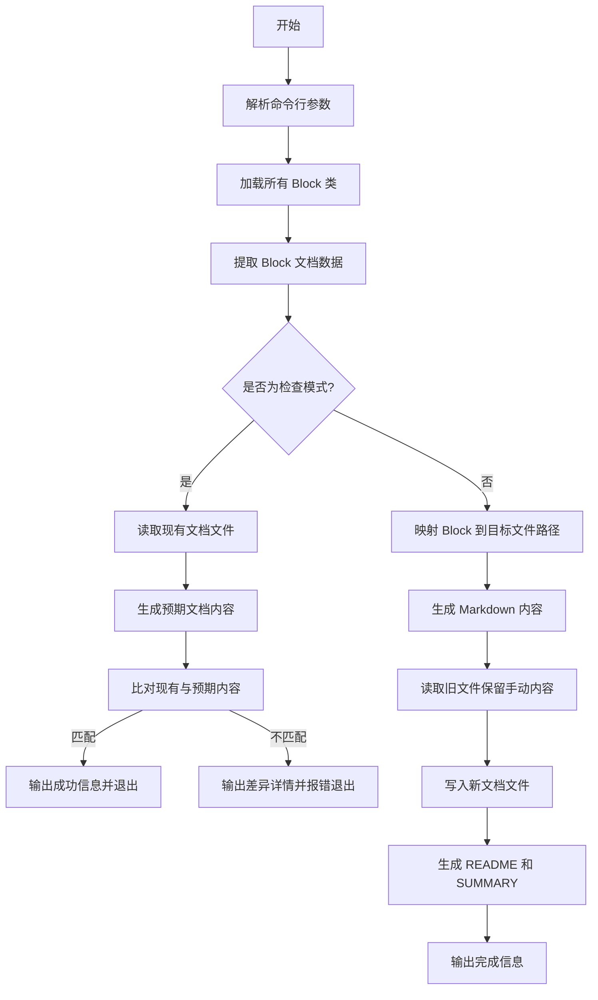

## 类结构

```
dataclass
├── FieldDoc
└── BlockDoc
```

## 全局变量及字段


### `logger`
    
The logger instance for recording script execution events and errors.

类型：`logging.Logger`
    


### `DEFAULT_OUTPUT_DIR`
    
The default directory path where generated documentation files will be saved.

类型：`pathlib.Path`
    


### `CATEGORY_DISPLAY_NAMES`
    
A mapping from internal category keys to human-readable category names.

类型：`dict[str, str]`
    


### `CATEGORY_FILE_MAP`
    
A mapping from internal category keys to output markdown filenames.

类型：`dict[str, str]`
    


### `FieldDoc.name`
    
The name of the input/output field.

类型：`str`
    


### `FieldDoc.description`
    
The description text explaining the field's purpose.

类型：`str`
    


### `FieldDoc.type_str`
    
The human-readable string representation of the field's type.

类型：`str`
    


### `FieldDoc.required`
    
A flag indicating whether the field is mandatory.

类型：`bool`
    


### `FieldDoc.default`
    
The default value for the field if not provided.

类型：`Any`
    


### `FieldDoc.advanced`
    
A flag indicating if this is an advanced configuration field.

类型：`bool`
    


### `FieldDoc.hidden`
    
A flag indicating whether the field should be hidden from the UI/docs.

类型：`bool`
    


### `FieldDoc.placeholder`
    
Placeholder text for the input field, typically used in UI forms.

类型：`str | None`
    


### `BlockDoc.id`
    
The unique identifier for the block.

类型：`str`
    


### `BlockDoc.name`
    
The human-readable display name of the block.

类型：`str`
    


### `BlockDoc.class_name`
    
The original Python class name of the block.

类型：`str`
    


### `BlockDoc.description`
    
A detailed description of what the block does.

类型：`str`
    


### `BlockDoc.categories`
    
A list of category keys associated with the block.

类型：`list[str]`
    


### `BlockDoc.category_descriptions`
    
A dictionary mapping category keys to their descriptions.

类型：`dict[str, str]`
    


### `BlockDoc.inputs`
    
A list of documentation objects for the block's input fields.

类型：`list[FieldDoc]`
    


### `BlockDoc.outputs`
    
A list of documentation objects for the block's output fields.

类型：`list[FieldDoc]`
    


### `BlockDoc.block_type`
    
The type of the block (e.g., action, trigger).

类型：`str`
    


### `BlockDoc.source_file`
    
The relative file path where the block class is defined.

类型：`str`
    


### `BlockDoc.contributors`
    
A list of contributors who authored or modified the block.

类型：`list[str]`
    
    

## 全局函数及方法


### `class_name_to_display_name`

将 PascalCase 风格的类名（通常以 "Block" 结尾）转换为人类可读的、带有空格分隔的字符串格式。

参数：

-   `class_name`：`str`，需要转换的类名字符串，通常为 CamelCase 或 PascalCase 格式。

返回值：`str`，转换后的可读字符串，已去除 "Block" 后缀并在单词边界处添加了空格。

#### 流程图

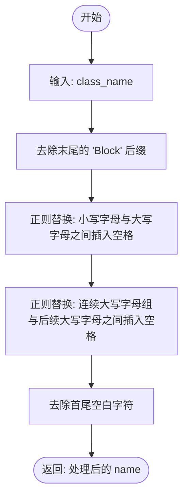

#### 带注释源码

```python
def class_name_to_display_name(class_name: str) -> str:
    """Convert BlockClassName to 'Block Class Name'."""
    # 步骤 1: 移除类名末尾的 'Block' 后缀
    # 仅移除末尾出现的特定字符串，避免移除名称中间的 'Block'
    name = class_name.removesuffix("Block")
    
    # 步骤 2: 在小写字母后跟大写字母的位置插入空格
    # 例如: "MyClass" -> "My Class"
    # 正则解释: ([a-z]) 捕获小写字母, ([A-Z]) 捕获大写字母, 替换为 "\1 \2" (即中间加空格)
    name = re.sub(r"([a-z])([A-Z])", r"\1 \2", name)
    
    # 步骤 3: 处理连续大写字母（缩写词）的情况
    # 例如: "HTTPRequest" -> "HTTP Request" (如果不处理可能显示不够友好)
    # 正则解释: ([A-Z]+) 捕获连续大写, ([A-Z][a-z]) 捕获后面紧跟的单词首字母
    # 这会在缩写词和新单词之间插入空格
    name = re.sub(r"([A-Z]+)([A-Z][a-z])", r"\1 \2", name)
    
    # 步骤 4: 去除可能产生的首尾空格并返回
    return name.strip()
```


### `type_to_readable`

将 JSON schema 类型定义转换为人类可读的字符串描述。

参数：

- `type_schema`：`dict[str, Any] | Any`，表示 JSON schema 类型定义的对象或任意类型。

返回值：`str`，人类可读的类型字符串表示（例如 "List[str]", "int | str", "Dict[str, Any]"）。

#### 流程图

```mermaid
flowchart TD
    A[开始: type_to_readable] --> B{输入是否为 dict?}
    B -- 否 --> C[返回 str type_schema 或 'Any']
    B -- 是 --> D{包含 'anyOf'?}
    
    D -- 是 --> E[遍历 anyOf 列表]
    E --> F[跳过 null 类型]
    F --> G[递归调用 type_to_readable]
    G --> H{剩余选项数量}
    H -- 0 --> I[返回 'None']
    H -- 1 --> J[返回 唯一选项]
    H -- >1 --> K[使用 ' | ' 连接选项并返回]
    
    D -- 否 --> L{包含 'allOf'?}
    L -- 是 --> M[取 allOf 第一个元素递归处理并返回]
    
    L -- 否 --> N[获取 'type' 字段]
    N --> O{判断 schema_type}
    
    O -- 'array' --> P[获取 items 类型]
    P --> P1[递归处理 items]
    P1 --> P2[返回 f\"List[item_type]\"]
    
    O -- 'object' --> Q{包含 'additionalProperties'?}
    Q -- True --> R[返回 \"Dict[str, Any]\"]
    Q -- Dict --> S[递归处理 value 类型]
    S --> S1[返回 f\"Dict[str, value_type]\"]
    Q -- 否 --> T[返回 'title' 或 \"Object\"]
    
    O -- 'string' --> U{包含 'enum'?}
    U -- 是 --> V[连接枚举值并返回]
    U -- 否 --> W{包含 'format'?}
    W -- 是 --> X[返回 f\"str format\"]
    W -- 否 --> Y[返回 \"str\"]
    
    O -- 'integer' --> Z[返回 \"int\"]
    O -- 'number' --> AA[返回 \"float\"]
    O -- 'boolean' --> AB[返回 \"bool\"]
    O -- 'null' --> AC[返回 \"None\"]
    
    O -- 其他/默认 --> AD[返回 'title' 或默认 \"Any\"]
```

#### 带注释源码

```python
def type_to_readable(type_schema: dict[str, Any] | Any) -> str:
    """Convert JSON schema type to human-readable string."""
    # 如果输入不是字典（可能已经是基本类型），直接转换为字符串
    if not isinstance(type_schema, dict):
        return str(type_schema) if type_schema else "Any"

    # 处理联合类型
    if "anyOf" in type_schema:
        # Union type - show options
        any_of = type_schema["anyOf"]
        if not isinstance(any_of, list):
            return "Any"
        options = []
        for opt in any_of:
            # 忽略 null 类型（通常表示可选）
            if isinstance(opt, dict) and opt.get("type") == "null":
                continue
            # 递归处理每个选项
            options.append(type_to_readable(opt))
        # 如果过滤后没有选项（全是 null），返回 None
        if not options:
            return "None"
        # 如果只剩一个选项，直接返回该选项
        if len(options) == 1:
            return options[0]
        # 使用 | 连接多个选项（如 int | str）
        return " | ".join(options)

    # 处理 allOf 类型（通常取第一个定义）
    if "allOf" in type_schema:
        all_of = type_schema["allOf"]
        if not isinstance(all_of, list) or not all_of:
            return "Any"
        return type_to_readable(all_of[0])

    # 获取基本类型标识
    schema_type = type_schema.get("type")

    # 处理数组类型
    if schema_type == "array":
        items = type_schema.get("items", {})
        # 递归处理数组元素的类型
        item_type = type_to_readable(items)
        return f"List[{item_type}]"

    # 处理对象类型
    if schema_type == "object":
        # 检查是否定义了 additionalProperties（即字典的值类型）
        if "additionalProperties" in type_schema:
            additional_props = type_schema["additionalProperties"]
            # 如果为 True，表示任意值
            if additional_props is True:
                return "Dict[str, Any]"
            # 递归处理值类型
            value_type = type_to_readable(additional_props)
            return f"Dict[str, {value_type}]"
        # 如果是特定模型，返回其标题
        title = type_schema.get("title", "Object")
        return title

    # 处理字符串类型
    if schema_type == "string":
        # 如果是枚举，列出所有枚举值
        if "enum" in type_schema:
            return " | ".join(f'"{v}"' for v in type_schema["enum"])
        # 如果有格式定义（如 date-time），添加格式说明
        if "format" in type_schema:
            return f"str ({type_schema['format']})"
        return "str"

    # 处理基本类型
    if schema_type == "integer":
        return "int"

    if schema_type == "number":
        return "float"

    if schema_type == "boolean":
        return "bool"

    if schema_type == "null":
        return "None"

    # 兜底逻辑：尝试返回标题或类型名
    return type_schema.get("title", schema_type or "Any")
```


### `safe_get`

Safely get a value from a dict-like object.

参数：

-   `d`：`Any`，要从中获取值的字典类对象。
-   `key`：`str`，要在对象中查找的键。
-   `default`：`Any`，如果找不到键或对象不是字典时返回的默认值。

返回值：`Any`，与键关联的值，或默认值。

#### 流程图

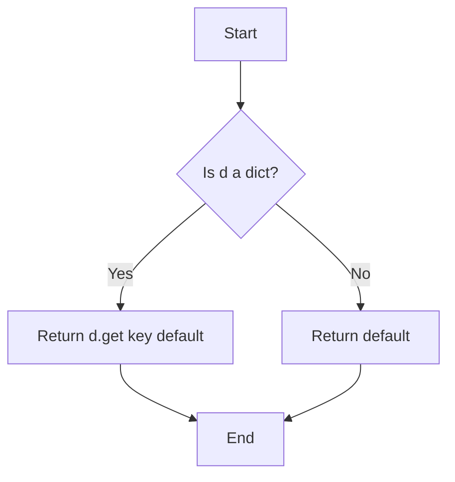

#### 带注释源码

```python
def safe_get(d: Any, key: str, default: Any = None) -> Any:
    """Safely get a value from a dict-like object."""
    # 检查输入对象 d 是否是字典类型
    if isinstance(d, dict):
        # 如果是字典，使用字典的 get 方法获取 key 对应的值
        # 如果 key 不存在，则返回 default
        return d.get(key, default)
    # 如果 d 不是字典，直接返回 default 值
    return default
```


### `file_path_to_title`

Converts a file path string into a human-readable title, handling title casing and specific acronym/brand name corrections (e.g., "Llm" to "LLM", "Github" to "GitHub").

参数：

-  `file_path`：`str`，The file path string to be converted (e.g., "google/sheets.md" or "basic.md").
返回值：`str`，The formatted, human-readable title (e.g., "Google Sheets" or "Basic").

#### 流程图

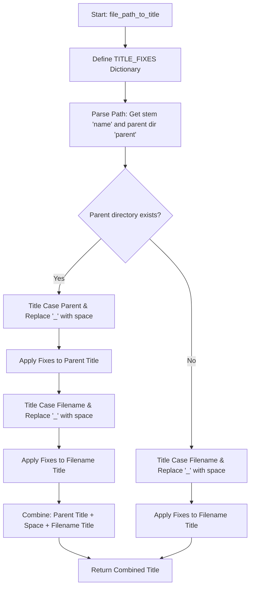

#### 带注释源码

```python
def file_path_to_title(file_path: str) -> str:
    """Convert file path to a readable title.

    Examples:
        "github/issues.md" -> "GitHub Issues"
        "basic.md" -> "Basic"
        "llm.md" -> "LLM"
        "google/sheets.md" -> "Google Sheets"
    """
    # Dictionary mapping specific words to their corrected display forms (e.g., acronyms, brand names)
    TITLE_FIXES = {
        "Llm": "LLM",
        "Github": "GitHub",
        "Api": "API",
        "Ai": "AI",
        "Oauth": "OAuth",
        "Url": "URL",
        "Ci": "CI",
        "Pr": "PR",
        "Gmb": "GMB",  # Google My Business
        "Hubspot": "HubSpot",
        "Linkedin": "LinkedIn",
        "Tiktok": "TikTok",
        "Youtube": "YouTube",
    }

    def apply_fixes(text: str) -> str:
        # Helper function to apply the TITLE_FIXES to a string
        # Split into words, fix each word, rejoin
        words = text.split()
        fixed_words = [TITLE_FIXES.get(word, word) for word in words]
        return " ".join(fixed_words)

    path = Path(file_path)
    name = path.stem  # e.g., "issues" or "sheets" (filename without extension)

    # Get parent dir if exists (e.g., "github" from "github/issues.md")
    parent = path.parent.name if path.parent.name != "." else None

    # Title case and apply fixes
    if parent:
        # If there is a subdirectory, format both parent and child names
        # e.g., "google" -> "Google", "sheets" -> "Sheets" -> "Google Sheets"
        parent_title = apply_fixes(parent.replace("_", " ").title())
        name_title = apply_fixes(name.replace("_", " ").title())
        return f"{parent_title} {name_title}"
    
    # If no subdirectory, just format the filename
    # e.g., "basic" -> "Basic", "llm" -> "LLM"
    return apply_fixes(name.replace("_", " ").title())
```


### `extract_block_doc`

从给定的块类中提取结构化文档数据，包括输入输出字段、类别、元数据等信息。

参数：

-   `block_cls`：`type`，需要提取文档的块类（Block Class）。

返回值：`BlockDoc`，包含提取的文档信息的数据类对象（ID、名称、描述、输入输出列表等）。

#### 流程图

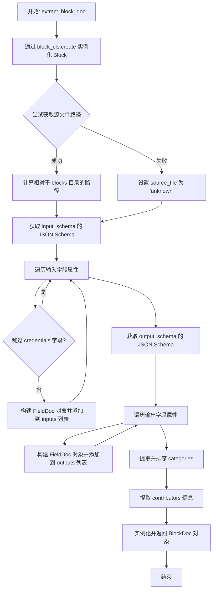

#### 带注释源码

```python
def extract_block_doc(block_cls: type) -> BlockDoc:
    """Extract documentation data from a block class."""
    # 实例化块以访问其属性和 schema
    block = block_cls.create()

    # 获取源文件路径
    try:
        source_file = inspect.getfile(block_cls)
        # 计算相对于 blocks 目录的路径
        blocks_dir = Path(source_file).parent
        while blocks_dir.name != "blocks" and blocks_dir.parent != blocks_dir:
            blocks_dir = blocks_dir.parent
        source_file = str(Path(source_file).relative_to(blocks_dir.parent))
    except (TypeError, ValueError):
        source_file = "unknown"

    # 提取输入字段
    input_schema = block.input_schema.jsonschema()
    input_properties = safe_get(input_schema, "properties", {})
    if not isinstance(input_properties, dict):
        input_properties = {}
    required_raw = safe_get(input_schema, "required", [])
    # 处理 required 字段可能不是列表的边界情况
    if isinstance(required_raw, (list, set, tuple)):
        required_inputs = set(required_raw)
    else:
        required_inputs = set()

    inputs = []
    for field_name, field_schema in input_properties.items():
        if not isinstance(field_schema, dict):
            continue
        # 跳过文档中的凭据字段（它们是自动处理的）
        if "credentials" in field_name.lower():
            continue

        # 构建 FieldDoc 对象并添加到列表
        inputs.append(
            FieldDoc(
                name=field_name,
                description=safe_get(field_schema, "description", ""),
                type_str=type_to_readable(field_schema),
                required=field_name in required_inputs,
                default=safe_get(field_schema, "default"),
                advanced=safe_get(field_schema, "advanced", False) or False,
                hidden=safe_get(field_schema, "hidden", False) or False,
                placeholder=safe_get(field_schema, "placeholder"),
            )
        )

    # 提取输出字段
    output_schema = block.output_schema.jsonschema()
    output_properties = safe_get(output_schema, "properties", {})
    if not isinstance(output_properties, dict):
        output_properties = {}

    outputs = []
    for field_name, field_schema in output_properties.items():
        if not isinstance(field_schema, dict):
            continue
        outputs.append(
            FieldDoc(
                name=field_name,
                description=safe_get(field_schema, "description", ""),
                type_str=type_to_readable(field_schema),
                required=True,  # 输出总是会被生成
                hidden=safe_get(field_schema, "hidden", False) or False,
            )
        )

    # 获取类别信息（排序以确保确定性，因为它是集合）
    categories = []
    category_descriptions = {}
    for cat in sorted(block.categories, key=lambda c: c.name):
        categories.append(cat.name)
        category_descriptions[cat.name] = cat.value

    # 获取贡献者信息
    contributors = []
    for contrib in block.contributors:
        contributors.append(contrib.name if hasattr(contrib, "name") else str(contrib))

    # 返回构建好的 BlockDoc 对象
    return BlockDoc(
        id=block.id,
        name=class_name_to_display_name(block.name),
        class_name=block.name,
        description=block.description,
        categories=categories,
        category_descriptions=category_descriptions,
        inputs=inputs,
        outputs=outputs,
        block_type=block.block_type.value,
        source_file=source_file,
        contributors=contributors,
    )
```


### `generate_anchor`

该函数的主要功能是将给定的字符串（通常是块名称）转换为符合 Markdown 标准的锚点链接格式。它通过将字符串小写化、替换空格为连字符以及移除括号来实现这一目的，确保生成的锚点 ID 在文档中是唯一且有效的。

参数：

-  `name`：`str`，需要进行转换的原始名称字符串（例如块类的显示名称）。

返回值：`str`，处理后的 Markdown 锚点字符串，格式为全小写，空格替换为连字符，且不包含括号。

#### 流程图

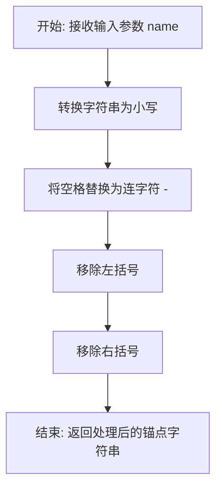

#### 带注释源码

```python
def generate_anchor(name: str) -> str:
    """Generate markdown anchor from block name."""
    # 1. 将输入字符串全部转换为小写
    # 2. 将所有空格替换为连字符 "-" (Markdown anchor 常见格式)
    # 3. 移除所有的左括号 "("
    # 4. 移除所有的右括号 ")"
    # 返回最终生成的锚点字符串
    return name.lower().replace(" ", "-").replace("(", "").replace(")", "")
```


### `extract_manual_content`

从现有文档文件字符串中提取位于特定 HTML 注释标记之间的内容，以便在重新生成文档时保留手动编辑的部分。

参数：

- `existing_content`：`str`，包含现有 Markdown 文档的完整文本内容。

返回值：`dict[str, str]`，键为 section 名称（如 "how_it_works"），值为提取的对应内容文本的字典。

#### 流程图

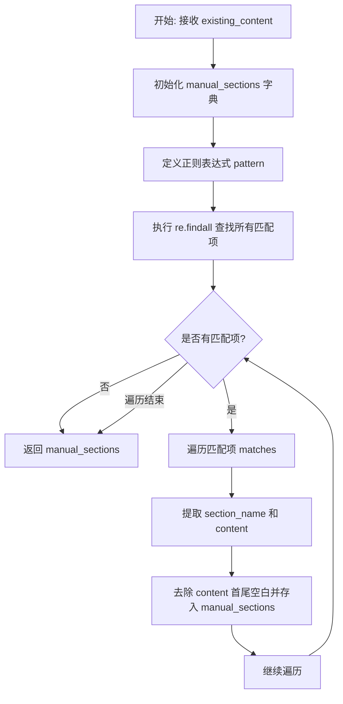

#### 带注释源码

```python
def extract_manual_content(existing_content: str) -> dict[str, str]:
    """Extract content between MANUAL markers from existing file."""
    # 初始化一个字典，用于存储提取到的各个节段内容
    manual_sections = {}

    # 定义正则表达式模式：
    # <!-- MANUAL: (\w+) --> : 匹配开始标记，并捕获节段名称（\w+ 表示单词字符）
    # \s*                : 匹配任意数量的空白字符
    # (.*?)              : 非贪婪匹配中间的内容，并捕获
    # \s*                : 再次匹配任意数量的空白字符
    # <!-- END MANUAL -->: 匹配结束标记
    pattern = r"<!-- MANUAL: (\w+) -->\s*(.*?)\s*<!-- END MANUAL -->"
    
    # 使用 re.DOTALL 标志，使 . 可以匹配包括换行符在内的所有字符
    matches = re.findall(pattern, existing_content, re.DOTALL)

    # 遍历所有找到的匹配项
    for section_name, content in matches:
        # 将节段名作为键，去除首尾空格后的内容作为值存入字典
        manual_sections[section_name] = content.strip()

    return manual_sections
```


### `generate_block_markdown`

生成单个块的 Markdown 文档，结合自动生成的字段信息和保留的手动编写内容部分。

参数：

-   `block`：`BlockDoc`，包含块详细信息的文档数据对象。
-   `manual_content`：`dict[str, str] | None`，一个可选的字典，包含从之前生成过程中保留的手动编写内容（如“如何工作”部分的解释或示例）。如果为 None，则默认为空字典。

返回值：`str`，生成的完整 Markdown 格式字符串。

#### 流程图

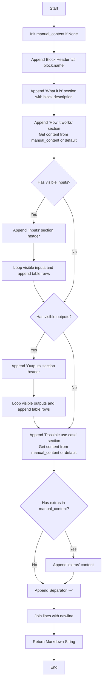

#### 带注释源码

```python
def generate_block_markdown(
    block: BlockDoc,
    manual_content: dict[str, str] | None = None,
) -> str:
    """Generate markdown documentation for a single block."""
    # 如果没有提供手动内容，则初始化为空字典
    manual_content = manual_content or {}
    lines = []

    # 1. 添加块标题（二级标题）
    # All blocks use ## heading, sections use ### (consistent siblings)
    lines.append(f"## {block.name}")
    lines.append("")

    # 2. 添加“它是什么”部分（块的全量描述）
    # What it is (full description)
    lines.append("### What it is")
    lines.append(block.description or "No description available.")
    lines.append("")

    # 3. 添加“它是如何工作的”部分（手动编写部分）
    # How it works (manual section)
    lines.append("### How it works")
    # 尝试从 manual_content 获取内容，如果没有则使用默认占位符
    how_it_works = manual_content.get(
        "how_it_works", "_Add technical explanation here._"
    )
    # 包裹在特殊注释标记中，以便下次提取时保留
    lines.append("<!-- MANUAL: how_it_works -->")
    lines.append(how_it_works)
    lines.append("<!-- END MANUAL -->")
    lines.append("")

    # 4. 添加输入表格（自动生成）
    # Inputs table (auto-generated)
    # 过滤掉隐藏的字段
    visible_inputs = [f for f in block.inputs if not f.hidden]
    if visible_inputs:
        lines.append("### Inputs")
        lines.append("")
        # Markdown 表格头
        lines.append("| Input | Description | Type | Required |")
        lines.append("|-------|-------------|------|----------|")
        for inp in visible_inputs:
            required = "Yes" if inp.required else "No"
            desc = inp.description or "-"
            type_str = inp.type_str or "-"
            # 处理换行符并转义管道符以保证表格语法有效
            desc = desc.replace("\n", " ").replace("|", "\\|")
            type_str = type_str.replace("|", "\\|")
            lines.append(f"| {inp.name} | {desc} | {type_str} | {required} |")
        lines.append("")

    # 5. 添加输出表格（自动生成）
    # Outputs table (auto-generated)
    visible_outputs = [f for f in block.outputs if not f.hidden]
    if visible_outputs:
        lines.append("### Outputs")
        lines.append("")
        # Markdown 表格头
        lines.append("| Output | Description | Type |")
        lines.append("|--------|-------------|------|")
        for out in visible_outputs:
            desc = out.description or "-"
            type_str = out.type_str or "-"
            # 处理换行符并转义管道符
            desc = desc.replace("\n", " ").replace("|", "\\|")
            type_str = type_str.replace("|", "\\|")
            lines.append(f"| {out.name} | {desc} | {type_str} |")
        lines.append("")

    # 6. 添加可能的用例部分（手动编写部分）
    # Possible use case (manual section)
    lines.append("### Possible use case")
    use_case = manual_content.get("use_case", "_Add practical use case examples here._")
    lines.append("<!-- MANUAL: use_case -->")
    lines.append(use_case)
    lines.append("<!-- END MANUAL -->")
    lines.append("")

    # 7. 可选的额外内容部分（仅当有内容时包含）
    # Optional per-block extras (only include if has content)
    extras = manual_content.get("extras", "")
    if extras:
        lines.append("<!-- MANUAL: extras -->")
        lines.append(extras)
        lines.append("<!-- END MANUAL -->")
        lines.append("")

    # 8. 添加分隔线
    lines.append("---")
    lines.append("")

    # 将所有行合并为字符串返回
    return "\n".join(lines)
```


### `get_block_file_mapping`

根据 Block 的源文件路径结构或所属类别，将其映射到对应的文档文件路径中，实现文档的分类和归档。

参数：

-   `blocks`：`list[BlockDoc]`，包含所有 Block 元数据信息的列表。

返回值：`dict[str, list[BlockDoc]]`，键为相对文件路径（字符串），值为该路径下对应的 Block 文档对象列表。

#### 流程图

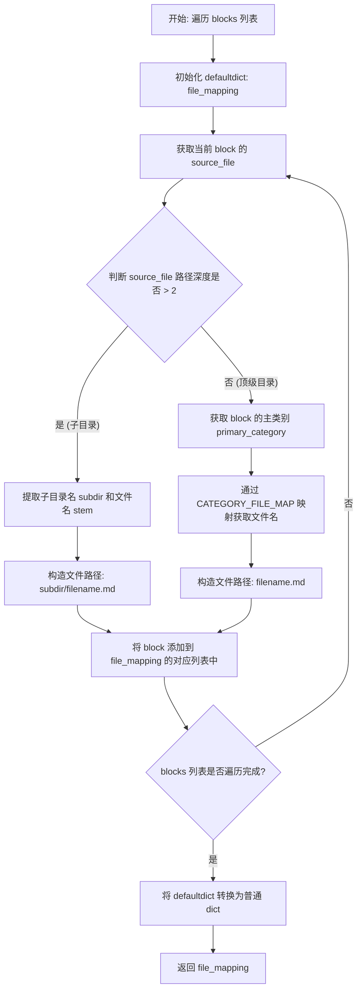

#### 带注释源码

```python
def get_block_file_mapping(blocks: list[BlockDoc]) -> dict[str, list[BlockDoc]]:
    """
    Map blocks to their documentation files.

    Returns dict of {relative_file_path: [blocks]}
    """
    # 使用 defaultdict 自动初始化空列表，方便后续追加
    file_mapping = defaultdict(list)

    for block in blocks:
        # 解析 Block 的源文件路径
        source_path = Path(block.source_file)

        # 如果源文件位于子目录中（例如 blocks/google/gmail.py，parts长度>2），则保持目录结构
        if len(source_path.parts) > 2:  # blocks/subdir/file.py
            subdir = source_path.parts[1]  # 获取子目录名，例如 "google"
            # 使用 Python 文件名作为 Markdown 文件名（例如 "gmail.md"）
            md_file = source_path.stem + ".md"  # e.g., "gmail.md"
            # 拼接相对路径: "google/gmail.md"
            file_path = f"{subdir}/{md_file}"
        else:
            # 对于位于顶级目录的 Block，根据其类别进行分组
            primary_category = block.categories[0] if block.categories else "BASIC"
            # 查找类别对应的文件名映射，如果没有则默认为 "misc"
            file_name = CATEGORY_FILE_MAP.get(primary_category, "misc")
            # 拼接相对路径: "llm.md"
            file_path = f"{file_name}.md"

        # 将当前 Block 对象追加到对应文件路径的列表中
        file_mapping[file_path].append(block)

    # 将 defaultdict 转换为标准的 dict 返回
    return dict(file_mapping)
```


### `generate_overview_table`

生成概述表的 Markdown 内容（blocks.md），列出所有可用的块，按类别分组，并包含 GitBook 前置内容。

参数：

- `blocks`：`list[BlockDoc]`，块文档对象的列表。
- `block_dir_prefix`：`str`，块文件链接的前缀（例如 "block-integrations/"）。

返回值：`str`，生成的 Markdown 字符串。

#### 流程图

```mermaid
flowchart TD
    A[开始] --> B[初始化 lines 列表]
    B --> C[添加 GitBook YAML 前置内容]
    C --> D[添加标题、简介和提示信息]
    D --> E[按类别分组 blocks]
    E --> F{遍历预定义的 category_order}
    F --> G{该类别是否有 blocks?}
    G -- 否 --> F
    G -- 是 --> H[获取类别的显示名称 DisplayName]
    H --> I{DisplayName 是否已输出?}
    I -- 是 --> J[合并模式: 移除最后的空行]
    J --> K[向现有表格追加行]
    I -- 否 --> L[标记 DisplayName 为已输出]
    L --> M[添加二级标题 DisplayName]
    M --> N[添加表格头]
    N --> K
    K --> O[遍历该类别下的 block]
    O --> P[生成链接路径和锚点]
    P --> Q[提取简短描述]
    Q --> R[添加表格行: Block Name | Description]
    R --> O
    O --> S[添加空行]
    S --> F
    F --> T[结束循环]
    T --> U[合并 lines 并返回字符串]
    U --> V[结束]
```

#### 带注释源码

```python
def generate_overview_table(blocks: list[BlockDoc], block_dir_prefix: str = "") -> str:
    """Generate the overview table markdown (blocks.md).

    Args:
        blocks: List of block documentation objects
        block_dir_prefix: Prefix for block file links (e.g., "block-integrations/")
    """
    lines = []

    # --- GitBook YAML frontmatter ---
    # 定义 GitBook 页面的布局、元数据可见性等配置
    lines.append("---")
    lines.append("layout:")
    lines.append("  width: default")
    lines.append("  title:")
    lines.append("    visible: true")
    lines.append("  description:")
    lines.append("    visible: true")
    lines.append("  tableOfContents:")
    lines.append("  visible: false")
    lines.append("  outline:")
    lines.append("    visible: true")
    lines.append("  pagination:")
    lines.append("    visible: true")
    lines.append("  metadata:")
    lines.append("    visible: true")
    lines.append("---")
    lines.append("")

    # --- 标题与简介 ---
    lines.append("# AutoGPT Blocks Overview")
    lines.append("")
    lines.append(
        'AutoGPT uses a modular approach with various "blocks" to handle different tasks. These blocks are the building blocks of AutoGPT workflows, allowing users to create complex automations by combining simple, specialized components.'
    )
    lines.append("")
    lines.append('')
    lines.append("**Creating Your Own Blocks**")
    lines.append("")
    lines.append("Want to create your own custom blocks? Check out our guides:")
    lines.append("")
    lines.append(
        "* [Build your own Blocks](https://docs.agpt.co/platform/new_blocks/) - Step-by-step tutorial with examples"
    )
    lines.append(
        "* [Block SDK Guide](https://docs.agpt.co/platform/block-sdk-guide/) - Advanced SDK patterns with OAuth, webhooks, and provider configuration"
    )
    lines.append("")
    lines.append("")
    lines.append(
        "Below is a comprehensive list of all available blocks, categorized by their primary function. Click on any block name to view its detailed documentation."
    )
    lines.append("")

    # --- 数据准备 ---
    # 将 blocks 按主类别分组
    by_category = defaultdict(list)
    for block in blocks:
        primary_cat = block.categories[0] if block.categories else "BASIC"
        by_category[primary_cat].append(block)

    # 定义类别的显示顺序
    category_order = [
        "BASIC",
        "DATA",
        "TEXT",
        "AI",
        "SEARCH",
        "SOCIAL",
        "COMMUNICATION",
        "DEVELOPER_TOOLS",
        "MULTIMEDIA",
        "PRODUCTIVITY",
        "LOGIC",
        "INPUT",
        "OUTPUT",
        "AGENT",
        "CRM",
        "SAFETY",
        "ISSUE_TRACKING",
        "HARDWARE",
        "MARKETING",
    ]

    # --- 生成表格内容 ---
    # 用于跟踪已输出的显示名称，处理如 INPUT 和 OUTPUT 映射到同一个显示名称的情况
    emitted_display_names: set[str] = set()

    for category in category_order:
        if category not in by_category:
            continue

        display_name = CATEGORY_DISPLAY_NAMES.get(category, category)

        # 如果显示名称已存在，则合并到上一个表格中（例如 INPUT 和 OUTPUT 都在 "Input/Output" 下）
        if display_name in emitted_display_names:
            # 已输出表头，只需追加行
            cat_blocks = sorted(by_category[category], key=lambda b: b.name)
            # 移除末尾的空行，添加行，再重新添加空行
            lines.pop()
            for block in cat_blocks:
                file_mapping = get_block_file_mapping([block])
                file_path = list(file_mapping.keys())[0]
                anchor = generate_anchor(block.name)
                # 获取第一句话作为简短描述
                short_desc = (
                    block.description.split(".")[0]
                    if block.description
                    else "No description"
                )
                short_desc = short_desc.replace("\n", " ").replace("|", "\\|")
                link_path = f"{block_dir_prefix}{file_path}"
                lines.append(f"| [{block.name}]({link_path}#{anchor}) | {short_desc} |")
            lines.append("")
            continue

        # 新的显示名称，创建新章节
        emitted_display_names.add(display_name)
        cat_blocks = sorted(by_category[category], key=lambda b: b.name)

        lines.append(f"## {display_name}")
        lines.append("")
        lines.append("| Block Name | Description |")
        lines.append("|------------|-------------|")

        for block in cat_blocks:
            # 确定链接路径
            file_mapping = get_block_file_mapping([block])
            file_path = list(file_mapping.keys())[0]
            anchor = generate_anchor(block.name)

            # 简短描述（第一句话）
            short_desc = (
                block.description.split(".")[0]
                if block.description
                else "No description"
            )
            short_desc = short_desc.replace("\n", " ").replace("|", "\\|")

            link_path = f"{block_dir_prefix}{file_path}"
            lines.append(f"| [{block.name}]({link_path}#{anchor}) | {short_desc} |")

        lines.append("")

    return "\n".join(lines)
```


### `generate_summary_md`

该函数用于为 GitBook 导航生成 `SUMMARY.md` 文件的内容。它会创建一个包含概述页面链接、指南目录（如果存在）以及按文件路径映射的块集成文档链接的 Markdown 字符串。

参数：

- `blocks`：`list[BlockDoc]`，块文档对象的列表，包含需要生成导航链接的所有块信息。
- `root_dir`：`Path`，文档的根目录路径（例如 `docs/integrations/`），用于检查是否存在指南目录。
- `block_dir_prefix`：`str`，块文件链接的前缀（例如 `"block-integrations/"`），用于构建相对路径。

返回值：`str`，生成的 `SUMMARY.md` 文件的完整 Markdown 内容字符串。

#### 流程图

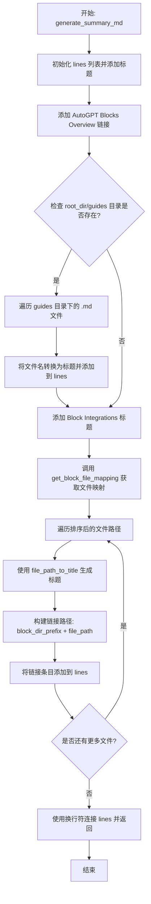

#### 带注释源码

```python
def generate_summary_md(
    blocks: list[BlockDoc], root_dir: Path, block_dir_prefix: str = ""
) -> str:
    """Generate SUMMARY.md for GitBook navigation.

    Args:
        blocks: List of block documentation objects
        root_dir: The root docs directory (e.g., docs/integrations/)
        block_dir_prefix: Prefix for block file links (e.g., "block-integrations/")
    """
    lines = []
    # 添加 GitBook 目录的主标题
    lines.append("# Table of contents")
    lines.append("")
    
    # 添加指向主概述页面的链接
    lines.append("* [AutoGPT Blocks Overview](README.md)")
    lines.append("")

    # 检查根目录下是否存在 guides（指南）文件夹
    guides_dir = root_dir / "guides"
    if guides_dir.exists():
        lines.append("## Guides")
        lines.append("")
        # 遍历 guides 目录下的所有 markdown 文件
        for guide_file in sorted(guides_dir.glob("*.md")):
            # 使用文件名生成可读的标题（处理连字符和下划线）
            title = file_path_to_title(guide_file.stem.replace("-", "_") + ".md")
            lines.append(f"* [{title}](guides/{guide_file.name})")
        lines.append("")

    # 添加块集成部分的小节标题
    lines.append("## Block Integrations")
    lines.append("")

    # 获取块到输出文件的映射关系
    file_mapping = get_block_file_mapping(blocks)
    # 按文件路径排序并遍历
    for file_path in sorted(file_mapping.keys()):
        # 将文件路径转换为可读的标题
        title = file_path_to_title(file_path)
        # 组合链接前缀和文件路径，构建 Markdown 链接
        link_path = f"{block_dir_prefix}{file_path}"
        lines.append(f"* [{title}]({link_path})")

    lines.append("")

    # 将所有行合并为一个字符串并返回
    return "\n".join(lines)
```


### `load_all_blocks_for_docs`

该函数负责从后端加载所有可用的代码块类，并对每个类提取其文档信息，最终将这些信息聚合为一个结构化的列表返回。

参数：

无

返回值：`list[BlockDoc]`，包含所有成功提取文档信息的代码块对象列表。

#### 流程图

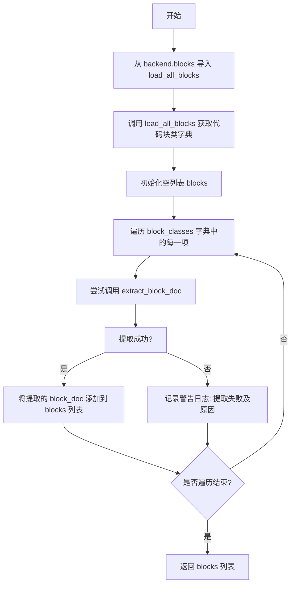

#### 带注释源码

```python
def load_all_blocks_for_docs() -> list[BlockDoc]:
    """Load all blocks and extract documentation."""
    # 导入后端的核心加载函数，用于发现并加载所有的 Block 类
    from backend.blocks import load_all_blocks

    # 调用加载函数，获取所有代码块类的字典 {block_id: block_class}
    block_classes = load_all_blocks()
    blocks = []

    # 遍历所有加载到的代码块类
    for _block_id, block_cls in block_classes.items():
        try:
            # 尝试从单个 Block 类中提取文档数据
            block_doc = extract_block_doc(block_cls)
            # 将提取成功的文档对象加入列表
            blocks.append(block_doc)
        except Exception as e:
            # 如果提取过程发生异常（如类结构不符合预期），记录警告日志并跳过该块
            logger.warning(f"Failed to extract docs for {block_cls.__name__}: {e}")

    # 返回包含所有代码块文档信息的列表
    return blocks
```


### `write_block_docs`

将块文档文件写入指定目录，根据块源文件或类别组织文件结构，保留现有文件中的手动编辑内容，并在父目录生成概览和导航文件。

参数：

-  `output_dir`：`Path`，生成文档的根输出目录路径。
-  `blocks`：`list[BlockDoc]`，包含所有块文档数据的对象列表。
-  `verbose`：`bool`，是否打印详细处理过程信息的标志。

返回值：`dict[str, str]`，包含生成的文件路径及其对应内容的字典。

#### 流程图

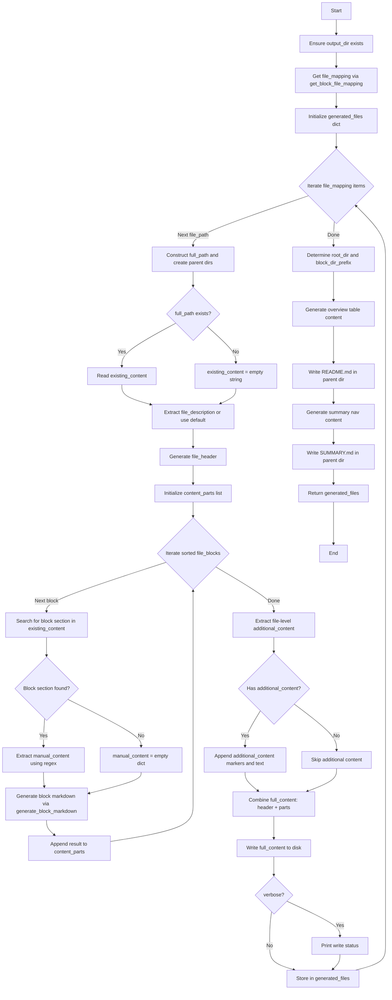

#### 带注释源码

```python
def write_block_docs(
    output_dir: Path,
    blocks: list[BlockDoc],
    verbose: bool = False,
) -> dict[str, str]:
    """
    Write block documentation files.

    Returns dict of {file_path: content} for all generated files.
    """
    # 确保输出目录存在
    output_dir = Path(output_dir)
    output_dir.mkdir(parents=True, exist_ok=True)

    # 获取块到文件的映射关系（例如： blocks/google/gmail.py -> google/gmail.md）
    file_mapping = get_block_file_mapping(blocks)
    generated_files = {}

    # 遍历每个目标文件
    for file_path, file_blocks in file_mapping.items():
        full_path = output_dir / file_path

        # 如果需要，创建子目录（例如 docs/integrations/block-integrations/google/）
        full_path.parent.mkdir(parents=True, exist_ok=True)

        # 加载现有内容以保留手动编写的部分
        existing_content = ""
        if full_path.exists():
            existing_content = full_path.read_text()

        # 始终从文件路径生成标题（应用特定的名称修正）
        file_title = file_path_to_title(file_path)

        # 尝试从现有文件中提取文件描述（保留手动内容）
        file_header_pattern = (
            r"^# .+?\n<!-- MANUAL: file_description -->\n(.*?)\n<!-- END MANUAL -->"
        )
        file_header_match = re.search(file_header_pattern, existing_content, re.DOTALL)

        if file_header_match:
            file_description = file_header_match.group(1)
        else:
            file_description = "_Add a description of this category of blocks._"

        # 生成文件头部（标题 + 描述）
        file_header = f"# {file_title}\n"
        file_header += "<!-- MANUAL: file_description -->\n"
        file_header += f"{file_description}\n"
        file_header += "<!-- END MANUAL -->\n"

        # 为每个块生成内容
        content_parts = []
        for block in sorted(file_blocks, key=lambda b: b.name):
            # 提取特定于此块的手动内容
            # 匹配块标题（h2）并捕获直到 --- 分隔符的内容
            block_pattern = rf"(?:^|\n)## {re.escape(block.name)}\s*\n(.*?)(?=\n---|\Z)"
            block_match = re.search(block_pattern, existing_content, re.DOTALL)
            if block_match:
                manual_content = extract_manual_content(block_match.group(1))
            else:
                manual_content = {}

            # 生成块的 Markdown（合并自动生成数据和保留的手动内容）
            content_parts.append(
                generate_block_markdown(
                    block,
                    manual_content,
                )
            )

        # 如果存在，添加文件级别的 additional_content 部分
        file_additional = extract_manual_content(existing_content).get(
            "additional_content", ""
        )
        if file_additional:
            content_parts.append("<!-- MANUAL: additional_content -->")
            content_parts.append(file_additional)
            content_parts.append("<!-- END MANUAL -->")
            content_parts.append("")

        # 组合头部和所有块内容
        full_content = file_header + "\n" + "\n".join(content_parts)
        generated_files[str(file_path)] = full_content

        if verbose:
            print(f"  Writing {file_path} ({len(file_blocks)} blocks)")

        # 将内容写入磁盘
        full_path.write_text(full_content)

    # 在父目录生成概览文件，链接前缀指向 block-integrations/
    root_dir = output_dir.parent
    block_dir_name = output_dir.name  # "block-integrations"
    block_dir_prefix = f"{block_dir_name}/"

    # 生成概览表 {
        blocks, block_dir_prefix
    )
    overview_path = root_dir / "README.md"
    generated_files["README.md"] = overview_content
    overview_path.write_text(overview_content)

    if verbose:
        print("  Writing README.md (overview) to parent directory")

    # 生成 GitBook 导航 {
        blocks, root_dir, block_dir_prefix
    )
    summary_path = root_dir / "SUMMARY.md"
    generated_files["SUMMARY.md"] = summary_content
    summary_path.write_text(summary_content)

    if verbose:
        print("  Writing SUMMARY.md (navigation) to parent directory")

    return generated_files
```


### `check_docs_in_sync`

检查生成的文档是否与磁盘上现有的文档匹配。该函数用于验证代码变更后文档是否为最新状态。

参数：

- `output_dir`: `Path`，文档输出目录路径
- `blocks`: `list[BlockDoc]`，从代码中提取的所有区块文档对象列表

返回值：`bool`，如果所有文档均同步（内容一致）返回 True，否则返回 False。

#### 流程图

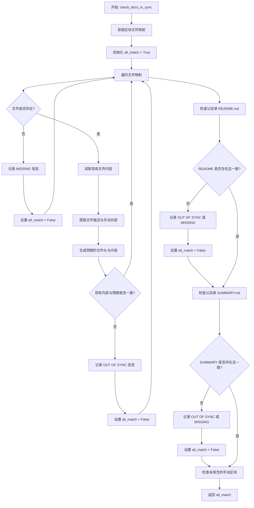

#### 带注释源码

```python
def check_docs_in_sync(output_dir: Path, blocks: list[BlockDoc]) -> bool:
    """
    Check if generated docs match existing docs.

    Returns True if in sync, False otherwise.
    """
    output_dir = Path(output_dir)
    # 获取区块到文件的映射关系
    file_mapping = get_block_file_mapping(blocks)

    all_match = True
    out_of_sync_details: list[tuple[str, list[str]]] = []

    # 遍历所有需要生成的文档文件
    for file_path, file_blocks in file_mapping.items():
        full_path = output_dir / file_path

        # 检查文件是否存在
        if not full_path.exists():
            block_names = [b.name for b in sorted(file_blocks, key=lambda b: b.name)]
            print(f"MISSING: {file_path}")
            print(f"  Blocks: {', '.join(block_names)}")
            out_of_sync_details.append((file_path, block_names))
            all_match = False
            continue

        existing_content = full_path.read_text()

        # 始终根据文件路径生成标题（应用修复）
        file_title = file_path_to_title(file_path)

        # 提取现有文件描述（如果存在，保留手动内容）
        file_header_pattern = (
            r"^# .+?\n<!-- MANUAL: file_description -->\n(.*?)\n<!-- END MANUAL -->"
        )
        file_header_match = re.search(file_header_pattern, existing_content, re.DOTALL)

        if file_header_match:
            file_description = file_header_match.group(1)
        else:
            file_description = "_Add a description of this category of blocks._"

        # 生成预期的文件头
        file_header = f"# {file_title}\n"
        file_header += "<!-- MANUAL: file_description -->\n"
        file_header += f"{file_description}\n"
        file_header += "<!-- END MANUAL -->\n"

        # 从现有文件中提取每个区块的手动内容
        manual_sections_by_block = {}
        for block in file_blocks:
            block_pattern = rf"(?:^|\n)## {re.escape(block.name)}\s*\n(.*?)(?=\n---|\Z)"
            block_match = re.search(block_pattern, existing_content, re.DOTALL)
            if block_match:
                manual_sections_by_block[block.name] = extract_manual_content(
                    block_match.group(1)
                )

        # 生成预期内容并逐个检查区块
        content_parts = []
        mismatched_blocks = []
        for block in sorted(file_blocks, key=lambda b: b.name):
            manual_content = manual_sections_by_block.get(block.name, {})
            expected_block_content = generate_block_markdown(
                block,
                manual_content,
            )
            content_parts.append(expected_block_content)

            # 检查此特定区块部分是否存在并匹配
            # 包含 --- 分隔符以匹配 generate_block_markdown 输出
            block_pattern = rf"(?:^|\n)(## {re.escape(block.name)}\s*\n.*?\n---\n)"
            block_match = re.search(block_pattern, existing_content, re.DOTALL)
            if not block_match:
                mismatched_blocks.append(f"{block.name} (missing)")
            elif block_match.group(1).strip() != expected_block_content.strip():
                mismatched_blocks.append(block.name)

        # 将文件级 additional_content 添加到预期内容（与 write_block_docs 匹配）
        file_additional = extract_manual_content(existing_content).get(
            "additional_content", ""
        )
        if file_additional:
            content_parts.append("<!-- MANUAL: additional_content -->")
            content_parts.append(file_additional)
            content_parts.append("<!-- END MANUAL -->")
            content_parts.append("")

        expected_content = file_header + "\n" + "\n".join(content_parts)

        # 比较整个文件内容
        if existing_content.strip() != expected_content.strip():
            print(f"OUT OF SYNC: {file_path}")
            if mismatched_blocks:
                print(f"  Affected blocks: {', '.join(mismatched_blocks)}")
            out_of_sync_details.append((file_path, mismatched_blocks))
            all_match = False

    # 检查父目录中的概览文件 (docs/integrations/)
    root_dir = output_dir.parent
    block_dir_name = output_dir.name  # "block-integrations"
    block_dir_prefix = f"{block_dir_name}/"

    overview_path = root_dir / "README.md"
    if overview_path.exists():
        existing_overview = overview_path.read_text()
        expected_overview = generate_overview_table(blocks, block_dir_prefix)
        if existing_overview.strip() != expected_overview.strip():
            print("OUT OF SYNC: README.md (overview)")
            print("  The blocks overview table needs regeneration")
            out_of_sync_details.append(("README.md", ["overview table"]))
            all_match = False
    else:
        print("MISSING: README.md (overview)")
        out_of_sync_details.append(("README.md", ["overview table"]))
        all_match = False

    # 检查父目录中的 SUMMARY.md
    summary_path = root_dir / "SUMMARY.md"
    if summary_path.exists():
        existing_summary = summary_path.read_text()
        expected_summary = generate_summary_md(blocks, root_dir, block_dir_prefix)
        if existing_summary.strip() != expected_summary.strip():
            print("OUT OF SYNC: SUMMARY.md (navigation)")
            print("  The GitBook navigation needs regeneration")
            out_of_sync_details.append(("SUMMARY.md", ["navigation"]))
            all_match = False
    else:
        print("MISSING: SUMMARY.md (navigation)")
        out_of_sync_details.append(("SUMMARY.md", ["navigation"]))
        all_match = False

    # 检查未填充的手动区块（仅警告）
    unfilled_patterns = [
        "_Add a description of this category of blocks._",
        "_Add technical explanation here._",
        "_Add practical use case examples here._",
    ]
    files_with_unfilled = []
    for file_path in file_mapping.keys():
        full_path = output_dir / file_path
        if full_path.exists():
            content = full_path.read_text()
            unfilled_count = sum(1 for p in unfilled_patterns if p in content)
            if unfilled_count > 0:
                files_with_unfilled.append((file_path, unfilled_count))

    if files_with_unfilled:
        print("\nWARNING: Files with unfilled manual sections:")
        for file_path, count in sorted(files_with_unfilled):
            print(f"  {file_path}: {count} unfilled section(s)")
        print(
            f"\nTotal: {len(files_with_unfilled)} files with unfilled manual sections"
        )

    return all_match
```


### `main`

该脚本的入口点，负责解析命令行参数，加载代码中定义的所有块数据，并根据参数执行不同的操作：检查文档是否与代码同步（用于CI检查）或生成新的Markdown文档文件到指定目录。

参数：

-   `无`：`None`，该函数不接受任何参数，直接通过 `argparse` 解析 `sys.argv`。

返回值：`None`，函数在检查模式下会调用 `sys.exit()` 终止程序并返回状态码，否则正常执行完毕后返回。

#### 流程图

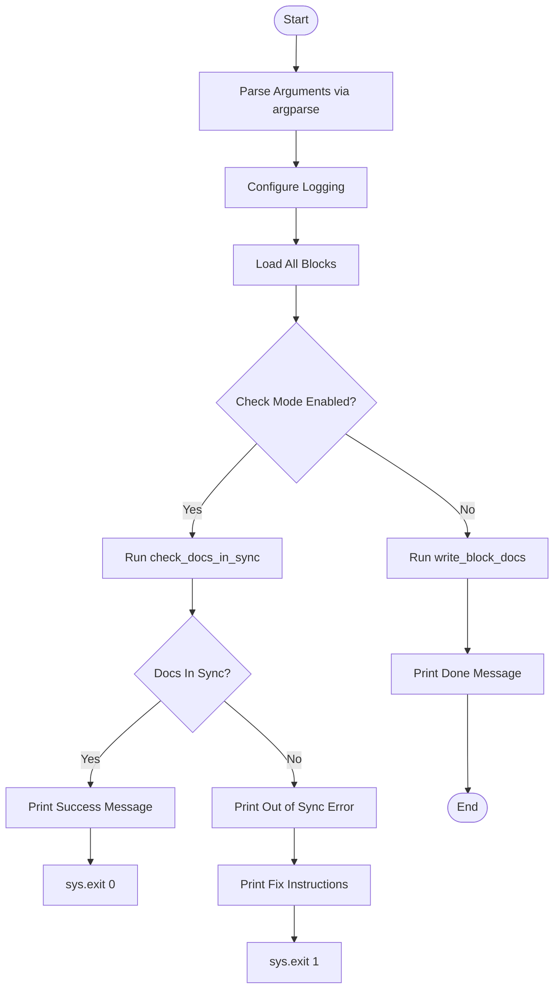

#### 带注释源码

```python
def main():
    # 初始化参数解析器，设置脚本描述
    parser = argparse.ArgumentParser(
        description="Generate block documentation from code introspection"
    )
    # 添加 --output-dir 参数，类型为 Path，默认为预定义的输出目录
    parser.add_argument(
        "--output-dir",
        type=Path,
        default=DEFAULT_OUTPUT_DIR,
        help="Output directory for generated docs",
    )
    # 添加 --check 标志，用于 CI 环境检查文档是否过期
    parser.add_argument(
        "--check",
        action="store_true",
        help="Check if docs are in sync (for CI), exit 1 if not",
    )
    # 添加 -v/--verbose 标志，用于开启详细日志输出
    parser.add_argument(
        "-v",
        "--verbose",
        action="store_true",
        help="Verbose output",
    )

    # 解析命令行参数
    args = parser.parse_args()

    # 根据 verbose 参数配置日志级别
    logging.basicConfig(
        level=logging.DEBUG if args.verbose else logging.INFO,
        format="%(levelname)s: %(message)s",
    )

    # 加载所有需要生成文档的 Block 类
    print("Loading blocks...")
    blocks = load_all_blocks_for_docs()
    print(f"Found {len(blocks)} blocks")

    # 判断运行模式：检查模式 还是 生成模式
    if args.check:
        # 检查模式：对比现有文档与生成的文档是否一致
        print(f"Checking docs in {args.output_dir}...")
        in_sync = check_docs_in_sync(args.output_dir, blocks)
        if in_sync:
            print("All documentation is in sync!")
            # 文档同步，退出码 0
            sys.exit(0)
        else:
            # 文档不同步，打印错误信息和修复建议，退出码 1
            print("\n" + "=" * 60)
            print("Documentation is out of sync!")
            print("=" * 60)
            print("\nTo fix this, run one of the following:")
            print("\n  Option 1 - Run locally:")
            print(
                "    cd autogpt_platform/backend && poetry run python scripts/generate_block_docs.py"
            )
            print("\n  Option 2 - Ask Claude Code to run it:")
            print('    "Run the block docs generator script to sync documentation"')
            print("\n" + "=" * 60)
            sys.exit(1)
    else:
        # 生成模式：将生成的文档写入文件系统
        print(f"Generating docs to {args.output_dir}...")
        write_block_docs(
            args.output_dir,
            blocks,
            verbose=args.verbose,
        )
        print("Done!")
```


## 关键组件


### Schema Introspection & Type Parsing
Logic to inspect block classes, extract JSON schemas for inputs/outputs, and convert complex JSON Schema types (e.g., anyOf, arrays) into human-readable type strings.

### Data Models (`FieldDoc` and `BlockDoc`)
Dataclasses that structure the intermediate representation of block metadata, including inputs, outputs, categories, and contributors extracted from the source code.

### Manual Content Preservation Strategy
A regex-based system that identifies and extracts content between specific HTML-like comments (`<!-- MANUAL: -->`) to ensure user-written explanations persist across automatic documentation regeneration.

### Documentation File Mapping
Logic to determine the target Markdown file path for each block based on its source directory structure or primary category, grouping related blocks into specific documentation files.

### Markdown Generators
Functions responsible for rendering the structured data into Markdown format, generating individual block details, summary overview tables, and GitBook navigation files.

### Synchronization Verification
A utility to compare the state of existing documentation files against the freshly generated content to detect stale documentation, specifically designed for CI pipeline integration.


## 问题及建议


### 已知问题

-   **硬编码维护负担**：`CATEGORY_DISPLAY_NAMES`、`CATEGORY_FILE_MAP` 和 `TITLE_FIXES` 等映射字典直接硬编码在脚本中。当添加新的块类别或需要调整显示名称时，必须修改脚本源码，违反了开闭原则，且容易造成配置与代码逻辑耦合。
-   **基于正则的内容解析脆弱性**：代码大量依赖正则表达式（`extract_manual_content`、`write_block_docs`）来解析 Markdown 并提取手动编写的内容。这种方式在处理复杂的 Markdown 结构或手动内容包含类似标记的文本（例如代码块中的注释）时极其容易出错。
-   **`sys.path` 依赖性**：脚本通过手动修改 `sys.path` 来导入 `backend.blocks`，这使得脚本对运行位置非常敏感，不利于作为独立工具或库进行安装和使用。
-   **代码逻辑重复**：`check_docs_in_sync` 函数中的文档内容生成逻辑与 `write_block_docs` 高度重复。这种重复不仅增加了维护成本，还可能导致“检查”与“写入”行为不一致的 Bug。

### 优化建议

-   **引入并发处理**：在 `load_all_blocks_for_docs` 或 `extract_block_doc` 循环中使用 `concurrent.futures.ThreadPoolExecutor`。由于文档提取涉及大量的 I/O（读取源文件）和 CPU（解析 JSON Schema），并发处理可以显著缩短生成时间，特别是在块数量较多时。
-   **配置外部化**：将硬编码的映射字典（类别显示名、文件映射等）移动到外部的配置文件（如 YAML 或 JSON）中，或者要求在 Block 类的元数据中定义这些信息。这样可以实现配置与代码解耦，无需修改脚本即可适配新的类别。
-   **使用专业的 Markdown 解析器**：替换正则表达式解析方式，使用专门的 Markdown 解析库（如 `markdown-it-py` 或 `mistune`）来构建抽象语法树（AST）。通过 AST 可以更准确、健壮地定位和替换特定节点，从而更安全地保留手动编写的内容。
-   **增强 Schema 类型支持**：扩展 `type_to_readable` 函数，增加对 `oneOf`、`not` 等高级 JSON Schema 关键字的支持，或者集成成熟的 JSON Schema 处理库，以确保类型描述的完整性和准确性。
-   **消除代码重复（DRY）**：重构文档生成逻辑，将“生成预期内容”的核心逻辑提取为独立函数，供 `write_block_docs` 和 `check_docs_in_sync` 共同调用，确保两者的行为始终一致并降低维护成本。


## 其它


### 设计目标与约束

该脚本旨在自动化生成项目模块（Blocks）的 Markdown 文档，解决代码与文档不一致的问题，同时允许开发者保留手动编写的内容。

**设计目标：**
1.  **自动化同步**：通过代码内省自动提取 Block 类的输入、输出、描述等元数据，生成标准化的 Markdown 表格，确保文档与代码实现同步。
2.  **保留人工编辑**：支持在生成的 Markdown 文件中保留特定区域（标记为 `<!-- MANUAL: ... -->`）的内容，允许开发者补充“工作原理”、“使用案例”等非代码生成的深层解释。
3.  **CI 集成**：提供 `--check` 模式，在持续集成流程中验证文档是否为最新状态，若文档过期则退出并报错。
4.  **分类组织**：根据 Block 的源文件路径或所属类别，自动将文档归类到不同的 Markdown 文件或子目录中，并生成 GitBook 兼容的导航（SUMMARY.md）。

**设计约束：**
1.  **格式约束**：生成的 Markdown 必须符合 GitBook 的渲染要求（如特定的表格格式、YAML frontmatter）。
2.  **路径约束**：脚本依赖于特定的目录结构（`blocks` 目录、`docs` 目录），并需要将 `backend` 目录动态加入 Python 路径。
3.  **内容过滤**：必须自动过滤掉敏感字段（如包含 "credentials" 的字段）和隐藏字段，不将其暴露在文档中。

### 错误处理与异常设计

脚本在设计上采用了防御性编程策略，确保单个组件的错误不会导致整个文档生成流程中断，同时提供清晰的错误反馈。

1.  **文档提取异常**：
    *   在 `load_all_blocks_for_docs` 中，使用 `try-except` 块包裹 `extract_block_doc` 调用。如果某个 Block 类实例化或提取元数据失败，脚本会捕获异常并记录警告日志（`logger.warning`），然后继续处理下一个 Block，而不是直接退出。

2.  **数据安全访问**：
    *   定义了 `safe_get` 辅助函数，用于安全地从字典结构（特别是 JSON Schema）中获取数据。如果键不存在或数据类型不符合预期，返回默认值（如 `None` 或 `False`），防止因 Schema 结构变更导致的 `KeyError` 或 `AttributeError`。

3.  **文件操作与 CI 检查**：
    *   在 `check_docs_in_sync` 模式下，如果生成的文件内容与磁盘上现有内容不匹配，或者在检查模式下发现缺失文件，脚本会打印详细的差异信息，并通过 `sys.exit(1)` 返回非零状态码，以触发 CI 流程失败。

4.  **正则表达式匹配**：
    *   在解析手动内容标记（`<!-- MANUAL: ... -->`）时，使用了 `re.DOTALL` 标志以确保正确匹配跨行内容。如果正则匹配失败（如标记被篡改），脚本会默认为空内容或使用预设的占位符文本，保证生成过程的完整性。

### 数据流与处理逻辑

脚本的数据处理是一个线性的批处理流程，主要包含以下阶段：

1.  **发现阶段**：
    *   调用 `backend.blocks.load_all_blocks()` 获取所有已注册的 Block 类。
    *   数据流：代码定义 -> Block 类字典。

2.  **提取阶段**：
    *   遍历每个 Block 类，调用 `create()` 实例化。
    *   利用 `inspect` 获取源文件路径。
    *   解析 `input_schema.jsonschema()` 和 `output_schema.jsonschema()`，将其转换为易读的字符串表示（如 `List[str]`）。
    *   数据流：Block 实例 -> `BlockDoc` 数据对象。

3.  **映射与读取阶段**：
    *   根据 Block 的源文件路径或类别，将 `BlockDoc` 对象映射到对应的 Markdown 文件路径（如 `google/gmail.md`）。
    *   读取磁盘上已存在的 Markdown 文件内容，使用正则表达式提取 `MANUAL` 标记内的内容。
    *   数据流：`BlockDoc` 列表 -> `{filename: [BlockDoc]}` 映射关系 + 手动内容缓存。

4.  **生成与合并阶段**：
    *   对于每个文件，组合文件头部（标题、描述）、各个 Block 的自动生成内容（描述、参数表、输出表）以及提取出的手动内容。
    *   数据流：`BlockDoc` + 手动内容 -> Markdown 字符串。

5.  **写入/校验阶段**：
    *   **写入模式**：将合并后的 Markdown 字符串写入磁盘。同时生成或更新父目录的 `README.md`（概览表）和 `SUMMARY.md`（导航）。
    *   **校验模式**：将生成的内容与磁盘现有内容逐字对比，判断是否一致。

### 外部依赖与接口契约

脚本通过明确的接口与外部模块交互，确保逻辑解耦。

**外部依赖：**
1.  **`backend.blocks` 模块**：
    *   **接口函数**：`load_all_blocks()`
    *   **契约**：该函数必须返回一个字典，其中键是 Block ID（字符串），值是 Block 类对象。脚本不关心这些类的具体实现细节，只依赖它们提供的元数据接口。

2.  **Block 类接口（隐式契约）**：
    *   脚本假设所有 Block 类都遵循以下结构，否则提取过程可能失败或返回不完整数据：
        *   `create()`：类方法，返回 Block 实例。
        *   `id`：字符串属性，Block 的唯一标识。
        *   `name`：字符串属性，类的显示名称。
        *   `description`：字符串属性，功能描述。
        *   `categories`：集合属性，包含 Category 对象，需有 `name` 和 `value` 属性。
        *   `input_schema` / `output_schema`：对象，需实现 `jsonschema()` 方法，返回符合 JSON Schema 规范的字典。
        *   `block_type`：枚举类型，需有 `value` 属性。
        *   `contributors`：列表，包含贡献者信息。

3.  **文件系统**：
    *   **读契约**：脚本假设已存在的文档文件包含特定的 `<!-- MANUAL: ... -->` 注释标记。如果标记格式错误，手动内容将无法保留。
    *   **写契约**：脚本需要 `output_dir` 及其父目录的写入权限，以便创建 `.md` 文件和目录结构。

4.  **标准库**：
    *   依赖 Python 的 `argparse` 进行命令行参数解析，`inspect` 进行源码分析，`pathlib` 处理路径操作，`re` 处理文本匹配。

    