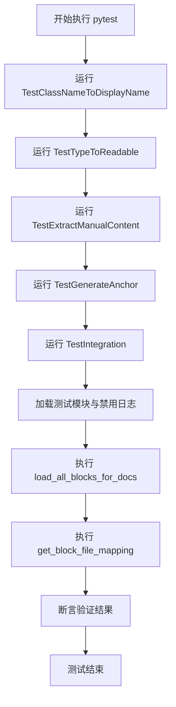
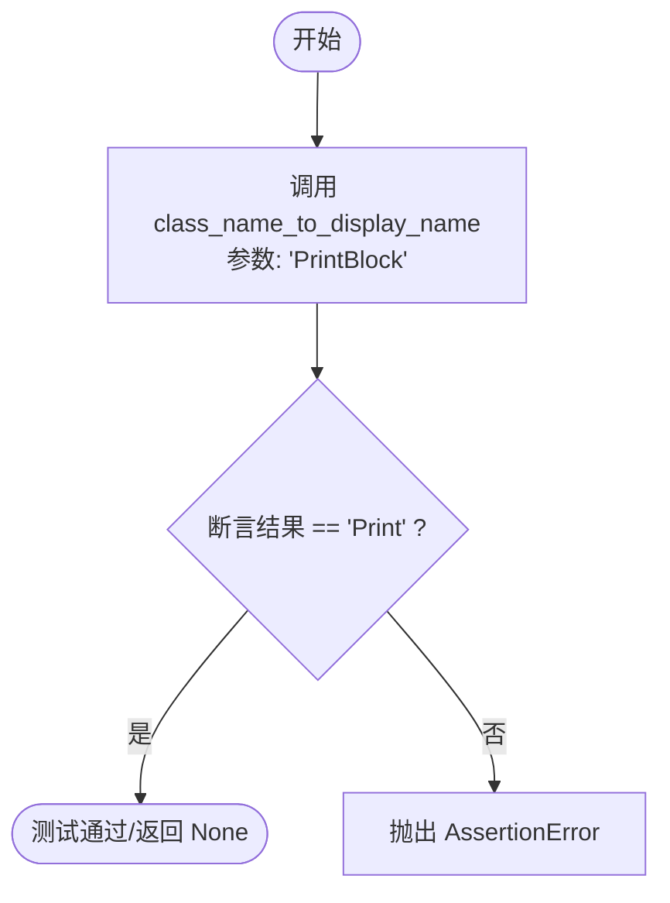
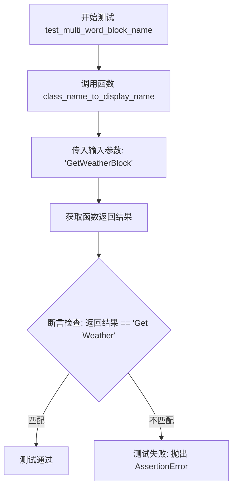
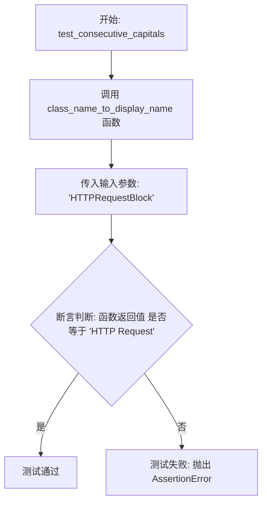
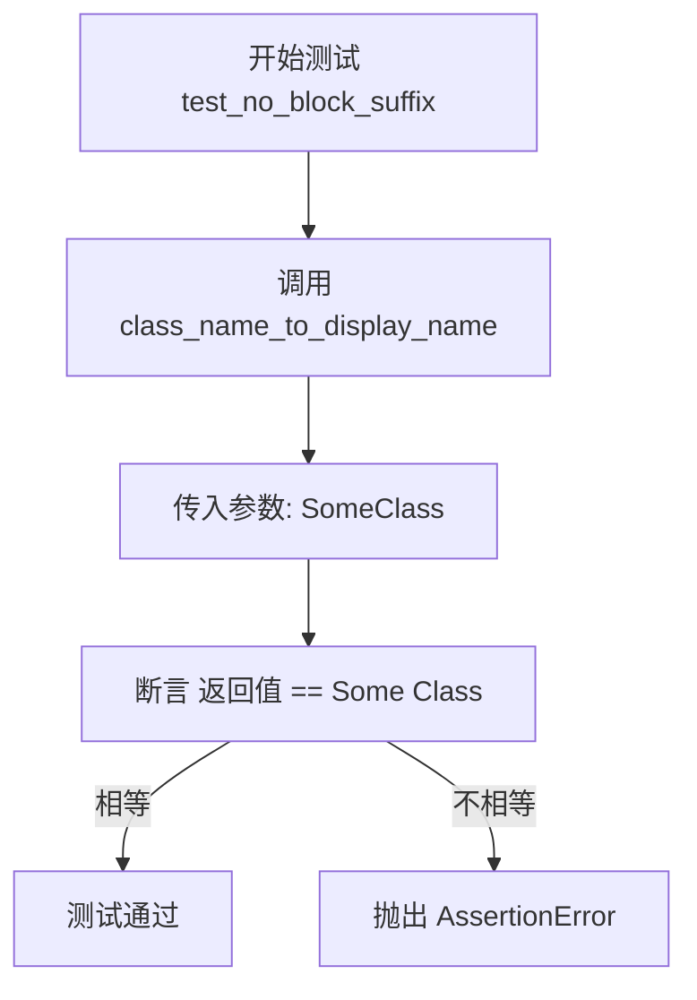
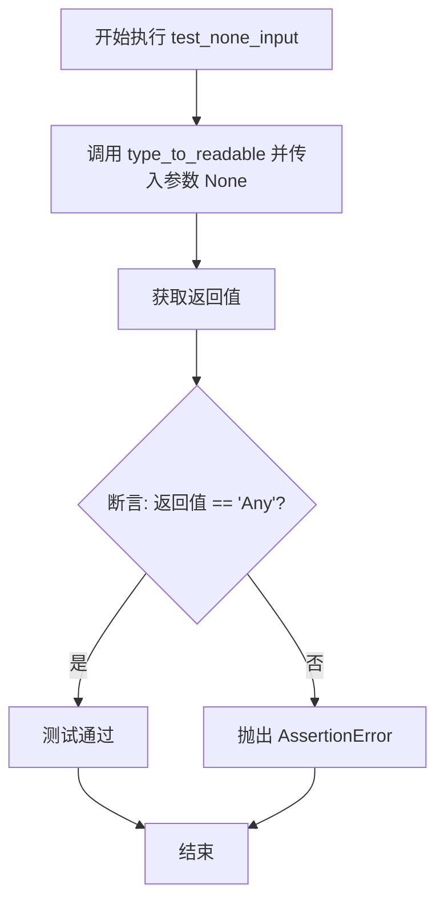
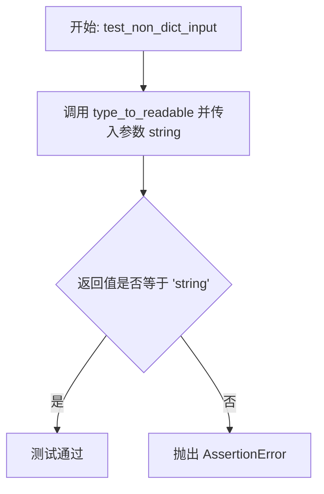
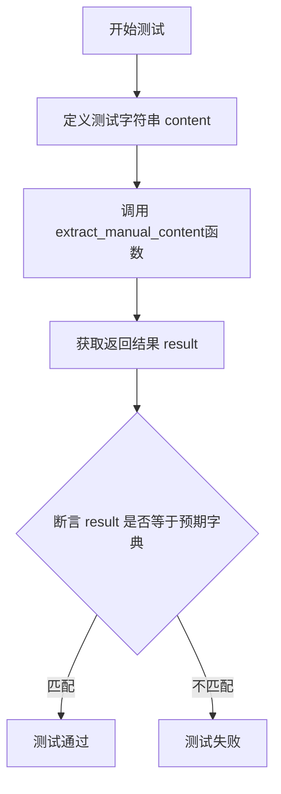
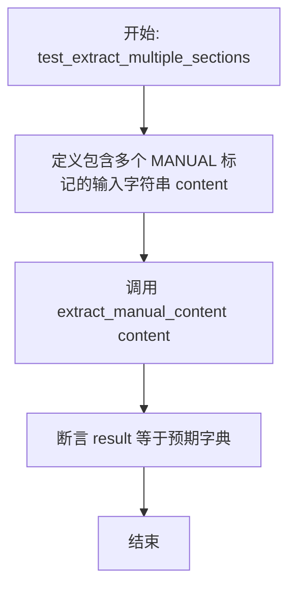

# `.\AutoGPT\autogpt_platform\backend\scripts\test_generate_block_docs.py` 详细设计文档

该文件是针对块文档生成器脚本的单元测试集合，旨在验证类名显示格式转换、类型定义可读化、文档内容提取及锚点生成等核心辅助函数的正确性，并包含加载模块与文件映射的集成测试。

## 整体流程



## 类结构

```
TestClassNameToDisplayName (测试类)
TestTypeToReadable (测试类)
TestExtractManualContent (测试类)
TestGenerateAnchor (测试类)
TestIntegration (测试类)
```

## 全局变量及字段


    

## 全局函数及方法


### `TestClassNameToDisplayName.test_simple_block_name`

测试 `class_name_to_display_name` 函数处理简单块名称的能力，验证其是否能将类名 "PrintBlock" 正确转换为显示名称 "Print"。

参数：

-  `self`：`TestClassNameToDisplayName`，测试类实例，用于访问测试上下文（尽管此测试未显式使用）。

返回值：`None`，无返回值，若断言失败则抛出 `AssertionError` 异常。

#### 流程图



#### 带注释源码

```python
def test_simple_block_name(self):
    # 调用待测函数 class_name_to_display_name，输入 "PrintBlock"
    # 断言期望返回值为 "Print"，验证简单的名称转换逻辑
    assert class_name_to_display_name("PrintBlock") == "Print"
```


### `TestClassNameToDisplayName.test_multi_word_block_name`

该测试用例用于验证 `class_name_to_display_name` 函数在处理包含多个单词的类名时的转换逻辑。具体来说，它检查输入的驼峰式命名字符串（如 "GetWeatherBlock"）能否被正确转换为空格分隔的可读格式（如 "Get Weather"），并移除末尾的 "Block" 后缀。

参数：

- `self`：`TestClassNameToDisplayName`，Pytest 框架提供的测试类实例，用于访问测试上下文。

返回值：`None`，该方法不返回任何值，通过 `assert` 语句抛出异常来指示测试失败。

#### 流程图



#### 带注释源码

```python
    def test_multi_word_block_name(self):
        # 调用 class_name_to_display_name 函数，输入 "GetWeatherBlock"
        # 预期输出为 "Get Weather"，验证驼峰命名转空格及去除后缀的正确性
        assert class_name_to_display_name("GetWeatherBlock") == "Get Weather"
```


### `TestClassNameToDisplayName.test_consecutive_capitals`

该测试方法验证 `class_name_to_display_name` 函数能够正确处理包含连续大写字母（缩略词）的类名，确保在转换为显示名称时，连续的大写字母被保留为一个整体，并正确分割单词及处理后缀。

参数：

- `self`：`TestClassNameToDisplayName`，测试类的实例，用于访问测试上下文。

返回值：`None`，该方法为单元测试，通过断言验证逻辑，无显式返回值。

#### 流程图



#### 带注释源码

```python
    def test_consecutive_capitals(self):
        # 验证函数对于包含连续大写字母（如缩略词 HTTP）的类名的处理能力
        # 输入 "HTTPRequestBlock"，期望函数能识别 "HTTP" 为一个整体，移除后缀 "Block"，并正确插入空格
        # 期望输出结果为 "HTTP Request"
        assert class_name_to_display_name("HTTPRequestBlock") == "HTTP Request"
```


### `TestClassNameToDisplayName.test_ai_prefix`

该测试方法用于验证 `class_name_to_display_name` 函数在处理带有 "AI" 前缀的类名时的正确性，确保将 "AIConditionBlock" 正确转换为可读名称 "AI Condition"。

参数：

-  `self`：`TestClassNameToDisplayName`，测试类的实例引用。

返回值：`None`，该方法没有返回值，通过断言来验证逻辑是否符合预期。

#### 流程图

```mermaid
flowchart TD
    Start([开始]) --> CallFunc[调用函数 class_name_to_display_name]
    CallFunc --> PassParam[传入参数: "AIConditionBlock"]
    PassParam --> CheckResult[获取返回结果并断言]
    CheckResult --> Compare{结果是否等于 "AI Condition"?}
    Compare -- 是 --> Pass([测试通过])
    Compare -- 否 --> Fail([抛出 AssertionError 异常])
```

#### 带注释源码

```python
    def test_ai_prefix(self):
        # 调用待测函数 class_name_to_display_name，输入字符串 "AIConditionBlock"
        # 断言函数返回的显示名称应为 "AI Condition"，以验证对 "AI" 前缀的处理逻辑
        assert class_name_to_display_name("AIConditionBlock") == "AI Condition"
```


### `TestClassNameToDisplayName.test_no_block_suffix`

验证 `class_name_to_display_name` 函数是否能在输入类名缺少 'Block' 后缀（例如 "SomeClass"）的情况下正确处理类名，返回一个带有空格的格式化字符串。

参数：

-  `self`：`TestClassNameToDisplayName`，测试类的实例，由 pytest 框架自动传入。

返回值：`None`，无返回值，若断言失败则抛出 `AssertionError` 异常。

#### 流程图



#### 带注释源码

```python
    def test_no_block_suffix(self):
        # 测试当类名不包含 "Block" 后缀时的转换逻辑
        # 预期函数能正确处理普通驼峰命名的类名，将其转换为带空格的显示名称
        assert class_name_to_display_name("SomeClass") == "Some Class"
```


### `TestTypeToReadable.test_string_type`

该测试方法用于验证 `type_to_readable` 函数是否能正确处理 JSON Schema 中定义的 "string" 类型，并将其转换为 Python 可读的类型字符串 "str"。

参数：

- `self`：`TestTypeToReadable`，测试类的实例，用于访问测试上下文。

返回值：`None`，该方法是测试用例，没有显式的返回值，通过断言来验证结果是否符合预期。

#### 流程图

```mermaid
flowchart TD
    A[开始测试 test_string_type] --> B[准备输入参数: {\"type\": \"string\"}]
    B --> C[调用函数 type_to_readable]
    C --> D[获取函数返回结果]
    D --> E{断言: 结果 == \"str\" ?}
    E -- 是 --> F[测试通过]
    E -- 否 --> G[抛出 AssertionError]
    F --> H[结束]
    G --> H
```

#### 带注释源码

```python
    def test_string_type(self):
        # 调用 type_to_readable 函数，传入表示 JSON Schema 字符串类型的字典
        # 验证函数返回值是否为 Python 的字符串类型表示 "str"
        assert type_to_readable({"type": "string"}) == "str"
```


### `TestTypeToReadable.test_integer_type`

验证 `type_to_readable` 函数在处理 JSON Schema 整数类型定义时的转换逻辑，确保输入 `{"type": "integer"}` 能被正确映射为 Python 的类型字符串 `"int"`。

参数：

- `self`：`TestTypeToReadable`，测试类实例，用于访问测试上下文。

返回值：`None`，无显式返回值，通过断言验证结果。

#### 流程图

```mermaid
flowchart TD
    A[开始: test_integer_type] --> B[调用 type_to_readable]
    B --> C[输入参数: {\"type\": \"integer\"}]
    C --> D[执行转换逻辑]
    D --> E[预期结果: \"int\"]
    E --> F[断言: 结果 == \"int\"]
    F --> G{断言是否通过?}
    G -- 是 --> H[测试通过]
    G -- 否 --> I[抛出 AssertionError]
```

#### 带注释源码

```python
def test_integer_type(self):
    # 调用 type_to_readable 函数，传入表示整型的字典定义
    # 验证其返回值是否为 Python 的整型字符串表示 "int"
    assert type_to_readable({"type": "integer"}) == "int"
```


### `TestTypeToReadable.test_number_type`

该测试方法用于验证 `type_to_readable` 函数在处理 JSON Schema 数字类型（`{"type": "number"}`）时，能否正确将其转换为 Python 可读的类型字符串 `"float"`。

参数：

- `self`：`TestTypeToReadable`，测试类实例，由 pytest 框架自动注入。

返回值：`None`，无返回值，若断言失败则抛出 AssertionError 异常。

#### 流程图

```mermaid
flowchart TD
    A[开始] --> B[调用 type_to_readable 函数<br/>参数: {"type": "number"}]
    B --> C[断言返回值 == "float"]
    C --> D{断言是否通过?}
    D -- 是 --> E[测试通过/结束]
    D -- 否 --> F[抛出 AssertionError]
```

#### 带注释源码

```python
def test_number_type(self):
    # 调用 type_to_readable 函数，输入表示数字类型的字典
    # 断言函数返回的字符串为 "float"
    assert type_to_readable({"type": "number"}) == "float"
```


### `TestTypeToReadable.test_boolean_type`

该测试用例用于验证 `type_to_readable` 函数是否能正确识别并转换布尔类型的字典定义，将其转换为对应的 Python 类型字符串 "bool"。

参数：

- `self`：`TestTypeToReadable`，测试类的实例，用于绑定测试上下文。

返回值：`None`，单元测试方法通常无返回值，主要通过断言验证逻辑。

#### 流程图

```mermaid
graph TD
    A[开始: test_boolean_type] --> B[调用 type_to_readable 函数]
    B --> C[输入参数: {type: boolean}]
    C --> D[断言返回值是否等于 'bool']
    D -- 是 --> E[测试通过]
    D -- 否 --> F[测试失败/抛出断言错误]
```

#### 带注释源码

```python
    def test_boolean_type(self):
        # 调用 type_to_readable 函数，传入表示布尔类型的字典
        # 验证函数返回值是否为 "bool"
        assert type_to_readable({"type": "boolean"}) == "bool"
```


### `TestTypeToReadable.test_array_type`

该测试方法用于验证 `type_to_readable` 函数是否能正确处理数组类型的定义，具体检查当输入类型为数组且项为字符串时，函数是否能将其转换为 Python 风格的类型注解字符串 "List[str]"。

参数：

- `self`：`TestTypeToReadable`，测试类的实例，用于访问测试上下文。

返回值：`None`，无显式返回值，主要通过断言验证逻辑正确性。

#### 流程图

```mermaid
graph TD
    A[开始执行 test_array_type] --> B[构造输入数据: array + string items]
    B --> C[调用 type_to_readable 函数]
    C --> D[获取返回结果 result]
    D --> E{断言 result == 'List[str]'?}
    E -- 是 --> F[测试通过]
    E -- 否 --> G[测试失败/抛出 AssertionError]
```

#### 带注释源码

```python
    def test_array_type(self):
        # 定义一个模拟的数组类型结构，包含类型标识和 items（项）定义
        # 这里 items 被定义为字符串类型
        type_schema = {"type": "array", "items": {"type": "string"}}
        
        # 调用被测试函数 type_to_readable，传入定义好的类型结构
        result = type_to_readable(type_schema)
        
        # 断言函数返回的结果是否符合预期的 Python 类型注解格式 "List[str]"
        assert result == "List[str]"
```


### `TestTypeToReadable.test_object_type`

该测试方法用于验证 `type_to_readable` 函数在处理包含 `type` 为 `object` 且包含 `title` 字段的字典输入时，能否正确返回该 `title` 的值作为可读类型名称。

参数：

- `self`：`TestTypeToReadable`，测试类的实例引用，用于访问测试上下文。

返回值：`None`，该方法不返回任何值，主要通过断言验证函数行为是否符合预期。

#### 流程图

```mermaid
flowchart TD
    A([开始]) --> B[调用 type_to_readable 函数]
    B --> C[输入参数: {\"type\": \"object\", \"title\": \"MyModel\"}]
    C --> D[获取返回值 result]
    D --> E{断言 result == \"MyModel\"}
    E -- 成功 --> F([测试通过])
    E -- 失败 --> G([抛出 AssertionError])
```

#### 带注释源码

```python
    def test_object_type(self):
        # 调用 type_to_readable 函数，传入一个对象类型的字典，包含 title 字段
        result = type_to_readable({"type": "object", "title": "MyModel"})
        # 断言函数返回的字符串等于对象的 title "MyModel"
        assert result == "MyModel"
```


### `TestTypeToReadable.test_anyof_with_null`

该测试方法用于验证 `type_to_readable` 函数在处理包含多种类型（其中包括 `null`）的 `anyOf` 结构时的行为，确认其能正确过滤掉 `null` 类型并返回剩余的非空类型的可读字符串。

参数：

-   `self`：`TestTypeToReadable`，测试类的实例，用于访问测试上下文。

返回值：`None`，该方法主要通过断言来验证逻辑，不返回任何值。

#### 流程图

```mermaid
graph TD
    A[开始测试] --> B[调用 type_to_readable 函数]
    B --> C[输入参数: {anyOf: [{type: string}, {type: null}]}]
    C --> D[获取返回结果 result]
    D --> E{断言 result == str}
    E -- 断言成功 --> F[测试通过]
    E -- 断言失败 --> G[测试失败]
```

#### 带注释源码

```python
    def test_anyof_with_null(self):
        # 调用 type_to_readable，传入包含 'string' 和 'null' 类型的 anyOf 结构
        result = type_to_readable({"anyOf": [{"type": "string"}, {"type": "null"}]})
        # 断言返回结果为 "str"，验证函数正确处理了包含 null 的 anyOf 类型（通常过滤掉 null）
        assert result == "str"
```


### `TestTypeToReadable.test_anyof_multiple_types`

测试 `type_to_readable` 函数处理包含字符串和整数类型的 `anyOf` 模式时的转换逻辑，验证其是否正确返回联合类型的字符串表示形式。

参数：

-   `self`：`TestTypeToReadable`，测试类实例，用于访问测试上下文。

返回值：`None`，该方法不返回值，通过断言验证逻辑。

#### 流程图

```mermaid
graph TD
    A[开始] --> B[调用 type_to_readable 函数]
    B --> C[传入参数: {anyOf: [{type: string}, {type: integer}]}]
    C --> D[接收返回值 result]
    D --> E{断言: result == 'str | int'}
    E -- 成立 --> F[测试通过]
    E -- 不成立 --> G[测试失败]
```

#### 带注释源码

```python
    def test_anyof_multiple_types(self):
        # 调用 type_to_readable 函数，传入一个包含字符串和整数类型的 anyOf 结构
        result = type_to_readable({"anyOf": [{"type": "string"}, {"type": "integer"}]})
        
        # 断言返回值为 "str | int"，验证函数正确处理了多种类型的联合
        assert result == "str | int"
```


### `TestTypeToReadable.test_enum_type`

验证 `type_to_readable` 函数能够正确处理包含枚举列表的字符串类型字典，并将其转换为以管道符分隔的选项字符串表示形式。

参数：

- `self`：`TestTypeToReadable`，测试类实例，用于访问测试框架上下文。

返回值：`None`，无返回值（测试方法主要进行断言验证）。

#### 流程图

```mermaid
graph TD
    A[开始: test_enum_type] --> B[调用 type_to_readable]
    B --> C[输入参数: {type: string, enum: [option1, option2, option3]}]
    C --> D[获取函数返回结果]
    D --> E{断言检查}
    E -- 成功 --> F[测试通过]
    E -- 失败 --> G[抛出 AssertionError]
    F --> H[结束]
    G --> H
```

#### 带注释源码

```python
def test_enum_type(self):
    # 调用 type_to_readable 函数，传入包含枚举值的字符串类型字典
    # 期望函数能将枚举数组转换为类似 '"option1" | "option2"' 的格式
    result = type_to_readable(
        {"type": "string", "enum": ["option1", "option2", "option3"]}
    )
    # 断言返回结果是否符合预期的联合类型字符串格式
    assert result == '"option1" | "option2" | "option3"'
```


### `TestTypeToReadable.test_none_input`

该方法用于验证 `type_to_readable` 函数在输入参数为 `None` 时的行为是否符合预期，即返回字符串 `"Any"`。

参数：

-   `self`：`TestTypeToReadable`，测试类的实例。

返回值：`None`，无返回值。

#### 流程图



#### 带注释源码

```python
def test_none_input(self):
    # 调用 type_to_readable 函数，传入 None 作为输入
    # 断言其返回值应等于字符串 "Any"，用于验证类型转换逻辑的正确性
    assert type_to_readable(None) == "Any"
```


### `TestTypeToReadable.test_non_dict_input`

该测试方法验证 `type_to_readable` 函数在接收到非字典类型的输入（例如字符串字面量 "string"）时的行为，预期函数能处理这种非结构化输入并原样返回输入字符串。

参数：

- `self`：`TestTypeToReadable`，测试类的实例，用于访问测试上下文。

返回值：`None`，无返回值，通过 `assert` 语句验证预期行为。

#### 流程图



#### 带注释源码

```python
def test_non_dict_input(self):
    # 调用 type_to_readable 函数，传入非字典类型的字符串 "string"
    # 断言函数返回值应该直接等于输入的字符串，验证了非字典输入的兜底处理逻辑
    assert type_to_readable("string") == "string"
```


### `TestExtractManualContent.test_extract_how_it_works`

该测试方法用于验证 `extract_manual_content` 函数能否正确地从包含特定标记（`<!-- MANUAL: how_it_works -->` 和 `<!-- END MANUAL -->`）的文本中提取出指定的手动内容部分，并返回包含该内容的字典。

参数：

-  `self`：`TestExtractManualContent`，测试类的实例引用，由 pytest 框架自动传入。

返回值：`None`，该方法为测试用例，主要用于断言验证，不返回业务数据。

#### 流程图



#### 带注释源码

```python
    def test_extract_how_it_works(self):
        # 定义输入的多行字符串 content，包含标题和被特定注释标记包围的文本
        content = """
### How it works
<!-- MANUAL: how_it_works -->
This is how it works.
<!-- END MANUAL -->
"""
        # 调用待测试的 extract_manual_content 函数处理上述内容
        result = extract_manual_content(content)
        # 断言返回的字典 result 中键 'how_it_works' 对应的值是否为提取的文本
        assert result == {"how_it_works": "This is how it works."}
```


### `TestExtractManualContent.test_extract_use_case`

该测试用于验证 `extract_manual_content` 函数能否正确从给定的字符串中提取被 `<!-- MANUAL: use_case -->` 和 `<!-- END MANUAL -->` 标记包裹的内容片段。

参数：

- `self`：`TestExtractManualContent`，测试类的实例，提供测试上下文。

返回值：`None`，无返回值，该方法通过断言验证逻辑正确性。

#### 流程图

```mermaid
graph TD
    A[开始 test_extract_use_case] --> B[定义包含标记的测试输入 content]
    B --> C[调用 extract_manual_content content]
    C --> D[获取返回结果 result]
    D --> E{断言: result 是否等于 {'use_case': 'Example use case here.'}?}
    E -- 是 --> F[测试通过]
    E -- 否 --> G[测试失败]
```

#### 带注释源码

```python
def test_extract_use_case(self):
    # 定义测试用的输入内容字符串，模拟包含 use_case 标记的文档片段
    content = """
### Possible use case
<!-- MANUAL: use_case -->
Example use case here.
<!-- END MANUAL -->
"""
    # 调用待测试函数 extract_manual_content，传入定义好的内容
    result = extract_manual_content(content)
    # 断言返回的字典结果是否包含预期的键值对，验证提取逻辑的正确性
    assert result == {"use_case": "Example use case here."}
```


### `TestExtractManualContent.test_extract_multiple_sections`

该方法用于验证 `extract_manual_content` 函数能够正确处理并提取同一字符串中存在的多个手动内容区域，确保返回的字典包含所有提取的键值对，且内容准确无误。

参数：

-   `self`：`TestExtractManualContent`，测试类的实例。

返回值：`None`，测试方法主要用于断言验证，无显式返回值。

#### 流程图



#### 带注释源码

```python
    def test_extract_multiple_sections(self):
        # 定义包含多个手动内容标记段的输入字符串
        # 包含 'how_it_works' 和 'use_case' 两个部分
        content = """
<!-- MANUAL: how_it_works -->
How it works content.
<!-- END MANUAL -->

<!-- MANUAL: use_case -->
Use case content.
<!-- END MANUAL -->
"""
        # 调用被测函数提取内容
        result = extract_manual_content(content)
        # 断言结果包含两个部分，且内容与预期一致
        assert result == {
            "how_it_works": "How it works content.",
            "use_case": "Use case content.",
        }
```


### `TestExtractManualContent.test_empty_content`

该测试方法验证了 `extract_manual_content` 函数在输入为空字符串时的行为，确保函数能够正确处理空输入并返回一个空字典，而不会抛出异常或返回错误结果。

参数：

-   `self`：`TestExtractManualContent`，测试类的实例，引用当前测试对象。

返回值：`None`，该方法作为测试用例，主要用于断言验证，没有显式的返回值。

#### 流程图

```mermaid
flowchart TD
    A[开始: test_empty_content] --> B[调用 extract_manual_content]
    B --> C[传入参数: 空字符串 ""]
    C --> D[获取返回值 result]
    D --> E{断言判断: result == {}}
    E -- 相等 --> F[测试通过]
    E -- 不相等 --> G[测试失败]
    F --> H[结束]
    G --> H
```

#### 带注释源码

```python
    def test_empty_content(self):
        # 调用待测函数 extract_manual_content，传入一个空字符串作为输入内容
        result = extract_manual_content("")
        # 断言函数返回值 result 必须等于空字典 {}
        # 验证函数在没有内容提取时是否返回预期的空结构
        assert result == {}
```


### `TestExtractManualContent.test_no_markers`

该测试方法用于验证 `extract_manual_content` 函数在处理不包含特定标记（`<!-- MANUAL: ... -->` 和 `<!-- END MANUAL -->`）的字符串内容时的行为，预期结果是返回一个空字典。

参数：

-   `self`：`TestExtractManualContent`，测试类的实例，用于访问测试上下文。

返回值：`None`，该方法为测试函数，主要通过断言来验证行为，无显式返回值。

#### 流程图

```mermaid
flowchart TD
    Start([开始]) --> CallFunc[调用 extract_manual_content<br>参数: "Some content without markers"]
    CallFunc --> AssignResult[将返回值赋给变量 result]
    AssignResult --> AssertCheck{断言 result 是否等于 空字典}
    AssertCheck -- 是 --> End([结束])
    AssertCheck -- 否 --> RaiseError([抛出 AssertionError])
```

#### 带注释源码

```python
def test_no_markers(self):
    # 调用 extract_manual_content 函数，传入一个不包含手动内容标记的普通字符串
    result = extract_manual_content("Some content without markers")
    # 验证函数返回的应该是一个空的字典，因为没有匹配到任何标记
    assert result == {}
```


### `TestGenerateAnchor.test_simple_name`

测试 `generate_anchor` 函数能否正确处理简单的单个单词名称，验证其将输入字符串转换为全小写的锚点 ID 的基本功能。

参数：

-  `self`：`TestGenerateAnchor`，测试类的实例。

返回值：`None`，无返回值（该函数为测试用例，通过断言验证结果）。

#### 流程图

```mermaid
flowchart TD
    A[开始: test_simple_name] --> B[调用 generate_anchor 函数<br>输入参数: "Print"]
    B --> C[执行断言 assert<br>期望结果: "print"]
    C --> D{断言是否成功?}
    D -- 是 --> E[测试通过]
    D -- 否 --> F[测试失败: 抛出 AssertionError]
```

#### 带注释源码

```python
def test_simple_name(self):
    # 测试用例：验证简单的单个大写单词能否正确转换为小写锚点
    # 调用 generate_anchor 并断言返回值为小写的 "print"
    assert generate_anchor("Print") == "print"
```


### `TestGenerateAnchor.test_multi_word_name`

验证 `generate_anchor` 函数能否正确地将包含空格的多单词名称（例如 "Get Weather"）转换为适合用作 URL 锚点的小写、连字符分隔格式（"get-weather"）。

参数：

- `self`：`TestGenerateAnchor`，测试类的实例，用于访问测试上下文。

返回值：`None`，无返回值，如果断言失败则抛出 `AssertionError` 异常。

#### 流程图

```mermaid
flowchart TD
    A[开始: test_multi_word_name] --> B[调用 generate_anchor 函数<br>输入参数: "Get Weather"]
    B --> C[执行断言操作<br>判断返回值是否等于 "get-weather"]
    C --> D{断言结果是否为真?}
    D -- 是 --> E[测试通过]
    D -- 否 --> F[测试失败: 抛出 AssertionError]
    E --> G[结束]
    F --> G
```

#### 带注释源码

```python
def test_multi_word_name(self):
    # 验证 generate_anchor 函数对多单词名称的处理能力
    # 输入 "Get Weather"，预期输出应转换为全小写并用连字符连接的 "get-weather"
    assert generate_anchor("Get Weather") == "get-weather"
```


### `TestGenerateAnchor.test_name_with_parentheses`

该测试用例用于验证 `generate_anchor` 函数处理包含括号字符串的能力，确保其能将包含括号的文本（如 "Something (Optional)"）正确转换为符合规范的、全小写、以连字符分隔的锚点标识符（如 "something-optional"）。

参数：

-   `self`：`TestGenerateAnchor`，测试类的实例，用于访问测试上下文。

返回值：`None`，无返回值，该方法主要用于验证逻辑是否通过断言。

#### 流程图

```mermaid
graph TD
    A[Start: test_name_with_parentheses] --> B[Call function: generate_anchor]
    B --> C[Input argument: 'Something (Optional)']
    C --> D[Execute function logic]
    D --> E[Receive output result]
    E --> F{Assert: result == 'something-optional'}
    F -- Success --> G[Test Pass]
    F -- Failure --> H[AssertionError: Test Fail]
```

#### 带注释源码

```python
    def test_name_with_parentheses(self):
        # 调用 generate_anchor 函数，传入包含括号的字符串
        # 预期函数能移除括号、空格，并将字符转换为小写，用连字符连接
        assert generate_anchor("Something (Optional)") == "something-optional"
```


### `TestGenerateAnchor.test_already_lowercase`

测试 `generate_anchor` 函数，验证当输入字符串已经包含小写字母和空格时，是否正确转换为预期的锚点格式（即将空格替换为连字符）。

参数：

-  `self`：`TestGenerateAnchor`，测试类的实例，用于访问测试上下文。

返回值：`None`，无返回值，该方法仅执行断言逻辑。

#### 流程图

```mermaid
flowchart TD
    A[Start] --> B[Call generate_anchor with input 'already lowercase']
    B --> C[Assertion: Check if result equals 'already-lowercase']
    C -->|Equal| D[Test Pass]
    C -->|Not Equal| E[Test Fails]
    D --> F[End]
    E --> F
```

#### 带注释源码

```python
    def test_already_lowercase(self):
        # 测试当输入字符串已经是小写且包含空格时，
        # generate_anchor 函数是否能正确地将空格转换为连字符。
        # 期望输入 "already lowercase" 输出 "already-lowercase"
        assert generate_anchor("already lowercase") == "already-lowercase"
```


### `TestIntegration.test_load_blocks`

该方法是 `TestIntegration` 类中的一个集成测试方法，旨在验证系统能否成功加载用于生成文档的所有代码块。测试通过配置系统路径和抑制日志输出来准备环境，调用核心加载函数后，断言返回的块列表不为空，以确保加载逻辑的有效性。

参数：

-  `self`：`TestIntegration`，pytest 框架自动注入的测试类实例引用。

返回值：`None`，测试方法通常不返回值，通过断言（assert）来判断测试是否通过。

#### 流程图

```mermaid
flowchart TD
    A[开始: test_load_blocks] --> B[禁用 Critical 级别以上的日志]
    B --> C[获取当前文件父目录的父目录<br/>即项目根目录]
    C --> D[将项目根目录插入 sys.path]
    D --> E[从 scripts.generate_block_docs 导入 load_all_blocks_for_docs]
    E --> F[调用 load_all_blocks_for_docs 获取 blocks 列表]
    F --> G{blocks 列表长度是否 > 0?}
    G -- 是 --> H[断言成功: 测试通过]
    G -- 否 --> I[断言失败: 抛出 AssertionError]
    H --> J[测试结束]
    I --> J
```

#### 带注释源码

```python
def test_load_blocks(self):
    """Test that blocks can be loaded successfully."""
    import logging
    import sys
    from pathlib import Path

    # 禁用严重级别 (CRITICAL) 以上的日志，防止测试运行时产生过多输出噪音
    logging.disable(logging.CRITICAL)
    
    # 获取当前测试文件的父目录的父目录（即项目根目录），并转换为字符串
    # 这是为了确保能够从测试目录导入项目中的其他模块（如 scripts）
    sys.path.insert(0, str(Path(__file__).parent.parent))

    # 导入需要测试的核心函数，该函数负责加载所有块数据
    from scripts.generate_block_docs import load_all_blocks_for_docs

    # 执行加载操作，获取所有块的列表
    blocks = load_all_blocks_for_docs()
    
    # 断言：验证加载的 blocks 列表至少包含一个元素
    # 如果为空，则抛出 AssertionError，提示 "Should load at least one block"
    assert len(blocks) > 0, "Should load at least one block"
```


### `TestIntegration.test_block_doc_has_required_fields`

该方法用于验证通过文档生成脚本加载的块对象是否包含预期的核心属性（id, name, description, categories, inputs, outputs），以确保数据结构的完整性和文档生成的正确性。

参数：

- `self`：`TestIntegration`，测试类的实例，用于访问测试上下文和测试框架功能。

返回值：`None`，无显式返回值，通过断言验证逻辑。

#### 流程图

```mermaid
graph TD
    A[开始: test_block_doc_has_required_fields] --> B[设置日志级别为 CRITICAL]
    B --> C[将项目根目录添加到 sys.path]
    C --> D[导入 load_all_blocks_for_docs 函数]
    D --> E[调用 load_all_blocks_for_docs 获取块列表]
    E --> F[获取列表中的第一个块作为样本]
    F --> G{检查是否存在 'id' 属性}
    G -- 否 --> H[抛出 AssertionError]
    G -- 是 --> I{检查是否存在 'name' 属性}
    I -- 否 --> H
    I -- 是 --> J{检查是否存在 'description' 属性}
    J -- 否 --> H
    J -- 是 --> K{检查是否存在 'categories' 属性}
    K -- 否 --> H
    K -- 是 --> L{检查是否存在 'inputs' 属性}
    L -- 否 --> H
    L -- 是 --> M{检查是否存在 'outputs' 属性}
    M -- 否 --> H
    M -- 是 --> N[测试通过]
```

#### 带注释源码

```python
def test_block_doc_has_required_fields(self):
    """Test that extracted block docs have required fields."""
    # 导入必要的标准库
    import logging
    import sys
    from pathlib import Path

    # 禁用日志输出，保持测试过程清洁
    logging.disable(logging.CRITICAL)
    # 将脚本所在的父目录添加到系统路径中，确保能导入项目中的模块
    sys.path.insert(0, str(Path(__file__).parent.parent))

    # 导入待测试的功能函数：加载所有块数据
    from scripts.generate_block_docs import load_all_blocks_for_docs

    # 调用函数加载所有块
    blocks = load_all_blocks_for_docs()
    # 取出第一个块作为测试样本
    block = blocks[0]

    # 断言验证：检查块对象是否包含 'id' 属性
    assert hasattr(block, "id")
    # 断言验证：检查块对象是否包含 'name' 属性
    assert hasattr(block, "name")
    # 断言验证：检查块对象是否包含 'description' 属性
    assert hasattr(block, "description")
    # 断言验证：检查块对象是否包含 'categories' 属性
    assert hasattr(block, "categories")
    # 断言验证：检查块对象是否包含 'inputs' 属性
    assert hasattr(block, "inputs")
    # 断言验证：检查块对象是否包含 'outputs' 属性
    assert hasattr(block, "outputs")
```


### `TestIntegration.test_file_mapping_is_deterministic`

该集成测试方法旨在验证块到文件的映射逻辑是否具有确定性。通过加载两次块数据并生成两次映射，该方法断言两次生成的映射结构（键集和每个键对应的值数量）必须完全一致，以确保文档生成过程中的文件分配是稳定且可重复的。

参数：

- `self`：`TestIntegration`，测试类的实例，用于访问测试上下文。

返回值：`None`，无返回值（该方法主要用于执行断言以验证逻辑正确性）。

#### 流程图

```mermaid
flowchart TD
    Start([开始]) --> SetupEnv[设置环境: 禁用日志, 添加系统路径]
    SetupEnv --> ImportFuncs[导入依赖函数<br/>get_block_file_mapping, load_all_blocks_for_docs]
    ImportFuncs --> LoadFirst[调用 load_all_blocks_for_docs 获取 blocks1]
    LoadFirst --> LoadSecond[调用 load_all_blocks_for_docs 获取 blocks2]
    LoadSecond --> MapFirst[调用 get_block_file_mapping blocks1 生成 mapping1]
    MapFirst --> MapSecond[调用 get_block_file_mapping blocks2 生成 mapping2]
    MapSecond --> AssertKeys[断言 mapping1 与 mapping2 的键集合相等]
    AssertKeys --> LoopStart{遍历 mapping1 中的文件路径}
    LoopStart --> AssertCount[断言当前文件路径下块的数量相等]
    AssertCount --> LoopNext[继续下一个路径]
    LoopNext --> LoopStart
    LoopStart --> End([结束])
```

#### 带注释源码

```python
def test_file_mapping_is_deterministic(self):
    """Test that file mapping produces consistent results."""
    import logging
    import sys
    from pathlib import Path

    # 禁用关键日志级别，避免测试输出过多噪音
    logging.disable(logging.CRITICAL)
    # 将项目根目录添加到系统路径，以便导入项目内的脚本
    sys.path.insert(0, str(Path(__file__).parent.parent))

    from scripts.generate_block_docs import (
        get_block_file_mapping,
        load_all_blocks_for_docs,
    )

    # 第一次加载所有块数据
    blocks1 = load_all_blocks_for_docs()
    # 第二次加载所有块数据
    blocks2 = load_all_blocks_for_docs()

    # 基于第一次加载的数据生成文件映射
    mapping1 = get_block_file_mapping(blocks1)
    # 基于第二次加载的数据生成文件映射
    mapping2 = get_block_file_mapping(blocks2)

    # 断言：两次生成的映射包含相同的文件键（文件名）
    assert set(mapping1.keys()) == set(mapping2.keys())

    # 断言：对于每一个文件路径，两次映射中分配的块数量必须相同
    for file_path in mapping1:
        assert len(mapping1[file_path]) == len(mapping2[file_path])
```


## 关键组件


### 类名格式化
负责将内部类名（如 "HTTPRequestBlock"）转换为用户友好的显示字符串（如 "HTTP Request"），处理大小写转换及常见后缀（如 "Block"）的移除。

### 类型系统转换
负责将 JSON Schema 类型定义转换为可读的 Python 类型字符串（如 "str | int" 或 "List[str]"），支持基础类型、数组、对象、枚举及联合类型的解析。

### 手动内容提取
负责从源代码或文档字符串中解析并提取包含在特定标记（如 `<!-- MANUAL: key -->`）内的自定义内容，以支持文档的个性化编写。

### URL 锚点生成
负责将显示名称转换为符合 URL 标准的锚点 ID（例如将 "Get Weather" 转换为 "get-weather"），处理大小写、空格及特殊符号。

### 块元数据加载与映射
负责动态加载系统中的所有可用块对象，并在这些块与其对应的源文件路径之间建立映射关系，用于文档生成过程中的文件组织和引用。


## 问题及建议


### 已知问题

-   测试代码中动态修改 `sys.path` 破坏了测试隔离性，且强依赖于特定的文件系统目录结构，降低了测试套件的健壮性和可移植性。
-   集成测试类（`TestIntegration`）中存在严重的代码重复，每个测试方法都重复执行导入模块、禁用日志和设置路径的操作，违反了 DRY（Don't Repeat Yourself）原则。
-   资源加载效率低下，`load_all_blocks_for_docs` 在多个测试中被重复调用，特别是在 `test_file_mapping_is_deterministic` 中被显式调用了两次，导致不必要的 I/O 开销和解析时间。
-   使用 `logging.disable(logging.CRITICAL)` 是一种侵入式的全局状态修改，虽然目的是屏蔽日志，但在复杂测试套件中可能会产生副作用或干扰并发测试。

### 优化建议

-   **引入 Pytest Fixtures**：将公共的初始化逻辑（如路径配置、日志管理）以及耗时的资源加载（如 `load_all_blocks_for_docs`）抽取到 `conftest.py` 中作为 Fixture。对于 Blocks 数据，应使用 `scope="module"` 或 `"session"` 以确保在整个测试会话中只加载一次。
-   **使用参数化测试**：针对 `class_name_to_display_name` 和 `type_to_readable` 等输入输出明确的测试，使用 `@pytest.mark.parametrize` 装饰器，可以显著减少样板代码，使测试用例更加紧凑清晰。
-   **优化测试路径配置**：通过项目根目录下的 `pytest.ini`、`pyproject.toml` 或 `setup.cfg` 配置 `pythonpath`，移除代码中硬编码的 `sys.path.insert`，使测试环境配置标准化。
-   **增强异常与边界测试**：为 `extract_manual_content` 增加针对畸形输入的测试用例（例如只有开始标签没有结束标签，或者标签嵌套错误），以验证系统的容错能力和鲁棒性。
-   **添加类型注解**：为测试函数的参数和返回值添加类型提示，提升代码的可读性，并便于静态类型检查工具（如 mypy）进行代码质量分析。


## 其它


### 设计目标与约束

**设计目标**：
1. 确保文档生成脚本中辅助函数（如类名转换、类型转换、锚点生成）逻辑的正确性和鲁棒性。
2. 验证文档生成脚本能正确加载和解析实际的 Block 定义，并生成具有必填字段的文档对象。
3. 保证文件映射生成的确定性和一致性，确保多次运行结果一致。

**约束**：
1. **环境约束**：测试执行时必须能够访问项目根目录的父级目录，以便通过 `sys.path` 导入被测模块 `scripts.generate_block_docs`。
2. **框架约束**：必须基于 `pytest` 框架运行，利用其断言机制和测试发现功能。
3. **隔离性约束**：集成测试中通过 `logging.disable(logging.CRITICAL)` 屏蔽日志输出，以保持测试输出流的整洁，避免被系统日志干扰。

### 外部依赖与接口契约

**外部依赖**：
1. **pytest**：用于测试运行、断言和测试生命周期管理的第三方库。
2. **logging** & **sys** & **pathlib**：Python 标准库，分别用于日志控制、系统路径操作和文件系统路径处理。
3. **scripts.generate_block_docs**：被测的核心业务模块，包含文档生成的所有逻辑。

**接口契约**：
1. **class_name_to_display_name**：输入为 `str`（类名），输出为 `str`（显示名称）。契约规定了驼峰命名转空格分隔大写的规则。
2. **type_to_readable**：输入为 `dict` 或 `None`（类型定义），输出为 `str`（可读类型字符串）。契约规定了处理基本类型、数组、对象及枚举的转换格式。
3. **extract_manual_content**：输入为 `str`（包含 Markdown 标记的文本），输出为 `dict`（键值对内容）。契约规定了 `<!-- MANUAL: key -->` 和 `<!-- END MANUAL -->` 的解析规则。
4. **load_all_blocks_for_docs**：无参数输入，输出为 `List`（包含 Block 对象的列表）。契约规定返回的对象必须具备 `id`, `name`, `description` 等属性。

### 数据流与状态机

**数据流**：
1. **单元测试流**：
   *   **输入**：测试代码中硬编码的静态数据（如 `"PrintBlock"`, `{"type": "string"}`）。
   *   **处理**：调用被测函数（如 `class_name_to_display_name`）进行逻辑转换或处理。
   *   **输出**：函数返回处理后的结果。
   *   **验证**：使用 `assert` 将预期结果与实际结果进行比对。
2. **集成测试流**：
   *   **输入**：文件系统中的 Block 定义文件。
   *   **处理**：调用 `load_all_blocks_for_docs` 动态加载资源，生成 Block 对象列表。
   *   **输出**：内存中的 Block 对象集合及文件映射字典。
   *   **验证**：检查集合长度、对象属性存在性及映射的一致性。

**状态机**：
本测试套件属于无状态测试或简单的线性状态流转：
*   **初始状态**：测试环境初始化，模块导入完成。
*   **执行状态**：
    *   对于单元测试，每个测试方法独立运行，不维护共享状态。
    *   对于集成测试，存在临时的环境状态变更（如修改 `sys.path`，禁用 `logging`），但在测试结束或测试类生命周期内保持。
*   **终结状态**：测试执行完毕，结果上报给 Pytest，环境恢复（或进程结束）。

### 错误处理与异常设计

**异常设计**：
1. **测试失败机制**：测试本身不捕获业务逻辑异常，而是依赖 `pytest` 捕获 `AssertionError`。当断言失败时（例如类型转换结果不符合预期），测试框架会报错并标记该测试用例为 Failed，从而暴露被测代码的缺陷。
2. **边界测试覆盖**：针对可能引发异常的边界情况设计了专门的测试用例（如 `type_to_readable(None)` 和 `extract_manual_content("")`），验证被测函数是否能优雅处理空值或非法输入而不抛出未捕获的崩溃性异常。

**容错处理**：
1. **日志抑制**：在集成测试中，显式调用 `logging.disable(logging.CRITICAL)`。这是一种防御性设计，防止被测模块在加载 Block 过程中打印 WARNING 或 ERROR 级别的日志，从而避免干扰测试结果的判定或造成误报。
2. **路径处理**：在集成测试中动态计算并插入父目录到 `sys.path`，防止因 `PYTHONPATH` 环境变量未设置导致的 `ImportError`。

    