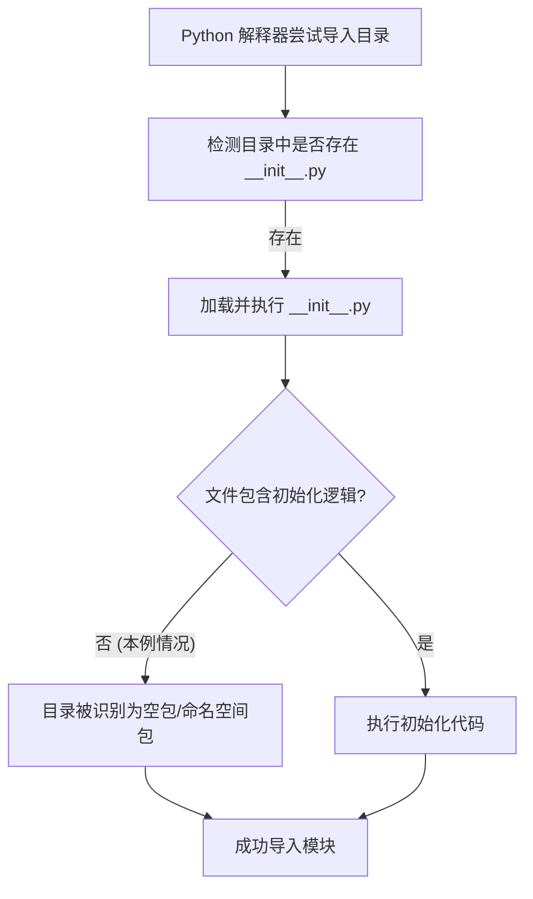

# `.\AutoGPT\autogpt_platform\backend\test\__init__.py` 详细设计文档

该文件通过其存在将当前目录标记为 Python 包，允许 Python 解释器将该目录视为一个模块进行导入，从而组织代码结构。

## 整体流程



## 类结构

```
File: __init__.py
└── (无类定义，仅作为包标记)
```

## 全局变量及字段


    

## 全局函数及方法


## 关键组件


### Python 包初始化
用于将目录标记为 Python 包，使其能够被解释器识别并导入。


## 问题及建议


### 已知问题

-   目录命名潜在冲突：注释中提到 "test directory"，若该目录直接命名为 `test`，在作为包导入时会遮蔽 Python 标准库中的 `test` 模块，可能导致依赖标准库测试功能的代码出现异常。

### 优化建议

-   采用模块级文档字符串：建议使用三引号（`"""..."""`）的文档字符串替代单行注释，以便 IDE 和 `help()` 函数能更好地读取并展示模块描述。
-   显式定义 `__all__`：若该包旨在作为公共库使用或包含多个子模块，建议定义 `__all__` 列表以明确包的公共 API，控制 `from package import *` 的导入行为。
-   遵循测试目录命名规范：建议将包含此文件的目录重命名为 `tests`（复数形式），这是 Python 社区的通用约定，能有效避免与标准库 `test` 模块发生命名冲突。


## 其它


### 设计目标与约束

该文件的核心设计目标是将 `test` 目录标记为 Python 包，从而允许 Python 解释器将该目录视为一个模块进行导入。主要约束包括：
1. 文件名必须严格为 `__init__.py`，否则解释器无法识别其为包。
2. 为了确保代码跨平台兼容性，文件编码推荐使用 UTF-8。
3. 该文件当前仅包含注释，不包含任何初始化逻辑或变量定义，因此不引入运行时开销，且对 Python 版本无特定要求（支持 Python 2.x 及 Python 3.x）。

### 错误处理与异常设计

当前文件仅包含单行注释，不包含任何可执行代码，因此不涉及主动的错误捕获、异常抛出或处理逻辑。
如果未来在此文件中添加包级别的初始化代码（例如导入子模块或设置 `__all__` 变量），需要考虑潜在的导入错误（如 `ImportError` 或 `ModuleNotFoundError`），但这取决于后续添加的具体代码逻辑。

### 数据流与状态机

该文件不包含任何业务逻辑，因此不存在内部数据流转过程（输入、处理、输出）。
该文件也没有定义任何状态机、状态变量或状态转换逻辑。它的作用是静态的，仅在 Python 解释器首次导入该包时被读取一次，以确立包的命名空间结构。

### 外部依赖与接口契约

该文件不依赖于任何外部库、第三方模块或系统特定的 API。它仅依赖于 Python 标准库的模块加载机制。
由于该文件当前未定义任何类、函数或公共变量，因此它不提供任何外部接口契约（API）供其他代码调用。它主要作为包的结构标记存在。

### 并发与线程安全

作为一个仅包含注释的静态文本文件，该文件不涉及任何多线程操作、进程通信或共享资源的修改。Python 的模块导入机制本身是线程安全的（在导入过程中持有全局导入锁），因此该文件的存在不会引入并发问题或竞态条件。

### 安全性考虑

当前文件仅包含注释，不存在代码执行，因此不存在代码注入、SQL 注入、XSS 或敏感信息泄露等安全风险。
安全考量主要在于未来的扩展性：如果后续在此文件中添加了初始化代码（例如加载配置或连接数据库），需注意避免在模块级别执行耗时过长的阻塞操作（DoS 风险），以及防止通过 `from test import *` 意外暴露内部私有对象。

    