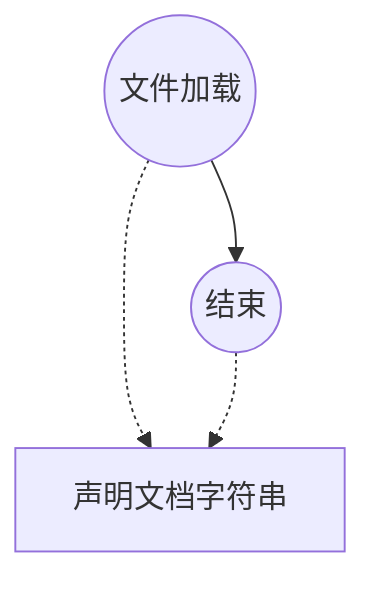

# `.\AutoGPT\autogpt_platform\backend\test\agent_generator\__init__.py` 详细设计文档

该代码文件目前仅包含一个文档字符串，声明其用途为测试 agent generator 模块，尚未实现任何具体的逻辑、类或函数。

## 整体流程



## 类结构

```
None (无类定义)
```

## 全局变量及字段


    

## 全局函数及方法


## 关键组件


<!-- 提供的代码仅包含模块文档字符串，未包含具体实现逻辑，因此无法识别代码中的关键组件（如张量索引、反量化等）。 -->

### 无关键组件
提供的源代码仅为模块文档字符串 `"""Tests for agent generator module."""`，不包含任何类、函数或变量的具体实现。


## 问题及建议


### 已知问题

-   代码文件当前仅包含一个文档字符串，缺乏具体的实现逻辑或测试代码。
-   缺少对被测对象（agent generator module）的导入语句，无法建立测试上下文。
-   没有引入任何单元测试框架（如 `unittest`、`pytest`）或定义相应的测试类/函数结构。
-   缺乏具体的测试用例来验证 `agent generator` 的功能正确性、异常处理及边界条件。

### 优化建议

-   引入适合的测试框架（如 `unittest` 或 `pytest`），并构建标准的测试类结构。
-   补充必要的导入语句，确保能够引用 `agent generator` 模块及其依赖组件。
-   编写具体的测试用例，覆盖核心业务逻辑、正常路径、异常路径及边界值测试。
-   考虑使用 Mock 或 Fixture 技术来模拟外部依赖，隔离测试环境，提高测试的稳定性和执行速度。


## 其它


### 设计目标与约束

该模块旨在验证 Agent 生成器的核心功能、稳定性及性能。设计目标包括确保代码覆盖率满足预设标准，能够快速反馈回归错误，并验证生成逻辑的正确性。约束条件包括：测试环境必须独立，避免对生产数据造成影响；外部依赖（如 LLM API 调用）必须通过 Mock 进行模拟，以降低测试成本和不确定性；测试用例的执行时间需控制在合理范围内以保证 CI/CD 流水线的效率。

### 外部依赖与接口契约

本测试模块主要依赖于 Python 的标准测试框架（如 `unittest` 或 `pytest`）以及待测试的 `agent_generator` 核心模块。接口契约方面，测试用例将验证生成器对外暴露的接口（如 `generate_agent` 方法）是否符合预定义的输入输出规范，包括参数类型校验、返回值结构验证以及异常抛出条件。对于外部服务接口（如数据库或 API），测试中使用 Mock 对象替代，并约定 Mock 对象的行为需与真实接口保持一致的契约（如返回数据格式）。

### 测试策略与覆盖范围

采用单元测试与集成测试相结合的策略。单元测试专注于生成器内部的辅助函数和独立逻辑，使用断言验证具体算法的准确性；集成测试关注整个 Agent 生成流程的端到端表现。覆盖范围需涵盖所有业务逻辑路径，包括正常流程、异常处理流程（如输入非法参数、网络超时等）以及边界条件。测试数据将包含典型的标准用例和极端的边界用例，以确保系统的鲁棒性。

### 数据流与状态机

在测试数据流方面，数据流向遵循：构造测试输入数据（Prompt/Config） -> 调用 Agent 生成接口 -> 捕获输出或异常 -> 断言验证结果。状态机主要描述测试用例的生命周期：Setup（初始化环境、注入 Mock） -> Execute（执行测试逻辑） -> Teardown（清理资源、重置状态）。测试需确保每一个测试用例执行完毕后，系统状态恢复到初始值，避免测试间的相互干扰。

### 错误处理与异常设计

测试模块重点验证待测代码的错误处理机制。设计包括：验证当输入参数缺失或类型错误时，是否能抛出预期的 `ValueError` 或 `TypeError`；验证当外部依赖服务不可用时，系统是否具备合理的重试机制或降级逻辑；验证系统生成的异常信息是否具有足够的可读性，便于调试。测试框架本身应具备捕获未预料异常的能力，并输出详细的堆栈信息。

    