# `.\AutoGPT\autogpt_platform\backend\test\agent_generator\test_core_integration.py` 详细设计文档

该文件是 Agent Generator 核心模块的单元测试套件，主要验证外部服务委托逻辑、配置错误处理、服务失败时的降级处理以及 JSON 数据到 Graph 模型的转换功能，使用 pytest 和 unittest.mock 进行异步测试和模拟。

## 整体流程

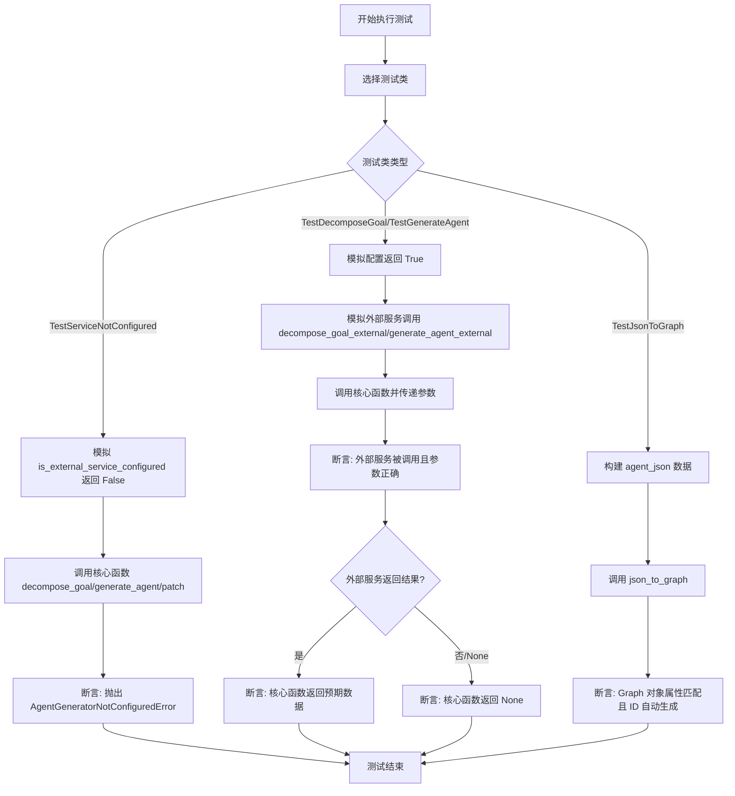

## 类结构

```
TestSuite (Root)
├── TestServiceNotConfigured
├── TestDecomposeGoal
├── TestGenerateAgent
├── TestGenerateAgentPatch
└── TestJsonToGraph
```

## 全局变量及字段


    

## 全局函数及方法


### `TestServiceNotConfigured.test_decompose_goal_raises_when_not_configured`

该测试方法验证当外部服务未配置时，调用`core.decompose_goal`函数会正确抛出`AgentGeneratorNotConfiguredError`异常。

参数：

- `self`：`TestServiceNotConfigured`，测试类实例的引用。

返回值：`None`，测试方法无显式返回值，主要用于断言验证。

#### 流程图

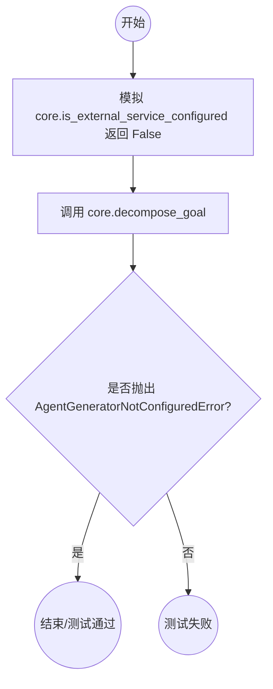

#### 带注释源码

```python
    @pytest.mark.asyncio
    async def test_decompose_goal_raises_when_not_configured(self):
        """Test that decompose_goal raises error when service not configured."""
        # 模拟 core.is_external_service_configured 函数，使其返回 False，模拟服务未配置的场景
        with patch.object(core, "is_external_service_configured", return_value=False):
            # 使用 pytest.raises 上下文管理器，预期调用 core.decompose_goal 会抛出 AgentGeneratorNotConfiguredError
            with pytest.raises(AgentGeneratorNotConfiguredError):
                # 异步调用 core.decompose_goal 并传入测试参数
                await core.decompose_goal("Build a chatbot")
```


### `TestServiceNotConfigured.test_generate_agent_raises_when_not_configured`

该测试函数用于验证当外部服务未配置时，调用核心生成代理函数 (`generate_agent`) 是否能够正确抛出 `AgentGeneratorNotConfiguredError` 异常，确保系统在配置缺失时的健壮性。

参数：

- `self`：`TestServiceNotConfigured`，测试类的实例引用，用于访问测试上下文。

返回值：`None`，该函数为测试方法，无显式返回值，通过断言控制测试结果。

#### 流程图

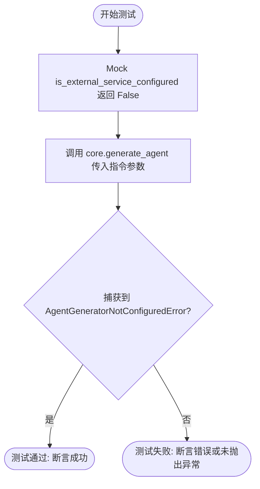

#### 带注释源码

```python
    @pytest.mark.asyncio
    async def test_generate_agent_raises_when_not_configured(self):
        """Test that generate_agent raises error when service not configured."""
        # 模拟 core.is_external_service_configured 函数，强制其返回 False
        # 以此模拟外部服务未配置的场景
        with patch.object(core, "is_external_service_configured", return_value=False):
            # 使用 pytest.raises 验证上下文中的代码块是否抛出指定的异常
            # 如果 core.generate_agent 被调用且未抛出 AgentGeneratorNotConfiguredError，则测试失败
            with pytest.raises(AgentGeneratorNotConfiguredError):
                # 异步调用 core.generate_agent，传入包含步骤的字典参数
                await core.generate_agent({"steps": []})
```


### `TestServiceNotConfigured.test_generate_agent_patch_raises_when_not_configured`

该测试方法验证了当外部服务未配置时，调用 `core.generate_agent_patch` 函数能否正确地抛出 `AgentGeneratorNotConfiguredError` 异常。它通过模拟 `is_external_service_configured` 函数返回 `False` 来构建未配置的环境，并断言目标函数的行为符合预期。

参数：

-   `self`：`TestServiceNotConfigured`，测试类的实例，提供测试上下文及访问 pytest 断言工具的能力。

返回值：`None`，该方法为单元测试函数，主要进行异常行为验证，无业务数据返回，成功时静默通过，失败时抛出测试错误。

#### 流程图

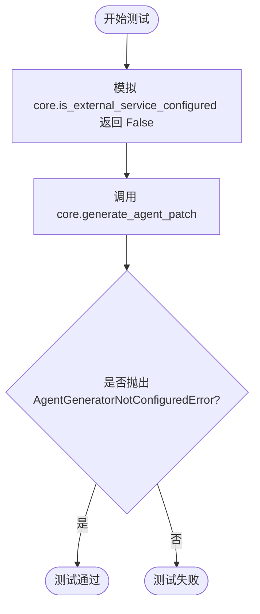

#### 带注释源码

```python
    @pytest.mark.asyncio
    async def test_generate_agent_patch_raises_when_not_configured(self):
        """Test that generate_agent_patch raises error when service not configured."""
        # 使用 patch.object 模拟 core 模块中的 is_external_service_configured 函数
        # 强制其返回 False，以模拟“外部服务未配置”的状态
        with patch.object(core, "is_external_service_configured", return_value=False):
            # 使用 pytest.raises 上下文管理器
            # 预期代码块中的操作会抛出 AgentGeneratorNotConfiguredError 异常
            with pytest.raises(AgentGeneratorNotConfiguredError):
                # 执行待测函数 generate_agent_patch
                # 传入模拟的指令字符串和当前代理状态
                await core.generate_agent_patch("Add a node", {"nodes": []})
```


### `TestDecomposeGoal.test_calls_external_service`

测试 `core.decompose_goal` 函数在服务已配置的情况下，正确调用外部服务并返回预期结果。

参数：

-  `self`：`TestDecomposeGoal`，测试类的实例引用。

返回值：`None`，该方法是异步测试函数，没有返回值。

#### 流程图

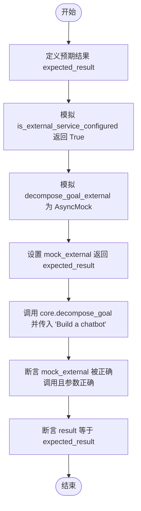

#### 带注释源码

```python
@pytest.mark.asyncio
async def test_calls_external_service(self):
    """Test that decompose_goal calls the external service."""
    # 定义期望的外部服务返回结果
    expected_result = {"type": "instructions", "steps": ["Step 1"]}

    # 使用 patch 对象上下文管理器：
    # 1. 模拟 core.is_external_service_configured 返回 True，表示服务已配置
    # 2. 模拟 core.decompose_goal_external 为 AsyncMock 对象，用于模拟异步外部调用
    with patch.object(
        core, "is_external_service_configured", return_value=True
    ), patch.object(
        core, "decompose_goal_external", new_callable=AsyncMock
    ) as mock_external:
        # 设置模拟的外部服务返回预定义结果
        mock_external.return_value = expected_result

        # 调用被测函数 core.decompose_goal
        result = await core.decompose_goal("Build a chatbot")

        # 验证 decompose_goal_external 是否被正确调用了一次，
        # 且参数为 ("Build a chatbot", "", None) (context 默认为空，library_agents 默认为 None)
        mock_external.assert_called_once_with("Build a chatbot", "", None)
        # 验证实际返回结果与预期结果一致
        assert result == expected_result
```


### `TestDecomposeGoal.test_passes_context_to_external_service`

这是一个用于验证 `decompose_goal` 核心函数是否正确将上下文参数传递给外部服务的测试方法。它通过模拟外部服务配置和外部服务调用，确保当调用 `decompose_goal` 时，额外的上下文参数（如编程语言要求）被准确转发。

参数：

- `self`：`TestDecomposeGoal`，测试类实例，用于访问测试上下文。

返回值：`None`，该方法为无返回值的测试函数，通过断言验证行为。

#### 流程图

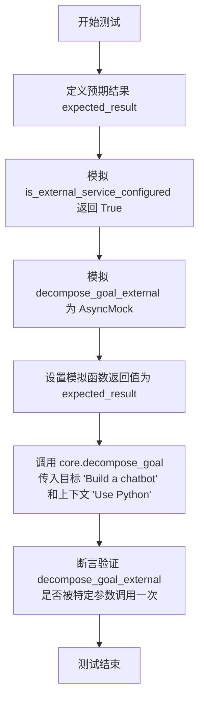

#### 带注释源码

```python
    @pytest.mark.asyncio
    async def test_passes_context_to_external_service(self):
        """Test that decompose_goal passes context to external service."""
        # 定义预期的外部服务返回结果
        expected_result = {"type": "instructions", "steps": ["Step 1"]}

        # 使用 patch.object 模拟核心模块的两个函数：
        # 1. is_external_service_configured: 强制返回 True，表示服务已配置
        # 2. decompose_goal_external: 使用 AsyncMock 替换，用于捕获调用参数
        with patch.object(
            core, "is_external_service_configured", return_value=True
        ), patch.object(
            core, "decompose_goal_external", new_callable=AsyncMock
        ) as mock_external:
            # 设置模拟的外部服务返回值
            mock_external.return_value = expected_result

            # 调用待测函数 core.decompose_goal
            # 传入目标字符串 "Build a chatbot" 和 上下文字符串 "Use Python"
            await core.decompose_goal("Build a chatbot", "Use Python")

            # 验证外部服务接口是否被正确调用
            # 断言 decompose_goal_external 被调用且仅调用一次
            # 参数依次为: 目标 "Build a chatbot", 上下文 "Use Python", 默认的 library_agents None
            mock_external.assert_called_once_with("Build a chatbot", "Use Python", None)
```


### `TestDecomposeGoal.test_returns_none_on_service_failure`

验证当外部服务调用失败（返回 None）时，`core.decompose_goal` 函数能正确返回 None，而不是抛出异常或返回错误数据。

参数：

- `self`：`TestDecomposeGoal`，测试类的实例，用于访问测试上下文。

返回值：`None`，无返回值。

#### 流程图

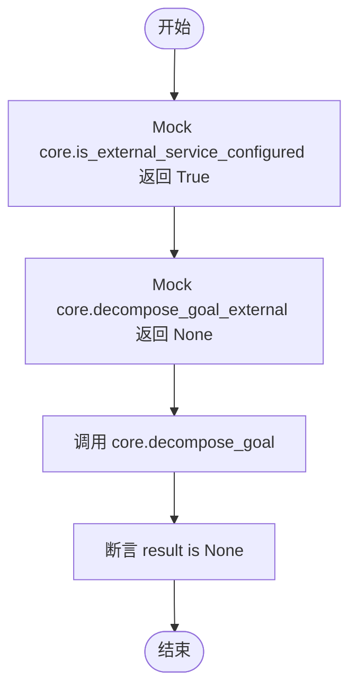

#### 带注释源码

```python
@pytest.mark.asyncio
async def test_returns_none_on_service_failure(self):
    """Test that decompose_goal returns None when external service fails."""
    # 模拟外部服务配置检查通过，避免抛出 AgentGeneratorNotConfiguredError
    with patch.object(
        core, "is_external_service_configured", return_value=True
    ), patch.object(
        core, "decompose_goal_external", new_callable=AsyncMock
    ) as mock_external:
        # 模拟外部服务调用失败，返回 None
        mock_external.return_value = None

        # 调用 core.decompose_goal 函数
        result = await core.decompose_goal("Build a chatbot")

        # 断言函数返回结果为 None，确保失败情况处理正确
        assert result is None
```


### `TestGenerateAgent.test_calls_external_service`

验证 `generate_agent` 函数是否在配置正确时调用外部服务，并检查返回结果的必要字段（如 name, id, version, is_active）是否符合预期。

参数：

- `self`：`TestGenerateAgent`，测试类实例，用于访问测试上下文和断言方法。

返回值：`None`，该函数为测试方法，不返回业务数据，通过断言验证逻辑正确性。

#### 流程图

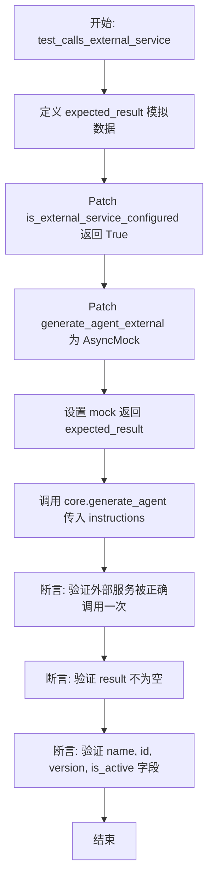

#### 带注释源码

```python
async def test_calls_external_service(self):
    """Test that generate_agent calls the external service."""
    # 定义外部服务预期返回的模拟数据
    expected_result = {"name": "Test Agent", "nodes": [], "links": []}

    # 使用 patch 模拟核心依赖项：
    # 1. 模拟服务配置检查函数返回 True（表示已配置）
    # 2. 模拟外部服务调用函数 generate_agent_external
    with patch.object(
        core, "is_external_service_configured", return_value=True
    ), patch.object(
        core, "generate_agent_external", new_callable=AsyncMock
    ) as mock_external:
        # 设置模拟的外部服务调用返回预定义结果
        mock_external.return_value = expected_result

        # 准备测试输入数据 instructions
        instructions = {"type": "instructions", "steps": ["Step 1"]}
        
        # 调用被测试的 core.generate_agent 函数
        result = await core.generate_agent(instructions)

        # 验证：断言外部服务函数被正确调用了一次，且参数正确
        mock_external.assert_called_once_with(instructions, None, None, None)
        
        # 验证：断言结果不为 None
        assert result is not None
        # 验证：断言结果中的 name 字段正确
        assert result["name"] == "Test Agent"
        # 验证：断言结果中包含自动生成的 id 字段
        assert "id" in result
        # 验证：断言默认 version 为 1
        assert result["version"] == 1
        # 验证：断言默认 is_active 为 True
        assert result["is_active"] is True
```


### `TestGenerateAgent.test_preserves_existing_id_and_version`

测试在调用 Agent 生成核心逻辑时，如果外部服务返回的结果中已包含 `id`、`version` 和 `is_active` 字段，这些现有值应被正确保留，而不被覆盖或重置。

参数：

-  `self`：`TestGenerateAgent`，测试类实例，用于访问测试上下文和断言方法。

返回值：`None`，无返回值。

#### 流程图

```mermaid
graph TD
    A[开始测试] --> B[定义 expected_result 包含 id, version, is_active]
    B --> C[模拟 is_external_service_configured 返回 True]
    C --> D[模拟 generate_agent_external 返回 expected_result 副本]
    D --> E[调用 core.generate_agent]
    E --> F[断言 result 不为 None]
    F --> G{断言 result['id'] == 'existing-id'}
    G --> H{断言 result['version'] == 3}
    H --> I{断言 result['is_active'] == False}
    I --> J[测试结束]
```

#### 带注释源码

```python
    # 标记为异步测试方法
    @pytest.mark.asyncio
    async def test_preserves_existing_id_and_version(self):
        """Test that external service result preserves existing id and version."""
        # 定义预期的返回结果，包含现有的 id, version 和 is_active 状态
        expected_result = {
            "id": "existing-id",
            "version": 3,
            "is_active": False,
            "name": "Test Agent",
        }

        # 使用 patch.object 模拟 is_external_service_configured 函数，强制返回 True
        # 使用 patch.object 模拟 generate_agent_external 函数，并设为 AsyncMock
        with patch.object(
            core, "is_external_service_configured", return_value=True
        ), patch.object(
            core, "generate_agent_external", new_callable=AsyncMock
        ) as mock_external:
            # 设置模拟的外部服务调用返回值为 expected_result 的副本
            mock_external.return_value = expected_result.copy()

            # 调用实际的 generate_agent 函数，传入空的步骤指令
            result = await core.generate_agent({"steps": []})

            # 验证返回结果不为空
            assert result is not None
            # 验证 id 字段保持了外部服务返回的值 "existing-id"
            assert result["id"] == "existing-id"
            # 验证 version 字段保持了外部服务返回的值 3
            assert result["version"] == 3
            # 验证 is_active 字段保持了外部服务返回的值 False
            assert result["is_active"] is False
```


### `TestGenerateAgent.test_returns_none_when_external_service_fails`

测试当外部服务失败时，`generate_agent` 函数是否能正确返回 None。

参数：

- `self`：`TestGenerateAgent`，测试类的实例，用于访问测试上下文。

返回值：`None`，测试方法不返回值，仅执行断言。

#### 流程图

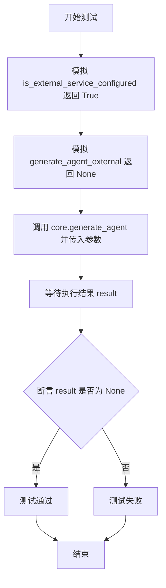

#### 带注释源码

```python
    @pytest.mark.asyncio
    async def test_returns_none_when_external_service_fails(self):
        """Test that generate_agent returns None when external service fails."""
        # 模拟核心模块中的配置检查函数，使其返回 True，表示服务已配置
        with patch.object(
            core, "is_external_service_configured", return_value=True
        # 模拟核心模块中的外部服务调用函数，使用 AsyncMock 创建异步模拟对象
        ), patch.object(
            core, "generate_agent_external", new_callable=AsyncMock
        ) as mock_external:
            # 设置模拟对象的返回值为 None，模拟外部服务调用失败的情况
            mock_external.return_value = None

            # 调用实际的 generate_agent 函数，并传入测试数据
            result = await core.generate_agent({"steps": []})

            # 断言验证结果为 None，确保函数在服务失败时按预期处理
            assert result is None
```


### `TestGenerateAgentPatch.test_calls_external_service`

测试 `generate_agent_patch` 函数是否正确调用了外部服务，并验证其返回值是否符合预期。

参数：

- `self`：`TestGenerateAgentPatch`，测试类的实例，用于访问测试上下文。

返回值：`None`，无返回值（测试方法主要用于断言，不返回业务数据）。

#### 流程图

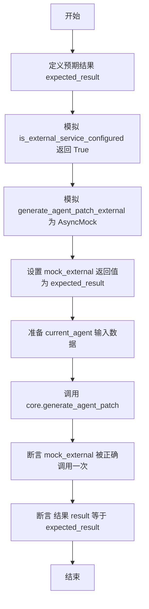

#### 带注释源码

```python
@pytest.mark.asyncio
async def test_calls_external_service(self):
    """Test that generate_agent_patch calls the external service."""
    # 定义外部服务调用后期望返回的模拟数据
    expected_result = {"name": "Updated Agent", "nodes": [], "links": []}

    # 使用 patch.object 模拟 core 模块中的函数
    with patch.object(
        core, "is_external_service_configured", return_value=True  # 模拟服务已配置检查通过
    ), patch.object(
        core, "generate_agent_patch_external", new_callable=AsyncMock  # 模拟外部服务调用为异步 Mock
    ) as mock_external:
        mock_external.return_value = expected_result  # 设置 mock 对象的返回值

        # 准备传入函数的当前 agent 状态数据
        current_agent = {"nodes": [], "links": []}
        # 调用实际待测的 core 函数
        result = await core.generate_agent_patch("Add a node", current_agent)

        # 验证外部服务接口 generate_agent_patch_external 是否被使用正确的参数调用了一次
        mock_external.assert_called_once_with(
            "Add a node", current_agent, None, None, None
        )
        # 验证函数返回结果是否与预期结果一致
        assert result == expected_result
```


### `TestGenerateAgentPatch.test_returns_clarifying_questions`

测试 `generate_agent_patch` 函数是否能正确返回来自外部服务的澄清问题（clarifying questions）。

参数：

- `self`：`TestGenerateAgentPatch`，测试类的实例。

返回值：`None`，该方法为测试函数，主要用于断言验证，无业务返回值。

#### 流程图

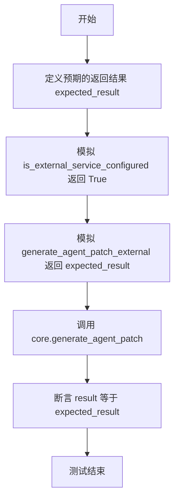

#### 带注释源码

```python
    @pytest.mark.asyncio
    async def test_returns_clarifying_questions(self):
        """Test that generate_agent_patch returns clarifying questions."""
        # 1. 定义预期的外部服务返回结果，包含澄清问题
        expected_result = {
            "type": "clarifying_questions",
            "questions": [{"question": "What type of node?"}],
        }

        # 2. 使用 patch.object 模拟外部依赖
        with patch.object(
            core, "is_external_service_configured", return_value=True  # 模拟服务已配置
        ), patch.object(
            core, "generate_agent_patch_external", new_callable=AsyncMock  # 模拟外部服务调用
        ) as mock_external:
            mock_external.return_value = expected_result  # 设置模拟函数的返回值

            # 3. 调用 core.generate_agent_patch，传入目标描述和当前代理状态
            result = await core.generate_agent_patch("Add a node", {"nodes": []})

            # 4. 断言实际返回结果与预期结果一致
            assert result == expected_result
```


### `TestGenerateAgentPatch.test_returns_none_when_external_service_fails`

该测试方法验证了当外部服务调用失败（模拟返回 None）时，`core.generate_agent_patch` 函数能够正确处理并返回 None。

参数：

- `self`：`TestGenerateAgentPatch`，测试类的实例引用。

返回值：`None`，测试方法本身不返回业务数据，仅执行断言。

#### 流程图

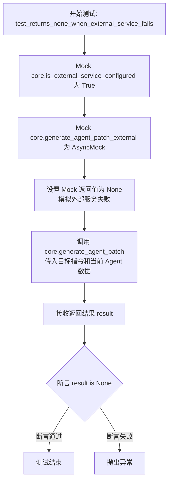

#### 带注释源码

```python
@pytest.mark.asyncio
async def test_returns_none_when_external_service_fails(self):
    """Test that generate_agent_patch returns None when service fails."""
    # 模拟 core.is_external_service_configured 函数，使其返回 True，
    # 假定外部服务已配置，从而绕过配置检查。
    with patch.object(
        core, "is_external_service_configured", return_value=True
    ), patch.object(
        # 模拟 core.generate_agent_patch_external 函数，将其替换为 AsyncMock 对象。
        core, "generate_agent_patch_external", new_callable=AsyncMock
    ) as mock_external:
        # 设置模拟的外部服务调用返回 None，以模拟服务调用失败或无响应的情况。
        mock_external.return_value = None

        # 调用核心函数 core.generate_agent_patch，传入目标描述 "Add a node" 和当前 agent 数据 {"nodes": []}
        result = await core.generate_agent_patch("Add a node", {"nodes": []})

        # 断言：验证函数返回的结果确实是 None，确保失败场景处理正确。
        assert result is None
```


### `TestJsonToGraph.test_converts_agent_json_to_graph`

测试将包含完整信息（ID、版本、状态、名称、描述、节点和链接）的 Agent JSON 字典正确转换为 Graph 模型对象的功能。

参数：

- `self`：`TestJsonToGraph`，测试类的实例，用于访问测试上下文。

返回值：`None`，无返回值，主要通过断言（assert）验证转换后的数据是否符合预期。

#### 流程图

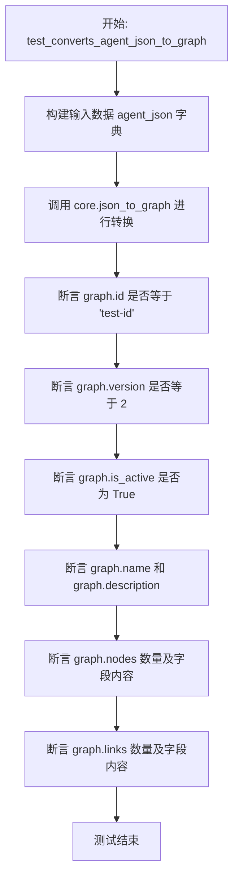

#### 带注释源码

```python
def test_converts_agent_json_to_graph(self):
    """Test conversion of agent JSON to Graph model."""
    # 准备测试数据：包含完整信息的 Agent JSON 字典
    agent_json = {
        "id": "test-id",
        "version": 2,
        "is_active": True,
        "name": "Test Agent",
        "description": "A test agent",
        "nodes": [
            {
                "id": "node1",
                "block_id": "block1",
                "input_default": {"key": "value"},
                "metadata": {"x": 100},
            }
        ],
        "links": [
            {
                "id": "link1",
                "source_id": "node1",
                "sink_id": "output",
                "source_name": "result",
                "sink_name": "input",
                "is_static": False,
            }
        ],
    }

    # 调用核心函数进行转换
    graph = core.json_to_graph(agent_json)

    # 验证基本属性是否正确映射
    assert graph.id == "test-id"
    assert graph.version == 2
    assert graph.is_active is True
    assert graph.name == "Test Agent"
    assert graph.description == "A test agent"
    
    # 验证节点列表长度及节点内容
    assert len(graph.nodes) == 1
    assert graph.nodes[0].id == "node1"
    assert graph.nodes[0].block_id == "block1"
    
    # 验证链接列表长度及链接内容
    assert len(graph.links) == 1
    assert graph.links[0].source_id == "node1"
```


### `TestJsonToGraph.test_generates_ids_if_missing`

该测试用例验证 `json_to_graph` 函数在输入的代理 JSON 数据中缺失图 ID 或节点 ID 等关键字段时，能够自动生成唯一标识符的能力。

参数：

-  `self`：`TestJsonToGraph`，测试类的实例，由 pytest 框架自动注入。

返回值：`None`，测试方法通常不返回值，通过断言来验证逻辑正确性。

#### 流程图

```mermaid
flowchart TD
    A[开始] --> B[构造输入数据 agent_json<br>包含 name 和 nodes<br>缺失 id 和 节点 id]
    B --> C[调用 core.json_to_graph<br>传入 agent_json]
    C --> D[断言 graph.id 不为 None]
    D --> E[断言 graph.nodes[0].id 不为 None]
    E --> F[测试结束]
```

#### 带注释源码

```python
    def test_generates_ids_if_missing(self):
        """Test that missing IDs are generated."""
        # 准备输入数据：包含名称和一个节点，但缺少图级别的 ID 和节点级别的 ID
        agent_json = {
            "name": "Test Agent",
            "nodes": [{"block_id": "block1"}], 
            "links": [],
        }

        # 调用核心转换函数，将 JSON 转换为 Graph 对象
        graph = core.json_to_graph(agent_json)

        # 验证转换后的 Graph 对象是否自动生成了图 ID
        assert graph.id is not None
        # 验证 Graph 对象中的节点列表是否自动生成了节点 ID
        assert graph.nodes[0].id is not None
```


## 关键组件


### AgentGeneratorNotConfiguredError
当外部服务未配置时抛出的自定义异常类，用于系统状态校验。

### External Service Configuration Check
核心模块中用于验证外部代理生成服务是否已配置的检查逻辑。

### Goal Decomposition Service
负责接收用户目标并调用外部服务将其分解为步骤列表的组件。

### Agent Generation Service
负责根据指令集调用外部服务生成完整代理配置（包含节点和链接）的组件。

### Agent Patching Service
负责处理代理修改请求，调用外部服务生成补丁或澄清问题的组件。

### JSON to Graph Converter
负责将原始 JSON 代理数据转换为结构化 Graph 对象，并自动补全缺失 ID 的数据转换组件。


## 问题及建议


### 已知问题

-   **错误处理机制不完善**：测试显示当外部服务调用失败（如 `decompose_goal_external` 返回 `None`）时，核心函数仅返回 `None`。这种“静默失败”使得调用者难以区分是“服务未配置”、“网络超时”还是“业务逻辑错误”，增加了问题排查的难度。
-   **缺乏重试与容错机制**：测试代码未覆盖网络抖动或服务临时不可用的场景。目前逻辑中若外部服务调用失败直接返回结果，缺乏自动重试或熔断降级策略，系统鲁棒性不足。
-   **数据契约缺乏强类型约束**：与外部服务的交互主要依赖原始字典结构（如 `{"type": "instructions", "steps": ...}`），缺乏显式的类型定义。这容易导致字段拼写错误或字段类型不匹配，且无法利用 IDE 的静态检查功能。
-   **ID 生成逻辑存在隐患**：`TestJsonToGraph` 测试表明在转换 JSON 为 Graph 对象时会自动补全缺失的 ID。这说明系统可能依赖外部服务返回不完整的数据，且补全 ID 的逻辑位于数据转换层，而非数据生成层，容易导致数据一致性问题。
-   **多态返回类型增加调用复杂度**：`generate_agent_patch` 可能返回“澄清问题”或“代理配置”两种截然不同的数据结构。调用方必须手动检查特定字段（如 `type`）来区分逻辑，违反了接口单一职责原则，提高了使用门槛。

### 优化建议

-   **引入 Pydantic 或 Dataclass 定义数据模型**：将用于外部服务交互的字典替换为强类型对象（如 `AgentInstruction`、`GraphModel`），在数据进入系统边界时进行自动校验，确保数据结构的正确性。
-   **实现统一的结果对象封装**：定义一个 `Result` 或 `Response` 对象来封装所有返回值，包含 `success` 状态、`data` 数据和 `error_message` 错误详情，避免使用 `None` 作为错误或失败的唯一标识。
-   **增加熔断器与重试策略**：为外部服务调用引入重试机制（如 Tenacity 库）和熔断器模式，在遇到瞬时网络故障时自动重试，在服务不可用时快速失败，防止级联故障。
-   **增强可观测性与日志记录**：在外部服务调用前后增加结构化日志，记录请求参数、响应状态码及耗时，并集成链路追踪，便于在出现故障时快速定位瓶颈。
-   **前置数据校验与规范化**：在 `json_to_graph` 或外部服务响应处理阶段，严格校验必填字段（如 ID）。如果外部服务无法保证 ID 返回，应在业务入口处统一生成并注入，而非在转换层补救。


## 其它


### 设计目标与约束

**设计目标：**
1.  **核心功能验证**：确保 `AgentGenerator` 核心模块（`backend.api.features.chat.tools.agent_generator.core`）的功能逻辑正确，包括目标分解（`decompose_goal`）、代理生成（`generate_agent`）和代理补丁（`generate_agent_patch`）。
2.  **服务委托验证**：验证核心函数正确地将业务逻辑委托给外部服务（如 `decompose_goal_external`），并传递了正确的参数。
3.  **配置状态测试**：确保在服务未配置时，系统能够正确抛出 `AgentGeneratorNotConfiguredError` 异常，防止无效调用。
4.  **数据转换验证**：确保 `json_to_graph` 函数能正确地将原始 JSON 字典转换为强类型的 Graph 模型对象，并处理缺失字段的默认生成逻辑。

**设计约束：**
1.  **隔离性测试**：所有测试必须使用 Mock 对象（`unittest.mock.AsyncMock`）模拟外部服务和依赖项，禁止在单元测试中进行真实的网络调用或外部服务交互。
2.  **异步测试支持**：由于核心模块涉及异步操作（`async/await`），所有测试用例必须使用 `pytest.mark.asyncio` 标记以支持异步执行。
3.  **无副作用**：测试代码不应修改实际的环境配置或持久化存储，仅针对内存中的模拟状态进行验证。

### 错误处理与异常设计

**异常处理策略：**
1.  **服务未配置异常**：
    *   **场景**：当 `is_external_service_configured` 返回 `False` 时，`decompose_goal`、`generate_agent` 和 `generate_agent_patch` 必须立即中止执行。
    *   **预期行为**：抛出 `AgentGeneratorNotConfiguredError` 异常。
    *   **测试覆盖**：`TestServiceNotConfigured` 类下的三个测试方法专门验证此逻辑，使用 `pytest.raises` 上下文管理器捕获预期异常。
2.  **外部服务故障处理**：
    *   **场景**：当外部服务调用失败或返回 `None` 时（模拟网络错误或服务端错误）。
    *   **预期行为**：核心函数不应抛出异常，而应优雅地返回 `None`，以允许上层调用者处理空结果情况。
    *   **测试覆盖**：`test_returns_none_on_service_failure`、`test_returns_none_when_external_service_fails` 等方法验证核心函数对 `None` 返回值的透传处理。
3.  **数据缺失处理**：
    *   **场景**：输入的 JSON 数据缺少可选字段（如 `id`）。
    *   **预期行为**：`json_to_graph` 函数应自动生成缺失的标识符，确保数据模型的完整性，而不是抛出解析错误。

### 数据流与状态机

**数据流：**
1.  **正向流程（正常调用）**：
    *   **输入**：测试构造模拟输入数据（如目标字符串 "Build a chatbot" 或指令字典）。
    *   **Mock 设置**：将 `is_external_service_configured` 设为 `True`，并将外部服务函数（如 `decompose_goal_external`）设为返回预定义的 `expected_result`。
    *   **执行**：调用核心函数（如 `core.decompose_goal`）。
    *   **验证**：
        1.  验证外部服务函数被调用，且参数（如 goal, context）符合预期。
        2.  验证核心函数返回的结果与外部服务的返回值一致，或经过了预期的后处理（如补全 `id` 或 `version`）。
2.  **转换流程**：
    *   **输入**：包含 `nodes` 和 `links` 的原始字典 `agent_json`。
    *   **执行**：调用 `core.json_to_graph(agent_json)`。
    *   **输出**：映射后的 Pydantic 模型实例，字段类型被严格校验。

**状态机逻辑（配置状态）：**
虽然测试代码本身不维护复杂的长期状态，但测试逻辑中隐含了一个“配置状态”的切换：
*   **状态 A (未配置)**：通过 `patch` 返回 `False`。系统行为：抛出异常，阻断流程。
*   **状态 B (已配置)**：通过 `patch` 返回 `True`。系统行为：流程继续，委托给外部服务。
测试用例分别在这两种状态下对系统的响应进行了断言。

### 外部依赖与接口契约

**外部依赖项：**
1.  **测试框架**：`pytest`（提供测试运行器和断言库）、`unittest.mock`（提供 `patch` 和 `AsyncMock` 用于模拟外部依赖）。
2.  **被测模块**：`backend.api.features.chat.tools.agent_generator.core`。
    *   **依赖关系**：测试代码直接导入并测试该模块中的 `decompose_goal`、`generate_agent`、`generate_agent_patch`、`json_to_graph` 等函数。

**接口契约（隐式定义）：**
通过测试用例的 `assert_called_once_with` 和返回值验证，文档化了核心模块与外部服务之间的隐含接口契约：
1.  **`decompose_goal_external` 接口**：
    *   **参数签名**：`(goal: str, context: str, library_agents: Optional[Any])`。
    *   **返回类型**：`Optional[Dict]`（包含 `type` 和 `steps` 的字典，或 `None`）。
2.  **`generate_agent_external` 接口**：
    *   **参数签名**：`(instructions: Dict, param1: None, param2: None, param3: None)`（根据测试中的 `assert_called_once_with(instructions, None, None, None)` 推断）。
    *   **返回类型**：`Optional[Dict]`（包含代理元数据如 `name`、`nodes` 等的字典，或 `None`）。
3.  **配置检查接口**：
    *   **函数**：`is_external_service_configured`。
    *   **契约**：无参数调用，返回 `bool` 值，`True` 表示服务可用，`False` 表示不可用。


    