# `.\AutoGPT\autogpt_platform\backend\test\agent_generator\test_library_agents.py` 详细设计文档

This code provides a comprehensive test suite for the agent generator core functionality, verifying the retrieval, search, combination, and enrichment of library and marketplace agents, as well as utility functions for UUID extraction.

## 整体流程

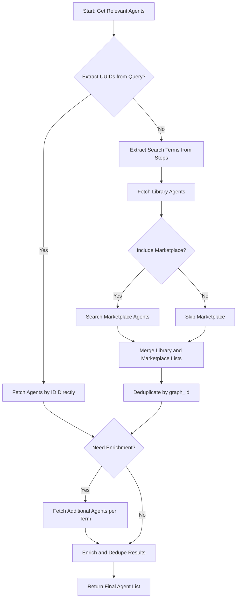

## 类结构

```
TestAgentGenerator (Test Suite)
├── TestGetLibraryAgentsForGeneration
├── TestSearchMarketplaceAgentsForGeneration
├── TestGetAllRelevantAgentsForGeneration
├── TestExtractSearchTermsFromSteps
├── TestEnrichLibraryAgentsFromSteps
├── TestExtractUuidsFromText
├── TestGetLibraryAgentById
└── TestGetAllRelevantAgentsWithUuids
```

## 全局变量及字段


    

## 全局函数及方法


### `TestGetLibraryAgentsForGeneration.test_fetches_agents_with_search_term`

验证在调用 `get_library_agents_for_generation` 函数时，`search_query` 参数是否正确传递给底层的 `library_db.list_library_agents` 方法，并确认默认的分页参数和返回结果的格式符合预期。

参数：

-   `self`：`TestGetLibraryAgentsForGeneration`，测试类的实例。

返回值：`None`，无返回值，通过断言来验证逻辑。

#### 流程图

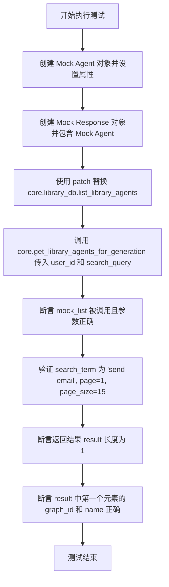

#### 带注释源码

```python
@pytest.mark.asyncio
async def test_fetches_agents_with_search_term(self):
    """Test that search_term is passed to the library db."""
    # 创建一个模拟的代理对象，并设置必要的属性以模拟真实数据
    mock_agent = MagicMock()
    mock_agent.graph_id = "agent-123"
    mock_agent.graph_version = 1
    mock_agent.name = "Email Agent"
    mock_agent.description = "Sends emails"
    mock_agent.input_schema = {"properties": {}}
    mock_agent.output_schema = {"properties": {}}
    mock_agent.recent_executions = []

    # 创建模拟的响应对象，将模拟代理放入 agents 列表中
    mock_response = MagicMock()
    mock_response.agents = [mock_agent]

    # 使用 patch.object 替换 core.library_db.list_library_agents 为 AsyncMock
    # 并指定其返回值为上面创建的 mock_response
    with patch.object(
        core.library_db,
        "list_library_agents",
        new_callable=AsyncMock,
        return_value=mock_response,
    ) as mock_list:
        # 调用实际要测试的函数 get_library_agents_for_generation
        result = await core.get_library_agents_for_generation(
            user_id="user-123",
            search_query="send email",
        )

        # 断言底层的 list_library_agents 是否被正确调用了一次
        # 并验证参数映射是否正确（search_query -> search_term）
        mock_list.assert_called_once_with(
            user_id="user-123",
            search_term="send email",
            page=1,
            page_size=15,
            include_executions=True,
        )

    # 验证返回结果的数据格式和内容是否符合预期
    assert len(result) == 1
    assert result[0]["graph_id"] == "agent-123"
    assert result[0]["name"] == "Email Agent"
```


### `TestGetLibraryAgentsForGeneration.test_excludes_specified_graph_id`

该测试方法用于验证当调用 `get_library_agents_for_generation` 函数并传入 `exclude_graph_id` 参数时，指定的 `graph_id` 对应的 agent 能够被正确地从返回结果中过滤掉。测试通过模拟数据库返回两个 agent，其中一个 ID 需要被排除，然后断言结果中仅包含未被排除的 agent。

参数：

- `self`：`TestGetLibraryAgentsForGeneration`，测试类的实例引用，由 pytest 框架隐式传递。

返回值：`None`，该函数为测试方法，不返回具体值，主要通过断言验证逻辑正确性。

#### 流程图

```mermaid
flowchart TD
    A[Start Test] --> B[Create mock_response object]
    B --> C[Initialize mock_response.agents list]
    C --> D[Add Agent 1: graph_id='agent-123']
    C --> E[Add Agent 2: graph_id='agent-456']
    D & E --> F[Patch core.library_db.list_library_agents]
    F --> G[Set mock return_value to mock_response]
    G --> H[Call core.get_library_agents_for_generation<br/>user_id='user-123'<br/>exclude_graph_id='agent-123']
    H --> I[Store return result]
    I --> J{Assert len result == 1}
    J -- True --> K{Assert result[0]['graph_id'] == 'agent-456'}
    K -- True --> L[Test Pass]
    K -- False --> M[Test Fail]
    J -- False --> M
```

#### 带注释源码

```python
@pytest.mark.asyncio
async def test_excludes_specified_graph_id(self):
    """Test that agents with excluded graph_id are filtered out."""
    # 1. 创建一个模拟的响应对象，用于伪造数据库层的返回
    mock_response = MagicMock()
    
    # 2. 初始化模拟的 agents 列表，包含两个 agent 对象
    mock_response.agents = [
        MagicMock(
            graph_id="agent-123",  # 第一个 agent 的 ID，计划被排除
            graph_version=1,
            name="Agent 1",
            description="First agent",
            input_schema={},
            output_schema={},
            recent_executions=[],
        ),
        MagicMock(
            graph_id="agent-456",  # 第二个 agent 的 ID，预期保留
            graph_version=1,
            name="Agent 2",
            description="Second agent",
            input_schema={},
            output_schema={},
            recent_executions=[],
        ),
    ]

    # 3. 使用 patch.object 替换 core.library_db.list_library_agents 方法
    #    使其返回上面构造好的 mock_response，避免真实数据库调用
    with patch.object(
        core.library_db,
        "list_library_agents",
        new_callable=AsyncMock,
        return_value=mock_response,
    ):
        # 4. 调用核心函数 get_library_agents_for_generation，
        #    传入 exclude_graph_id="agent-123" 以触发过滤逻辑
        result = await core.get_library_agents_for_generation(
            user_id="user-123",
            exclude_graph_id="agent-123",
        )

    # 5. 验证返回结果中只包含 1 个 agent（agent-123 被成功排除）
    assert len(result) == 1
    
    # 6. 验证剩下的 agent 是 agent-456
    assert result[0]["graph_id"] == "agent-456"
```


### `TestGetLibraryAgentsForGeneration.test_respects_max_results`

该测试函数用于验证当调用 `get_library_agents_for_generation` 并传入 `max_results` 参数时，该参数能正确限制底层数据库调用时的 `page_size` 大小，确保分页逻辑符合预期。

参数：

-  `self`：`TestGetLibraryAgentsForGeneration`，测试类实例，用于访问测试上下文。

返回值：`None`，无返回值（测试函数通过断言验证行为）。

#### 流程图

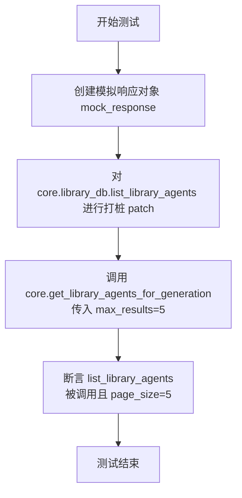

#### 带注释源码

```python
@pytest.mark.asyncio
async def test_respects_max_results(self):
    """Test that max_results parameter limits the page_size."""
    # 1. 创建一个模拟的响应对象，agents 列表为空
    mock_response = MagicMock()
    mock_response.agents = []

    # 2. 使用 patch.object 替换 core.library_db.list_library_agents
    #    使用 AsyncMock 来模拟异步调用，并指定返回值为上面创建的 mock_response
    with patch.object(
        core.library_db,
        "list_library_agents",
        new_callable=AsyncMock,
        return_value=mock_response,
    ) as mock_list:
        # 3. 调用核心函数 get_library_agents_for_generation
        #    传入 max_results 参数为 5
        await core.get_library_agents_for_generation(
            user_id="user-123",
            max_results=5,
        )

        # 4. 验证 list_library_agents 是否被调用了一次
        #    并且检查调用参数中的 page_size 是否正确设置为 max_results 的值 (5)
        mock_list.assert_called_once_with(
            user_id="user-123",
            search_term=None,
            page=1,
            page_size=5,
            include_executions=True,
        )
```


### `TestSearchMarketplaceAgentsForGeneration.test_searches_marketplace_with_query`

该测试方法旨在验证 `search_marketplace_agents_for_generation` 函数能够正确地使用查询字符串搜索市场代理，并将代理数据与图谱数据结合后返回预期的结果列表。

参数：

- `self`：`TestSearchMarketplaceAgentsForGeneration`，测试类的实例，用于访问测试上下文和断言方法。

返回值：`None`，无返回值，这是一个异步单元测试方法，主要通过断言来验证被测函数的行为。

#### 流程图

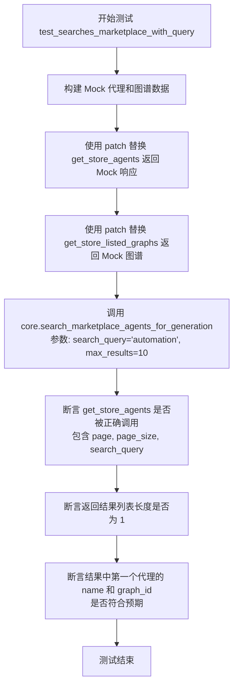

#### 带注释源码

```python
@pytest.mark.asyncio
async def test_searches_marketplace_with_query(self):
    """Test that marketplace is searched with the query."""
    # 1. 准备模拟的 API 响应数据
    mock_response = MagicMock()
    # 模拟返回的代理列表
    mock_response.agents = [
        MagicMock(
            agent_name="Public Agent",
            description="A public agent",
            sub_heading="Does something useful",
            creator="creator-1",
            agent_graph_id="graph-123",
        )
    ]

    # 2. 准备模拟的图谱数据，用于丰富代理信息
    mock_graph = MagicMock()
    mock_graph.id = "graph-123"
    mock_graph.version = 1
    mock_graph.input_schema = {"type": "object"}
    mock_graph.output_schema = {"type": "object"}

    # 3. 使用 patch 上下文管理器替换实际的外部依赖
    with (
        patch(
            "backend.api.features.store.db.get_store_agents",
            new_callable=AsyncMock,
            return_value=mock_response,
        ) as mock_search,
        patch(
            "backend.api.features.chat.tools.agent_generator.core.get_store_listed_graphs",
            new_callable=AsyncMock,
            return_value={"graph-123": mock_graph},
        ),
    ):
        # 4. 调用被测函数 core.search_marketplace_agents_for_generation
        result = await core.search_marketplace_agents_for_generation(
            search_query="automation",
            max_results=10,
        )

        # 5. 验证市场搜索接口是否被正确调用，并检查传递的参数
        mock_search.assert_called_once_with(
            search_query="automation",
            page=1,
            page_size=10,
        )

    # 6. 验证最终返回结果的正确性
    assert len(result) == 1  # 检查结果数量
    assert result[0]["name"] == "Public Agent"  # 检查代理名称
    assert result[0]["graph_id"] == "graph-123"  # 检查关联的图谱 ID
```


### `TestSearchMarketplaceAgentsForGeneration.test_handles_marketplace_error_gracefully`

该测试方法用于验证当底层数据库服务（`get_store_agents`）抛出异常时，`search_marketplace_agents_for_generation` 函数能够优雅地处理错误，返回空列表而不是导致程序崩溃。

参数：

- `self`：`TestSearchMarketplaceAgentsForGeneration`，测试类的实例。

返回值：`None`，该方法为测试用例，主要用于验证行为，不返回业务数据。

#### 流程图

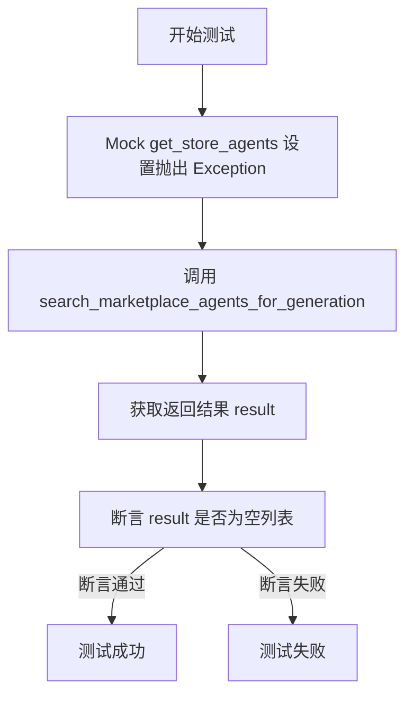

#### 带注释源码

```python
    @pytest.mark.asyncio
    async def test_handles_marketplace_error_gracefully(self):
        """Test that marketplace errors don't crash the function."""
        # 使用 patch 模拟 backend.api.features.store.db.get_store_agents 函数
        # 设置 new_callable 为 AsyncMock 以适应异步调用
        # 设置 side_effect 为 Exception("Marketplace unavailable") 模拟数据库调用时抛出异常
        with patch(
            "backend.api.features.store.db.get_store_agents",
            new_callable=AsyncMock,
            side_effect=Exception("Marketplace unavailable"),
        ):
            # 调用核心函数 search_marketplace_agents_for_generation
            # 预期该函数内部捕获了异常并返回空列表，而不是向上抛出异常
            result = await core.search_marketplace_agents_for_generation(
                search_query="test"
            )

        # 验证结果确实为空列表，确保系统在遇到市场不可用错误时依然能保持稳定
        # Should return empty list, not raise exception
        assert result == []
```


### `TestGetAllRelevantAgentsForGeneration.test_combines_library_and_marketplace_agents`

验证 `get_all_relevant_agents_for_generation` 函数能否成功合并来自用户库和市场的代理数据，并确保库中的代理在结果列表中排在市场代理之前。

参数：

- `self`：`TestGetAllRelevantAgentsForGeneration`，测试类的实例。

返回值：`None`，测试方法不返回任何值，仅执行断言逻辑。

#### 流程图

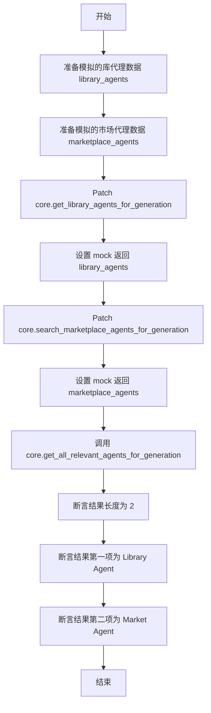

#### 带注释源码

```python
async def test_combines_library_and_marketplace_agents(self):
    """Test that agents from both sources are combined."""
    # 1. 准备模拟的库代理数据
    library_agents = [
        {
            "graph_id": "lib-123",
            "graph_version": 1,
            "name": "Library Agent",
            "description": "From library",
            "input_schema": {},
            "output_schema": {},
        }
    ]

    # 2. 准备模拟的市场代理数据
    marketplace_agents = [
        {
            "graph_id": "market-456",
            "graph_version": 1,
            "name": "Market Agent",
            "description": "From marketplace",
            "input_schema": {},
            "output_schema": {},
        }
    ]

    # 3. 模拟 get_library_agents_for_generation 函数
    with patch.object(
        core,
        "get_library_agents_for_generation",
        new_callable=AsyncMock,
        return_value=library_agents,
    ):
        # 4. 模拟 search_marketplace_agents_for_generation 函数
        with patch.object(
            core,
            "search_marketplace_agents_for_generation",
            new_callable=AsyncMock,
            return_value=marketplace_agents,
        ):
            # 5. 调用被测函数，启用 marketplace 包含
            result = await core.get_all_relevant_agents_for_generation(
                user_id="user-123",
                search_query="test query",
                include_marketplace=True,
            )

    # 6. 验证结果：库代理应该排在前面
    assert len(result) == 2
    assert result[0]["name"] == "Library Agent"
    assert result[1]["name"] == "Market Agent"
```


### `TestGetAllRelevantAgentsForGeneration.test_deduplicates_by_graph_id`

测试 `get_all_relevant_agents_for_generation` 函数的基于 `graph_id` 的去重逻辑。该测试验证当市场和库中都存在相同 `graph_id` 的代理时，合并结果中应只保留库中的代理，排除市场中的重复代理。

参数：

-   `self`：`TestGetAllRelevantAgentsForGeneration`，测试类的实例，用于访问测试上下文和断言方法。

返回值：`None`，该函数为测试方法，不返回具体值，主要通过断言验证逻辑正确性。

#### 流程图

```mermaid
graph TD
    A[开始测试 test_deduplicates_by_graph_id] --> B[定义模拟的库代理数据 library_agents<br/>包含 graph_id: shared-123]
    B --> C[定义模拟的市场代理数据 marketplace_agents<br/>包含 shared-123 (重复) 和 unique-456]
    C --> D[打桩 get_library_agents_for_generation<br/>返回 library_agents]
    D --> E[打桩 search_marketplace_agents_for_generation<br/>返回 marketplace_agents]
    E --> F[调用 get_all_relevant_agents_for_generation<br/>user_id=user-123, search_query=test]
    F --> G[获取合并后的结果 result]
    G --> H{断言: result 长度是否为 2?}
    H -- 是 --> I{断言: result 中是否同时包含<br/>Shared Agent 和 Unique Agent?}
    H -- 否 --> J[测试失败]
    I -- 是 --> K[测试通过: 去重逻辑生效]
    I -- 否 --> J[测试失败]
```

#### 带注释源码

```python
    @pytest.mark.asyncio
    async def test_deduplicates_by_graph_id(self):
        """Test that marketplace agents with same graph_id as library are excluded."""
        # 1. 准备模拟的库代理数据，包含一个 ID 为 "shared-123" 的代理
        library_agents = [
            {
                "graph_id": "shared-123",
                "graph_version": 1,
                "name": "Shared Agent",
                "description": "From library",
                "input_schema": {},
                "output_schema": {},
            }
        ]

        # 2. 准备模拟的市场代理数据，包含两个代理：
        #    一个 ID 为 "shared-123"（与库代理重复，应被去重），另一个 ID 为 "unique-456"（唯一，应保留）
        marketplace_agents = [
            {
                "graph_id": "shared-123",  # Same graph_id, should be deduplicated
                "graph_version": 1,
                "name": "Shared Agent",
                "description": "From marketplace",
                "input_schema": {},
                "output_schema": {},
            },
            {
                "graph_id": "unique-456",
                "graph_version": 1,
                "name": "Unique Agent",
                "description": "Only in marketplace",
                "input_schema": {},
                "output_schema": {},
            },
        ]

        # 3. 使用 patch.object 替换 core.get_library_agents_for_generation，使其返回准备好的 library_agents
        with patch.object(
            core,
            "get_library_agents_for_generation",
            new_callable=AsyncMock,
            return_value=library_agents,
        ):
            # 4. 使用 patch.object 替换 core.search_marketplace_agents_for_generation，使其返回准备好的 marketplace_agents
            with patch.object(
                core,
                "search_marketplace_agents_for_generation",
                new_callable=AsyncMock,
                return_value=marketplace_agents,
            ):
                # 5. 调用核心函数 get_all_relevant_agents_for_generation，传入搜索参数并启用市场搜索
                result = await core.get_all_relevant_agents_for_generation(
                    user_id="user-123",
                    search_query="test",
                    include_marketplace=True,
                )

        # 6. 验证结果逻辑：
        #    期望结果长度为 2（库中的 Shared Agent + 市场中的 Unique Agent）
        #    市场中的重复 Shared Agent 应已被 graph_id 去除
        assert len(result) == 2
        names = [a["name"] for a in result]
        assert "Shared Agent" in names
        assert "Unique Agent" in names
```


### `TestGetAllRelevantAgentsForGeneration.test_skips_marketplace_when_disabled`

该测试函数用于验证在调用 `get_all_relevant_agents_for_generation` 时，如果将参数 `include_marketplace` 设置为 `False`，系统将跳过对市场代理的搜索，仅返回从库中获取的代理。它通过模拟库代理数据并断言市场搜索函数未被调用来确保这一行为的正确性。

参数：

-   `self`：`TestGetAllRelevantAgentsForGeneration`，测试类的实例，用于访问测试上下文和断言方法。

返回值：`None`，该函数作为单元测试执行验证逻辑，不返回业务数据。

#### 流程图

```mermaid
graph TD
    A[Start test_skips_marketplace_when_disabled] --> B[Initialize mock library_agents data]
    B --> C[Patch core.get_library_agents_for_generation]
    C --> D[Patch core.search_marketplace_agents_for_generation]
    D --> E[Call core.get_all_relevant_agents_for_generation<br/>with include_marketplace=False]
    E --> F[Assert mock_marketplace.assert_not_called]
    F --> G[Assert len(result) == 1]
    G --> H[Test End]
```

#### 带注释源码

```python
    async def test_skips_marketplace_when_disabled(self):
        # 定义测试目的：验证当 include_marketplace=False 时，不搜索市场
        """Test that marketplace is not searched when include_marketplace=False."""
        
        # 准备模拟数据：创建一个包含库代理的列表
        library_agents = [
            {
                "graph_id": "lib-123",
                "graph_version": 1,
                "name": "Library Agent",
                "description": "From library",
                "input_schema": {},
                "output_schema": {},
            }
        ]

        # 使用 patch.object 替换 core.get_library_agents_for_generation
        # 设置 return_value 为 library_agents，模拟获取库代理成功
        with patch.object(
            core,
            "get_library_agents_for_generation",
            new_callable=AsyncMock,
            return_value=library_agents,
        ):
            # 替换 core.search_marketplace_agents_for_generation
            # 使用 new_callable=AsyncMock 创建异步模拟对象，并命名为 mock_marketplace 以便后续验证
            with patch.object(
                core,
                "search_marketplace_agents_for_generation",
                new_callable=AsyncMock,
            ) as mock_marketplace:
                # 调用待测函数 get_all_relevant_agents_for_generation
                # 传入 user_id, search_query，并将 include_marketplace 设置为 False
                result = await core.get_all_relevant_agents_for_generation(
                    user_id="user-123",
                    search_query="test",
                    include_marketplace=False,
                )

        # 验证核心逻辑：断言市场搜索的模拟函数从未被调用
        mock_marketplace.assert_not_called()
        
        # 验证结果：断言返回结果仅包含库代理，长度为 1
        assert len(result) == 1
```


### `TestGetAllRelevantAgentsForGeneration.test_skips_marketplace_when_no_search_query`

该测试方法验证了当 `search_query` 参数为 `None`（无搜索查询）时，即使 `include_marketplace` 标志设置为 `True`，系统也不会调用 marketplace 搜索功能。它确保在没有搜索关键词的情况下，仅返回库代理，从而避免不必要的 marketplace 调用。

参数：

- `self`：`TestGetAllRelevantAgentsForGeneration`，测试类的实例，用于访问测试上下文和断言方法。

返回值：`None`，该方法是一个测试用例，通过断言来验证逻辑正确性，不直接返回业务数据。

#### 流程图

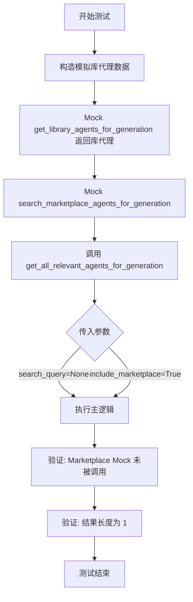

#### 带注释源码

```python
    @pytest.mark.asyncio
    async def test_skips_marketplace_when_no_search_query(self):
        """Test that marketplace is not searched without a search query."""
        # 准备模拟的库代理数据
        library_agents = [
            {
                "graph_id": "lib-123",
                "graph_version": 1,
                "name": "Library Agent",
                "description": "From library",
                "input_schema": {},
                "output_schema": {},
            }
        ]

        # 使用 patch.object 替换 core.get_library_agents_for_generation
        # 使其返回我们预定义的 library_agents，避免真实数据库调用
        with patch.object(
            core,
            "get_library_agents_for_generation",
            new_callable=AsyncMock,
            return_value=library_agents,
        ):
            # 替换 core.search_marketplace_agents_for_generation
            # 用于断言该方法是否被调用
            with patch.object(
                core,
                "search_marketplace_agents_for_generation",
                new_callable=AsyncMock,
            ) as mock_marketplace:
                # 调用主函数 get_all_relevant_agents_for_generation
                # 关键点：search_query 设为 None，但 include_marketplace 设为 True
                result = await core.get_all_relevant_agents_for_generation(
                    user_id="user-123",
                    search_query=None,  # No search query
                    include_marketplace=True,
                )

        # 断言：由于没有搜索查询，Marketplace 搜索函数应该从未被调用
        mock_marketplace.assert_not_called()
        
        # 断言：结果仅包含库代理，数量为 1
        assert len(result) == 1
```


### `TestExtractSearchTermsFromSteps.test_extracts_terms_from_instructions_type`

该方法用于验证 `core.extract_search_terms_from_steps` 函数能否正确从类型为 "instructions" 的分解结果中提取搜索词，包括步骤描述、块名称和动作名称。

参数：

- `self`：`TestExtractSearchTermsFromSteps`，测试类的实例。

返回值：`None`，该方法为单元测试，通过断言验证逻辑，不直接返回值。

#### 流程图

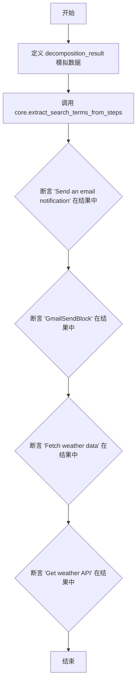

#### 带注释源码

```python
def test_extracts_terms_from_instructions_type(self):
    """Test extraction from valid instructions decomposition result."""
    # 定义模拟的分解结果数据，包含类型 "instructions" 和两个步骤
    # 步骤中包含 description, block_name 和 action 字段
    decomposition_result = {
        "type": "instructions",
        "steps": [
            {
                "description": "Send an email notification",
                "block_name": "GmailSendBlock",
            },
            {"description": "Fetch weather data", "action": "Get weather API"},
        ],
    }

    # 调用核心函数提取搜索词
    result = core.extract_search_terms_from_steps(decomposition_result)

    # 验证描述字段中的文本被提取
    assert "Send an email notification" in result
    # 验证块名称字段中的文本被提取
    assert "GmailSendBlock" in result
    # 验证第二个步骤的描述被提取
    assert "Fetch weather data" in result
    # 验证动作字段中的文本被提取
    assert "Get weather API" in result
```


### `TestExtractSearchTermsFromSteps.test_returns_empty_for_non_instructions_type`

该测试方法用于验证当输入的 `decomposition_result` 类型非 "instructions" 时，`extract_search_terms_from_steps` 函数是否正确返回一个空列表，确保函数对非预期类型的输入具有鲁棒性。

参数：

- `self`：`TestExtractSearchTermsFromSteps`，测试类的实例，由 pytest 框架提供。

返回值：`None`，该方法不返回值，主要通过断言验证行为。

#### 流程图

```mermaid
graph TD
    A[开始测试] --> B[构造 decomposition_result<br/>type = 'clarifying_questions']
    B --> C[调用 core.extract_search_terms_from_steps]
    C --> D[获取返回结果 result]
    D --> E{断言 result == []}
    E -- 成功 --> F[测试通过]
    E -- 失败 --> G[测试失败]
```

#### 带注释源码

```python
def test_returns_empty_for_non_instructions_type(self):
    """Test that non-instructions types return empty list."""
    # 准备测试数据：模拟一个非 'instructions' 类型的解构结果
    # 这里使用 'clarifying_questions' 类型作为对比案例
    decomposition_result = {
        "type": "clarifying_questions",
        "questions": [{"question": "What email?"}],
    }

    # 调用核心函数 extract_search_terms_from_steps
    result = core.extract_search_terms_from_steps(decomposition_result)

    # 断言验证：对于非指令类型的输入，函数应当返回一个空列表
    assert result == []
```


### `TestExtractSearchTermsFromSteps.test_deduplicates_terms_case_insensitively`

该测试方法用于验证从步骤中提取搜索词的功能，确保对于大小写不同但本质相同的重复词汇能够正确去重。

参数：

-   `self`：`TestExtractSearchTermsFromSteps`，测试类的实例引用。

返回值：`None`，该函数为单元测试，无返回值，主要通过断言验证逻辑正确性。

#### 流程图

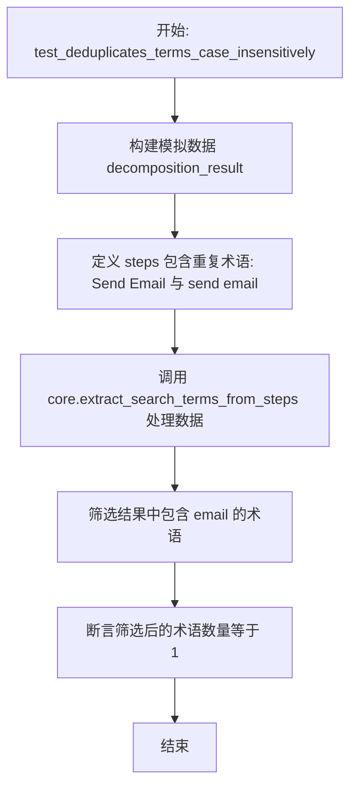

#### 带注释源码

```python
def test_deduplicates_terms_case_insensitively(self):
    """Test that duplicate terms are removed (case-insensitive)."""
    # 准备测试输入数据：构建一个包含步骤的分解结果字典
    # 其中包含两个看起来不同但大小写不一致的重复项
    decomposition_result = {
        "type": "instructions",
        "steps": [
            {"description": "Send Email", "name": "send email"}, # 预期这两者会被视为重复
            {"description": "Other task"},
        ],
    }

    # 调用被测函数，传入构造好的分解结果
    result = core.extract_search_terms_from_steps(decomposition_result)

    # 验证结果：从返回的结果列表中筛选出包含 "email" 字符串的项（忽略大小写）
    # 预期应该只保留一项，证明去重逻辑有效
    email_terms = [t for t in result if "email" in t.lower()]
    assert len(email_terms) == 1
```


### `TestExtractSearchTermsFromSteps.test_filters_short_terms`

该方法是 `TestExtractSearchTermsFromSteps` 测试类中的一个单元测试，用于验证 `core.extract_search_terms_from_steps` 函数能够正确过滤掉长度为3个字符或更短的搜索词。

参数：

-  `self`：`TestExtractSearchTermsFromSteps`，测试类的实例引用，用于访问测试上下文。

返回值：`None`，该测试方法没有显式的返回值，主要通过断言来验证逻辑的正确性。

#### 流程图

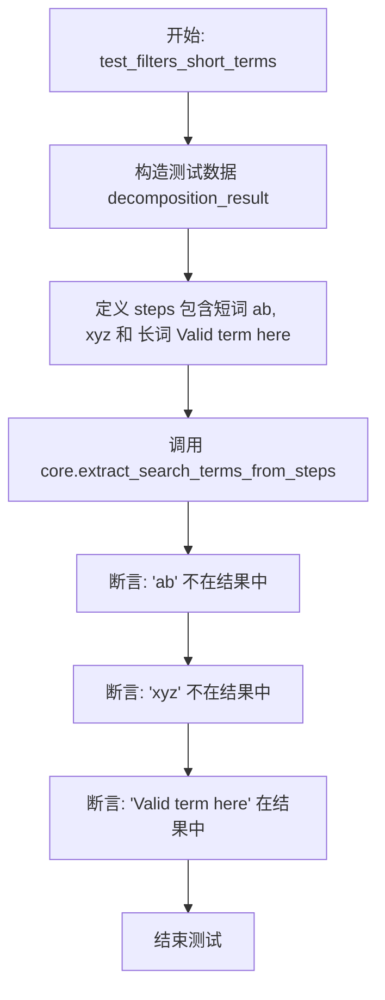

#### 带注释源码

```python
    def test_filters_short_terms(self):
        """Test that terms with 3 or fewer characters are filtered out."""
        # 构造模拟的分解结果数据，类型为 "instructions"
        # steps 中包含两个短词条（"ab", "xyz"）和一个符合长度要求的词条
        decomposition_result = {
            "type": "instructions",
            "steps": [
                {"description": "ab", "action": "xyz"},  # 长度 <= 3，预期被过滤
                {"description": "Valid term here"},
            ],
        }

        # 调用核心函数提取搜索词
        result = core.extract_search_terms_from_steps(decomposition_result)

        # 验证短词 "ab" 已被过滤，不存在于结果中
        assert "ab" not in result
        # 验证短词 "xyz" 已被过滤，不存在于结果中
        assert "xyz" not in result
        # 验证长词 "Valid term here" 被正确保留
        assert "Valid term here" in result
```


### `TestExtractSearchTermsFromSteps.test_handles_empty_steps`

该方法用于验证当输入的分解结果（decomposition result）中包含空步骤列表时，`core.extract_search_terms_from_steps` 函数能否正确返回空列表。

参数：

- `self`：`TestExtractSearchTermsFromSteps`，测试类的实例。

返回值：`None`，无返回值，该函数主要用于断言验证。

#### 流程图

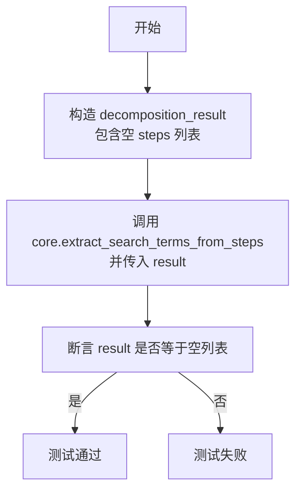

#### 带注释源码

```python
def test_handles_empty_steps(self):
    """Test handling of empty steps list."""
    # 准备测试数据：设定类型为 "instructions"，但 steps 列表为空
    decomposition_result = {
        "type": "instructions",
        "steps": [],
    }

    # 调用被测函数，传入包含空步骤的字典
    result = core.extract_search_terms_from_steps(decomposition_result)

    # 断言返回的结果应该是一个空列表
    assert result == []
```


### `TestEnrichLibraryAgentsFromSteps.test_enriches_with_additional_agents`

测试 `enrich_library_agents_from_steps` 函数是否能够根据分解步骤中的信息找到额外的代理，并将它们与现有的代理合并。

参数：

-  `self`：`TestEnrichLibraryAgentsFromSteps`，测试类的实例，用于访问测试上下文。

返回值：`None`，该方法是测试函数，主要用于验证逻辑，不返回具体数值。

#### 流程图

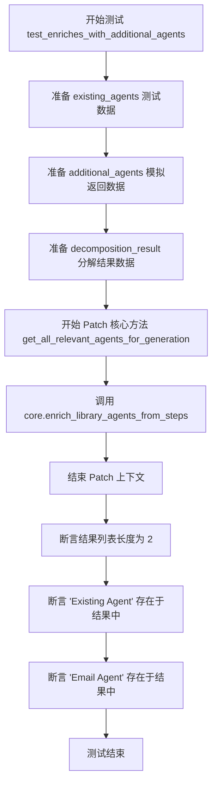

#### 带注释源码

```python
    @pytest.mark.asyncio
    async def test_enriches_with_additional_agents(self):
        """Test that additional agents are found based on steps."""
        # 1. 准备现有的代理列表数据
        existing_agents = [
            {
                "graph_id": "existing-123",
                "graph_version": 1,
                "name": "Existing Agent",
                "description": "Already fetched",
                "input_schema": {},
                "output_schema": {},
            }
        ]

        # 2. 准备通过 Mock 返回的额外代理数据
        additional_agents = [
            {
                "graph_id": "new-456",
                "graph_version": 1,
                "name": "Email Agent",
                "description": "For sending emails",
                "input_schema": {},
                "output_schema": {},
            }
        ]

        # 3. 准备分解结果，包含指令步骤
        decomposition_result = {
            "type": "instructions",
            "steps": [
                {"description": "Send email notification"},
            ],
        }

        # 4. 使用 patch 对象模拟 get_all_relevant_agents_for_generation 方法
        #    使其返回上面定义的 additional_agents
        with patch.object(
            core,
            "get_all_relevant_agents_for_generation",
            new_callable=AsyncMock,
            return_value=additional_agents,
        ):
            # 5. 调用被测试的核心函数 enrich_library_agents_from_steps
            result = await core.enrich_library_agents_from_steps(
                user_id="user-123",
                decomposition_result=decomposition_result,
                existing_agents=existing_agents,
            )

        # 6. 验证结果：应包含现有代理和新找到的代理
        assert len(result) == 2
        names = [a["name"] for a in result]
        assert "Existing Agent" in names
        assert "Email Agent" in names
```


### `TestEnrichLibraryAgentsFromSteps.test_deduplicates_by_graph_id`

该测试验证 `enrich_library_agents_from_steps` 函数在合并现有代理和新增代理时的去重逻辑。具体测试场景为：当通过步骤检索到的新增代理与现有代理列表中的某个代理具有相同的 `graph_id` 时，确保最终结果列表中不包含重复的代理项。

参数：

-  `self`：`TestEnrichLibraryAgentsFromSteps`，Pytest 测试类的实例，用于访问测试上下文和断言方法。

返回值：`None`，该函数为单元测试方法，无显式返回值，主要通过断言验证逻辑。

#### 流程图

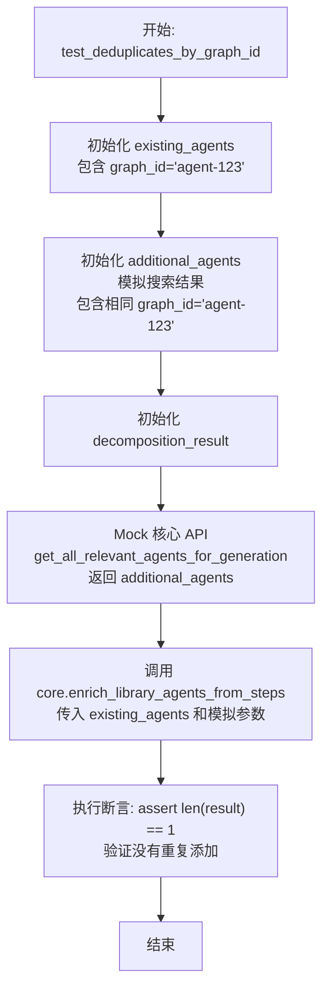

#### 带注释源码

```python
    @pytest.mark.asyncio
    async def test_deduplicates_by_graph_id(self):
        """Test that agents with same graph_id are not duplicated."""
        # 1. 准备已存在的代理列表，包含 graph_id 为 "agent-123" 的代理
        existing_agents = [
            {
                "graph_id": "agent-123",
                "graph_version": 1,
                "name": "Existing Agent",
                "description": "Already fetched",
                "input_schema": {},
                "output_schema": {},
            }
        ]

        # 2. 模拟搜索返回的额外代理列表，包含具有相同 graph_id 的代理
        additional_agents = [
            {
                "graph_id": "agent-123",  # Same ID
                "graph_version": 1,
                "name": "Existing Agent Copy",
                "description": "Same agent different name",
                "input_schema": {},
                "output_schema": {},
            }
        ]

        # 3. 构造分解结果数据
        decomposition_result = {
            "type": "instructions",
            "steps": [{"description": "Some action"}],
        }

        # 4. 使用 patch 对象模拟 core.get_all_relevant_agents_for_generation 方法
        # 使其在被调用时返回上面定义的 additional_agents
        with patch.object(
            core,
            "get_all_relevant_agents_for_generation",
            new_callable=AsyncMock,
            return_value=additional_agents,
        ):
            # 5. 调用被测试的 enrich_library_agents_from_steps 函数
            result = await core.enrich_library_agents_from_steps(
                user_id="user-123",
                decomposition_result=decomposition_result,
                existing_agents=existing_agents,
            )

        # 6. 验证结果：确保最终列表中只保留了一个代理，验证去重逻辑生效
        assert len(result) == 1
```


### `TestEnrichLibraryAgentsFromSteps.test_deduplicates_by_name`

验证 `enrich_library_agents_from_steps` 函数在合并代理时，能够依据代理名称进行去重。当发现的新代理与已存在的代理名称相同（即使 graph_id 不同）时，系统应保留原有代理，排除重复名称的代理，确保最终列表中每个名称的唯一性。

参数：

- `self`: `TestEnrichLibraryAgentsFromSteps`，测试类实例，用于访问测试上下文和断言方法。

返回值：`None`，无返回值，主要通过断言验证逻辑正确性。

#### 流程图

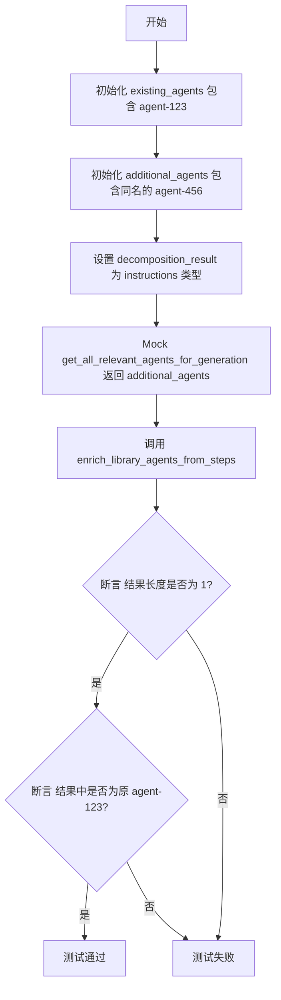

#### 带注释源码

```python
@pytest.mark.asyncio
async def test_deduplicates_by_name(self):
    """Test that agents with same name are not duplicated."""
    # 1. 准备已存在的代理列表，包含一个名为 "Email Agent" 的代理
    existing_agents = [
        {
            "graph_id": "agent-123",
            "graph_version": 1,
            "name": "Email Agent",
            "description": "Already fetched",
            "input_schema": {},
            "output_schema": {},
        }
    ]

    # 2. 准备模拟的“新增”代理列表，包含一个同名的代理 ("Email Agent") 但 graph_id 不同
    additional_agents = [
        {
            "graph_id": "agent-456",  # 不同的 ID
            "graph_version": 1,
            "name": "Email Agent",  # 相同的名称
            "description": "Different agent same name",
            "input_schema": {},
            "output_schema": {},
        }
    ]

    # 3. 准备分解结果，指示需要搜索代理
    decomposition_result = {
        "type": "instructions",
        "steps": [{"description": "Send email"}],
    }

    # 4. 使用 patch 模拟核心搜索函数，使其返回上述同名的 additional_agents
    with patch.object(
        core,
        "get_all_relevant_agents_for_generation",
        new_callable=AsyncMock,
        return_value=additional_agents,
    ):
        # 5. 调用被测函数 enrich_library_agents_from_steps
        result = await core.enrich_library_agents_from_steps(
            user_id="user-123",
            decomposition_result=decomposition_result,
            existing_agents=existing_agents,
        )

    # 6. 断言：结果中不应包含重复项，长度应为 1
    assert len(result) == 1
    # 7. 断言：保留的应该是原有的代理 (agent-123)，而不是新增的同名代理
    assert result[0].get("graph_id") == "agent-123"  # Original kept
```


### `TestEnrichLibraryAgentsFromSteps.test_returns_existing_when_no_steps`

该测试方法验证了当输入的分解结果（decomposition_result）不是“instructions”类型（即无法从中提取搜索步骤或关键词）时，`enrich_library_agents_from_steps` 函数的行为是否符合预期，即直接返回传入的现有代理列表，而不进行额外的搜索或添加新代理。

参数：

- `self`：`TestEnrichLibraryAgentsFromSteps`，测试类的实例引用。

返回值：`None`，该方法为单元测试函数，无返回值，通过断言验证逻辑正确性。

#### 流程图

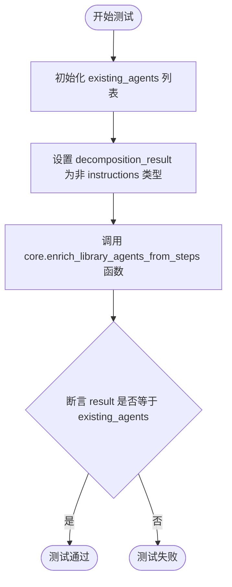

#### 带注释源码

```python
    async def test_returns_existing_when_no_steps(self):
        """Test that existing agents are returned when no search terms extracted."""
        # 1. 准备现有的代理列表作为输入数据
        existing_agents = [
            {
                "graph_id": "existing-123",
                "graph_version": 1,
                "name": "Existing Agent",
                "description": "Already fetched",
                "input_schema": {},
                "output_schema": {},
            }
        ]

        # 2. 准备分解结果对象，类型为 "clarifying_questions"（非 "instructions"）
        # 这意味着系统无法从中提取用于搜索新代理的步骤或关键词
        decomposition_result = {
            "type": "clarifying_questions",  # Not instructions type
            "questions": [],
        }

        # 3. 调用被测试的核心函数
        result = await core.enrich_library_agents_from_steps(
            user_id="user-123",
            decomposition_result=decomposition_result,
            existing_agents=existing_agents,
        )

        # 4. 断言：验证返回结果与输入的 existing_agents 完全一致
        # Should return existing unchanged
        assert result == existing_agents
```


### `TestEnrichLibraryAgentsFromSteps.test_limits_search_terms_to_three`

该测试方法用于验证 `enrich_library_agents_from_steps` 函数在处理步骤分解结果时，仅使用提取出的搜索词的前三个来获取相关代理，以确保系统资源的合理使用和性能的优化。

参数：

- `self`：`TestEnrichLibraryAgentsFromSteps`，测试类实例，用于访问测试上下文和断言方法。

返回值：`None`，该方法为测试函数，通过断言验证逻辑，不直接返回业务数据。

#### 流程图

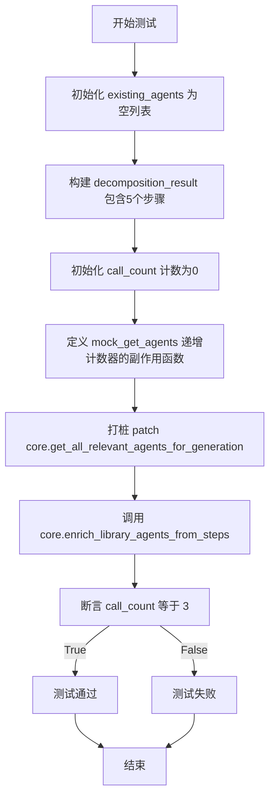

#### 带注释源码

```python
    @pytest.mark.asyncio
    async def test_limits_search_terms_to_three(self):
        """Test that only first 3 search terms are used."""
        # 准备现有的代理列表，设为空以排除干扰
        existing_agents = []

        # 构造一个包含5个步骤的分解结果对象
        # 预期从这5个步骤中提取出5个搜索词
        decomposition_result = {
            "type": "instructions",
            "steps": [
                {"description": "First action"},
                {"description": "Second action"},
                {"description": "Third action"},
                {"description": "Fourth action"},
                {"description": "Fifth action"},
            ],
        }

        # 初始化计数器，用于记录后续函数被调用的次数
        call_count = 0

        # 定义一个模拟异步函数，每次被调用时计数器加1，并返回空列表
        async def mock_get_agents(*args, **kwargs):
            nonlocal call_count
            call_count += 1
            return []

        # 使用 patch.object 替换 core.get_all_relevant_agents_for_generation
        # 设置 side_effect 为上面定义的 mock_get_agents，以便监控调用次数
        with patch.object(
            core,
            "get_all_relevant_agents_for_generation",
            side_effect=mock_get_agents,
        ):
            # 调用被测试的核心函数
            await core.enrich_library_agents_from_steps(
                user_id="user-123",
                decomposition_result=decomposition_result,
                existing_agents=existing_agents,
            )

        # 验证调用次数是否为3，确认逻辑只处理了前3个搜索词
        assert call_count == 3
```


### `TestExtractUuidsFromText.test_extracts_single_uuid`

该方法是一个单元测试，用于验证 `extract_uuids_from_text` 核心函数能否从包含单个 UUID 的文本字符串中正确提取出该 UUID。它初始化一个包含标准 UUID 格式的测试字符串，调用提取函数，并通过断言确保返回列表中仅包含一个元素且该元素与预期的 UUID 字符串匹配。

参数：

-   `self`：`TestExtractUuidsFromText`，单元测试类的实例，用于访问测试上下文和断言方法。

返回值：`None`，测试方法通常不返回值，成功时不抛出异常即表示通过。

#### 流程图

```mermaid
graph TD
    Start(开始) --> DefineText[定义包含UUID的测试文本 text]
    DefineText --> CallFunc[调用 core.extract_uuids_from_texttext]
    CallFunc --> SaveResult[将结果保存至 result]
    SaveResult --> AssertLen1{断言 lenresult == 1}
    AssertLen1 -- 失败 --> RaiseError1[抛出断言异常]
    AssertLen1 -- 成功 --> AssertContains{断言 UUID字符串 in result}
    AssertContains -- 失败 --> RaiseError2[抛出断言异常]
    AssertContains -- 成功 --> End(结束)
```

#### 带注释源码

```python
def test_extracts_single_uuid(self):
    """Test extraction of a single UUID from text."""
    # 定义包含 UUID 的测试文本
    text = "Use my agent 46631191-e8a8-486f-ad90-84f89738321d for this task"
    
    # 调用核心函数提取 UUID
    result = core.extract_uuids_from_text(text)
    
    # 断言结果列表中只有 1 个 UUID
    assert len(result) == 1
    
    # 断言提取出的 UUID 确实是预期的那个字符串
    assert "46631191-e8a8-486f-ad90-84f89738321d" in result
```


### `TestExtractUuidsFromText.test_extracts_multiple_uuids`

验证 `extract_uuids_from_text` 函数是否能够正确地从单个文本字符串中提取多个不同的 UUID。

参数：

- `self`：`TestExtractUuidsFromText`，测试类的实例。

返回值：`None`，不返回任何值。

#### 流程图

```mermaid
graph TD
    A[开始] --> B[定义包含两个UUID的文本字符串]
    B --> C[调用 core.extract_uuids_from_text 方法]
    C --> D{断言: 结果长度是否为2}
    D -- 否 --> E[测试失败]
    D -- 是 --> F{断言: 第一个UUID是否在结果中}
    F -- 否 --> E
    F -- 是 --> G{断言: 第二个UUID是否在结果中}
    G -- 否 --> E
    G -- 是 --> H[测试通过]
```

#### 带注释源码

```python
def test_extracts_multiple_uuids(self):
    """Test extraction of multiple UUIDs from text."""
    # 准备包含两个不同 UUID 的测试文本
    text = (
        "Combine agents 11111111-1111-4111-8111-111111111111 "
        "and 22222222-2222-4222-9222-222222222222"
    )
    # 调用核心函数提取 UUID
    result = core.extract_uuids_from_text(text)
    # 验证结果列表中正好包含两个 UUID
    assert len(result) == 2
    # 验证第一个 UUID 存在于结果列表中
    assert "11111111-1111-4111-8111-111111111111" in result
    # 验证第二个 UUID 存在于结果列表中
    assert "22222222-2222-4222-9222-222222222222" in result
```


### `TestExtractUuidsFromText.test_deduplicates_uuids`

该测试方法用于验证 `core.extract_uuids_from_text` 函数的去重逻辑。它通过构建一个包含重复 UUID 字符串的测试用例，调用目标函数并断言返回结果的数量，以确保系统能够正确识别并移除文本中的重复 UUID，仅保留唯一的标识符。

参数：

-   `self`：`TestExtractUuidsFromText`，测试类的实例，提供测试上下文和断言方法。

返回值：`None`，该函数为测试方法，不返回具体数值，通过断言验证逻辑正确性。

#### 流程图

```mermaid
flowchart TD
    Start([开始测试]) --> Init[定义包含重复UUID的文本变量 text]
    Init --> Call[调用 core.extract_uuids_from_text text]
    Call --> Assert[执行断言: 验证 result 列表长度等于 1]
    Assert --> Check{断言是否通过?}
    Check -- 是 --> Pass([测试通过: 去重逻辑生效])
    Check -- 否 --> Fail([测试失败: 去重逻辑异常])
    Pass --> End([结束])
    Fail --> End
```

#### 带注释源码

```python
    def test_deduplicates_uuids(self):
        """Test that duplicate UUIDs are deduplicated."""
        # 定义测试输入文本，故意包含两个完全相同的 UUID
        text = (
            "Use 46631191-e8a8-486f-ad90-84f89738321d twice: "
            "46631191-e8a8-486f-ad90-84f89738321d"
        )
        # 调用核心功能函数从文本中提取 UUID
        result = core.extract_uuids_from_text(text)
        # 断言提取结果的长度为 1，确认重复项已被正确过滤
        assert len(result) == 1
```


### `TestExtractUuidsFromText.test_normalizes_to_lowercase`

该测试方法用于验证 `core.extract_uuids_from_text` 函数在处理文本时，能够正确识别其中的 UUID 并将其转换为小写格式，确保 UUID 的标准化输出。

参数：

-   `self`：`TestExtractUuidsFromText`，测试类的实例，用于访问测试上下文和断言方法。

返回值：`None`，无返回值，该方法通过断言来验证被测函数的行为是否符合预期。

#### 流程图

```mermaid
graph TD
    A[开始测试] --> B[定义包含大写UUID的输入文本]
    B --> C[调用 core.extract_uuids_from_text 进行提取]
    C --> D[断言结果列表中第一个UUID是否为小写]
    D --> E[测试结束]
```

#### 带注释源码

```python
def test_normalizes_to_lowercase(self):
    """Test that UUIDs are normalized to lowercase."""
    # 定义输入文本变量，其中包含一个全大写的 UUID 字符串
    text = "Use 46631191-E8A8-486F-AD90-84F89738321D"
    
    # 调用核心函数 extract_uuids_from_text，从文本中提取 UUID
    # 预期该函数会处理大小写并返回标准化的 UUID 列表
    result = core.extract_uuids_from_text(text)
    
    # 断言：验证提取结果列表的第一个元素是否为对应的小写 UUID
    # 这确保了无论输入文本中的 UUID 是大写还是混合大小写，输出均被规范化为小写
    assert result[0] == "46631191-e8a8-486f-ad90-84f89738321d"
```


### `TestExtractUuidsFromText.test_returns_empty_for_no_uuids`

验证当输入文本中不包含任何 UUID 格式的字符串时，`extract_uuids_from_text` 函数能正确返回空列表。

参数：

-   `self`：`TestExtractUuidsFromText`，测试类的实例。

返回值：`None`，无显式返回值（测试方法通过断言验证行为）。

#### 流程图

```mermaid
graph TD
    Start([开始]) --> DefineText[定义不含 UUID 的测试文本]
    DefineText --> CallFunc[调用 core.extract_uuids_from_text]
    CallFunc --> AssertResult[断言返回结果为空列表]
    AssertResult --> End([结束])
```

#### 带注释源码

```python
def test_returns_empty_for_no_uuids(self):
    """Test that empty list is returned when no UUIDs found."""
    # 定义测试文本，其中不包含任何 UUID 字符串
    text = "Create an email agent that sends notifications"
    # 调用待测试函数 extract_uuids_from_text 处理文本
    result = core.extract_uuids_from_text(text)
    # 验证返回结果确实为空列表，表明未提取到 UUID
    assert result == []
```


### `TestExtractUuidsFromText.test_ignores_invalid_uuids`

该测试方法用于验证 `extract_uuids_from_text` 函数能够正确处理并忽略无效的类 UUID 字符串，确保提取逻辑严格遵循 UUID v4 的格式要求（特别是版本位和变体位的校验），从而避免误识别不符合规范的字符串。

参数：

- `self`：`TestExtractUuidsFromText`，测试类实例，用于访问测试上下文和断言方法。

返回值：`None`，该测试方法无返回值，通过断言验证结果是否符合预期。

#### 流程图

```mermaid
graph TD
    A[开始测试] --> B[定义包含无效 UUID 的文本字符串]
    B --> C[调用 core.extract_uuids_from_text 函数]
    C --> D[断言结果列表长度是否为 0]
    D -->|是| E[测试通过]
    D -->|否| F[测试失败]
```

#### 带注释源码

```python
def test_ignores_invalid_uuids(self):
    """Test that invalid UUID-like strings are ignored."""
    # 定义输入文本，其中包含一个格式类似但无效的 UUID
    # 该字符串在第三组和第四组不符合 UUID v4 的标准（第三组应以4开头，第四组应以8/9/a/b开头）
    text = "Not a valid UUID: 12345678-1234-1234-1234-123456789abc"
    
    # 调用被测函数提取文本中的 UUID
    result = core.extract_uuids_from_text(text)
    
    # 验证提取结果列表长度是否为 0，确认无效 UUID 被正确过滤
    # UUID v4 要求特定位置的模式（第三组第1位是4，第四组第1位是8/9/a/b）
    assert len(result) == 0
```


### `TestGetLibraryAgentById.test_returns_agent_when_found_by_graph_id`

测试函数 `get_library_agent_by_id` 在通过 `graph_id` 找到代理时的返回行为。该测试验证了当数据库中存在对应 `graph_id` 的代理时，函数能够正确地检索并返回该代理的详细信息。

参数：

-  `self`：`TestGetLibraryAgentById`，测试类的实例，用于访问测试上下文和断言方法。

返回值：`None`，该函数为测试方法，不返回实际值，主要通过断言来验证逻辑正确性。

#### 流程图

```mermaid
graph TD
    A[开始测试] --> B[创建模拟代理对象 mock_agent]
    B --> C[设置 mock_agent 属性]
    C --> D[打补丁 patch core.library_db.get_library_agent_by_graph_id]
    D --> E[调用 core.get_library_agent_by_id]
    E --> F[断言 result 不为空]
    F --> G[断言 result graph_id 等于 agent-123]
    G --> H[断言 result name 等于 Test Agent]
    H --> I[测试通过]
```

#### 带注释源码

```python
    @pytest.mark.asyncio
    async def test_returns_agent_when_found_by_graph_id(self):
        """Test that agent is returned when found by graph_id."""
        # 步骤 1: 创建并配置一个模拟的代理对象
        mock_agent = MagicMock()
        mock_agent.graph_id = "agent-123"
        mock_agent.graph_version = 1
        mock_agent.name = "Test Agent"
        mock_agent.description = "Test description"
        mock_agent.input_schema = {"properties": {}}
        mock_agent.output_schema = {"properties": {}}

        # 步骤 2: 使用 patch 对象模拟数据库查询方法，使其返回上面创建的 mock_agent
        with patch.object(
            core.library_db,
            "get_library_agent_by_graph_id",
            new_callable=AsyncMock,
            return_value=mock_agent,
        ):
            # 步骤 3: 调用核心函数 get_library_agent_by_id
            result = await core.get_library_agent_by_id("user-123", "agent-123")

        # 步骤 4: 验证返回结果是否符合预期
        assert result is not None
        assert result["graph_id"] == "agent-123"
        assert result["name"] == "Test Agent"
```


### `TestGetLibraryAgentById.test_falls_back_to_library_agent_id`

验证当通过 `graph_id` 无法找到代理时，`get_library_agent_by_id` 函数能够正确回退到使用库代理 ID（library agent ID）进行查找，并返回正确的代理信息。

参数：

-   `self`：`TestGetLibraryAgentById`，测试类的实例，用于访问测试上下文和断言方法。

返回值：`None`，该函数为测试方法，不直接返回业务数据，仅执行断言逻辑。

#### 流程图

```mermaid
graph TD
    A[开始测试] --> B[创建模拟代理 mock_agent]
    B --> C[设置 mock_agent 的属性 graph_id, name 等]
    C --> D[Mock core.library_db.get_library_agent_by_graph_id 返回 None]
    D --> E[Mock core.library_db.get_library_agent 返回 mock_agent]
    E --> F[调用 core.get_library_agent_by_id user_id, library-id-123]
    F --> G[获取返回结果 result]
    G --> H[断言 result 不为 None]
    H --> I[断言 result graph_id 为 graph-456]
    I --> J[断言 result name 为 Library Agent]
    J --> K[测试结束]
```

#### 带注释源码

```python
@pytest.mark.asyncio
async def test_falls_back_to_library_agent_id(self):
    """Test that lookup falls back to library agent ID when graph_id not found."""
    # 1. 准备模拟数据对象
    mock_agent = MagicMock()
    # 设置模拟对象的 graph_id，注意这里与后续查找使用的 ID 不同，模拟通过 library ID 查找到真实 graph_id 的情况
    mock_agent.graph_id = "graph-456"  
    mock_agent.graph_version = 1
    mock_agent.name = "Library Agent"
    mock_agent.description = "Found by library ID"
    mock_agent.input_schema = {"properties": {}}
    mock_agent.output_schema = {"properties": {}}

    # 2. 使用补丁模拟数据库操作
    with (
        # 模拟通过 graph_id 查找代理时返回 None（未找到）
        patch.object(
            core.library_db,
            "get_library_agent_by_graph_id",
            new_callable=AsyncMock,
            return_value=None,  # Not found by graph_id
        ),
        # 模拟通过库代理 ID (get_library_agent) 查找代理时成功返回 mock_agent
        patch.object(
            core.library_db,
            "get_library_agent",
            new_callable=AsyncMock,
            return_value=mock_agent,  # Found by library ID
        ),
    ):
        # 3. 调用核心函数 get_library_agent_by_id
        # 传入 user_id 和 "library-id-123"
        # 预期行为：首先尝试用 graph_id 查找（失败），然后回退用 library ID 查找（成功）
        result = await core.get_library_agent_by_id("user-123", "library-id-123")

    # 4. 验证结果
    # 断言结果不为空
    assert result is not None
    # 断言返回的 graph_id 是模拟对象中的 ID ("graph-456")
    assert result["graph_id"] == "graph-456"
    # 断言返回的名称匹配
    assert result["name"] == "Library Agent"
```


### `TestGetLibraryAgentById.test_returns_none_when_not_found_by_either_method`

测试当通过 `graph_id` 和 library agent `id` 两种方式均无法在数据库中找到代理时，`get_library_agent_by_id` 函数是否能够正确处理并返回 `None`。这验证了查找逻辑的完整性和错误处理的健壮性。

参数：

-  `self`：`TestGetLibraryAgentById`，测试类实例，用于访问测试上下文和断言方法。

返回值：`None`，异步测试方法无返回值，主要通过断言验证行为。

#### 流程图

```mermaid
graph TD
    A[开始测试] --> B[模拟 core.library_db.get_library_agent_by_graph_id<br/>返回 None]
    B --> C[模拟 core.library_db.get_library_agent<br/>抛出 NotFoundError]
    C --> D[调用 core.get_library_agent_by_id<br/>参数: user-123, nonexistent]
    D --> E[获取返回结果 result]
    E --> F{断言 result 是否为 None}
    F -- 是 --> G[测试通过]
    F -- 否 --> H[测试失败]
```

#### 带注释源码

```python
@pytest.mark.asyncio
async def test_returns_none_when_not_found_by_either_method(self):
    """Test that None is returned when agent not found by either method."""
    with (
        # 模拟数据库通过 graph_id 查找代理的行为
        # 设置返回值为 None，模拟未找到记录的情况
        patch.object(
            core.library_db,
            "get_library_agent_by_graph_id",
            new_callable=AsyncMock,
            return_value=None,
        ),
        # 模拟数据库通过 library agent id 查找代理的行为
        # 设置副作用为抛出 NotFoundError，模拟未找到记录的情况
        patch.object(
            core.library_db,
            "get_library_agent",
            new_callable=AsyncMock,
            side_effect=core.NotFoundError("Not found"),
        ),
    ):
        # 调用核心函数 get_library_agent_by_id
        # 传入用户ID "user-123" 和一个不存在的ID "nonexistent"
        result = await core.get_library_agent_by_id("user-123", "nonexistent")

    # 验证函数返回值是否为 None
    # 确保在两种查找方式都失败时，函数优雅地返回 None 而不是抛出异常
    assert result is None
```


### `TestGetLibraryAgentById.test_returns_none_on_exception`

验证当 `core.get_library_agent_by_id` 在两种查找方式（通过 graph_id 和 library agent ID）中都抛出异常时，该函数能够优雅地处理错误并返回 None，而不是将异常向上抛出。

参数：

-  `self`：`TestGetLibraryAgentById`，测试类实例，用于访问测试上下文和断言方法。

返回值：`None`，该测试方法没有显式返回值，主要执行断言逻辑。

#### 流程图

```mermaid
graph TD
    A[开始测试: test_returns_none_on_exception] --> B[模拟 get_library_agent_by_graph_id 抛出异常]
    B --> C[模拟 get_library_agent 抛出异常]
    C --> D[调用 core.get_library_agent_by_id]
    D --> E[获取执行结果 result]
    E --> F{断言 result 是否为 None}
    F -- 是 --> G[测试通过]
    F -- 否 --> H[测试失败]
    G --> I[结束]
    H --> I
```

#### 带注释源码

```python
    @pytest.mark.asyncio
    async def test_returns_none_on_exception(self):
        """Test that None is returned when exception occurs in both lookups."""
        # 设置模拟对象：模拟数据库在通过 graph_id 查找时抛出异常
        with (
            patch.object(
                core.library_db,
                "get_library_agent_by_graph_id",
                new_callable=AsyncMock,
                side_effect=Exception("Database error"),
            ),
            # 设置模拟对象：模拟数据库在通过 library agent ID 查找时抛出异常
            patch.object(
                core.library_db,
                "get_library_agent",
                new_callable=AsyncMock,
                side_effect=Exception("Database error"),
            ),
        ):
            # 调用待测函数，传入测试用的用户ID和代理ID
            result = await core.get_library_agent_by_id("user-123", "agent-123")

        # 验证结果：由于两个查找路径都抛出了异常，预期结果应为 None
        assert result is None
```


### `TestGetLibraryAgentById.test_alias_works`

验证 `core.get_library_agent_by_graph_id` 是否为 `core.get_library_agent_by_id` 的别名，即两者是否指向内存中的同一个函数对象。

参数：

- `self`：`TestGetLibraryAgentById`，pytest 测试框架提供的测试类实例。

返回值：`None`，该方法不返回值，通过断言来验证逻辑。

#### 流程图

```mermaid
flowchart TD
    A([开始]) --> B{检查 core.get_library_agent_by_graph_id<br/>是否是 core.get_library_agent_by_id}
    B -- 是 --> C([测试通过])
    B -- 否 --> D([测试失败])
    C --> E([结束])
    D --> E
```

#### 带注释源码

```python
    # 标记为异步测试方法
    @pytest.mark.asyncio
    async def test_alias_works(self):
        """Test that get_library_agent_by_graph_id is an alias for get_library_agent_by_id."""
        # 断言：使用 is 操作符检查 core 模块中的两个函数引用是否完全相同
        # 这验证了 get_library_agent_by_graph_id 实际上就是 get_library_agent_by_id 的别名
        assert core.get_library_agent_by_graph_id is core.get_library_agent_by_id
```


### `TestGetAllRelevantAgentsWithUuids.test_fetches_explicitly_mentioned_agents`

测试直接获取通过 UUID 提及的代理。

参数：

- `self`：`TestGetAllRelevantAgentsWithUuids`，测试类实例。

返回值：`None`，无（该方法执行断言验证，不返回具体数值）。

#### 流程图

```mermaid
flowchart TD
    A[开始: test_fetches_explicitly_mentioned_agents] --> B[创建模拟代理对象<br/>设置 graph_id 等属性]
    B --> C[创建模拟响应对象<br/>agents 列表为空]
    C --> D[应用补丁 patch<br/>get_library_agent_by_graph_id<br/>返回模拟代理]
    D --> E[应用补丁 patch<br/>list_library_agents<br/>返回空响应]
    E --> F[调用核心函数<br/>core.get_all_relevant_agents_for_generation<br/>传入含 UUID 的 search_query]
    F --> G[断言: 结果长度等于 1]
    G --> H[断言: 返回代理的 graph_id 等于指定 UUID]
    H --> I[断言: 返回代理的 name 等于 Mentioned Agent]
    I --> J[结束]
```

#### 带注释源码

```python
@pytest.mark.asyncio
async def test_fetches_explicitly_mentioned_agents(self):
    """Test that agents mentioned by UUID are fetched directly."""
    # 1. 创建一个模拟代理对象，并设置其基本属性
    mock_agent = MagicMock()
    mock_agent.graph_id = "46631191-e8a8-486f-ad90-84f89738321d"
    mock_agent.graph_version = 1
    mock_agent.name = "Mentioned Agent"
    mock_agent.description = "Explicitly mentioned"
    mock_agent.input_schema = {}
    mock_agent.output_schema = {}

    # 2. 创建一个模拟的数据库列表响应对象，确保 agents 列表为空
    #    这模拟了除了显式通过 UUID 获取的代理外，没有其他匹配的搜索结果
    mock_response = MagicMock()
    mock_response.agents = []

    # 3. 使用 patch.object 上下文管理器替换核心模块中的数据库调用
    with (
        patch.object(
            core.library_db,
            "get_library_agent_by_graph_id",
            new_callable=AsyncMock,
            return_value=mock_agent,
        ),
        patch.object(
            core.library_db,
            "list_library_agents",
            new_callable=AsyncMock,
            return_value=mock_response,
        ),
    ):
        # 4. 调用被测试的核心函数，传入包含 UUID 的搜索查询
        result = await core.get_all_relevant_agents_for_generation(
            user_id="user-123",
            search_query="Use agent 46631191-e8a8-486f-ad90-84f89738321d",
            include_marketplace=False,
        )

    # 5. 验证函数执行结果：只返回了一个代理
    assert len(result) == 1
    # 6. 验证返回的代理 graph_id 正是查询中 UUID
    assert result[0].get("graph_id") == "46631191-e8a8-486f-ad90-84f89738321d"
    # 7. 验证返回的代理名称与模拟对象一致
    assert result[0].get("name") == "Mentioned Agent"
```


## 关键组件

# 详细设计文档

### 1. 核心功能概述

该代码是一套基于 pytest 和 unittest.mock 的测试套件，用于验证 `backend.api.features.chat.tools.agent_generator.core` 模块中关于代理生成的核心逻辑。它涵盖了基于搜索词的用户私有库代理获取、市场代理搜索、两者的合并与去重、从分步指令中提取搜索词进行代理丰富化、以及从文本中提取 UUID 直接获取代理的功能，并确保在去重、错误处理和参数传递方面的正确性。

### 2. 文件整体运行流程

该测试文件采用标准的 Arrange-Act-Assert (AAA) 模式进行测试。首先，使用 `unittest.mock.patch` 或 `patch.object` 替换掉外部依赖（如 `library_db` 和 `store.db`），配置 `MagicMock` 或 `AsyncMock` 来模拟特定的返回场景（如成功返回代理列表、抛出异常或返回空结果）。接着，调用被测函数（如 `get_library_agents_for_generation`）并传入测试参数。最后，使用 `assert` 语句验证返回结果的格式、内容（如 graph_id、name）、以及对模拟对象的调用次数和参数是否符合预期（如 `assert_called_once_with`）。测试通过 `pytest.mark.asyncio` 装饰器支持异步执行。

### 3. 类的详细信息

#### TestGetLibraryAgentsForGeneration
该类用于测试从用户库中获取代理用于生成的功能。

**类字段：** 无。

**类方法：**
1.  **test_fetches_agents_with_search_term**
    *   **参数：** `self` (TestCase实例)
    *   **参数描述：** 测试上下文。
    *   **返回值类型：** `None`
    *   **返回值描述：** 无返回值，仅执行断言。
2.  **test_excludes_specified_graph_id**
    *   **参数：** `self`
    *   **参数描述：** 测试上下文。
    *   **返回值类型：** `None`
    *   **返回值描述：** 无返回值，验证排除逻辑。
3.  **test_respects_max_results**
    *   **参数：** `self`
    *   **参数描述：** 测试上下文。
    *   **返回值类型：** `None`
    *   **返回值描述：** 无返回值，验证分页大小限制。

#### TestSearchMarketplaceAgentsForGeneration
该类用于测试从市场搜索代理的功能。

**类字段：** 无。

**类方法：**
1.  **test_searches_marketplace_with_query**
    *   **参数：** `self`
    *   **参数描述：** 测试上下文。
    *   **返回值类型：** `None`
    *   **返回值描述：** 无返回值，验证市场搜索调用。
2.  **test_handles_marketplace_error_gracefully**
    *   **参数：** `self`
    *   **参数描述：** 测试上下文。
    *   **返回值类型：** `None`
    *   **返回值描述：** 无返回值，验证异常容错。

#### TestGetAllRelevantAgentsForGeneration
该类用于测试整合库代理和市场代理的功能。

**类字段：** 无。

**类方法：**
1.  **test_combines_library_and_marketplace_agents**
    *   **参数：** `self`
    *   **返回值类型：** `None`
2.  **test_deduplicates_by_graph_id**
    *   **参数：** `self`
    *   **返回值类型：** `None`
3.  **test_skips_marketplace_when_disabled**
    *   **参数：** `self`
    *   **返回值类型：** `None`
4.  **test_skips_marketplace_when_no_search_query**
    *   **参数：** `self`
    *   **返回值类型：** `None`

#### TestExtractSearchTermsFromSteps
该类用于测试从步骤描述中提取搜索词的逻辑。

**类字段：** 无。

**类方法：**
1.  **test_extracts_terms_from_instructions_type**
    *   **参数：** `self`
    *   **返回值类型：** `None`
2.  **test_returns_empty_for_non_instructions_type**
    *   **参数：** `self`
    *   **返回值类型：** `None`
3.  **test_deduplicates_terms_case_insensitively**
    *   **参数：** `self`
    *   **返回值类型：** `None`
4.  **test_filters_short_terms**
    *   **参数：** `self`
    *   **返回值类型：** `None`
5.  **test_handles_empty_steps**
    *   **参数：** `self`
    *   **返回值类型：** `None`

#### TestEnrichLibraryAgentsFromSteps
该类用于测试根据步骤丰富代理列表的功能。

**类字段：** 无。

**类方法：**
1.  **test_enriches_with_additional_agents**
    *   **参数：** `self`
    *   **返回值类型：** `None`
2.  **test_deduplicates_by_graph_id**
    *   **参数：** `self`
    *   **返回值类型：** `None`
3.  **test_deduplicates_by_name**
    *   **参数：** `self`
    *   **返回值类型：** `None`
4.  **test_returns_existing_when_no_steps**
    *   **参数：** `self`
    *   **返回值类型：** `None`
5.  **test_limits_search_terms_to_three**
    *   **参数：** `self`
    *   **返回值类型：** `None`

#### TestExtractUuidsFromText
该类用于测试从文本中提取 UUID 的功能。

**类字段：** 无。

**类方法：**
1.  **test_extracts_single_uuid**
    *   **参数：** `self`
    *   **返回值类型：** `None`
2.  **test_extracts_multiple_uuids**
    *   **参数：** `self`
    *   **返回值类型：** `None`
3.  **test_deduplicates_uuids**
    *   **参数：** `self`
    *   **返回值类型：** `None`
4.  **test_normalizes_to_lowercase**
    *   **参数：** `self`
    *   **返回值类型：** `None`
5.  **test_returns_empty_for_no_uuids**
    *   **参数：** `self`
    *   **返回值类型：** `None`
6.  **test_ignores_invalid_uuids**
    *   **参数：** `self`
    *   **返回值类型：** `None`

#### TestGetLibraryAgentById
该类用于测试通过 ID 获取单个库代理的功能。

**类字段：** 无。

**类方法：**
1.  **test_returns_agent_when_found_by_graph_id**
    *   **参数：** `self`
    *   **返回值类型：** `None`
2.  **test_falls_back_to_library_agent_id**
    *   **参数：** `self`
    *   **返回值类型：** `None`
3.  **test_returns_none_when_not_found_by_either_method**
    *   **参数：** `self`
    *   **返回值类型：** `None`
4.  **test_returns_none_on_exception**
    *   **参数：** `self`
    *   **返回值类型：** `None`
5.  **test_alias_works**
    *   **参数：** `self`
    *   **返回值类型：** `None`

#### TestGetAllRelevantAgentsWithUuids
该类用于测试结合 UUID 提取获取代理的综合功能。

**类字段：** 无。

**类方法：**
1.  **test_fetches_explicitly_mentioned_agents**
    *   **参数：** `self`
    *   **返回值类型：** `None`

### 4. 类方法与全局函数详细（带 Mermaid 与源码）

#### 方法：test_fetches_agents_with_search_term (TestGetLibraryAgentsForGeneration)

*   **参数名称：** `self`
*   **参数类型：** `TestGetLibraryAgentsForGeneration`
*   **参数描述：** 测试实例。
*   **返回值类型：** `None`
*   **返回值描述：** 无。

**Mermaid 流程图：**
```mermaid
graph TD
    A[Start] --> B[Create Mock Agent]
    B --> C[Patch library_db.list_library_agents]
    C --> D[Call get_library_agents_for_generation]
    D --> E[Verify Mock Call Arguments]
    E --> F[Verify Result Length and Content]
    F --> G[End]
```

**带注释源码：**
```python
async def test_fetches_agents_with_search_term(self):
    # Create a mock agent with proper attribute values
    # 构造模拟的代理对象
    mock_agent = MagicMock()
    mock_agent.graph_id = "agent-123"
    mock_agent.graph_version = 1
    mock_agent.name = "Email Agent"
    mock_agent.description = "Sends emails"
    mock_agent.input_schema = {"properties": {}}
    mock_agent.output_schema = {"properties": {}}
    mock_agent.recent_executions = []

    mock_response = MagicMock()
    mock_response.agents = [mock_agent]

    # Patch the library_db to return our mock response
    # 替换 core.library_db.list_library_agents 为异步 Mock
    with patch.object(
        core.library_db,
        "list_library_agents",
        new_callable=AsyncMock,
        return_value=mock_response,
    ) as mock_list:
        # Execute the function under test
        # 执行待测函数，传入 search_query
        result = await core.get_library_agents_for_generation(
            user_id="user-123",
            search_query="send email",
        )

        # Verify that the underlying DB call was made with correct parameters
        # 验证数据库调用参数是否正确传递
        mock_list.assert_called_once_with(
            user_id="user-123",
            search_term="send email",
            page=1,
            page_size=15,
            include_executions=True,
        )

    # Verify result format
    # 验证返回结果的格式和字段是否正确
    assert len(result) == 1
    assert result[0]["graph_id"] == "agent-123"
    assert result[0]["name"] == "Email Agent"
```

#### 方法：test_handles_marketplace_error_gracefully (TestSearchMarketplaceAgentsForGeneration)

*   **参数名称：** `self`
*   **参数类型：** `TestSearchMarketplaceAgentsForGeneration`
*   **参数描述：** 测试实例。
*   **返回值类型：** `None`
*   **返回值描述：** 无。

**Mermaid 流程图：**
```mermaid
graph TD
    A[Start] --> B[Patch get_store_agents to raise Exception]
    B --> C[Call search_marketplace_agents_for_generation]
    C --> D{Exception Caught?}
    D -- Yes --> E[Function returns empty list]
    D -- No --> F[Fail Test]
    E --> G[Assert Result is Empty List]
    G --> H[End]
```

**带注释源码：**
```python
async def test_handles_marketplace_error_gracefully(self):
    # Test that marketplace errors don't crash the function.
    # 模拟 get_store_agents 抛出异常，测试函数的容错能力
    with patch(
        "backend.api.features.store.db.get_store_agents",
        new_callable=AsyncMock,
        side_effect=Exception("Marketplace unavailable"),
    ):
        result = await core.search_marketplace_agents_for_generation(
            search_query="test"
        )

    # Should return empty list, not raise exception
    # 断言返回空列表而不是抛出异常，确保优雅降级
    assert result == []
```

#### 方法：test_extracts_single_uuid (TestExtractUuidsFromText)

*   **参数名称：** `self`
*   **参数类型：** `TestExtractUuidsFromText`
*   **参数描述：** 测试实例。
*   **返回值类型：** `None`
*   **返回值描述：** 无。

**Mermaid 流程图：**
```mermaid
graph TD
    A[Start] --> B[Define text with UUID]
    B --> C[Call extract_uuids_from_text]
    C --> D[Extract UUIDs via Regex]
    D --> E[Assert Length is 1]
    E --> F[Assert UUID String Matches]
    F --> G[End]
```

**带注释源码：**
```python
def test_extracts_single_uuid(self):
    # Test extraction of a single UUID from text.
    # 准备包含单个 UUID 的文本
    text = "Use my agent 46631191-e8a8-486f-ad90-84f89738321d for this task"
    result = core.extract_uuids_from_text(text)
    
    # 验证结果长度为 1
    assert len(result) == 1
    # 验证提取的 UUID 值正确
    assert "46631191-e8a8-486f-ad90-84f89738321d" in result
```

### 5. 关键组件信息

### 库代理获取组件 (Library Agent Fetcher)
负责根据用户ID、搜索词和分页参数从私有库中检索代理，支持排除特定ID和限制返回数量。

### 市场代理搜索组件 (Marketplace Agent Searcher)
负责搜索公共市场中的代理，内置了异常捕获机制，在市场服务不可用时返回空列表以保证主流程稳定性。

### 代理聚合与去重组件 (Agent Aggregator & Deduplicator)
将库代理和市场代理合并，并根据 `graph_id` 进行去重，确保优先展示库代理，且不重复显示同一代理的不同来源。

### 搜索词提取组件 (Search Term Extractor)
解析任务分解结果，从指令步骤的描述、名称或动作中提取关键词，用于后续的代理检索增强，并执行去重和长度过滤。

### UUID 解析组件 (UUID Parser)
利用正则表达式从用户输入的文本中识别并提取标准的 UUID v4 格式字符串，用于精准定位特定代理，忽略无效的 UUID 格式。

### 6. 潜在的技术债务或优化空间

1.  **静默失败风险**：`test_handles_marketplace_error_gracefully` 表明当市场服务不可用时，代码仅返回空列表。这在网络不稳定时可能导致用户误以为没有相关代理，缺乏重试机制或错误提示。
2.  **去重逻辑的脆弱性**：`TestGetAllRelevantAgentsForGeneration` 和 `TestEnrichLibraryAgentsFromSteps` 显示去重不仅依赖 `graph_id`，还可能依赖 `name`。基于名称的去重可能会导致完全不同的代理因为命名巧合而被意外过滤。
3.  **搜索词截断**：`test_limits_search_terms_to_three` 暗示系统只使用提取的前3个搜索词。如果用户任务非常复杂，后续的关键词被忽略可能会导致检索结果相关性降低。
4.  **UUID 验证严格性**：`test_ignores_invalid_uuids` 表明系统严格校验 UUID v4 的特定模式（如版本位）。这虽然保证了准确性，但也拒绝了其他 UUID 版本或略有偏差的字符串，可能降低容错率。

### 7. 其它项目

**设计目标与约束：**
*   **目标**：确保在生成代理时，能够综合私有库、公共市场以及用户显式指定的 UUID，提供最相关的候选代理列表。
*   **约束**：必须处理异步 I/O 操作；必须优雅处理外部依赖（如数据库、市场 API）的故障；搜索结果需要去重以避免冗余。

**错误处理与异常设计：**
*   外部数据库或 API 调用发生异常时（特别是市场搜索），采用“返回空列表”的策略，而不是向上层抛出异常，以防止整个生成流程中断。
*   UUID 提取失败或代理查找失败时，静默跳过，不影响其他代理的获取。

**数据流与状态机：**
*   **输入**：用户ID、搜索查询文本（可能包含 UUID）、任务分解步骤（Instructions）、是否包含市场的标志。
*   **处理流**：文本解析（提取UUID/关键词） -> 并行/串行查询（库/市场） -> 结果合并 -> 去重（ID/Name） -> 返回列表。
*   **状态**：无显式状态机，主要为无状态的函数调用。

**外部依赖与接口契约：**
*   `backend.api.features.chat.tools.agent_generator.core`：被测核心模块。
*   `backend.api.features.store.db`：市场数据访问接口，需提供 `get_store_agents` 方法。
*   `unittest.mock`：用于模拟上述依赖。
*   接口契约假定了 `library_db` 拥有 `list_library_agents` 和 `get_library_agent_by_graph_id` 等异步方法，且返回对象包含 `graph_id`, `name`, `input_schema` 等属性。

## 问题及建议


### 已知问题

-   **硬编码的魔法数字**：测试用例 `test_limits_search_terms_to_three` 和 `test_respects_max_results` 揭示了代码中存在硬编码的限制值（如搜索词限制为 3 个、默认分页大小为 15）。这些缺乏配置化的常量降低了系统的灵活性，使得未来调整业务逻辑（如增加检索范围）需要修改代码并重新部署。
-   **低效的双重重试查找机制**：`TestGetLibraryAgentById` 中的测试逻辑显示，获取代理时会先尝试通过 `graph_id` 查找，如果未找到再回退到 `library_agent_id` 查找。在代理未存在的“冷启动”场景下，这种串行尝试会导致数据库访问次数翻倍，增加了不必要的响应延迟。
-   **脆弱的去重逻辑**：`TestEnrichLibraryAgentsFromSteps` 中的去重测试表明系统既按 `graph_id` 去重，也按 `name` 去重。依赖 `name`（名称）进行去重存在高风险，因为不同用户可能创建同名但功能不同的代理（如均名为 "Email Agent"），这会导致错误地过滤掉本应包含的有效候选项。
-   **静默的错误处理掩盖故障**：在 `TestSearchMarketplaceAgentsForGeneration` 中，Marketplace 服务发生异常时会捕获并返回空列表。虽然保证了前端稳定性，但这种“吞没异常”的做法会掩盖 Marketplace 服务的潜在故障（如网络超时、服务宕机），导致运维人员无法及时发现后端问题。
-   **严格的 UUID 版本限制**：`TestExtractUuidsFromText` 中的断言显示 UUID 提取遵循严格的 v4 规范（特定位置的字符限制）。如果系统未来引入或支持其他版本的 UUID（如 v1 或 UUID 格式的 ID），此解析逻辑将无法正确识别，导致数据遗漏。

### 优化建议

-   **并行化异步请求**：在 `TestEnrichLibraryAgentsFromSteps` 涉及的逻辑中，针对多个步骤提取出的搜索词似乎是逐个进行代理检索的（通过 mock 调用次数推断）。建议使用 `asyncio.gather` 将针对不同搜索词的检索请求并行化，以显著降低高并发场景下的端到端延迟。
-   **配置化业务参数**：建议将“最大搜索词数量（3）”、“默认分页大小（15）”等业务参数提取到配置文件或环境变量中，使其能够通过配置中心动态调整，无需重启服务。
-   **引入相关性评分与排序**：当前的逻辑主要是简单的列表拼接和过滤。建议引入基于词频（TF-IDF）或向量相似度的评分机制，对检索到的 Agents 按与用户请求的相关性进行排序，优先展示最匹配的 Agent，提升用户体验。
-   **正则表达式预编译**：对于 `extract_uuids_from_text` 中的 UUID 解析逻辑，建议将正则表达式对象在模块加载时进行预编译，避免在每次函数调用时重新编译，从而提升 CPU 密集型场景下的性能。
-   **增强可观测性**：对于 Marketplace 等外部依赖的异常捕获，建议在返回空列表的同时，记录 Warning 级别的日志或发送 Metrics 指标（如 `marketplace_fetch_failure`），以便监控系统能够准确感知外部服务的健康状态。
-   **统一标识符策略**：针对 `graph_id` 和 `library_agent_id` 的双重查找问题，建议在数据库或缓存层建立统一映射视图，或者在数据模型层面统一主键标识，消除应用层的回退查找逻辑，简化代码复杂度。


## 其它


### 设计目标与约束

本模块旨在为 Agent 生成过程提供一个灵活、健壮的检索服务，其设计目标与约束如下：

1.  **多源聚合能力**：必须能够同时从私有 Agent 库和公共 Agent 市场检索数据，并将结果合并返回给调用方。
2.  **容错性与高可用性**：外部依赖（特别是 Agent 市场）的不稳定性不应导致整个服务不可用。当市场服务异常时，系统应能优雅降级，至少返回库内可用数据。
3.  **结果精确性与去重**：由于数据源可能存在重叠，系统必须根据 `graph_id` 进行严格的去重逻辑，且优先保留用户私有库中的 Agent，确保返回列表的唯一性和优先级正确性。
4.  **智能检索增强**：支持通过自然语言分解步骤提取搜索关键词，并支持从文本中显式提取 UUID，以实现基于语义和基于 ID 的混合检索。
5.  **性能约束**：
    *   必须支持分页查询以避免大数据量造成的性能问题。
    *   在步骤增强检索中，限制搜索关键词的数量（限制为 3 个）以防止过多的并发数据库调用。
    *   过滤短字符（<4字符）的无效搜索词以减少噪音和开销。

### 错误处理与异常设计

代码测试揭示了以下错误处理与异常设计策略：

1.  **服务隔离与异常捕获**：
    *   在 `search_marketplace_agents_for_generation` 中，对市场数据库的调用进行了异常捕获。如果市场查询抛出任何异常（如网络超时或服务不可用），函数不会将异常向上传播，而是返回空列表 `[]`，确保主流程不受阻。
2.  **数据不存在时的静默处理**：
    *   在 `get_library_agent_by_id` 中，当通过 `graph_id` 或 `library_id` 查找 Agent 未找到（返回 `None` 或抛出 `NotFoundError`）时，函数统一返回 `None`，而不是抛出异常，由调用方决定后续逻辑。
    *   同样，如果数据库查询抛出通用异常，该函数也返回 `None`，实现了对底层数据库错误的鲁棒性封装。
3.  **输入验证与清洗**：
    *   在 `extract_search_terms_from_steps` 中，自动过滤掉长度小于等于 3 的搜索词，防止产生无效或过于宽泛的查询。
    *   在 `extract_uuids_from_text` 中，通过严格的正则表达式校验 UUID 格式，自动忽略无效的 UUID 字符串，避免后续查询报错。

### 数据流与状态机

本模块的核心数据流是一个线性的处理管道，主要负责将用户的请求转化为经过筛选和排序的 Agent 列表。由于是无状态服务，主要关注数据流向而非状态转换。

**数据流图**：

1.  **输入阶段**：
    *   接收 `user_id`, `search_query` (文本), `exclude_graph_id` 等参数。
    *   接收 `decomposition_result` (步骤分解结果) 用于增强检索。

2.  **预处理与解析阶段**：
    *   **UUID 提取**：扫描 `search_query`，提取符合 v4 规范的 UUID 列表。
    *   **关键词提取**：如果 `decomposition_result` 类型为 `instructions`，提取步骤中的描述和名称作为搜索词，并去重、过滤短词。

3.  **并发/顺序获取阶段**：
    *   **显式 ID 获取**：如果提取到了 UUID，直接调用 `get_library_agent_by_id` 批量获取特定 Agent。
    *   **库内模糊搜索**：调用 `list_library_agents`，使用提取的关键词或原始查询进行搜索。
    *   **市场搜索 (条件性)**：仅当 `include_marketplace=True` 且存在搜索词时，调用市场接口。

4.  **合并与处理阶段**：
    *   **汇总**：将显式获取的结果、库搜索结果、市场搜索结果汇总。
    *   **去重**：以 `graph_id` 为唯一键。如果库和市场有相同 ID 的 Agent，保留库中的版本（优先级更高）。在步骤增强场景下，还会根据名称进行二次去重。
    *   **过滤**：移除 `exclude_graph_id` 指定的 Agent。

5.  **输出阶段**：
    *   返回标准化的 Agent 字典列表，包含 `graph_id`, `name`, `description`, `input_schema` 等字段。

### 外部依赖与接口契约

模块主要依赖两个外部数据源，通过 AsyncMock 模拟的接口可以推断出以下契约：

1.  **Library Database (`core.library_db`)**
    *   **`list_library_agents`**:
        *   **参数**: `user_id` (str), `search_term` (str|None), `page` (int), `page_size` (int), `include_executions` (bool).
        *   **返回值**: 包含 `agents` 属性的对象，`agents` 是一个 Agent 对象列表。
    *   **`get_library_agent_by_graph_id`**:
        *   **参数**: `user_id` (str), `graph_id` (str).
        *   **返回值**: Agent 对象 或 `None`。
    *   **`get_library_agent`**:
        *   **参数**: `user_id` (str), `agent_id` (str).
        *   **返回值**: Agent 对象，若未找到抛出 `NotFoundError`。

2.  **Store/Marketplace Database (`backend.api.features.store.db`)**
    *   **`get_store_agents`**:
        *   **参数**: `search_query` (str), `page` (int), `page_size` (int).
        *   **返回值**: 包含 `agents` 属性的对象。

3.  **Graph Service (`core.get_store_listed_graphs`)**
    *   **契约**: 用于根据市场 Agent 的 ID 获取详细的 Graph 结构（如 input/output schema）。
    *   **参数**: Graph IDs 列表。
    *   **返回值**: 以 `graph_id` 为键的 Graph 对象字典。

### 并发与性能策略

虽然测试代码主要关注逻辑正确性，但通过参数和 Mock 调用可以分析出性能策略：

1.  **异步 I/O 模型**：所有数据库交互方法（`list_library_agents`, `get_store_agents` 等）均为异步方法 (`async def`)，确保 I/O 密集型操作不会阻塞事件循环。
2.  **查询限制**：
    *   **分页控制**：接口强制要求 `page_size`（默认 15 或由 `max_results` 指定），防止一次性加载过多数据。
    *   **关键词截断**：在 `enrich_library_agents_from_steps` 中，即使步骤很多，也仅选取前 3 个关键词进行检索，限制了对数据库的并发请求数量。
3.  **预加载**：`list_library_agents` 中设置了 `include_executions=True`，表明设计上倾向于在单次查询中尽可能获取关联数据（虽然这可能增加单次查询延迟），以减少后续的 N+1 查询问题。


    