# `.\AutoGPT\autogpt_platform\backend\test\agent_generator\test_service.py` 详细设计文档

该文件是外部 Agent Generator 服务客户端的综合测试套件，旨在验证服务配置检测、目标分解、Agent 生成与更新、健康检查及模块获取等 API 集成功能，同时覆盖了对 library_agents 上下文传递及各类 HTTP/请求错误的异常处理逻辑。

## 整体流程

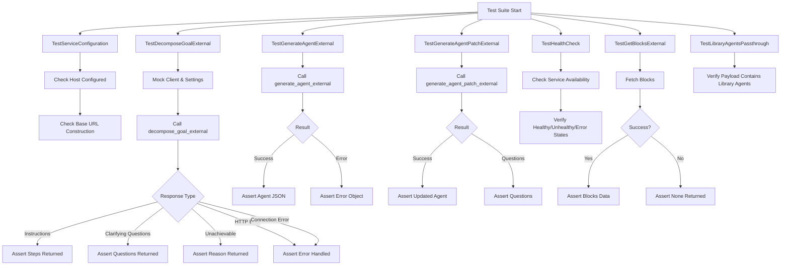

## 类结构

```
Test Agent Generator Service
├── TestServiceConfiguration
├── TestDecomposeGoalExternal
├── TestGenerateAgentExternal
├── TestGenerateAgentPatchExternal
├── TestHealthCheck
├── TestGetBlocksExternal
└── TestLibraryAgentsPassthrough
```

## 全局变量及字段


### `_settings`
    
Global singleton variable used to cache the service settings configuration.

类型：`Optional[Any]`
    


### `_client`
    
Global singleton variable used to cache the HTTP client for external service requests.

类型：`Optional[httpx.AsyncClient]`
    


    

## 全局函数及方法


### `TestServiceConfiguration.setup_method`

在每个测试方法执行之前重置 `service` 模块中的 settings 单例和 client 单例，确保测试环境的隔离性。

参数：

- `self`：`TestServiceConfiguration`，类的实例引用

返回值：`None`，无返回值

#### 流程图

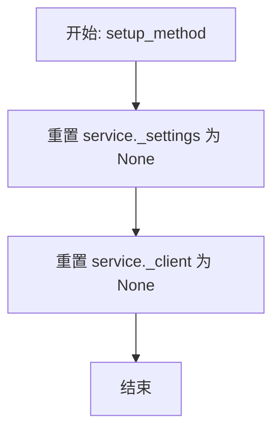

#### 带注释源码

```python
def setup_method(self):
    """Reset settings singleton before each test."""
    # 将 service 模块中的 _settings 全局变量重置为 None，
    # 避免前一个测试的配置影响当前测试。
    service._settings = None
    
    # 将 service 模块中的 _client 全局变量重置为 None，
    # 确保每次测试都使用全新的客户端实例（如果需要的话）。
    service._client = None
```


### `TestServiceConfiguration.test_external_service_not_configured_when_host_empty`

该测试函数用于验证当外部服务的主机地址配置为空字符串时，`service.is_external_service_configured` 方法是否能正确返回 `False`，从而判定服务未配置。

参数：

-  `self`：`TestServiceConfiguration`，测试类的实例引用。

返回值：`None`，该方法为测试用例，无显式返回值，通过断言逻辑验证结果。

#### 流程图

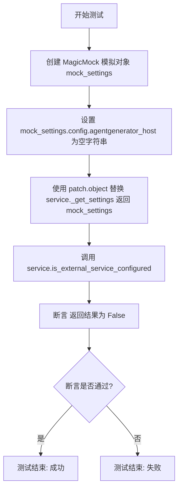

#### 带注释源码

```python
def test_external_service_not_configured_when_host_empty(self):
    """Test that external service is not configured when host is empty."""
    # 1. 创建一个模拟的设置对象，用于替代真实的配置读取
    mock_settings = MagicMock()
    # 2. 将模拟设置中的 agentgenerator_host 属性设为空字符串，模拟未配置主机的场景
    mock_settings.config.agentgenerator_host = ""

    # 3. 使用 patch.object 上下文管理器，
    #    暂时替换 service 模块中的 _get_settings 方法，使其返回我们创建的 mock_settings
    with patch.object(service, "_get_settings", return_value=mock_settings):
        # 4. 调用实际要测试的函数 service.is_external_service_configured
        # 5. 断言该函数的返回值为 False，确保在主机为空时能正确识别服务未配置
        assert service.is_external_service_configured() is False
```


### `TestServiceConfiguration.test_external_service_configured_when_host_set`

该方法用于测试当设置了代理生成器的主机地址时，`is_external_service_configured` 函数能够正确识别服务已配置。它通过模拟设置对象并提供主机字符串来验证配置检测逻辑。

参数：

- `self`：`TestServiceConfiguration`，测试类的实例引用。

返回值：`None`，该方法无返回值，主要通过断言验证逻辑正确性。

#### 流程图

```mermaid
flowchart TD
    A[开始测试] --> B[创建 mock_settings 对象]
    B --> C[设置 mock_settings.config.agentgenerator_host 为 "agent-generator.local"]
    C --> D[使用 patch.object 替换 service._get_settings 返回 mock_settings]
    D --> E[调用 service.is_external_service_configured]
    E --> F{断言结果是否为 True}
    F -- 是 --> G[测试通过]
    F -- 否 --> H[测试失败]
    G --> I[结束]
    H --> I
```

#### 带注释源码

```python
def test_external_service_configured_when_host_set(self):
    """Test that external service is configured when host is set."""
    # 创建一个模拟的设置对象
    mock_settings = MagicMock()
    # 设置模拟对象中的主机配置属性为一个非空字符串
    mock_settings.config.agentgenerator_host = "agent-generator.local"

    # 使用 patch.object 上下文管理器替换 service 模块中的 _get_settings 方法
    # 使其返回我们预先配置好的 mock_settings
    with patch.object(service, "_get_settings", return_value=mock_settings):
        # 调用实际检测服务配置的函数，并断言其返回值应为 True
        assert service.is_external_service_configured() is True
```


### `TestServiceConfiguration.test_get_base_url`

该测试方法用于验证服务配置中基础 URL 的构建逻辑是否正确，确保能够根据配置的主机名和端口生成符合预期的 URL 字符串。

参数：

- `self`：`TestServiceConfiguration`，测试类实例的引用。

返回值：`None`，该方法为测试用例，不返回业务数据，通过断言验证逻辑正确性。

#### 流程图

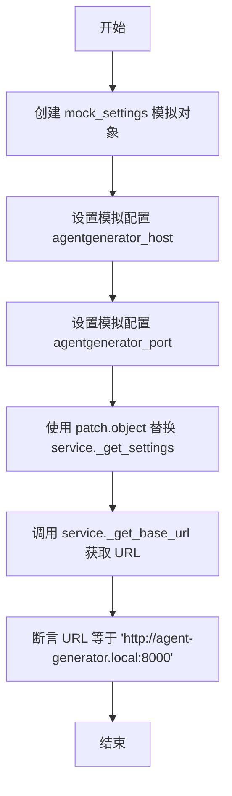

#### 带注释源码

```python
def test_get_base_url(self):
    """Test base URL construction."""
    # 创建一个模拟的设置对象，用于代替真实的配置
    mock_settings = MagicMock()
    # 设置模拟的主机名配置项
    mock_settings.config.agentgenerator_host = "agent-generator.local"
    # 设置模拟的端口号配置项
    mock_settings.config.agentgenerator_port = 8000

    # 使用 patch 上下文管理器替换 service 模块中的 _get_settings 方法
    # 使其返回我们创建的 mock_settings
    with patch.object(service, "_get_settings", return_value=mock_settings):
        # 调用实际需要测试的函数 _get_base_url
        url = service._get_base_url()
        # 断言生成的 URL 是否为预期的字符串
        assert url == "http://agent-generator.local:8000"
```


### `TestDecomposeGoalExternal.setup_method`

在每个测试方法执行前重置 `service` 模块中的设置和客户端单例，以确保测试环境的干净和隔离，防止测试间状态污染。

参数：

- `self`：`TestDecomposeGoalExternal`，当前测试类的实例对象。

返回值：`None`，无返回值。

#### 流程图

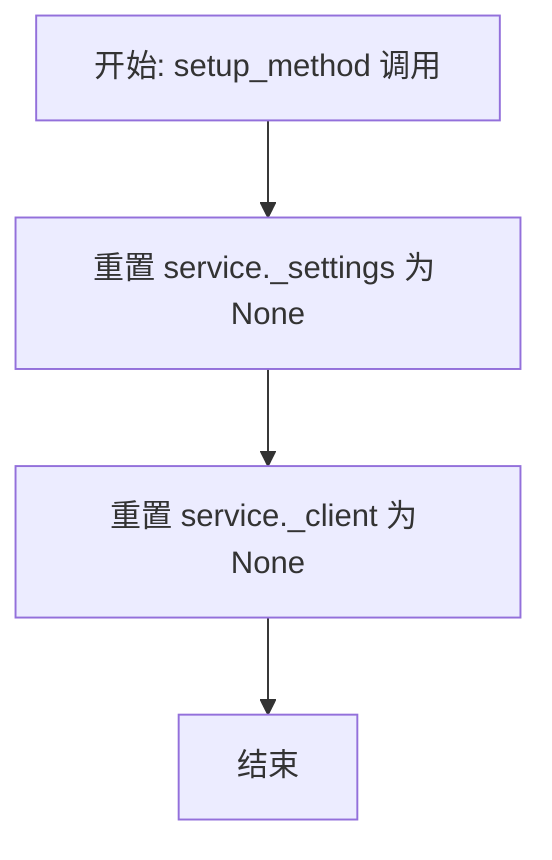

#### 带注释源码

```python
def setup_method(self):
    """Reset client singleton before each test."""
    service._settings = None  # 重置 service 模块的 settings 单例，清除可能的配置状态
    service._client = None    # 重置 service 模块的 client 单例，清除可能的 HTTP 客户端连接
```


### `TestDecomposeGoalExternal.test_decompose_goal_returns_instructions`

测试在成功场景下外部服务 `decompose_goal_external` 函数能够正确返回指令（steps）类型的响应数据。

参数：

-  `self`：`TestDecomposeGoalExternal`，测试类的实例引用

返回值：`None`，该方法不返回值，主要用于断言验证逻辑正确性

#### 流程图

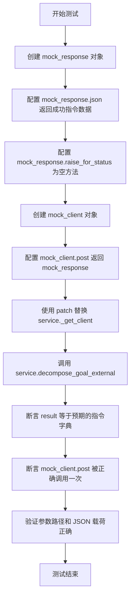

#### 带注释源码

```python
    @pytest.mark.asyncio
    async def test_decompose_goal_returns_instructions(self):
        """测试成功的分解过程返回指令列表。"""
        # 1. 创建模拟的 HTTP 响应对象
        mock_response = MagicMock()
        # 2. 配置响应的 JSON 数据，模拟服务端返回成功且包含指令步骤的情况
        mock_response.json.return_value = {
            "success": True,
            "type": "instructions",
            "steps": ["Step 1", "Step 2"],
        }
        # 3. 模拟 raise_for_status 方法，确保不会抛出 HTTP 错误
        mock_response.raise_for_status = MagicMock()

        # 4. 创建模拟的异步 HTTP 客户端
        mock_client = AsyncMock()
        # 5. 配置客户端的 post 方法返回上述模拟响应
        mock_client.post.return_value = mock_response

        # 6. 使用 patch 上下文管理器替换 service 模块中的 _get_client 方法，使其返回模拟客户端
        with patch.object(service, "_get_client", return_value=mock_client):
            # 7. 调用待测的异步函数 decompose_goal_external，传入目标描述
            result = await service.decompose_goal_external("Build a chatbot")

        # 8. 断言函数返回值与预期的指令结构一致
        assert result == {"type": "instructions", "steps": ["Step 1", "Step 2"]}
        # 9. 断言 HTTP 客户端的 post 方法被正确调用了一次，并验证了 API 路径和请求体 JSON
        mock_client.post.assert_called_once_with(
            "/api/decompose-description", json={"description": "Build a chatbot"}
        )
```


### `TestDecomposeGoalExternal.test_decompose_goal_returns_clarifying_questions`

测试当外部 Agent Generator 服务返回澄清问题时，`decompose_goal_external` 函数能否正确解析并返回该结果。

参数：

-   `self`：`TestDecomposeGoalExternal`，测试类的实例，用于访问测试上下文或调用其他测试辅助方法。

返回值：`None`，无返回值，主要目的是通过断言验证业务逻辑。

#### 流程图

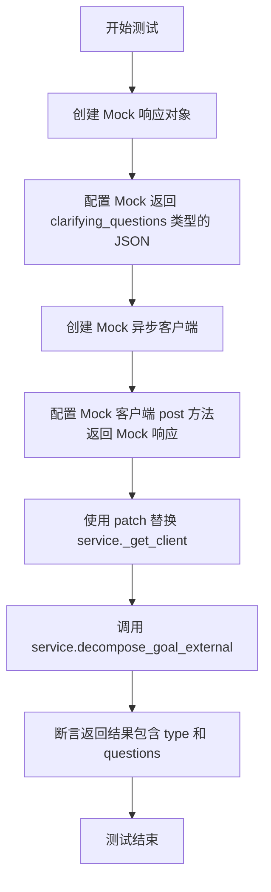

#### 带注释源码

```python
@pytest.mark.asyncio
async def test_decompose_goal_returns_clarifying_questions(self):
    """Test decomposition returning clarifying questions."""
    # 1. 模拟 HTTP 响应对象
    mock_response = MagicMock()
    # 2. 设置响应的 JSON 数据，模拟服务返回需要澄清问题的场景
    mock_response.json.return_value = {
        "success": True,
        "type": "clarifying_questions",
        "questions": ["What platform?", "What language?"],
    }
    # 3. 模拟 raise_for_status，防止因 HTTP 状态码抛出异常
    mock_response.raise_for_status = MagicMock()

    # 4. 模拟异步 HTTP 客户端
    mock_client = AsyncMock()
    # 5. 设置客户端的 post 方法返回上述模拟响应
    mock_client.post.return_value = mock_response

    # 6. 使用 patch 上下文管理器替换 service 模块中的 _get_client 方法
    with patch.object(service, "_get_client", return_value=mock_client):
        # 7. 调用被测函数 decompose_goal_external
        result = await service.decompose_goal_external("Build something")

    # 8. 断言：验证返回的结果字典与预期一致，包含澄清问题
    assert result == {
        "type": "clarifying_questions",
        "questions": ["What platform?", "What language?"],
    }
```


### `TestDecomposeGoalExternal.test_decompose_goal_with_context`

测试在带有额外上下文的情况下分解目标的功能，验证外部服务客户端是否正确地将用户提供的上下文追加到描述中并发送请求。

参数：

-  `self`：`TestDecomposeGoalExternal`，测试类实例，用于访问测试方法和 fixtures。

返回值：`None`，无返回值，该方法通过断言来验证行为是否符合预期。

#### 流程图

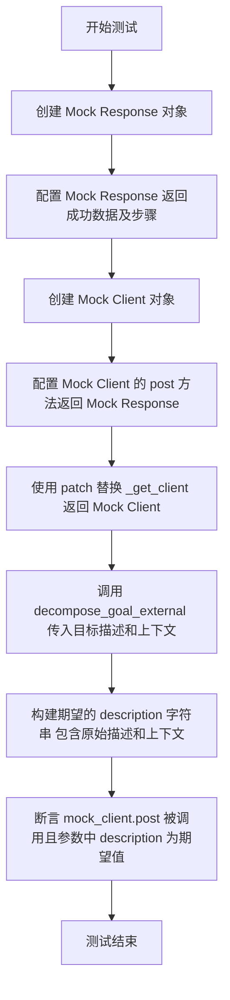

#### 带注释源码

```python
    @pytest.mark.asyncio
    async def test_decompose_goal_with_context(self):
        """Test decomposition with additional context enriched into description."""
        # 1. 准备模拟的 HTTP 响应对象
        mock_response = MagicMock()
        # 模拟 JSON 返回数据，包含成功标志和指令步骤
        mock_response.json.return_value = {
            "success": True,
            "type": "instructions",
            "steps": ["Step 1"],
        }
        # 模拟 raise_for_status 方法不抛出异常（表示 HTTP 请求成功）
        mock_response.raise_for_status = MagicMock()

        # 2. 准备模拟的异步客户端
        mock_client = AsyncMock()
        # 模拟客户端的 post 方法返回上述定义的 mock_response
        mock_client.post.return_value = mock_response

        # 3. 使用 patch 上下文管理器替换 service 模块中的 _get_client 方法
        # 使其返回我们的 mock_client，从而避免真实的网络请求
        with patch.object(service, "_get_client", return_value=mock_client):
            # 调用被测函数，传入目标描述 "Build a chatbot" 和上下文 "Use Python"
            await service.decompose_goal_external(
                "Build a chatbot", context="Use Python"
            )

        # 4. 验证数据传递逻辑：构造期望发送给后端的描述字符串
        # 预期格式应包含原始描述和 "Additional context from user:\n" 前缀的上下文
        expected_description = (
            "Build a chatbot\n\nAdditional context from user:\nUse Python"
        )
        
        # 5. 断言 mock_client.post 方法被调用了一次
        # 并且调用的参数符合预期：URL 为 "/api/decompose-description"
        # JSON 体中的 description 字段值为 expected_description
        mock_client.post.assert_called_once_with(
            "/api/decompose-description",
            json={"description": expected_description},
        )
```


### `TestDecomposeGoalExternal.test_decompose_goal_returns_unachievable_goal`

该测试用例用于验证 `decompose_goal_external` 函数在处理外部服务返回“不可达目标”类型响应时的逻辑。它确保函数能正确解析并返回包含原因和建议替代目标的字典结构。

参数：

- `self`：`TestDecomposeGoalExternal`，测试类的实例，用于访问测试上下文和断言方法。

返回值：`None`，该函数没有显式返回值，主要用于验证逻辑是否正确，若断言失败则抛出异常。

#### 流程图

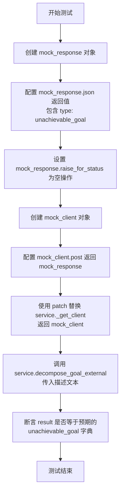

#### 带注释源码

```python
@pytest.mark.asyncio
async def test_decompose_goal_returns_unachievable_goal(self):
    """Test decomposition returning unachievable goal response."""
    # 模拟 HTTP 响应对象
    mock_response = MagicMock()
    # 设定响应的 JSON 数据，模拟服务判断目标不可达的场景
    mock_response.json.return_value = {
        "success": True,
        "type": "unachievable_goal",
        "reason": "Cannot do X",
        "suggested_goal": "Try Y instead",
    }
    # 模拟 HTTP 状态码检查通过
    mock_response.raise_for_status = MagicMock()

    # 模拟异步 HTTP 客户端
    mock_client = AsyncMock()
    # 设定客户端的 post 请求返回上述模拟响应
    mock_client.post.return_value = mock_response

    # 替换 service 模块中的 _get_client 方法，使其返回模拟客户端
    with patch.object(service, "_get_client", return_value=mock_client):
        # 调用被测函数，传入目标描述
        result = await service.decompose_goal_external("Do something impossible")

    # 验证返回结果是否符合预期的不可达目标结构
    assert result == {
        "type": "unachievable_goal",
        "reason": "Cannot do X",
        "suggested_goal": "Try Y instead",
    }
```


### `TestDecomposeGoalExternal.test_decompose_goal_handles_http_error`

该测试方法验证了当 `decompose_goal_external` 函数调用外部服务时，如果遇到 HTTP 状态码错误（如 500 内部服务器错误），系统能否捕获该异常并返回一个包含错误类型和详细信息的标准化错误字典，而不是直接抛出未处理的异常。

参数：

-  `self`：`TestDecomposeGoalExternal`，测试类的实例，用于访问测试上下文和断言方法。

返回值：`None`，该方法为单元测试，主要通过断言验证行为，无显式返回值。

#### 流程图

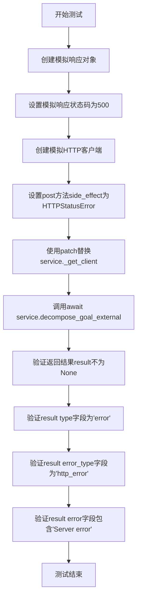

#### 带注释源码

```python
    @pytest.mark.asyncio
    async def test_decompose_goal_handles_http_error(self):
        """Test decomposition handles HTTP errors gracefully."""
        # 1. 创建一个模拟的 HTTP 响应对象，用于构建异常
        mock_response = MagicMock()
        mock_response.status_code = 500
        
        # 2. 创建一个模拟的异步客户端
        mock_client = AsyncMock()
        # 3. 设置客户端 post 方法的副作用：当被调用时抛出 httpx.HTTPStatusError 异常
        #    这模拟了外部服务返回 500 错误的情况
        mock_client.post.side_effect = httpx.HTTPStatusError(
            "Server error", request=MagicMock(), response=mock_response
        )

        # 4. 使用 patch 替换 service 模块中的 _get_client 方法，使其返回我们的模拟客户端
        with patch.object(service, "_get_client", return_value=mock_client):
            # 5. 调用被测函数 decompose_goal_external
            result = await service.decompose_goal_external("Build a chatbot")

        # 6. 断言：验证函数没有返回 None，即返回了错误处理对象
        assert result is not None
        # 7. 断言：验证返回对象中 type 字段为 'error'
        assert result.get("type") == "error"
        # 8. 断言：验证返回对象中 error_type 字段为 'http_error'
        assert result.get("error_type") == "http_error"
        # 9. 断言：验证错误消息中包含了原始异常的文本 "Server error"
        assert "Server error" in result.get("error", "")
```


### `TestDecomposeGoalExternal.test_decompose_goal_handles_request_error`

该测试方法用于验证当 `decompose_goal_external` 函数在调用外部服务时遇到 `httpx.RequestError`（例如网络连接失败）的情况，确保服务能够优雅地捕获异常并返回一个包含错误类型和错误信息的标准错误字典，而不是直接抛出未处理的异常。

参数：

- `self`：`TestDecomposeGoalExternal`，测试类的实例，提供上下文和访问测试固件的方法。

返回值：`None`，该方法是测试用例，不直接返回业务数据，主要通过断言验证逻辑。

#### 流程图

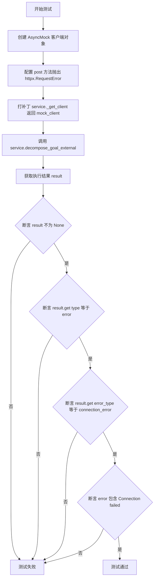

#### 带注释源码

```python
@pytest.mark.asyncio
async def test_decompose_goal_handles_request_error(self):
    """Test decomposition handles request errors gracefully."""
    # 1. 创建一个模拟的异步 HTTP 客户端
    mock_client = AsyncMock()
    
    # 2. 配置该客户端的 post 方法在被调用时抛出 httpx.RequestError，模拟连接失败
    mock_client.post.side_effect = httpx.RequestError("Connection failed")

    # 3. 使用 patch 将 service 模块中的 _get_client 函数替换为返回上述 mock 客户端
    with patch.object(service, "_get_client", return_value=mock_client):
        # 4. 调用被测函数 decompose_goal_external
        result = await service.decompose_goal_external("Build a chatbot")

    # 5. 验证返回结果不为 None
    assert result is not None
    # 6. 验证返回结果中包含 type 字段且值为 "error"
    assert result.get("type") == "error"
    # 7. 验证返回结果中包含 error_type 字段且值为 "connection_error"
    assert result.get("error_type") == "connection_error"
    # 8. 验证返回结果的 error 字段中包含原始异常信息 "Connection failed"
    assert "Connection failed" in result.get("error", "")
```


### `TestDecomposeGoalExternal.test_decompose_goal_handles_service_error`

测试当外部服务返回逻辑错误（即 HTTP 状态码正常但响应体中 `success` 为 false）时，`decompose_goal_external` 函数能否正确解析并返回包含错误详情的字典。

参数：

-  `self`：`TestDecomposeGoalExternal`，测试类的实例，提供上下文和测试方法。

返回值：`None`，测试方法无返回值，通过断言（assert）验证返回结果的结构和内容是否符合预期。

#### 流程图

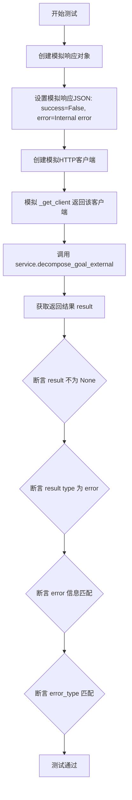

#### 带注释源码

```python
    @pytest.mark.asyncio
    async def test_decompose_goal_handles_service_error(self):
        """Test decomposition handles service returning error."""
        # 1. 准备模拟响应，模拟服务端处理逻辑失败的情况
        # 即使 HTTP 状态码可能是 200 (由 raise_for_status 不抛异常暗示)，业务逻辑返回了错误
        mock_response = MagicMock()
        mock_response.json.return_value = {
            "success": False,
            "error": "Internal error",
            "error_type": "internal_error",
        }
        # 模拟 raise_for_status 不抛出异常，表示不是 HTTP 层面的 500 错误
        mock_response.raise_for_status = MagicMock()

        # 2. 准备模拟客户端，使其 post 方法返回上述模拟响应
        mock_client = AsyncMock()
        mock_client.post.return_value = mock_response

        # 3. 在上下文中替换 service 的 _get_client 方法，强制返回模拟客户端
        with patch.object(service, "_get_client", return_value=mock_client):
            # 4. 调用被测函数
            result = await service.decompose_goal_external("Build a chatbot")

        # 5. 验证结果：确保函数返回了一个包含错误信息的字典，而不是抛出异常
        assert result is not None
        assert result.get("type") == "error"
        assert result.get("error") == "Internal error"
        assert result.get("error_type") == "internal_error"
```


### `TestGenerateAgentExternal.setup_method`

在每个测试用例执行前重置 `service` 模块中的单例配置和客户端实例，以确保测试环境的隔离性，防止状态污染。

参数：

-  `self`：`TestGenerateAgentExternal`，测试类实例，由 pytest 框架自动注入。

返回值：`None`，无返回值。

#### 流程图

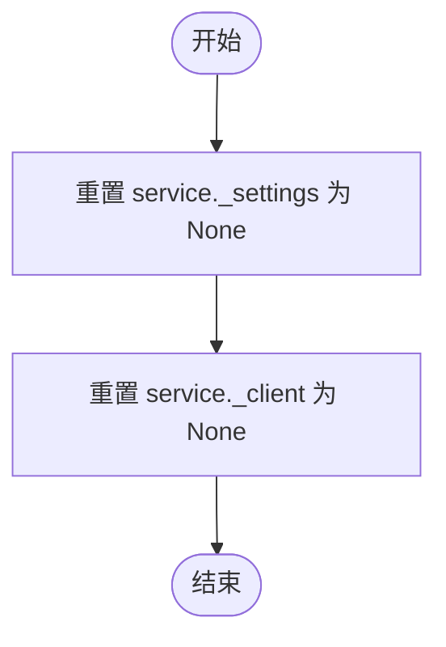

#### 带注释源码

```python
    def setup_method(self):
        """Reset client singleton before each test."""
        # 重置 service 模块中的 settings 单例变量，防止配置在测试间遗留
        service._settings = None
        # 重置 service 模块中的 HTTP client 单例变量，防止连接在测试间复用或状态残留
        service._client = None
```


### `TestGenerateAgentExternal.test_generate_agent_success`

测试 `generate_agent_external` 函数在成功场景下的行为，验证其是否能正确处理返回的 Agent JSON 数据以及是否向正确的端点发送了正确的请求参数。

参数：

- `self`：`TestGenerateAgentExternal`，测试类的实例，提供测试上下文。

返回值：`None`，该函数为测试方法，主要用于断言验证，不返回业务数据。

#### 流程图

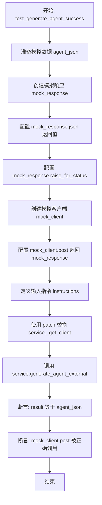

#### 带注释源码

```python
    @pytest.mark.asyncio
    async def test_generate_agent_success(self):
        """Test successful agent generation."""
        # 1. 定义预期的 Agent JSON 结构，包含名称、节点和链接
        agent_json = {
            "name": "Test Agent",
            "nodes": [],
            "links": [],
        }
        
        # 2. 创建模拟的 HTTP 响应对象
        mock_response = MagicMock()
        # 3. 设置响应的 JSON 返回值，模拟 API 调用成功并返回 agent_json
        mock_response.json.return_value = {
            "success": True,
            "agent_json": agent_json,
        }
        # 4. 模拟 raise_for_status 方法，确保在成功时不会抛出异常
        mock_response.raise_for_status = MagicMock()

        # 5. 创建模拟的异步 HTTP 客户端
        mock_client = AsyncMock()
        # 6. 设置客户端的 post 方法调用时返回上述模拟响应
        mock_client.post.return_value = mock_response

        # 7. 准备传入函数的指令参数
        instructions = {"type": "instructions", "steps": ["Step 1"]}

        # 8. 使用 patch.object 上下文管理器替换 service 模块中的 _get_client 方法
        #    使其返回我们创建的 mock_client，从而避免真实的网络请求
        with patch.object(service, "_get_client", return_value=mock_client):
            # 9. 调用待测试的异步函数 service.generate_agent_external
            result = await service.generate_agent_external(instructions)

        # 10. 验证函数返回的结果是否等于预期的 agent_json
        assert result == agent_json
        
        # 11. 验证 mock_client 的 post 方法是否被调用了一次，
        #     并且传入了正确的 URL 路径和 JSON 请求体（包含 instructions）
        mock_client.post.assert_called_once_with(
            "/api/generate-agent", json={"instructions": instructions}
        )
```


### `TestGenerateAgentExternal.test_generate_agent_handles_error`

该测试方法用于验证当外部服务客户端发生请求错误（如连接失败）时，`generate_agent_external` 函数能否捕获异常并返回标准的错误响应结构，而不是直接抛出未处理的异常。

参数：

-   `self`：`TestGenerateAgentExternal`，测试类实例，用于访问测试上下文和断言方法。

返回值：`None`，该函数没有返回值，主要通过断言来验证逻辑正确性。

#### 流程图

```mermaid
graph TD
    A[开始测试] --> B[创建模拟的 AsyncMock 客户端]
    B --> C[设置 post 方法抛出 httpx.RequestError]
    C --> D[使用 patch 替换 service._get_client]
    D --> E[调用 service.generate_agent_external]
    E --> F[捕获返回结果 result]
    F --> G{断言 result 是否为 None?}
    G -- 否 --> H{断言 result['type'] == 'error'?}
    H -- 是 --> I{断言 result['error_type'] == 'connection_error'?}
    I -- 是 --> J{断言 result['error'] 包含错误信息?}
    J -- 是 --> K[测试通过]
    G -- 是 --> L[测试失败: result 为 None]
    H -- 否 --> M[测试失败: 类型错误]
    I -- 否 --> N[测试失败: 错误类型错误]
    J -- 否 --> O[测试失败: 错误信息缺失]
```

#### 带注释源码

```python
@pytest.mark.asyncio
async def test_generate_agent_handles_error(self):
    """Test agent generation handles errors gracefully."""
    # 1. 创建一个模拟的异步客户端
    mock_client = AsyncMock()
    # 2. 设置当调用 post 方法时，抛出 httpx.RequestError 异常，模拟连接失败
    mock_client.post.side_effect = httpx.RequestError("Connection failed")

    # 3. 使用 patch.object 上下文管理器替换 service 模块中的 _get_client 方法，
    #    使其返回我们创建的 mock_client，从而避免真实的网络请求
    with patch.object(service, "_get_client", return_value=mock_client):
        # 4. 调用被测试的函数 generate_agent_external，传入虚拟的指令
        result = await service.generate_agent_external({"steps": []})

    # 5. 验证：断言返回结果不为空
    assert result is not None
    # 6. 验证：断言返回结果中包含 type 字段且值为 "error"
    assert result.get("type") == "error"
    # 7. 验证：断言返回结果中包含 error_type 字段且值为 "connection_error"
    assert result.get("error_type") == "connection_error"
    # 8. 验证：断言返回结果中的 error 字段包含原始错误信息 "Connection failed"
    assert "Connection failed" in result.get("error", "")
```


### `TestGenerateAgentPatchExternal.setup_method`

该方法是 pytest 测试类的钩子函数，在每个测试方法执行前运行。它的主要功能是重置 `service` 模块中的全局单例变量 `_settings` 和 `_client`，以防止测试之间的状态污染，确保每个测试在干净的环境中运行。

参数：

-   `self`：`TestGenerateAgentPatchExternal`，测试类的实例，由 pytest 框架自动传入。

返回值：`None`，无返回值。

#### 流程图


#### 带注释源码

```python
def setup_method(self):
    """Reset client singleton before each test."""
    # 将外部服务模块的设置单例重置为 None，清除之前的配置
    service._settings = None
    # 将外部服务模块的客户端单例重置为 None，清除之前的连接
    service._client = None
```


### `TestGenerateAgentPatchExternal.test_generate_patch_returns_updated_agent`

该测试方法用于验证 `service.generate_agent_patch_external` 函数在成功场景下的行为。它通过模拟 HTTP 客户端和响应对象，确保当外部服务返回成功状态及更新后的代理 JSON 时，函数能正确解析并返回该数据，同时验证了 HTTP POST 请求的参数格式和端点正确性。

参数：

-   `self`：`TestGenerateAgentPatchExternal`，测试类的实例引用。

返回值：`None`，该方法为测试用例，不返回业务数据，通过断言验证逻辑正确性。

#### 流程图

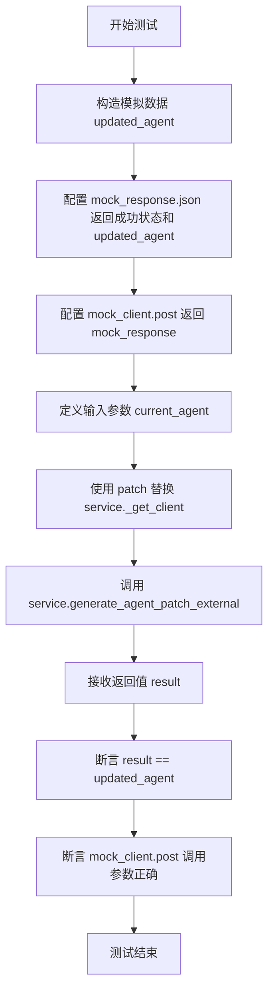

#### 带注释源码

```python
@pytest.mark.asyncio
async def test_generate_patch_returns_updated_agent(self):
    """Test successful patch generation returning updated agent."""
    # 1. 定义预期的更新后代理数据结构
    updated_agent = {
        "name": "Updated Agent",
        "nodes": [{"id": "1", "block_id": "test"}],
        "links": [],
    }
    
    # 2. 模拟 HTTP 响应对象，预设 JSON 返回值
    mock_response = MagicMock()
    mock_response.json.return_value = {
        "success": True,
        "agent_json": updated_agent,
    }
    # 模拟 raise_for_status 方法，防止抛出异常
    mock_response.raise_for_status = MagicMock()

    # 3. 模拟异步 HTTP 客户端，预设 post 方法的返回值
    mock_client = AsyncMock()
    mock_client.post.return_value = mock_response

    # 4. 定义当前代理状态作为输入参数
    current_agent = {"name": "Old Agent", "nodes": [], "links": []}

    # 5. 使用 patch 上下文管理器替换 service 模块中的 _get_client 方法
    with patch.object(service, "_get_client", return_value=mock_client):
        # 6. 调用待测试的异步函数，传入更新请求和当前代理
        result = await service.generate_agent_patch_external(
            "Add a new node", current_agent
        )

    # 7. 验证函数返回值是否等于预期的更新后代理
    assert result == updated_agent
    
    # 8. 验证 HTTP POST 请求是否被调用了一次，且 URL 和 Payload（负载）正确
    mock_client.post.assert_called_once_with(
        "/api/update-agent",
        json={
            "update_request": "Add a new node",
            "current_agent_json": current_agent,
        },
    )
```


### `TestGenerateAgentPatchExternal.test_generate_patch_returns_clarifying_questions`

验证当外部补丁生成服务返回澄清问题而非直接生成代理时，`generate_agent_patch_external` 函数能正确解析并返回该响应结构。

参数：

- `self`：`TestGenerateAgentPatchExternal`，测试类实例，用于访问测试上下文和断言方法。

返回值：`None`，该函数为测试方法，无返回值，主要通过断言验证行为。

#### 流程图

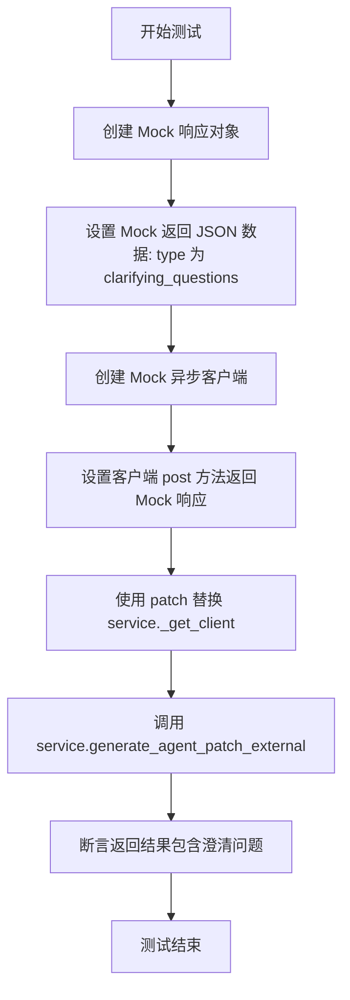

#### 带注释源码

```python
    @pytest.mark.asyncio
    async def test_generate_patch_returns_clarifying_questions(self):
        """Test patch generation returning clarifying questions."""
        # 创建模拟的 HTTP 响应对象
        mock_response = MagicMock()
        # 设置响应的 JSON 数据，模拟服务端返回需要澄清问题的情况
        mock_response.json.return_value = {
            "success": True,
            "type": "clarifying_questions",
            "questions": ["What type of node?"],
        }
        # 模拟响应不会抛出 HTTP 状态错误
        mock_response.raise_for_status = MagicMock()

        # 创建模拟的异步 HTTP 客户端
        mock_client = AsyncMock()
        # 设置客户端的 post 方法返回上面创建的模拟响应
        mock_client.post.return_value = mock_response

        # 使用 patch 上下文管理器替换 service 模块中的 _get_client 方法，
        # 强制其返回我们的模拟客户端
        with patch.object(service, "_get_client", return_value=mock_client):
            # 调用待测函数 generate_agent_patch_external，传入更新请求和当前代理结构
            result = await service.generate_agent_patch_external(
                "Add something", {"nodes": []}
            )

        # 断言函数返回的结果确实包含澄清问题的类型和具体问题内容
        assert result == {
            "type": "clarifying_questions",
            "questions": ["What type of node?"],
        }
```


### `TestHealthCheck.setup_method`

重置 `service` 模块中的单例变量（`_settings` 和 `_client`），以确保在 `TestHealthCheck` 测试套件中的每个测试方法执行前，环境处于干净的初始状态，避免测试间的数据污染。

参数：

- `self`：`TestHealthCheck`，测试类的实例，指代当前测试对象。

返回值：`None`，无返回值。

#### 流程图

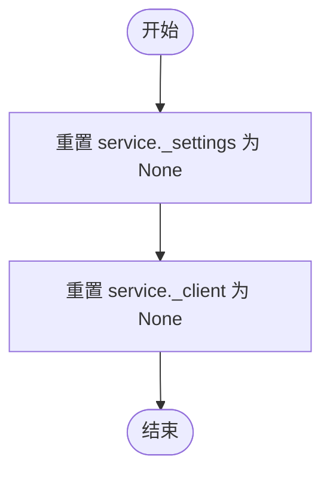

#### 带注释源码

```python
def setup_method(self):
    """Reset singletons before each test."""
    # 重置服务配置单例
    service._settings = None
    # 重置 HTTP 客户端单例
    service._client = None
```


### `TestHealthCheck.test_health_check_returns_false_when_not_configured`

测试当外部服务未配置时，健康检查函数（`health_check`）是否返回 False。该测试用例通过模拟 `is_external_service_configured` 函数使其返回 False，来验证服务层在服务未配置时的逻辑处理。

参数：

- `self`：`TestHealthCheck`，测试类实例，用于访问测试上下文和 pytest 固件。

返回值：`None`，该函数为测试方法，主要用于断言验证，不返回实际业务数据。

#### 流程图

```mermaid
graph TD
    A[Start] --> B[Patch is_external_service_configured to return False]
    B --> C[Call await service.health_check]
    C --> D[Assert result is False]
    D --> E[End]
```

#### 带注释源码

```python
    @pytest.mark.asyncio
    async def test_health_check_returns_false_when_not_configured(self):
        # Patch（模拟）service 模块中的 is_external_service_configured 方法
        # 强制其返回 False，以模拟“服务未配置”的场景
        with patch.object(
            service, "is_external_service_configured", return_value=False
        ):
            # 调用异步的健康检查函数
            result = await service.health_check()
            # 断言验证：预期结果应为 False，确认在未配置情况下逻辑正确
            assert result is False
```


### `TestHealthCheck.test_health_check_returns_true_when_healthy`

该测试用例验证了当外部服务已配置且返回健康的响应状态时，`service.health_check` 函数能够正确返回 `True`。它通过模拟 HTTP 客户端和服务配置状态来隔离测试逻辑。

参数：

- `self`：`TestHealthCheck`，测试类的实例，提供访问测试上下文和断言方法的能力。

返回值：`None`，该方法为单元测试函数，无显式返回值。

#### 流程图

```mermaid
graph TD
    A[开始] --> B[创建 Mock Response 对象]
    B --> C[设置返回的 JSON 状态为 healthy]
    C --> D[创建 Mock Client 对象]
    D --> E[Mock Client 的 get 方法返回预设 Response]
    E --> F[Patch is_external_service_configured 返回 True]
    F --> G[Patch _get_client 返回 Mock Client]
    G --> H[调用 service.health_check]
    H --> I[断言返回结果为 True]
    I --> J[断言 Client 调用了 /health 接口]
    J --> K[结束]
```

#### 带注释源码

```python
@pytest.mark.asyncio
async def test_health_check_returns_true_when_healthy(self):
    """测试当服务健康时，健康检查返回 True。"""
    # 1. 模拟 HTTP 响应对象
    mock_response = MagicMock()
    # 设定响应体包含 "status": "healthy"
    mock_response.json.return_value = {
        "status": "healthy",
        "blocks_loaded": True,
    }
    # 模拟 raise_for_status 方法，确保不会抛出异常
    mock_response.raise_for_status = MagicMock()

    # 2. 模拟异步 HTTP 客户端
    mock_client = AsyncMock()
    # 设定客户端的 get 请求返回上述模拟的响应
    mock_client.get.return_value = mock_response

    # 3. 使用 patch 对象模拟外部依赖
    # 模拟服务已配置状态为 True
    with patch.object(service, "is_external_service_configured", return_value=True):
        # 模拟获取客户端的方法返回上述模拟客户端
        with patch.object(service, "_get_client", return_value=mock_client):
            # 4. 调用实际的健康检查函数
            result = await service.health_check()

    # 5. 验证结果：函数应返回 True
    assert result is True
    # 6. 验证交互：客户端应正确调用了一次 /health 端点
    mock_client.get.assert_called_once_with("/health")
```


### `TestHealthCheck.test_health_check_returns_false_when_not_healthy`

该测试方法用于验证当外部 Agent Generator 服务返回“不健康”（unhealthy）状态时，`service.health_check` 函数能够正确返回 `False`，确保系统能准确识别服务不可用状态。

参数：

- `self`：`TestHealthCheck`，测试类的实例引用。

返回值：`None`，无返回值（该方法主要用于断言验证系统行为）。

#### 流程图

```mermaid
graph TD
    A[开始测试] --> B[创建模拟响应 mock_response<br/>status = 'unhealthy']
    B --> C[创建模拟客户端 mock_client<br/>get 方法返回 mock_response]
    C --> D[模拟 is_external_service_configured<br/>返回 True]
    D --> E[模拟 _get_client<br/>返回 mock_client]
    E --> F[调用 service.health_check]
    F --> G[断言 result == False]
    G --> H[测试结束]
```

#### 带注释源码

```python
    @pytest.mark.asyncio
    async def test_health_check_returns_false_when_not_healthy(self):
        """Test health check returns False when service is not healthy."""
        # 创建模拟的 HTTP 响应对象，设定状态为 'unhealthy' 以模拟服务异常
        mock_response = MagicMock()
        mock_response.json.return_value = {
            "status": "unhealthy",
            "blocks_loaded": False,
        }
        mock_response.raise_for_status = MagicMock()

        # 创建模拟的 HTTP 客户端，并配置其 get 方法返回上述模拟响应
        mock_client = AsyncMock()
        mock_client.get.return_value = mock_response

        # 使用 patch 替换服务检查和客户端获取逻辑，模拟服务已配置但客户端返回不健康数据
        with patch.object(service, "is_external_service_configured", return_value=True):
            with patch.object(service, "_get_client", return_value=mock_client):
                # 调用实际的异步健康检查函数
                result = await service.health_check()

        # 断言验证：在服务返回不健康状态时，health_check 应正确返回 False
        assert result is False
```


### `TestHealthCheck.test_health_check_returns_false_on_error`

该测试用例用于验证当外部服务客户端在尝试进行健康检查时遇到连接错误（如网络问题），`service.health_check` 方法能够正确捕获异常并返回 False，确保系统具备健壮的错误处理能力。

参数：

-  `self`：`TestHealthCheck`，测试类的实例，用于访问测试上下文和断言方法。

返回值：`None`，该函数为测试方法，无显式返回值，主要用于断言验证行为。

#### 流程图

```mermaid
graph TD
    A[开始] --> B[创建 mock_client]
    B --> C[设置 mock_client.get.side_effect 为 RequestError]
    C --> D[Mock is_external_service_configured 返回 True]
    D --> E[Mock _get_client 返回 mock_client]
    E --> F[调用 service.health_check]
    F --> G[捕获 RequestError 并返回 False]
    G --> H[断言 result 为 False]
    H --> I[测试结束]
```

#### 带注释源码

```python
@pytest.mark.asyncio
async def test_health_check_returns_false_on_error(self):
    """Test health check returns False on connection error."""
    # 1. 创建一个异步 Mock 客户端，用于模拟 httpx 客户端的行为
    mock_client = AsyncMock()
    
    # 2. 配置 mock_client 的 get 方法，使其在被调用时抛出 httpx.RequestError 异常
    #    这模拟了网络连接失败或服务不可达的情况
    mock_client.get.side_effect = httpx.RequestError("Connection failed")

    # 3. 使用 patch.object 上下文管理器替换 service 模块中的函数/属性
    with patch.object(service, "is_external_service_configured", return_value=True):
        #    模拟服务已配置，确保测试聚焦于连接错误处理而非配置检查
        with patch.object(service, "_get_client", return_value=mock_client):
            #    模拟获取客户端时返回我们上面创建的 mock_client
            # 4. 调用实际待测的异步函数 health_check
            result = await service.health_check()

    # 5. 验证在发生连接错误时，health_check 函数是否按预期返回 False
    assert result is False
```


### `TestGetBlocksExternal.setup_method`

在每个测试用例执行前，重置 `service` 模块中的全局单例变量 `_settings` 和 `_client`，以确保测试之间的环境隔离，避免状态污染。

参数：

-   `self`：`TestGetBlocksExternal`，测试类实例，由 pytest 框架自动传入。

返回值：`None`，无返回值。

#### 流程图

```mermaid
flowchart TD
    Start([开始]) --> ResetSettings[重置 service._settings 为 None]
    ResetSettings --> ResetClient[重置 service._client 为 None]
    ResetClient --> End([结束])
```

#### 带注释源码

```python
def setup_method(self):
    """Reset client singleton before each test."""
    # 将服务配置单例重置为 None，清除之前的配置状态
    service._settings = None
    # 将 HTTP 客户端单例重置为 None，断开之前的连接或缓存
    service._client = None
```


### `TestGetBlocksExternal.test_get_blocks_success`

验证 `get_blocks_external` 服务函数在成功场景下正确获取并返回块列表的测试方法。该方法模拟了外部 HTTP 客户端的响应，确保服务能够解析 JSON 数据并返回块列表，同时验证了 API 端点的正确调用。

参数：

- `self`：`TestGetBlocksExternal`，测试类的实例，用于访问测试上下文和断言方法。

返回值：`None`，该方法不返回值，通过断言验证预期行为。

#### 流程图

```mermaid
graph TD
    A[开始测试] --> B[定义模拟的 blocks 数据]
    B --> C[创建 mock_response 对象]
    C --> D[配置 mock_response.json 返回成功数据]
    D --> E[创建 mock_client 对象]
    E --> F[配置 mock_client.get 返回 mock_response]
    F --> G[使用 patch 替换 service._get_client]
    G --> H[调用 service.get_blocks_external]
    H --> I[断言返回结果等于 blocks 数据]
    I --> J[断言 mock_client.get 被正确调用]
    J --> K[测试结束]
```

#### 带注释源码

```python
    @pytest.mark.asyncio
    async def test_get_blocks_success(self):
        """Test successful blocks retrieval."""
        # 1. 定义预期的模拟返回数据：包含两个块的列表
        blocks = [
            {"id": "block1", "name": "Block 1"},
            {"id": "block2", "name": "Block 2"},
        ]
        
        # 2. 创建模拟的 HTTP 响应对象
        mock_response = MagicMock()
        # 3. 配置响应对象的 json 方法，返回成功状态和块列表
        mock_response.json.return_value = {
            "success": True,
            "blocks": blocks,
        }
        # 4. 模拟 raise_for_status 方法，使其不抛出异常（表示 HTTP 请求成功）
        mock_response.raise_for_status = MagicMock()

        # 5. 创建模拟的异步 HTTP 客户端
        mock_client = AsyncMock()
        # 6. 配置客户端的 get 方法，使其返回上面创建的模拟响应
        mock_client.get.return_value = mock_response

        # 7. 使用 patch.object 替换 service 模块中的 _get_client 方法，使其返回模拟客户端
        with patch.object(service, "_get_client", return_value=mock_client):
            # 8. 调用实际测试的服务函数
            result = await service.get_blocks_external()

        # 9. 断言：验证函数返回的结果与预期的 blocks 数据一致
        assert result == blocks
        # 10. 断言：验证 HTTP 客户端的 get 方法被正确调用了一次，且路径为 "/api/blocks"
        mock_client.get.assert_called_once_with("/api/blocks")
```


### `TestGetBlocksExternal.test_get_blocks_handles_error`

该测试方法用于验证 `get_blocks_external` 函数在处理外部服务请求错误（具体为 `httpx.RequestError`）时的行为，确保其能够优雅地处理异常并返回 `None`。

参数：

- `self`：`TestGetBlocksExternal`，测试类实例，用于访问测试上下文和断言方法。

返回值：`None`，该方法为测试函数，主要用于断言逻辑，不返回实际业务数据。

#### 流程图

```mermaid
graph TD
    A[开始测试] --> B[创建 AsyncMock 客户端 mock_client]
    B --> C[设置 mock_client.get 副作用]
    C --> D[抛出 httpx.RequestError Connection failed]
    D --> E[Patch service._get_client 返回 mock_client]
    E --> F[调用 service.get_blocks_external]
    F --> G[捕获异常并处理]
    G --> H[断言 result 为 None]
    H --> I[测试结束]
```

#### 带注释源码

```python
@pytest.mark.asyncio
async def test_get_blocks_handles_error(self):
    """Test blocks retrieval handles errors gracefully."""
    # 创建一个模拟的异步 HTTP 客户端
    mock_client = AsyncMock()
    # 配置模拟客户端的 get 方法，使其在被调用时抛出 httpx.RequestError 异常，模拟连接失败
    mock_client.get.side_effect = httpx.RequestError("Connection failed")

    # 使用 patch.object 替换 service 模块中的 _get_client 方法，
    # 强制其返回我们配置好的 mock_client，从而隔离真实的网络调用
    with patch.object(service, "_get_client", return_value=mock_client):
        # 调用被测试的异步函数 get_blocks_external
        result = await service.get_blocks_external()

    # 断言验证：期望在发生连接错误时，函数返回 None
    assert result is None
```


### `TestLibraryAgentsPassthrough.setup_method`

重置 `service` 模块中的全局单例变量（`_settings` 和 `_client`），以确保每个测试用例在干净的初始状态下运行，防止测试之间的状态污染或依赖。

参数：

-  `self`：`TestLibraryAgentsPassthrough`，测试类的实例引用。

返回值：`None`，无返回值。

#### 流程图

```mermaid
flowchart TD
    A([开始]) --> B[将 service._settings 设置为 None]
    B --> C[将 service._client 设置为 None]
    C --> D([结束])
```

#### 带注释源码

```python
    def setup_method(self):
        """Reset client singleton before each test."""
        # 重置全局服务配置对象，清除之前的配置状态
        service._settings = None
        # 重置全局 HTTP 客户端对象，断开之前的连接或缓存
        service._client = None
```


### `TestLibraryAgentsPassthrough.test_decompose_goal_passes_library_agents`

测试在调用 `decompose_goal_external` 服务方法时，`library_agents` 参数是否被正确序列化并包含在发送给外部服务的 JSON 载荷中。

参数：

- `self`：`TestLibraryAgentsPassthrough`，测试类的实例，用于访问测试上下文和断言方法。

返回值：`None`，该方法为测试函数，通过断言验证逻辑，不返回具体数值。

#### 流程图

```mermaid
flowchart TD
    A["开始测试 test_decompose_goal_passes_library_agents"] --> B["定义模拟的 library_agents 数据列表"]
    B --> C["创建模拟 HTTP 响应 mock_response"]
    C --> D["设置 mock_response.json 返回成功数据"]
    D --> E["创建模拟客户端 mock_client"]
    E --> F["设置 mock_client.post 返回 mock_response"]
    F --> G["使用 patch 替换 service._get_client 返回 mock_client"]
    G --> H["调用 service.decompose_goal_external"]
    H --> I["传入描述 Send an email 和 library_agents 参数"]
    I --> J["获取 mock_client.post 的调用参数 call_args"]
    J --> K["断言 call_args 中的 json 数据包含 library_agents"]
    K --> L["测试结束"]
```

#### 带注释源码

```python
@pytest.mark.asyncio
async def test_decompose_goal_passes_library_agents(self):
    """Test that library_agents are included in decompose goal payload."""
    # 定义模拟的 library_agents 数据，包含一个邮件发送代理的完整元数据
    library_agents = [
        {
            "graph_id": "agent-123",
            "graph_version": 1,
            "name": "Email Sender",
            "description": "Sends emails",
            "input_schema": {"properties": {"to": {"type": "string"}}},
            "output_schema": {"properties": {"sent": {"type": "boolean"}}},
        },
    ]

    # 创建模拟的 HTTP 响应对象
    mock_response = MagicMock()
    # 设置响应的 JSON 数据，模拟外部服务返回成功的指令分解结果
    mock_response.json.return_value = {
        "success": True,
        "type": "instructions",
        "steps": ["Step 1"],
    }
    mock_response.raise_for_status = MagicMock()

    # 创建模拟的异步 HTTP 客户端
    mock_client = AsyncMock()
    # 设置客户端 post 方法的返回值为上面创建的 mock_response
    mock_client.post.return_value = mock_response

    # 使用 patch.object 上下文管理器替换 service 模块中的 _get_client 方法
    # 使其返回我们的 mock_client，从而拦截实际的 HTTP 请求
    with patch.object(service, "_get_client", return_value=mock_client):
        # 调用待测函数 decompose_goal_external，并传入 library_agents 参数
        await service.decompose_goal_external(
            "Send an email",
            library_agents=library_agents,
        )

    # 验证 mock_client.post 是否被调用，并获取调用时的参数
    call_args = mock_client.post.call_args
    # 断言调用参数中的 JSON 载荷里 library_agents 字段与输入的数据一致
    assert call_args[1]["json"]["library_agents"] == library_agents
```


### `TestLibraryAgentsPassthrough.test_generate_agent_passes_library_agents`

验证在调用 `generate_agent_external` 服务接口时，`library_agents` 参数能够被正确地包含在发送给外部服务的 POST 请求负载（payload）中。

参数：

-  `self`：`TestLibraryAgentsPassthrough`，测试类实例，用于访问测试上下文和断言方法。

返回值：`None`，该方法为测试用例，不返回实际业务值。

#### 流程图

```mermaid
graph TD
    A[开始: test_generate_agent_passes_library_agents] --> B[定义 library_agents 模拟数据]
    B --> C[配置 mock_response 返回成功状态]
    C --> D[配置 mock_client.post 返回模拟响应]
    D --> E[使用 patch 替换 service._get_client]
    E --> F[调用 service.generate_agent_external 并传入 library_agents]
    F --> G[获取 mock_client.post 的调用参数 call_args]
    G --> H{断言 payload 中的 library_agents 是否等于预期值}
    H -- 是 --> I[测试通过]
    H -- 否 --> J[测试失败]
    I --> K[结束]
    J --> K
```

#### 带注释源码

```python
    @pytest.mark.asyncio
    async def test_generate_agent_passes_library_agents(self):
        """Test that library_agents are included in generate agent payload."""
        # 准备测试用的 library_agents 数据，包含 graph_id, schema 等信息
        library_agents = [
            {
                "graph_id": "agent-456",
                "graph_version": 2,
                "name": "Data Fetcher",
                "description": "Fetches data from API",
                "input_schema": {"properties": {"url": {"type": "string"}}},
                "output_schema": {"properties": {"data": {"type": "object"}}},
            },
        ]

        # 模拟 HTTP 响应对象
        mock_response = MagicMock()
        # 设置响应的 JSON 数据，模拟成功返回
        mock_response.json.return_value = {
            "success": True,
            "agent_json": {"name": "Test Agent", "nodes": []},
        }
        # 模拟无 HTTP 错误
        mock_response.raise_for_status = MagicMock()

        # 模拟异步 HTTP 客户端
        mock_client = AsyncMock()
        # 设置 post 方法的返回值为上述 mock_response
        mock_client.post.return_value = mock_response

        # 使用 patch 对象替换 service 模块中的 _get_client 方法，使其返回 mock_client
        with patch.object(service, "_get_client", return_value=mock_client):
            # 调用实际测试的函数 service.generate_agent_external
            # 传入指令数据和 library_agents 参数
            await service.generate_agent_external(
                {"steps": ["Step 1"]},
                library_agents=library_agents,
            )

        # 获取 mock_client.post 方法被调用时的参数
        call_args = mock_client.post.call_args
        # 断言调用时传递的 json 字典中包含了正确的 library_agents
        assert call_args[1]["json"]["library_agents"] == library_agents
```


### `TestLibraryAgentsPassthrough.test_generate_agent_patch_passes_library_agents`

验证调用 `generate_agent_patch_external` 服务时，`library_agents` 参数是否正确包含在请求的 JSON 负载中。

参数：

- `self`：`TestLibraryAgentsPassthrough`，测试类的实例，用于访问测试方法和测试上下文。

返回值：`None`，该方法是测试用例，无返回值，主要用于验证逻辑断言。

#### 流程图

```mermaid
flowchart TD
    A[开始测试] --> B[定义 library_agents 模拟数据]
    B --> C[设置 mock_response 与 mock_client]
    C --> D[模拟 service._get_client 返回 mock_client]
    D --> E[调用 generate_agent_patch_external<br>传入 library_agents]
    E --> F[获取 mock_client.post 的调用参数]
    F --> G{断言 payload 中的 library_agents<br>是否与预期一致}
    G -- 匹配 --> H[测试通过]
    G -- 不匹配 --> I[测试失败]
```

#### 带注释源码

```python
    @pytest.mark.asyncio
    async def test_generate_agent_patch_passes_library_agents(self):
        """Test that library_agents are included in patch generation payload."""
        # 1. 准备测试数据：定义 library_agents 列表，包含代理的元数据（ID、版本、名称、Schema等）
        library_agents = [
            {
                "graph_id": "agent-789",
                "graph_version": 1,
                "name": "Slack Notifier",
                "description": "Sends Slack messages",
                "input_schema": {"properties": {"message": {"type": "string"}}},
                "output_schema": {"properties": {"success": {"type": "boolean"}}},
            },
        ]

        # 2. 模拟 HTTP 响应：配置服务返回成功的 JSON 数据
        mock_response = MagicMock()
        mock_response.json.return_value = {
            "success": True,
            "agent_json": {"name": "Updated Agent", "nodes": []},
        }
        mock_response.raise_for_status = MagicMock()

        # 3. 模拟 HTTP 客户端：配置 AsyncMock 以返回上述模拟响应
        mock_client = AsyncMock()
        mock_client.post.return_value = mock_response

        # 4. 执行测试：使用 mock_client 替换真实的 _get_client，并调用 generate_agent_patch_external
        with patch.object(service, "_get_client", return_value=mock_client):
            await service.generate_agent_patch_external(
                "Add error handling",          # 更新请求描述
                {"name": "Original Agent", "nodes": []}, # 当前 Agent JSON
                library_agents=library_agents, # 传入 library_agents
            )

        # 5. 验证结果：检查 mock_client.post 的调用参数，确认 JSON payload 中包含了 library_agents
        call_args = mock_client.post.call_args
        assert call_args[1]["json"]["library_agents"] == library_agents
```


### `TestLibraryAgentsPassthrough.test_decompose_goal_without_library_agents`

Test that the decompose goal API request functions correctly when no library agents are provided, ensuring the payload omits the `library_agents` key.

参数：

- `self`：`TestLibraryAgentsPassthrough`，The test class instance.

返回值：`None`，No explicit return value (test function).

#### 流程图

```mermaid
flowchart TD
    A[Start] --> B[Setup mock response data]
    B --> C[Configure mock client to return response]
    C --> D[Patch service._get_client to return mock client]
    D --> E[Call service.decompose_goal_external without library_agents]
    E --> F[Retrieve call arguments from mock_client.post]
    F --> G{Assert library_agents not in payload JSON}
    G -- Assert True --> H[End]
```

#### 带注释源码

```python
    @pytest.mark.asyncio
    async def test_decompose_goal_without_library_agents(self):
        """Test that decompose goal works without library_agents."""
        # 设置模拟的HTTP响应，模拟服务端返回成功的分解指令
        mock_response = MagicMock()
        mock_response.json.return_value = {
            "success": True,
            "type": "instructions",
            "steps": ["Step 1"],
        }
        mock_response.raise_for_status = MagicMock()

        # 创建模拟客户端，使其post方法返回上面设置的模拟响应
        mock_client = AsyncMock()
        mock_client.post.return_value = mock_response

        # 使用patch对象替换service中的_get_client方法，使其返回我们的模拟客户端
        with patch.object(service, "_get_client", return_value=mock_client):
            # 调用待测函数，注意这里没有传递library_agents参数
            await service.decompose_goal_external("Build a workflow")

        # 验证：获取mock_client.post的调用参数
        call_args = mock_client.post.call_args
        # 断言：确保在发送的JSON payload中没有包含library_agents键
        assert "library_agents" not in call_args[1]["json"]
```


## 关键组件


### Service Configuration (服务配置)
管理外部 Agent Generator 服务的主机、端口配置及服务可用性检测逻辑。

### Goal Decomposition (目标分解)
调用外部 API 将用户的高级目标描述转换为可执行指令、澄清问题或不可达目标报告，支持额外的上下文信息注入。

### Agent Generation (代理生成)
基于分解后的指令和可选的库代理上下文，通过外部服务构建完整的代理 JSON 结构（包含节点和链接）。

### Agent Patching (代理更新)
根据用户的更新请求和当前代理状态，通过外部服务生成代理的补丁或更新后的完整结构。

### Blocks Retrieval (块检索)
从外部服务端获取可用的组件块列表，这些块通常用于定义代理图中的可用节点类型。

### Health Check (健康检查)
验证外部 Agent Generator 服务的网络连接状态及服务端的运行健康状况。

### Library Agents Integration (库代理集成)
在目标分解、代理生成及更新的过程中，负责将现有的库代理信息作为上下文参数传递给外部服务。


## 问题及建议


### 已知问题

-   被测代码严重依赖全局可变状态（如 `service._settings` 和 `service._client`），测试代码需要在每个测试方法中手动重置这些全局变量。这表明源代码可能存在并发安全隐患，且难以在单元测试中隔离。
-   测试代码直接访问和修改被测模块的私有属性（例如 `service._settings = None`），这种做法破坏了封装性，导致测试与内部实现细节紧密耦合，一旦内部变量命名改变，测试将全部失效。
-   测试类中存在大量重复代码，特别是 `setup_method` 方法中的重置逻辑以及各个测试用例中 Mock 对象的初始化逻辑，增加了维护成本。

### 优化建议

-   引入 `pytest.fixture`（特别是 `autouse=True` 的 fixture 或 `conftest.py`）来封装通用的环境重置逻辑，替代每个测试类中重复的 `setup_method`，以减少代码冗余并提高测试的一致性。
-   使用 `@pytest.mark.parametrize` 将错误处理场景（如 HTTP 错误、连接错误、服务端内部错误）整合为参数化测试，从而以更简洁的代码覆盖更多的边界情况。
-   建议重构被测源代码，采用依赖注入或请求作用域的模式来管理 HTTP 客户端和配置对象，消除对全局单例状态的依赖，从根本上解决测试隔离困难的问题，并提升代码的线程安全性。


## 其它


### 设计目标与约束

**设计目标**：
1.  **服务解耦与集成**：提供与外部 Agent Generator 服务解耦的客户端封装，确保核心业务逻辑不直接依赖外部服务的具体实现细节，同时支持通过配置动态启用或禁用该集成。
2.  **健壮性与容错**：在调用外部服务时，必须具备处理网络波动、服务不可用或业务逻辑错误的能力。系统不应因外部服务的故障而崩溃，而应返回标准化的错误信息，允许上层应用进行降级处理或重试。
3.  **上下文感知能力**：支持将用户的额外上下文和现有的库代理信息传递给外部服务，以增强生成结果的准确性和相关性。

**设计约束**：
1.  **配置依赖**：外部服务功能的启用强依赖于配置项 `agentgenerator_host` 和 `agentgenerator_port`。若未配置 Host，所有相关调用应被禁用或视为未配置状态。
2.  **异步 I/O 模型**：客户端必须基于异步 I/O（`async/await`）构建，以适应高并发场景，避免阻塞主事件循环。需使用 `httpx` 等异步 HTTP 客户端。
3.  **数据契约一致性**：输入输出数据结构需严格遵守与外部服务预定好的 JSON 格式（如 `instructions`、`clarifying_questions` 等类型字段），任何变动都需保证兼容性。

### 错误处理与异常设计

**错误处理策略**：
系统采用“捕获并封装”的策略，不直接向调用者抛出底层 HTTP 异常（如 `httpx.RequestError`），而是将其转换为统一结构的字典返回。这确保了调用方可以通过检查返回字典中的 `type` 字段来区分成功、业务失败或系统错误。

**错误分类与映射**：
1.  **连接/网络错误 (`connection_error`)**：
    *   **触发条件**：当发生 `httpx.RequestError`（如 DNS 解析失败、连接被拒绝、超时等）时触发。
    *   **返回结构**：`{"type": "error", "error_type": "connection_error", "error": "<原始异常信息>"}`。
2.  **HTTP 协议错误 (`http_error`)**：
    *   **触发条件**：当接收到非 2xx 状态码的 HTTP 响应，引发 `httpx.HTTPStatusError` 时触发。
    *   **返回结构**：`{"type": "error", "error_type": "http_error", "error": "<状态文本或原因>"}`。
3.  **服务业务逻辑错误 (`internal_error`)**：
    *   **触发条件**：当 HTTP 请求成功（状态码 2xx），但响应体中 JSON 包含 `success: False` 字段时触发。
    *   **返回结构**：直接透传服务端返回的错误信息，通常包含 `{"type": "error", "error_type": "<服务端定义类型>", "error": "<服务端错误描述>"}`。

**异常传播边界**：
*   底层 `httpx` 异常仅在 `service` 模块内部被捕获。
*   模块对外接口（如 `decompose_goal_external`）承诺不抛出 checked 异常，所有异常情况均通过返回值体现。

### 外部依赖与接口契约

**外部库依赖**：
1.  **`httpx`**：用于发起异步 HTTP 请求。系统依赖于其 AsyncClient 进行 POST 和 GET 操作。

**外部服务接口契约 (Agent Generator Service)**：
客户端与外部服务通过 RESTful API 进行交互，具体契约如下：

1.  **基础配置**：
    *   **Base URL**：`http://{host}:{port}`

2.  **API 端点定义**：
    *   **目标分解**
        *   **Endpoint**：`POST /api/decompose-description`
        *   **请求体**：
            ```json
            {
              "description": "string (用户目标)",
              "context": "string (可选，附加上下文)",
              "library_agents": [ ... ] (可选，代理列表)
            }
            ```
        *   **响应体**：
            *   成功分解：`{"success": true, "type": "instructions", "steps": [...]}`
            *   需澄清：`{"success": true, "type": "clarifying_questions", "questions": [...]}`
            *   无法实现：`{"success": true, "type": "unachievable_goal", "reason": "...", "suggested_goal": "..."}`
            *   业务错误：`{"success": false, "error": "...", "error_type": "..."}`

    *   **代理生成**
        *   **Endpoint**：`POST /api/generate-agent`
        *   **请求体**：
            ```json
            {
              "instructions": { ... },
              "library_agents": [ ... ] (可选)
            }
            ```
        *   **响应体**：`{"success": true, "agent_json": { ... }}`

    *   **代理更新/补丁**
        *   **Endpoint**：`POST /api/update-agent`
        *   **请求体**：
            ```json
            {
              "update_request": "string",
              "current_agent_json": { ... },
              "library_agents": [ ... ] (可选)
            }
            ```
        *   **响应体**：`{"success": true, "agent_json": { ... }}` 或澄清问题结构。

    *   **健康检查**
        *   **Endpoint**：`GET /health`
        *   **响应体**：`{"status": "healthy" | "unhealthy", "blocks_loaded": boolean}`

    *   **获取组件块**
        *   **Endpoint**：`GET /api/blocks`
        *   **响应体**：`{"success": true, "blocks": [...]}`

### 数据流与状态机

**全局状态管理**：
模块使用单例模式管理资源，主要包括以下全局状态变量：
*   `_settings`：缓存配置对象，避免频繁读取配置文件。生命周期贯穿进程运行期，但在测试中可通过 `setup_method` 重置。
*   `_client`：缓存 `httpx.AsyncClient` 实例，实现连接池复用。同样是进程级单例。

**核心数据流**：
1.  **初始化阶段**：
    *   应用启动 -> 调用 `_get_settings()` -> 加载 Host/Port 配置。
    *   首次请求 -> 调用 `_get_client()` -> 根据 Base URL 初始化 `AsyncClient`。

2.  **请求处理流程**：
    *   **输入**：业务层调用 `decompose_goal_external` 等函数，传入描述、上下文及 `library_agents`。
    *   **参数组装**：函数内部将输入参数组装成符合契约的 JSON 字典。特别注意 `library_agents` 的透传逻辑：如果存在则加入 payload，否则忽略。
    *   **网络交互**：使用 `AsyncClient` 发送异步 HTTP 请求。
    *   **响应解析**：
        *   检查 HTTP 状态码 -> 若异常，捕获并构造 `connection/http_error` 返回。
        *   解析 JSON -> 检查 `success` 字段 -> 若为 false，透传 `internal_error`。
        *   提取核心数据（如 `agent_json` 或 `steps`）。
    *   **输出**：将结果字典返回给调用方。

**状态转换（以连接状态为例）**：
*   **未配置**：`is_external_service_configured()` == False -> 请求被拦截或视为失败。
*   **已配置/空闲**：Host/Port 已设置，Client 已实例化，等待请求。
*   **通信中**：Async 正在执行 I/O 操作。
*   **健康检查**：通过 `health_check()` 定期或按需探测 `/health` 接口，根据返回的 `status` 维护服务的可用性感知（注：当前代码中健康检查仅返回布尔值，未改变全局连接状态）。

    