# `.\AutoGPT\autogpt_platform\backend\test\blocks\test_gmail.py` 详细设计文档

该文件定义了针对 GmailReadBlock 类的单元测试套件，用于验证电子邮件正文解析的各种逻辑，包括纯文本、HTML、多部分混合、附件下载、Base64 编解码以及异常处理机制。

## 整体流程

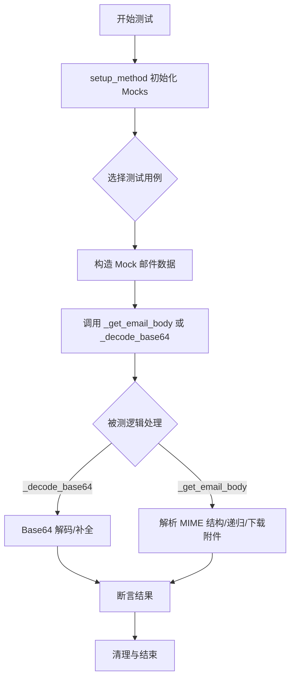

## 类结构

```
TestGmailReadBlock (测试类)
├── setup_method (初始化)
├── _encode_base64 (辅助方法)
├── test_single_part_text_plain (单部分纯文本)
├── test_multipart_alternative_plain_and_html (多部分替代文本)
├── test_html_only_email (纯HTML转文本)
├── test_html_fallback_when_html2text_unavailable (HTML回退机制)
├── test_nested_multipart_structure (嵌套结构解析)
├── test_attachment_body_content (附件正文处理)
├── test_no_readable_body (无正文情况)
├── test_base64_padding_handling (Base64填充处理)
├── test_recursion_depth_limit (递归深度限制)
├── test_malformed_base64_handling (错误Base64处理)
├── test_empty_data_handling (空数据处理)
└── test_attachment_download_failure (附件下载失败)
```

## 全局变量及字段


### `TestGmailReadBlock.gmail_block`
    
GmailReadBlock 类的实例，用于测试邮件正文解析功能。

类型：`GmailReadBlock`
    


### `TestGmailReadBlock.mock_service`
    
用于模拟 Gmail API 服务交互的 Mock 对象。

类型：`Mock`
    
    

## 全局函数及方法


### `TestGmailReadBlock.setup_method`

这是一个 Pytest 测试框架的标准钩子方法，用于在每个测试用例执行前初始化测试环境（固件），具体包括实例化被测的 `GmailReadBlock` 组件以及创建一个模拟的 Google 服务对象。

参数：

-   `self`：`TestGmailReadBlock`，测试类的实例，引用当前测试上下文。

返回值：`None`，无返回值，主要用于设置实例变量以供后续测试方法使用。

#### 流程图

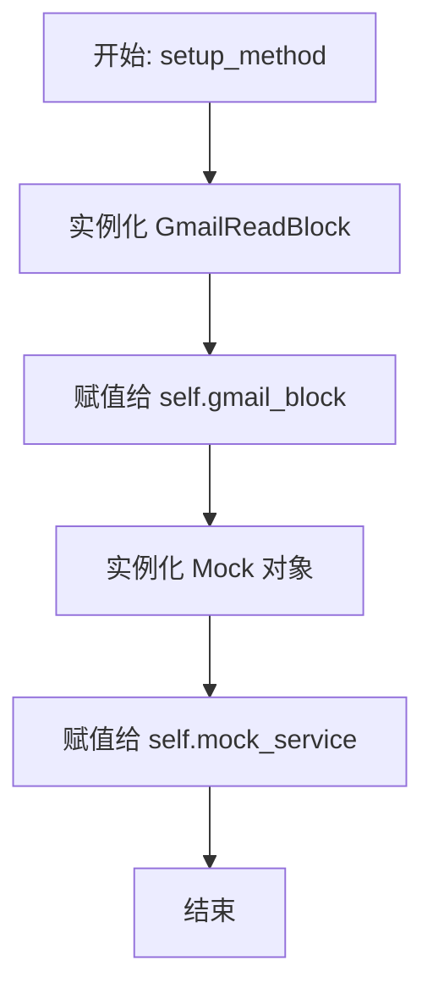

#### 带注释源码

```python
def setup_method(self):
    """Set up test fixtures."""
    # 创建被测类的实例，用于在测试中调用其方法
    self.gmail_block = GmailReadBlock()
    # 创建一个模拟对象，用于模拟 Gmail API 服务交互
    self.mock_service = Mock()
```


### `TestGmailReadBlock._encode_base64`

辅助方法，用于将输入的文本字符串编码为 URL 安全的 Base64 格式字符串。

参数：

- `text`：`str`，需要进行 Base64 编码的原始文本字符串。

返回值：`str`，经过 URL 安全 Base64 编码后的字符串。

#### 流程图

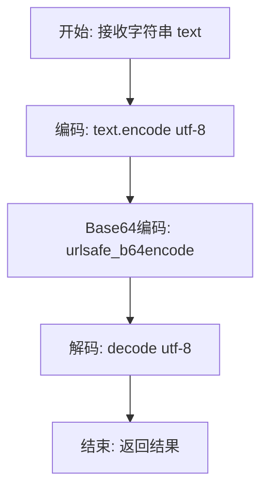

#### 带注释源码

```python
def _encode_base64(self, text: str) -> str:
    """Helper to encode text as base64 URL-safe."""
    # 将输入的字符串编码为 UTF-8 字节序列
    # 将字节序列进行 URL 安全的 Base64 编码
    # 将编码后的字节序列解码为字符串并返回
    return base64.urlsafe_b64encode(text.encode("utf-8")).decode("utf-8")
```


### `TestGmailReadBlock.test_single_part_text_plain`

测试解析单部分 text/plain 类型邮件正文的测试用例。该方法构造了一个模拟的简单文本邮件消息，并验证 `_get_email_body` 方法是否能正确提取并解码邮件正文。

参数：

- `self`：`TestGmailReadBlock`，测试类的实例，提供访问测试夹具（如 `gmail_block` 和 `mock_service`）的能力。

返回值：`None`，该方法不返回任何值，主要用于执行断言验证逻辑。

#### 流程图

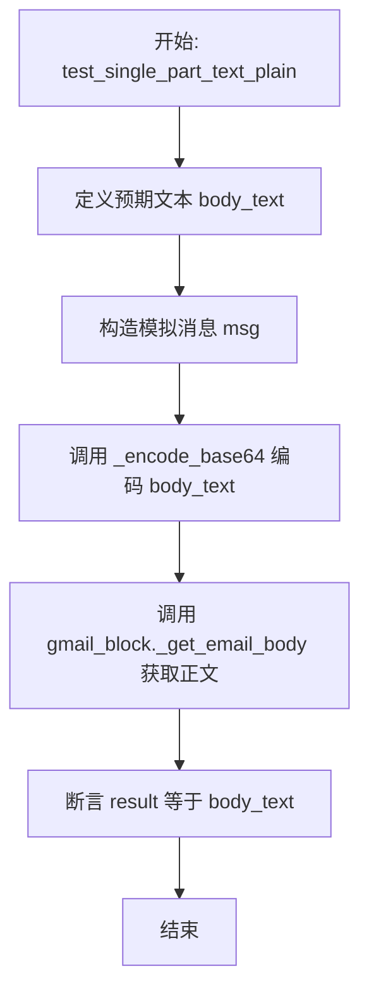

#### 带注释源码

```python
    @pytest.mark.asyncio
    async def test_single_part_text_plain(self):
        """Test parsing single-part text/plain email."""
        # 定义预期的纯文本邮件正文内容
        body_text = "This is a plain text email body."
        # 构造模拟的 Gmail 消息对象，包含 payload 和 base64 编码的正文数据
        msg = {
            "id": "test_msg_1",
            "payload": {
                "mimeType": "text/plain",
                "body": {"data": self._encode_base64(body_text)},
            },
        }

        # 调用被测方法 _get_email_body，传入模拟消息和服务对象
        result = await self.gmail_block._get_email_body(msg, self.mock_service)
        # 断言提取结果与预期文本一致
        assert result == body_text
```


### `TestGmailReadBlock.test_multipart_alternative_plain_and_html`

Tests the `GmailReadBlock` email body parsing logic to verify that it prefers plain text content over HTML content when processing a `multipart/alternative` email.

参数：

- `self`：`TestGmailReadBlock`，The test class instance providing access to the `GmailReadBlock` fixture and helper methods.

返回值：`None`，The function performs assertions and does not return a value.

#### 流程图

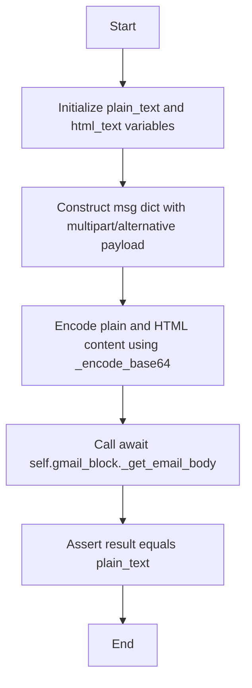

#### 带注释源码

```python
    async def test_multipart_alternative_plain_and_html(self):
        """Test parsing multipart/alternative with both plain and HTML parts."""
        # Define expected content for both plain text and HTML versions
        plain_text = "This is the plain text version."
        html_text = "<html><body><p>This is the HTML version.</p></body></html>"

        # Construct a mock Gmail message object simulating a multipart/alternative structure
        msg = {
            "id": "test_msg_2",
            "payload": {
                "mimeType": "multipart/alternative",
                "parts": [
                    {
                        "mimeType": "text/plain",
                        # Encode plain text data to mimic API response format
                        "body": {"data": self._encode_base64(plain_text)},
                    },
                    {
                        "mimeType": "text/html",
                        # Encode HTML data to mimic API response format
                        "body": {"data": self._encode_base64(html_text)},
                    },
                ],
            },
        }

        # Execute the method under test to extract the email body
        result = await self.gmail_block._get_email_body(msg, self.mock_service)
        
        # Verify that the result is the plain text, ensuring preference over HTML
        assert result == plain_text
```


### `TestGmailReadBlock.test_html_only_email`

测试解析仅包含 HTML 的电子邮件，并将其转换为纯文本的功能，通过模拟 `html2text` 库来验证转换逻辑。

参数：

- `self`：`TestGmailReadBlock`，测试类的实例。

返回值：`None`，无返回值（作为异步测试用例）。

#### 流程图

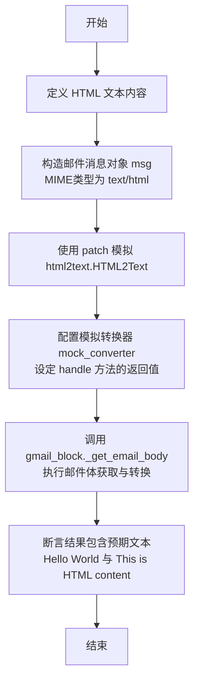

#### 带注释源码

```python
    @pytest.mark.asyncio
    async def test_html_only_email(self):
        """Test parsing HTML-only email with conversion to plain text."""
        # 1. 准备测试用的 HTML 文本数据
        html_text = (
            "<html><body><h1>Hello World</h1><p>This is HTML content.</p></body></html>"
        )

        # 2. 构造模拟的 Gmail API 消息对象，包含 text/html 类型的载荷和 Base64 编码的数据
        msg = {
            "id": "test_msg_3",
            "payload": {
                "mimeType": "text/html",
                "body": {"data": self._encode_base64(html_text)},
            },
        }

        # 3. 模拟 html2text 库的行为，避免引入真实的依赖
        with patch("html2text.HTML2Text") as mock_html2text:
            # 创建模拟的转换器实例
            mock_converter = Mock()
            # 设定当调用 handle 方法处理 HTML 文本时，返回转换后的纯文本
            mock_converter.handle.return_value = "Hello World\n\nThis is HTML content."
            mock_html2text.return_value = mock_converter

            # 4. 调用被测方法 _get_email_body，传入模拟消息和模拟服务
            result = await self.gmail_block._get_email_body(msg, self.mock_service)
            
            # 5. 验证返回结果中是否包含预期的文本内容，确认转换逻辑正确
            assert "Hello World" in result
            assert "This is HTML content" in result
```


### `TestGmailReadBlock.test_html_fallback_when_html2text_unavailable`

该测试方法用于验证当 `html2text` 库不可用或导入失败（抛出 `ImportError`）时，`GmailReadBlock` 的 `_get_email_body` 方法能否正确处理异常，并回退到返回原始 HTML 内容，而不是导致程序崩溃。

参数：

- `self`：`TestGmailReadBlock`，测试类的实例，提供访问测试夹具（如 `gmail_block` 和辅助方法）的能力。

返回值：`None`，该方法不返回值，主要用于通过断言验证行为。

#### 流程图

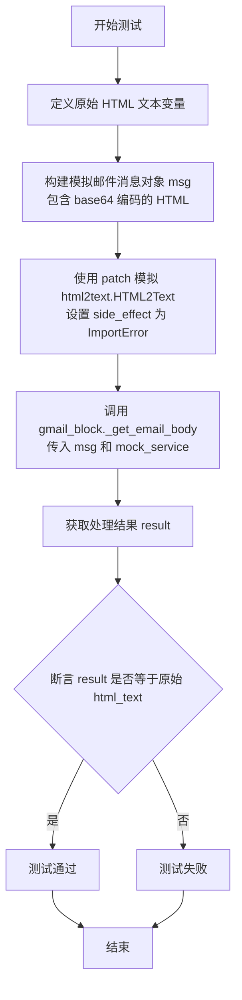

#### 带注释源码

```python
    @pytest.mark.asyncio
    async def test_html_fallback_when_html2text_unavailable(self):
        """Test fallback to raw HTML when html2text is not available."""
        # 定义预期的 HTML 内容
        html_text = "<html><body><p>HTML content</p></body></html>"

        # 构建一个模拟的 Gmail 消息对象
        msg = {
            "id": "test_msg_4",
            "payload": {
                # 指定 MIME 类型为 text/html
                "mimeType": "text/html",
                # 将 HTML 文本进行 Base64 URL 安全编码并放入 body.data 中
                "body": {"data": self._encode_base64(html_text)},
            },
        }

        # 使用 patch 装饰器上下文管理器模拟 html2text.HTML2Text
        # 设置 side_effect=ImportError 以模拟依赖库不可用的情况
        with patch("html2text.HTML2Text", side_effect=ImportError):
            # 调用 GmailReadBlock 的实际处理方法
            result = await self.gmail_block._get_email_body(msg, self.mock_service)
            # 断言：验证结果是否回退为原始 HTML 文本
            assert result == html_text
```


### `TestGmailReadBlock.test_nested_multipart_structure`

该测试方法用于验证 `GmailReadBlock` 处理深度嵌套的多部分（multipart）邮件结构的能力。它构建了一个包含 `multipart/mixed` 和 `multipart/alternative` 嵌套层的模拟邮件消息，并断言系统能够正确递归解析并提取出最内层的纯文本正文内容。

参数：

- `self`：`TestGmailReadBlock`，测试类的实例，用于访问测试辅助方法和被测对象。

返回值：`None`，该方法为异步单元测试，主要通过断言验证行为，不直接返回业务数据。

#### 流程图

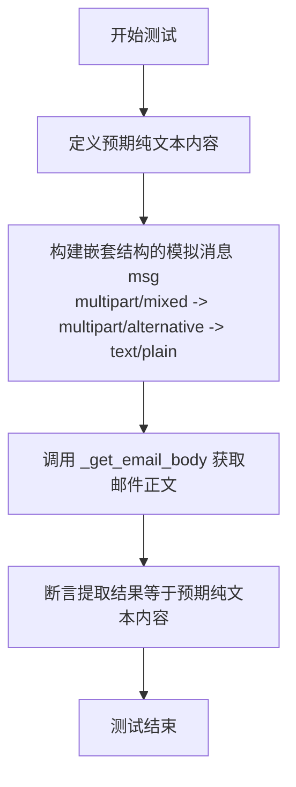

#### 带注释源码

```python
    @pytest.mark.asyncio
    async def test_nested_multipart_structure(self):
        """Test parsing deeply nested multipart structure."""
        # 定义预期的纯文本内容，用于后续断言
        plain_text = "Nested plain text content."

        # 构造一个具有深度嵌套结构的模拟邮件消息对象
        # 结构层级：
        # 1. 最外层: multipart/mixed
        # 2. 中间层: multipart/alternative
        # 3. 最内层: text/plain (包含实际内容)
        msg = {
            "id": "test_msg_5",
            "payload": {
                "mimeType": "multipart/mixed",
                "parts": [
                    {
                        "mimeType": "multipart/alternative",
                        "parts": [
                            {
                                "mimeType": "text/plain",
                                # 使用辅助方法将文本编码为 Base64 格式
                                "body": {"data": self._encode_base64(plain_text)},
                            },
                        ],
                    },
                ],
            },
        }

        # 调用被测方法 _get_email_body，传入模拟消息和模拟服务对象
        result = await self.gmail_block._get_email_body(msg, self.mock_service)

        # 验证解析出的结果是否与原始纯文本一致
        assert result == plain_text
```


### `TestGmailReadBlock.test_attachment_body_content`

该测试方法用于验证当邮件正文内容作为附件存储（而非直接内嵌在 payload 中）时，`GmailReadBlock` 能够正确模拟 API 调用获取附件数据，并成功解码还原为原始文本内容。

参数：

- `self`：`TestGmailReadBlock`，测试类的实例，提供测试上下文和辅助方法。

返回值：`None`，该方法为单元测试函数，不返回业务数据，通过断言验证逻辑正确性。

#### 流程图

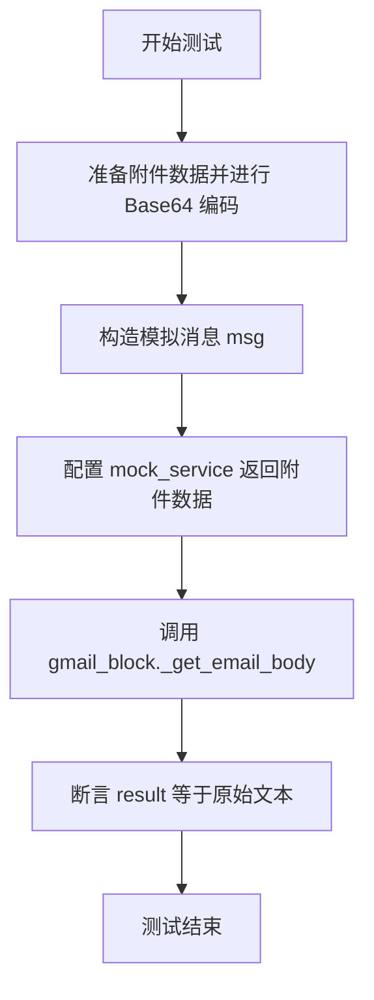

#### 带注释源码

```python
    @pytest.mark.asyncio
    async def test_attachment_body_content(self):
        """Test parsing email where body is stored as attachment."""
        # 1. 准备测试用的附件数据，并对其进行 Base64 编码
        attachment_data = self._encode_base64("Body content from attachment.")

        # 2. 构造一个模拟的邮件消息对象
        # 注意这里的 body 部分没有 'data' 字段，而是有 'attachmentId'
        msg = {
            "id": "test_msg_6",
            "payload": {
                "mimeType": "text/plain",
                "body": {"attachmentId": "attachment_123"},
            },
        }

        # 3. Mock Gmail API 的附件下载接口
        # 当调用 attachments().get() 并执行 execute() 时，返回包含 Base64 数据的字典
        self.mock_service.users().messages().attachments().get().execute.return_value = {
            "data": attachment_data
        }

        # 4. 调用被测方法 _get_email_body，传入消息对象和 mock 的服务对象
        result = await self.gmail_block._get_email_body(msg, self.mock_service)
        
        # 5. 断言：验证解码后的结果是否为预期的原始文本
        assert result == "Body content from attachment."
```


### `TestGmailReadBlock.test_no_readable_body`

测试当邮件 payload 包含不可读的内容类型（如 'application/octet-stream'）且没有 body 数据时的场景。验证 `_get_email_body` 方法是否能够正确处理该情况，并返回特定的后备消息。

参数：

- `self`：`TestGmailReadBlock`，测试类实例，用于访问被测试对象及测试辅助方法。

返回值：`None`，无返回值（主要执行断言操作以验证行为）。

#### 流程图

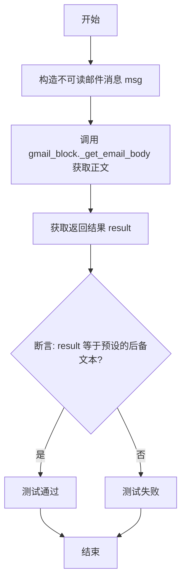

#### 带注释源码

```python
    @pytest.mark.asyncio  # 标记该测试方法为异步测试
    async def test_no_readable_body(self):
        """Test email with no readable body content."""  # 测试不可读正文的邮件
        
        # 构造一个模拟的消息对象，MIME类型为二进制流且body为空
        msg = {
            "id": "test_msg_7",
            "payload": {
                "mimeType": "application/octet-stream",  # 设置为不可读的二进制类型
                "body": {},  # 正文数据为空
            },
        }

        # 调用被测试的方法 _get_email_body，传入模拟消息和模拟服务
        result = await self.gmail_block._get_email_body(msg, self.mock_service)
        
        # 断言返回结果等于预期的默认提示文本，验证处理逻辑的正确性
        assert result == "This email does not contain a readable body."
```


### `TestGmailReadBlock.test_base64_padding_handling`

测试 GmailReadBlock 在 Base64 编码数据缺少填充字符时的解码处理能力。

参数：

-  `self`：`TestGmailReadBlock`，测试类的实例，用于访问测试夹具和被测方法。

返回值：`None`，无返回值（测试方法主要执行断言）。

#### 流程图

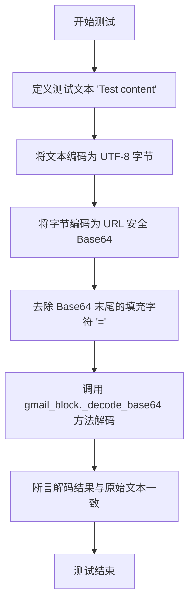

#### 带注释源码

```python
@pytest.mark.asyncio
async def test_base64_padding_handling(self):
    """Test proper handling of base64 data with missing padding."""
    # 定义预期的原始文本内容
    text = "Test content"

    # 使用标准库将文本编码为 URL 安全的 Base64 字符串
    encoded = base64.urlsafe_b64encode(text.encode("utf-8")).decode("utf-8")

    # 移除 Base64 字符串末尾的填充字符（'='），模拟缺少填充的数据
    encoded_no_padding = encoded.rstrip("=")

    # 调用被测方法，尝试解码缺少填充的 Base64 数据
    result = self.gmail_block._decode_base64(encoded_no_padding)

    # 断言解码结果是否与原始文本相等
    assert result == text
```


### `TestGmailReadBlock.test_recursion_depth_limit`

测试 `GmailReadBlock` 在处理极深嵌套的邮件结构时，是否能正确触发递归深度限制机制，并返回预期的不可读正文提示信息。

参数：

- `self`：`TestGmailReadBlock`，测试类实例，包含测试用的 GmailBlock 对象和 Mock 服务。

返回值：`None`，无返回值，该方法通过 assert 语句验证逻辑。

#### 流程图

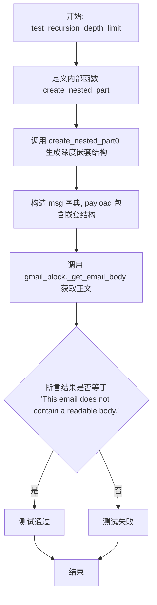

#### 带注释源码

```python
@pytest.mark.asyncio
async def test_recursion_depth_limit(self):
    """Test that recursion depth is properly limited."""

    # Create a deeply nested structure that would exceed the limit
    # 定义递归函数创建嵌套的邮件部分结构
    def create_nested_part(depth):
        # 当深度超过15时（假定限制为10），返回一个包含实际内容的叶子节点
        if depth > 15:  # Exceed the limit of 10
            return {
                "mimeType": "text/plain",
                "body": {"data": self._encode_base64("Deep content")},
            }
        # 否则返回一个 multipart 节点，继续递归
        return {
            "mimeType": "multipart/mixed",
            "parts": [create_nested_part(depth + 1)],
        }

    # 构造测试消息，payload 为深度嵌套的结构
    msg = {
        "id": "test_msg_8",
        "payload": create_nested_part(0),
    }

    # 调用被测方法获取邮件正文
    result = await self.gmail_block._get_email_body(msg, self.mock_service)
    # Should return fallback message due to depth limit
    # 断言结果：因为超过了递归深度限制，应该返回不可读的提示信息，而不是"Deep content"
    assert result == "This email does not contain a readable body."
```


### `TestGmailReadBlock.test_malformed_base64_handling`

测试 `GmailReadBlock` 中的 `_decode_base64` 方法在接收到格式错误的 base64 数据时的处理逻辑，确保其返回 `None` 而非抛出异常。

参数：

-   `self`：`TestGmailReadBlock`，测试类的实例，用于访问被测对象 `gmail_block`。

返回值：`None`，该方法无返回值，主要用于断言验证。

#### 流程图

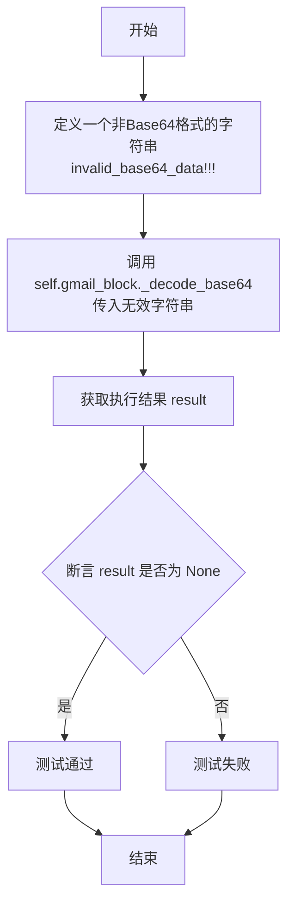

#### 带注释源码

```python
    """Test handling of malformed base64 data."""
    # 调用 GmailReadBlock 的内部方法 _decode_base64，
    # 传入一个明显不符合 Base64 编码规则的字符串。
    result = self.gmail_block._decode_base64("invalid_base64_data!!!")
    
    # 断言验证：对于错误的数据，方法应当返回 None，而不是抛出解码错误。
    assert result is None
```


### `TestGmailReadBlock.test_empty_data_handling`

测试当传入空字符串或 None 作为输入时，`GmailReadBlock` 的内部方法 `_decode_base64` 是否能正确处理并返回 None。

参数：

-   `self`：`TestGmailReadBlock`，测试类实例本身，用于访问被测对象 `gmail_block`。

返回值：`None`，该测试方法主要用于执行断言验证，无实际返回值。

#### 流程图

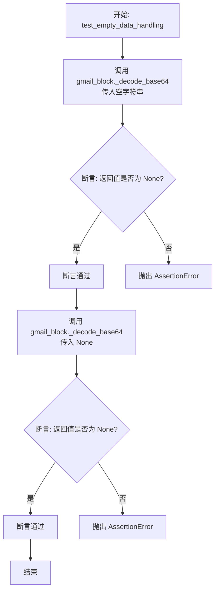

#### 带注释源码

```python
@pytest.mark.asyncio
async def test_empty_data_handling(self):
    """Test handling of empty or None data."""
    # 测试当输入为空字符串时，_decode_base64 方法应返回 None
    assert self.gmail_block._decode_base64("") is None
    # 测试当输入为 None 时，_decode_base64 方法应返回 None
    assert self.gmail_block._decode_base64(None) is None
```


### `TestGmailReadBlock.test_attachment_download_failure`

该测试用例用于验证 `GmailReadBlock` 在处理邮件正文作为附件且附件下载失败时的异常处理逻辑。它通过模拟服务调用抛出异常的场景，确保系统能够优雅地处理错误，并返回“邮件不包含可读正文”的默认提示信息，而不是导致测试或程序崩溃。

参数：

- `self`：`TestGmailReadBlock`，测试类的实例，用于访问初始化的被测对象（`gmail_block`）和模拟的服务对象（`mock_service`）。

返回值：`None`，这是一个 pytest 异步测试方法，不返回任何值，主要通过断言来验证行为是否符合预期。

#### 流程图

```mermaid
graph TD
    A[开始测试 test_attachment_download_failure] --> B[构造模拟消息 msg payload]
    B --> C[设置 mock_service.users...get().execute 抛出 Exception]
    C --> D[调用 await gmail_block._get_email_body msg, mock_service]
    D --> E[捕获异常并返回默认提示信息]
    E --> F[获取返回结果 result]
    F --> G{断言 result 是否等于 'This email does not contain a readable body.'}
    G -- 是 --> H[测试通过]
    G -- 否 --> I[测试失败]
```

#### 带注释源码

```python
    @pytest.mark.asyncio
    async def test_attachment_download_failure(self):
        """Test handling of attachment download failure."""
        # 构造一个模拟的邮件消息对象，其正文的 data 字段被一个 attachmentId 替代
        msg = {
            "id": "test_msg_9",
            "payload": {
                "mimeType": "text/plain",
                "body": {"attachmentId": "invalid_attachment"}, # 指定附件ID
            },
        }

        # Mock attachment download failure
        # 设置 mock 服务的附件下载接口，在调用 execute 方法时抛出异常，模拟下载失败的情况
        self.mock_service.users().messages().attachments().get().execute.side_effect = (
            Exception("Download failed")
        )

        # 调用被测方法 _get_email_body
        # 预期内部逻辑会捕获异常，并返回 "This email does not contain a readable body."
        result = await self.gmail_block._get_email_body(msg, self.mock_service)
        
        # 断言返回值是否为预期的默认错误提示信息
        assert result == "This email does not contain a readable body."
```


## 关键组件


### 电子邮件正文解析逻辑
负责解析不同 MIME 结构（如单一文本、多部分/替代、嵌套多部分）的电子邮件内容，优先选择纯文本而非 HTML，并优雅地处理附件。

### Base64 解码处理
实现了健壮的 Base64 URL 安全解码机制，能够自动处理缺失的填充字符（'='），并捕获格式错误或空输入数据，防止解析过程中的崩溃。

### HTML 转文本转换器
集成 HTML 到纯文本的转换功能，利用 `html2text` 库将 HTML 邮件正文转换为可读文本，并在库不可用时具备回退机制。

### 附件数据获取
负责与 Gmail API 服务交互，当邮件正文数据通过 attachmentId 引用而非直接内联存储时，从附件中下载并解析正文内容。

### 递归深度保护
在递归解析深度嵌套的 multipart 邮件结构时实施的安全限制机制，防止资源耗尽，并在超过深度限制时返回默认文本。


## 问题及建议


### 已知问题

-   **硬编码的错误消息**：测试中显示代码在无法读取正文时返回固定的字符串（如 "This email does not contain a readable body."），这种做法不支持国际化，且增加了后期修改维护成本。
-   **同步 I/O 阻塞异步循环**：虽然代码使用了 `async/await`，但从测试用例 `mock_service.users().messages().attachments().get().execute()` 推测，底层的 Google API 调用可能是同步阻塞的。在异步函数中直接调用同步 I/O 会阻塞事件循环，降低并发性能。
-   **异常吞噬导致调试困难**：在 `test_attachment_download_failure` 等测试用例中，代码在发生异常（如下载失败、解码失败）时仅返回通用提示字符串，而掩盖了具体的错误堆栈和原因（如网络错误、权限不足），不利于问题排查。
-   **依赖库降级策略导致输出不一致**：当 `html2text` 不可用时，代码回退到返回原始 HTML。这种降级策略可能导致下游依赖纯文本的系统（如 LLM 处理逻辑）接收到包含大量 HTML 标签的脏数据。
-   **递归深度限制过于严格**：测试注释提到 "Exceed the limit of 10"，表明硬编码了递归深度限制为 10。对于某些包含复杂转发链或嵌套附件的正常邮件，该阈值可能过低，导致解析失败。

### 优化建议

-   **采用迭代方式替代递归**：将解析 MIME 结构的递归逻辑改为基于栈或队列的迭代方式，以彻底消除 Python 递归深度限制带来的风险，并提高解析深层嵌套结构的稳定性。
-   **实现真正的异步 I/O**：使用支持异步的 Google API 客户端库，或者使用 `run_in_executor` 将同步的 `execute()` 调用包装在线程池中执行，避免阻塞主事件循环。
-   **引入结构化日志记录**：在捕获异常并返回通用用户提示的同时，应记录详细的错误日志（包括异常类型、消息和邮件 ID），以便运维人员能够快速定位问题。
-   **配置化关键参数**：将递归深度限制、Base64 解码超时时间、最大文本长度限制等“魔法数字”提取为可配置参数，赋予业务方根据实际场景调整的灵活性。
-   **定义明确的数据模型**：输入参数 `msg` 目前为原始字典结构，建议在内部实现中使用 Pydantic 或 TypedDict 定义清晰的数据模型，增强代码的可读性和类型安全性，减少因字典键拼写错误导致的运行时异常。


## 其它


### 设计目标与约束

1.  **鲁棒性优先**：系统能够处理各种非标准或异常的邮件格式，包括 Base64 编码缺失填充、空数据、畸形 Base64 以及无法解析的 MIME 类型。
2.  **递归深度限制**：为了防止恶意或错误的邮件结构导致堆栈溢出（Stack Overflow）或无限递归，设计了对邮件体解析深度的硬性限制（测试案例显示限制约为 10 层）。
3.  **文本格式偏好**：在处理多部分邮件时，优先提取纯文本内容。如果只有 HTML 内容，尝试将其转换为纯文本；如果转换失败，则回退到原始 HTML。
4.  **异步处理**：核心逻辑设计为异步执行，以适应高并发 I/O 密集型的应用场景。
5.  **依赖降级策略**：对于非核心依赖库（如 `html2text`），如果环境中不可用，系统不应崩溃，而应降级处理（例如直接返回 HTML 源码）。

### 错误处理与异常设计

1.  **Base64 解码容错**：`_decode_base64` 方法内部实现了异常捕获机制，对于格式错误的 Base64 字符串不抛出异常，而是返回 `None`，保证解析流程不中断。
2.  **空值与空串处理**：对于输入为 `None` 或空字符串的情况，统一返回 `None`，避免后续处理出现 `AttributeError`。
3.  **外部库导入处理**：当 `html2text` 库无法导入时（`ImportError`），系统捕获该异常并跳过 HTML 到文本的转换步骤，直接返回原始 HTML 内容。
4.  **网络请求异常处理**：在通过 API 下载邮件附件时，如果发生网络错误或 API 返回异常，捕获异常并返回预设的默认错误消息，防止进程崩溃。
5.  **默认兜底机制**：当任何路径无法提取到有效邮件正文时（如深度超限、无 readable body），统一返回字符串 `"This email does not contain a readable body."`，确保调用者始终获得字符串类型的返回值。

### 数据流与状态机

1.  **数据流向**：
    *   **输入**：Gmail API 返回的原始消息字典结构（包含 `payload`, `parts`, `body` 等字段）及已认证的 Gmail Service 对象。
    *   **解析过程**：
        *   **MIME 类型判断**：首先检查 `mimeType`。
        *   **分支处理**：
            *   如果是 `multipart`，递归遍历 `parts` 列表。
            *   如果是 `text/plain`，直接解码并返回。
            *   如果是 `text/html`，尝试使用 `html2text` 转换。
            *   如果包含 `attachmentId`，通过 Service 对象调用 API 下载附件数据。
        *   **数据清洗**：对所有 Base64 数据进行 URL 安全解码，并自动处理缺失的 Padding。
    *   **输出**：经过清洗和转换的纯文本字符串。

2.  **状态机逻辑（递归控制）**：
    *   **初始状态**：接收到 Message 对象，当前深度 = 0。
    *   **递归状态**：每进入一层嵌套的 `multipart` 结构，深度 +1。
    *   **判断状态**：
        *   若深度 > 限制值（如 10），终止递归，返回无效 Body 提示。
        *   若找到有效文本内容，立即返回该内容。
        *   若遍历结束未找到内容，返回无效 Body 提示。

### 外部依赖与接口契约

1.  **外部库依赖**：
    *   `html2text`：用于将 HTML 内容转换为 Markdown/纯文本。这是一个**可选依赖**，系统设计允许其缺失。

2.  **接口契约**：
    *   **`_get_email_body` 方法**：
        *   输入：`msg` (Dict), `service` (Object)。`msg` 必须遵循 Gmail API 的 Message 资源结构，需包含 `id` 和 `payload` 字段。
        *   输出：`str`。始终返回字符串，成功时为邮件正文，失败时为预设的错误提示。
    *   **`_decode_base64` 方法**：
        *   输入：`data` (str or None)。Base64 编码的 URL 安全字符串。
        *   输出：`str or None`。解码后的 UTF-8 字符串，输入无效时返回 `None`。
    *   **Gmail API Service Mock**：
        *   约定：必须支持链式调用 `service.users().messages().attachments().get().execute()`。
        *   契约：`execute()` 方法返回包含 `data` 字段的字典，该字段值需为 Base64 编码的字符串。若调用失败应抛出 Exception。

    