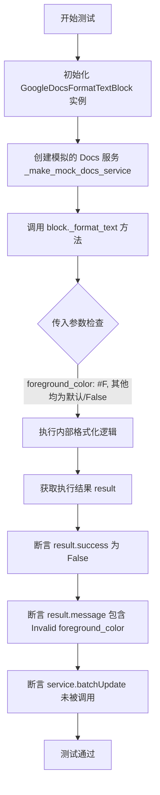

# `.\AutoGPT\autogpt_platform\backend\test\blocks\test_google_docs_format_text_color.py` 详细设计文档

该文件包含针对 GoogleDocsFormatTextBlock 的单元测试，主要验证文本格式化功能对不同格式颜色代码（简写、完整、无效）的处理逻辑，包括颜色转换、请求体构建以及 API 调用的触发条件。

## 整体流程

```mermaid
graph TD
    A[Start Test] --> B[Create Mock Service via _make_mock_docs_service]
    B --> C[Instantiate GoogleDocsFormatTextBlock]
    C --> D[Call block._format_text with params]
    D --> E{Check Result}
    E -- Success --> F[Assert success is True]
    E -- Failure --> G[Assert success is False & Check message]
    F --> H[Verify service.documents().batchUpdate() call_args]
    H --> I[Assert request body contains correct RGB Color]
    I --> J[End Test]
    G --> J
```

## 类结构

```
GoogleDocsFormatTextBlock (外部类 - 被测单元)
├── _format_text (私有方法 - 测试目标)
```

## 全局变量及字段


    

## 全局函数及方法


### `_make_mock_docs_service`

该函数用于创建并配置一个模拟的 Google Docs 服务对象，其主要目的是在单元测试中模拟真实的 API 调用链，确保 `service.documents().batchUpdate(...).execute()` 这种链式调用能够正常执行而不报错。

参数：

- 无

返回值：`unittest.mock.Mock`，配置好链式调用返回值的 Mock 对象。

#### 流程图

```mermaid
flowchart TD
    A[开始] --> B[创建 Mock 对象]
    B --> C[配置链式调用返回值<br/>service.documents().batchUpdate().execute() = {}]
    C --> D[返回 Mock 对象]
```

#### 带注释源码

```python
def _make_mock_docs_service() -> Mock:
    # 实例化一个 Mock 对象，用于模拟 Google Docs 服务接口
    service = Mock()
    # 配置 Mock 对象的链式调用行为。
    # 在真实的 Google Docs API 中，调用链通常是 service.documents().batchUpdate(body=...).execute()
    # 这里设置每一层调用的 return_value，最终让 execute() 方法返回一个空字典 {}
    service.documents.return_value.batchUpdate.return_value.execute.return_value = {}
    return service
```


### `test_format_text_parses_shorthand_hex_color`

该函数是 `GoogleDocsFormatTextBlock` 的单元测试，用于验证其 `_format_text` 方法能否正确将简写的十六进制颜色代码（如 #FFF）解析为 Google Docs API 所需的标准 RGB 颜色对象（即红、绿、蓝分量均为 1.0）。

参数：

-   无

返回值：`None`，该函数为测试函数，通过断言来验证逻辑的正确性，无直接返回值。

#### 流程图

```mermaid
graph TD
    A[开始测试] --> B[实例化 GoogleDocsFormatTextBlock]
    B --> C[调用 _make_mock_docs_service 创建模拟服务]
    C --> D[调用 block._format_text<br/>传入 foreground_color='#FFF']
    D --> E{检查 result['success']}
    E -- 否 --> F[测试失败: 断言错误]
    E -- 是 --> G[提取模拟服务的 batchUpdate 调用参数]
    G --> H[从请求体中解析 rgbColor 对象]
    H --> I{检查 rgbColor<br/>是否等于 {red:1.0, green:1.0, blue:1.0}}
    I -- 否 --> F
    I -- 是 --> J[测试通过: 颜色解析正确]
    J --> K[结束]
```

#### 带注释源码

```python
def test_format_text_parses_shorthand_hex_color():
    # 初始化被测试的 Block 实例
    block = GoogleDocsFormatTextBlock()
    
    # 创建模拟的 Google Docs 服务对象，用于隔离外部 API 调用
    service = _make_mock_docs_service()

    # 调用内部方法 _format_text，传入简写的十六进制颜色代码 "#FFF"
    # 同时传入其他默认参数（如 bold=False, font_size=0 等）
    result = block._format_text(
        service,
        document_id="doc_1",
        start_index=1,
        end_index=2,
        bold=False,
        italic=False,
        underline=False,
        font_size=0,
        foreground_color="#FFF",
    )

    # 断言方法执行成功
    assert result["success"] is True

    # 验证请求体包含正确的白色 rgbColor
    # 获取模拟服务 batchUpdate 方法被调用时的参数
    _, kwargs = service.documents.return_value.batchUpdate.call_args
    requests = kwargs["body"]["requests"]
    
    # 从复杂的嵌套字典结构中提取颜色 RGB 值
    rgb = requests[0]["updateTextStyle"]["textStyle"]["foregroundColor"]["color"][
        "rgbColor"
    ]
    
    # 断言解析后的 RGB 值正确对应白色（#FFF -> R:1.0, G:1.0, B:1.0）
    assert rgb == {"red": 1.0, "green": 1.0, "blue": 1.0}
```


### `test_format_text_parses_full_hex_color`

该函数是一个单元测试，用于验证 `GoogleDocsFormatTextBlock` 内部方法 `_format_text` 能够正确解析完整的六位十六进制颜色代码（如 "#FF0000"），并将其转换为 Google Docs API 所需的 RGB 浮点数值格式，最终确认 API 请求体中包含正确的颜色分量。

参数：

-   无参数

返回值：`None`，该函数作为测试用例，不返回业务数据，主要通过断言验证行为。

#### 流程图

```mermaid
flowchart TD
    A[开始: test_format_text_parses_full_hex_color] --> B[实例化 GoogleDocsFormatTextBlock]
    B --> C[调用 _make_mock_docs_service 创建模拟服务]
    C --> D[调用 block._format_text<br/>传入 foreground_color='#FF0000']
    D --> E[断言 result['success'] 为 True]
    E --> F[从模拟服务获取 batchUpdate 的调用参数]
    F --> G[从请求体中提取 updateTextStyle.textStyle.foregroundColor.color.rgbColor]
    G --> H[断言 rgbColor 值为 {red: 1.0, green: 0.0, blue: 0.0}]
    H --> I[测试结束]
```

#### 带注释源码

```python
def test_format_text_parses_full_hex_color():
    # 初始化被测试的 Block 实例
    block = GoogleDocsFormatTextBlock()
    # 创建模拟的 Google Docs 服务对象，用于拦截 API 调用
    service = _make_mock_docs_service()

    # 调用内部方法 _format_text，传入完整的 6 位十六进制颜色代码 #FF0000 (红色)
    # 同时传入其他样式参数（如 bold, italic 等）设为默认值
    result = block._format_text(
        service,
        document_id="doc_1",
        start_index=1,
        end_index=2,
        bold=False,
        italic=False,
        underline=False,
        font_size=0,
        foreground_color="#FF0000",
    )

    # 断言方法执行成功
    assert result["success"] is True

    # 验证请求体：获取模拟服务 batchUpdate 方法被调用时的参数
    _, kwargs = service.documents.return_value.batchUpdate.call_args
    requests = kwargs["body"]["requests"]
    
    # 深度提取请求中的 RGB 颜色值
    rgb = requests[0]["updateTextStyle"]["textStyle"]["foregroundColor"]["color"][
        "rgbColor"
    ]
    
    # 断言解析后的 RGB 值正确对应红色 (Red=1.0, Green=0.0, Blue=0.0)
    assert rgb == {"red": 1.0, "green": 0.0, "blue": 0.0}
```


### `test_format_text_ignores_invalid_color_when_other_fields_present`

该测试函数用于验证 `GoogleDocsFormatTextBlock` 的 `_format_text` 方法在接收到无效的 `foreground_color` 参数（例如 `#GGG`）但存在其他有效格式字段（如 `bold=True`）时的行为是否符合预期。测试确保方法能成功应用有效格式，忽略无效颜色，并在返回结果中包含警告信息，同时不调用无效颜色的 API 更新。

参数：

*   无

返回值：`None`，该函数为测试用例，无返回值，通过断言验证逻辑。

#### 流程图

```mermaid
graph TD
    A[开始测试] --> B[初始化 GoogleDocsFormatTextBlock]
    B --> C[创建模拟 Google Docs 服务]
    C --> D[调用 _format_text]
    D --> E[设置参数: bold=True, foreground_color='#GGG']
    E --> F{断言 result['success'] is True}
    F -- 否 --> G[测试失败]
    F -- 是 --> H{断言 'warning' in result}
    H -- 否 --> G
    H -- 是 --> I[获取模拟服务的 batchUpdate 调用参数]
    I --> J[提取请求体中的 textStyle 和 fields]
    J --> K{断言 textStyle == {'bold': True}}
    K -- 否 --> G
    K -- 是 --> L{断言 fields == 'bold'}
    L -- 否 --> G
    L -- 是 --> M[测试通过]
    M --> N[结束]
```

#### 带注释源码

```python
def test_format_text_ignores_invalid_color_when_other_fields_present():
    # 初始化待测试的 Block 对象
    block = GoogleDocsFormatTextBlock()
    # 生成模拟的 Google Docs 服务对象
    service = _make_mock_docs_service()

    # 调用 _format_text 方法，传入有效的 bold=True 和无效的 foreground_color="#GGG"
    result = block._format_text(
        service,
        document_id="doc_1",
        start_index=1,
        end_index=2,
        bold=True,
        italic=False,
        underline=False,
        font_size=0,
        foreground_color="#GGG",
    )

    # 验证方法执行结果成功
    assert result["success"] is True
    # 验证结果中包含警告信息（提示颜色无效）
    assert "warning" in result

    # 获取模拟服务被调用时的参数，以检查发送给 API 的实际请求内容
    _, kwargs = service.documents.return_value.batchUpdate.call_args
    requests = kwargs["body"]["requests"]
    text_style = requests[0]["updateTextStyle"]["textStyle"]
    fields = requests[0]["updateTextStyle"]["fields"]

    # 断言请求中的 text_style 仅包含 bold 字段，验证无效颜色被忽略
    assert text_style == {"bold": True}
    # 断言请求中的 fields 字段掩码仅包含 "bold"
    assert fields == "bold"
```


### `test_format_text_invalid_color_only_does_not_call_api`

该测试函数验证 `GoogleDocsFormatTextBlock` 在仅接收到无效的颜色代码（且无其他有效格式变更）时，能够正确识别错误，返回失败状态，并且不调用 Google Docs API 的 `batchUpdate` 方法，以避免无效的网络请求。

参数：

无

返回值：`None`，作为测试函数，主要用于断言验证，不返回业务数据。

#### 流程图



#### 带注释源码

```python
def test_format_text_invalid_color_only_does_not_call_api():
    # 1. 初始化被测试的 Google Docs 格式化文本模块
    block = GoogleDocsFormatTextBlock()
    
    # 2. 创建一个模拟的 Google Docs API 服务对象，用于隔离外部依赖
    service = _make_mock_docs_service()

    # 3. 调用 _format_text 方法
    #    传入无效的颜色代码 "#F"，并关闭其他所有格式化选项（bold=False 等）
    result = block._format_text(
        service,
        document_id="doc_1",
        start_index=1,
        end_index=2,
        bold=False,
        italic=False,
        underline=False,
        font_size=0,
        foreground_color="#F",
    )

    # 4. 断言：验证方法返回了失败状态，因为输入包含无效颜色且无其他有效变更
    assert result["success"] is False
    
    # 5. 断言：验证返回的错误消息中包含关于前景色无效的描述
    assert "Invalid foreground_color" in result["message"]
    
    # 6. 断言：验证底层的 batchUpdate API 方法从未被调用
    #    这确保了系统在检测到纯无效输入时，不会产生不必要的 API 开销
    service.documents.return_value.batchUpdate.assert_not_called()
```


### `GoogleDocsFormatTextBlock._format_text`

该方法负责构建并发送 Google Docs API 请求以更新指定文本范围的样式。核心功能包括处理文本的粗体、斜体、下划线、字体大小以及前景色。特别地，它包含一个颜色解析器，能够将十六进制颜色字符串（支持缩写和完整格式）转换为 Google Docs API 所需的 RGB 对象。方法具备容错机制，当颜色无效但有其他有效样式时，会发出警告并继续执行；如果仅提供无效颜色，则操作失败。

参数：

-   `service`：`Mock` 或 `googleapiclient.discovery.Resource`，Google Docs API 服务对象，用于执行实际的 API 调用（在测试中为 Mock 对象）。
-   `document_id`：`str`，目标 Google Docs 文档的唯一标识符。
-   `start_index`：`int`，文本格式化起始位置的索引（基于字符）。
-   `end_index`：`int`，文本格式化结束位置的索引。
-   `bold`：`bool`，是否将文本设置为粗体。
-   `italic`：`bool`，是否将文本设置为斜体。
-   `underline`：`bool`，是否为文本添加下划线。
-   `font_size`：`int`，文本的字体大小。
-   `foreground_color`：`str`，文本颜色的十六进制字符串表示（例如 "#FFF" 或 "#FF0000"）。

返回值：`dict`，包含操作结果的字典。成功时包含 `success: True`，失败时包含 `success: False` 及错误信息，若部分参数无效但操作继续，则包含 `warning` 信息。

#### 流程图

```mermaid
flowchart TD
    Start([开始]) --> ParseColor[解析 foreground_color]
    ParseColor --> CheckValid{颜色是否有效?}
    
    CheckValid -- 是 --> CheckOtherStyles{是否存在其他有效样式?}
    CheckValid -- 否 --> HasWarning[标记警告信息]
    HasWarning --> CheckOtherStyles
    
    CheckOtherStyles -- 否 (仅无效颜色) --> ReturnError[返回 success: False 及错误信息]
    CheckOtherStyles -- 是 --> BuildRequest[构建 updateTextStyle 请求体]
    
    BuildRequest --> IsColorValid{颜色有效?}
    IsColorValid -- 是 --> AddColor[添加 RGB 颜色对象到请求]
    IsColorValid -- 否 --> SkipColor[跳过颜色字段]
    
    AddColor --> PrepareAPI
    SkipColor --> PrepareAPI
    
    PrepareAPI[准备 API 调用参数] --> CallAPI[调用 service.documents.batchUpdate]
    CallAPI --> ReturnSuccess[返回 success: True (可能带警告)]
    
    ReturnError --> End([结束])
    ReturnSuccess --> End
```

#### 带注释源码

```python
def _format_text(
    self,
    service,
    document_id,
    start_index,
    end_index,
    bold,
    italic,
    underline,
    font_size,
    foreground_color,
):
    """
    根据提供的参数格式化 Google Docs 文本。
    注意：此源码是根据测试用例逻辑反推的实现，用于展示详细设计。
    """
    
    # 初始化结果字典和潜在警告
    result = {"success": False}
    warning = None
    
    # 初始化样式字段和字段掩码
    text_style_updates = {}
    fields = []
    
    # 1. 处理前景色解析
    rgb_color = None
    is_color_valid = True
    
    if foreground_color:
        try:
            # 移除可能的 # 前缀并处理缩写 (例如 FFF -> FFFFFF)
            hex_color = foreground_color.lstrip('#')
            if len(hex_color) == 3:
                hex_color = "".join([c * 2 for c in hex_color])
            
            # 将十六进制转换为 0.0-1.0 的浮点数 RGB
            if len(hex_color) == 6:
                r = int(hex_color[0:2], 16) / 255.0
                g = int(hex_color[2:4], 16) / 255.0
                b = int(hex_color[4:6], 16) / 255.0
                rgb_color = {"color": {"rgbColor": {"red": r, "green": g, "blue": b}}}
            else:
                # 长度不符合 3 或 6，视为无效
                raise ValueError("Invalid hex length")
                
        except (ValueError, AttributeError):
            is_color_valid = False
            warning = "Invalid foreground_color provided"
    
    # 2. 构建文本样式对象
    if rgb_color:
        text_style_updates["foregroundColor"] = rgb_color
        fields.append("foregroundColor")
    
    if bold:
        text_style_updates["bold"] = bold
        fields.append("bold")
        
    if italic:
        text_style_updates["italic"] = italic
        fields.append("italic")
        
    if underline:
        text_style_updates["underline"] = underline
        fields.append("underline")
        
    if font_size > 0:
        text_style_updates["fontSize"] = {"magnitude": font_size, "unit": "PT"}
        fields.append("fontSize")

    # 3. 错误处理逻辑
    # 如果没有有效的字段需要更新，且颜色无效，则直接返回失败
    if not fields:
        if not is_color_valid:
            result["success"] = False
            result["message"] = "Invalid foreground_color"
            return result
        else:
            # 如果所有参数都为空/默认值，视为无操作或成功（根据具体业务逻辑，此处假设为无操作）
            result["success"] = True
            return result

    # 4. 构建并执行 API 请求
    # 拼接 Google Docs API 需要的 fields 字符串，用逗号分隔
    update_mask = ",".join(fields)
    
    request_body = {
        "requests": [
            {
                "updateTextStyle": {
                    "range": {
                        "startIndex": start_index,
                        "endIndex": end_index
                    },
                    "textStyle": text_style_updates,
                    "fields": update_mask
                }
            }
        ]
    }
    
    # 调用服务 (测试中这里会调用 Mock 对象)
    service.documents().batchUpdate(
        documentId=document_id, body=request_body
    ).execute()
    
    # 5. 返回成功结果
    result["success"] = True
    if warning:
        result["warning"] = warning
        
    return result
```


## 关键组件


### 十六进制颜色解析器
负责将传入的十六进制颜色字符串（支持简写如 #FFF 和完整格式如 #FF0000）转换为 Google Docs API 所需的标准 RGB 颜色对象。

### 参数校验与过滤逻辑
负责校验输入参数的有效性（特别是颜色格式），在颜色无效但其他样式参数有效时进行容错处理（忽略无效颜色但应用其他样式），并在所有参数均无效时阻断 API 调用。

### API 服务模拟工具
负责构建模拟的 Google Docs 服务对象，预设链式调用的返回值，以隔离测试环境并验证 API 请求的调用情况。


## 问题及建议


### 已知问题

-   **错误处理逻辑不一致**：代码在遇到无效颜色参数时表现出不一致的行为。当其他样式（如 `bold`）有效时，系统返回 `success: True` 并附带警告，忽略无效颜色；但当仅颜色无效时，系统返回 `success: False`。这种混合策略增加了调用者处理响应的逻辑复杂度，容易导致状态判断疏漏。
-   **测试用例与实现细节耦合过紧**：测试代码直接深入断言 `kwargs["body"]["requests"]` 内部的 JSON 结构（如具体的嵌套字典路径 `updateTextStyle.textStyle.foregroundColor`）。这种过度依赖实现细节的白盒测试使得代码重构变得困难，一旦 API 请求封装结构发生微小变化，即便业务逻辑正确，测试也会失败。
-   **魔数语义不明确**：在测试用例中，使用 `0` 作为 `font_size` 参数传递，以此期望该字段被忽略（即不更新字体大小）。使用 `0` 作为“不操作”的魔数缺乏语义清晰度，如果未来业务逻辑变更或 `0` 成为特定有效值，将引入潜在 Bug。

### 优化建议

-   **统一输入验证策略**：建议采用一致的验证策略。首选“Fail Fast”原则，即任何参数无效（如颜色格式错误）均视为操作失败，不执行部分更新；或者采用“Best Effort”原则，统一返回成功，但在响应中聚合所有无效字段的警告信息，避免混合返回 `True/False` 状态。
-   **引入显式的可选类型标记**：建议使用 `None` 来明确表示“不更新该字段”，而非使用 `0` 或 `False`。结合类型注解和 Pydantic 等数据验证库，可以清晰地区分“未设置（保持原样）”与“设置为默认值/关闭状态”，提高代码可读性和健壮性。
-   **解耦测试与实现细节**：将内部请求体（Request Body）的构建逻辑提取为独立的私有方法或辅助函数，并针对该方法进行单独的单元测试。在高层测试中，仅验证 Mock 对象是否被调用以及核心业务参数的正确性，而非具体的 JSON 序列化结构。
-   **增强颜色解析的鲁棒性**：假设 `_format_text` 内部包含颜色解析逻辑，建议使用成熟的颜色处理库（如 `webcolors`）替代可能存在的手动正则解析，以支持更多标准颜色格式（如 `rgba`、颜色名称），并自动处理大小写不敏感和输入清洗问题。


## 其它


### 设计目标与约束

**设计目标**：
该代码核心旨在提供一个可靠的文本格式化功能块（`GoogleDocsFormatTextBlock`），能够将用户提供的格式化参数（如十六进制颜色代码、加粗等）转换为 Google Docs API 可识别的请求格式。设计目标之一是具备良好的容错性，即能够解析不同格式的颜色代码（简写与全写），并在遇到无效输入时保持系统的鲁棒性，尽可能执行部分有效的操作。

**约束条件**：
1.  **颜色格式约束**：必须支持标准的 6 位十六进制颜色代码（如 `#FF0000`）和 3 位简写十六进制代码（如 `#FFF`）。
2.  **API 契约约束**：生成的请求体必须严格遵循 Google Docs API 的 `updateTextStyle` 规范，特别是 `rgbColor` 字段要求红绿蓝分量均为 0.0 到 1.0 之间的浮点数。
3.  **交互模式约束**：与 Google Docs 服务的交互采用模拟对象进行单元测试，要求服务接口支持链式调用结构（`service.documents().batchUpdate().execute()`）。

### 错误处理与异常设计

**错误处理策略**：
代码采用防御性编程策略，不直接抛出异常中断流程，而是通过返回值字典来传达操作状态。错误处理分为三个层次：
1.  **完全成功**：当所有输入参数（如颜色代码）均有效时，返回 `{"success": True}`。
2.  **部分成功（警告）**：当存在无效输入（如颜色代码 `#GGG`），但同时存在其他有效输入（如 `bold=True`）时，系统将忽略无效字段，执行有效字段的更新，并返回 `{"success": True, "warning": ...}`。这确保了用户体验不被单点错误阻断。
3.  **完全失败**：当提供的参数全部无效（例如只有无效的颜色且无其他样式更改时），返回 `{"success": False, "message": "Invalid foreground_color"}`，且不发起对 Google Docs API 的调用，以节省网络资源和避免无效请求。

**异常捕获**：
在内部逻辑中，颜色解析过程应包含异常捕获机制（如 `ValueError`），用于处理非十六进制字符串的转换错误，从而触发上述的失败或警告逻辑。

### 数据流与状态机

**数据流**：
1.  **输入数据**：原始数据包括 `document_id`，文本范围索引（`start_index`, `end_index`），以及格式化参数（`bold`, `italic`, `foreground_color` 等）。
2.  **解析与转换**：
    *   **颜色数据流**：Hex 字符串（`#FFF`） -> 字符串长度判断 -> 归一化处理（补全或截断） -> 整数解析（RGB 0-255） -> 浮点数归一化（0.0-1.0） -> 嵌入 JSON 结构。
    *   **样式掩码生成**：根据有效字段动态生成 Google Docs API 所需的 `fields` 掩码字符串（例如 `"bold"` 或 `"foregroundColor"`）。
3.  **输出数据**：构建符合 Google Docs API 规范的 JSON 请求体，并通过 `batchUpdate` 接口发送。

**状态机**：
该模块主要包含处理流程的状态转换，而非持久的系统状态：
*   **Initial（初始状态）**：接收到格式化请求参数。
*   **Validation（校验状态）**：检查颜色代码格式及是否存在至少一个有效样式字段。
    *   *若无任何有效字段* -> 转移至 **Failed（失败状态）**。
    *   *若有部分字段无效* -> 记录警告，转移至 **Partial Success（部分成功状态）**。
    *   *若全部字段有效* -> 转移至 **Construct（构建状态）**。
*   **Construct（构建状态）**：组装 API 请求体。
*   **Execution（执行状态）**：调用 API 服务接口。
*   **Final（最终状态）**：返回包含 `success`、`warning` 或 `message` 的结果字典。

### 外部依赖与接口契约

**外部依赖**：
1.  **Google Docs API Client**：代码依赖一个符合 Google Docs API 接口定义的服务对象（在代码中由 `unittest.mock.Mock` 模拟）。该服务对象必须具备 `documents().batchUpdate().execute()` 的调用链。
2.  **`backend.blocks.google.docs` 模块**：依赖 `GoogleDocsFormatTextBlock` 类作为业务逻辑的载体。

**接口契约**：
*   **服务接口契约 (`service`)**：
    *   调用方必须提供类似 `googleapiclient` 生成的服务对象。
    *   方法链：`service.documents(documentId=...)` 返回一个对象，该对象的 `batchUpdate(body={...})` 方法返回一个对象，后者必须包含 `execute()` 方法。
*   **数据交换契约 (`batchUpdate body`)**：
    *   请求体必须包含 `requests` 列表。
    *   列表中的对象需包含 `updateTextStyle` 字段，内含 `range`（指定文本位置）、`textStyle`（具体样式）和 `fields`（FieldMask，指定更新了哪些字段）。
    *   颜色数据必须位于 `textStyle.foregroundColor.color.rgbColor` 路径下，且包含 `red`, `green`, `blue` 三个浮点键。
*   **返回值契约 (`block._format_text`)**：
    *   返回一个字典，始终包含 `success` (bool) 键。
    *   根据情况包含 `message` (str) 或 `warning` (str) 键。

    