# `.\AutoGPT\autogpt_platform\backend\test\blocks\test_youtube.py` 详细设计文档

该代码是针对 `TranscribeYoutubeVideoBlock` 组件的单元测试套件，旨在验证从多种 YouTube URL 格式（标准、短链接、嵌入、Shorts）中提取视频 ID 的功能，以及测试字幕获取逻辑，包括处理代理凭证、英语不可用时的回退机制、手动字幕与生成字幕的优先级处理，以及无字幕可用时的异常抛出。

## 整体流程

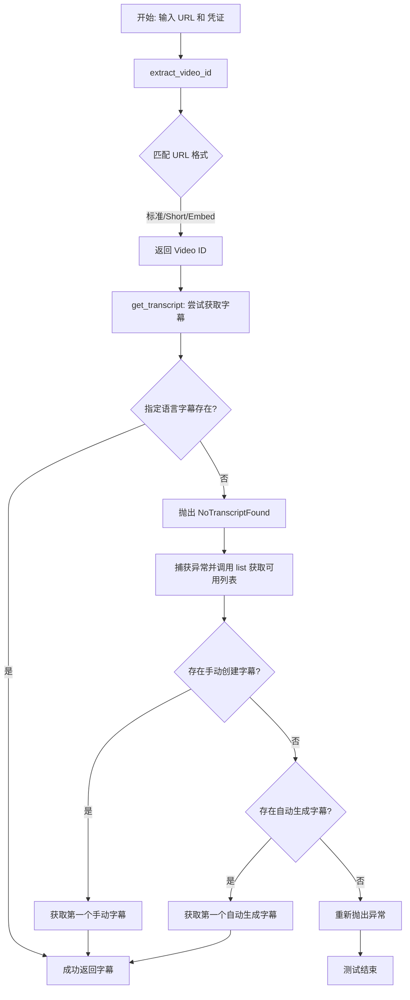

## 类结构

```
TestTranscribeYoutubeVideoBlock (测试类)
├── setup_method (初始化)
├── test_extract_video_id_standard_url
├── test_extract_video_id_short_url
├── test_extract_video_id_embed_url
├── test_extract_video_id_shorts_url
├── test_extract_video_id_shorts_url_with_params
├── test_get_transcript_english_available
├── test_get_transcript_with_custom_credentials
├── test_get_transcript_fallback_to_first_available
├── test_get_transcript_prefers_manually_created
└── test_get_transcript_no_transcripts_available
```

## 全局变量及字段


### `TestTranscribeYoutubeVideoBlock.youtube_block`
    
An instance of the TranscribeYoutubeVideoBlock class used as the system under test.

类型：`TranscribeYoutubeVideoBlock`
    


### `TestTranscribeYoutubeVideoBlock.credentials`
    
The default test credentials object loaded from TEST_CREDENTIALS, used for authenticating requests during tests.

类型：`UserPasswordCredentials`
    
    

## 全局函数及方法


### `TestTranscribeYoutubeVideoBlock.setup_method`

该方法是测试类的初始化钩子，用于在每个测试方法执行前初始化测试所需的实例对象和凭证数据。

参数：

- `self`：`TestTranscribeYoutubeVideoBlock`，测试类的实例引用。

返回值：`None`，无返回值。

#### 流程图

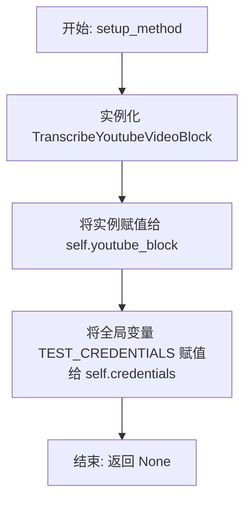

#### 带注释源码

```python
def setup_method(self):
    """Set up test fixtures."""
    # 初始化被测试的 YouTube 转录块对象
    self.youtube_block = TranscribeYoutubeVideoBlock()
    # 从导入的全局变量中获取测试凭证
    self.credentials = TEST_CREDENTIALS
```


### `TestTranscribeYoutubeVideoBlock.test_extract_video_id_standard_url`

该测试方法用于验证 `TranscribeYoutubeVideoBlock` 组件中的 `extract_video_id` 方法能够正确解析标准格式的 YouTube URL（如 `https://www.youtube.com/watch?v=...`），并准确提取出其中的视频 ID。

参数：

- `self`：`TestTranscribeYoutubeVideoBlock`，测试类的实例，用于访问测试夹具（fixtures）和被测对象。

返回值：`None`，这是一个单元测试方法，主要用于断言验证，没有显式的返回值。

#### 流程图

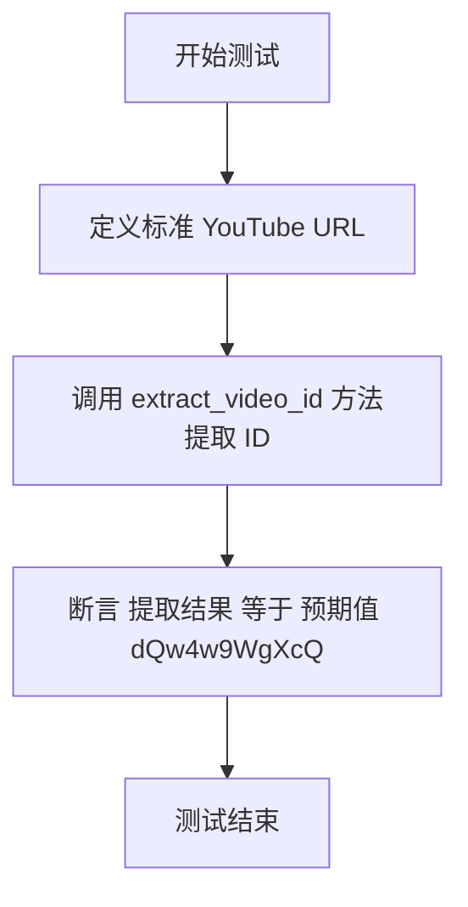

#### 带注释源码

```python
def test_extract_video_id_standard_url(self):
    """Test extracting video ID from standard YouTube URL."""
    # 定义一个标准的 YouTube 视频链接，包含目标视频 ID 'dQw4w9WgXcQ'
    url = "https://www.youtube.com/watch?v=dQw4w9WgXcQ"
    
    # 调用被测对象的 extract_video_id 方法，传入上述 URL
    # 该方法内部应包含解析逻辑，将视频 ID 从 URL 字符串中分离出来
    video_id = self.youtube_block.extract_video_id(url)
    
    # 使用 assert 语句验证提取出的 video_id 是否与预期的字符串 'dQw4w9WgXcQ' 完全一致
    assert video_id == "dQw4w9WgXcQ"
```


### `TestTranscribeYoutubeVideoBlock.test_extract_video_id_short_url`

测试 `TranscribeYoutubeVideoBlock` 是否能正确解析并提取缩短版 `youtu.be` 格式 URL 中的视频 ID。

参数：

-  `self`：`TestTranscribeYoutubeVideoBlock`，测试类实例，用于访问测试对象和断言方法。

返回值：`None`，该测试方法主要用于验证逻辑行为，不返回业务数据。

#### 流程图

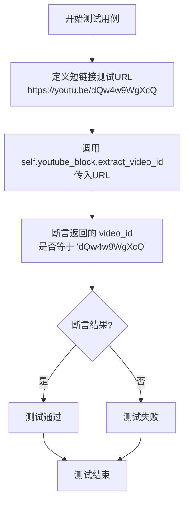

#### 带注释源码

```python
    def test_extract_video_id_short_url(self):
        """Test extracting video ID from shortened youtu.be URL."""
        # Step 1: 定义一个缩短版的 YouTube URL 作为测试输入
        url = "https://youtu.be/dQw4w9WgXcQ"
        
        # Step 2: 调用被测对象 TranscribeYoutubeVideoBlock 的 extract_video_id 方法
        # 期望该方法能从短链接中解析出视频 ID
        video_id = self.youtube_block.extract_video_id(url)
        
        # Step 3: 使用 assert 验证提取出的 video_id 是否与预期的视频 ID 一致
        assert video_id == "dQw4w9WgXcQ"
```


### `TestTranscribeYoutubeVideoBlock.test_extract_video_id_embed_url`

该测试方法用于验证 `TranscribeYoutubeVideoBlock` 中的 `extract_video_id` 方法能否正确从 YouTube 嵌入（embed）格式的 URL 中提取视频 ID。

参数：

- `self`：`TestTranscribeYoutubeVideoBlock`，测试类的实例，用于访问测试块实例。

返回值：`None`，该方法为单元测试，不返回业务数据，通过断言验证逻辑。

#### 流程图

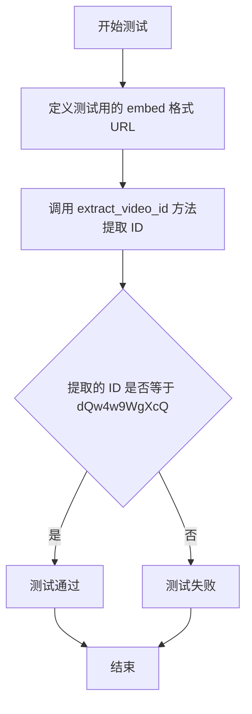

#### 带注释源码

```python
def test_extract_video_id_embed_url(self):
    """Test extracting video ID from embed URL."""
    # 定义一个标准的 YouTube 嵌入页面 URL 作为输入
    url = "https://www.youtube.com/embed/dQw4w9WgXcQ"
    # 调用被测对象的 extract_video_id 方法，获取视频 ID
    video_id = self.youtube_block.extract_video_id(url)
    # 断言提取出的 video_id 与预期的 ID "dQw4w9WgXcQ" 一致
    assert video_id == "dQw4w9WgXcQ"
```


### `TestTranscribeYoutubeVideoBlock.test_extract_video_id_shorts_url`

测试 `TranscribeYoutubeVideoBlock` 的 `extract_video_id` 方法是否能正确处理并提取 YouTube Shorts 格式 URL 中的视频 ID。

参数：

-  `self`：`TestTranscribeYoutubeVideoBlock`，测试类的实例，用于访问测试对象。

返回值：`None`，该方法为单元测试，执行断言验证逻辑，无显式返回值。

#### 流程图

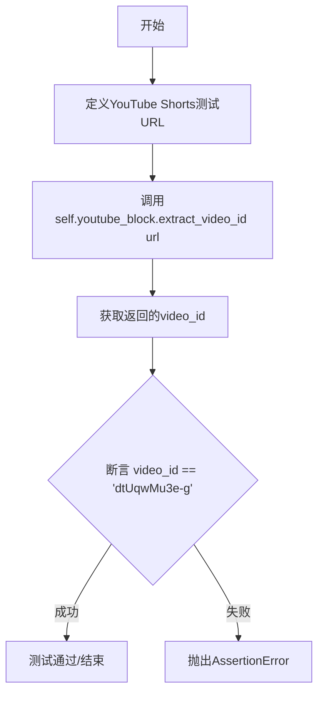

#### 带注释源码

```python
    def test_extract_video_id_shorts_url(self):
        """Test extracting video ID from YouTube Shorts URL."""
        # 定义一个符合 YouTube Shorts 格式的测试 URL
        url = "https://www.youtube.com/shorts/dtUqwMu3e-g"
        
        # 调用被测方法 extract_video_id，尝试从 URL 中提取视频 ID
        video_id = self.youtube_block.extract_video_id(url)
        
        # 断言提取出的 video_id 是否等于预期的 "dtUqwMu3e-g"
        assert video_id == "dtUqwMu3e-g"
```


### `TestTranscribeYoutubeVideoBlock.test_extract_video_id_shorts_url_with_params`

该测试方法用于验证 `TranscribeYoutubeVideoBlock` 组件是否能够正确地从带有查询参数的 YouTube Shorts URL 格式中提取视频 ID。

参数：

-  `self`：`TestTranscribeYoutubeVideoBlock`，测试类实例，提供访问测试夹具和被测对象的能力。

返回值：`None`，无返回值，主要通过断言来验证功能逻辑。

#### 流程图

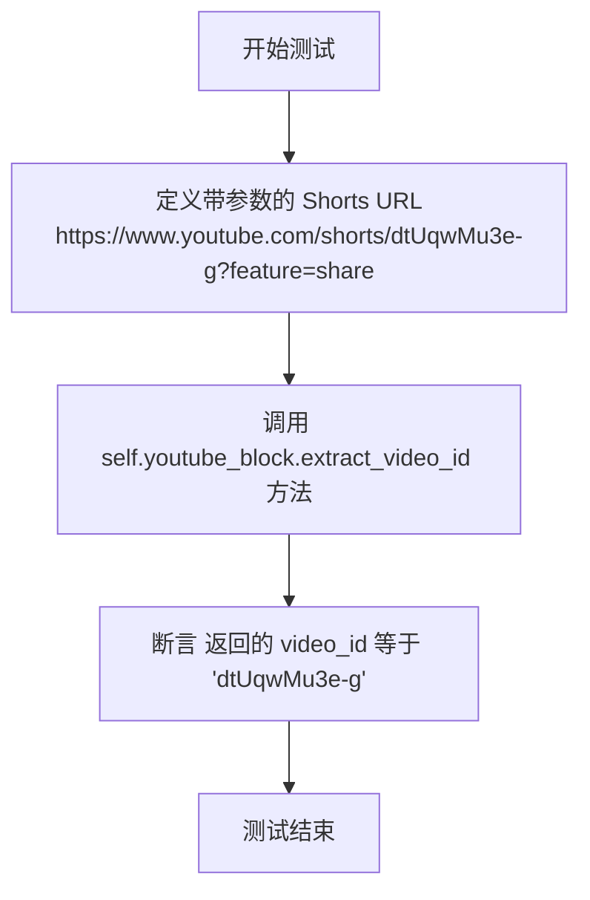

#### 带注释源码

```python
def test_extract_video_id_shorts_url_with_params(self):
    """Test extracting video ID from YouTube Shorts URL with query parameters."""
    # 准备测试数据：一个包含查询参数（feature=share）的 YouTube Shorts URL
    url = "https://www.youtube.com/shorts/dtUqwMu3e-g?feature=share"
    # 调用被测方法 extract_video_id，传入准备好的 URL
    video_id = self.youtube_block.extract_video_id(url)
    # 验证提取结果是否为预期的视频 ID，确保方法正确处理了 URL 中的路径和查询参数
    assert video_id == "dtUqwMu3e-g"
```


### `TestTranscribeYoutubeVideoBlock.test_get_transcript_english_available`

该测试方法验证了当指定视频的英语字幕可用时，`TranscribeYoutubeVideoBlock` 能够正确获取并返回字幕数据。它通过模拟 API 调用，检查代理配置的正确性，并确保在获取成功时不会触发字幕列表查询（回退逻辑）。

参数：

-  `self`：`TestTranscribeYoutubeVideoBlock`，测试类的实例，包含测试夹具（fixtures）如 `youtube_block` 和 `credentials`。
-  `mock_api_class`：`Mock`，由 `@patch` 装饰器注入的 `YouTubeTranscriptApi` 类的模拟对象，用于模拟外部 API 的行为。

返回值：`None`，该测试方法主要执行断言验证，不返回具体数值。

#### 流程图

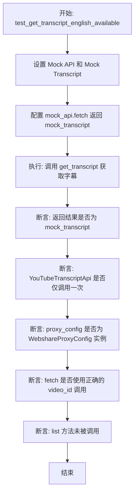

#### 带注释源码

```python
    @patch("backend.blocks.youtube.YouTubeTranscriptApi")
    def test_get_transcript_english_available(self, mock_api_class):
        """Test getting transcript when English is available."""
        # Setup mock: 初始化模拟对象
        mock_api = Mock()
        mock_api_class.return_value = mock_api
        # 模拟获取到的字幕对象
        mock_transcript = Mock(spec=FetchedTranscript)
        mock_api.fetch.return_value = mock_transcript

        # Execute: 调用被测试块的方法
        result = self.youtube_block.get_transcript("test_video_id", self.credentials)

        # Assert: 验证返回结果是否为模拟的字幕对象
        assert result == mock_transcript
        # 验证 API 类是否被初始化调用了一次
        mock_api_class.assert_called_once()
        # 验证初始化时传入的 proxy_config 是否为 WebshareProxyConfig 类型
        proxy_config = mock_api_class.call_args[1]["proxy_config"]
        assert isinstance(proxy_config, WebshareProxyConfig)
        # 验证 fetch 方法是否使用正确的 video_id 被调用了一次
        mock_api.fetch.assert_called_once_with(video_id="test_video_id")
        # 验证 list 方法未被调用（说明没有触发语言回退逻辑）
        mock_api.list.assert_not_called()
```


### `TestTranscribeYoutubeVideoBlock.test_get_transcript_with_custom_credentials`

测试 `TranscribeYoutubeVideoBlock` 在提供自定义代理凭证（用户名和密码）时获取 YouTube 视频字幕的功能。验证了自定义凭证被正确传递给底层 API 的代理配置。

参数：

-   `mock_api_class`：`Mock`，由 `@patch` 装饰器注入的 `YouTubeTranscriptApi` 类的模拟对象，用于模拟 API 调用行为。

返回值：`None`，该方法为单元测试，不返回业务数据，通过断言验证逻辑正确性。

#### 流程图

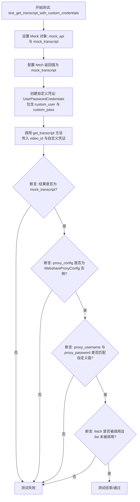

#### 带注释源码

```python
    @patch("backend.blocks.youtube.YouTubeTranscriptApi")
    def test_get_transcript_with_custom_credentials(self, mock_api_class):
        """Test getting transcript with custom proxy credentials."""
        # 设置模拟对象
        # 创建一个模拟的 API 实例
        mock_api = Mock()
        # 让 patch 的类返回这个模拟实例
        mock_api_class.return_value = mock_api
        # 创建一个模拟的 FetchedTranscript 对象
        mock_transcript = Mock(spec=FetchedTranscript)
        # 配置模拟 API 的 fetch 方法返回模拟的字幕对象
        mock_api.fetch.return_value = mock_transcript

        # 准备自定义的用户名和密码凭证
        credentials = UserPasswordCredentials(
            provider=ProviderName.WEBSHARE_PROXY,
            username=SecretStr("custom_user"),
            password=SecretStr("custom_pass"),
        )

        # 执行：调用被测方法获取字幕
        result = self.youtube_block.get_transcript("test_video_id", credentials)

        # 断言：验证返回的字幕对象是否为模拟对象
        assert result == mock_transcript
        
        # 验证 API 类是否被正确调用
        mock_api_class.assert_called_once()
        
        # 获取调用时传入的 proxy_config 参数
        proxy_config = mock_api_class.call_args[1]["proxy_config"]
        
        # 验证代理配置类型是否正确
        assert isinstance(proxy_config, WebshareProxyConfig)
        
        # 验证代理配置中是否包含了自定义的用户名
        assert proxy_config.proxy_username == "custom_user"
        # 验证代理配置中是否包含了自定义的密码
        assert proxy_config.proxy_password == "custom_pass"
        
        # 验证 fetch 方法是否被正确调用（意味着直接获取成功，不需要回退）
        mock_api.fetch.assert_called_once_with(video_id="test_video_id")
        # 验证 list 方法未被调用（因为不需要查找回退语言）
        mock_api.list.assert_not_called()
```


### `TestTranscribeYoutubeVideoBlock.test_get_transcript_fallback_to_first_available`

该测试方法用于验证当首选语言（英语）的字幕不可用时，`TranscribeYoutubeVideoBlock` 能否正确回退并获取列表中第一个可用语言（匈牙利语）的字幕。

参数：

-  `mock_api_class`：`Mock`，通过 `@patch` 装饰器注入的 `YouTubeTranscriptApi` 类的模拟对象，用于控制 API 行为。

返回值：`None`，该方法为单元测试，无返回值，主要通过断言验证逻辑。

#### 流程图

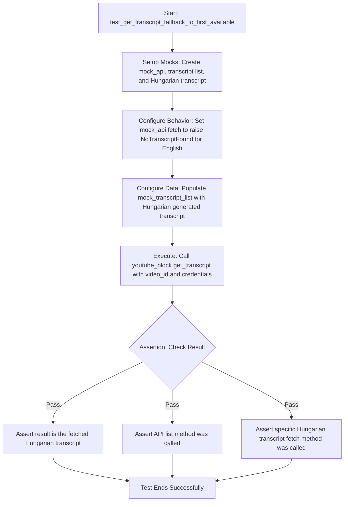

#### 带注释源码

```python
    @patch("backend.blocks.youtube.YouTubeTranscriptApi")
    def test_get_transcript_fallback_to_first_available(self, mock_api_class):
        """Test fallback to first available language when English is not available."""
        # 1. 初始化 Mock 对象
        mock_api = Mock()
        mock_api_class.return_value = mock_api

        # 2. 创建模拟的字幕列表对象和具体的匈牙利语字幕对象
        mock_transcript_list = Mock()
        mock_transcript_hu = Mock(spec=Transcript)
        mock_fetched_transcript = Mock(spec=FetchedTranscript)
        
        # 设置匈牙利语字幕对象的 fetch 方法返回模拟的已获取字幕
        mock_transcript_hu.fetch.return_value = mock_fetched_transcript

        # 3. 配置字幕列表的属性
        # 设置人工创建的字幕为空
        mock_transcript_list._manually_created_transcripts = {}
        # 设置生成的字幕包含匈牙利语
        mock_transcript_list._generated_transcripts = {"hu": mock_transcript_hu}

        # 4. 配置 API 行为
        # 当尝试获取字幕时，抛出 NoTranscriptFound 异常，模拟英语不存在的情况
        # 异常对象中包含了可用的字幕列表 mock_transcript_list
        mock_api.fetch.side_effect = NoTranscriptFound(
            "test_video_id", ("en",), mock_transcript_list
        )
        # 配置 list 方法返回模拟的字幕列表
        mock_api.list.return_value = mock_transcript_list

        # 5. 执行测试：调用被测方法获取字幕
        result = self.youtube_block.get_transcript("test_video_id", self.credentials)

        # 6. 断言验证
        # 验证最终返回的是匈牙利语的已获取字幕
        assert result == mock_fetched_transcript
        # 验证 API 类被初始化
        mock_api_class.assert_called_once()
        # 验证初始尝试获取（英语）被调用过一次
        mock_api.fetch.assert_called_once_with(video_id="test_video_id")
        # 验证调用了 list 方法查找可用字幕
        mock_api.list.assert_called_once_with("test_video_id")
        # 验证最终调用了匈牙利语字幕的 fetch 方法
        mock_transcript_hu.fetch.assert_called_once()
```


### `TestTranscribeYoutubeVideoBlock.test_get_transcript_prefers_manually_created`

该测试用例用于验证当首选语言（英语）的字幕不可用时，`TranscribeYoutubeVideoBlock` 的 `get_transcript` 方法能够正确地回退，并且优先选择手动创建的字幕而不是自动生成的字幕。

参数：

-  `self`：`TestTranscribeYoutubeVideoBlock`，测试类实例，用于访问测试夹具和被测方法。
-  `mock_api_class`：`unittest.mock.MagicMock`，由 `@patch` 装饰器注入的模拟对象，用于模拟 `YouTubeTranscriptApi` 类的行为。

返回值：`None`，该函数为测试方法，无返回值，通过断言验证逻辑正确性。

#### 流程图

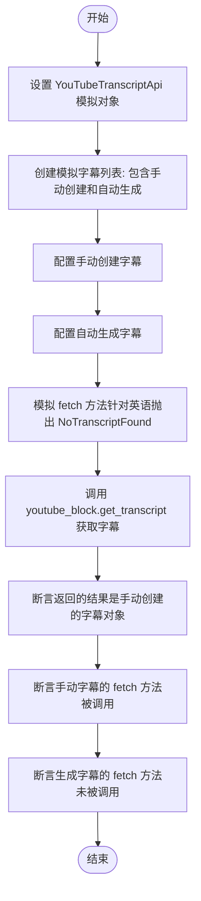

#### 带注释源码

```python
    @patch("backend.blocks.youtube.YouTubeTranscriptApi")
    def test_get_transcript_prefers_manually_created(self, mock_api_class):
        """Test that manually created transcripts are preferred over generated ones."""
        # 1. 初始化模拟对象，模拟 YouTubeTranscriptApi 类
        mock_api = Mock()
        mock_api_class.return_value = mock_api

        # 2. 准备模拟数据：包含手动创建和自动生成的字幕对象
        mock_transcript_list = Mock()
        mock_transcript_manual = Mock(spec=Transcript)  # 手动创建的字幕
        mock_transcript_generated = Mock(spec=Transcript) # 自动生成的字幕
        mock_fetched_manual = Mock(spec=FetchedTranscript) # 最终获取到的字幕数据
        mock_transcript_manual.fetch.return_value = mock_fetched_manual

        # 3. 配置字幕列表：设置手动创建列表包含西班牙语，自动生成列表包含匈牙利语
        mock_transcript_list._manually_created_transcripts = {
            "es": mock_transcript_manual
        }
        mock_transcript_list._generated_transcripts = {"hu": mock_transcript_generated}

        # 4. 模拟 API 行为：当尝试获取英语字幕时，抛出 NoTranscriptFound 异常
        #    并传入包含上述字幕列表的模拟对象，触发回退逻辑
        mock_api.fetch.side_effect = NoTranscriptFound(
            "test_video_id", ("en",), mock_transcript_list
        )
        mock_api.list.return_value = mock_transcript_list

        # 5. 执行：调用被测方法获取字幕
        result = self.youtube_block.get_transcript("test_video_id", self.credentials)

        # 6. 断言：验证结果是否为手动创建的字幕
        assert result == mock_fetched_manual
        mock_api_class.assert_called_once()
        
        # 7. 验证：确保手动创建字幕的 fetch 方法被调用
        mock_transcript_manual.fetch.assert_called_once()
        
        # 8. 验证：确保自动生成字幕的 fetch 方法未被调用，证明优先级逻辑生效
        mock_transcript_generated.fetch.assert_not_called()
```


### `TestTranscribeYoutubeVideoBlock.test_get_transcript_no_transcripts_available`

该测试用例用于验证当请求的目标视频字幕（如英语）不可用，且视频中不存在任何其他类型的字幕（既无手动创建也无自动生成的字幕）时，系统应重新抛出 `NoTranscriptFound` 异常，确保错误能够正确向上传播。

参数：

- `self`：`TestTranscribeYoutubeVideoBlock`，测试类的实例，用于访问测试固件和被测对象。
- `mock_api_class`：`Mock`，由 `@patch` 装饰器注入的模拟对象，用于模拟 `YouTubeTranscriptApi` 类的行为。

返回值：`None`，该方法无返回值，主要通过 `pytest.raises` 验证异常抛出行为。

#### 流程图

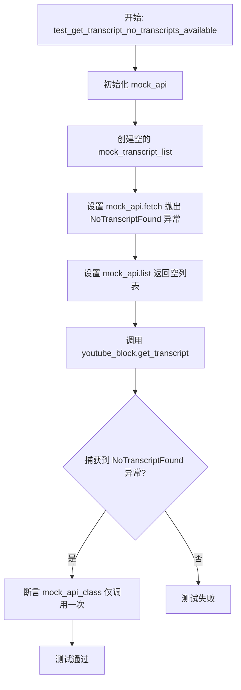

#### 带注释源码

```python
    @patch("backend.blocks.youtube.YouTubeTranscriptApi")
    def test_get_transcript_no_transcripts_available(self, mock_api_class):
        """Test that exception is re-raised when no transcripts are available at all."""
        # 设置 Mock 对象
        mock_api = Mock()
        mock_api_class.return_value = mock_api

        # 创建一个空的 Mock 字幕列表，模拟没有任何字幕（手动或自动）的情况
        mock_transcript_list = Mock()
        mock_transcript_list._manually_created_transcripts = {}
        mock_transcript_list._generated_transcripts = {}

        # 设置 Mock API 的 fetch 方法抛出 NoTranscriptFound 异常
        # 模拟当尝试获取字幕（通常是英语）时失败的情况
        original_exception = NoTranscriptFound(
            "test_video_id", ("en",), mock_transcript_list
        )
        mock_api.fetch.side_effect = original_exception
        mock_api.list.return_value = mock_transcript_list

        # 执行被测方法并断言抛出了 NoTranscriptFound 异常
        # 这验证了当完全没有字幕可用时，系统不会静默失败，而是抛出异常
        with pytest.raises(NoTranscriptFound):
            self.youtube_block.get_transcript("test_video_id", self.credentials)
        
        # 验证 API 类的初始化确实被调用了一次
        mock_api_class.assert_called_once()
```


## 关键组件


### 视频ID提取逻辑 (URL Parser)
负责解析多种格式的 YouTube URL（包括标准链接、短视频 Shorts 和嵌入链接 embed），从中提取唯一的视频标识符，作为后续字幕获取的输入参数。

### 字幕获取服务 (Transcript Fetcher)
核心业务逻辑组件，负责通过 `YouTubeTranscriptApi` 获取视频字幕。它集成了代理配置功能，支持通过 Webshare 代理发起请求，并处理与外部 API 的交互。

### 语言回退与选择策略
一种智能化的字幕检索策略，当首选语言（如英语）不可用时，自动遍历可用字幕列表。该策略优先选择人工创建的字幕，其次是自动生成的字幕，以确保获取最佳质量的内容。

### 代理认证与配置管理
负责处理网络请求的代理设置，能够从 `UserPasswordCredentials` 中读取自定义凭证，动态配置 Webshare 代理的用户名和密码，以满足匿名访问和绕过限制的需求。

### 异常处理与容错机制
处理字幕获取过程中的特定异常（如 `NoTranscriptFound`），在特定语言缺失时触发回退流程，或在完全无字幕可用时正确抛出异常，保证系统的健壮性。


## 问题及建议


### 已知问题

-   **脆弱的内部实现模拟**：测试代码中直接操作了模拟对象的私有属性（如 `mock_transcript_list._manually_created_transcripts`），这导致测试依赖于外部库 `youtube_transcript_api` 的具体内部实现细节。一旦库的内部结构发生变化，测试将失效。
-   **全局测试依赖**：测试使用了从 `backend.blocks.youtube` 导入的全局变量 `TEST_CREDENTIALS`。这种依赖全局状态的方式降低了测试的隔离性，可能在不同测试运行环境中导致意外的副作用。
-   **重复的 Mock 设置代码**：多个测试方法中包含大量重复的 Mock 对象初始化和配置代码（如 `mock_api`、`mock_api_class` 的设置），增加了维护成本和代码冗余。

### 优化建议

-   **引入 Pytest Fixture**：将重复的 Mock 设置（如 `YouTubeTranscriptApi` 的模拟）和凭据初始化逻辑提取到 `@pytest.fixture` 中，以减少代码重复，提高测试用例的可读性和可维护性。
-   **使用伪造对象代替私有属性 Mock**：针对 `TranscriptList` 的模拟，建议创建符合接口契约的辅助函数或 Fake 对象，而不是直接设置私有属性。这样可以模拟外部库的行为而非实现，提高测试的健壮性。
-   **增加边缘用例覆盖**：目前 `extract_video_id` 仅覆盖了有效 URL，建议增加对无效 URL 格式、空字符串或非 YouTube 链接的测试用例，验证其异常处理或容错能力。
-   **常量化测试数据**：将测试中使用的视频 ID（如 `"dQw4w9WgXcQ"`）、语言代码（如 `"en"`, `"hu"`）等魔术数字提取为类常量，避免硬编码导致的拼写错误并提高语义清晰度。


## 其它


### 设计目标与约束

**设计目标：**
1.  **高可用性与容错性：** 核心目标是确保在首选语言（英语）字幕不可用时，系统能够自动回退到其他可用语言的字幕，或者在手动创建和自动生成的字幕之间做出最优选择，而不是直接失败。
2.  **URL 解析的鲁棒性：** 系统设计需兼容多种格式的 YouTube URL（标准 watch 链接、短链接 youtu.be、Embed 嵌入链接、Shorts 短视频链接），并能准确提取视频 ID。
3.  **可配置的网络代理：** 支持通过配置代理服务（如 Webshare）来访问 YouTube API，以绕过可能的网络限制，同时支持运行时动态注入自定义凭证。

**约束条件：**
1.  **外部 API 依赖：** 系统严重依赖 `youtube_transcript_api` 的稳定性，必须处理其抛出的特定异常（如 `NoTranscriptFound`）。
2.  **数据隐私与安全：** 处理代理凭证时，必须使用 `pydantic.SecretStr` 确保敏感信息（如密码）在日志和内存中的安全性。
3.  **语言优先级策略：** 必须遵循特定的回退策略：首选英语 -> 首选手动创建的字幕 -> 回退到自动生成的字幕 -> 回退到任何可用语言。

### 错误处理与异常设计

**异常处理策略：**
系统采用“尝试-回退-失败”的异常处理模型。
1.  **NoTranscriptFound 异常处理：** 当尝试获取特定语言（通常是英语）字幕失败抛出 `NoTranscriptFound` 时，系统捕获该异常并检查异常对象中携带的 `transcript_list` 属性。
2.  **回退逻辑中的错误处理：**
    *   如果 `transcript_list` 包含手动创建的字幕，则优先获取。
    *   如果没有手动创建的字幕，则尝试获取自动生成的字幕。
    *   如果两者均不存在，系统将停止捕获并重新抛出原始的 `NoTranscriptFound` 异常，向调用方明确表示资源不可用。
3.  **参数验证：** 虽然测试中未显式展示 URL 格式错误的处理，但架构设计上假定 `extract_video_id` 方法具备处理无效 URL 的能力（通常通过返回 None 或抛出 ValueError）。

**关键异常：**
*   `NoTranscriptFound`: 指示请求的视频 ID 或特定语言字幕未找到，是触发回退逻辑的关键信号。

### 数据流与状态机

**数据流：**
1.  **输入阶段：** 接收 YouTube 视频 URL 和可选的代理凭证。
2.  **预处理阶段：** 调用 `extract_video_id` 从 URL 中解析出标准的 `video_id`。
3.  **获取尝试阶段：** 使用 `video_id` 和 `proxy_config` 初始化 API 客户端，尝试直接获取字幕。
4.  **决策/回退阶段：**
    *   *成功分支：* 直接返回 `FetchedTranscript` 对象。
    *   *异常分支：* 触发 `NoTranscriptFound`，进入回退逻辑，解析可用字幕列表，按优先级（手动 > 生成）选择非英语字幕进行第二次获取尝试。
5.  **输出阶段：** 返回最终获取的 `FetchedTranscript` 对象或抛出异常。

**状态流转（逻辑状态机）：**
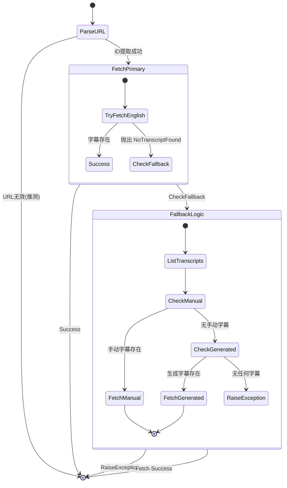

### 外部依赖与接口契约

**外部库依赖：**
1.  **`youtube_transcript_api`**: 提供核心功能。
    *   *契约*: `YouTubeTranscriptApi.get_transcript(video_id, languages, proxy_config)` 必须返回字幕数据或抛出 `NoTranscriptFound`。
    *   *契约*: `YouTubeTranscriptApi.list_transcripts(video_id, proxy_config)` 必须返回包含 `_manually_created_transcripts` 和 `_generated_transcripts` 属性的对象。
2.  **`pydantic`**: 数据验证。
    *   *契约*: `SecretStr` 类型用于安全封装字符串，不提供直接的明文访问。
3.  **`pytest` & `unittest.mock`**: 测试框架，用于验证逻辑契约。

**内部接口契约：**
1.  **`UserPasswordCredentials`**:
    *   *字段*: `provider` (枚举), `username` (SecretStr), `password` (SecretStr)。
    *   *用途*: 传递代理认证信息。
2.  **`WebshareProxyConfig`**:
    *   *用途*: 将 `UserPasswordCredentials` 转换为底层 API 可识别的代理配置对象。

### 测试策略与覆盖范围

**策略概述：**
采用单元测试策略，利用 Mock 对象隔离外部 YouTube API 的网络调用，确保逻辑的确定性和测试速度。测试覆盖了“快乐路径”以及多种边界条件和异常场景。

**测试覆盖矩阵：**
1.  **URL 解析测试 (5个用例):** 覆盖标准 URL、短链接、Embed 链接、Shorts 链接以及带参数的 Shorts 链接，确保 ID 提取的准确性。
2.  **功能逻辑测试 (5个用例):**
    *   *基本功能*: 验证英语字幕存在时的直接获取。
    *   *代理配置*: 验证自定义凭证是否正确转换为 `WebshareProxyConfig` 并传递给 API。
    *   *语言回退*: 验证英语缺失时，能否成功回退到其他语言（如匈牙利语）。
    *   *字幕源优先级*: 验证在多语言环境中，手动创建的字幕是否优先于自动生成的字幕被选中。
    *   *完全失败场景*: 验证当没有任何字幕可用时，系统是否正确抛出异常。

**Mock 策略：**
使用 `@patch` 装饰器替换 `backend.blocks.youtube.YouTubeTranscriptApi`，精细控制 `fetch` 和 `list` 方法的副作用（返回值或抛出异常），以模拟不同的 API 响应状态。

    