# `.\AutoGPT\autogpt_platform\backend\test\e2e_test_data.py` 详细设计文档

该脚本通过调用 API 层函数和数据库操作，为 AutoGPT 平台的端到端 (E2E) 测试生成全面的模拟数据，包括用户、代理图、库代理、预设、商店提交条目及用户配置文件，并确保满足特定的确定性数据量要求（如精选代理数量）。

## 整体流程

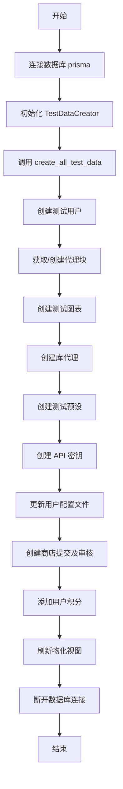

## 类结构

```
TestDataCreator
├── __init__
├── create_test_users
├── get_available_blocks
├── create_test_graphs
├── create_test_library_agents
├── create_test_presets
├── create_test_api_keys
├── update_test_profiles
├── create_test_store_submissions
├── add_user_credits
└── create_all_test_data
```

## 全局变量及字段


### `NUM_USERS`
    
生成测试用户的数量限制。

类型：`int`
    


### `NUM_AGENT_BLOCKS`
    
代理块的数量限制。

类型：`int`
    


### `MIN_GRAPHS_PER_USER`
    
每个用户创建的最小图数。

类型：`int`
    


### `MAX_GRAPHS_PER_USER`
    
每个用户创建的最大图数。

类型：`int`
    


### `MIN_NODES_PER_GRAPH`
    
每个图包含的最小节点数。

类型：`int`
    


### `MAX_NODES_PER_GRAPH`
    
每个图包含的最大节点数。

类型：`int`
    


### `MIN_PRESETS_PER_USER`
    
每个用户创建的最小预设数。

类型：`int`
    


### `MAX_PRESETS_PER_USER`
    
每个用户创建的最大预设数。

类型：`int`
    


### `MIN_AGENTS_PER_USER`
    
每个用户创建的最小代理数。

类型：`int`
    


### `MAX_AGENTS_PER_USER`
    
每个用户创建的最大代理数。

类型：`int`
    


### `MIN_EXECUTIONS_PER_GRAPH`
    
每个图执行记录的最小数量限制。

类型：`int`
    


### `MAX_EXECUTIONS_PER_GRAPH`
    
每个图执行记录的最大数量限制。

类型：`int`
    


### `MIN_REVIEWS_PER_VERSION`
    
每个版本审核记录的最小数量限制。

类型：`int`
    


### `MAX_REVIEWS_PER_VERSION`
    
每个版本审核记录的最大数量限制。

类型：`int`
    


### `GUARANTEED_FEATURED_AGENTS`
    
保证生成的精选代理最小数量。

类型：`int`
    


### `GUARANTEED_FEATURED_CREATORS`
    
保证生成的精选创作者最小数量。

类型：`int`
    


### `GUARANTEED_TOP_AGENTS`
    
保证生成的顶级代理最小数量。

类型：`int`
    


### `faker`
    
Faker 库实例，用于生成随机的虚假数据。

类型：`Faker`
    


### `TestDataCreator.users`
    
存储已创建的测试用户列表。

类型：`List[Dict[str, Any]]`
    


### `TestDataCreator.agent_blocks`
    
存储可用的代理块列表。

类型：`List[Dict[str, Any]]`
    


### `TestDataCreator.agent_graphs`
    
存储已创建的测试代理图列表。

类型：`List[Dict[str, Any]]`
    


### `TestDataCreator.library_agents`
    
存储已创建的库代理列表。

类型：`List[Dict[str, Any]]`
    


### `TestDataCreator.store_submissions`
    
存储已创建的商店提交列表。

类型：`List[Dict[str, Any]]`
    


### `TestDataCreator.api_keys`
    
存储已创建的 API 密钥列表。

类型：`List[Dict[str, Any]]`
    


### `TestDataCreator.presets`
    
存储已创建的预设列表。

类型：`List[Dict[str, Any]]`
    


### `TestDataCreator.profiles`
    
存储已创建或更新的用户配置文件列表。

类型：`List[Dict[str, Any]]`
    
    

## 全局函数及方法


### `get_image`

Generate a consistent image URL using picsum.photos service.

参数：无

返回值：`str`，生成的图片 URL 字符串。

#### 流程图

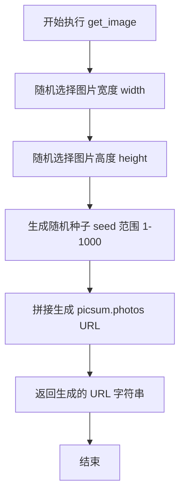

#### 带注释源码

```python
def get_image():
    """Generate a consistent image URL using picsum.photos service."""
    # 从预定义的列表中随机选择一个宽度值
    width = random.choice([200, 300, 400, 500, 600, 800])
    # 从预定义的列表中随机选择一个高度值
    height = random.choice([200, 300, 400, 500, 600, 800])
    # 生成一个 1 到 1000 之间的随机整数作为种子，确保图片的一致性
    seed = random.randint(1, 1000)
    # 使用 f-string 将种子、宽度和高度格式化为 picsum.photos 的完整 URL 并返回
    return f"https://picsum.photos/seed/{seed}/{width}/{height}"
```


### `get_video_url`

Generate a consistent video URL using YouTube.

参数：

返回值：`str`，生成的YouTube视频链接

#### 流程图

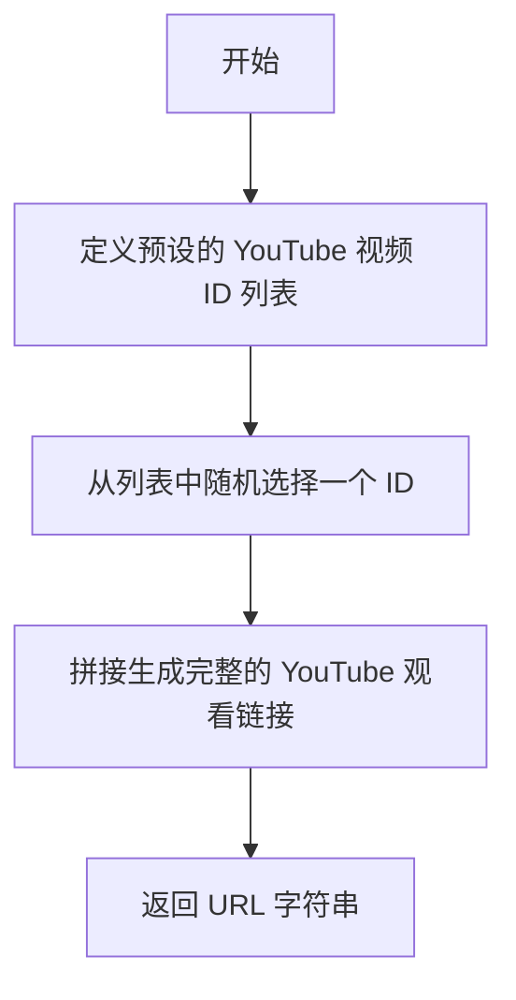

#### 带注释源码

```python
def get_video_url():
    """Generate a consistent video URL using YouTube."""
    # 定义预设的 YouTube 视频 ID 列表
    video_ids = [
        "dQw4w9WgXcQ",
        "9bZkp7q19f0",
        "kJQP7kiw5Fk",
        "RgKAFK5djSk",
        "L_jWHffIx5E",
    ]
    # 从列表中随机选择一个视频 ID
    video_id = random.choice(video_ids)
    # 返回格式化后的 YouTube 视频链接
    return f"https://www.youtube.com/watch?v={video_id}"
```


### `get_category`

从预定义的分类列表中随机生成一个分类，用于测试数据的分类字段赋值。

参数：

*   无

返回值：`str`，随机选中的分类名称。

#### 流程图

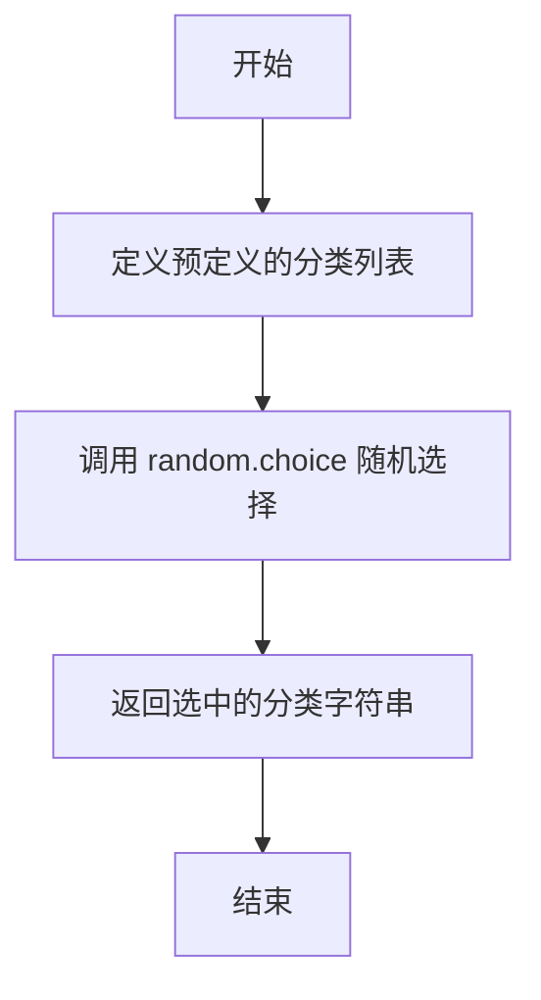

#### 带注释源码

```python
def get_category():
    """Generate a random category from the predefined list."""
    # 定义可用的分类列表
    categories = [
        "productivity",
        "writing",
        "development",
        "data",
        "marketing",
        "research",
        "creative",
        "business",
        "personal",
        "other",
    ]
    # 从列表中随机选择一个并返回
    return random.choice(categories)
```


### `main`

主函数，协程入口，负责连接数据库、触发测试数据生成流程，并确保在流程结束后断开数据库连接。

参数：

*   无

返回值：`None`，函数不返回任何值，仅执行副作用（数据库操作和数据生成）。

#### 流程图

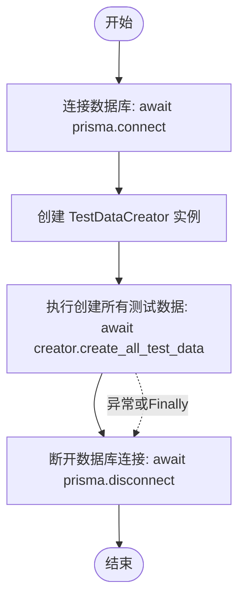

#### 带注释源码

```python
async def main():
    """Main function to run the test data creation."""
    # 连接到数据库，建立会话
    await prisma.connect()

    try:
        # 实例化测试数据创建器
        creator = TestDataCreator()
        # 调用核心方法，按顺序创建用户、图、代理、预设、API密钥、商店提交记录及信用额度等所有测试数据
        await creator.create_all_test_data()
    finally:
        # 无论过程是否发生异常，最终都执行断开数据库连接的操作，释放资源
        await prisma.disconnect()
```


### `TestDataCreator.__init__`

`TestDataCreator` 类的构造函数，用于初始化测试数据创建器的实例状态。该方法将所有用于存储生成的测试数据（如用户、代理块、图表、库代理、商店提交记录、API 密钥、预设和用户个人资料）的实例属性初始化为空列表，为后续的数据填充做准备。

参数：

-  `无`

返回值：`None`，无返回值。

#### 流程图

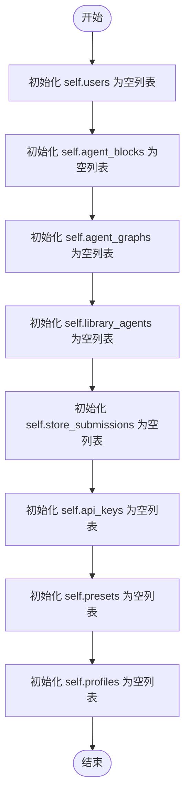

#### 带注释源码

```python
    def __init__(self):
        # 初始化用户列表，用于存储创建的测试用户数据
        self.users: List[Dict[str, Any]] = []
        # 初始化代理模块列表，用于存储数据库中获取的或创建的代理块
        self.agent_blocks: List[Dict[str, Any]] = []
        # 初始化代理图列表，用于存储创建的测试执行流图
        self.agent_graphs: List[Dict[str, Any]] = []
        # 初始化库代理列表，用于存储基于图创建的库代理
        self.library_agents: List[Dict[str, Any]] = []
        # 初始化商店提交列表，用于存储提交到市场的代理版本数据
        self.store_submissions: List[Dict[str, Any]] = []
        # 初始化 API 密钥列表，用于存储为用户生成的访问凭证
        self.api_keys: List[Dict[str, Any]] = []
        # 初始化预设列表，用于存储基于图创建的代理预设配置
        self.presets: List[Dict[str, Any]] = []
        # 初始化个人资料列表，用于存储更新后的用户详细信息
        self.profiles: List[Dict[str, Any]] = []
```


### `TestDataCreator.create_test_users`

该方法负责为端到端（E2E）测试创建指定数量的测试用户。它首先尝试通过 Supabase 客户端在认证系统中创建用户，如果 Supabase 操作失败则回退到直接使用生成的 ID。随后，它调用内部 API 函数 `get_or_create_user` 将用户数据同步到本地数据库中。为了确保测试环境的确定性，列表中的第一个用户（索引0）被指定为固定的测试邮箱 (test123@gmail.com)。

参数：

- `self`：`TestDataCreator`，类的实例引用。

返回值：`List[Dict[str, Any]]`，包含所有成功创建的用户信息的字典列表。

#### 流程图

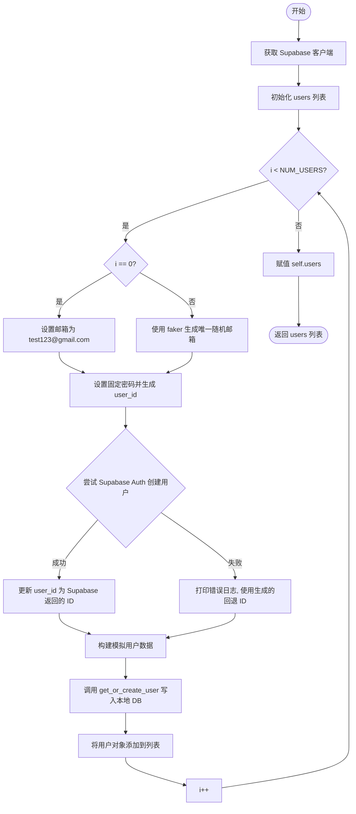

#### 带注释源码

```python
    async def create_test_users(self) -> List[Dict[str, Any]]:
        """Create test users using Supabase client."""
        print(f"Creating {NUM_USERS} test users...")

        supabase = get_supabase()
        users = []

        for i in range(NUM_USERS):
            try:
                # Generate test user data
                if i == 0:
                    # 第一个用户使用固定的测试邮箱，以便在测试中登录
                    email = "test123@gmail.com"
                else:
                    # 其他用户使用 Faker 生成唯一邮箱
                    email = faker.unique.email()
                password = "testpassword123"  # Standard test password
                user_id = f"test-user-{i}-{faker.uuid4()}"

                # Create user in Supabase Auth (if needed)
                try:
                    # 尝试在 Supabase 认证服务中创建用户
                    auth_response = supabase.auth.admin.create_user(
                        {"email": email, "password": password, "email_confirm": True}
                    )
                    if auth_response.user:
                        # 如果 Supabase 创建成功，更新 user_id 为真实 ID
                        user_id = auth_response.user.id
                except Exception as supabase_error:
                    print(
                        f"Supabase user creation failed for {email}, using fallback: {supabase_error}"
                    )
                    # 如果 Supabase 创建失败（例如未配置），回退使用生成的 ID

                # Create mock user data similar to what auth middleware would provide
                user_data = {
                    "sub": user_id,
                    "email": email,
                }

                # Use the API function to create user in local database
                # 调用 API 层函数在本地数据库创建或获取用户记录
                user = await get_or_create_user(user_data)
                users.append(user.model_dump())

            except Exception as e:
                print(f"Error creating user {i}: {e}")
                continue

        self.users = users
        return users
```


### `TestDataCreator.get_available_blocks`

该方法用于从数据库中检索可用的代理块信息。如果数据库中没有找到任何代理块，它会尝试创建一组基本的标准代理块（如输入、输出、计算器、时间块）以确保系统可以正常运行。

参数：

无

返回值：`List[Dict[str, Any]]`，包含代理块信息的字典列表，每个字典主要包含 `id` 和 `name` 字段。

#### 流程图

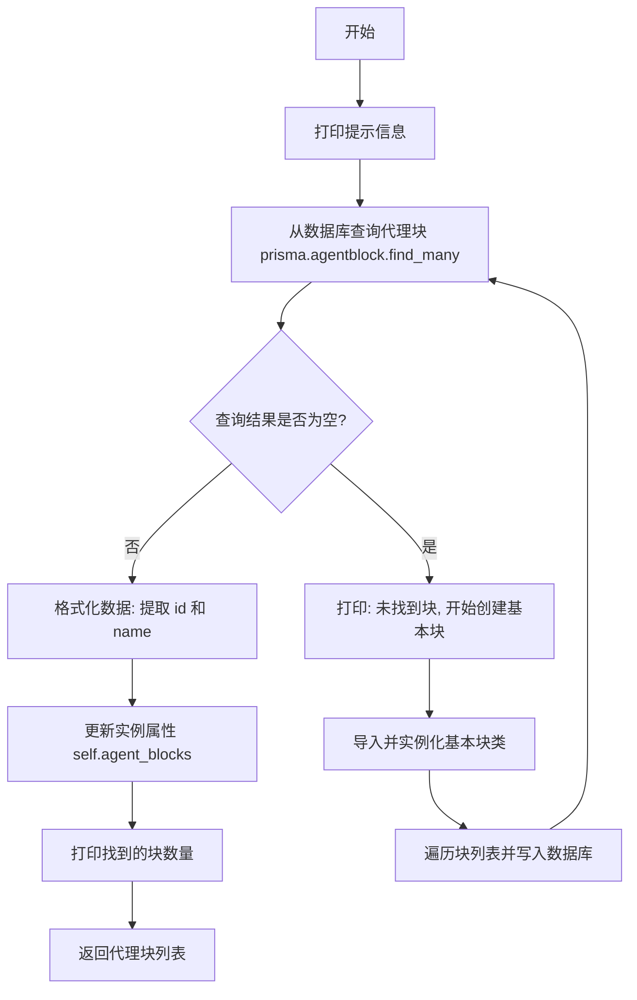

#### 带注释源码

```python
    async def get_available_blocks(self) -> List[Dict[str, Any]]:
        """Get available agent blocks from database."""
        print("Getting available agent blocks...")

        # 尝试从数据库获取现有的代理块
        # Get blocks from database instead of the registry
        db_blocks = await prisma.agentblock.find_many()
        
        # 如果数据库中没有块，则进行初始化创建
        if not db_blocks:
            print("No blocks found in database, creating some basic blocks...")
            # Create some basic blocks if none exist
            
            # 导入必要的块类
            from backend.blocks.io import AgentInputBlock, AgentOutputBlock
            from backend.blocks.maths import CalculatorBlock
            from backend.blocks.time_blocks import GetCurrentTimeBlock

            # 定义需要创建的基本块列表
            blocks_to_create = [
                AgentInputBlock(),
                AgentOutputBlock(),
                CalculatorBlock(),
                GetCurrentTimeBlock(),
            ]

            # 遍历列表并将每个块写入数据库
            for block in blocks_to_create:
                try:
                    await prisma.agentblock.create(
                        data={
                            "id": block.id,
                            "name": block.name,
                            "inputSchema": "{}",
                            "outputSchema": "{}",
                        }
                    )
                except Exception as e:
                    # 捕获并打印创建过程中的异常
                    print(f"Error creating block {block.name}: {e}")

            # 创建完成后，重新从数据库获取块列表
            # Get blocks again after creation
            db_blocks = await prisma.agentblock.find_many()

        # 将数据库返回的对象映射为仅包含 id 和 name 的字典列表
        self.agent_blocks = [
            {"id": block.id, "name": block.name} for block in db_blocks
        ]
        print(f"Found {len(self.agent_blocks)} blocks in database")
        
        # 返回处理后的代理块列表
        return self.agent_blocks
```


### `TestDataCreator.create_test_graphs`

Asynchronously creates a set number of test graphs for each test user using the API layer. It generates two types of graphs: simplified 'DummyInput' graphs (for specific indices) and complex 'Calculator' graphs with multiple linked nodes (AgentInput, Calculator, AgentOutput).

参数：

-  `self`：`TestDataCreator`，The instance of the TestDataCreator class.

返回值：`List[Dict[str, Any]]`，A list of dictionaries containing the data for the created graphs, including the user ID.

#### 流程图

```mermaid
flowchart TD
    A[Start Method] --> B[Iterate through self.users]
    B --> C[Generate num_graphs<br/>MIN to MAX range]
    C --> D[Loop: graph_num in range num_graphs]
    D --> E[Generate Graph ID]
    E --> F{Is graph_num < 4?<br/>(Dummy Input Check)}
    F -- Yes --> G[Create Single Node:<br/>GetCurrentTimeBlock]
    F -- No --> H[Create 4 Nodes:<br/>Input A, Input B,<br/>Calculator, Output]
    H --> I[Create Links:<br/>A->Calc, B->Calc,<br/>Calc->Output]
    G --> J[Generate Graph Name<br/>& Description]
    I --> J
    J --> K[Instantiate Graph Object]
    K --> L[Call API: create_graph]
    L --> M{Success?}
    M -- Yes --> N[Append to graphs list<br/>Print Success]
    M -- No --> O[Print Error & Continue]
    N --> D
    O --> D
    D -- End Loop --> P[Set self.agent_graphs]
    P --> Q[Return graphs]
```

#### 带注释源码

```python
    async def create_test_graphs(self) -> List[Dict[str, Any]]:
        """Create test graphs using the API function."""
        print("Creating test graphs...")

        graphs = []
        # Iterate over all pre-created test users
        for user in self.users:
            # Determine a random number of graphs to create for this user
            num_graphs = random.randint(MIN_GRAPHS_PER_USER, MAX_GRAPHS_PER_USER)

            for graph_num in range(num_graphs):
                # Create a simple graph with nodes and links
                graph_id = str(faker.uuid4())
                nodes = []
                links = []

                # Determine if this should be a DummyInput graph (first 3-4 graphs per user)
                is_dummy_input = graph_num < 4

                # Create nodes based on graph type
                if is_dummy_input:
                    # For dummy input graphs: only GetCurrentTimeBlock
                    node_id = str(faker.uuid4())
                    block = next(
                        b
                        for b in self.agent_blocks
                        if b["name"] == "GetCurrentTimeBlock"
                    )
                    input_default = {"trigger": "start", "format": "%H:%M:%S"}

                    node = Node(
                        id=node_id,
                        block_id=block["id"],
                        input_default=input_default,
                        metadata={"position": {"x": 0, "y": 0}},
                    )
                    nodes.append(node)
                else:
                    # For regular graphs: Create calculator agent pattern with 4 nodes
                    # Node 1: AgentInputBlock for 'a'
                    input_a_id = str(faker.uuid4())
                    input_a_block = next(
                        b for b in self.agent_blocks if b["name"] == "AgentInputBlock"
                    )
                    input_a_node = Node(
                        id=input_a_id,
                        block_id=input_a_block["id"],
                        input_default={
                            "name": "a",
                            "title": None,
                            "value": "",
                            "advanced": False,
                            "description": None,
                            "placeholder_values": [],
                        },
                        metadata={"position": {"x": -1012, "y": 674}},
                    )
                    nodes.append(input_a_node)

                    # Node 2: AgentInputBlock for 'b'
                    input_b_id = str(faker.uuid4())
                    input_b_block = next(
                        b for b in self.agent_blocks if b["name"] == "AgentInputBlock"
                    )
                    input_b_node = Node(
                        id=input_b_id,
                        block_id=input_b_block["id"],
                        input_default={
                            "name": "b",
                            "title": None,
                            "value": "",
                            "advanced": False,
                            "description": None,
                            "placeholder_values": [],
                        },
                        metadata={"position": {"x": -1117, "y": 78}},
                    )
                    nodes.append(input_b_node)

                    # Node 3: CalculatorBlock
                    calc_id = str(faker.uuid4())
                    calc_block = next(
                        b for b in self.agent_blocks if b["name"] == "CalculatorBlock"
                    )
                    calc_node = Node(
                        id=calc_id,
                        block_id=calc_block["id"],
                        input_default={"operation": "Add", "round_result": False},
                        metadata={"position": {"x": -435, "y": 363}},
                    )
                    nodes.append(calc_node)

                    # Node 4: AgentOutputBlock
                    output_id = str(faker.uuid4())
                    output_block = next(
                        b for b in self.agent_blocks if b["name"] == "AgentOutputBlock"
                    )
                    output_node = Node(
                        id=output_id,
                        block_id=output_block["id"],
                        input_default={
                            "name": "result",
                            "title": None,
                            "value": "",
                            "format": "",
                            "advanced": False,
                            "description": None,
                        },
                        metadata={"position": {"x": 402, "y": 0}},
                    )
                    nodes.append(output_node)

                    # Create links between nodes (only for non-dummy graphs with multiple nodes)
                    if len(nodes) >= 4:
                        # Use the actual node IDs from the created nodes instead of our variables
                        actual_input_a_id = nodes[0].id  # First node (input_a)
                        actual_input_b_id = nodes[1].id  # Second node (input_b)
                        actual_calc_id = nodes[2].id  # Third node (calculator)
                        actual_output_id = nodes[3].id  # Fourth node (output)

                        # Link input_a to calculator.a
                        link1 = Link(
                            source_id=actual_input_a_id,
                            sink_id=actual_calc_id,
                            source_name="result",
                            sink_name="a",
                            is_static=True,
                        )
                        links.append(link1)

                        # Link input_b to calculator.b
                        link2 = Link(
                            source_id=actual_input_b_id,
                            sink_id=actual_calc_id,
                            source_name="result",
                            sink_name="b",
                            is_static=True,
                        )
                        links.append(link2)

                        # Link calculator.result to output.value
                        link3 = Link(
                            source_id=actual_calc_id,
                            sink_id=actual_output_id,
                            source_name="result",
                            sink_name="value",
                            is_static=False,
                        )
                        links.append(link3)

                # Create graph object with DummyInput in name if it's a dummy input graph
                graph_name = faker.sentence(nb_words=3)
                if is_dummy_input:
                    graph_name = f"DummyInput {graph_name}"

                graph_name = f"{graph_name} Agents"

                graph = Graph(
                    id=graph_id,
                    name=graph_name,
                    description=faker.text(max_nb_chars=200),
                    nodes=nodes,
                    links=links,
                    is_active=True,
                )

                try:
                    # Use the API function to create graph
                    created_graph = await create_graph(graph, user["id"])
                    graph_dict = created_graph.model_dump()
                    # Ensure userId is included for store submissions
                    graph_dict["userId"] = user["id"]
                    graphs.append(graph_dict)
                    print(
                        f"✅ Created graph for user {user['id']}: {graph_dict['name']}"
                    )
                except Exception as e:
                    print(f"Error creating graph: {e}")
                    continue

        self.agent_graphs = graphs
        return graphs
```


### `TestDataCreator.create_test_library_agents`

该函数用于为 E2E 测试创建测试库代理。它通过遍历已生成的用户列表，为每个用户随机选择一定数量的现有图表，然后调用 API 函数将这些图表转换为库代理，最后将所有创建的代理信息收集并返回。

参数：

- `self`：`TestDataCreator`，类实例，提供访问已创建的用户和图表数据的上下文。

返回值：`List[Dict[str, Any]]`，包含所有成功创建的库代理详细信息的字典列表。

#### 流程图

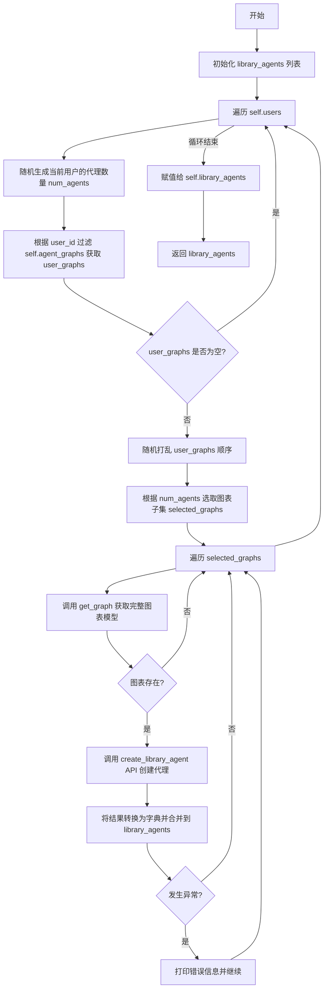

#### 带注释源码

```python
async def create_test_library_agents(self) -> List[Dict[str, Any]]:
    """Create test library agents using the API function."""
    print("Creating test library agents...")

    library_agents = []
    # 遍历所有已创建的用户
    for user in self.users:
        # 确定当前用户需要创建的代理数量
        num_agents = random.randint(MIN_AGENTS_PER_USER, MAX_AGENTS_PER_USER)

        # 获取属于当前用户的图表
        user_graphs = [
            g for g in self.agent_graphs if g.get("userId") == user["id"]
        ]
        # 如果该用户没有图表，跳过
        if not user_graphs:
            continue

        # 随机打乱图表顺序以避免总是选择相同的图表
        random.shuffle(user_graphs)
        # 根据数量选取图表子集
        selected_graphs = user_graphs[: min(num_agents, len(user_graphs))]

        # 遍历选中的图表
        for graph_data in selected_graphs:
            try:
                # 从后端数据库获取完整的图表模型对象
                from backend.data.graph import get_graph

                graph = await get_graph(
                    graph_data["id"],
                    graph_data.get("version", 1),
                    user_id=user["id"],
                )
                # 如果图表存在，调用 API 创建库代理
                if graph:
                    # create_library_agent 返回一个列表，这里将其展平并转换为字典
                    library_agents.extend(
                        v.model_dump()
                        for v in await create_library_agent(graph, user["id"])
                    )
            except Exception as e:
                # 捕获并打印错误，继续处理下一个图表
                print(f"Error creating library agent: {e}")
                continue

    # 将结果保存到实例变量中
    self.library_agents = library_agents
    return library_agents
```


### `TestDataCreator.create_test_presets`

该方法的核心功能是为每个测试用户创建指定数量的测试预设（Presets），将它们与之前生成的代理图谱关联，并通过API函数持久化到数据库中，以确保与未来模型更改的兼容性。

参数：

-   `self`：`TestDataCreator`，类的实例引用，用于访问用户列表和代理图谱数据。

返回值：`List[Dict[str, Any]]`，包含所有已创建的预设详细信息（字典格式）的列表。

#### 流程图

```mermaid
flowchart TD
    A[开始: 打印创建提示] --> B[初始化 presets 列表]
    B --> C[遍历 self.users 获取每个 user]
    C --> D[生成预设数量 num_presets\n随机范围 MIN_PRESETS 到 MAX_PRESETS]
    D --> E[筛选属于当前用户的 user_graphs]
    E --> F{user_graphs 是否为空?}
    F -- 是 --> C[继续下一个用户]
    F -- 否 --> G[循环 min(num_presets, user_graphs数量) 次]
    G --> H[随机选择一个 graph]
    H --> I[构造 LibraryAgentPresetCreatable 对象\n填充随机名称、描述、ID等]
    I --> J[调用 API create_preset 创建预设]
    J --> K{调用是否成功?}
    K -- 是 --> L[将结果转为字典并追加至 presets 列表]
    K -- 否 --> M[捕获异常并打印错误信息]
    L --> N{循环是否结束?}
    M --> N
    N -- 否 --> G
    N -- 是 --> C
    C --> O{所有用户处理完毕?}
    O -- 是 --> P[更新 self.presets 并返回 presets]
```

#### 带注释源码

```python
    async def create_test_presets(self) -> List[Dict[str, Any]]:
        """Create test presets using the API function."""
        print("Creating test presets...")

        presets = []
        for user in self.users:
            # 为当前用户确定要创建的预设数量（在最小值和最大值之间随机）
            num_presets = random.randint(MIN_PRESETS_PER_USER, MAX_PRESETS_PER_USER)

            # 筛选出属于当前用户的图谱
            user_graphs = [
                g for g in self.agent_graphs if g.get("userId") == user["id"]
            ]
            # 如果该用户没有图谱，则跳过
            if not user_graphs:
                continue

            # 循环创建预设，次数不超过预设数量限制或可用图谱数量
            for _ in range(min(num_presets, len(user_graphs))):
                graph = random.choice(user_graphs)

                # 构造预设数据对象
                preset_data = LibraryAgentPresetCreatable(
                    name=faker.sentence(nb_words=3),              # 随机生成名称
                    description=faker.text(max_nb_chars=200),     # 随机生成描述
                    graph_id=graph["id"],                        # 关联图谱ID
                    graph_version=graph.get("version", 1),        # 关联图谱版本
                    inputs={},                                    # 输入参数（测试数据为空）
                    credentials={},                              # 凭证（测试数据为空）
                    is_active=True,
                )

                try:
                    # 使用 API 函数创建预设
                    preset = await create_preset(user["id"], preset_data)
                    # 将创建的预设对象转换为字典并加入列表
                    presets.append(preset.model_dump())
                except Exception as e:
                    # 打印错误信息但继续执行
                    print(f"Error creating preset: {e}")
                    continue

        # 更新类实例中的预设列表并返回
        self.presets = presets
        return presets
```


### `TestDataCreator.create_test_api_keys`

该方法是 `TestDataCreator` 类的一部分，用于为系统中的测试用户批量创建 API 密钥。它通过调用后端 API 函数 `create_api_key` 来生成密钥，并为每个密钥分配特定的权限（执行图和读取图），以确保生成的密钥具备用于 E2E 测试的基本功能权限。生成的密钥对象会被保存为字典形式存储在实例变量中。

参数：

- `self`：`TestDataCreator`，类的实例引用。

返回值：`List[Dict[str, Any]]`，包含已创建的 API 密钥详细信息的字典列表。

#### 流程图

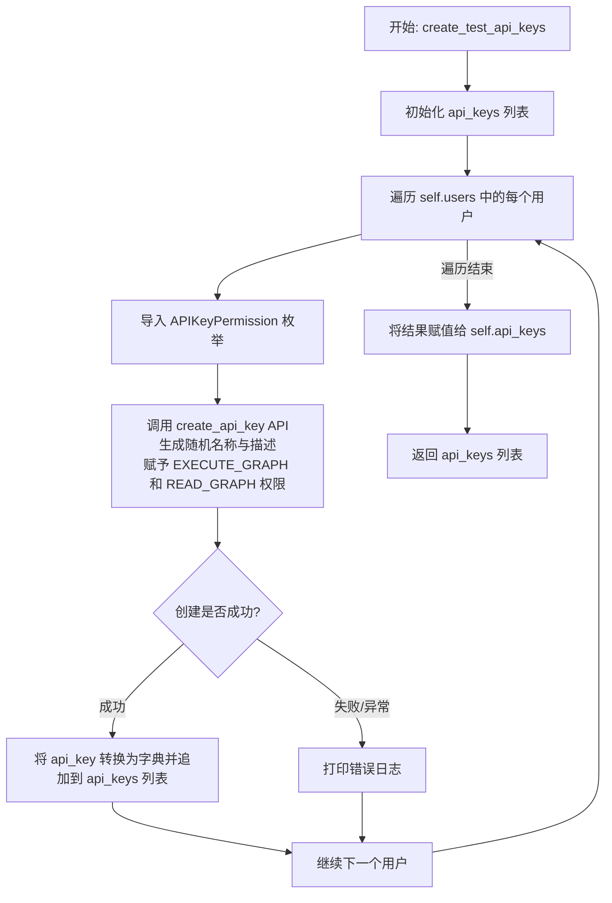

#### 带注释源码

```python
    async def create_test_api_keys(self) -> List[Dict[str, Any]]:
        """Create test API keys using the API function."""
        print("Creating test API keys...")

        api_keys = []
        for user in self.users:
            from backend.data.auth.api_key import APIKeyPermission

            try:
                # Use the API function to create API key
                # 调用底层API创建密钥，包含随机名称、用户ID、特定权限和描述
                api_key, _ = await create_api_key(
                    name=faker.word(),  # 随机生成的密钥名称
                    user_id=user["id"], # 关联到当前测试用户
                    permissions=[
                        APIKeyPermission.EXECUTE_GRAPH, # 赋予执行图的权限
                        APIKeyPermission.READ_GRAPH,    # 赋予读取图的权限
                    ],
                    description=faker.text(), # 随机生成的描述文本
                )
                # 将生成的密钥对象转换为字典并存入列表
                api_keys.append(api_key.model_dump())
            except Exception as e:
                # 捕获并打印创建过程中的异常，防止中断整个流程
                print(f"Error creating API key for user {user['id']}: {e}")
                continue

        # 将创建的密钥列表保存到实例变量中，供后续使用
        self.api_keys = api_keys
        return api_keys
```


### `TestDataCreator.update_test_profiles`

更新现有用户Profile以模拟市场环境，通过使用随机生成的详细信息（如姓名、头像、简介等）填充资料，并随机指定部分用户为“Featured Creator”（精选创作者），以满足E2E测试对市场数据的需求。

参数：

-   `self`：`TestDataCreator`，类的实例引用。

返回值：`List[Dict[str, Any]]`，包含已更新的用户Profile数据的字典列表。

#### 流程图

```mermaid
graph TD
    A[开始: update_test_profiles] --> B[从数据库查询所有现有的Profile]
    B --> C{是否存在现有Profile?}
    C -- 否 --> D[输出日志: 未找到Profile]
    D --> E[返回空列表]
    C -- 是 --> F[计算要升级为创作者的数量<br/>(约70%的现有用户)]
    F --> G[计算要标记为精选的数量<br/>(最小保证值或创作者的50%)]
    G --> H[随机抽取指定数量的Profile ID作为精选ID]
    H --> I[遍历选定的Profile列表]
    I --> J[判断当前Profile是否在精选ID集合中]
    J --> K[生成随机Mock数据:<br/>姓名, 用户名, 描述, 链接, 头像URL]
    K --> L[调用prisma.profile.update更新数据库记录]
    L --> M[将更新后的Profile对象添加到结果列表]
    M --> N{是否遍历完所有选定Profile?}
    N -- 否 --> I
    N -- 是 --> O[更新实例变量 self.profiles]
    O --> P[返回结果列表]
```

#### 带注释源码

```python
    async def update_test_profiles(self) -> List[Dict[str, Any]]:
        """Update existing user profiles to make some into featured creators."""
        print("Updating user profiles to create featured creators...")

        # 获取所有现有的Profile（这些Profile通常在用户创建时自动生成）
        # 使用当前测试用户ID列表进行筛选
        existing_profiles = await prisma.profile.find_many(
            where={"userId": {"in": [user["id"] for user in self.users]}}
        )

        # 如果没有找到Profile，直接返回空列表
        if not existing_profiles:
            print("No existing profiles found. Profiles may not be auto-created.")
            return []

        profiles = []
        # 选择大约70%的用户升级为“创作者”（即更新他们的Profile资料）
        num_creators = max(1, int(len(existing_profiles) * 0.7))
        selected_profiles = random.sample(
            existing_profiles, min(num_creators, len(existing_profiles))
        )

        # 确定精选创作者的数量
        # 至少保证 GUARANTEED_FEATURED_CREATORS (5) 个，或者是创作者总数的50%，取较大值
        # 同时不超过当前选中的Profile总数
        num_featured = max(GUARANTEED_FEATURED_CREATORS, int(num_creators * 0.5))
        num_featured = min(
            num_featured, len(selected_profiles)
        )  # Don't exceed available profiles
        
        # 随机挑选指定数量的Profile ID作为精选ID
        featured_profile_ids = set(
            random.sample([p.id for p in selected_profiles], num_featured)
        )
        print(
            f"🎯 Creating {num_featured} featured creators (min: {GUARANTEED_FEATURED_CREATORS})"
        )

        # 遍历选中的Profile并更新数据
        for profile in selected_profiles:
            try:
                # 检查当前Profile是否被选中为“精选”
                is_featured = profile.id in featured_profile_ids

                # 使用Prisma客户端更新Profile信息
                # 填充模拟的名称、用户名（添加随机数后缀保证唯一性）、描述、链接和头像
                updated_profile = await prisma.profile.update(
                    where={"id": profile.id},
                    data={
                        "name": faker.name(),
                        "username": faker.user_name()
                        + str(random.randint(100, 999)),  # Ensure uniqueness
                        "description": faker.text(max_nb_chars=200),
                        "links": [faker.url() for _ in range(random.randint(1, 3))],
                        "avatarUrl": get_image(),
                        "isFeatured": is_featured,
                    },
                )

                if updated_profile:
                    # 将更新后的模型对象转换为字典并添加到结果列表
                    profiles.append(updated_profile.model_dump())

            except Exception as e:
                print(f"Error updating profile {profile.id}: {e}")
                continue

        # 更新类实例的状态变量
        self.profiles = profiles
        return profiles
```


### `TestDataCreator.create_test_store_submissions`

Creates test store submissions for the marketplace, ensuring a minimum number of approved and featured agents through deterministic logic for E2E testing.

参数：

-  `self`：`TestDataCreator`，当前类的实例

返回值：`List[Dict[str, Any]]`，包含所有创建的商店提交记录的字典列表。

#### 流程图

```mermaid
flowchart TD
    A[Start: create_test_store_submissions] --> B[Initialize counters and lists]
    B --> C{Is test123@gmail.com<br/>present in users?}
    C -- Yes --> D[Create specific test submission]
    D --> E[Approve test submission]
    E --> F[Mark test submission as Featured]
    F --> G[Iterate through all users]
    C -- No --> G

    G --> H{Does user have graphs?}
    H -- No --> G
    H -- Yes --> I[Loop 4 times per user]
    
    I --> J[Select random graph]
    J --> K[Call create_store_submission API]
    K --> L{Submission created successfully?}
    L -- No --> I
    L -- Yes --> M{Should Approve?<br/>(Deterministic or Random)}
    
    M -- Yes --> N[Call review_store_submission API]
    N --> O{Should Feature?<br/>(Check featured count)}
    O -- Yes --> P[Update DB: isFeatured = True]
    O -- No --> Q[Random chance to feature?]
    Q -- Yes --> P
    Q -- No --> R[Continue]
    P --> S[Increment featured count]
    S --> R
    
    M -- No --> T{Randomly Reject?}
    T -- Yes --> U[Call review_store_submission API<br/>is_approved=False]
    T -- No --> V[Leave pending]
    U --> R
    V --> R
    
    R --> I
    I --> EndLoop[End Loop]
    EndLoop --> G
    G --> EndLoop2[End User Loop]
    EndLoop2 --> W[Print Summary Statistics]
    W --> X[Return submissions list]
```

#### 带注释源码

```python
    async def create_test_store_submissions(self) -> List[Dict[str, Any]]:
        """Create test store submissions using the API function.

        DETERMINISTIC: Guarantees minimum featured agents for E2E tests.
        """
        print("Creating test store submissions...")

        # 初始化提交列表和计数器
        submissions = []
        approved_submissions = []
        featured_count = 0
        submission_counter = 0

        # 1. 为特定测试用户 创建一个特殊的提交，确保前端测试有稳定数据
        test_user = next(
            (user for user in self.users if user["email"] == "test123@gmail.com"), None
        )
        if test_user and self.agent_graphs:
            # 构造硬编码的测试数据
            test_submission_data = {
                "user_id": test_user["id"],
                "agent_id": self.agent_graphs[0]["id"],
                "agent_version": 1,
                "slug": "test-agent-submission",
                "name": "Test Agent Submission",
                "sub_heading": "A test agent for frontend testing",
                "video_url": "https://www.youtube.com/watch?v=test123",
                "image_urls": [
                    "https://picsum.photos/200/300",
                    "https://picsum.photos/200/301",
                    "https://picsum.photos/200/302",
                ],
                "description": "This is a test agent submission specifically created for frontend testing purposes.",
                "categories": ["test", "demo", "frontend"],
                "changes_summary": "Initial test submission",
            }

            try:
                # 调用API创建提交
                test_submission = await create_store_submission(**test_submission_data)
                submissions.append(test_submission.model_dump())
                print("✅ Created special test store submission for test123@gmail.com")

                # 强制批准并设置为精选
                if test_submission.store_listing_version_id:
                    approved_submission = await review_store_submission(
                        store_listing_version_id=test_submission.store_listing_version_id,
                        is_approved=True,
                        external_comments="Test submission approved",
                        internal_comments="Auto-approved test submission",
                        reviewer_id=test_user["id"],
                    )
                    approved_submissions.append(approved_submission.model_dump())
                    print("✅ Approved test store submission")

                    # 直接操作数据库标记为精选
                    await prisma.storelistingversion.update(
                        where={"id": test_submission.store_listing_version_id},
                        data={"isFeatured": True},
                    )
                    featured_count += 1
                    print("🌟 Marked test agent as FEATURED")

            except Exception as e:
                print(f"Error creating test store submission: {e}")
                import traceback
                traceback.print_exc()

        # 2. 遍历所有用户，创建常规的商店提交
        for user in self.users:
            # 获取该用户拥有的图谱
            user_graphs = [
                g for g in self.agent_graphs if g.get("userId") == user["id"]
            ]
            print(f"User {user['id']} has {len(user_graphs)} graphs")
            if not user_graphs:
                print(
                    f"No graphs found for user {user['id']}, skipping store submissions"
                )
                continue

            # 每个用户尝试创建最多4个提交
            for submission_index in range(4):
                graph = random.choice(user_graphs)
                submission_counter += 1

                try:
                    print(
                        f"Creating store submission for user {user['id']} with graph {graph['id']}"
                    )

                    # 使用 Faker 生成随机数据并调用 API 创建提交
                    submission = await create_store_submission(
                        user_id=user["id"],
                        agent_id=graph["id"],
                        agent_version=graph.get("version", 1),
                        slug=faker.slug(),
                        name=graph.get("name", faker.sentence(nb_words=3)),
                        sub_heading=faker.sentence(),
                        video_url=get_video_url() if random.random() < 0.3 else None,
                        image_urls=[get_image() for _ in range(3)],
                        description=faker.text(),
                        categories=[get_category()],
                        changes_summary="Initial E2E test submission",
                    )
                    submissions.append(submission.model_dump())
                    print(f"✅ Created store submission: {submission.name}")

                    # 处理审核逻辑（批准/拒绝/精选）
                    if submission.store_listing_version_id:
                        # 决定性逻辑：前 N 个提交总是被批准，或者随机批准 (40% 概率)
                        should_approve = (
                            submission_counter <= GUARANTEED_TOP_AGENTS
                            or random.random() < 0.4
                        )
                        # 精选逻辑：只要还没达到保证的最小精选数，就应该标记为精选
                        should_feature = featured_count < GUARANTEED_FEATURED_AGENTS

                        if should_approve:
                            try:
                                reviewer_id = random.choice(self.users)["id"]
                                approved_submission = await review_store_submission(
                                    store_listing_version_id=submission.store_listing_version_id,
                                    is_approved=True,
                                    external_comments="Auto-approved for E2E testing",
                                    internal_comments="Automatically approved by E2E test data script",
                                    reviewer_id=reviewer_id,
                                )
                                approved_submissions.append(
                                    approved_submission.model_dump()
                                )
                                print(
                                    f"✅ Approved store submission: {submission.name}"
                                )

                                # 标记精选：基于决定性检查或20%的随机几率（额外奖励）
                                if should_feature:
                                    try:
                                        await prisma.storelistingversion.update(
                                            where={
                                                "id": submission.store_listing_version_id
                                            },
                                            data={"isFeatured": True},
                                        )
                                        featured_count += 1
                                        print(
                                            f"🌟 Marked agent as FEATURED ({featured_count}/{GUARANTEED_FEATURED_AGENTS}): {submission.name}"
                                        )
                                    except Exception as e:
                                        print(
                                            f"Warning: Could not mark submission as featured: {e}"
                                        )
                                elif random.random() < 0.2:
                                    try:
                                        await prisma.storelistingversion.update(
                                            where={
                                                "id": submission.store_listing_version_id
                                            },
                                            data={"isFeatured": True},
                                        )
                                        featured_count += 1
                                        print(
                                            f"🌟 Marked agent as FEATURED (bonus): {submission.name}"
                                        )
                                    except Exception as e:
                                        print(
                                            f"Warning: Could not mark submission as featured: {e}"
                                        )

                            except Exception as e:
                                print(
                                    f"Warning: Could not approve submission {submission.name}: {e}"
                                )
                        elif random.random() < 0.5:
                            # 随机拒绝部分提交
                            try:
                                reviewer_id = random.choice(self.users)["id"]
                                await review_store_submission(
                                    store_listing_version_id=submission.store_listing_version_id,
                                    is_approved=False,
                                    external_comments="Submission rejected - needs improvements",
                                    internal_comments="Automatically rejected by E2E test data script",
                                    reviewer_id=reviewer_id,
                                )
                                print(
                                    f"❌ Rejected store submission: {submission.name}"
                                )
                            except Exception as e:
                                print(
                                    f"Warning: Could not reject submission {submission.name}: {e}"
                                )
                        else:
                            # 留待审核
                            print(
                                f"⏳ Left submission pending for review: {submission.name}"
                            )

                except Exception as e:
                    print(
                        f"Error creating store submission for user {user['id']} graph {graph['id']}: {e}"
                    )
                    import traceback
                    traceback.print_exc()
                    continue

        # 打印统计摘要
        print("\n📊 Store Submissions Summary:")
        print(f"   Created: {len(submissions)}")
        print(f"   Approved: {len(approved_submissions)}")
        print(
            f"   Featured: {featured_count} (guaranteed min: {GUARANTEED_FEATURED_AGENTS})"
        )

        self.store_submissions = submissions
        return submissions
```


### `TestDataCreator.add_user_credits`

该方法是 `TestDataCreator` 类的成员函数，主要负责为测试用户列表中的每一位用户添加随机数量的积分（100-1000）。它通过获取用户的信用模型来执行充值操作，同时包含了健壮的错误处理机制，能够跳过被禁用的信用模型或处理充值过程中发生的异常，以确保整个测试数据生成流程不会因为个别用户的积分问题而中断。

参数：

- `self`：`TestDataCreator`，类的实例引用，用于访问用户列表 `self.users`。

返回值：`None`，无返回值。

#### 流程图

```mermaid
flowchart TD
    A([开始]) --> B[打印: Adding credits to users...]
    B --> C[遍历 self.users 列表]
    C --> D[获取当前用户的信用模型<br/>get_user_credit_model]
    D --> E{检查信用模型是否为 Disabled}
    E -- 是 (包含"Disabled") --> F[打印: Skipping credits - credits disabled]
    F --> G[continue: 进入下一次循环]
    E -- 否 --> H[生成随机积分数 100-1000]
    H --> I[调用 credit_model.top_up_credits]
    I --> J[打印: Added {amount} credits]
    J --> G
    D -.-> K[捕获 Exception 异常]
    I -.-> K
    K --> L[打印: Skipping credits - may be disabled]
    L --> G
    G --> C
    C -- 循环结束 --> M([结束])
```

#### 带注释源码

```python
    async def add_user_credits(self):
        """Add credits to users."""
        print("Adding credits to users...")

        # 遍历所有已创建的测试用户
        for user in self.users:
            try:
                # 根据用户ID获取该用户对应的信用模型
                credit_model = await get_user_credit_model(user["id"])

                # 检查信用模型是否被禁用
                # 通过判断类名中是否包含 "Disabled" 字符串来决定是否跳过
                if (
                    hasattr(credit_model, "__class__")
                    and "Disabled" in credit_model.__class__.__name__
                ):
                    print(f"Skipping credits for user {user['id']} - credits disabled")
                    continue

                # 生成一个 100 到 1000 之间的随机整数作为充值金额
                credit_amount = random.randint(100, 1000)

                # 调用信用模型的充值方法进行充值
                await credit_model.top_up_credits(
                    user_id=user["id"], amount=credit_amount
                )
                print(f"Added {credit_amount} credits to user {user['id']}")
            except Exception:
                # 捕获任何异常（如模型不支持充值或数据库错误）
                # 打印跳过信息并继续处理下一个用户，防止脚本中断
                print(
                    f"Skipping credits for user {user['id']}: credits may be disabled"
                )
                continue
```


### `TestDataCreator.create_all_test_data`

该方法是 E2E 测试数据生成的总入口，负责按依赖顺序编排所有测试数据的创建流程，包括用户、区块、图表、库代理、预设、API密钥、用户资料、商店提交记录及用户积分，并在最后刷新数据库物化视图以完成环境准备。

参数：

*   无

返回值：`None`，无返回值，直接执行数据库写入操作并打印日志。

#### 流程图

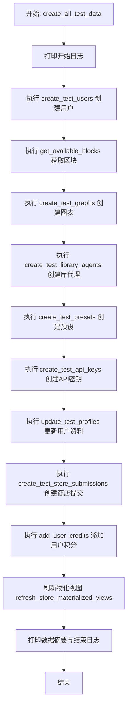

#### 带注释源码

```python
    async def create_all_test_data(self):
        """Create all test data."""
        print("Starting E2E test data creation...")

        # 1. 创建测试用户 (必须首先执行，因为后续数据依赖 user_id)
        await self.create_test_users()

        # 2. 获取可用的代理区块
        await self.get_available_blocks()

        # 3. 创建测试图表 (依赖用户和区块)
        await self.create_test_graphs()

        # 4. 创建测试库代理 (依赖图表)
        await self.create_test_library_agents()

        # 5. 创建测试预设 (依赖图表)
        await self.create_test_presets()

        # 6. 创建测试 API 密钥 (依赖用户)
        await self.create_test_api_keys()

        # 7. 更新测试用户资料 (生成特色创建者等)
        await self.update_test_profiles()

        # 8. 创建测试商店提交记录 (包含审核逻辑)
        await self.create_test_store_submissions()

        # 9. 为用户添加积分
        await self.add_user_credits()

        # 10. 刷新数据库物化视图以确保查询一致性
        print("Refreshing materialized views...")
        try:
            await prisma.execute_raw("SELECT refresh_store_materialized_views();")
        except Exception as e:
            print(f"Error refreshing materialized views: {e}")

        print("E2E test data creation completed successfully!")

        # 11. 打印最终的数据统计摘要
        print("\n🎉 E2E Test Data Creation Summary:")
        print(f"✅ Users created: {len(self.users)}")
        print(f"✅ Agent blocks available: {len(self.agent_blocks)}")
        print(f"✅ Agent graphs created: {len(self.agent_graphs)}")
        print(f"✅ Library agents created: {len(self.library_agents)}")
        print(f"✅ Creator profiles updated: {len(self.profiles)}")
        print(f"✅ Store submissions created: {len(self.store_submissions)}")
        print(f"✅ API keys created: {len(self.api_keys)}")
        print(f"✅ Presets created: {len(self.presets)}")
        print("\n🎯 Deterministic Guarantees:")
        print(f"   • Featured agents: >= {GUARANTEED_FEATURED_AGENTS}")
        print(f"   • Featured creators: >= {GUARANTEED_FEATURED_CREATORS}")
        print(f"   • Top agents (approved): >= {GUARANTEED_TOP_AGENTS}")
        print(f"   • Library agents per user: >= {MIN_AGENTS_PER_USER}")
        print("\n🚀 Your E2E test database is ready to use!")
```


## 关键组件


### TestDataCreator (核心控制器)

负责协调整个端到端测试数据的创建流程，管理用户、图表、预设和商店提交的状态与生成逻辑。

### Mock Data Generators (模拟数据生成器)

基于 Faker 库和预设的 URL 模板生成测试所需的模拟数据，包括随机图片 URL、YouTube 视频链接和代理分类标签。

### Graph Fabricator (图构建器)

负责构建复杂的代理图结构，根据特定模式（如 DummyInput 或 Calculator 模式）创建节点和链接，并将其保存到数据库。

### Store Marketplace Simulator (商店市场模拟器)

模拟应用商店的提交与审核流程，处理商店条目的创建，并通过逻辑控制确保生成指定数量的“特色”和“顶级”代理。

### Deterministic Data Strategy (确定性数据策略)

通过控制随机选择和计数器逻辑，确保生成的测试数据满足 E2E 测试所需的最低约束条件（如保证一定数量的精选代理和创作者）。

### Credit & Profile Manager (积分与配置文件管理器)

负责更新用户配置文件以生成特色创作者，并为测试用户账户分配积分，确保环境具备执行代理的资源。

### Database Materialized View Refresher (物化视图刷新器)

在数据生成完成后，通过 Prisma 客户端执行原始 SQL 命令，刷新数据库的物化视图以保持数据一致性。


## 问题及建议


### 已知问题

-   **代码实现与文档描述不一致**：文件开头的注释声明使用 API 函数代替直接 Prisma 调用，但在 `get_available_blocks`、`update_test_profiles` 和 `create_test_store_submissions` 等方法中，直接使用了 `prisma.agentblock.find_many`、`prisma.profile.update` 和 `prisma.storelistingversion.update`，破坏了分层架构的一致性。
-   **硬编码的配置参数**：`NUM_USERS`、`NUM_AGENT_BLOCKS` 等常量硬编码在文件顶部，缺乏配置文件或环境变量的支持，导致在不同环境（如开发环境仅需少量数据，CI环境需大量数据）下调整困难。
-   **缺乏幂等性和清理机制**：脚本没有提供清理旧测试数据的功能。重复运行脚本会导致数据库中的测试数据不断累积，可能会引起唯一性约束冲突或数据污染。
-   **外部服务依赖风险**：`get_image` 和 `get_video_url` 依赖 `picsum.photos` 和 `youtube.com`。如果测试环境网络受限或外部服务不可用，脚本执行将失败或数据不完整，影响 E2E 测试的稳定性。
-   **宽泛的异常处理掩盖错误**：大量使用 `try-except Exception` 块仅打印错误然后 `continue`。这可能导致部分关键数据（如 Featured Agents）创建失败时，脚本仍然返回成功，但实际测试环境数据不达标。
-   **性能瓶颈**：数据生成过程采用串行执行（例如在循环中使用 `await`），对于用户和图表的创建操作，并没有利用 `asyncio` 的并发能力，导致在大数据量下运行时间过长。

### 优化建议

-   **统一数据访问层**：重构代码，移除所有直接调用 `prisma` 客户端的代码，封装或复用现有的 backend API 函数，确保所有操作通过 API 层进行，以符合设计初衷并隔离数据库变更。
-   **引入配置管理**：将硬编码的常量移至配置文件（如 YAML/JSON）或通过环境变量注入，允许在不修改代码的情况下调整生成的数据量级和类型。
-   **实现数据清理与幂等性**：在 `create_all_test_data` 开始前增加清理逻辑，或者根据特定的 Tag/Prefix 检查数据是否已存在，确保多次运行结果一致且可控。
-   **支持并发执行**：利用 `asyncio.gather` 将互不依赖的操作（如创建用户、创建独立的图表）并发执行，显著缩短测试数据的准备时间。
-   **增强错误处理与校验**：将错误收集起来并在最后统一抛出，或在脚本结束时检查关键指标（如 `GUARANTEED_FEATURED_AGENTS`）是否满足，如果不满足则退出并报错，确保测试数据的完整性。
-   **模拟外部资源**：对于图片和视频 URL，建议使用本地 mock 服务或者配置为占位符 URL，避免依赖外部网络服务，提升测试环境的独立性和稳定性。
-   **模板化数据生成**：`create_test_graphs` 方法中构建节点和连线的逻辑较为冗长且固定，建议将不同类型的 Graph（如 DummyInput, Calculator）抽象为模板类或 Builder 模式，提高代码的可读性和可扩展性。


## 其它


### 设计目标与约束

**设计目标：**
1.  **API 层优先**：优先使用后端 API 函数（如 `create_graph`, `create_store_submission`）而非直接的数据库操作，以确保生成的测试数据符合业务逻辑验证，并与未来的模型更改保持兼容。
2.  **E2E 测试覆盖**：生成足够数量且多样化的数据（用户、图表、代理、提交记录等），以支持端到端测试场景，特别是针对商店、展示和搜索功能的测试。
3.  **确定性数据**：通过 `GUARANTEED_*` 常量控制，确保生成特定数量的“特色代理”、“精选创作者”和“顶级代理”，以满足前端展示测试的固定需求。
4.  **自动化执行**：提供一个独立的脚本入口 `main`，自动完成从数据库连接到数据生成及清理资源的全过程。

**约束：**
1.  **外部依赖**：依赖外部服务 `picsum.photos` 生成图片 URL 和 `youtube.com` 生成视频 URL，需要网络连接或 DNS 配置。
2.  **环境配置**：需要在 `next.config.js` 中配置允许的图片域名，且运行环境需配置有效的 Supabase 和数据库连接。
3.  **数据关系**：数据生成具有严格的顺序依赖（例如：必须先有用户才能有图表，必须有图表才能有商店提交），不能随意并行化或乱序执行。
4.  **ID 引用**：脚本内部通过维护内存中的对象列表（如 `self.users`）来传递 ID，避免频繁查询数据库，但也增加了内存占用。

### 错误处理与异常设计

**设计原则：**
采用“尽力而为”的容错策略，确保单个实体的创建失败不会中断整个批量数据生成过程。

**具体实现：**
1.  **捕获与继续**：在批量循环（如创建用户、图表）内部使用 `try-except` 块。当某个特定项（如单个用户或图表）创建失败时，打印错误日志并 `continue`，而不是抛出异常导致程序终止。
2.  **回退机制**：在 `create_test_users` 中，如果 Supabase Auth 创建用户失败，脚本会捕获异常并回退到直接在本地数据库创建用户记录的逻辑，保证测试用户数据存在。
3.  **特定逻辑跳过**：在 `add_user_credits` 中，检查信用模型是否被禁用（`Disabled` 在类名中），若禁用则直接跳过，避免不必要的 API 调用和异常。
4.  **资源清理保障**：在 `main` 函数中使用 `try-finally` 结构，确保无论数据生成过程中是否发生未捕获的异常，数据库连接 (`prisma.disconnect()`) 都会被正确关闭。
5.  **非关键性失败记录**：对于刷新物化视图等非关键性操作，即使失败也仅打印警告，不影响最终的成功状态判定。

### 数据流与状态机

**数据流向：**
数据生成遵循严格的线性流水线结构，各阶段依次执行并将结果传递给下一阶段：
1.  **初始化阶段**：连接数据库，实例化 `TestDataCreator`。
2.  **基础数据层**：创建 Users -> 获取/创建 Agent Blocks。
3.  **核心实体层**：创建 Graphs (依赖 Users, Blocks) -> 创建 Library Agents (依赖 Graphs) -> 创建 Presets (依赖 Graphs)。
4.  **扩展属性层**：创建 API Keys (依赖 Users) -> 更新 Profiles (依赖 Users) -> 创建 Store Submissions (依赖 Users, Graphs) -> 添加 Credits (依赖 Users)。
5.  **后处理阶段**：刷新数据库物化视图 -> 断开连接。

**状态管理：**
*   **内存状态缓存**：`TestDataCreator` 类充当状态容器，使用 `self.users`, `self.agent_graphs` 等列表属性缓存已创建的数据。这不仅避免了在后续步骤中重复查询数据库（例如在创建 Store Submission 时从 `self.agent_graphs` 获取 Graph ID），还确保了数据生成的关联性。
*   **状态转换**：数据在数据库中的状态是单向递增的（从无到有），脚本内部不涉及复杂的状态机流转，主要通过方法的调用顺序来保证状态的一致性。

### 外部依赖与接口契约

**外部库依赖：**
1.  **faker (`Faker`)**：用于生成随机且合理的测试数据（姓名、邮件、文本等）。契约：调用方法需返回符合预期类型的随机字符串。
2.  **asyncio (`asyncio`)**：用于处理异步 IO 操作。契约：所有涉及 IO 的方法必须为 `async def`，并通过 `await` 调用。
3.  **random (`random`)**：用于生成随机数和随机选择。

**系统服务依赖：**
1.  **Supabase Client (`get_supabase`)**：
    *   **用途**：处理认证用户创建。
    *   **契约**：返回的 client 对象需支持 `auth.admin.create_user` 方法。
2.  **Prisma Client (`prisma`)**：
    *   **用途**：直接数据库访问（用于部分绕过 API 的操作，如 Block 创建、Profile 更新、View 刷新）。
    *   **契约**：需连接至有效的 PostgreSQL 数据库，支持 `model.find_many`, `model.create`, `model.update`, `execute_raw` 等操作。
3.  **Backend API Modules**：
    *   **`backend.data.user`**：`get_or_create_user` - 契约：接收用户字典，返回 User 模型。
    *   **`backend.data.graph`**：`create_graph`, `get_graph` - 契约：接收 Graph 对象和 ID，返回创建的 Graph 模型。
    *   **`backend.data.credit`**：`get_user_credit_model` - 契约：返回包含 `top_up_credits` 方法的对象。
    *   **`backend.api.features.library.db`**：`create_library_agent`, `create_preset`。
    *   **`backend.api.features.store.db`**：`create_store_submission`, `review_store_submission`。
    *   **`backend.data.auth.api_key`**：`create_api_key`。

**外部网络资源：**
1.  **picsum.photos**：提供图片 URL。契约：通过 HTTP GET 返回图片。
2.  **youtube.com**：提供视频 URL。契约：提供有效的视频 ID 格式。

    