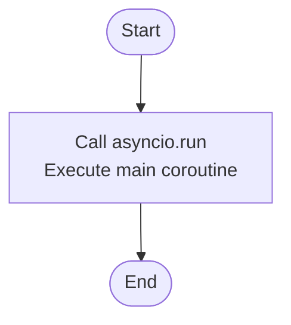

# `.\AutoGPT\autogpt_platform\backend\test\load_store_agents.py` 详细设计文档

该脚本的核心功能是将本地 agents 文件夹中导出的代理数据（包含 JSON 结构定义和 CSV 元数据）批量加载并同步到测试数据库中，流程包括初始化代码块、创建特定用户、解析代理图及其节点链接、生成商店列表记录，并在完成后刷新数据库视图。

## 整体流程

```mermaid
graph TD
    Start[开始] --> Connect[连接数据库]
    Connect --> InitBlocks[初始化代理代码块]
    InitBlocks --> CreateUser[创建 AutoGPT 用户和个人资料]
    CreateUser --> LoadCSV[加载 CSV 元数据]
    LoadCSV --> ListFiles[列出 agents 目录下所有 JSON 文件]
    ListFiles --> Loop{遍历 JSON 文件}
    Loop -- 下一个文件 --> MatchCSV[匹配 CSV 中的元数据]
    MatchCSV --> Found{匹配成功?}
    Found -- 否 --> Loop
    Found -- 是 --> TxStart[开启数据库事务]
    TxStart --> LoadJSON[加载并解析 JSON 文件]
    LoadJSON --> CreateGraph[创建 AgentGraph (含节点和链接)]
    CreateGraph --> CreateStore[创建 StoreListing 及版本]
    CreateStore --> TxCommit[提交事务]
    TxCommit --> Loop
    Loop -- 全部完成 --> RefreshViews[刷新物化视图]
    RefreshViews --> End[断开连接并结束]
```

## 类结构

```
No User Defined Classes
```

## 全局变量及字段


### `AGENTS_DIR`
    
Path to the agents folder relative to the backend directory, containing exported agent JSON files.

类型：`pathlib.Path`
    


### `CSV_FILE`
    
File path to the CSV metadata file containing store listing details.

类型：`pathlib.Path`
    


### `AUTOGPT_USER_ID`
    
Fixed UUID for the 'autogpt' creator user to ensure idempotency across script runs.

类型：`str`
    


### `AUTOGPT_EMAIL`
    
Email address associated with the autogpt test user.

类型：`str`
    


### `AUTOGPT_USERNAME`
    
Username for the autogpt test user.

类型：`str`
    


    

## 全局函数及方法


### `initialize_blocks`

从已注册的块初始化数据库中的代理块，确保代码定义的块与数据库记录同步。如果块不存在则创建，如果ID或名称发生变化则更新，最后返回数据库中存在的块ID集合。

参数：

- `db`：`Prisma`，Prisma 客户端实例，用于执行数据库操作。

返回值：`set[str]`，包含已初始化（存在或已创建）的所有块 ID 的集合。

#### 流程图


#### 带注释源码

```python
async def initialize_blocks(db: Prisma) -> set[str]:
    """Initialize agent blocks in the database from the registered blocks.

    Returns a set of block IDs that exist in the database.
    """
    from backend.data.block import get_blocks

    print("  Initializing agent blocks...")
    # 获取所有已注册的块类字典
    blocks = get_blocks()
    created_count = 0
    block_ids = set()

    for block_cls in blocks.values():
        # 实例化块对象以获取其属性
        block = block_cls()
        block_ids.add(block.id)
        
        # 在数据库中查找是否已存在相同 ID 或名称的块
        existing_block = await db.agentblock.find_first(
            where={"OR": [{"id": block.id}, {"name": block.name}]}
        )
        
        if not existing_block:
            # 如果不存在，则在数据库中创建新块
            await db.agentblock.create(
                data=AgentBlockCreateInput(
                    id=block.id,
                    name=block.name,
                    inputSchema=json.dumps(block.input_schema.jsonschema()),
                    outputSchema=json.dumps(block.output_schema.jsonschema()),
                )
            )
            created_count += 1
        elif block.id != existing_block.id or block.name != existing_block.name:
            # 如果存在但 ID 或名称不匹配（可能名称冲突但ID不同），则更新记录
            await db.agentblock.update(
                where={"id": existing_block.id},
                data={
                    "id": block.id,
                    "name": block.name,
                    "inputSchema": json.dumps(block.input_schema.jsonschema()),
                    "outputSchema": json.dumps(block.output_schema.jsonschema()),
                },
            )

    print(f"  Initialized {len(blocks)} blocks ({created_count} new)")
    return block_ids
```


### `ensure_block_exists`

确保数据库中存在指定的代理区块，如果不存在则创建一个占位符区块。该函数通过内存缓存和数据库查询来验证区块的存在性，主要用于处理在导入代理图时可能引用但尚未注册的区块。

参数：

- `db`：`Prisma`，Prisma 客户端实例，用于执行数据库操作。
- `block_id`：`str`，需要检查并确保存在的区块 ID。
- `known_blocks`：`set[str]`，内存缓存集合，存储已知存在的区块 ID，以减少数据库查询。

返回值：`bool`，如果区块已存在、在内存缓存中找到或成功创建占位符，则返回 True；如果创建占位符失败，则返回 False。

#### 流程图


#### 带注释源码

```python
async def ensure_block_exists(
    db: Prisma, block_id: str, known_blocks: set[str]
) -> bool:
    """Ensure a block exists in the database, create a placeholder if needed.

    Returns True if the block exists (or was created), False otherwise.
    """
    # 步骤 1: 检查内存缓存
    # 如果区块 ID 已经在已知集合中，直接返回 True，避免不必要的数据库查询
    if block_id in known_blocks:
        return True

    # 步骤 2: 检查数据库
    # 如果不在缓存中，查询数据库确认该 Block 是否已被持久化
    existing = await db.agentblock.find_unique(where={"id": block_id})
    if existing:
        # 如果数据库中存在，更新缓存并返回 True
        known_blocks.add(block_id)
        return True

    # 步骤 3: 创建占位符
    # 如果数据库中也不存在，为了保持图结构的完整性，创建一个空的占位符 Block
    print(f"    Creating placeholder block: {block_id}")
    try:
        await db.agentblock.create(
            data=AgentBlockCreateInput(
                id=block_id,
                # 使用 ID 的前 8 位作为占位符名称
                name=f"Placeholder_{block_id[:8]}",
                inputSchema="{}",
                outputSchema="{}",
            )
        )
        # 创建成功，更新缓存并返回 True
        known_blocks.add(block_id)
        return True
    except Exception as e:
        # 步骤 4: 错误处理
        # 如果创建失败（例如 ID 冲突或其他数据库约束），捕获异常并打印警告
        print(f"    Warning: Could not create placeholder block {block_id}: {e}")
        return False
```


### `parse_image_urls`

该函数用于从 CSV 格式的字符串（如 `["url1","url2"]`）中解析图像 URL，将其转换为字符串列表，并处理空输入或 JSON 解析错误的情况。

参数：

-   `image_str`：`str`，包含图像 URL 列表的字符串，通常为 JSON 数组格式的字符串。

返回值：`list[str]`，解析后的图像 URL 字符串列表。如果输入为空、"[]" 或发生 JSON 解析错误，则返回空列表。

#### 流程图

```mermaid
flowchart TD
    A[开始: 接收 image_str] --> B{判断 image_str 是否为空或等于 "[]"}
    B -- 是 --> C[返回空列表]
    B -- 否 --> D[尝试执行 json.loads 解析字符串]
    D -- 成功 --> E[返回解析结果列表]
    D -- 失败 JSONDecodeError --> F[捕获异常]
    F --> G[返回空列表]
```

#### 带注释源码

```python
def parse_image_urls(image_str: str) -> list[str]:
    """Parse the image URLs from CSV format like ["url1","url2"]."""
    # 检查输入字符串是否为空或是否为空数组的字符串表示
    if not image_str or image_str == "[]":
        return []
    try:
        # 尝试将字符串作为 JSON 格式进行解析并返回
        return json.loads(image_str)
    except json.JSONDecodeError:
        # 如果解析失败（格式错误），返回空列表
        return []
```


### `parse_categories`

Parse categories from CSV format like ["cat1","cat2"].

参数：

-  `categories_str`：`str`，包含类别JSON数组字符串的输入参数（例如 '["cat1","cat2"]'）。

返回值：`list[str]`，解析后的类别字符串列表，如果输入为空、为"[]"或格式错误则返回空列表。

#### 流程图

```mermaid
flowchart TD
    A[开始: parse_categories] --> B{categories_str 是否为空<br/>或等于 '[]'?}
    B -- 是 --> C[返回空列表 []]
    B -- 否 --> D[尝试执行 json.loads]
    D --> E{解析是否成功?}
    E -- 是 --> F[返回解析后的列表]
    E -- 否 (捕获 JSONDecodeError) --> C
```

#### 带注释源码

```python
def parse_categories(categories_str: str) -> list[str]:
    """Parse categories from CSV format like ["cat1","cat2"]."""
    # 检查输入字符串是否为空或为空的JSON数组表示
    if not categories_str or categories_str == "[]":
        return []
    try:
        # 尝试将字符串解析为JSON对象（列表）
        return json.loads(categories_str)
    except json.JSONDecodeError:
        # 如果解析失败（格式错误），返回空列表
        return []
```


### `sanitize_slug`

确保生成的 Slug 仅包含有效的 URL 友好字符（小写字母、数字和连字符）。

参数：

- `slug`：`str`，待处理的原始字符串，通常用于生成 URL 路径或标识符。

返回值：`str`，处理后的字符串，其中所有非小写字母、非数字及非连字符的字符均已被移除。

#### 流程图


#### 带注释源码

```python
def sanitize_slug(slug: str) -> str:
    """Ensure slug only contains valid characters."""
    # 1. 将输入字符串转换为全小写
    # 2. 使用正则表达式替换操作：
    #    模式 r"[^a-z0-9-]" 匹配任何不是小写字母、数字或连字符的字符
    #    将这些匹配到的字符替换为空字符串，即删除它们
    return re.sub(r"[^a-z0-9-]", "", slug.lower())
```


### `create_user_and_profile`

在数据库中创建预定义的 'autogpt' 用户及其对应的个人资料记录。该函数首先检查用户是否已存在，若不存在则创建；随后检查该用户的个人资料是否存在，若不存在则创建，确保操作的幂等性。

参数：

- `db`：`Prisma`，用于执行数据库操作的 Prisma 客户端实例。

返回值：`None`，该函数为异步过程，不返回任何值。

#### 流程图


#### 带注释源码

```python
async def create_user_and_profile(db: Prisma) -> None:
    """Create the autogpt user and profile if they don't exist."""
    
    # 步骤 1: 检查用户是否已存在于数据库中
    existing_user = await db.user.find_unique(where={"id": AUTOGPT_USER_ID})
    if existing_user:
        # 如果用户已存在，打印日志并跳过创建步骤
        print(f"User {AUTOGPT_USER_ID} already exists, skipping user creation")
    else:
        # 如果用户不存在，则创建新用户，使用预定义的常量
        print(f"Creating user {AUTOGPT_USER_ID}")
        await db.user.create(
            data=UserCreateInput(
                id=AUTOGPT_USER_ID,
                email=AUTOGPT_EMAIL,
                name="AutoGPT",
                metadata=Json({}),
                integrations="",
            )
        )

    # 步骤 2: 检查该用户的个人资料是否已存在
    existing_profile = await db.profile.find_first(where={"userId": AUTOGPT_USER_ID})
    if existing_profile:
        # 如果个人资料已存在，打印日志并跳过创建步骤
        print(
            f"Profile for user {AUTOGPT_USER_ID} already exists, skipping profile creation"
        )
    else:
        # 如果个人资料不存在，则创建新的个人资料记录
        print(f"Creating profile for user {AUTOGPT_USER_ID}")
        await db.profile.create(
            data=ProfileCreateInput(
                userId=AUTOGPT_USER_ID,
                name="AutoGPT",
                username=AUTOGPT_USERNAME,
                description="Official AutoGPT agents and templates",
                links=["https://agpt.co"],
                avatarUrl="https://storage.googleapis.com/agpt-prod-website-artifacts/users/b3e41ea4-2f4c-4964-927c-fe682d857bad/images/4b5781a6-49e1-433c-9a75-65af1be5c02d.png",
            )
        )
```


### `load_csv_metadata`

读取并解析CSV文件中的Store Agent元数据，对图片、类别等字段进行特定处理，并将其转换为以 `storeListingVersionId` 为键的字典结构返回。

参数：

-  无参数

返回值：`dict[str, dict]`，包含解析后的代理元数据的字典，键为 `storeListingVersionId`，值为包含详细代理信息的字典。

#### 流程图

```mermaid
graph TD
    A[开始 load_csv_metadata] --> B[打开 CSV_FILE 文件]
    B --> C[初始化空字典 metadata]
    C --> D[创建 csv.DictReader 读取器]
    D --> E{遍历 CSV 每一行 row}
    E -- 提取行数据 --> F[获取 storeListingVersionId 作为 version_id]
    F --> G[解析并处理行数据字段]
    G --> G1[处理 slug: sanitize_slug]
    G --> G2[处理图片: parse_image_urls]
    G --> G3[处理分类: parse_categories]
    G --> G4[处理布尔值: featured, useForOnboarding, is_available]
    G1 & G2 & G3 & G4 --> H[构建内部字典 entry]
    H --> I[将 entry 存入 metadata: metadata[version_id] = entry]
    I --> E
    E -- 文件结束 --> J[返回 metadata]
    J --> K[结束]
```

#### 带注释源码

```python
async def load_csv_metadata() -> dict[str, dict]:
    """Load CSV metadata and return a dict keyed by storeListingVersionId."""
    # 初始化结果字典，用于存储所有代理的元数据
    metadata = {}
    
    # 打开全局变量 CSV_FILE 指定的文件路径，使用 utf-8 编码
    with open(CSV_FILE, "r", encoding="utf-8") as f:
        # 使用 DictReader 将 CSV 每行读取为字典，键为表头
        reader = csv.DictReader(f)
        
        # 遍历 CSV 文件的每一行
        for row in reader:
            # 获取当前行的版本 ID 作为主键
            version_id = row["storeListingVersionId"]
            
            # 构建该版本的详细元数据字典
            metadata[version_id] = {
                "listing_id": row["listing_id"],
                "store_listing_version_id": version_id,
                # 对 slug 进行清洗，去除非法字符
                "slug": sanitize_slug(row["slug"]),
                "agent_name": row["agent_name"],
                # 如果视频字段非空则保留，否则设为 None
                "agent_video": row["agent_video"] if row["agent_video"] else None,
                # 解析 JSON 格式的图片字符串为列表
                "agent_image": parse_image_urls(row["agent_image"]),
                # 将字符串 "true"/"false" 转换为布尔值
                "featured": row["featured"].lower() == "true",
                "sub_heading": row["sub_heading"],
                "description": row["description"],
                # 解析 JSON 格式的分类字符串为列表
                "categories": parse_categories(row["categories"]),
                # 将字符串 "true"/"false" 转换为布尔值
                "use_for_onboarding": row["useForOnboarding"].lower() == "true",
                # 将字符串 "true"/"false" 转换为布尔值
                "is_available": row["is_available"].lower() == "true",
            }
    # 返回填充完毕的元数据字典
    return metadata
```


### `load_agent_json`

从指定路径异步加载并解析代理 JSON 文件内容，返回解析后的字典数据。

参数：

-   `json_path`：`Path`，指向代理 JSON 文件的路径对象。

返回值：`dict`，包含从 JSON 文件中解析出的代理数据的字典。

#### 流程图


#### 带注释源码

```python
async def load_agent_json(json_path: Path) -> dict:
    """Load and parse an agent JSON file."""
    # 使用 Path 对象打开文件，指定编码为 utf-8
    # 注意：虽然函数被定义为 async，但内部使用了同步 I/O (open/json.load)
    with open(json_path, "r", encoding="utf-8") as f:
        # 将文件内容解析为 Python 字典并返回
        return json.load(f)
```


### `create_agent_graph`

该函数负责从提供的字典数据中创建一个 AgentGraph 记录及其关联的节点和链接。它首先检查图是否已存在以避免重复创建，随后创建主图记录，遍历并创建节点（确保引用的块存在），创建节点间的链接，并递归处理嵌套的子图结构。

参数：

- `db`：`Prisma`，Prisma 数据库客户端实例，用于执行数据库操作。
- `agent_data`：`dict`，包含代理图定义的字典，涵盖图ID、版本、名称、描述、节点列表、链接列表及子图等信息。
- `known_blocks`：`set[str]`，数据库中已知块ID的集合，用于验证节点依赖的块是否存在或需要创建占位符。

返回值：`tuple[str, int]`，包含创建或已存在的图 ID (`graph_id`) 和版本号 (`version`) 的元组。

#### 流程图


#### 带注释源码

```python
async def create_agent_graph(
    db: Prisma, agent_data: dict, known_blocks: set[str]
) -> tuple[str, int]:
    """Create an AgentGraph and its nodes/links from JSON data."""
    # 获取图的ID和版本号
    graph_id = agent_data["id"]
    version = agent_data.get("version", 1)

    # 检查数据库中是否已存在该版本的图，避免重复创建
    existing_graph = await db.agentgraph.find_unique(
        where={"graphVersionId": {"id": graph_id, "version": version}}
    )
    if existing_graph:
        print(f"  Graph {graph_id} v{version} already exists, skipping")
        return graph_id, version

    # 打印创建日志
    print(
        f"  Creating graph {graph_id} v{version}: {agent_data.get('name', 'Unnamed')}"
    )

    # 在数据库中创建主图记录
    await db.agentgraph.create(
        data=AgentGraphCreateInput(
            id=graph_id,
            version=version,
            name=agent_data.get("name"),
            description=agent_data.get("description"),
            instructions=agent_data.get("instructions"),
            recommendedScheduleCron=agent_data.get("recommended_schedule_cron"),
            isActive=agent_data.get("is_active", True),
            userId=AUTOGPT_USER_ID,
            forkedFromId=agent_data.get("forked_from_id"),
            forkedFromVersion=agent_data.get("forked_from_version"),
        )
    )

    # 处理节点创建
    nodes = agent_data.get("nodes", [])
    for node in nodes:
        block_id = node["block_id"]
        # 确保节点引用的块在数据库中存在，若不存在则尝试创建占位符
        block_exists = await ensure_block_exists(db, block_id, known_blocks)
        if not block_exists:
            print(
                f"    Skipping node {node['id']} - block {block_id} could not be created"
            )
            continue

        # 创建节点记录
        await db.agentnode.create(
            data=AgentNodeCreateInput(
                id=node["id"],
                agentBlockId=block_id,
                agentGraphId=graph_id,
                agentGraphVersion=version,
                constantInput=Json(node.get("input_default", {})),
                metadata=Json(node.get("metadata", {})),
            )
        )

    # 处理节点间的连接（链接）创建
    links = agent_data.get("links", [])
    for link in links:
        await db.agentnodelink.create(
            data=AgentNodeLinkCreateInput(
                id=link["id"],
                agentNodeSourceId=link["source_id"],
                agentNodeSinkId=link["sink_id"],
                sourceName=link["source_name"],
                sinkName=link["sink_name"],
                isStatic=link.get("is_static", False),
            )
        )

    # 递归处理嵌套的子图
    sub_graphs = agent_data.get("sub_graphs", [])
    for sub_graph in sub_graphs:
        await create_agent_graph(db, sub_graph, known_blocks)

    # 返回创建的图ID和版本
    return graph_id, version
```


### `create_store_listing`

创建 StoreListing 和 StoreListingVersion 记录，将 Agent Graph 关联到商店列表中。如果元数据标记为可用，则自动批准该列表并关联激活版本。

参数：

- `db`：`Prisma`，Prisma 数据库客户端实例，用于执行数据库操作。
- `graph_id`：`str`，关联的 AgentGraph 的 ID。
- `graph_version`：`int`，关联的 AgentGraph 的版本号。
- `metadata`：`dict`，包含商店列表详细信息的字典（如名称、描述、图片、可用性状态等），通常来源于 CSV 解析。

返回值：`None`，无返回值。

#### 流程图


#### 带注释源码

```python
async def create_store_listing(
    db: Prisma,
    graph_id: str,
    graph_version: int,
    metadata: dict,
) -> None:
    """Create StoreListing and StoreListingVersion for an agent."""
    # 从元数据中提取主键 ID
    listing_id = metadata["listing_id"]
    version_id = metadata["store_listing_version_id"]

    # 检查数据库中是否已存在该 StoreListing，避免重复创建
    existing_listing = await db.storelisting.find_unique(where={"id": listing_id})
    if existing_listing:
        print(f"  Store listing {listing_id} already exists, skipping")
        return

    print(f"  Creating store listing: {metadata['agent_name']}")

    # 根据 CSV 中的 is_available 字段决定提交状态：可用则为 APPROVED，否则为 PENDING
    is_approved = metadata["is_available"]
    submission_status = (
        prisma.enums.SubmissionStatus.APPROVED
        if is_approved
        else prisma.enums.SubmissionStatus.PENDING
    )

    # 第一步：创建 StoreListing 主记录（此时不关联 activeVersionId）
    await db.storelisting.create(
        data=StoreListingCreateInput(
            id=listing_id,
            slug=metadata["slug"],
            agentGraphId=graph_id,
            agentGraphVersion=graph_version,
            owningUserId=AUTOGPT_USER_ID,
            hasApprovedVersion=is_approved,
            useForOnboarding=metadata["use_for_onboarding"],
        )
    )

    # 第二步：创建 StoreListingVersion 版本详情记录
    await db.storelistingversion.create(
        data=StoreListingVersionCreateInput(
            id=version_id,
            version=1,
            agentGraphId=graph_id,
            agentGraphVersion=graph_version,
            name=metadata["agent_name"],
            subHeading=metadata["sub_heading"],
            videoUrl=metadata["agent_video"],
            imageUrls=metadata["agent_image"],
            description=metadata["description"],
            categories=metadata["categories"],
            isFeatured=metadata["featured"],
            isAvailable=metadata["is_available"],
            submissionStatus=submission_status,
            # 如果已批准，则设置提交和审核时间为当前时间
            submittedAt=datetime.now() if is_approved else None,
            reviewedAt=datetime.now() if is_approved else None,
            storeListingId=listing_id,
        )
    )

    # 第三步：如果代理已批准，更新 StoreListing 以关联当前激活的版本
    if is_approved:
        await db.storelisting.update(
            where={"id": listing_id},
            data={"ActiveVersion": {"connect": {"id": version_id}}},
        )
```


### `main`

该函数是脚本的主入口点，负责协调整个将存储代理数据加载到测试数据库的流程。它依次执行数据库连接、初始化代理块、创建用户与个人资料、加载CSV元数据、遍历并处理代理JSON文件以创建图数据和商店列表记录，最后刷新物化视图并输出执行摘要。

参数：

-  无

返回值：`None`，无返回值。

#### 流程图


#### 带注释源码

```python
async def main():
    """Main function to load all store agents."""
    print("=" * 60)
    print("Loading Store Agents into Test Database")
    print("=" * 60)

    # 初始化数据库客户端
    db = Prisma()
    await db.connect()

    try:
        # Step 0: 初始化代理块，确保所有必要的Block定义存在于数据库中
        print("\n[Step 0] Initializing agent blocks...")
        known_blocks = await initialize_blocks(db)

        # Step 1: 创建 'autogpt' 用户及其个人资料
        print("\n[Step 1] Creating user and profile...")
        await create_user_and_profile(db)

        # Step 2: 从 CSV 文件加载商店列表的元数据
        print("\n[Step 2] Loading CSV metadata...")
        csv_metadata = await load_csv_metadata()
        print(f"  Found {len(csv_metadata)} store listing entries in CSV")

        # Step 3: 查找并处理所有代理 JSON 文件
        print("\n[Step 3] Processing agent JSON files...")
        json_files = list(AGENTS_DIR.glob("agent_*.json"))
        print(f"  Found {len(json_files)} agent JSON files")

        # 用于存储已加载的图信息和失败的代理名称
        loaded_graphs = {}  # graph_id -> (graph_id, version)
        failed_agents = []

        for json_file in json_files:
            # 从文件名提取 version ID (agent_<version_id>.json)
            version_id = json_file.stem.replace("agent_", "")

            # 检查该 ID 是否在 CSV 元数据中存在
            if version_id not in csv_metadata:
                print(
                    f"  Warning: {json_file.name} not found in CSV metadata, skipping"
                )
                continue

            metadata = csv_metadata[version_id]
            agent_name = metadata["agent_name"]
            print(f"\nProcessing: {agent_name}")

            # 使用事务来处理每个代理，防止产生孤立资源或数据不一致
            try:
                async with db.tx() as tx:
                    # 加载并解析 JSON 文件内容
                    agent_data = await load_agent_json(json_file)
                    # 在数据库中创建代理图（包含节点和边）
                    graph_id, graph_version = await create_agent_graph(
                        tx, agent_data, known_blocks
                    )
                    loaded_graphs[graph_id] = (graph_id, graph_version)

                    # 根据图和元数据创建商店列表记录
                    await create_store_listing(tx, graph_id, graph_version, metadata)
            except Exception as e:
                # 捕获处理过程中的异常，记录失败并继续处理下一个
                print(f"  Error loading agent '{agent_name}': {e}")
                failed_agents.append(agent_name)
                continue

        # Step 4: 刷新数据库的物化视图以更新统计信息
        print("\n[Step 4] Refreshing materialized views...")
        try:
            await db.execute_raw("SELECT refresh_store_materialized_views();")
            print("  Materialized views refreshed successfully")
        except Exception as e:
            print(f"  Warning: Could not refresh materialized views: {e}")

        # 输出最终执行结果统计
        print("\n" + "=" * 60)
        print(f"Successfully loaded {len(loaded_graphs)} agents")
        if failed_agents:
            print(
                f"Failed to load {len(failed_agents)} agents: {', '.join(failed_agents)}"
            )
        print("=" * 60)

    finally:
        # 确保无论发生什么异常都断开数据库连接
        await db.disconnect()
```


### `run`

该函数是 `poetry` 脚本的入口点，负责启动并执行异步的主程序逻辑以加载商店代理数据。

参数：

无

返回值：`None`，函数执行完毕后隐式返回 None。

#### 流程图



#### 带注释源码

```python
def run():
    """Entry point for poetry script."""
    # 使用 asyncio.run 启动异步事件循环并运行 main 协程
    asyncio.run(main())
```


## 关键组件


### Agent Block Registry Manager

负责从代码库中注册的块初始化 `AgentBlock` 记录，并在 JSON 引用了未注册块时动态创建占位符块，以确保图结构的完整性。

### Test User Provisioner

管理测试环境下的 'autogpt' 用户及其 Profile 的创建与幂等性检查，为所有导入的代理提供统一的归属主体。

### CSV Metadata Extraction Engine

解析 `StoreAgent_rows.csv` 文件，将包含代理名称、描述、分类、可用状态等信息的原始行转换为结构化的字典数据，供后续流程使用。

### Graph Persistence Service

递归地解析代理 JSON 文件并将其序列化到数据库，创建 `AgentGraph`、`AgentNode` 及 `AgentNodeLink` 记录，并处理子图的嵌套加载。

### Store Listing Service

管理 `StoreListing` 和 `StoreListingVersion` 记录的生命周期，根据元数据中的 `is_available` 字段自动处理代理的提交状态（批准或待审核），并将列表与对应的图版本关联。

### Transactional Loader Engine

作为主流程协调器，使用数据库事务包裹每个代理的加载过程，确保在 JSON 解析、图构建或列表创建失败时能够回滚，防止产生孤立数据。


## 问题及建议


### 已知问题

-   **同步 I/O 阻塞异步循环**：尽管脚本主要使用 `async/await`，但 `load_csv_metadata`、`load_agent_json` 等函数内部使用了同步的 `open`、`json.load` 和 `csv` 操作。这会阻塞事件循环，导致在 I/O 密集型操作时无法充分利用异步的优势。
-   **数据库操作效率低下 (N+1 问题)**：在 `initialize_blocks` 函数中，循环对每个 Block 执行 `find_first` 查询；在 `create_agent_graph` 中，循环对每个 Node 和 Link 执行单独的 `create` 插入。当代理数量或节点数量较多时，大量的网络往返会显著降低性能。
-   **数据一致性风险**：在 `create_agent_graph` 中，如果某个 Node 因 Block 不存在而被跳过（`continue`），代码仍会尝试创建指向该 Node 的 Links。这很可能导致数据库外键约束错误，或者在无约束情况下产生指向不存在节点的孤立链接。
-   **递归深度与循环引用风险**：`create_agent_graph` 递归处理 `sub_graphs`。代码未检测循环引用或限制递归深度。恶意或错误构造的 JSON 可能导致栈溢出或无限递归。
-   **静默的数据解析失败**：`parse_image_urls` 和 `parse_categories` 在捕获 `JSONDecodeError` 时仅返回空列表，未记录警告或原始错误数据。这会导致数据被静默丢弃，增加数据清洗的难度。

### 优化建议

-   **引入异步文件 I/O**：使用 `aiofiles` 库替代内置的 `open`，将 CSV 和 JSON 文件的读取操作改为真正的异步 I/O，防止阻塞事件循环。
-   **实施批量数据库操作**：利用 Prisma Client 的批量创建能力（如 `create_many`）或在事务中聚合多条插入语句，一次性写入所有 Nodes、Links 和 Blocks，大幅减少数据库往返开销。
-   **优化 Block 初始化策略**：在 `initialize_blocks` 阶段，一次性从数据库拉取所有现有的 Block ID/Name 列表到内存中，通过集合比对来决定哪些需要创建或更新，避免循环查询数据库。
-   **增强图创建的健壮性**：在创建 Links 前，校验 Source 和 Sink Node 是否已成功创建（可维护一个已创建 Node 的 ID 集合）。如果关联 Node 不存在，则跳过该 Link 的创建并记录警告。
-   **配置外部化**：将 `AGENTS_DIR`、`CSV_FILE` 路径以及 `AUTOGPT_USER_ID` 等硬编码常量移至配置文件（如 `.env` 或 `config.json`），提高脚本在不同环境下的灵活性和可移植性。
-   **改进日志记录**：在解析失败或数据跳过时，记录包含上下文信息（如文件名、行号、原始内容）的详细日志，便于后续排查数据质量问题。


## 其它


### 设计目标与约束

**设计目标：**
1.  **自动化数据填充**：将本地文件系统中的代理定义（JSON）和元数据（CSV）批量导入到测试数据库中，减少手动配置工作。
2.  **关联性维护**：确保 `AgentGraph`（代理图）、`StoreListing`（商店列表）与 `AgentBlock`（代理块）之间的引用完整性，自动处理节点与块的依赖关系。
3.  **环境一致性**：为测试环境提供固定的创建者用户和一致的初始数据状态。
4.  **容错与恢复**：在导入过程中遇到单个代理错误时，能够记录错误并继续处理后续代理，避免整个批量任务中断。

**设计约束：**
1.  **幂等性**：脚本设计为可重复执行。通过 `find_unique` 检查现有记录，确保多次运行不会产生重复数据或报错。
2.  **测试数据限定**：脚本硬编码了 `AUTOGPT_USER_ID` 和特定的文件路径，严格用于非生产环境的测试数据库初始化。
3.  **目录结构依赖**：强依赖于特定的目录结构（`agents/` 文件夹）和文件命名约定（`agent_<version_id>.json`）。
4.  **异步执行**：由于数据库操作基于 `prisma` 的异步客户端，整个流程必须运行在 `asyncio` 事件循环中。

### 错误处理与异常设计

1.  **数据解析层面**：
    *   **JSON 解析**：在 `parse_image_urls` 和 `parse_categories` 函数中，使用 `try-except` 捕获 `json.JSONDecodeError`。如果解析失败（例如格式错误），默认返回空列表 `[]`，防止程序崩溃。
    *   **文件读取**：假设 CSV 和 JSON 文件存在且可读。如果文件缺失，Python 的文件 IO 会抛出异常，但在 `main` 流程中针对单个 JSON 文件处理使用了事务包裹，防止个别文件缺失导致整体退出。

2.  **数据库操作层面**：
    *   **块 初始化**：在 `ensure_block_exists` 中，如果创建占位符块失败（例如数据库约束违反），捕获 `Exception`，打印警告信息，并返回 `False`，允许流程继续但跳过该节点的创建。
    *   **事务一致性**：在 `main` 循环中，使用 `async with db.tx() as tx:` 创建事务上下文。如果 `create_agent_graph` 或 `create_store_listing` 过程中抛出异常，事务会自动回滚，确保不会在数据库中留下残缺的图或列表记录。
    *   **资源清理**：在 `main` 函数中使用 `try...finally` 块，确保无论脚本执行成功或失败，都会调用 `await db.disconnect()` 释放数据库连接。

3.  **日志记录**：
    *   使用标准 `print` 函数输出关键步骤的进度（Step 1-4）及警告信息。
    *   记录失败的代理名称列表，在脚本结束时汇总输出，便于用户排查问题。

### 数据流与状态机

**数据流：**
1.  **输入源**：
    *   `StoreAgent_rows.csv`：提供商店列表的元数据（名称、描述、版本 ID、是否可用等）。
    *   `agents/*.json`：提供代理的图结构定义（节点、链接、子图）。
    *   `backend.data.block`：提供系统中注册的可用 Block 定义。
2.  **处理流程**：
    *   **读取与解析**：CSV 解析为字典，JSON 解析为嵌套字典对象。
    *   **清洗与转换**：字符串格式的数组（如 `["url1"]`）转换为 Python List；布尔字符串转换为 Boolean 类型；Slug 经过正则清洗。
    *   **验证与补全**：检查 JSON 中引用的 `block_id` 是否在 DB 中存在，不存在则创建占位符 Block。
    *   **持久化**：通过 Prisma Client 将清洗后的数据写入 `User`, `Profile`, `AgentBlock`, `AgentGraph`, `StoreListing` 等表。
3.  **输出**：
    *   更新后的数据库记录。
    *   刷新物化视图。

**状态机：**
*   本脚本属于批处理 ETL 任务，不涉及复杂的长期状态机。
*   **数据状态变更**：数据从“文件系统状态”迁移至“数据库持久化状态”。
*   **业务状态**：
    *   CSV 中的 `is_available` 字段直接决定 `StoreListingVersion` 的 `submissionStatus`（是 `APPROVED` 还是 `PENDING`）以及 `StoreListing` 的 `hasApprovedVersion` 标记。

### 外部依赖与接口契约

1.  **外部库依赖**：
    *   `prisma`：ORM 客户端，用于与数据库交互。依赖 `Prisma` 类、`Json` 类型以及各种 `CreateInput` 类型。
    *   `python` 标准库：`asyncio` (异步流程), `csv` (CSV读取), `json` (JSON解析), `pathlib` (路径操作), `re` (正则表达式)。

2.  **内部模块依赖**：
    *   `backend.data.block`：依赖 `get_blocks()` 函数来获取系统中所有已注册的 Block 类，用于初始化 Block 库。

3.  **文件系统接口契约**：
    *   **CSV 文件**：必须包含特定列名（`storeListingVersionId`, `slug`, `agent_name`, `is_available` 等）。
    *   **JSON 文件**：必须符合特定的 Schema，包含 `id`, `version`, `nodes` (数组), `links` (数组) 字段。节点必须包含 `block_id`。

4.  **数据库接口契约**：
    *   **Schema 兼容性**：数据库必须包含 `User`, `Profile`, `AgentBlock`, `AgentGraph`, `AgentNode`, `AgentNodeLink`, `StoreListing`, `StoreListingVersion` 等表。
    *   **存储过程**：数据库中必须存在名为 `refresh_store_materialized_views()` 的 SQL 函数，用于在导入完成后更新视图数据。

### 数据一致性与完整性

1.  **引用完整性**：
    *   **Block 引用**：在创建节点前，脚本通过 `ensure_block_exists` 确保节点引用的 `block_id` 在数据库中存在。如果不存在，会创建一个“占位符”Block 以满足外键约束。
    *   **Graph 引用**：`StoreListing` 必须关联到有效的 `AgentGraph` 和 `AgentGraphVersion`。脚本先创建 Graph，获取其 ID 和 Version，再将其作为参数传递给 Listing 创建逻辑。

2.  **原子性**：
    *   **代理级别事务**：每个代理的加载过程（Graph + Listing）被包裹在一个数据库事务 (`db.tx()`) 中。如果其中任何一步失败，该代理的所有相关更改都会回滚，防止出现只有 Graph 没有 Listing 的“孤儿”数据。

3.  **幂等性保证**：
    *   所有的 `create` 操作前都附带 `find_unique` 或 `find_first` 检查。如果记录已存在（基于 ID 或唯一键），脚本会跳过插入，从而支持安全的多次运行。

4.  **唯一性约束**：
    *   使用固定的 UUID (`AUTOGPT_USER_ID`) 确保每次运行都是同一个用户。
    *   CSV 中的 `storeListingVersionId` 和文件名中的 `version_id` 必须一一对应，否则脚本会跳过不匹配的文件。

    