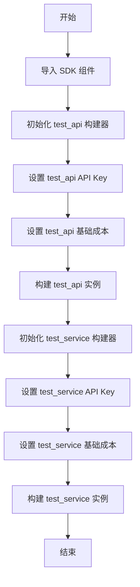

# `.\AutoGPT\autogpt_platform\backend\test\sdk\_config.py` 详细设计文档

该代码脚本主要用于 SDK 测试场景的配置，通过导入 SDK 模块，使用构建器模式实例化并配置了两个名为 `test_api` 和 `test_service` 的测试提供者，分别设定了其 API Key 和基础运行成本。

## 整体流程



## 类结构

```
No Class Definitions (Configuration Module)
Global Variables:
├── test_api
└── test_service
```

## 全局变量及字段


### `test_api`
    
A configured test API provider instance with a specific API key and base run cost.

类型：`Provider`
    


### `test_service`
    
A configured test service provider instance with a specific API key and base run cost.

类型：`Provider`
    


    

## 全局函数及方法


## 关键组件


### ProviderBuilder

ProviderBuilder 类，通过构建器模式用于实例化和配置 SDK 测试提供商，负责处理 API 密钥设置和基础成本配置。

### BlockCostType

BlockCostType 枚举类型，用于定义提供商运行时的成本计算类型（如 RUN），在此处用于指定基础成本的计费场景。

### test_api

名为 "test_api" 的测试提供商实例，配置了特定的 API 密钥标识和每次运行（RUN）5 单位的基础成本。

### test_service

名为 "test_service" 的测试提供商实例，配置了特定的 API 密钥标识和每次运行（RUN）10 单位的基础成本。


## 问题及建议


### 已知问题

-   **配置硬编码**：Provider 的名称、API Key 和基础成本直接写在代码中，导致在不同环境或测试场景下切换配置时必须修改源代码，缺乏灵活性。
-   **敏感信息明文存储**：虽然标识为测试，但 API Key 以明文字符串形式出现在代码中，违反了安全最佳实践（12-Factor App），存在意外泄露的风险。
-   **代码重复与可维护性差**：`test_api` 和 `test_service` 的初始化逻辑高度相似，存在大量样板代码。如果初始化过程变得更复杂，或者需要增加更多 Provider，维护成本将线性增加。
-   **缺乏类型提示**：代码中未对 `test_api` 和 `test_service` 变量添加类型注解，降低了代码的可读性，并使得 IDE 难以提供准确的自动补全和静态检查支持。

### 优化建议

-   **引入配置管理机制**：使用环境变量（如 `os.environ` 配合 `python-dotenv`）或配置文件（YAML/JSON/TOML）来管理配置参数。这样可以将环境特定的数据与代码逻辑分离，提高部署的灵活性。
-   **采用工厂模式或封装函数**：创建一个工厂函数（例如 `create_provider(config)`）来封装 `ProviderBuilder` 的构建过程。这可以消除重复代码，并集中处理 Provider 的创建逻辑，便于后续统一添加默认配置或验证逻辑。
-   **添加类型注解**：为导出的变量添加明确的类型提示（假设为 `Provider` 或 `Any`），以增强代码的健壮性和开发体验。
-   **实现延迟初始化**：考虑将 Provider 的实例化封装在函数内部而非模块加载时执行。这可以避免导入模块时的副作用，并允许在运行时根据具体条件动态创建实例。


## 其它


### 设计目标与约束

本模块的主要设计目标是集中管理与 SDK 测试相关的提供商配置对象，以便在测试环境中快速复用。设计约束包括：
1. **硬编码配置**：API Key 和成本参数在代码中固定，仅适用于测试场景，不生产环境支持。
2. **初始化时机**：配置在模块加载时即刻完成，不提供运行时动态修改接口。
3. **模式依赖**：必须严格遵循 `ProviderBuilder` 的建造者模式进行对象构建，链式调用的顺序不可乱。

### 外部依赖与接口契约

本模块依赖于 `backend.sdk` 包，具体接口契约如下：
1.  **`ProviderBuilder` 类**：
    *   **构造函数**：接受一个字符串参数作为 Provider 的名称。
    *   **`with_api_key(key, description)` 方法**：接受两个字符串参数，返回 `self` 以支持链式调用。
    *   **`with_base_cost(cost, type)` 方法**：接受一个数字（成本值）和一个 `BlockCostType` 枚举值，返回 `self`。
    *   **`build()` 方法**：无参数，返回构建完成的配置对象。
2.  **`BlockCostType` 枚举**：
    *   必须包含 `RUN` 属性，用于定义基于运行时间的计费类型。
*契约风险*：若上游 SDK 修改了上述方法的签名或删除了枚举值，本模块将导致运行时错误。

### 数据流与状态

模块的数据流非常简单，属于静态初始化流：
1.  **导入阶段**：从 `backend.sdk` 引入依赖类和枚举。
2.  **实例化与配置流**：
    *   创建 `test_api` 实例：传入名称 -> 注入 API Key -> 设置基础成本 -> 调用 build() -> 生成全局变量。
    *   创建 `test_service` 实例：传入名称 -> 注入 API Key -> 设置基础成本 -> 调用 build() -> 生成全局变量。
3.  **状态保持**：模块加载完成后，`test_api` 和 `test_service` 作为不可变（假设 build 返回不可变对象）或只读的全局配置常量驻留在内存中，供后续测试代码引用。

### 错误处理与异常设计

本模块采用“快速失败”策略，不进行内部异常捕获，错误将直接向上抛出给调用方（通常是其上层的测试运行器）：
*   **ImportError**：如果 `backend.sdk` 包不存在或路径配置错误，模块加载即失败。
*   **AttributeError/TypeError**：如果 `ProviderBuilder` 的 API 发生变更（如方法名拼写错误或参数类型不匹配），Python 解释器将在执行链式调用时抛出异常。
*   **ValueError**：如果传入的基础成本数值为负数或非数字类型（假设 SDK 内部有校验），将在 `build()` 阶段抛出异常。

### 安全性与合规

1.  **硬编码凭证风险**：代码中直接包含 `TEST_API_KEY` 等字符串。虽然命名为测试 Key，但需确保代码库权限控制严格，防止泄露给未授权人员。
2.  **生产隔离**：必须通过文档或 CI/CD 流水线约束，确保此配置文件不会被误打包到生产环境发布包中，以免覆盖生产环境配置或造成意外计费。
3.  **Mock 数据标识**：生成的 `test_api` 和 `test_service` 对象应被视为 Mock 对象，不得用于连接真实的计费服务接口。

    