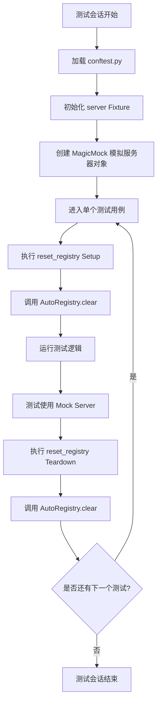
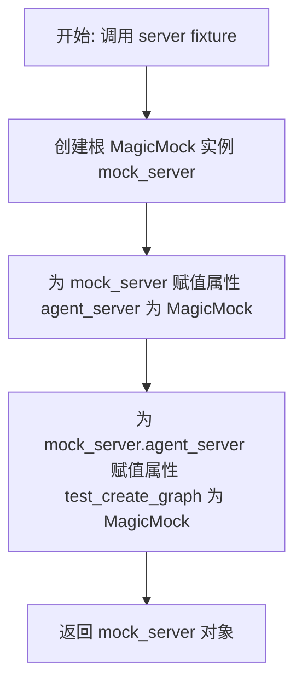
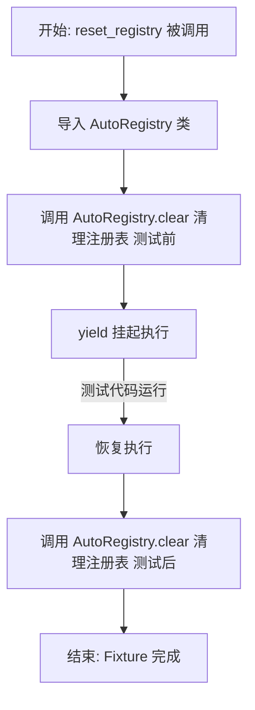

# `.\AutoGPT\autogpt_platform\backend\test\sdk\conftest.py` 详细设计文档

该文件是 SDK 测试的 pytest 配置入口，核心功能是提供模拟服务器对象的 Fixture，以及在每次测试前后自动清理 AutoRegistry 注册表，从而确保单元测试在无完整服务器依赖的环境下独立且干净地运行。

## 整体流程



## 类结构

```

```

## 全局变量及字段


    

## 全局函数及方法


### `server`

这是一个用于SDK测试的Pytest fixture，主要功能是创建并返回一个模拟的服务器对象（MagicMock），该对象预配置了`agent_server`及其`test_create_graph`属性，以便在单元测试中模拟真实服务器的行为，而无需启动完整的服务器基础设施。

参数：

返回值：`MagicMock`，返回一个配置好的模拟服务器对象，包含嵌套的模拟属性`agent_server`和`test_create_graph`。

#### 流程图



#### 带注释源码

```python
@pytest.fixture(scope="session")
def server():
    """Mock server fixture for SDK tests."""
    # 创建一个通用的模拟对象，作为模拟服务器的根对象
    mock_server = MagicMock()
    
    # 模拟服务器的 agent_server 属性，使其成为一个 MagicMock 对象
    mock_server.agent_server = MagicMock()
    
    # 模拟 agent_server 下的 test_create_graph 方法或属性
    mock_server.agent_server.test_create_graph = MagicMock()
    
    # 返回配置好的模拟服务器对象，供测试用例使用
    return mock_server
```


### `reset_registry`

这是一个Pytest自动使用的fixture函数，用于在每个测试用例执行前后重置AutoRegistry的状态，以确保测试之间的隔离性，防止状态污染。

参数：

- (无)

返回值：`Generator`，生成器对象，用于挂起函数执行以运行测试代码，并在测试完成后恢复执行以执行清理逻辑。

#### 流程图



#### 带注释源码

```python
@pytest.fixture(autouse=True)
def reset_registry():
    """Reset the AutoRegistry before each test."""
    # 导入AutoRegistry类，用于后续的清理操作
    from backend.sdk.registry import AutoRegistry

    # 在测试开始前清空注册表，确保环境干净
    AutoRegistry.clear()
    
    # yield关键字将控制权交还给测试函数，等待测试执行完毕
    yield
    
    # 测试执行结束后，再次清空注册表，清理测试过程中产生的状态
    AutoRegistry.clear()
```


## 关键组件


### server
Mock Server Fixture，用于为SDK单元测试提供模拟的服务器对象，避免了对完整服务器基础设施的依赖。
### reset_registry
自动重置注册表Fixture，用于在每个测试执行前后自动清理和重置 `AutoRegistry` 的状态，确保测试之间的隔离性。


## 问题及建议


### 已知问题

-   Mock 结构的硬编码依赖：`server` fixture 中手动构建 `mock_server.agent_server` 的嵌套结构。若实际服务端接口变更，MagicMock 无法检测到不匹配（因其动态创建属性），可能导致测试通过了Mock检查但在实际集成中失败，降低了测试的有效性。
-   全局状态管理的隐式风险：`reset_registry` 依赖手动调用 `AutoRegistry.clear()` 来保证测试隔离。这表明项目存在全局可变状态。若后续引入其他全局单例或缓存机制，容易遗漏清理导致测试污染。
-   延迟导入掩盖依赖问题：在 `reset_registry` 函数内部导入 `backend.sdk.registry`，这可能意味着模块导入顺序存在副作用或循环依赖，增加了测试环境的启动复杂度和维护难度。

### 优化建议

-   引入 Spec/Safe Mocking：建议使用 `unittest.mock.create_autospec` 或为 `MagicMock` 提供 `spec` 参数，绑定 Mock 对象到实际的服务端类。这样可以确保 Mock 对象的接口与实际实现严格一致，在测试代码调用不存在的方法时报错，而非静默通过。
-   增强清理机制的健壮性：虽然 pytest 的 `yield` 机制通常会执行清理代码，但建议显式检查 `AutoRegistry` 是否存在，或使用 `try-finally` 结构确保清理逻辑在极端情况下也能执行，防止因导入异常导致测试环境崩溃。
-   改进文档与类型提示：为 `server` fixture 添加返回值的类型提示（Type Hints）和更详细的文档字符串，明确 Mock 对象的可用接口，方便其他开发者调用。
-   模块化测试配置：如果 SDK 测试规模扩大，建议将不同领域的 Mock（如 Server、Registry、Database）拆分到不同的 `conftest.py` 或专门的 helper 模块中，避免单一配置文件变得臃肿。


## 其它


### 设计目标与约束

该配置文件的设计目标是为 SDK 单元测试提供一个轻量级、隔离且高效的测试环境，避免依赖完整的后端服务器基础设施。设计约束包括：必须基于 `pytest` 框架实现；Mock Server 的作用域限定为 `session` 级别，以减少重复初始化的开销；`AutoRegistry` 的重置逻辑必须利用 `autouse=True` 特性在每次测试前后自动执行，确保测试之间的绝对隔离，防止状态污染。

### 错误处理与异常设计

本模块作为测试基础设施，其错误处理策略侧重于环境初始化的稳定性。`MagicMock` 对象本身具有宽容性，默认不会因为未定义的方法调用而抛出异常，这要求测试用例自身必须承担验证调用行为的责任。潜在的异常风险主要集中在 `backend.sdk.registry` 模块的导入上，如果该模块不存在或 `AutoRegistry` 类缺少 `clear()` 方法，将在测试收集或运行阶段抛出 `ImportError` 或 `AttributeError`，导致测试套件崩溃。因此，该模块依赖于外部模块的接口稳定性，不包含内部的异常捕获逻辑。

### 数据流与状态机

**数据流**：
1. **Mock Server 流程**：`pytest` 初始化 Session -> 创建 `MagicMock` 实例 -> 递归模拟 `agent_server` 及 `test_create_graph` 属性 -> 将 Mock 对象注入测试函数参数 -> 测试函数使用模拟对象进行断言。
2. **Registry 重置流程**：测试用例执行前 -> 调用 `AutoRegistry.clear()` 清空数据 -> 执行测试逻辑（可能修改 Registry） -> 测试用例执行后 -> 再次调用 `AutoRegistry.clear()` 清空数据。

**状态机**：
`AutoRegistry` 的状态流转模型为：[空闲] -> (测试开始) -> [占用/有数据] -> (测试结束) -> [空闲]。Mock Server 对象在 Session 生命周期内保持“存活”状态，其内部状态（如调用记录、返回值配置）会随测试累积，除非测试代码显式重置。

### 外部依赖与接口契约

**外部依赖**：
1. `pytest`：核心测试框架，用于定义 fixture 和管理测试生命周期。
2. `unittest.mock`：Python 标准库，用于动态生成模拟对象。
3. `backend.sdk.registry.AutoRegistry`：业务代码模块，提供注册表管理功能。

**接口契约**：
1. **Server Mock 契约**：Mock 对象需模拟真实 Server 的结构，至少具备 `agent_server` 属性，且该属性下需具备 `test_create_graph` 方法。Mock 对象不需要包含真实实现，但需满足“鸭子类型”，即在被测试代码调用时不报错。
2. **Registry 清理契约**：`backend.sdk.registry` 模块中的 `AutoRegistry` 类必须暴露一个 `clear()` 方法（类方法或静态方法），该方法负责将内部存储的注册信息清空，且不接收任何参数。

    