# `.\AutoGPT\autogpt_platform\backend\test\sdk\test_sdk_block_creation.py` 详细设计文档

该文件是一个基于 pytest 的测试套件，旨在验证软件开发工具包（SDK）中 Block（代码块）的创建、执行和凭证管理功能。它覆盖了基础块创建、API 密钥与 OAuth2 认证、多输出处理、复杂类型支持、错误处理机制以及涉及多重凭证的高级认证场景。

## 整体流程

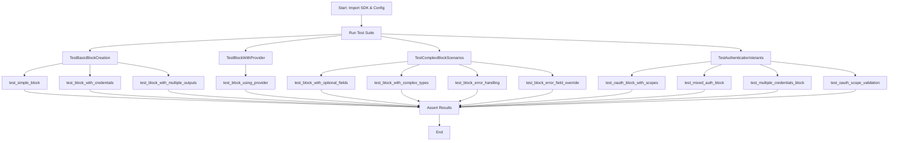

## 类结构

```
Block (SDK Base Class)
├── SimpleBlock
├── APIBlock
├── MultiOutputBlock
├── TestServiceBlock
├── OptionalFieldBlock
├── ComplexBlock
├── ErrorHandlingBlock
├── ErrorFieldOverrideBlock
├── FlexibleErrorBlock
├── OAuthScopedBlock
├── MixedAuthBlock
├── MultiCredentialBlock
└── ScopeValidationBlock
```

## 全局变量及字段


### `test_api`
    
Configuration fixture for test API credentials field generation.

类型：`ConfigFixture`
    


### `test_service`
    
Configuration fixture for test service credentials field generation.

类型：`ConfigFixture`
    


### `SimpleBlock.Input.text`
    
Input text

类型：`str`
    


### `SimpleBlock.Input.count`
    
Repeat count

类型：`int`
    


### `SimpleBlock.Output.result`
    
Output result

类型：`str`
    


### `APIBlock.Input.credentials`
    
API credentials for test service

类型：`CredentialsMetaInput`
    


### `APIBlock.Input.query`
    
API query

类型：`str`
    


### `APIBlock.Output.response`
    
API response

类型：`str`
    


### `APIBlock.Output.authenticated`
    
Was authenticated

类型：`bool`
    


### `MultiOutputBlock.Input.text`
    
Input text

类型：`str`
    


### `MultiOutputBlock.Output.uppercase`
    
Uppercase version

类型：`str`
    


### `MultiOutputBlock.Output.lowercase`
    
Lowercase version

类型：`str`
    


### `MultiOutputBlock.Output.length`
    
Text length

类型：`int`
    


### `MultiOutputBlock.Output.is_empty`
    
Is text empty

类型：`bool`
    


### `TestServiceBlock.Input.credentials`
    
Test service credentials

类型：`CredentialsMetaInput`
    


### `TestServiceBlock.Input.action`
    
Action to perform

类型：`str`
    


### `TestServiceBlock.Output.result`
    
Action result

类型：`str`
    


### `TestServiceBlock.Output.provider_name`
    
Provider used

类型：`str`
    


### `OptionalFieldBlock.Input.required_field`
    
Required field

类型：`str`
    


### `OptionalFieldBlock.Input.optional_field`
    
Optional field

类型：`Optional[str]`
    


### `OptionalFieldBlock.Input.optional_with_default`
    
Optional with default

类型：`str`
    


### `OptionalFieldBlock.Output.has_optional`
    
Has optional value

类型：`bool`
    


### `OptionalFieldBlock.Output.optional_value`
    
Optional value

类型：`Optional[str]`
    


### `OptionalFieldBlock.Output.default_value`
    
Default value

类型：`str`
    


### `ComplexBlock.Input.items`
    
List of items

类型：`list[str]`
    


### `ComplexBlock.Input.mapping`
    
String to int mapping

类型：`dict[str, int]`
    


### `ComplexBlock.Output.item_count`
    
Number of items

类型：`int`
    


### `ComplexBlock.Output.total_value`
    
Sum of mapping values

类型：`int`
    


### `ComplexBlock.Output.combined`
    
Combined results

类型：`list[str]`
    


### `ErrorHandlingBlock.Input.value`
    
Input value

类型：`int`
    


### `ErrorHandlingBlock.Input.should_error`
    
Whether to trigger an error

类型：`bool`
    


### `ErrorHandlingBlock.Output.result`
    
Result

类型：`int`
    


### `ErrorHandlingBlock.Output.error_message`
    
Error if any

类型：`Optional[str]`
    


### `ErrorFieldOverrideBlock.Input.value`
    
Input value

类型：`int`
    


### `ErrorFieldOverrideBlock.Output.result`
    
Result

类型：`int`
    


### `ErrorFieldOverrideBlock.Output.error`
    
Custom error field with specific validation codes

类型：`str`
    


### `FlexibleErrorBlock.Input.value`
    
Input value

类型：`int`
    


### `FlexibleErrorBlock.Output.result`
    
Result

类型：`int`
    


### `FlexibleErrorBlock.Output.error`
    
Structured error information

类型：`Optional[dict[str, str]]`
    


### `OAuthScopedBlock.Input.credentials`
    
OAuth2 credentials with scopes

类型：`CredentialsMetaInput`
    


### `OAuthScopedBlock.Input.resource`
    
Resource to access

类型：`str`
    


### `OAuthScopedBlock.Output.data`
    
Retrieved data

类型：`str`
    


### `OAuthScopedBlock.Output.scopes_used`
    
Scopes that were used

类型：`list[str]`
    


### `OAuthScopedBlock.Output.token_info`
    
Token information

类型：`dict[str, Any]`
    


### `MixedAuthBlock.Input.credentials`
    
API key or OAuth2 credentials

类型：`CredentialsMetaInput`
    


### `MixedAuthBlock.Input.operation`
    
Operation to perform

类型：`str`
    


### `MixedAuthBlock.Output.result`
    
Operation result

类型：`str`
    


### `MixedAuthBlock.Output.auth_type`
    
Authentication type used

类型：`str`
    


### `MixedAuthBlock.Output.auth_details`
    
Auth details

类型：`dict[str, Any]`
    


### `MultiCredentialBlock.Input.primary_credentials`
    
Primary service API key

类型：`CredentialsMetaInput`
    


### `MultiCredentialBlock.Input.secondary_credentials`
    
Secondary service OAuth

类型：`CredentialsMetaInput`
    


### `MultiCredentialBlock.Input.merge_data`
    
Whether to merge data from both services

类型：`bool`
    


### `MultiCredentialBlock.Output.primary_data`
    
Data from primary service

类型：`str`
    


### `MultiCredentialBlock.Output.secondary_data`
    
Data from secondary service

类型：`str`
    


### `MultiCredentialBlock.Output.merged_result`
    
Merged data if requested

类型：`Optional[str]`
    


### `ScopeValidationBlock.Input.credentials`
    
OAuth credentials with specific scopes

类型：`CredentialsMetaInput`
    


### `ScopeValidationBlock.Input.require_admin`
    
Whether admin scopes are required

类型：`bool`
    


### `ScopeValidationBlock.Output.allowed_operations`
    
Operations allowed with current scopes

类型：`list[str]`
    


### `ScopeValidationBlock.Output.missing_scopes`
    
Scopes that are missing for full access

类型：`list[str]`
    


### `ScopeValidationBlock.Output.has_required_scopes`
    
Whether all required scopes are present

类型：`bool`
    
    

## 全局函数及方法


### `TestBasicBlockCreation.test_simple_block`

测试在不使用任何装饰器的情况下创建一个简单的 SDK 块（Block），并验证其元数据和执行逻辑是否正确。

参数：

-  `self`：`TestBasicBlockCreation`，测试类的实例，用于访问测试框架的上下文。

返回值：`None`，该方法是一个测试用例，不返回具体数值，通过断言（assert）验证结果。

#### 流程图

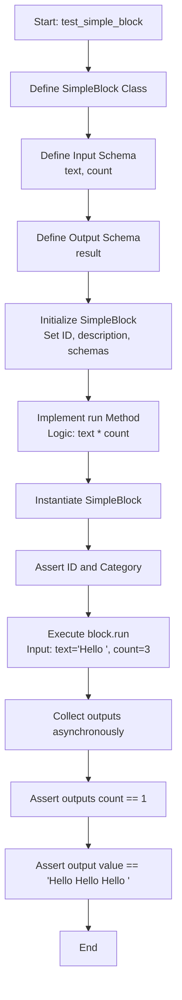

#### 带注释源码

```python
async def test_simple_block(self):
    """Test creating a simple block without any decorators."""

    # 定义一个继承自 Block 的内部类 SimpleBlock
    class SimpleBlock(Block):
        """A simple test block."""

        # 定义输入模式，包含 text 和 count 字段
        class Input(BlockSchemaInput):
            text: str = SchemaField(description="Input text")
            count: int = SchemaField(description="Repeat count", default=1)

        # 定义输出模式，包含 result 字段
        class Output(BlockSchemaOutput):
            result: str = SchemaField(description="Output result")

        # 初始化块，设置基本元数据
        def __init__(self):
            super().__init__(
                id="simple-test-block",
                description="A simple test block",
                categories={BlockCategory.TEXT},
                input_schema=SimpleBlock.Input,
                output_schema=SimpleBlock.Output,
            )

        # 定义核心执行逻辑：将输入文本重复 count 次
        async def run(self, input_data: Input, **kwargs) -> BlockOutput:
            result = input_data.text * input_data.count
            yield "result", result

    # 实例化 SimpleBlock
    block = SimpleBlock()
    # 验证块的元数据是否设置正确
    assert block.id == "simple-test-block"
    assert BlockCategory.TEXT in block.categories

    # 测试执行逻辑
    outputs = []
    # 调用 block.run 并传入构造好的输入数据
    async for name, value in block.run(
        SimpleBlock.Input(text="Hello ", count=3),
    ):
        outputs.append((name, value))
    
    # 验证输出结果的数量和内容是否符合预期
    assert len(outputs) == 1
    assert outputs[0] == ("result", "Hello Hello Hello ")
```


### `TestBasicBlockCreation.test_block_with_credentials`

测试创建一个需要 API 密钥凭据的 Block，验证其能否正确接收凭据，模拟 API 调用并返回预期的响应及认证状态。

参数：

- `self`：`TestBasicBlockCreation`，测试类的实例，用于访问测试框架的功能。

返回值：`None`，该方法主要用于执行测试逻辑和断言，不返回任何值。

#### 流程图

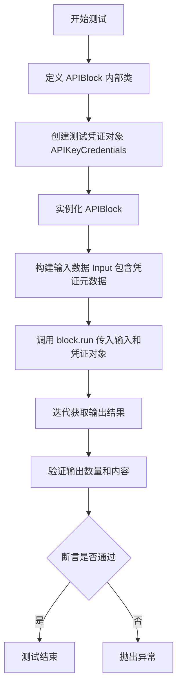

#### 带注释源码

```python
@pytest.mark.asyncio
async def test_block_with_credentials(self):
    """Test creating a block that requires credentials."""

    # 定义一个需要凭据的内部 Block 类 APIBlock
    class APIBlock(Block):
        """A block that requires API credentials."""

        # 定义输入 Schema，包含凭证字段和查询字段
        class Input(BlockSchemaInput):
            credentials: CredentialsMetaInput = test_api.credentials_field(
                description="API credentials for test service",
            )
            query: str = SchemaField(description="API query")

        # 定义输出 Schema，包含响应和认证状态
        class Output(BlockSchemaOutput):
            response: str = SchemaField(description="API response")
            authenticated: bool = SchemaField(description="Was authenticated")

        def __init__(self):
            # 初始化 Block，配置 ID、描述、分类及 Schema
            super().__init__(
                id="api-test-block",
                description="Test block with API credentials",
                categories={BlockCategory.DEVELOPER_TOOLS},
                input_schema=APIBlock.Input,
                output_schema=APIBlock.Output,
            )

        # Block 的运行逻辑
        async def run(
            self, input_data: Input, *, credentials: APIKeyCredentials, **kwargs
        ) -> BlockOutput:
            # 模拟 API 调用：获取 API Key 并检查是否为空
            api_key = credentials.api_key.get_secret_value()
            authenticated = bool(api_key)

            # 产生输出结果
            yield "response", f"API response for: {input_data.query}"
            yield "authenticated", authenticated

    # 创建测试用的 API Key 凭证对象
    test_creds = APIKeyCredentials(
        id="test-creds",
        provider="test_api",
        api_key=SecretStr("test-api-key"),
        title="Test API Key",
    )

    # 实例化 APIBlock
    block = APIBlock()
    outputs = []
    
    # 执行 Block 的 run 方法，传入构造好的输入数据和凭证对象
    async for name, value in block.run(
        APIBlock.Input(
            credentials={  # type: ignore
                "provider": "test_api",
                "id": "test-creds",
                "type": "api_key",
            },
            query="test query",
        ),
        credentials=test_creds,
    ):
        outputs.append((name, value))

    # 断言：验证输出数量为 2
    assert len(outputs) == 2
    # 断言：验证第一个输出为响应字符串
    assert outputs[0] == ("response", "API response for: test query")
    # 断言：验证第二个输出为认证状态 True
    assert outputs[1] == ("authenticated", True)
```


### `TestBasicBlockCreation.test_block_with_multiple_outputs`

测试创建一个能够通过异步生成器产生多个不同输出（大写、小写、长度和是否为空状态）的块，并验证这些输出是否正确生成和收集。

参数：

-  `self`：`TestBasicBlockCreation`，测试类实例本身。

返回值：`None`，无返回值（测试函数）。

#### 流程图

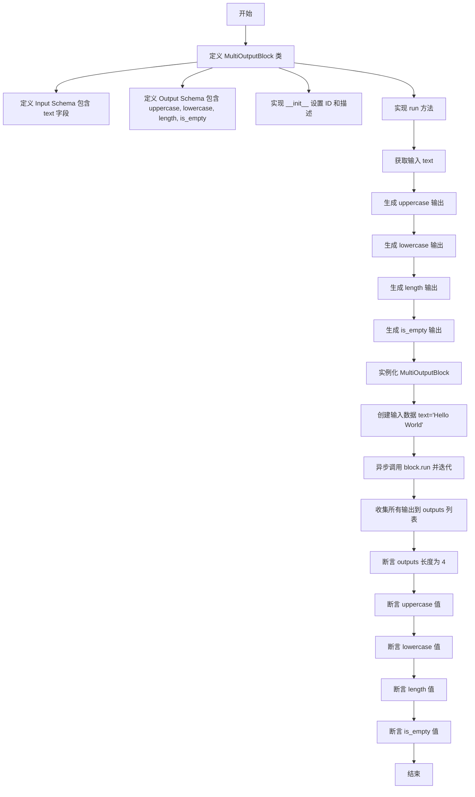

#### 带注释源码

```python
    @pytest.mark.asyncio
    async def test_block_with_multiple_outputs(self):
        """Test block that yields multiple outputs."""

        # 定义一个内部类 MultiOutputBlock，继承自 Block
        class MultiOutputBlock(Block):
            """Block with multiple outputs."""

            # 定义输入 Schema，包含一个文本字段
            class Input(BlockSchemaInput):
                text: str = SchemaField(description="Input text")

            # 定义输出 Schema，包含四个不同类型的输出字段
            class Output(BlockSchemaOutput):
                uppercase: str = SchemaField(description="Uppercase version")
                lowercase: str = SchemaField(description="Lowercase version")
                length: int = SchemaField(description="Text length")
                is_empty: bool = SchemaField(description="Is text empty")

            def __init__(self):
                # 调用父类初始化，设置块的 ID、描述、分类和输入输出 Schema
                super().__init__(
                    id="multi-output-block",
                    description="Block with multiple outputs",
                    categories={BlockCategory.TEXT},
                    input_schema=MultiOutputBlock.Input,
                    output_schema=MultiOutputBlock.Output,
                )

            # 核心运行逻辑，异步生成多个输出
            async def run(self, input_data: Input, **kwargs) -> BlockOutput:
                text = input_data.text
                # 依次生成大写、小写、长度和空状态检查的结果
                yield "uppercase", text.upper()
                yield "lowercase", text.lower()
                yield "length", len(text)
                yield "is_empty", len(text) == 0

        # 实例化块对象
        block = MultiOutputBlock()
        
        # 初始化一个列表用于收集输出
        outputs = []
        
        # 执行块的 run 方法，传入测试输入 "Hello World"
        async for name, value in block.run(MultiOutputBlock.Input(text="Hello World")):
            # 将生成的 (name, value) 元组追加到列表中
            outputs.append((name, value))

        # 验证输出数量是否为 4
        assert len(outputs) == 4
        # 验证具体的输出值是否符合预期
        assert ("uppercase", "HELLO WORLD") in outputs
        assert ("lowercase", "hello world") in outputs
        assert ("length", 11) in outputs
        assert ("is_empty", False) in outputs
```


### `SimpleBlock.__init__`

该方法用于初始化 `SimpleBlock` 类的实例。它通过调用父类 `Block` 的构造函数，设置该块的唯一标识符、描述、所属分类以及输入和输出的数据模式，从而完成块的基础配置。

参数：

-   `self`：`SimpleBlock`，表示正在初始化的类实例本身。

返回值：`None`，该方法作为构造函数，没有显式的返回值。

#### 流程图

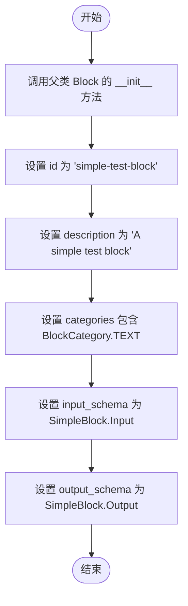

#### 带注释源码

```python
def __init__(self):
    # 调用父类 Block 的构造函数，初始化块的基本元数据
    super().__init__(
        id="simple-test-block",              # 块的唯一标识符
        description="A simple test block",   # 块的文本描述
        categories={BlockCategory.TEXT},     # 块所属的分类集合（此处为文本类）
        input_schema=SimpleBlock.Input,      # 定义输入数据结构的类
        output_schema=SimpleBlock.Output,    # 定义输出数据结构的类
    )
```


### `SimpleBlock.run`

该方法实现了简单的文本重复逻辑，接收包含文本和计数的输入数据，将文本重复指定的次数，并生成结果。

参数：

- `input_data`：`SimpleBlock.Input`，输入数据对象，包含 `text` (待重复的文本) 和 `count` (重复次数) 字段。
- `**kwargs`：`Any`，接收额外的关键字参数（如运行时上下文等）。

返回值：`BlockOutput`，异步生成器，产生包含输出字段名称和对应值的元组。

#### 流程图

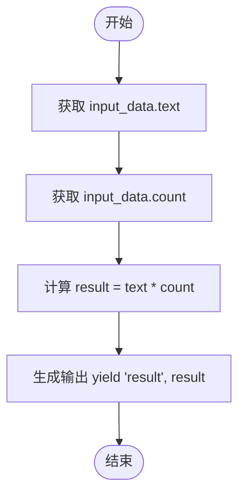

#### 带注释源码

```python
async def run(self, input_data: Input, **kwargs) -> BlockOutput:
    # 根据输入的次数 (count) 重复输入的文本字符串
    result = input_data.text * input_data.count
    
    # 生成输出，键名为 "result"，值为处理后的字符串
    yield "result", result
```


### `APIBlock.__init__`

`APIBlock` 类的构造函数，用于初始化块实例。该方法设置块的唯一标识符、描述、所属类别以及定义输入输出结构的 Schema，特别配置了用于处理 API 凭证的输入模式。

参数：

-  `self`：`APIBlock`，类的实例本身。

返回值：`None`，构造函数不返回任何值。

#### 流程图

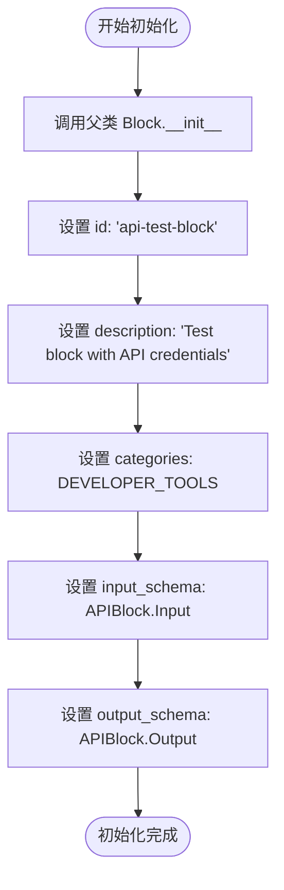

#### 带注释源码

```python
def __init__(self):
    """
    初始化 APIBlock 实例。
    配置块的元数据和 Schema，定义了该块的输入（包括凭证）和输出规范。
    """
    # 调用父类 Block 的构造函数，传入核心配置参数
    super().__init__(
        id="api-test-block",                       # 块的唯一标识符
        description="Test block with API credentials", # 块的功能描述
        categories={BlockCategory.DEVELOPER_TOOLS}, # 块所属的业务分类
        input_schema=APIBlock.Input,               # 定义输入数据结构的 Schema 类
        output_schema=APIBlock.Output,             # 定义输出数据结构的 Schema 类
    )
```


### `APIBlock.run`

该方法模拟了一个需要API密钥认证的API调用过程。它从提供的凭证中提取API密钥，根据密钥的存在与否判断认证状态，并返回模拟的API响应和认证结果。

参数：

-  `input_data`：`APIBlock.Input`，包含API输入数据（如查询字符串和凭证元数据）的对象。
-  `credentials`：`APIKeyCredentials`，包含API密钥的凭证对象，用于身份验证。
-  `**kwargs`：`Any`，其他传递给方法的关键字参数。

返回值：`BlockOutput`，异步生成器，按顺序产生API响应字符串和认证状态的布尔值。

#### 流程图

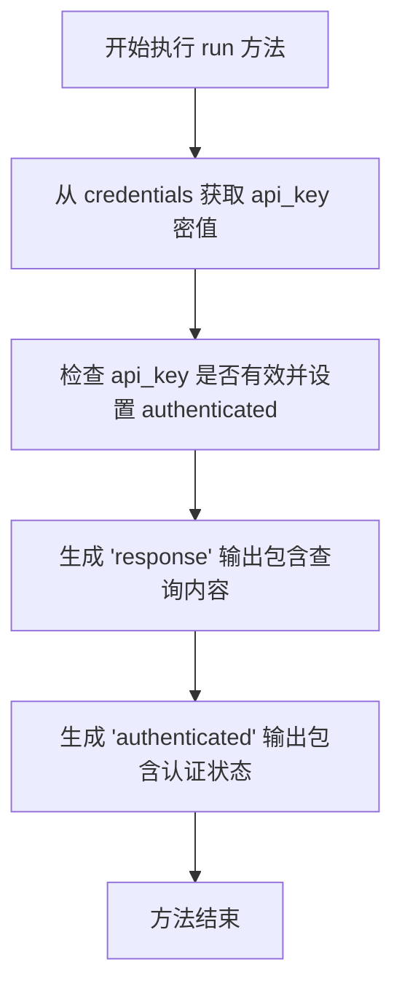

#### 带注释源码

```python
async def run(
    self, input_data: Input, *, credentials: APIKeyCredentials, **kwargs
) -> BlockOutput:
    # 模拟 API 调用：从凭证对象中提取 API 密钥的明文值
    api_key = credentials.api_key.get_secret_value()
    
    # 根据 API 密钥是否存在确定认证状态
    authenticated = bool(api_key)

    # 生成并返回模拟的 API 响应，包含输入的查询内容
    yield "response", f"API response for: {input_data.query}"
    
    # 生成并返回认证状态
    yield "authenticated", authenticated
```


### `MultiOutputBlock.__init__`

该方法用于初始化 `MultiOutputBlock` 类的实例。它通过调用父类 `Block` 的构造函数，配置块的基本元数据，包括唯一标识符、描述信息、所属类别以及输入和输出的数据模式（Schema），从而定义一个能够处理文本并产生多种输出结果的块。

参数：

- `self`：`MultiOutputBlock`，表示类实例本身。

返回值：`None`，构造函数不返回任何值。

#### 流程图

```mermaid
graph TD
    Start([开始]) --> CallSuper[调用父类 Block.__init__]
    CallSuper --> SetID[设置 id 为 'multi-output-block']
    SetID --> SetDesc[设置 description 为 'Block with multiple outputs']
    SetDesc --> SetCat[设置 categories 为 {BlockCategory.TEXT}]
    SetCat --> SetInput[设置 input_schema 为 MultiOutputBlock.Input]
    SetInput --> SetOutput[设置 output_schema 为 MultiOutputBlock.Output]
    SetOutput --> End([结束])
```

#### 带注释源码

```python
def __init__(self):
    super().__init__(
        # 定义块的唯一标识符
        id="multi-output-block",
        # 定义块的描述信息
        description="Block with multiple outputs",
        # 定义块所属的类别集合，此处为文本类别
        categories={BlockCategory.TEXT},
        # 指定输入数据的模式定义类
        input_schema=MultiOutputBlock.Input,
        # 指定输出数据的模式定义类
        output_schema=MultiOutputBlock.Output,
    )
```


### `MultiOutputBlock.run`

该方法接收包含文本的输入数据，通过字符串处理生成该文本的大写形式、小写形式、长度以及是否为空的布尔值，并依次产出这些结果。

参数：

- `self`：`MultiOutputBlock`，类的实例。
- `input_data`：`Input`，输入数据对象，包含需要处理的文本字段。
- `**kwargs`：`dict`，扩展的关键字参数。

返回值：`BlockOutput`，异步生成器，产出包含输出键名和对应计算值的元组序列。

#### 流程图

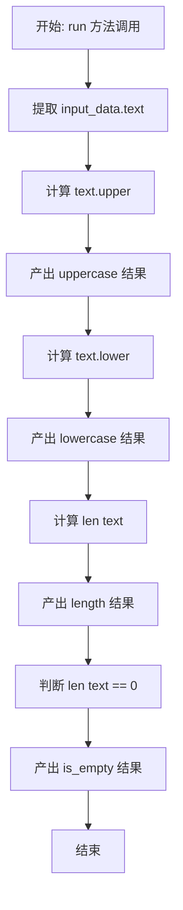

#### 带注释源码

```python
async def run(self, input_data: Input, **kwargs) -> BlockOutput:
    # 获取输入的文本数据
    text = input_data.text
    
    # 产出大写转换后的文本，键名为 "uppercase"
    yield "uppercase", text.upper()
    
    # 产出小写转换后的文本，键名为 "lowercase"
    yield "lowercase", text.lower()
    
    # 产出文本的长度（整数），键名为 "length"
    yield "length", len(text)
    
    # 产出文本是否为空的布尔值，键名为 "is_empty"
    yield "is_empty", len(text) == 0
```


### `TestBlockWithProvider.test_block_using_provider`

Test block that uses a registered provider.

参数：

-   `self`：`TestBlockWithProvider`，测试类的实例。

返回值：`None`，该函数是一个异步测试方法，不返回值。

#### 流程图

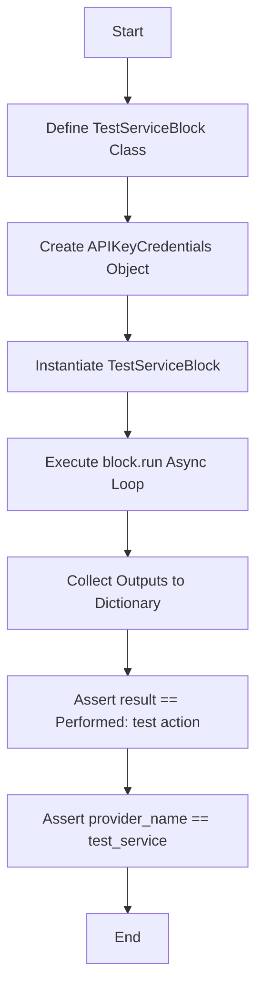

#### 带注释源码

```python
@pytest.mark.asyncio
async def test_block_using_provider(self):
    """Test block that uses a registered provider."""

    # 定义内部测试块类 TestServiceBlock，继承自 Block
    class TestServiceBlock(Block):
        """Block for test service."""

        # 定义输入 Schema，包含凭证字段和操作字段
        class Input(BlockSchemaInput):
            credentials: CredentialsMetaInput = test_service.credentials_field(
                description="Test service credentials",
            )
            action: str = SchemaField(description="Action to perform")

        # 定义输出 Schema，包含结果和提供商名称
        class Output(BlockSchemaOutput):
            result: str = SchemaField(description="Action result")
            provider_name: str = SchemaField(description="Provider used")

        def __init__(self):
            # 初始化块，设置 ID、描述、分类和 Schema
            super().__init__(
                id="test-service-block",
                description="Block using test service provider",
                categories={BlockCategory.DEVELOPER_TOOLS},
                input_schema=TestServiceBlock.Input,
                output_schema=TestServiceBlock.Output,
            )

        async def run(
            self, input_data: Input, *, credentials: APIKeyCredentials, **kwargs
        ) -> BlockOutput:
            # 运行逻辑：生成操作结果和凭证中的提供商名称
            yield "result", f"Performed: {input_data.action}"
            yield "provider_name", credentials.provider

    # 创建测试用的 API Key 凭证对象
    creds = APIKeyCredentials(
        id="test-service-creds",
        provider="test_service",
        api_key=SecretStr("test-key"),
        title="Test Service Key",
    )

    # 实例化测试块
    block = TestServiceBlock()
    
    # 准备收集输出
    outputs = {}
    
    # 异步运行块，传入输入数据和凭证
    async for name, value in block.run(
        TestServiceBlock.Input(
            credentials={  # type: ignore
                "provider": "test_service",
                "id": "test-service-creds",
                "type": "api_key",
            },
            action="test action",
        ),
        credentials=creds,
    ):
        outputs[name] = value

    # 断言：验证输出结果是否符合预期
    assert outputs["result"] == "Performed: test action"
    assert outputs["provider_name"] == "test_service"
```


### `TestServiceBlock.__init__`

`TestServiceBlock` 类的构造函数，用于初始化该块的实例。它通过调用父类 `Block` 的构造函数并传入特定的 ID、描述、分类以及输入输出模式来配置块的基本元数据和结构。

参数：

-  `self`：`TestServiceBlock`，表示当前正在初始化的类实例。

返回值：`None`，该构造函数没有返回值。

#### 流程图

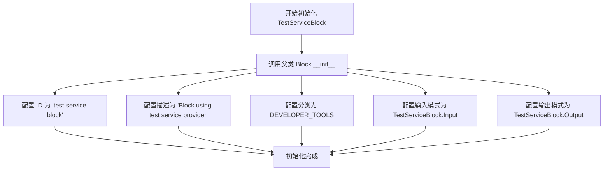

#### 带注释源码

```python
def __init__(self):
    # 调用父类 Block 的构造函数，传入必要的元数据以配置当前块
    super().__init__(
        # 块的唯一标识符
        id="test-service-block",
        # 块的功能描述
        description="Block using test service provider",
        # 块所属的分类，这里归为开发者工具类
        categories={BlockCategory.DEVELOPER_TOOLS},
        # 定义块的输入数据结构模式，引用内部类 Input
        input_schema=TestServiceBlock.Input,
        # 定义块的输出数据结构模式，引用内部类 Output
        output_schema=TestServiceBlock.Output,
    )
```


### `TestServiceBlock.run`

该方法是 `TestServiceBlock` 类的核心异步执行逻辑，用于模拟基于提供者服务的操作。它接收包含操作指令的输入数据和用于身份验证的 API 密钥凭据，执行简单的字符串格式化操作以模拟业务逻辑，并异步产生执行结果和提供者名称作为输出。

参数：

- `input_data`：`TestServiceBlock.Input`，包含用户请求的操作（`action`）以及凭据元数据的输入对象。
- `credentials`：`APIKeyCredentials`，用于验证服务身份的 API 密钥凭据对象。
- `**kwargs`：`Any`，传递给块运行时的其他可选关键字参数。

返回值：`BlockOutput`，一个异步生成器，按顺序产生包含输出字段名称和对应值的元组。

#### 流程图

```mermaid
flowchart TD
    A([开始]) --> B[接收 input_data 与 credentials]
    B --> C[提取 input_data.action]
    B --> D[提取 credentials.provider]
    C --> E[构建结果字符串: f'Performed: {action}']
    E --> F[Yield 输出: 'result', 结果字符串]
    D --> G[Yield 输出: 'provider_name', 提供者名称]
    F --> H([结束])
    G --> H
```

#### 带注释源码

```python
async def run(
    self, input_data: Input, *, credentials: APIKeyCredentials, **kwargs
) -> BlockOutput:
    # 模拟执行请求的操作，并格式化返回字符串
    # The provider name should match
    yield "result", f"Performed: {input_data.action}"
    
    # 输出凭据中的提供者名称，用于验证或追踪
    yield "provider_name", credentials.provider
```


### `TestComplexBlockScenarios.test_block_with_optional_fields`

该测试方法用于验证通过 SDK 创建的 Block 在处理可选输入字段和带有默认值的字段时的行为是否正确。它定义了一个包含必填字段、可选字段（可空）和具有显式默认值字段的内部 Block 类。测试通过两次执行该 Block（一次提供可选值，一次省略），断言输出正确反映了可选值的存在性、省略时是否处理为 None，以及默认值是否正确应用。

参数：

-   `self`：`TestComplexBlockScenarios`，测试类实例上下文，由 pytest 框架提供。

返回值：`None`，这是一个异步测试方法，通过断言验证逻辑而不返回业务数据。

#### 流程图

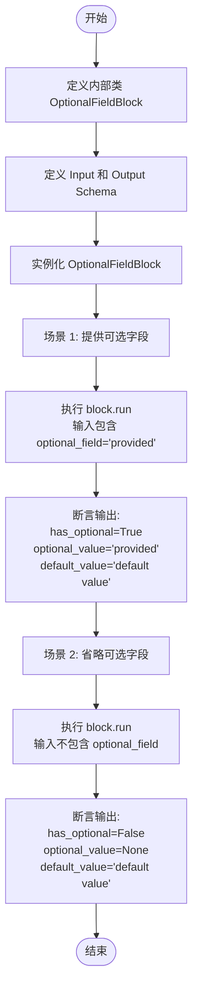

#### 带注释源码

```python
    @pytest.mark.asyncio
    async def test_block_with_optional_fields(self):
        """Test block with optional input fields."""
        # Optional is already imported at the module level

        class OptionalFieldBlock(Block):
            """Block with optional fields."""

            class Input(BlockSchemaInput):
                # 定义必填字段
                required_field: str = SchemaField(description="Required field")
                # 定义可选字段，默认为 None
                optional_field: Optional[str] = SchemaField(
                    description="Optional field",
                    default=None,
                )
                # 定义带默认值的字符串字段
                optional_with_default: str = SchemaField(
                    description="Optional with default",
                    default="default value",
                )

            class Output(BlockSchemaOutput):
                # 输出标志位，指示是否提供了可选值
                has_optional: bool = SchemaField(description="Has optional value")
                # 输出可选值的实际内容
                optional_value: Optional[str] = SchemaField(
                    description="Optional value"
                )
                # 输出默认字段的实际内容
                default_value: str = SchemaField(description="Default value")

            def __init__(self):
                super().__init__(
                    id="optional-field-block",
                    description="Block with optional fields",
                    categories={BlockCategory.TEXT},
                    input_schema=OptionalFieldBlock.Input,
                    output_schema=OptionalFieldBlock.Output,
                )

            async def run(self, input_data: Input, **kwargs) -> BlockOutput:
                # 判断 optional_field 是否不为 None
                yield "has_optional", input_data.optional_field is not None
                # 输出 optional_field 的值
                yield "optional_value", input_data.optional_field
                # 输出带默认值字段的值
                yield "default_value", input_data.optional_with_default

        # 创建 Block 实例
        block = OptionalFieldBlock()
        outputs = {}
        
        # --- 测试用例 1: 提供可选字段 ---
        async for name, value in block.run(
            OptionalFieldBlock.Input(
                required_field="test",
                optional_field="provided", # 显式提供可选字段
            )
        ):
            outputs[name] = value

        # 验证可选字段已被处理
        assert outputs["has_optional"] is True
        assert outputs["optional_value"] == "provided"
        # 验证默认字段即使在未指定时也应用了默认值
        assert outputs["default_value"] == "default value"

        # --- 测试用例 2: 不提供可选字段 ---
        outputs = {}
        async for name, value in block.run(
            OptionalFieldBlock.Input(
                required_field="test", # 仅提供必填字段
            )
        ):
            outputs[name] = value

        # 验证可选字段为 None
        assert outputs["has_optional"] is False
        assert outputs["optional_value"] is None
        # 验证默认字段行为
        assert outputs["default_value"] == "default value"
```


### `TestComplexBlockScenarios.test_block_with_complex_types`

验证具有复杂数据类型（列表和字典）的 Block 定义、执行和数据转换逻辑的正确性，确保 SDK 能够正确处理非基本类型的输入输出。

参数：

-   `self`：`TestComplexBlockScenarios`，测试类的实例，用于访问测试上下文。

返回值：`None`，该方法为异步测试函数，通过断言验证结果，无返回值。

#### 流程图

```mermaid
flowchart TD
    A[开始测试] --> B[定义 ComplexBlock 内部类]
    B --> C[定义 Input Schema<br/>包含 list[str] 和 dict[str, int]]
    C --> D[定义 Output Schema]
    D --> E[实现 run 方法<br/>计算数量、总和及组合结果]
    E --> F[实例化 ComplexBlock]
    F --> G[构造输入数据<br/>items列表与mapping字典]
    G --> H[调用 block.run 异步执行]
    H --> I[接收输出结果]
    I --> J[断言验证 item_count 为 3]
    J --> K[断言验证 total_value 为 12]
    K --> L[断言验证 combined 列表内容]
    L --> M[测试结束]
```

#### 带注释源码

```python
@pytest.mark.asyncio
async def test_block_with_complex_types(self):
    """Test block with complex input/output types."""

    # 定义一个继承自 Block 的内部类，用于处理复杂类型（List, Dict）
    class ComplexBlock(Block):
        """Block with complex types."""

        class Input(BlockSchemaInput):
            # 定义输入字段：一个字符串列表
            items: list[str] = SchemaField(description="List of items")
            # 定义输入字段：一个键为字符串、值为整数的字典
            mapping: dict[str, int] = SchemaField(
                description="String to int mapping"
            )

        class Output(BlockSchemaOutput):
            item_count: int = SchemaField(description="Number of items")
            total_value: int = SchemaField(description="Sum of mapping values")
            combined: list[str] = SchemaField(description="Combined results")

        def __init__(self):
            super().__init__(
                id="complex-types-block",
                description="Block with complex types",
                categories={BlockCategory.DEVELOPER_TOOLS},
                input_schema=ComplexBlock.Input,
                output_schema=ComplexBlock.Output,
            )

        async def run(self, input_data: Input, **kwargs) -> BlockOutput:
            # 输出列表中项目的数量
            yield "item_count", len(input_data.items)
            # 输出字典中所有值的总和
            yield "total_value", sum(input_data.mapping.values())

            # 遍历列表，从字典中查找对应的值并组合成新的字符串列表
            combined = []
            for item in input_data.items:
                value = input_data.mapping.get(item, 0)
                combined.append(f"{item}: {value}")

            yield "combined", combined

    # 实例化 Block
    block = ComplexBlock()
    outputs = {}
    
    # 异步运行 Block，传入包含复杂类型的输入数据
    async for name, value in block.run(
        ComplexBlock.Input(
            items=["apple", "banana", "orange"],
            mapping={"apple": 5, "banana": 3, "orange": 4},
        )
    ):
        outputs[name] = value

    # 验证输出是否符合预期逻辑
    assert outputs["item_count"] == 3
    assert outputs["total_value"] == 12
    assert outputs["combined"] == ["apple: 5", "banana: 3", "orange: 4"]
```


### `TestComplexBlockScenarios.test_block_error_handling`

该测试方法用于验证 Block 的错误处理能力，包括正常的业务逻辑输出、通过输出字段返回业务错误信息以及通过抛出异常来处理运行时错误的情况。

参数：

-   `self`：`TestComplexBlockScenarios`，测试类的实例，用于访问测试上下文。

返回值：`None`，这是一个测试方法，不返回具体的业务值。

#### 流程图

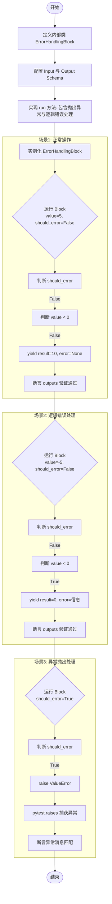

#### 带注释源码

```python
    @pytest.mark.asyncio
    async def test_block_error_handling(self):
        """Test block error handling."""

        # 定义一个用于演示错误处理的 Block 类
        class ErrorHandlingBlock(Block):
            """Block that demonstrates error handling."""

            class Input(BlockSchemaInput):
                value: int = SchemaField(description="Input value")
                should_error: bool = SchemaField(
                    description="Whether to trigger an error",
                    default=False,
                )

            class Output(BlockSchemaOutput):
                result: int = SchemaField(description="Result")
                error_message: Optional[str] = SchemaField(
                    description="Error if any", default=None
                )

            def __init__(self):
                super().__init__(
                    id="error-handling-block",
                    description="Block with error handling",
                    categories={BlockCategory.DEVELOPER_TOOLS},
                    input_schema=ErrorHandlingBlock.Input,
                    output_schema=ErrorHandlingBlock.Output,
                )

            # 核心运行逻辑
            async def run(self, input_data: Input, **kwargs) -> BlockOutput:
                # 分支1: 如果标志位为真，直接抛出 Python 异常，模拟系统级错误
                if input_data.should_error:
                    raise ValueError("Intentional error triggered")

                # 分支2: 业务逻辑校验，如果值为负，通过 yield 输出错误信息而非抛出异常
                if input_data.value < 0:
                    yield "error_message", "Value must be non-negative"
                    yield "result", 0
                else:
                    # 分支3: 正常执行流程
                    yield "result", input_data.value * 2
                    yield "error_message", None

        # 测试用例 1: 验证正常操作
        block = ErrorHandlingBlock()
        outputs = {}
        async for name, value in block.run(
            ErrorHandlingBlock.Input(value=5, should_error=False)
        ):
            outputs[name] = value

        assert outputs["result"] == 10
        assert outputs["error_message"] is None

        # 测试用例 2: 验证负值逻辑错误处理（通过输出字段处理）
        outputs = {}
        async for name, value in block.run(
            ErrorHandlingBlock.Input(value=-5, should_error=False)
        ):
            outputs[name] = value

        assert outputs["result"] == 0
        assert outputs["error_message"] == "Value must be non-negative"

        # 测试用例 3: 验证异常抛出
        with pytest.raises(ValueError, match="Intentional error triggered"):
            async for _ in block.run(
                ErrorHandlingBlock.Input(value=5, should_error=True)
            ):
                pass
```


### `TestComplexBlockScenarios.test_block_error_field_override`

该测试方法旨在验证 Block 模型中覆盖自动错误字段的功能。它通过定义两种不同的内部 Block 类（`ErrorFieldOverrideBlock` 和 `FlexibleErrorBlock`）来展示两种场景：一种是继承 `BlockSchemaOutput` 并覆盖默认的 error 字段为特定字符串类型，另一种是不继承 `BlockSchemaOutput` 而使用 `BlockSchema` 来定义完全自定义的结构化错误对象。测试分别对这两个 Block 进行了正常输入和异常输入的执行测试，并最终验证了它们生成的 JSON Schema 是否符合预期。

参数：

- `self`：`TestComplexBlockScenarios`，测试类的实例，用于访问测试上下文。

返回值：`None`，该方法不返回任何值，主要通过断言来验证行为是否符合预期。

#### 流程图

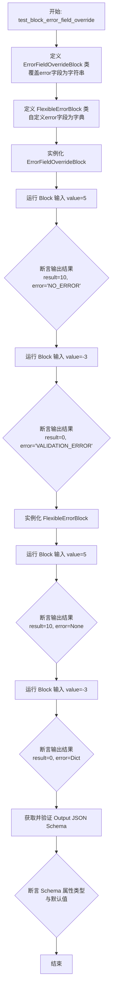

#### 带注释源码

```python
@pytest.mark.asyncio
async def test_block_error_field_override(self):
    """Test block that overrides the automatic error field from BlockSchemaOutput."""

    # 定义第一个测试块：继承 BlockSchemaOutput 并覆盖 error 字段
    class ErrorFieldOverrideBlock(Block):
        """Block that defines its own error field with different type."""

        class Input(BlockSchemaInput):
            value: int = SchemaField(description="Input value")

        class Output(BlockSchemaOutput):
            result: int = SchemaField(description="Result")
            # 覆盖默认的 error 字段，指定了新的描述和默认值，类型仍为 str
            error: str = SchemaField(
                description="Custom error field with specific validation codes",
                default="NO_ERROR",
            )

        def __init__(self):
            super().__init__(
                id="error-field-override-block",
                description="Block that overrides the error field",
                categories={BlockCategory.DEVELOPER_TOOLS},
                input_schema=ErrorFieldOverrideBlock.Input,
                output_schema=ErrorFieldOverrideBlock.Output,
            )

        async def run(self, input_data: Input, **kwargs) -> BlockOutput:
            if input_data.value < 0:
                yield "error", "VALIDATION_ERROR:VALUE_NEGATIVE"
                yield "result", 0
            else:
                yield "result", input_data.value * 2
                yield "error", "NO_ERROR"

    # 定义第二个测试块：不继承 BlockSchemaOutput，自定义错误结构
    class FlexibleErrorBlock(Block):
        """Block that defines its own error structure by not inheriting BlockSchemaOutput."""

        class Input(BlockSchemaInput):
            value: int = SchemaField(description="Input value")

        # 使用 BlockSchema 作为基类以避免自动添加 error 字段，从而完全自定义结构
        class Output(BlockSchema):  # Not BlockSchemaOutput!
            result: int = SchemaField(description="Result")
            error: Optional[dict[str, str]] = SchemaField(
                description="Structured error information",
                default=None,
            )

        def __init__(self):
            super().__init__(
                id="flexible-error-block",
                description="Block with flexible error structure",
                categories={BlockCategory.DEVELOPER_TOOLS},
                input_schema=FlexibleErrorBlock.Input,
                output_schema=FlexibleErrorBlock.Output,
            )

        async def run(self, input_data: Input, **kwargs) -> BlockOutput:
            if input_data.value < 0:
                yield "error", {
                    "type": "ValidationError",
                    "message": "Value must be non-negative",
                }
                yield "result", 0
            else:
                yield "result", input_data.value * 2
                yield "error", None

    # --- 测试 1: 字符串类型的错误覆盖 ---
    string_error_block = ErrorFieldOverrideBlock()
    outputs = {}
    async for name, value in string_error_block.run(
        ErrorFieldOverrideBlock.Input(value=5)
    ):
        outputs[name] = value

    # 验证正常输出
    assert outputs["result"] == 10
    assert outputs["error"] == "NO_ERROR"

    # 验证负数输入时的错误输出
    outputs = {}
    async for name, value in string_error_block.run(
        ErrorFieldOverrideBlock.Input(value=-3)
    ):
        outputs[name] = value

    assert outputs["result"] == 0
    assert outputs["error"] == "VALIDATION_ERROR:VALUE_NEGATIVE"

    # --- 测试 2: 结构化/字典类型的错误 ---
    flexible_block = FlexibleErrorBlock()
    outputs = {}
    async for name, value in flexible_block.run(FlexibleErrorBlock.Input(value=5)):
        outputs[name] = value

    # 验证正常输出
    assert outputs["result"] == 10
    assert outputs["error"] is None

    # 验证负数输入时的结构化错误输出
    outputs = {}
    async for name, value in flexible_block.run(FlexibleErrorBlock.Input(value=-3)):
        outputs[name] = value

    assert outputs["result"] == 0
    assert outputs["error"] == {
        "type": "ValidationError",
        "message": "Value must be non-negative",
    }

    # --- 验证生成的 Schema 差异 ---
    string_schema = string_error_block.output_schema.jsonschema()
    flexible_schema = flexible_block.output_schema.jsonschema()

    # 验证字符串 error 字段的 Schema 定义
    string_error_field = string_schema["properties"]["error"]
    assert string_error_field.get("type") == "string"
    assert string_error_field.get("default") == "NO_ERROR"

    # 验证结构化 error 字段的 Schema 定义
    flexible_error_field = flexible_schema["properties"]["error"]
    # 由于使用了 Optional[dict]，Schema 中应包含 anyOf 或类型为 object
    assert (
        "anyOf" in flexible_error_field
        or flexible_error_field.get("type") == "object"
    )
```


### `OptionalFieldBlock.__init__`

该方法是 `OptionalFieldBlock` 类的构造函数，用于初始化一个具有可选输入字段的 Block 实例。它调用父类的初始化方法，配置了块的唯一标识符、描述信息、所属分类以及引用内部类定义的输入和输出数据模式，从而完成 Block 的元数据注册。

参数：

- `self`：`OptionalFieldBlock`，表示类实例本身。

返回值：`None`，构造函数不返回任何值。

#### 流程图

```mermaid
graph TD
    A[开始: OptionalFieldBlock.__init__] --> B[调用父类 super().__init__]
    B --> C[设置 id: 'optional-field-block']
    B --> D[设置 description: 'Block with optional fields']
    B --> E[设置 categories: BlockCategory.TEXT]
    B --> F[设置 input_schema: OptionalFieldBlock.Input]
    B --> G[设置 output_schema: OptionalFieldBlock.Output]
    C & D & E & F & G --> H[结束]
```

#### 带注释源码

```python
def __init__(self):
    # 调用父类 Block 的初始化方法，传入定义好的元数据和 Schema 类
    super().__init__(
        # 块的唯一标识符
        id="optional-field-block",
        # 块的描述文本
        description="Block with optional fields",
        # 块所属的分类，这里归类为文本处理类
        categories={BlockCategory.TEXT},
        # 绑定输入模式，指向类内部定义的 Input 类
        input_schema=OptionalFieldBlock.Input,
        # 绑定输出模式，指向类内部定义的 Output 类
        output_schema=OptionalFieldBlock.Output,
    )
```


### `OptionalFieldBlock.run`

该方法处理包含可选字段和带有默认值字段的输入数据。它负责检测用户是否提供了可选字段，并提取可选字段的值以及具有默认值的字段的值，最终将这些状态和数据作为输出流式返回。

参数：

-  `input_data`：`Input`，包含输入数据的对象，其中定义了必填字段、可选字段以及带有默认值的字段。
-  `**kwargs`：`Any`，执行框架传递的额外关键字参数（如凭证、执行上下文等）。

返回值：`BlockOutput`，一个异步生成器，逐个产生输出键值对。

返回值描述：产生三个输出项：`has_optional`（布尔值，表示是否提供了可选字段）、`optional_value`（可选字段的实际值或 None）、`default_value`（带默认值字段的值）。

#### 流程图

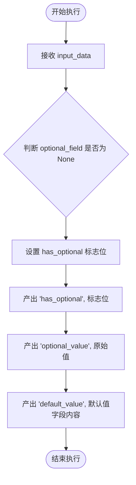

#### 带注释源码

```python
async def run(self, input_data: Input, **kwargs) -> BlockOutput:
    # 检查可选字段是否有值，并将布尔结果产出
    yield "has_optional", input_data.optional_field is not None
    
    # 直接产出可选字段的值（如果未提供则为 None）
    yield "optional_value", input_data.optional_field
    
    # 直接产出带有默认值的字段（如果未提供则为 Schema 中定义的默认值）
    yield "default_value", input_data.optional_with_default
```


### `ComplexBlock.__init__`

初始化具有复杂类型的块实例，通过调用父类Block的初始化方法，设置块的ID、描述、类别以及输入输出模式。

参数：

-   无

返回值：`None`，无返回值，仅完成对象的初始化。

#### 流程图

```mermaid
flowchart TD
    Start([开始]) --> SuperInit[调用 super().__init__<br/>传入 ID, description, categories,<br/>input_schema, output_schema]
    SuperInit --> End([结束])
```

#### 带注释源码

```python
            def __init__(self):
                # 调用父类 Block 的初始化方法
                super().__init__(
                    id="complex-types-block",           # 设置块ID
                    description="Block with complex types", # 设置块描述
                    categories={BlockCategory.TEXT},    # 设置块分类为文本类别
                    input_schema=ComplexBlock.Input,     # 设置输入模式为类内部定义的Input
                    output_schema=ComplexBlock.Output,   # 设置输出模式为类内部定义的Output
                )
```


### `ComplexBlock.run`

该方法处理包含字符串列表和字符串到整数映射的输入数据，计算列表中项目的数量、映射值的总和，并将列表项与对应的映射值组合成新的字符串列表进行输出。

参数：

- `input_data`: `ComplexBlock.Input`，包含输入数据的对象，其中 `items` 为字符串列表，`mapping` 为字符串到整数的映射字典。
- `**kwargs`: `Any`，扩展的关键字参数，用于传递额外的运行时上下文或选项（当前实现中未显式使用）。

返回值：`BlockOutput`，一个异步生成器，逐步产出块计算的中间和最终结果，结果格式为 `(输出字段名称, 输出值)` 的元组。

#### 流程图

```mermaid
flowchart TD
    Start([开始执行]) --> Input[接收输入 input_data]
    Input --> CalcCount[计算 items 长度]
    CalcCount --> YieldCount[输出字段: item_count]
    YieldCount --> CalcSum[计算 mapping 的值总和]
    CalcSum --> YieldSum[输出字段: total_value]
    YieldSum --> InitList[初始化 combined 列表]
    InitList --> LoopCondition{遍历 items<br/>是否结束?}
    
    LoopCondition -- 否 --> GetMappingValue[从 mapping 获取值<br/>不存在则默认 0]
    GetMappingValue --> FormatStr[格式化字符串: item: value]
    FormatStr --> AppendList[添加到 combined 列表]
    AppendList --> LoopCondition
    
    LoopCondition -- 是 --> YieldCombined[输出字段: combined]
    YieldCombined --> End([结束执行])
```

#### 带注释源码

```python
async def run(self, input_data: Input, **kwargs) -> BlockOutput:
    # 1. 计算输入列表的项目数量，并产出为 'item_count'
    yield "item_count", len(input_data.items)
    
    # 2. 计算映射字典中所有值的总和，并产出为 'total_value'
    yield "total_value", sum(input_data.mapping.values())

    # 3. 初始化一个列表用于存储组合后的结果
    combined = []
    
    # 遍历输入的每一个字符串项
    for item in input_data.items:
        # 从映射字典中获取对应的整数值，如果找不到则默认为 0
        value = input_data.mapping.get(item, 0)
        # 将项和值格式化为 "item: value" 的字符串，并添加到列表中
        combined.append(f"{item}: {value}")

    # 4. 产出组合后的列表结果为 'combined'
    yield "combined", combined
```


### `ErrorHandlingBlock.__init__`

初始化`ErrorHandlingBlock`实例，通过调用父类构造函数设置块的唯一标识符、描述、类别以及输入输出Schema。

参数：

- `self`：`ErrorHandlingBlock`，表示类实例本身。

返回值：`None`，无返回值。

#### 流程图

```mermaid
graph TD
    A[开始初始化] --> B[调用父类 Block.__init__]
    B --> C[设置 id 为 error-handling-block]
    C --> D[设置 description 为 Block with error handling]
    D --> E[设置 categories 为 DEVELOPER_TOOLS]
    E --> F[设置 input_schema 为 ErrorHandlingBlock.Input]
    F --> G[设置 output_schema 为 ErrorHandlingBlock.Output]
    G --> H[初始化完成]
```

#### 带注释源码

```python
            def __init__(self):
                # 调用父类 Block 的构造函数以配置块的基本元数据
                super().__init__(
                    id="error-handling-block",                    # 块的唯一标识符
                    description="Block with error handling",      # 块的功能描述
                    categories={BlockCategory.DEVELOPER_TOOLS},  # 块所属的分类
                    input_schema=ErrorHandlingBlock.Input,        # 定义输入数据的结构Schema
                    output_schema=ErrorHandlingBlock.Output,     # 定义输出数据的结构Schema
                )
```


### `ErrorHandlingBlock.run`

执行该代码块的主要逻辑，根据输入的标志位和数值进行计算或错误处理。如果触发错误标志则抛出异常；如果数值为负则输出错误信息并将结果置为0；否则计算数值的两倍。

参数：

- `input_data`：`Input`，包含输入数值 `value` 和用于触发错误的布尔标志 `should_error` 的输入数据对象。
- `**kwargs`：`Any`，传递给块的其他关键字参数。

返回值：`BlockOutput`，异步生成器，产生包含输出名称和值的元组，主要包含 `result`（计算结果）和 `error_message`（错误信息）。

#### 流程图

```mermaid
flowchart TD
    A([开始]) --> B{input_data.should_error 是否为真?}
    B -- 是 --> C[抛出 ValueError 异常]
    B -- 否 --> D{input_data.value 是否小于 0?}
    D -- 是 --> E[输出 error_message: Value must be non-negative]
    E --> F[输出 result: 0]
    D -- 否 --> G[输出 result: input_data.value * 2]
    G --> H[输出 error_message: None]
    F --> I([结束])
    H --> I
```

#### 带注释源码

```python
async def run(self, input_data: Input, **kwargs) -> BlockOutput:
    # 检查是否触发了错误标志 should_error
    if input_data.should_error:
        # 如果标志为真，抛出一个 ValueError 异常
        raise ValueError("Intentional error triggered")

    # 检查输入的数值 value 是否小于 0
    if input_data.value < 0:
        # 如果小于 0，产生错误信息输出
        yield "error_message", "Value must be non-negative"
        # 产生结果输出，值为 0
        yield "result", 0
    else:
        # 如果数值有效，产生计算结果输出（数值乘以 2）
        yield "result", input_data.value * 2
        # 产生错误信息输出，值为 None 表示无错误
        yield "error_message", None
```


### `ErrorFieldOverrideBlock.__init__`

初始化测试用例中的 `ErrorFieldOverrideBlock` 类实例。该方法通过调用父类 `Block` 的构造函数，配置块的元数据（ID、描述、分类）以及输入输出 schema，旨在验证 `BlockSchemaOutput` 中默认错误字段可以被覆盖的功能。

参数：

- `self`：`ErrorFieldOverrideBlock`，表示当前类实例。

返回值：`None`，初始化方法无返回值。

#### 流程图

```mermaid
graph TD
    A[Start __init__] --> B[Call super().__init__]
    B --> C[Set id: 'error-field-override-block']
    B --> D[Set description and categories]
    B --> E[Set input_schema to ErrorFieldOverrideBlock.Input]
    B --> F[Set output_schema to ErrorFieldOverrideBlock.Output]
    C & D & E & F --> G[End Initialization]
```

#### 带注释源码

```python
def __init__(self):
    # 调用父类 Block 的构造函数，完成块的核心注册和配置
    super().__init__(
        # 定义块的全局唯一标识符
        id="error-field-override-block",
        # 提供块的功能描述文本
        description="Block that overrides the error field",
        # 指定块所属的业务分类
        categories={BlockCategory.DEVELOPER_TOOLS},
        # 绑定输入数据结构定义（内嵌类 Input）
        input_schema=ErrorFieldOverrideBlock.Input,
        # 绑定输出数据结构定义（内嵌类 Output），该 Output 中自定义了 error 字段
        output_schema=ErrorFieldOverrideBlock.Output,
    )
```


### `ErrorFieldOverrideBlock.run`

该方法是 `ErrorFieldOverrideBlock` 类的核心执行逻辑，用于根据输入的整数值计算结果并处理特定的错误场景。它演示了如何覆盖默认的错误字段，在输入值为负数时生成自定义的验证错误代码，否则返回计算结果和无错误状态。

参数：

-  `input_data`：`ErrorFieldOverrideBlock.Input`，包含整数字段 `value` 的输入数据结构。
-  `**kwargs`：`Any`，接收额外的关键字参数，通常用于传递上下文或凭据信息。

返回值：`BlockOutput`，一个异步生成器，按顺序生成包含输出字段名称和对应值的元组（如 `("result", 10)`）。

#### 流程图

```mermaid
graph TD
    A[开始: run方法] --> B{判断 input_data.value < 0}
    B -- 是 (负数) --> C[生成输出: error = 'VALIDATION_ERROR:VALUE_NEGATIVE']
    C --> D[生成输出: result = 0]
    B -- 否 (非负数) --> E[生成输出: result = input_data.value * 2]
    E --> F[生成输出: error = 'NO_ERROR']
    D --> G[结束]
    F --> G
```

#### 带注释源码

```python
async def run(self, input_data: Input, **kwargs) -> BlockOutput:
    # 检查输入值是否为负数
    if input_data.value < 0:
        # 如果是负数，生成自定义的错误信息字符串，覆盖默认的 error 字段行为
        yield "error", "VALIDATION_ERROR:VALUE_NEGATIVE"
        # 同时生成结果值 0
        yield "result", 0
    else:
        # 如果是正常值，计算结果（输入值乘以 2）
        yield "result", input_data.value * 2
        # 生成表示无错误的字符串状态
        yield "error", "NO_ERROR"
```


### `FlexibleErrorBlock.__init__`

该构造函数初始化 `FlexibleErrorBlock` 实例，并通过调用父类 `Block` 的构造函数配置块的基本属性。它设置了块的唯一标识符、描述文本、所属类别以及输入输出的数据模型。此测试块的设计目的是为了演示通过直接继承 `BlockSchema` 而非 `BlockSchemaOutput` 来定义输出，从而绕过标准的错误字段，实现自定义的、结构化的错误处理机制。

参数：

- `self`：`FlexibleErrorBlock`，类实例自身，在 Python 方法调用中隐式传递。

返回值：`None`，构造函数不返回任何值，仅完成对象的初始化。

#### 流程图

```mermaid
flowchart TD
    Start([开始]) --> CallSuper[调用父类 Block.__init__]
    CallSuper --> SetID[设置 ID 为 'flexible-error-block']
    CallSuper --> SetDesc[设置 Description 为 'Block with flexible error structure']
    CallSuper --> SetCat[设置 Categories 为 DEVELOPER_TOOLS]
    CallSuper --> SetInput[设置 input_schema 为 FlexibleErrorBlock.Input]
    CallSuper --> SetOutput[设置 output_schema 为 FlexibleErrorBlock.Output]
    SetID --> End([结束])
    SetDesc --> End
    SetCat --> End
    SetInput --> End
    SetOutput --> End
```

#### 带注释源码

```python
def __init__(self):
    # 调用父类 Block 的初始化方法，配置块的元数据和结构
    super().__init__(
        id="flexible-error-block",  # 块的唯一标识符
        description="Block with flexible error structure",  # 块的功能描述
        categories={BlockCategory.DEVELOPER_TOOLS},  # 块所属的分类（开发者工具）
        input_schema=FlexibleErrorBlock.Input,  # 定义输入数据的 Schema
        output_schema=FlexibleErrorBlock.Output,  # 定义输出数据的 Schema（此处不使用 BlockSchemaOutput 以自定义错误结构）
    )
```


### `FlexibleErrorBlock.run`

该方法执行 `FlexibleErrorBlock` 的核心逻辑，用于演示如何绕过默认的错误字段继承，通过自定义的 `BlockSchema` 实现灵活的结构化错误处理。它根据输入的整数值判断是否为负数，如果是负数则返回结构化的错误信息和零结果，否则返回计算结果和空错误。

参数：

- `input_data`：`FlexibleErrorBlock.Input`，包含名为 `value` 的整数字段，代表需要处理的输入值。
- `**kwargs`：`dict`，扩展的关键字参数，用于接收其他潜在的运行时上下文或参数（本方法中未直接使用）。

返回值：`BlockOutput`，一个异步生成器，按顺序生成包含输出字段名称（字符串）和对应值的元组。

#### 流程图

```mermaid
flowchart TD
    Start([开始执行]) --> CheckCondition{input_data.value < 0 ?}
    
    CheckCondition -- 是 (负数) --> BuildError[构建结构化错误字典<br/>{'type': 'ValidationError', ...}]
    BuildError --> YieldError[产出: error, 错误字典]
    YieldError --> YieldZero[产出: result, 0]
    YieldZero --> End([结束执行])
    
    CheckCondition -- 否 (非负) --> Calculate[计算: value * 2]
    Calculate --> YieldResult[产出: result, 计算结果]
    YieldResult --> YieldNone[产出: error, None]
    YieldNone --> End
```

#### 带注释源码

```python
async def run(self, input_data: Input, **kwargs) -> BlockOutput:
    # 检查输入值是否小于 0
    if input_data.value < 0:
        # 如果是负数，生成一个字典类型的结构化错误信息
        # 这展示了 FlexibleErrorBlock 允许返回复杂类型的错误对象，而不仅仅是字符串
        yield "error", {
            "type": "ValidationError",
            "message": "Value must be non-negative",
        }
        # 产出默认的计算结果 0
        yield "result", 0
    else:
        # 如果是有效值，计算 value 的两倍
        yield "result", input_data.value * 2
        # 产出 None 表示没有错误发生
        yield "error", None
```


### `TestAuthenticationVariants.test_oauth_block_with_scopes`

该测试函数旨在验证一个基于 SDK 的 Block 是否能够正确创建和执行，该 Block 需要使用带有特定作用域（scopes）的 OAuth2 凭据。测试通过模拟一个 OAuth 提供者，定义包含凭据元输入（指定了所需 scopes）和详细令牌输出的 Block 结构，并使用模拟的 OAuth2 凭据执行 Block，从而确认系统能够正确处理、访问并产出 OAuth2 相关的认证数据（如访问令牌、刷新令牌及作用域列表）。

参数：

-   `self`：`TestAuthenticationVariants`，测试类的实例，由 pytest 框架传入，用于访问测试上下文。

返回值：`Coroutine[Any, Any, None]`，表示一个异步协程，该函数本身不返回具体值，主要通过内部断言来验证测试逻辑的正确性。

#### 流程图

```mermaid
flowchart TD
    A[开始] --> B[导入 SDK OAuth2Credentials 等]
    B --> C[构建 ProviderBuilder<br/>创建 oauth_provider]
    C --> D[定义内部类 OAuthScopedBlock]
    D --> D1[定义 Input Schema<br/>包含带 scopes 的 credentials]
    D1 --> D2[定义 Output Schema]
    D2 --> D3[实现 run 方法<br/>读取 credentials 信息]
    D3 --> E[实例化 OAuthScopedBlock]
    E --> F[创建模拟 OAuth2Credentials<br/>含 token, refresh_token, scopes]
    F --> G[调用 block.run<br/>传入 Input 和 credentials]
    G --> H[循环收集产出数据]
    H --> I[断言验证 data, scopes_used<br/>和 token_info 的正确性]
    I --> J[结束]
```

#### 带注释源码

```python
@pytest.mark.asyncio
async def test_oauth_block_with_scopes(self):
    """Test creating a block that uses OAuth2 with scopes."""
    # 导入 OAuth 相关类，用于构建测试环境
    from backend.sdk import OAuth2Credentials, ProviderBuilder

    # 创建一个测试用的 OAuth 提供者
    # 注意：这里使用了 with_api_key 作为测试模拟，实际生产环境可能需要配置真实的 OAuth handler
    oauth_provider = (
        ProviderBuilder("test_oauth_provider")
        .with_api_key("TEST_OAUTH_API", "Test OAuth API")
        .with_base_cost(5, BlockCostType.RUN)
        .build()
    )

    # 定义一个内部 Block 类，用于测试 OAuth 认证和 Scope 处理
    class OAuthScopedBlock(Block):
        """Block requiring OAuth2 with specific scopes."""

        class Input(BlockSchemaInput):
            # 定义凭证输入字段，并指定所需的 scopes
            credentials: CredentialsMetaInput = oauth_provider.credentials_field(
                description="OAuth2 credentials with scopes",
                scopes=["read:user", "write:data"],
            )
            resource: str = SchemaField(description="Resource to access")

        class Output(BlockSchemaOutput):
            data: str = SchemaField(description="Retrieved data")
            scopes_used: list[str] = SchemaField(
                description="Scopes that were used"
            )
            token_info: dict[str, Any] = SchemaField(
                description="Token information"
            )

        def __init__(self):
            super().__init__(
                id="oauth-scoped-block",
                description="Test OAuth2 with scopes",
                categories={BlockCategory.DEVELOPER_TOOLS},
                input_schema=OAuthScopedBlock.Input,
                output_schema=OAuthScopedBlock.Output,
            )

        # Block 的核心运行逻辑
        async def run(
            self, input_data: Input, *, credentials: OAuth2Credentials, **kwargs
        ) -> BlockOutput:
            # 从凭证对象中获取访问令牌
            token = credentials.access_token.get_secret_value()

            # 模拟 API 调用，产出数据
            yield "data", f"OAuth data for {input_data.resource}"
            # 产出的实际使用的 scopes
            yield "scopes_used", credentials.scopes or []
            # 产出令牌的详细信息（包含是否有刷新令牌等）
            yield "token_info", {
                "has_token": bool(token),
                "has_refresh": credentials.refresh_token is not None,
                "provider": credentials.provider,
                "expires_at": credentials.access_token_expires_at,
            }

    # 创建用于测试的 OAuth2 凭据对象
    test_oauth_creds = OAuth2Credentials(
        id="test-oauth-creds",
        provider="test_oauth_provider",
        access_token=SecretStr("test-access-token"), # 模拟的 Access Token
        refresh_token=SecretStr("test-refresh-token"), # 模拟的 Refresh Token
        scopes=["read:user", "write:data"], # 模拟授权的 scopes
        title="Test OAuth Credentials",
    )

    # 实例化定义好的 Block
    block = OAuthScopedBlock()
    outputs = {}
    
    # 异步执行 Block 的 run 方法
    async for name, value in block.run(
        OAuthScopedBlock.Input(
            credentials={  # type: ignore
                "provider": "test_oauth_provider",
                "id": "test-oauth-creds",
                "type": "oauth2",
            },
            resource="user/profile",
        ),
        credentials=test_oauth_creds, # 注入测试凭据
    ):
        outputs[name] = value

    # --- 验证阶段 ---
    
    # 验证产出的数据是否正确
    assert outputs["data"] == "OAuth data for user/profile"
    # 验证产出的 scopes 是否匹配
    assert set(outputs["scopes_used"]) == {"read:user", "write:data"}
    # 验证令牌信息中的布尔状态
    assert outputs["token_info"]["has_token"] is True
    assert outputs["token_info"]["expires_at"] is None
    # 验证是否正确识别了 refresh token
    assert outputs["token_info"]["has_refresh"] is True
```


### `TestAuthenticationVariants.test_mixed_auth_block`

测试支持 OAuth2 和 API Key 混合认证的 Block 的功能。该测试构建了一个支持两种认证类型的 Provider，定义了一个能够根据传入凭证类型（API Key 或 OAuth2）执行不同逻辑的 Block，并分别验证了这两种认证方式下的执行结果和数据正确性。

参数：

- `self`：`TestAuthenticationVariants`，测试类的实例引用。

返回值：`None`，该方法为测试用例，无显式返回值，通过断言验证逻辑正确性。

#### 流程图

```mermaid
graph TD
    A[开始] --> B[构建混合认证 Provider]
    B --> C[定义 MixedAuthBlock 类]
    C --> D[实例化 MixedAuthBlock]
    
    D --> E[测试场景 1: API Key 认证]
    E --> E1[创建 APIKeyCredentials 对象]
    E1 --> E2[调用 block.run 传入 API Key]
    E2 --> E3[收集并断言输出结果 auth_type='api_key']
    
    E3 --> F[测试场景 2: OAuth2 认证]
    F --> F1[创建 OAuth2Credentials 对象]
    F1 --> F2[调用 block.run 传入 OAuth Token]
    F2 --> F3[收集并断言输出结果 auth_type='oauth2']
    
    F3 --> G[测试结束]
```

#### 带注释源码

```python
@pytest.mark.asyncio
async def test_mixed_auth_block(self):
    """Test block that supports both OAuth2 and API key authentication."""
    # No need to import these again, already imported at top

    # 创建一个支持混合认证类型的 Provider
    # 虽然示例中只显式添加了 API Key 支持，但在 Input 中配置了支持的类型列表
    mixed_provider = (
        ProviderBuilder("mixed_auth_provider")
        .with_api_key("MIXED_API_KEY", "Mixed Provider API Key")
        .with_base_cost(8, BlockCostType.RUN)
        .build()
    )

    class MixedAuthBlock(Block):
        """Block supporting multiple authentication methods."""

        class Input(BlockSchemaInput):
            # 定义凭证字段，指定支持 api_key 和 oauth2 两种类型
            credentials: CredentialsMetaInput = mixed_provider.credentials_field(
                description="API key or OAuth2 credentials",
                supported_credential_types=["api_key", "oauth2"],
            )
            operation: str = SchemaField(description="Operation to perform")

        class Output(BlockSchemaOutput):
            result: str = SchemaField(description="Operation result")
            auth_type: str = SchemaField(description="Authentication type used")
            auth_details: dict[str, Any] = SchemaField(description="Auth details")

        def __init__(self):
            super().__init__(
                id="mixed-auth-block",
                description="Block supporting OAuth2 and API key",
                categories={BlockCategory.DEVELOPER_TOOLS},
                input_schema=MixedAuthBlock.Input,
                output_schema=MixedAuthBlock.Output,
            )

        async def run(
            self,
            input_data: Input,
            # 关键点：参数类型为 Union，允许接收 APIKeyCredentials 或 OAuth2Credentials
            *,
            credentials: Union[APIKeyCredentials, OAuth2Credentials],
            **kwargs,
        ) -> BlockOutput:
            # 根据传入的凭证类型执行不同的处理逻辑
            if isinstance(credentials, APIKeyCredentials):
                auth_type = "api_key"
                auth_details = {
                    "has_key": bool(credentials.api_key.get_secret_value()),
                    "key_prefix": credentials.api_key.get_secret_value()[:5]
                    + "...",
                }
            elif isinstance(credentials, OAuth2Credentials):
                auth_type = "oauth2"
                auth_details = {
                    "has_token": bool(credentials.access_token.get_secret_value()),
                    "scopes": credentials.scopes or [],
                }
            else:
                auth_type = "unknown"
                auth_details = {}

            yield "result", f"Performed {input_data.operation} with {auth_type}"
            yield "auth_type", auth_type
            yield "auth_details", auth_details

    # --- 测试分支 1: 使用 API Key 认证 ---
    api_creds = APIKeyCredentials(
        id="mixed-api-creds",
        provider="mixed_auth_provider",
        api_key=SecretStr("sk-1234567890"),
        title="Mixed API Key",
    )

    block = MixedAuthBlock()
    outputs = {}
    # 传入 API Key 凭证进行执行
    async for name, value in block.run(
        MixedAuthBlock.Input(
            credentials={  # type: ignore
                "provider": "mixed_auth_provider",
                "id": "mixed-api-creds",
                "type": "api_key",
            },
            operation="fetch_data",
        ),
        credentials=api_creds,
    ):
        outputs[name] = value

    # 验证 API Key 认证路径的输出
    assert outputs["auth_type"] == "api_key"
    assert outputs["result"] == "Performed fetch_data with api_key"
    assert outputs["auth_details"]["key_prefix"] == "sk-12..."

    # --- 测试分支 2: 使用 OAuth2 认证 ---
    oauth_creds = OAuth2Credentials(
        id="mixed-oauth-creds",
        provider="mixed_auth_provider",
        access_token=SecretStr("oauth-token-123"),
        scopes=["full_access"],
        title="Mixed OAuth",
    )

    outputs = {}
    # 传入 OAuth2 凭证进行执行
    async for name, value in block.run(
        MixedAuthBlock.Input(
            credentials={  # type: ignore
                "provider": "mixed_auth_provider",
                "id": "mixed-oauth-creds",
                "type": "oauth2",
            },
            operation="update_data",
        ),
        credentials=oauth_creds,
    ):
        outputs[name] = value

    # 验证 OAuth2 认证路径的输出
    assert outputs["auth_type"] == "oauth2"
    assert outputs["result"] == "Performed update_data with oauth2"
    assert outputs["auth_details"]["scopes"] == ["full_access"]
```


### `TestAuthenticationVariants.test_multiple_credentials_block`

测试需要多个不同服务凭证的块的功能。该测试定义了一个需要主服务和次服务两种凭证的块，模拟了通过API Key和OAuth2获取数据并合并结果的过程，并验证了凭证注入和执行逻辑的正确性。

参数：

- `self`：`TestAuthenticationVariants`，测试类的实例。

返回值：`None`，无返回值，该函数为测试方法，通过断言验证行为。

#### 流程图

```mermaid
graph TD
    A[开始: test_multiple_credentials_block] --> B[创建 Provider: primary_service & secondary_service]
    B --> C[定义 MultiCredentialBlock 类]
    C --> C1[定义 Input: primary_credentials, secondary_credentials, merge_data]
    C1 --> C2[定义 Output: primary_data, secondary_data, merged_result]
    C2 --> C3[实现 run 方法]
    C3 --> C4[生成 primary_data]
    C3 --> C5[生成 secondary_data]
    C3 --> C6{判断 merge_data}
    C6 -- True --> C7[生成合并结果]
    C6 -- False --> C8[生成 None]
    C4 & C5 & C7 & C8 --> D[创建测试凭证实例]
    D --> D1[primary_creds: APIKeyCredentials]
    D --> D2[secondary_creds: OAuth2Credentials]
    D1 & D2 --> E[实例化 MultiCredentialBlock]
    E --> F[执行 block.run]
    F --> G[收集 Outputs]
    G --> H[断言验证: primary_data, secondary_data, merged_result]
    H --> I[结束]
```

#### 带注释源码

```python
    async def test_multiple_credentials_block(self):
        """Test block requiring multiple different credentials."""
        from backend.sdk import ProviderBuilder

        # 1. 创建多个服务提供商
        # 创建主服务提供商，配置为使用API Key
        primary_provider = (
            ProviderBuilder("primary_service")
            .with_api_key("PRIMARY_API_KEY", "Primary Service Key")
            .build()
        )

        # 创建次服务提供商，配置为使用API Key (测试中模拟OAuth场景)
        secondary_provider = (
            ProviderBuilder("secondary_service")
            .with_api_key("SECONDARY_API_KEY", "Secondary Service Key")
            .build()
        )

        # 2. 定义需要多凭证的块类
        class MultiCredentialBlock(Block):
            """Block requiring credentials from multiple services."""

            class Input(BlockSchemaInput):
                # 定义主凭证输入字段
                primary_credentials: CredentialsMetaInput = (
                    primary_provider.credentials_field(
                        description="Primary service API key"
                    )
                )
                # 定义次凭证输入字段
                secondary_credentials: CredentialsMetaInput = (
                    secondary_provider.credentials_field(
                        description="Secondary service OAuth"
                    )
                )
                # 定义是否合并数据的标志
                merge_data: bool = SchemaField(
                    description="Whether to merge data from both services",
                    default=True,
                )

            class Output(BlockSchemaOutput):
                primary_data: str = SchemaField(description="Data from primary service")
                secondary_data: str = SchemaField(
                    description="Data from secondary service"
                )
                merged_result: Optional[str] = SchemaField(
                    description="Merged data if requested"
                )

            def __init__(self):
                super().__init__(
                    id="multi-credential-block",
                    description="Block using multiple credentials",
                    categories={BlockCategory.DEVELOPER_TOOLS},
                    input_schema=MultiCredentialBlock.Input,
                    output_schema=MultiCredentialBlock.Output,
                )

            # 3. 实现运行逻辑，接收两种类型的凭证
            async def run(
                self,
                input_data: Input,
                *,
                primary_credentials: APIKeyCredentials,
                secondary_credentials: OAuth2Credentials,
                **kwargs,
            ) -> BlockOutput:
                # 模拟使用主凭证获取数据
                primary_data = f"Primary data using {primary_credentials.provider}"
                yield "primary_data", primary_data

                # 模拟使用次凭证获取数据
                secondary_data = f"Secondary data with {len(secondary_credentials.scopes or [])} scopes"
                yield "secondary_data", secondary_data

                # 如果请求，合并数据
                if input_data.merge_data:
                    merged = f"{primary_data} + {secondary_data}"
                    yield "merged_result", merged
                else:
                    yield "merged_result", None

        # 4. 创建测试用的凭证实例
        primary_creds = APIKeyCredentials(
            id="primary-creds",
            provider="primary_service",
            api_key=SecretStr("primary-key-123"),
            title="Primary Key",
        )

        secondary_creds = OAuth2Credentials(
            id="secondary-creds",
            provider="secondary_service",
            access_token=SecretStr("secondary-token"),
            scopes=["read", "write"],
            title="Secondary OAuth",
        )

        # 5. 实例化并执行测试块
        block = MultiCredentialBlock()
        outputs = {}

        # 注意：在实际使用中，框架会根据字段名称注入正确的凭证。
        # 这里我们手动模拟该行为，传入构造好的凭证对象。
        async for name, value in block.run(
            MultiCredentialBlock.Input(
                primary_credentials={  # type: ignore
                    "provider": "primary_service",
                    "id": "primary-creds",
                    "type": "api_key",
                },
                secondary_credentials={  # type: ignore
                    "provider": "secondary_service",
                    "id": "secondary-creds",
                    "type": "oauth2",
                },
                merge_data=True,
            ),
            primary_credentials=primary_creds,
            secondary_credentials=secondary_creds,
        ):
            outputs[name] = value

        # 6. 断言验证输出结果
        assert outputs["primary_data"] == "Primary data using primary_service"
        assert outputs["secondary_data"] == "Secondary data with 2 scopes"
        assert "Primary data" in outputs["merged_result"]
        assert "Secondary data" in outputs["merged_result"]
```


### `TestAuthenticationVariants.test_oauth_scope_validation`

该方法测试了自定义 Block 的 OAuth 范围验证逻辑。它通过定义一个需要特定 OAuth 范围的 `ScopeValidationBlock` 类，分别使用部分权限和完整权限的凭证执行该 Block，并断言输出结果（允许的操作、缺失的范围、是否满足范围要求）是否符合预期。

参数：

- `self`：`TestAuthenticationVariants`，测试类的实例。

返回值：`None`，该测试方法通过断言语句验证逻辑，不返回具体值。

#### 流程图

```mermaid
graph TD
    A[开始: test_oauth_scope_validation] --> B[构建 ProviderBuilder: scoped_oauth_service]
    B --> C[定义 ScopeValidationBlock 类]
    C --> D{场景 1: 测试部分范围凭证}
    D --> E[创建 partial_creds: 仅包含 user:read 范围]
    E --> F[调用 block.run 传入 partial_creds]
    F --> G[断言: allowed_operations 为 read_user_data]
    G --> H[断言: missing_scopes 包含 user:write]
    H --> I[断言: has_required_scopes 为 False]
    I --> J{场景 2: 测试完整范围凭证}
    J --> K[创建 full_creds: 包含 user:read/write 及 admin:read]
    K --> L[调用 block.run 传入 full_creds]
    L --> M[断言: allowed_operations 包含读写及管理读取操作]
    M --> N[断言: missing_scopes 为空]
    N --> O[断言: has_required_scopes 为 True]
    O --> P[测试结束]
```

#### 带注释源码

```python
    @pytest.mark.asyncio
    async def test_oauth_scope_validation(self):
        """Test OAuth scope validation and handling."""
        from backend.sdk import OAuth2Credentials, ProviderBuilder

        # Provider with specific required scopes
        # For testing OAuth scope validation
        # 创建一个用于测试的 Provider，定义了服务名称
        scoped_provider = (
            ProviderBuilder("scoped_oauth_service")
            .with_api_key("SCOPED_OAUTH_KEY", "Scoped OAuth Service")
            .build()
        )

        class ScopeValidationBlock(Block):
            """Block that validates OAuth scopes."""

            class Input(BlockSchemaInput):
                # 定义凭证字段，并指定基础所需的 scope 列表
                credentials: CredentialsMetaInput = scoped_provider.credentials_field(
                    description="OAuth credentials with specific scopes",
                    scopes=["user:read", "user:write"],  # Required scopes
                )
                # 额外的控制字段，决定是否需要管理员 scope
                require_admin: bool = SchemaField(
                    description="Whether admin scopes are required",
                    default=False,
                )

            class Output(BlockSchemaOutput):
                allowed_operations: list[str] = SchemaField(
                    description="Operations allowed with current scopes"
                )
                missing_scopes: list[str] = SchemaField(
                    description="Scopes that are missing for full access"
                )
                has_required_scopes: bool = SchemaField(
                    description="Whether all required scopes are present"
                )

            def __init__(self):
                super().__init__(
                    id="scope-validation-block",
                    description="Block that validates OAuth scopes",
                    categories={BlockCategory.DEVELOPER_TOOLS},
                    input_schema=ScopeValidationBlock.Input,
                    output_schema=ScopeValidationBlock.Output,
                )

            async def run(
                self, input_data: Input, *, credentials: OAuth2Credentials, **kwargs
            ) -> BlockOutput:
                # 获取当前凭证持有的 scope 集合
                current_scopes = set(credentials.scopes or [])
                # 初始化基础必需的 scope 集合
                required_scopes = {"user:read", "user:write"}

                # 如果输入要求管理员权限，更新必需的 scope 集合
                if input_data.require_admin:
                    required_scopes.update({"admin:read", "admin:write"})

                # 根据当前拥有的 scope 确定允许的操作列表
                allowed_ops = []
                if "user:read" in current_scopes:
                    allowed_ops.append("read_user_data")
                if "user:write" in current_scopes:
                    allowed_ops.append("update_user_data")
                if "admin:read" in current_scopes:
                    allowed_ops.append("read_admin_data")
                if "admin:write" in current_scopes:
                    allowed_ops.append("update_admin_data")

                # 计算缺失的 scope
                missing = list(required_scopes - current_scopes)
                # 判断是否拥有所有必需的 scope
                has_required = len(missing) == 0

                yield "allowed_operations", allowed_ops
                yield "missing_scopes", missing
                yield "has_required_scopes", has_required

        # Test with partial scopes
        # 测试场景 1：使用部分 scope 的凭证
        partial_creds = OAuth2Credentials(
            id="partial-oauth",
            provider="scoped_oauth_service",
            access_token=SecretStr("partial-token"),
            scopes=["user:read"],  # 只有读取权限，缺少写入权限
            title="Partial OAuth",
        )

        block = ScopeValidationBlock()
        outputs = {}
        async for name, value in block.run(
            ScopeValidationBlock.Input(
                credentials={  # type: ignore
                    "provider": "scoped_oauth_service",
                    "id": "partial-oauth",
                    "type": "oauth2",
                },
                require_admin=False,
            ),
            credentials=partial_creds,
        ):
            outputs[name] = value

        # 断言：只有读取操作被允许
        assert outputs["allowed_operations"] == ["read_user_data"]
        # 断言：缺失写入 scope
        assert "user:write" in outputs["missing_scopes"]
        # 断言：不满足必需的 scope 要求
        assert outputs["has_required_scopes"] is False

        # Test with all required scopes
        # 测试场景 2：使用完整 scope 的凭证
        full_creds = OAuth2Credentials(
            id="full-oauth",
            provider="scoped_oauth_service",
            access_token=SecretStr("full-token"),
            scopes=["user:read", "user:write", "admin:read"],
            title="Full OAuth",
        )

        outputs = {}
        async for name, value in block.run(
            ScopeValidationBlock.Input(
                credentials={  # type: ignore
                    "provider": "scoped_oauth_service",
                    "id": "full-oauth",
                    "type": "oauth2",
                },
                require_admin=False,
            ),
            credentials=full_creds,
        ):
            outputs[name] = value

        # 断言：允许所有基础及拥有的管理员操作
        assert set(outputs["allowed_operations"]) == {
            "read_user_data",
            "update_user_data",
            "read_admin_data",
        }
        # 断言：没有缺失的基础 scope
        assert outputs["missing_scopes"] == []
        # 断言：满足所有必需的 scope
        assert outputs["has_required_scopes"] is True
```


### `OAuthScopedBlock.__init__`

`OAuthScopedBlock` 类的构造函数，用于初始化块的元数据和模式定义。它调用父类 `Block` 的构造函数，配置块的唯一标识符、描述、所属类别以及输入输出的数据结构模式。

参数：

- `self`：`OAuthScopedBlock`，表示当前类的实例。

返回值：`None`，构造函数不返回任何值。

#### 流程图

```mermaid
graph TD
    A[Start __init__] --> B[Call super().__init__]
    B --> C[Set id to 'oauth-scoped-block']
    B --> D[Set description to 'Test OAuth2 with scopes']
    B --> E[Set categories to DEVELOPER_TOOLS]
    B --> F[Set input_schema to OAuthScopedBlock.Input]
    B --> G[Set output_schema to OAuthScopedBlock.Output]
    C --> H[Parent initialization completes]
    D --> H
    E --> H
    F --> H
    G --> H
    H --> I[End __init__]
```

#### 带注释源码

```python
def __init__(self):
    # 调用父类 Block 的构造函数以初始化块的基本配置
    super().__init__(
        # 定义块的唯一标识符
        id="oauth-scoped-block",
        # 定义块的描述文本，说明其用于测试带 Scope 的 OAuth2
        description="Test OAuth2 with scopes",
        # 定义块所属的分类，此处归入开发者工具类
        categories={BlockCategory.DEVELOPER_TOOLS},
        # 定义输入数据的模式，引用内部类 Input
        input_schema=OAuthScopedBlock.Input,
        # 定义输出数据的模式，引用内部类 Output
        output_schema=OAuthScopedBlock.Output,
    )
```


### `OAuthScopedBlock.run`

该方法是 `OAuthScopedBlock` 类的核心执行逻辑，用于模拟使用 OAuth2 凭证和特定作用域的 API 调用。它提取令牌信息，根据输入资源生成模拟数据，并返回令牌的元数据。

参数：

-  `input_data`：`Input`，包含输入数据的实例，其中包含需要访问的资源标识符（`resource`）。
-  `credentials`：`OAuth2Credentials`（关键字参数），OAuth2 凭证对象，包含访问令牌、刷新令牌、作用域及提供者信息。
-  `**kwargs`：`dict`，扩展的关键字参数，用于传递额外的上下文信息。

返回值：`BlockOutput`，一个异步生成器，按顺序产生包含数据字符串、使用的作用域列表以及令牌信息字典的元组。

#### 流程图

```mermaid
flowchart TD
    A[开始] --> B[从 credentials 获取 access_token 的明文]
    B --> C[生成并输出 data 字段]
    C --> D[获取并输出 scopes_used 字段]
    D --> E[构建 token_info 字典]
    E --> F{检查 refresh_token 是否存在}
    F -- 是 --> G[has_refresh 设为 True]
    F -- 否 --> H[has_refresh 设为 False]
    G --> I[输出 token_info 字段]
    H --> I
    I --> J[结束]
```

#### 带注释源码

```python
            async def run(
                self, input_data: Input, *, credentials: OAuth2Credentials, **kwargs
            ) -> BlockOutput:
                # 模拟 OAuth API 调用，从凭证对象中提取访问令牌的密文值
                token = credentials.access_token.get_secret_value()

                # 生成并返回模拟的 API 响应数据，包含请求的资源名称
                yield "data", f"OAuth data for {input_data.resource}"
                
                # 返回凭证中包含的 OAuth 作用域列表
                yield "scopes_used", credentials.scopes or []
                
                # 构建并返回令牌的详细信息字典
                yield "token_info", {
                    "has_token": bool(token),                                 # 检查是否存在访问令牌
                    "has_refresh": credentials.refresh_token is not None,    # 检查是否存在刷新令牌
                    "provider": credentials.provider,                        # 认证提供者标识
                    "expires_at": credentials.access_token_expires_at,      # 访问令牌过期时间
                }
```


### `MixedAuthBlock.__init__`

初始化混合认证块实例，通过调用父类构造函数配置块的ID、描述、分类及输入输出Schema，使其能够同时支持OAuth2和API Key两种认证方式。

参数：

-  `self`：`MixedAuthBlock`，类实例本身

返回值：`None`，构造函数无返回值

#### 流程图

```mermaid
flowchart TD
    A[开始: MixedAuthBlock.__init__] --> B[调用父类 super().__init__]
    B --> C[配置 ID: mixed-auth-block]
    B --> D[配置描述]
    B --> E[配置分类: DEVELOPER_TOOLS]
    B --> F[配置输入模式: MixedAuthBlock.Input]
    B --> G[配置输出模式: MixedAuthBlock.Output]
    C & D & E & F & G --> H[结束: 初始化完成]
```

#### 带注释源码

```python
def __init__(self):
    # 调用父类 Block 的构造函数进行初始化配置
    super().__init__(
        id="mixed-auth-block",  # 设置块的唯一标识符
        description="Block supporting OAuth2 and API key",  # 设置块的描述信息
        categories={BlockCategory.DEVELOPER_TOOLS},  # 设置块的归属分类
        input_schema=MixedAuthBlock.Input,  # 绑定内部定义的输入 Schema 类
        output_schema=MixedAuthBlock.Output,  # 绑定内部定义的输出 Schema 类
    )
```


### `MixedAuthBlock.run`

该方法是 `MixedAuthBlock` 类的核心执行逻辑，旨在处理支持多种认证方式（API Key 或 OAuth2）的请求。它根据传入的凭证类型动态提取认证详情，执行指定的操作，并返回操作结果、认证类型及详细认证信息。

参数：

-   `self`：`MixedAuthBlock`，类的实例引用。
-   `input_data`：`Input`，包含操作指令（`operation`）和凭证元数据的输入数据对象。
-   `credentials`：`Union[APIKeyCredentials, OAuth2Credentials]`，实际用于认证的凭证对象，支持 API Key 或 OAuth2 两种类型。
-   `**kwargs`：`dict[str, Any]`，接收其他额外的关键字参数。

返回值：`BlockOutput`，一个异步生成器，依次产出包含操作结果、认证类型和认证详情的键值对元组。

#### 流程图

```mermaid
flowchart TD
    Start([开始]) --> CheckType{判断 credentials 类型}

    CheckType -->|APIKeyCredentials| HandleAPI[处理 API Key]
    HandleAPI --> SetAPIInfo[设置 auth_type='api_key'<br>并提取密钥前缀]

    CheckType -->|OAuth2Credentials| HandleOAuth[处理 OAuth]
    HandleOAuth --> SetOAuthInfo[设置 auth_type='oauth2'<br>并提取作用域 scopes]

    CheckType -->|其他类型| HandleUnknown[处理未知类型]
    HandleUnknown --> SetUnknownInfo[设置 auth_type='unknown'<br>auth_details 为空]

    SetAPIInfo --> YieldResult
    SetOAuthInfo --> YieldResult
    SetUnknownInfo --> YieldResult

    YieldResult[产出 result: 操作结果字符串] --> YieldAuthType
    YieldAuthType[产出 auth_type: 认证类型] --> YieldAuthDetails
    YieldAuthDetails[产出 auth_details: 认证详情字典] --> End([结束])
```

#### 带注释源码

```python
            async def run(
                self,
                input_data: Input,
                *,
                credentials: Union[APIKeyCredentials, OAuth2Credentials],
                **kwargs,
            ) -> BlockOutput:
                # 根据传入的凭证类型进行分支处理
                if isinstance(credentials, APIKeyCredentials):
                    # 如果是 API Key 凭证
                    auth_type = "api_key"
                    # 构建认证详情，包含密钥是否存在标识和密钥前缀（用于脱敏显示）
                    auth_details = {
                        "has_key": bool(credentials.api_key.get_secret_value()),
                        "key_prefix": credentials.api_key.get_secret_value()[:5]
                        + "...",
                    }
                elif isinstance(credentials, OAuth2Credentials):
                    # 如果是 OAuth2 凭证
                    auth_type = "oauth2"
                    # 构建认证详情，包含令牌是否存在标识和授权作用域
                    auth_details = {
                        "has_token": bool(credentials.access_token.get_secret_value()),
                        "scopes": credentials.scopes or [],
                    }
                else:
                    # 兜底逻辑：处理未知类型的凭证
                    auth_type = "unknown"
                    auth_details = {}

                # 产出操作结果字符串，包含操作名称和使用的认证类型
                yield "result", f"Performed {input_data.operation} with {auth_type}"
                # 产出检测到的认证类型
                yield "auth_type", auth_type
                # 产出包含具体认证信息的字典
                yield "auth_details", auth_details
```


### `MultiCredentialBlock.__init__`

初始化 `MultiCredentialBlock` 实例，配置其 ID、描述、分类以及输入和输出 Schema，该类用于测试块需要多个不同服务凭证的场景。

参数：

- `self`：`MultiCredentialBlock`，类实例本身

返回值：`None`，无返回值

#### 流程图

```mermaid
flowchart TD
    Start([开始: __init__]) --> Prep[准备块元数据<br/>ID, 描述, 分类, Schema]
    Prep --> SuperCall[调用父类 Block.__init__<br/>传入元数据参数]
    SuperCall --> End([结束: 初始化完成])
```

#### 带注释源码

```python
def __init__(self):
    # 调用父类 Block 的初始化方法，配置块的基本属性
    super().__init__(
        id="multi-credential-block",  # 块的唯一标识符
        description="Block using multiple credentials",  # 块的功能描述
        categories={BlockCategory.DEVELOPER_TOOLS},  # 将块归类为开发者工具
        input_schema=MultiCredentialBlock.Input,  # 定义输入数据结构
        output_schema=MultiCredentialBlock.Output,  # 定义输出数据结构
    )
```


### `MultiCredentialBlock.run`

该方法是 `MultiCredentialBlock` 类的核心执行逻辑，用于模拟使用多个不同类型的凭证（API 密钥和 OAuth）从不同的服务获取数据，并根据配置决定是否合并这些数据。

参数：

-  `input_data`：`Input`，包含凭证元数据（`primary_credentials` 和 `secondary_credentials`）以及一个布尔标志 `merge_data` 用于指示是否合并数据。
-  `primary_credentials`：`APIKeyCredentials`，主服务的 API 密钥凭证对象。
-  `secondary_credentials`：`OAuth2Credentials`，辅助服务的 OAuth2 凭证对象。
-  `**kwargs`：`Any`，其他可选关键字参数。

返回值：`BlockOutput`，异步生成器，按顺序产出 `primary_data`（主服务数据）、`secondary_data`（辅助服务数据）和 `merged_result`（合并后的数据或 None）。

#### 流程图

```mermaid
flowchart TD
    A["开始: run方法调用"] --> B["模拟获取主服务数据: primary_data"]
    B --> C["产出 primary_data"]
    C --> D["模拟获取辅助服务数据: secondary_data"]
    D --> E["产出 secondary_data"]
    E --> F{检查 input_data.merge_data"}
    F -- True --> G["合并数据: 构造 merged 字符串"]
    G --> H["产出 merged_result"]
    F -- False --> I["设置 merged_result 为 None"]
    I --> J["产出 merged_result"]
    H --> K["结束"]
    J --> K
```

#### 带注释源码

```python
async def run(
    self,
    input_data: Input,
    *,
    primary_credentials: APIKeyCredentials,
    secondary_credentials: OAuth2Credentials,
    **kwargs,
) -> BlockOutput:
    # 步骤 1: 模拟使用主服务凭证（API Key）获取数据
    # 使用凭证的 provider 属性生成模拟数据字符串
    primary_data = f"Primary data using {primary_credentials.provider}"
    # 步骤 2: 产出主服务数据
    yield "primary_data", primary_data

    # 步骤 3: 模拟使用辅助服务凭证（OAuth）获取数据
    # 使用凭证的 scopes 属性生成模拟数据字符串，统计 scopes 数量
    secondary_data = f"Secondary data with {len(secondary_credentials.scopes or [])} scopes"
    # 步骤 4: 产出辅助服务数据
    yield "secondary_data", secondary_data

    # 步骤 5: 检查输入数据中的 merge_data 标志
    if input_data.merge_data:
        # 如果需要合并，将两部分数据拼接
        merged = f"{primary_data} + {secondary_data}"
        yield "merged_result", merged
    else:
        # 如果不需要合并，产出 None
        yield "merged_result", None
```


### `ScopeValidationBlock.__init__`

该方法是 `ScopeValidationBlock` 类的构造函数，用于初始化一个专门用于验证 OAuth 范围的代码块实例。它通过调用父类 `Block` 的构造函数，设置了该块的唯一标识符、描述信息、分类以及输入和输出的数据模式。

参数：

-   `self`：`ScopeValidationBlock`，表示类实例本身，用于访问类属性和方法。

返回值：`None`，构造函数不返回任何值，主要用于初始化实例状态。

#### 流程图

```mermaid
graph TD
    A[开始: __init__] --> B[调用父类 Block.__init__]
    B --> C[设置参数 id='scope-validation-block']
    B --> D[设置参数 description]
    B --> E[设置参数 categories]
    B --> F[设置参数 input_schema]
    B --> G[设置参数 output_schema]
    C --> H[父类执行初始化逻辑]
    D --> H
    E --> H
    F --> H
    G --> H
    H --> I[结束: 实例化完成]
```

#### 带注释源码

```python
def __init__(self):
    # 调用父类 Block 的初始化方法
    super().__init__(
        # 定义块的唯一标识符
        id="scope-validation-block",
        # 提供块的描述文本，说明其功能是验证 OAuth 范围
        description="Block that validates OAuth scopes",
        # 指定块的分类为开发者工具
        categories={BlockCategory.DEVELOPER_TOOLS},
        # 绑定内部定义的 Input 类作为输入数据模式的验证规范
        input_schema=ScopeValidationBlock.Input,
        # 绑定内部定义的 Output 类作为输出数据模式的验证规范
        output_schema=ScopeValidationBlock.Output,
    )
```


### `ScopeValidationBlock.run`

该方法是 `ScopeValidationBlock` 的核心执行逻辑，用于验证提供的 OAuth2 凭证中的权限范围是否符合要求。它根据输入参数动态确定所需的权限集，比对当前凭证拥有的权限，计算缺失的权限，并列出基于当前权限允许执行的操作。

参数：

- `input_data`：`ScopeValidationBlock.Input`，包含输入数据，其中布尔字段 `require_admin` 决定了是否需要管理员级别的权限。
- `credentials`：`OAuth2Credentials`，包含 OAuth2 认证信息，特别是 `scopes` 字段，表示当前凭证拥有的权限列表。
- `**kwargs`：`dict`，扩展的关键字参数，用于传递额外的上下文信息。

返回值：`BlockOutput`，一个异步生成器，产生包含输出名称和值的元组。具体包括允许的操作列表 (`allowed_operations`)、缺失的权限列表 (`missing_scopes`) 以及是否拥有所有必需权限的布尔值 (`has_required_scopes`)。

#### 流程图

```mermaid
flowchart TD
    Start([开始]) --> GetScopes[获取当前凭证的权限集 current_scopes]
    GetScopes --> InitRequired[初始化必需权限: user:read, user:write]
    InitRequired --> CheckAdmin{require_admin 是否为真?}
    CheckAdmin -->|是| AddAdmin[添加 admin:read, admin:write 到必需权限]
    CheckAdmin -->|否| CheckOps
    AddAdmin --> CheckOps[检查权限以确定允许的操作]
    
    CheckOps --> CheckUserRead{包含 user:read?}
    CheckUserRead -->|是| AddReadOp[添加 read_user_data]
    CheckUserRead -->|否| CheckUserWrite
    AddReadOp --> CheckUserWrite{包含 user:write?}
    CheckUserWrite -->|是| AddWriteOp[添加 update_user_data]
    CheckUserWrite -->|否| CheckAdminRead
    AddWriteOp --> CheckAdminRead{包含 admin:read?}
    CheckAdminRead -->|是| AddAdminReadOp[添加 read_admin_data]
    CheckAdminRead -->|否| CheckAdminWrite
    AddAdminReadOp --> CheckAdminWrite{包含 admin:write?}
    CheckAdminWrite -->|是| AddAdminWriteOp[添加 update_admin_data]
    CheckAdminWrite -->|否| CalcMissing
    AddAdminWriteOp --> CalcMissing
    
    CalcMissing[计算缺失权限 missing = required - current]
    CalcMissing --> CalcBool[判断是否拥有所有必需权限 has_required]
    CalcBool --> Yield[生成输出结果]
    Yield --> End([结束])
```

#### 带注释源码

```python
async def run(
    self, input_data: Input, *, credentials: OAuth2Credentials, **kwargs
) -> BlockOutput:
    # 从凭证中提取当前权限范围，处理可能为 None 的情况并转换为集合
    current_scopes = set(credentials.scopes or [])
    
    # 定义基础的必需权限范围
    required_scopes = {"user:read", "user:write"}

    # 如果输入数据要求管理员权限，则将管理员权限添加到必需集合中
    if input_data.require_admin:
        required_scopes.update({"admin:read", "admin:write"})

    # 根据当前拥有的权限，确定允许执行的操作列表
    allowed_ops = []
    if "user:read" in current_scopes:
        allowed_ops.append("read_user_data")
    if "user:write" in current_scopes:
        allowed_ops.append("update_user_data")
    if "admin:read" in current_scopes:
        allowed_ops.append("read_admin_data")
    if "admin:write" in current_scopes:
        allowed_ops.append("update_admin_data")

    # 计算缺失的权限范围（在必需集合中但不在当前集合中的元素）
    missing = list(required_scopes - current_scopes)
    
    # 判断是否拥有所有必需的权限（缺失列表为空即表示满足）
    has_required = len(missing) == 0

    # 生成并返回计算结果
    yield "allowed_operations", allowed_ops
    yield "missing_scopes", missing
    yield "has_required_scopes", has_required
```


## 关键组件

# 详细设计文档

## 1. 核心功能概述
该代码是一个基于 `pytest` 的测试套件，旨在验证 `backend.sdk` 模块中 Block（功能块）的创建与执行机制。其核心功能在于演示和测试如何在不使用装饰器的情况下，通过继承基类、定义输入/输出 Schema 以及实现异步运行逻辑来构建自定义 Blocks，并支持包括 API Key 和 OAuth2 在内的多种复杂认证场景、多输出流处理及错误处理策略。

## 2. 文件整体运行流程
1.  **导入依赖**：导入 `pytest` 测试框架及 `backend.sdk` 中的核心组件（如 `Block`, `BlockSchema`, `CredentialsMetaInput` 等）以及测试配置（`test_api`, `test_service`）。
2.  **定义测试类**：按照功能模块将测试用例分组为四个主要测试类：`TestBasicBlockCreation`（基础创建）、`TestBlockWithProvider`（服务提供者集成）、`TestComplexBlockScenarios`（复杂场景与错误处理）和 `TestAuthenticationVariants`（认证变体）。
3.  **执行测试用例**：
    *   在每个测试方法中，动态定义继承自 `Block` 的内部类。
    *   定义内部类的 `Input`（继承 `BlockSchemaInput`）和 `Output`（继承 `BlockSchemaOutput`）嵌套类来描述数据结构。
    *   实现异步 `run` 方法，包含业务逻辑并使用 `yield` 产生输出。
    *   实例化 Block，构造模拟输入数据和凭证对象。
    *   调用 `block.run()` 执行异步逻辑，收集输出。
    *   使用 `assert` 验证输出的正确性、Schema 的结构以及异常行为。
4.  **主入口**：通过 `if __name__ == "__main__": pytest.main(...)` 支持直接运行脚本。

## 3. 类的详细信息

### 3.1 TestBasicBlockCreation
*   **描述**：测试基础 Block 的创建、无参数运行、凭证注入及多输出生成的测试类。
*   **类字段**：无
*   **类方法**：
    *   `test_simple_block`：验证最简单的 Block 定义与执行。
    *   `test_block_with_credentials`：验证 API Key 凭证的集成与使用。
    *   `test_block_with_multiple_outputs`：验证单个 Block 产生多个命名输出的能力。

### 3.2 TestBlockWithProvider
*   **描述**：测试 Block 与已注册的服务提供者交互的测试类。
*   **类字段**：无
*   **类方法**：
    *   `test_block_using_provider`：验证 Block 通过 Provider 获取凭证字段配置并运行。

### 3.3 TestComplexBlockScenarios
*   **描述**：测试复杂输入类型、可选字段、自定义错误字段及异常处理的测试类。
*   **类字段**：无
*   **类方法**：
    *   `test_block_with_optional_fields`：验证可选字段及其默认值处理。
    *   `test_block_with_complex_types`：验证列表、字典等复杂类型的输入输出。
    *   `test_block_error_handling`：验证运行时异常的抛出与业务逻辑内的错误信息返回。
    *   `test_block_error_field_override`：验证覆盖默认错误字段或自定义错误结构的能力。

### 3.4 TestAuthenticationVariants
*   **描述**：测试复杂认证场景，包括 OAuth2 作用域、混合认证及多重凭证的测试类。
*   **类字段**：无
*   **类方法**：
    *   `test_oauth_block_with_scopes`：验证 OAuth2 凭证及作用域的处理。
    *   `test_mixed_auth_block`：验证同时支持 API Key 和 OAuth2 的混合认证。
    *   `test_multiple_credentials_block`：验证单个 Block 需要多个不同服务凭证的场景。
    *   `test_oauth_scope_validation`：验证基于作用域的权限检查逻辑。

### 3.5 内部辅助类（在测试方法中定义）
*   **描述**：为了隔离测试环境，在测试方法内部动态定义的 Block 实现类（如 `SimpleBlock`, `APIBlock`, `OAuthScopedBlock` 等）。
*   **公共字段**：
    *   `Input` (type: Class[BlockSchemaInput]): 定义输入数据的 Schema。
    *   `Output` (type: Class[BlockSchemaOutput]): 定义输出数据的 Schema。
*   **公共方法**：
    *   `__init__`: 调用父类初始化，设置 ID、描述、类别及 Schema。
    *   `run` (async): 核心执行逻辑，接收输入数据，生成输出。

## 4. 类字段和全局变量详细信息

| 名称 | 类型 | 描述 |
| :--- | :--- | :--- |
| `test_api` | `Any` | 从 `_config` 导入的测试 API 服务配置对象，用于生成凭证字段。 |
| `test_service` | `Any` | 从 `_config` 导入的测试服务配置对象，用于 Provider 测试。 |
| `pytest` | `module` | Python 测试框架，用于标记异步测试和断言。 |
| `APIKeyCredentials` | `Class` | SDK 类，用于表示 API 密钥类型的凭证。 |
| `OAuth2Credentials` | `Class` | SDK 类，用于表示 OAuth2 令牌类型的凭证。 |
| `ProviderBuilder` | `Class` | SDK 类，用于构建服务提供者及配置认证方式。 |
| `BlockSchemaInput` | `Class` | SDK 基类，用于定义 Block 的输入 Schema。 |
| `BlockSchemaOutput` | `Class` | SDK 基类，用于定义 Block 的输出 Schema。 |

## 5. 类方法和全局函数详细信息

### 5.1 test_simple_block
*   **所属类**：`TestBasicBlockCreation`
*   **参数名称**：`self`
*   **参数类型**：`TestBasicBlockCreation`
*   **参数描述**：测试实例自身
*   **返回值类型**：`None`
*   **返回值描述**：无直接返回，通过断言验证结果
*   **Mermaid 流程图**：
```mermaid
graph TD
    A[定义 SimpleBlock 类] --> B[实例化 Block]
    B --> C[构造 Input: text='Hello ', count=3]
    C --> D[调用 block.run 异步生成器]
    D --> E[收集 Output 结果]
    E --> F{断言检查}
    F -- ID和Category正确 --> G[通过]
    F -- 输出内容为 'Hello Hello Hello '] --> G
```
*   **带注释源码**：
```python
    async def test_simple_block(self):
        """Test creating a simple block without any decorators."""

        class SimpleBlock(Block):
            """A simple test block."""

            # 定义输入 Schema：包含字符串和整数
            class Input(BlockSchemaInput):
                text: str = SchemaField(description="Input text")
                count: int = SchemaField(description="Repeat count", default=1)

            # 定义输出 Schema：包含字符串
            class Output(BlockSchemaOutput):
                result: str = SchemaField(description="Output result")

            def __init__(self):
                # 初始化 Block 元数据
                super().__init__(
                    id="simple-test-block",
                    description="A simple test block",
                    categories={BlockCategory.TEXT},
                    input_schema=SimpleBlock.Input,
                    output_schema=SimpleBlock.Output,
                )

            # 核心运行逻辑：重复文本 count 次
            async def run(self, input_data: Input, **kwargs) -> BlockOutput:
                result = input_data.text * input_data.count
                yield "result", result

        # 创建并测试 the block
        block = SimpleBlock()
        assert block.id == "simple-test-block"
        assert BlockCategory.TEXT in block.categories

        # 测试执行
        outputs = []
        async for name, value in block.run(
            SimpleBlock.Input(text="Hello ", count=3),
        ):
            outputs.append((name, value))
        assert len(outputs) == 1
        assert outputs[0] == ("result", "Hello Hello Hello ")
```

### 5.2 test_oauth_block_with_scopes
*   **所属类**：`TestAuthenticationVariants`
*   **参数名称**：`self`
*   **参数类型**：`TestAuthenticationVariants`
*   **参数描述**：测试实例自身
*   **返回值类型**：`None`
*   **返回值描述**：无直接返回，通过断言验证结果
*   **Mermaid 流程图**：
```mermaid
graph TD
    A[创建 oauth_provider] --> B[定义 OAuthScopedBlock]
    B --> C[创建 test_oauth_creds 包含 scopes]
    C --> D[调用 block.run 注入 credentials]
    D --> E[内部解析 OAuth2Credentials]
    E --> F[生成 data, scopes_used, token_info]
    F --> G[断言 scopes 和 token 信息]
```
*   **带注释源码**：
```python
    async def test_oauth_block_with_scopes(self):
        """Test creating a block that uses OAuth2 with scopes."""
        # ... (Provider setup code)

        class OAuthScopedBlock(Block):
            """Block requiring OAuth2 with specific scopes."""

            class Input(BlockSchemaInput):
                # 定义包含 scopes 要求的凭证字段
                credentials: CredentialsMetaInput = oauth_provider.credentials_field(
                    description="OAuth2 credentials with scopes",
                    scopes=["read:user", "write:data"],
                )
                resource: str = SchemaField(description="Resource to access")

            class Output(BlockSchemaOutput):
                # ... (Output fields)

            async def run(
                self, input_data: Input, *, credentials: OAuth2Credentials, **kwargs
            ) -> BlockOutput:
                # 模拟调用 OAuth API，提取 token 信息
                token = credentials.access_token.get_secret_value()

                yield "data", f"OAuth data for {input_data.resource}"
                yield "scopes_used", credentials.scopes or []
                yield "token_info", {
                    "has_token": bool(token),
                    "has_refresh": credentials.refresh_token is not None,
                    "provider": credentials.provider,
                    "expires_at": credentials.access_token_expires_at,
                }

        # 创建测试 OAuth 凭证
        test_oauth_creds = OAuth2Credentials(
            id="test-oauth-creds",
            provider="test_oauth_provider",
            access_token=SecretStr("test-access-token"),
            refresh_token=SecretStr("test-refresh-token"),
            scopes=["read:user", "write:data"],
            title="Test OAuth Credentials",
        )

        # 测试执行逻辑
        block = OAuthScopedBlock()
        outputs = {}
        async for name, value in block.run(
            OAuthScopedBlock.Input(
                credentials={  # type: ignore
                    "provider": "test_oauth_provider",
                    "id": "test-oauth-creds",
                    "type": "oauth2",
                },
                resource="user/profile",
            ),
            credentials=test_oauth_creds,
        ):
            outputs[name] = value

        # 验证作用域是否正确传递
        assert set(outputs["scopes_used"]) == {"read:user", "write:data"}
```

## 6. 关键组件信息

### SDK Block Definition
允许开发者通过继承 `Block` 基类并定义嵌套的 `Input` 和 `Output` Schema 类来创建功能模块，无需使用装饰器。

### Schema-based Validation
利用 `BlockSchemaInput` 和 `BlockSchemaOutput` 配合 `SchemaField` 定义强类型的输入输出接口，支持基础类型、List、Dict 及 Optional 类型。

### Credentials Management
通过 `CredentialsMetaInput` 字段定义 Block 的凭证需求，支持运行时注入 `APIKeyCredentials` 或 `OAuth2Credentials` 对象。

### Provider Builder
使用 `ProviderBuilder` 模式配置服务提供者，统一管理 API Key 或 OAuth 认证配置及费用类型。

### Async Generator Output
Block 的 `run` 方法是一个异步生成器，通过 `yield` 语句支持产生多个命名输出流。

### OAuth2 Scope Handling
支持在定义凭证字段时指定 `scopes` 列表，并在运行时通过 `OAuth2Credentials` 对象验证和读取用户授权的权限范围。

### Flexible Error Handling
支持在 `run` 方法中抛出 Python 异常，或在 Output Schema 中自定义错误字段结构以实现业务级错误返回。


## 7. 潜在的技术债务或优化空间
1.  **测试代码重复**：在每个测试方法中重复定义继承自 `Block` 的内部类结构（Input, Output, __init__, run），虽然符合 pytest 隔离原则，但可以通过 Fixture 或辅助工厂函数减少样板代码。
2.  **硬编码凭证数据**：测试中的凭证对象创建逻辑较为冗余，可以封装为 `create_mock_api_key` 和 `create_mock_oauth` 辅助函数。
3.  **类型忽略注释**：代码中有多处 `# type: ignore`，特别是在构造包含字典的 `credentials` 参数时。这表明 SDK 的输入构造可能与静态类型检查存在冲突，未来可改进 SDK 的类型提示或提供更安全的 Builder 模式。
4.  **模拟外部依赖**：当前测试使用真实的 SDK 对象配合模拟数据，但未实际模拟网络请求（如通过 `mock.patch`），如果 SDK 内部涉及实际 I/O（虽然看起来是纯逻辑），可能需要更深层次的 Mock。

## 8. 其它项目
*   **设计目标与约束**：
    *   **目标**：验证 SDK 能够支持声明式 Block 定义、多态认证支持以及类型安全的输入输出处理。
    *   **约束**：Block 必须兼容异步执行环境 (`asyncio`)；输入输出必须遵循 `BlockSchema` 规范。
*   **错误处理与异常设计**：
    *   **系统级异常**：通过 `pytest.raises` 捕获，验证在业务逻辑中抛出 `ValueError` 等异常能中断执行。
    *   **业务级错误**：通过在 Output 中定义 `error` 或 `error_message` 字段，允许 Block 在不抛出异常的情况下返回错误状态，支持不同的错误结构（字符串或字典）。
*   **数据流与状态机**：
    *   **数据流**：单向流动，从 `Input` -> `run` 逻辑处理 -> `Output` 生成器。
    *   **状态**：Block 本身通常无状态（除了初始化配置），状态通过 `input_data` 和 `credentials` 传入。
*   **外部依赖与接口契约**：
    *   依赖 `backend.sdk` 模块提供的契约接口。
    *   依赖 `pytest` 的 `asyncio` 插件支持。
    *   依赖 `typing` 模块进行静态类型检查。

## 问题及建议


### 已知问题

-   **类型安全薄弱与忽视类型**：代码中广泛使用 `# type: ignore` 注释，特别是在将凭证字典传递给 `Input` 构造函数时。这表明 `CredentialsMetaInput` 的静态类型定义与实际使用的字典结构之间存在不匹配，增加了重构时的风险。
-   **通过继承实现脆弱的错误处理机制**：测试揭示了 SDK 中关于错误字段处理的一种脆弱模式。特别是 `FlexibleErrorBlock` 依赖*不*继承 `BlockSchemaOutput`（转而继承 `BlockSchema`）来防止自动错误字段注入或允许自定义复杂错误类型。这种对继承链的依赖是为了控制行为，容易因 SDK 内部实现细节的更改而破坏。
-   **测试用例中的样板代码高度重复**：测试代码在多个方法中重复构造凭证对象（例如 `APIKeyCredentials`、`OAuth2Credentials`）和执行循环（`async for ...`）。这使得测试套件变得冗长，并且如果凭证初始化逻辑发生变化，更新起来会很繁琐。

### 优化建议

-   **引入 Pytest Fixtures**：利用 Pytest fixtures（`@pytest.fixture`）来集中管理常用对象，如 Providers、API Key 凭证和 OAuth 凭证。这将减少测试代码中的冗长内容，并确保跨测试的一致性。
-   **抽象执行逻辑**：将执行 block 并收集输出的重复逻辑提取到一个辅助函数或自定义 fixture 中。与其在每个测试中编写 `outputs = {}; async for ...`，不如使用像 `execute_and_collect(block, input_data)` 这样的工具来简化断言逻辑。
-   **增强 Schema 类型定义**：改进 `CredentialsMetaInput` 及相关 Schema 字段的类型提示，以与实际运行时数据结构（字典）保持一致。消除 `# type: ignore` 的需求将改善开发体验，并能在测试执行前静态捕捉潜在错误。
-   **模块化复杂的测试场景**：诸如 `test_mixed_auth_block` 或 `test_oauth_scope_validation` 之类的测试方法变得很长。将设置（凭证/Provider 创建）、执行和验证逻辑拆分为更小、更易读的块或独立的测试，将提高可维护性。


## 其它


### 设计目标与约束

**设计目标：**
1.  **无装饰器开发体验**：允许开发者仅通过导入 SDK 类并使用继承方式创建 Block，无需依赖 Python 装饰器进行元数据注入，以此简化代码结构并提高可读性。
2.  **强类型与模式驱动**：利用 Python 类型注解和显式的 Schema 定义（`BlockSchemaInput`, `BlockSchemaOutput`）来确保输入输出的类型安全和数据结构的一致性。
3.  **认证解耦**：通过 `ProviderBuilder` 和 `CredentialsMetaInput` 将认证逻辑与 Block 业务逻辑解耦，支持多种认证方式（API Key, OAuth2）的灵活组合与注入。
4.  **流式输出**：支持异步生成器模式，允许 Block 在执行过程中逐步产生多个输出结果，而非仅在结束时返回单一对象。

**约束条件：**
1.  **异步执行环境**：所有 Block 的核心执行逻辑（`run` 方法）必须在异步上下文中运行（`async def`），且测试环境需支持 `pytest.mark.asyncio`。
2.  **显式 Schema 定义**：Block 子类必须显式定义 `Input` 和 `Output` 内部类，并继承自特定的 Schema 基类。
3.  **ID 唯一性**：每个 Block 实例化时必须提供唯一的字符串 ID，系统依赖此 ID 进行路由和识别。
4.  **依赖注入限制**：Credentials 对象必须通过特定的关键字参数（如 `credentials`）注入，且其类型（`APIKeyCredentials` 或 `OAuth2Credentials`）需与 Provider 定义匹配。

### 错误处理与异常设计

**错误处理策略：**
系统采用了混合的错误处理机制，区分了“致命异常”和“业务错误”：

1.  **致命异常**：
    *   **触发条件**：当遇到系统级错误、不可恢复的状态或违反核心契约时（如测试代码中主动抛出的 `ValueError("Intentional error triggered")`）。
    *   **行为**：直接终止异步生成器的执行，将异常向上传递给调用栈（由 `pytest.raises` 捕获）。这中断了整个 Block 的运行流程。

2.  **业务错误**：
    *   **触发条件**：当业务逻辑检测到输入不合法、操作失败但不希望中断程序流时（如负值检查、验证失败）。
    *   **行为**：通过 `yield` 机制将错误信息作为输出流的一部分返回。
    *   **实现方式**：
        *   **标准字段**：利用 `BlockSchemaOutput` 默认或自定义的 `error` 字段传递错误信息（如 `error_message`）。
        *   **自定义结构**：通过不继承 `BlockSchemaOutput` 而是继承 `BlockSchema`，完全自定义错误的数据结构（例如使用 `dict` 或 `Optional[dict[str, str]]` 来包含错误类型和详情）。

**异常设计细节：**
*   **字段覆盖**：允许开发者覆盖 `BlockSchemaOutput` 中的默认 `error` 字段，以支持特定的错误码（如 `"VALIDATION_ERROR:VALUE_NEGATIVE"`）或默认状态（如 `"NO_ERROR"`）。
*   **Soft Fail 模式**：在某些场景下（如 `test_block_error_handling` 中的负值处理），Block 即使检测到错误也会继续执行并产生部分结果（如 `result: 0` 和 `error_message`），而不是抛出异常。

### 数据流与状态机

**数据流：**
1.  **输入阶段**：外部调用者构建 `Input` 对象（包含业务数据和凭证元数据），并结合已解析的 `Credentials` 对象传入 `Block.run` 方法。
2.  **执行阶段**：
    *   `run` 方法在异步上下文中执行。
    *   业务逻辑处理输入数据，可能涉及调用外部服务（模拟）或进行数据转换。
    *   处理过程中支持多路输出，通过 `yield ("key", value)` 逐步生成结果。
3.  **输出阶段**：调用者通过异步迭代 (`async for`) 获取生成器产生的 `(name, value)` 对。输出流是有序的，但在多值输出场景下，不同字段的顺序由代码逻辑决定。

**状态机：**
*   **Block 级别**：Block 本身设计为**无状态**组件。每次调用 `run` 都是独立的，不保留上一次执行的上下文。状态完全由输入参数和外部注入的 Credentials 决定。
*   **执行级别**：执行流程呈现线性状态转换：`Initialized` -> `Running` -> `Completed` 或 `Errored`。
    *   `Initialized`：Block 对象已实例化，Schema 已注册。
    *   `Running`：`run` 方法协程正在执行，控制权在 Block 内部。
    *   `Completed`：生成器自然耗尽，所有输出已产生。
    *   `Errored`：生成器内部抛出未捕获异常，流程异常终止。

### 外部依赖与接口契约

**外部依赖：**
1.  **SDK 核心库 (`backend.sdk`)**：提供了基础抽象类和数据结构，包括：
    *   `Block`：所有功能块的基类。
    *   `Credentials` 系列：`APIKeyCredentials`, `OAuth2Credentials`，用于安全地存储认证信息（使用 `SecretStr`）。
    *   `ProviderBuilder`：用于构建和配置服务提供者及其认证方式。
    *   Schema 相关：`BlockSchema`, `BlockSchemaInput`, `BlockSchemaOutput`, `SchemaField`。
2.  **测试配置 (`_config`)**：提供 `test_api` 和 `test_service` 预配置对象，用于模拟第三方服务的认证字段生成。
3.  **测试框架 (`pytest`)**：提供 `pytest` 主函数、`mark.asyncio` 装饰器以及异常捕获工具。

**接口契约：**
1.  **Block 接口**：
    *   必须实现 `__init__` 并调用 `super().__init__` 传递 `id`, `input_schema`, `output_schema` 等元数据。
    *   必须实现 `async def run(self, input_data: Input, **kwargs) -> BlockOutput`。该方法必须是一个异步生成器。
2.  **Credentials 接口**：
    *   `APIKeyCredentials`：必须包含 `api_key` 属性（类型为 `SecretStr`），并提供 `get_secret_value()` 方法。
    *   `OAuth2Credentials`：必须包含 `access_token`, `refresh_token` (可选), `scopes`, `provider` 等属性。
3.  **Provider 接口**：
    *   `ProviderBuilder` 需支持链式调用（如 `.with_api_key(...)`, .with_base_cost(...)`）以及`.credentials_field(...)`方法来生成符合特定格式的`CredentialsMetaInput`。

### 并发模型

该代码采用 **Asyncio 协程模型**。

1.  **核心机制**：所有的 Block 执行逻辑都定义在 `async def` 函数中，利用 Python 的 `asyncio` 库进行非阻塞 I/O 操作。
2.  **数据传输**：使用 **异步生成器** (`async generator`) 作为 Block 的输出接口。这意味着 Block 内部可以等待耗时的 I/O 操作（如模拟的 API 请求），并在数据准备好时立即通过 `yield` 发送，而不需要阻塞整个线程或等待所有数据准备好。
3.  **执行模式**：测试用例使用 `async for` 循环来消费 Block 的输出。这表明生产环境中，调度器或上层框架将需要以异步迭代的方式来驱动 Block 的执行。
4.  **并行潜力**：虽然测试是串行执行的，但由于 Block 是无状态且基于协程的，系统理论上支持在事件循环中并发执行多个独立的 Block 实例，从而提高吞吐量。


    