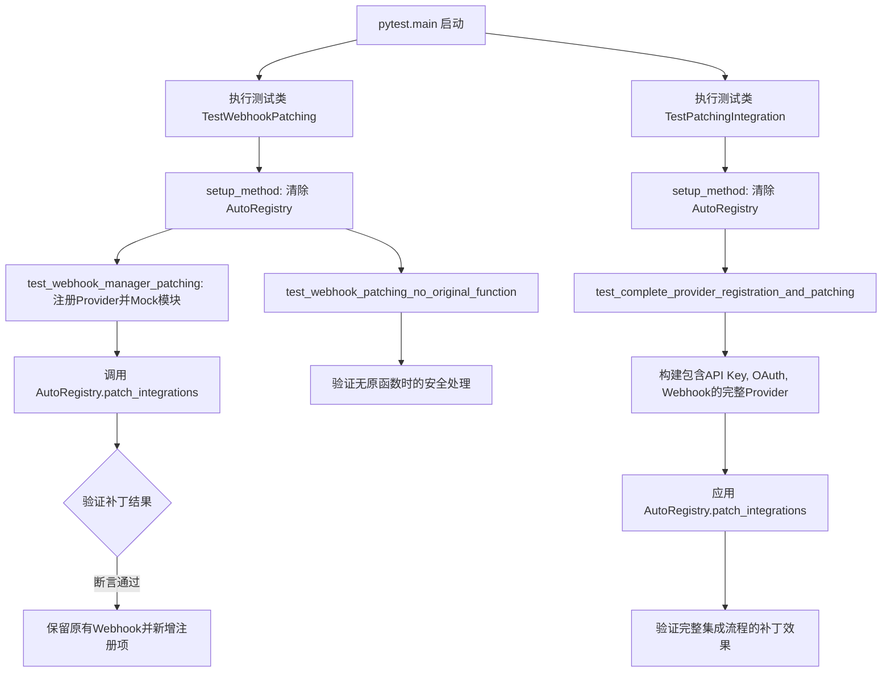
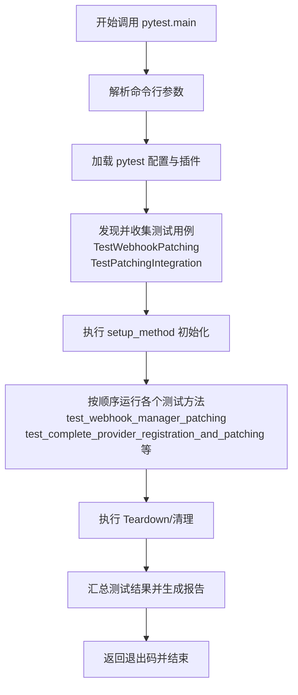
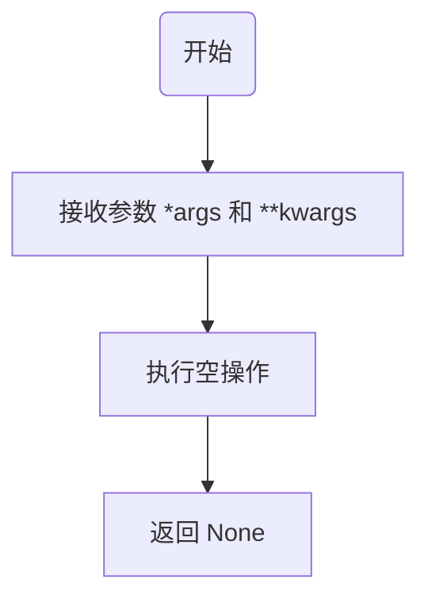
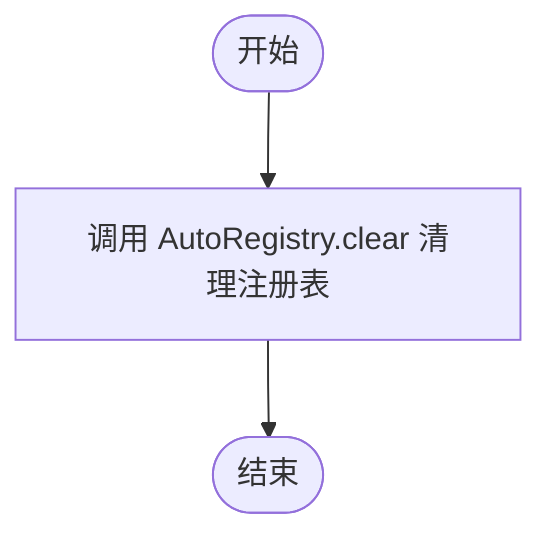
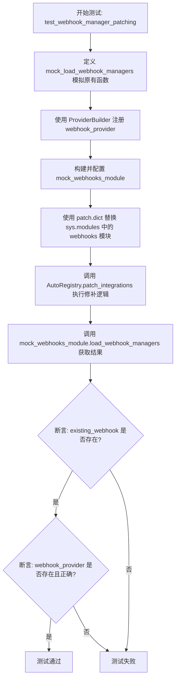
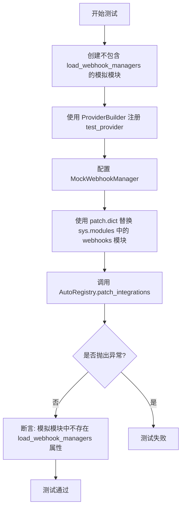
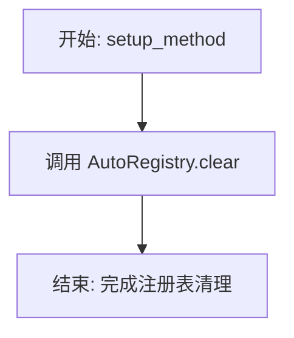
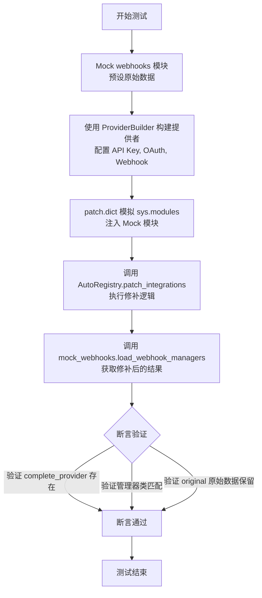

# `.\AutoGPT\autogpt_platform\backend\test\sdk\test_sdk_patching.py` 详细设计文档

该代码是一套针对 SDK 集成补丁机制的单元测试，主要验证 AutoRegistry 能够正确地将 SDK 注册的组件（如 OAuth 处理程序和 Webhook 管理器）动态修补到现有的集成模块中，同时确保原有的集成功能不受影响。

## 整体流程



## 类结构

```
MockOAuthHandler (BaseOAuthHandler)
MockWebhookManager (BaseWebhooksManager)
TestWebhookPatching (unittest.TestCase)
TestPatchingIntegration (unittest.TestCase)
```

## 全局变量及字段


### `MockOAuthHandler.PROVIDER_NAME`
    
标识该模拟 OAuth 处理程序的提供程序名称，设定为 GITHUB。

类型：`ProviderName`
    


### `MockWebhookManager.PROVIDER_NAME`
    
标识该模拟 Webhook 管理器的提供程序名称，设定为 GITHUB。

类型：`ProviderName`
    
    

## 全局函数及方法


### `pytest.main`

该函数是 `pytest` 测试框架的命令行入口点，用于在当前 Python 进程中执行测试发现、运行和报告生成。在给定代码中，它被用作脚本的直接执行入口，以详细模式运行当前文件中的所有测试用例，验证 SDK 的集成补丁机制。

参数：

-   `args`：`list` 或 `None`，传递给 pytest 解析器的参数列表。在本代码中，传入了 `[__file__, "-v"]`，其中 `__file__` 指定运行当前脚本，`-v` 表示启用详细模式输出。

返回值：`int`，退出码。`0` 表示所有测试通过，`1` 表示部分测试失败，`2` 表示测试执行被用户中断，`3` 或 `5` 表示内部错误。

#### 流程图



#### 带注释源码

```python
# 位于脚本底部的执行入口判断
if __name__ == "__main__":
    # 调用 pytest.main 函数执行测试
    # 参数列表说明:
    #   __file__: 动态获取当前脚本的路径，指示 pytest 仅运行当前文件
    #   -v: 设置 pytest 的运行模式为 verbose（详细模式），会打印每个测试用例的名称和执行结果
    pytest.main([__file__, "-v"])
```


### `MockOAuthHandler.authorize`

该方法是 `MockOAuthHandler` 类的一个异步类方法，旨在测试环境中模拟 OAuth 授权流程。它忽略传入的具体参数，直接返回一个固定的字符串 "mock_auth" 以模拟授权成功的状态。

参数：

-  `args`：`*args`，可变位置参数，表示传递给该方法的任意数量位置参数（实际方法体中未使用）。
-  `kwargs`：`**kwargs`，可变关键字参数，表示传递给该方法的任意数量关键字参数（实际方法体中未使用）。

返回值：`str`，固定返回字符串 "mock_auth"，代表模拟的授权结果。

#### 流程图

```mermaid
flowchart TD
    Start([开始]) --> Input[接收任意参数 args 和 kwargs]
    Input --> Return[返回字符串 "mock_auth"]
    Return --> End([结束])
```

#### 带注释源码

```python
    @classmethod
    async def authorize(cls, *args, **kwargs):
        return "mock_auth"  # 返回固定的模拟授权字符串，用于测试目的，不执行实际逻辑
```


### `MockWebhookManager.validate_payload`

用于模拟 Webhook Payload 验证流程的类方法。该方法作为测试替身，绕过了实际的验证逻辑，直接返回固定的模拟数据，以便在单元测试中验证调用链。

参数：

- `webhook`：`Any`，表示 Webhook 的上下文信息或标识符。
- `request`：`Any`，表示传入的 HTTP 请求对象。
- `credentials`：`Credentials | None`，用于验证请求的可选凭据对象。

返回值：`Tuple[Dict[str, Any], str]`，返回一个包含两个元素的元组：第一个是空字典（模拟解析后的 Payload），第二个是字符串 "test_event"（模拟事件类型）。

#### 流程图

```mermaid
flowchart TD
    Start([开始]) --> ReturnVal[返回空字典 {} 和 字符串 'test_event']
    ReturnVal --> End([结束])
```

#### 带注释源码

```python
    @classmethod
    async def validate_payload(cls, webhook, request, credentials: Credentials | None):
        # 模拟验证逻辑：不进行任何处理，直接返回固定的模拟数据
        # 返回值：一个空的字典表示处理后的 payload，和一个表示事件类型的字符串
        return {}, "test_event"
```


### `MockWebhookManager._register_webhook`

模拟webhook的注册过程。这是一个用于测试的Mock方法，通过返回静态数据来绕过实际的注册逻辑，以便验证SDK集成补丁机制的正确性。

参数：

- `args`：`tuple`，可变位置参数，用于接收任意传入的位置参数（本方法内部未实际使用）。
- `kwargs`：`dict`，可变关键字参数，用于接收任意传入的关键字参数（本方法内部未实际使用）。

返回值：`tuple`，返回一个包含模拟webhook ID（字符串）和空元数据字典的元组。

#### 流程图

```mermaid
flowchart TD
    Start([开始]) --> Return[/返回 "mock_webhook_id", {}\]
    Return --> End([结束])
```

#### 带注释源码

```python
    async def _register_webhook(self, *args, **kwargs):
        # 这是一个Mock方法，用于模拟webhook的注册行为
        # 直接返回固定的模拟ID和空字典，不执行实际的注册逻辑
        return "mock_webhook_id", {}
```


### `MockWebhookManager._deregister_webhook`

模拟取消注册 Webhook 的操作。该方法继承自 `BaseWebhooksManager`，在此处作为一个空实现，用于测试场景中占位，不执行任何实际逻辑。

参数：

- `args`：`tuple`，接收任意位置参数。
- `kwargs`：`dict`，接收任意关键字参数。

返回值：`None`，无返回值。

#### 流程图



#### 带注释源码

```python
async def _deregister_webhook(self, *args, **kwargs):
    pass  # Mock implementation: performs no operation for testing purposes
```


### `TestWebhookPatching.setup_method`

这是 `TestWebhookPatching` 测试类中的 `setup_method` 钩子方法。它的主要作用是在每个测试用例执行之前清理 `AutoRegistry`（自动注册表）的状态，以确保不同的测试用例之间不会因为注册表状态的残留而产生相互干扰。

参数：

-  `self`：`TestWebhookPatching`，表示当前测试类的实例。

返回值：`None`，该方法没有返回值。

#### 流程图



#### 带注释源码

```python
    def setup_method(self):
        """Clear registry."""
        # 调用 AutoRegistry 的静态方法 clear
        # 目的是重置全局注册状态，保证测试隔离性
        AutoRegistry.clear()
```


### `TestWebhookPatching.test_webhook_manager_patching`

该测试方法验证了 `AutoRegistry` 能够正确地修补系统的 `load_webhook_managers` 函数，确保新通过 SDK 注册的 Webhook 管理器能被合并到现有的管理器集合中，同时保留原有的管理器不被覆盖。

参数：

- `self`：`TestWebhookPatching`，测试类的实例，用于访问测试上下文和断言方法。

返回值：`None`，无返回值。

#### 流程图



#### 带注释源码

```python
    def test_webhook_manager_patching(self):
        """Test that webhook managers are correctly patched."""

        # Mock the original load_webhook_managers function
        # 定义一个模拟函数，假装这是系统中原本已有的 load_webhook_managers 实现
        # 它返回一个包含 "existing_webhook" 的字典
        def mock_load_webhook_managers():
            return {
                "existing_webhook": Mock(spec=BaseWebhooksManager),
            }

        # Register a provider with webhooks
        # 使用构建器模式注册一个新的 Provider，名为 "webhook_provider"
        # 并指定使用 MockWebhookManager 作为其 Webhook 管理器
        (
            ProviderBuilder("webhook_provider")
            .with_webhook_manager(MockWebhookManager)
            .build()
        )

        # Mock the webhooks module
        # 创建一个 MagicMock 对象来模拟 backend.integrations.webhooks 模块
        mock_webhooks_module = MagicMock()
        mock_webhooks_module.load_webhook_managers = mock_load_webhook_managers

        with patch.dict(
            "sys.modules", {"backend.integrations.webhooks": mock_webhooks_module}
        ):
            # 触发 AutoRegistry 的修补逻辑
            # 这会修改 sys.modules 中对应模块的函数，使其能够返回 SDK 注册的组件
            AutoRegistry.patch_integrations()

            # Call the patched function
            # 调用被修补后的 load_webhook_managers 函数
            result = mock_webhooks_module.load_webhook_managers()

            # Original webhook should still exist
            # 断言：原有的 "existing_webhook" 仍然存在于结果中，确保未被覆盖
            assert "existing_webhook" in result

            # New webhook should be added
            # 断言：新注册的 "webhook_provider" 也存在于结果中
            assert "webhook_provider" in result
            # 断言：新注册的 provider 对应的管理器类确实是 MockWebhookManager
            assert result["webhook_provider"] == MockWebhookManager
```


### `TestWebhookPatching.test_webhook_patching_no_original_function`

该测试方法用于验证在目标模块中不存在原始的 `load_webhook_managers` 函数时，SDK 的自动注册补丁机制的行为。它确保在这种情况下，系统不会抛出错误，也不会在目标模块上动态创建该函数，即保持模块的原始状态不变。

参数：

-  `self`：`TestWebhookPatching`，测试类的实例，用于访问测试上下文和断言方法。

返回值：`None`，该方法不返回任何值，主要通过断言来验证系统行为。

#### 流程图



#### 带注释源码

```python
    def test_webhook_patching_no_original_function(self):
        """Test webhook patching when load_webhook_managers doesn't exist."""
        # 1. 创建一个空的模拟模块，指定 spec=[] 表示模拟对象没有任何属性或方法
        # 这模拟了集成模块中尚未定义 load_webhook_managers 函数的场景
        mock_webhooks_module = MagicMock(spec=[])

        # 2. 使用 ProviderBuilder 构建并注册一个新的 Provider
        # 该 Provider 配置了 MockWebhookManager，意在测试如果注册表中有内容，
        # 但目标模块中缺失加载函数时，系统如何处理
        (
            ProviderBuilder("test_provider")
            .with_webhook_manager(MockWebhookManager)
            .build()
        )

        # 3. 使用 patch.dict 临时替换 sys.modules 中的 webhooks 模块
        # 这样 AutoRegistry.patch_integrations 将会操作我们创建的模拟模块
        with patch.dict(
            "sys.modules", {"backend.integrations.webhooks": mock_webhooks_module}
        ):
            # 4. 调用核心补丁逻辑
            # 预期行为：代码不应抛出 AttributeError 或其他异常
            AutoRegistry.patch_integrations()

            # 5. 验证补丁逻辑的副作用
            # 断言：模拟模块上不应该被添加 load_webhook_managers 函数
            # 这表明修补机制是“增强”现有的，而不是“无中生有”的
            assert not hasattr(mock_webhooks_module, "load_webhook_managers")
```


### `TestPatchingIntegration.setup_method`

测试类方法初始化，用于在每个测试方法执行前清理自动注册表的状态，确保测试间的隔离性。

参数：

- `self`：`TestPatchingIntegration`，测试类实例本身

返回值：`None`，无返回值

#### 流程图



#### 带注释源码

```python
def setup_method(self):
    """Clear registry."""
    # 清空 AutoRegistry 中的注册数据
    # 防止之前的测试遗留的注册项影响当前测试的执行环境
    AutoRegistry.clear()
```


### `TestPatchingIntegration.test_complete_provider_registration_and_patching`

测试从提供者注册到修补系统模块的完整集成流程，验证注册的提供者组件（如 API Key、OAuth、Webhook 管理器）是否正确注入到现有的加载函数中，同时确保原有的系统条目被保留。

参数：

- `self`：`TestPatchingIntegration`，测试类的实例。

返回值：`None`，无显式返回值，主要通过断言验证逻辑正确性。

#### 流程图



#### 带注释源码

```python
def test_complete_provider_registration_and_patching(self):
    """Test the complete flow from provider registration to patching."""
    # Mock webhooks module
    # 创建一个 mock 对象模拟 webhooks 模块，并预设一个返回原始 Mock 对象的 load_webhook_managers 函数
    mock_webhooks = MagicMock()
    mock_webhooks.load_webhook_managers = lambda: {"original": Mock()}

    # Create a fully featured provider
    # 使用构建器模式创建一个名为 "complete_provider" 的提供者
    # 该提供者配置了 API Key、OAuth 处理程序和 Webhook 管理器
    (
        ProviderBuilder("complete_provider")
        .with_api_key("COMPLETE_KEY", "Complete API Key")
        .with_oauth(MockOAuthHandler, scopes=["read", "write"])
        .with_webhook_manager(MockWebhookManager)
        .build()
    )

    # Apply patches
    # 使用 patch.dict 临时替换 sys.modules 中的特定模块
    # 将 "backend.integrations.webhooks" 替换为上面创建的 mock_webhooks
    with patch.dict(
        "sys.modules",
        {
            "backend.integrations.webhooks": mock_webhooks,
        },
    ):
        # 执行自动注册和修补逻辑，将新构建的提供者集成到系统中
        AutoRegistry.patch_integrations()

        # Verify webhook patching
        # 调用被修补后的 load_webhook_managers 函数获取结果
        webhook_result = mock_webhooks.load_webhook_managers()
        
        # 断言：新注册的提供者键 "complete_provider" 存在于结果中
        assert "complete_provider" in webhook_result
        # 断言：新提供者对应的 Webhook 管理器类为 MockWebhookManager
        assert webhook_result["complete_provider"] == MockWebhookManager
        # 断言：原有的 "original" 条目仍然存在，确保修补是增量而非覆盖
        assert "original" in webhook_result  # Original preserved
```


## 关键组件


### AutoRegistry

SDK 集成的核心注册中心，负责维护已注册提供者的状态，并提供 `patch_integrations` 机制以动态修改系统模块行为，将 SDK 组件无缝注入现有的加载逻辑中。

### ProviderBuilder

用于构建和配置提供者定义的流式接口（Builder Pattern），允许通过链式调用方法（如 `with_api_key`、`with_oauth`、`with_webhook_manager`）来定义提供者功能，并最终将其注册到 AutoRegistry。

### MockWebhookManager

Webhook 管理器的模拟实现（继承自 `BaseWebhooksManager`），在测试中用于代表具有 Webhook 处理能力的组件，以验证补丁机制是否能正确将自定义 Webhook 管理器集成到系统的加载函数中。

### MockOAuthHandler

OAuth 处理程序的模拟实现（继承自 `BaseOAuthHandler`），在测试中用于代表处理认证逻辑的组件，展示了如何通过 ProviderBuilder 注册包含 OAuth 功能的提供者。

### 集成补丁机制

一种动态运行时逻辑，通过 `AutoRegistry.patch_integrations` 实现，它能够检测并修改现有的模块函数（如 `load_webhook_managers`），在保留原有功能的前提下，合并新注册的 SDK 组件。


## 问题及建议


### 已知问题

-   **脆弱的 Mock 策略**：测试代码通过 `patch.dict("sys.modules", ...)` 直接模拟 Python 的导入系统。这种做法非常脆弱，依赖于 `AutoRegistry` 内部特定的模块查找机制。如果导入逻辑发生变化，或者测试运行环境复杂（如并发测试），可能会导致不可预测的行为或失败。
-   **全局状态依赖**：测试依赖 `AutoRegistry.clear()` 来清理状态。这表明 `AutoRegistry` 严重依赖全局单例或静态变量。这种设计增加了测试的复杂性，如果 `setup_method` 未正确执行或发生异常，可能导致测试间相互污染，产生难以复现的 Bug。
-   **硬编码模块路径**：测试代码中硬编码了 `"backend.integrations.webhooks"` 等字符串。如果项目进行重构（例如移动模块位置），这些字符串字面量需要手动更新，缺乏编译时检查的保护，增加了维护成本。

### 优化建议

-   **使用 Pytest Fixture 复用逻辑**：建议将 `mock_webhooks_module` 的创建、`sys.modules` 的 `patch` 操作以及 `AutoRegistry.clear()` 封装为 Pytest 的 `fixture`（例如 `@pytest.fixture`），利用 `yield` 进行资源清理。这样可以显著减少重复代码，并明确测试的前置与后置条件。
-   **增强异常场景覆盖**：目前的测试主要集中在“成功修补”和“函数不存在”两种情况。建议增加异常场景测试，例如模拟原始的 `load_webhook_managers` 函数抛出异常，以验证 `AutoRegistry.patch_integrations()` 的错误处理能力和鲁棒性。
-   **解耦断言与具体实现**：在断言时，避免直接比较类对象（如 `assert result["webhook_provider"] == MockWebhookManager`）。建议改为验证返回对象的接口能力（如是否继承自 `BaseWebhooksManager`）或特定方法的存在性，这样即使重构了 Mock 类的具体实现，测试依然有效。
-   **验证修补后的函数行为**：目前测试主要验证修补后字典中是否包含新键。建议进一步验证被修补后的函数在被调用时，是否能够正确合并新旧返回值，确保逻辑的完整性。


## 其它


### 设计目标与约束

本测试套件的核心设计目标是验证 `AutoRegistry` 运行时修补机制的可靠性与隔离性，确保 SDK 能够在不破坏现有集成代码的前提下，动态注入新的提供程序组件。主要设计约束包括：
1. **隔离性约束**：测试必须在完全隔离的环境中运行，利用 `unittest.mock` 模拟外部依赖，避免对真实系统状态（如 `sys.modules`）造成持久性污染。
2. **状态管理约束**：每个测试用例执行前后必须重置 `AutoRegistry` 的全局状态，确保测试之间互不干扰。
3. **模拟约束**：由于涉及异步操作（OAuth 和 Webhooks），测试通过 Mock 对象模拟异步方法的返回值，无需真实的网络 I/O 或事件循环介入。
4. **Monkey Patching 约束**：修补逻辑依赖于动态修改 `sys.modules`，这要求测试环境必须能够安全地加载和卸载模拟模块。

### 数据流与状态机

本模块处理的数据流主要围绕“注册中心状态”与“模拟模块环境”之间的交互，状态转换逻辑如下：

1. **初始状态**：`AutoRegistry` 为空或包含残留数据。
2. **状态重置**：通过 `setup_method` 调用 `AutoRegistry.clear()`，将注册中心重置为干净的初始状态。
3. **注册阶段**：使用 `ProviderBuilder` 构建提供程序并调用 `build()`，将 `MockWebhookManager` 等组件写入 `AutoRegistry` 的内部存储中。此时数据流向为：Test Case -> Registry。
4. **环境模拟阶段**：使用 `patch.dict` 修改 `sys.modules`，注入模拟的 `webhooks` 模块。此时系统环境被替换为 Mock 对象。
5. **修补执行阶段**：调用 `AutoRegistry.patch_integrations()`。系统读取注册中心的提供程序数据，并尝试修改 `sys.modules` 中对应模块的函数属性（如 `load_webhook_managers`）。此时数据流向为：Registry -> Mock Module Attributes。
6. **验证阶段**：调用被修补后的模拟函数，断言返回结果中既包含原有数据，也包含新注入的 SDK 组件。

### 外部依赖与接口契约

测试代码及其所测逻辑依赖于以下外部组件和接口契约：

1. **测试框架依赖**：
    - `pytest`：提供测试运行器、fixture 机制和断言库。
    - `unittest.mock`：提供 `MagicMock`, `Mock`, `patch` 用于模拟对象和行为替换。

2. **被测系统依赖**：
    - `backend.sdk.AutoRegistry`：核心修补引擎，契约要求其必须提供 `clear()`, `patch_integrations()` 方法。
    - `backend.sdk.ProviderBuilder`：构建器模式，契约要求支持链式调用（`.with_webhook_manager()`, `.build()`）。
    - `backend.integrations.providers.ProviderName`：枚举类型，用于标识提供程序。

3. **接口契约**：
    - **修补目标契约**：被修补的模块（如 `backend.integrations.webhooks`）通常预期包含 `load_webhook_managers` 函数。测试契约规定：如果该函数不存在，`AutoRegistry` 应静默处理而不报错；如果存在，则必须返回一个字典，且修补后的字典必须保留原有键值对并追加新注册的提供程序。
    - **Mock 契约**：`MockWebhookManager` 必须继承自 `BaseWebhooksManager` 并实现特定的类方法和实例方法（如 `_register_webhook`），以满足类型检查和接口适配要求。

### 错误处理与异常设计

测试代码重点验证了系统在边界条件下的鲁棒性，而非单纯的成功路径：

1. **缺失函数容忍**：
    - 设计点：`test_webhook_patching_no_original_function` 验证了当目标模块中不存在 `load_webhook_managers` 函数时的行为。
    - 预期行为：系统不应抛出 `AttributeError` 或 `KeyError`，而应安全跳过修补，且不强行创建不存在的函数。

2. **数据完整性保障**：
    - 设计点：`test_webhook_manager_patching` 验证了字典合并逻辑。
    - 异常预防：确保修补过程不会覆盖原有的 Webhook Manager（即 `"existing_webhook"`），防止因集成冲突导致的功能丢失。

3. **模拟异常隔离**：
    - 虽然 Mock 对象默认不抛出异常，但测试设计暗示了真实场景下，如果 `ProviderBuilder` 注册失败或 `AutoRegistry` 内部逻辑出错，测试会通过 `pytest` 捕获并报告，阻止错误的代码合并。

    