# `.\AutoGPT\autogpt_platform\backend\test\sdk\test_sdk_registry.py` 详细设计文档

该文件是针对SDK自动注册系统的全面测试套件，旨在验证Provider注册、OAuth处理器、Webhook管理器、凭证管理、Block配置的自动注册机制，以及ProviderBuilder流式API的正确性和系统集成的补丁功能。

## 整体流程

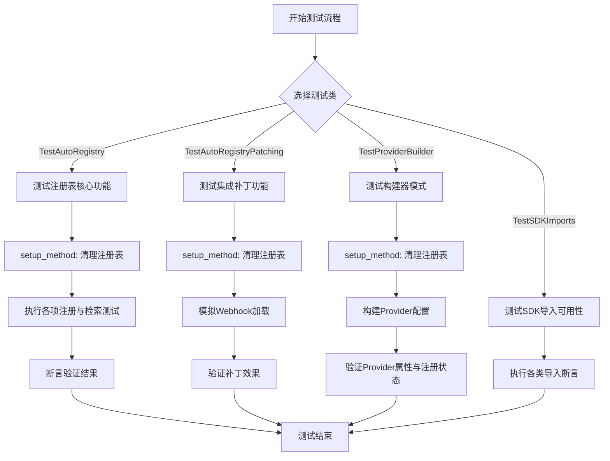

## 类结构

```
TestAutoRegistry (注册表核心测试)
TestAutoRegistryPatching (补丁机制测试)
TestProviderBuilder (构建器模式测试)
TestSDKImports (SDK导入测试)
```

## 全局变量及字段


    

## 全局函数及方法


### `TestAutoRegistry.setup_method`

该方法是 `TestAutoRegistry` 测试类的前置钩子，用于在每个测试方法执行之前清理 `AutoRegistry` 的状态，确保测试之间的环境隔离，防止状态污染。

参数：

-  `self`：`TestAutoRegistry`，指向测试类实例的引用。

返回值：`None`，该方法仅执行清理操作，不返回任何值。

#### 流程图

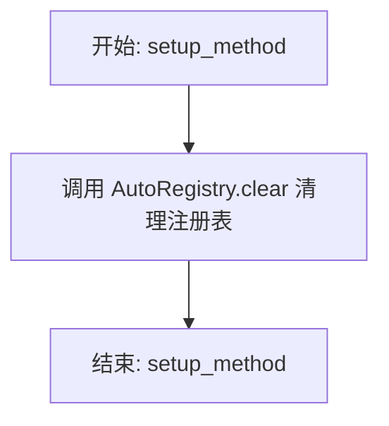

#### 带注释源码

```python
def setup_method(self):
    """
    Clear registry before each test.
    在每个测试前清理注册表。
    """
    AutoRegistry.clear()  # 调用 AutoRegistry 的静态方法 clear()，重置所有已注册的提供者、凭证、OAuth 处理器等状态
```


### `TestAutoRegistry.test_provider_registration`

该测试方法用于验证 `AutoRegistry` 的核心功能，即创建一个 Provider 实例后，能否成功将其注册到全局注册表中，并确保后续能够正确检索到该注册的 Provider。

参数：

-  `self`：`TestAutoRegistry`，测试类的实例，提供上下文和测试工具方法。

返回值：`None`，无返回值，主要通过断言来验证行为是否符合预期。

#### 流程图

```mermaid
graph TD
    A[开始: test_provider_registration] --> B[创建 Provider 实例]
    B --> C[配置 Provider 属性<br>name='test_provider', supported_auth_types={'api_key'}]
    C --> D[调用 AutoRegistry.register_provider]
    D --> E[执行注册逻辑]
    E --> F[验证注册结果]
    F --> G{断言: 'test_provider' 是否在 _providers 中?}
    G -- 否 --> H[测试失败]
    G -- 是 --> I[调用 AutoRegistry.get_provider]
    I --> J[获取 Provider 实例]
    J --> K{断言: 获取的实例 == 创建的实例?}
    K -- 否 --> H
    K -- 是 --> L[测试通过]
    L --> M[结束]
```

#### 带注释源码

```python
    def test_provider_registration(self):
        """Test that providers can be registered and retrieved."""
        # 创建一个测试用的 Provider 实例
        # 指定名称为 "test_provider"，并初始化其他必要的字段（如 oauth_handler, webhook_manager 等）
        provider = Provider(
            name="test_provider",
            oauth_handler=None,
            webhook_manager=None,
            default_credentials=[],
            base_costs=[],
            supported_auth_types={"api_key"},
        )

        # 将创建的 provider 对象注册到 AutoRegistry 中
        # 这一步通常会将 provider 存储在 AutoRegistry 的内部字典或集合中
        AutoRegistry.register_provider(provider)

        # 验证 provider 是否已被成功注册
        # 检查 AutoRegistry 内部的 _providers 字典中是否包含键 "test_provider"
        assert "test_provider" in AutoRegistry._providers
        
        # 验证能否从 AutoRegistry 中正确检索出刚才注册的 provider
        # 调用 get_provider 方法并通过名称检索，断言返回的对象与最初创建的对象是同一个
        assert AutoRegistry.get_provider("test_provider") == provider
```


### `TestAutoRegistry.test_provider_with_oauth`

该函数用于测试集成 OAuth 处理程序的提供者注册功能，验证在通过 `AutoRegistry` 注册包含 OAuth 配置的提供者时，OAuth 处理程序是否被正确提取并存储在注册表的内部映射中。

参数：

- `self`：`TestAutoRegistry`，测试类的实例，用于访问测试上下文和 pytest 的断言方法。

返回值：`None`，该函数为单元测试方法，不返回具体数值，通过断言验证系统行为是否符合预期。

#### 流程图

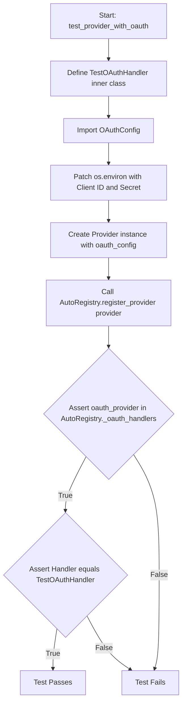

#### 带注释源码

```python
def test_provider_with_oauth(self):
    """Test provider registration with OAuth handler."""

    # 创建一个继承自 BaseOAuthHandler 的模拟 OAuth 处理类
    class TestOAuthHandler(BaseOAuthHandler):
        PROVIDER_NAME = ProviderName.GITHUB

    from backend.sdk.provider import OAuthConfig

    # 设置环境变量，以确保 OAuth 处理程序在注册过程中能读取到必要的配置
    with patch.dict(
        os.environ,
        {"TEST_CLIENT_ID": "test_id", "TEST_CLIENT_SECRET": "test_secret"},
    ):
        # 构建一个包含 OAuth 配置的 Provider 对象
        provider = Provider(
            name="oauth_provider",
            oauth_config=OAuthConfig(
                oauth_handler=TestOAuthHandler,
                client_id_env_var="TEST_CLIENT_ID",
                client_secret_env_var="TEST_CLIENT_SECRET",
            ),
            webhook_manager=None,
            default_credentials=[],
            base_costs=[],
            supported_auth_types={"oauth2"},
        )

        # 调用 AutoRegistry 注册该提供者
        AutoRegistry.register_provider(provider)

        # 验证 OAuth 处理程序是否已成功注册到内部存储中
        assert "oauth_provider" in AutoRegistry._oauth_handlers
        assert AutoRegistry._oauth_handlers["oauth_provider"] == TestOAuthHandler
```


### `TestAutoRegistry.test_provider_with_webhook_manager`

测试带有 webhook manager 的 provider 注册流程，验证 webhook manager 能否正确注册到 AutoRegistry 中并能被检索到。

参数：

-  `self`：`TestAutoRegistry`，测试类的实例。

返回值：`None`，无返回值。

#### 流程图

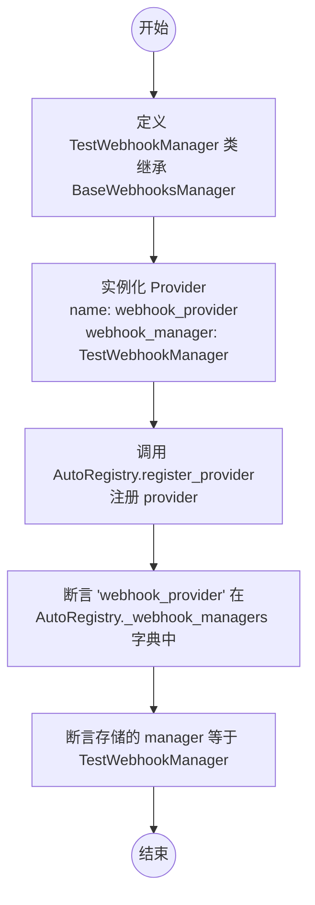

#### 带注释源码

```python
    def test_provider_with_webhook_manager(self):
        """Test provider registration with webhook manager."""

        # Create a mock webhook manager
        # 创建一个继承自 BaseWebhooksManager 的模拟类 TestWebhookManager
        class TestWebhookManager(BaseWebhooksManager):
            PROVIDER_NAME = ProviderName.GITHUB

        # 创建一个 Provider 实例，指定名称为 "webhook_provider"
        # 并将 TestWebhookManager 类赋值给 webhook_manager 参数
        provider = Provider(
            name="webhook_provider",
            oauth_handler=None,
            webhook_manager=TestWebhookManager,
            default_credentials=[],
            base_costs=[],
            supported_auth_types={"api_key"},
        )

        # 调用 AutoRegistry 的静态方法注册该 provider
        AutoRegistry.register_provider(provider)

        # Verify webhook manager is registered
        # 验证 "webhook_provider" 已存在于 AutoRegistry 的 webhook 管理器字典中
        assert "webhook_provider" in AutoRegistry._webhook_managers
        # 验证字典中对应的值确实是之前创建的 TestWebhookManager 类
        assert AutoRegistry._webhook_managers["webhook_provider"] == TestWebhookManager
```


### `TestAutoRegistry.test_default_credentials_registration`

该测试方法旨在验证 `AutoRegistry` 系统在注册提供者时，能否正确处理并存储与之关联的默认凭据。它通过创建两个 API Key 凭据对象，将其添加到新的提供者配置中，注册该提供者，并最终断言这些凭据已被成功添加到全局注册表中，从而确保凭据管理机制的有效性。

参数：

-  `self`：`TestAutoRegistry`，测试类的实例，由测试框架自动注入。

返回值：`None`，该方法为单元测试，无显式返回值，主要通过断言来验证逻辑正确性。

#### 流程图

```mermaid
flowchart TD
    A([开始: test_default_credentials_registration]) --> B[导入 SecretStr]
    B --> C[创建 APIKeyCredentials 实例 cred1]
    C --> D[创建 APIKeyCredentials 实例 cred2]
    D --> E[实例化 Provider 对象<br/>name='test_provider'<br/>default_credentials=[cred1, cred2]]
    E --> F[调用 AutoRegistry.register_provider provider]
    F --> G[调用 AutoRegistry.get_all_credentials 获取 all_creds]
    G --> H{断言 cred1 在 all_creds 中?}
    H -- 是 --> I{断言 cred2 在 all_creds 中?}
    I -- 是 --> J([结束: 测试通过])
    H -- 否 --> K([结束: 测试失败])
    I -- 否 --> K
```

#### 带注释源码

```python
def test_default_credentials_registration(self):
    """Test that default credentials are registered."""
    # 导入用于安全存储字符串的 SecretStr 类型
    from backend.sdk import SecretStr

    # 创建第一个测试凭据对象 (APIKeyCredentials)
    cred1 = APIKeyCredentials(
        id="test-cred-1",
        provider="test_provider",
        api_key=SecretStr("test-key-1"),  # 使用 SecretStr 包装敏感信息
        title="Test Credential 1",
    )
    # 创建第二个测试凭据对象
    cred2 = APIKeyCredentials(
        id="test-cred-2",
        provider="test_provider",
        api_key=SecretStr("test-key-2"),
        title="Test Credential 2",
    )

    # 构建一个 Provider 实例，并将上述两个凭据作为 default_credentials 传入
    provider = Provider(
        name="test_provider",
        oauth_handler=None,
        webhook_manager=None,
        default_credentials=[cred1, cred2],  # 关键点：传入默认凭据列表
        base_costs=[],
        supported_auth_types={"api_key"},
    )

    # 调用 AutoRegistry 注册该 Provider
    # 预期逻辑：注册过程中应将 default_credentials 中的凭据提取并存入注册表
    AutoRegistry.register_provider(provider)

    # 从注册表中获取所有已注册的凭据
    all_creds = AutoRegistry.get_all_credentials()

    # 验证凭据 cred1 已成功注册
    assert cred1 in all_creds
    # 验证凭据 cred2 已成功注册
    assert cred2 in all_creds
```


### `TestAutoRegistry.test_api_key_registration`

测试通过环境变量进行API密钥注册的功能。该方法验证了当使用 `ProviderBuilder` 构建提供者并指定API密钥环境变量时，系统能正确存储环境变量映射，并根据该环境变量自动创建并注册相应的凭据对象。

参数：

- `self`：`TestAutoRegistry`，测试类的实例，用于访问测试上下文和断言方法。

返回值：`None`，该方法是测试用例，用于验证逻辑正确性，无显式返回值。

#### 流程图

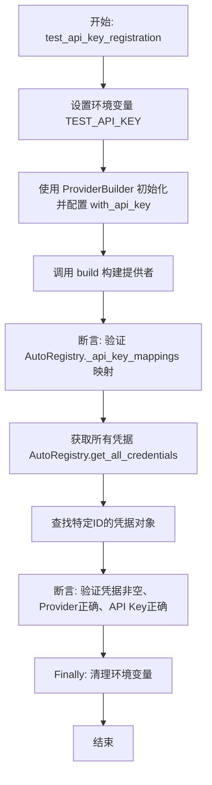

#### 带注释源码

```python
    def test_api_key_registration(self):
        """Test API key environment variable registration."""
        import os

        from backend.sdk.builder import ProviderBuilder

        # 1. 准备测试环境：设置一个模拟的API密钥环境变量
        os.environ["TEST_API_KEY"] = "test-api-key-value"

        try:
            # 2. 执行核心逻辑：使用 ProviderBuilder 链式调用配置提供者
            # with_api_key 指定了环境变量名和显示标题
            # build() 方法会触发注册逻辑，包括读取环境变量并创建凭据
            (
                ProviderBuilder("test_provider")
                .with_api_key("TEST_API_KEY", "Test API Key")
                .build()
            )

            # 3. 验证映射关系：检查 AutoRegistry 是否正确记录了提供者名到环境变量名的映射
            assert AutoRegistry._api_key_mappings["test_provider"] == "TEST_API_KEY"

            # 4. 验证凭据创建：从注册中心获取所有凭据
            all_creds = AutoRegistry.get_all_credentials()
            
            # 5. 筛选出当前测试生成的凭据（ID通常为 provider_name-default）
            test_cred = next(
                (c for c in all_creds if c.id == "test_provider-default"), None
            )
            
            # 6. 断言凭据对象的存在性及其属性的正确性
            assert test_cred is not None
            assert test_cred.provider == "test_provider"
            # 验证凭据中存储的密钥值与最初设置的环境变量值一致
            assert test_cred.api_key.get_secret_value() == "test-api-key-value"  # type: ignore

        finally:
            # 7. 清理环境：删除测试用的环境变量，避免影响其他测试
            del os.environ["TEST_API_KEY"]
```


### `TestAutoRegistry.test_get_oauth_handlers`

该测试函数用于验证 `AutoRegistry` 能够正确注册包含 OAuth 配置的多个提供程序，并能通过 `get_oauth_handlers` 方法检索出所有已注册的 OAuth 处理程序映射。

参数：

- `self`：`TestAutoRegistry`，测试类实例，用于访问测试框架和类上下文。

返回值：`None`，该函数为测试方法，不返回显式值，通过断言验证结果。

#### 流程图

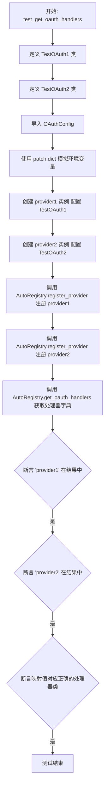

#### 带注释源码

```python
def test_get_oauth_handlers(self):
    """Test retrieving all OAuth handlers."""

    # 定义两个测试用的 OAuth 处理器类，继承自 BaseOAuthHandler
    class TestOAuth1(BaseOAuthHandler):
        PROVIDER_NAME = ProviderName.GITHUB

    class TestOAuth2(BaseOAuthHandler):
        PROVIDER_NAME = ProviderName.GOOGLE

    from backend.sdk.provider import OAuthConfig

    # 模拟环境变量，确保 OAuth 配置所需的密钥存在，从而允许注册
    with patch.dict(
        os.environ,
        {"TEST_CLIENT_ID": "test_id", "TEST_CLIENT_SECRET": "test_secret"},
    ):
        # 创建第一个 Provider，使用 TestOAuth1
        provider1 = Provider(
            name="provider1",
            oauth_config=OAuthConfig(
                oauth_handler=TestOAuth1,
                client_id_env_var="TEST_CLIENT_ID",
                client_secret_env_var="TEST_CLIENT_SECRET",
            ),
            webhook_manager=None,
            default_credentials=[],
            base_costs=[],
            supported_auth_types={"oauth2"},
        )

        # 创建第二个 Provider，使用 TestOAuth2
        provider2 = Provider(
            name="provider2",
            oauth_config=OAuthConfig(
                oauth_handler=TestOAuth2,
                client_id_env_var="TEST_CLIENT_ID",
                client_secret_env_var="TEST_CLIENT_SECRET",
            ),
            webhook_manager=None,
            default_credentials=[],
            base_costs=[],
            supported_auth_types={"oauth2"},
        )

        # 将两个 Provider 注册到 AutoRegistry 中
        AutoRegistry.register_provider(provider1)
        AutoRegistry.register_provider(provider2)

        # 获取所有已注册的 OAuth 处理程序
        handlers = AutoRegistry.get_oauth_handlers()
        
        # 验证返回的字典中包含了 provider1 和 provider2 的键
        assert "provider1" in handlers
        assert "provider2" in handlers
        
        # 验证返回的字典中键对应的值正确映射到了各自的处理器类
        assert handlers["provider1"] == TestOAuth1
        assert handlers["provider2"] == TestOAuth2
```


### `TestAutoRegistry.test_block_configuration_registration`

该方法用于测试通过AutoRegistry注册块（Block）配置的功能，验证Block类与其对应的配置对象能否正确关联并存储。

参数：

- `self`：`TestAutoRegistry`，测试类的实例。

返回值：`None`，无返回值。

#### 流程图

```mermaid
flowchart TD
    Start([开始]) --> Step1[定义内部类 TestBlock 继承自 Block]
    Step1 --> Step2[实例化 BlockConfiguration 对象<br/>设置 provider 等属性]
    Step2 --> Step3[调用 AutoRegistry.register_block_configuration<br/>传入 TestBlock 和 config]
    Step3 --> Step4[断言 TestBlock 存在于<br/>AutoRegistry._block_configurations 中]
    Step4 --> Step5[断言 AutoRegistry._block_configurations[TestBlock] <br/>等于 config 对象]
    Step5 --> End([结束])
```

#### 带注释源码

```python
def test_block_configuration_registration(self):
    """Test registering block configuration."""

    # 创建一个继承自 Block 的测试类 TestBlock
    class TestBlock(Block):
        pass

    # 创建一个 BlockConfiguration 配置对象，指定提供者名称等信息
    config = BlockConfiguration(
        provider="test_provider",
        costs=[],
        default_credentials=[],
        webhook_manager=None,
        oauth_handler=None,
    )

    # 调用 AutoRegistry 的静态方法注册 TestBlock 及其配置
    AutoRegistry.register_block_configuration(TestBlock, config)

    # 验证 TestBlock 已被注册到 AutoRegistry 的配置字典中
    assert TestBlock in AutoRegistry._block_configurations
    # 验证注册的配置对象与之前创建的 config 对象一致
    assert AutoRegistry._block_configurations[TestBlock] == config
```


### `TestAutoRegistry.test_clear_registry`

该测试方法用于验证 `AutoRegistry.clear()` 方法能否正确重置注册表的状态，确保所有已注册的提供者、凭证、OAuth处理器、Webhook管理器、Block配置以及API密钥映射都被成功清空。

参数：

-   无

返回值：`None`，该方法主要进行断言验证，无实际返回值。

#### 流程图

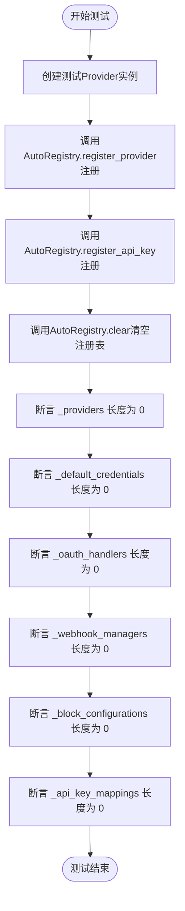

#### 带注释源码

```python
def test_clear_registry(self):
    """Test clearing all registrations."""
    # 1. 准备测试数据：创建一个简单的 Provider 对象
    provider = Provider(
        name="test_provider",
        oauth_handler=None,
        webhook_manager=None,
        default_credentials=[],
        base_costs=[],
        supported_auth_types={"api_key"},
    )
    
    # 2. 向注册表中注册该 Provider
    AutoRegistry.register_provider(provider)
    # 3. 注册一个 API Key 映射
    AutoRegistry.register_api_key("test", "TEST_KEY")

    # 4. 执行清除操作：清空注册表中的所有内容
    AutoRegistry.clear()

    # 5. 验证结果：断言所有内部存储的集合长度均为 0，确保已被清空
    assert len(AutoRegistry._providers) == 0
    assert len(AutoRegistry._default_credentials) == 0
    assert len(AutoRegistry._oauth_handlers) == 0
    assert len(AutoRegistry._webhook_managers) == 0
    assert len(AutoRegistry._block_configurations) == 0
    assert len(AutoRegistry._api_key_mappings) == 0
```


### `TestAutoRegistryPatching.setup_method`

该方法是测试类 `TestAutoRegistryPatching` 的前置设置钩子，用于在每个测试用例执行之前重置 `AutoRegistry` 的状态，通过调用 `AutoRegistry.clear()` 清空注册表中的所有数据，以确保测试之间的隔离性和环境清洁，避免状态污染。

参数：

-   `self`：`TestAutoRegistryPatching`，测试类的实例，由 pytest 框架自动注入。

返回值：`None`，该方法不返回任何值。

#### 流程图

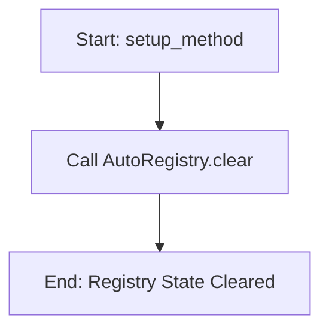

#### 带注释源码

```python
    def setup_method(self):
        """Clear registry before each test."""
        # 调用 AutoRegistry 的静态方法 clear()
        # 以清空所有已注册的提供者、凭证、OAuth 处理器等
        AutoRegistry.clear()
```


### `TestAutoRegistryPatching.test_webhook_manager_patching`

测试 `AutoRegistry` 的集成修补功能，验证通过 `AutoRegistry.patch_integrations` 方法，注册的 webhook 管理器是否能正确地被修补到系统的 `load_webhook_managers` 函数调用中。

参数：

- `self`：`TestAutoRegistryPatching`，测试类的实例。
- `mock_load_managers`：`MagicMock`，通过 `@patch` 装饰器注入的模拟对象，用于替代 `backend.integrations.webhooks.load_webhook_managers` 函数。

返回值：`None`，该方法为单元测试函数，主要执行断言逻辑，无返回值。

#### 流程图

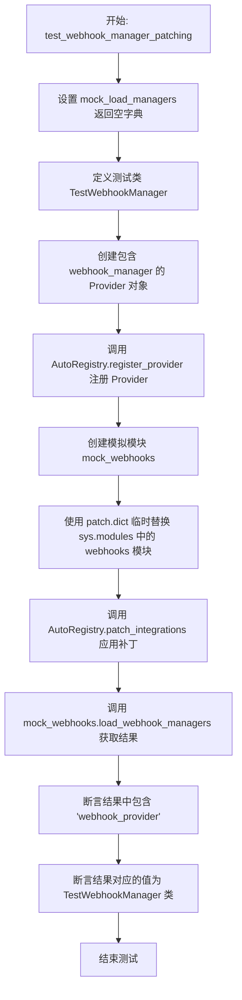

#### 带注释源码

```python
    @patch("backend.integrations.webhooks.load_webhook_managers")
    def test_webhook_manager_patching(self, mock_load_managers):
        """Test that webhook managers are patched into the system."""
        # 设置 mock 函数的返回值为空字典，模拟原始加载行为
        mock_load_managers.return_value = {}

        # 创建一个测试用的 Webhook Manager 类
        class TestWebhookManager(BaseWebhooksManager):
            PROVIDER_NAME = ProviderName.GITHUB

        # 创建一个包含该 Webhook Manager 的 Provider
        provider = Provider(
            name="webhook_provider",
            oauth_handler=None,
            webhook_manager=TestWebhookManager,
            default_credentials=[],
            base_costs=[],
            supported_auth_types={"api_key"},
        )

        # 将 Provider 注册到 AutoRegistry 中，这通常会内部注册 webhook manager
        AutoRegistry.register_provider(provider)

        # 创建一个模拟的 webhooks 模块对象
        mock_webhooks = MagicMock()
        mock_webhooks.load_webhook_managers = mock_load_managers

        # 使用 patch.dict 将 sys.modules 中的 webhooks 模块临时替换为 mock 对象
        with patch.dict(
            "sys.modules", {"backend.integrations.webhooks": mock_webhooks}
        ):
            # 应用集成补丁，这应该会修改 mock_webhooks 上的 load_webhook_managers 行为
            AutoRegistry.patch_integrations()

            # 调用被修补后的函数
            result = mock_webhooks.load_webhook_managers()

            # 验证返回的结果中包含了我们注册的 webhook provider
            assert "webhook_provider" in result
            # 验证对应的 manager 类是否正确
            assert result["webhook_provider"] == TestWebhookManager
```


### `TestProviderBuilder.setup_method`

该方法属于 `TestProviderBuilder` 测试类，是一个 pytest 的测试钩子方法。其主要功能是在每个测试用例执行之前运行，用于清除 `AutoRegistry` 中的所有注册数据（如提供者、OAuth 处理器、Webhook 管理器等），从而确保每个测试都在一个干净、隔离的环境中运行，避免测试之间的状态污染。

参数：

- `self`：`TestProviderBuilder`，测试类的实例引用。

返回值：`None`，无返回值。

#### 流程图

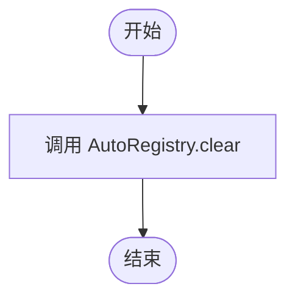

#### 带注释源码

```python
    def setup_method(self):
        """
        在每个测试方法执行前进行初始化设置。
        清除 AutoRegistry 中的所有注册信息，以确保测试之间的隔离性，
        防止一个测试的状态污染另一个测试。
        """
        AutoRegistry.clear()
```


### `TestProviderBuilder.test_basic_provider_builder`

测试使用 `ProviderBuilder` 构建一个基础提供程序，配置 API Key 认证，并验证提供程序属性及其在 AutoRegistry 中的注册情况。

参数：

- `self`：`TestProviderBuilder`，测试类实例，用于访问测试上下文和断言方法。

返回值：`None`，无显式返回值，主要通过断言验证逻辑正确性。

#### 流程图

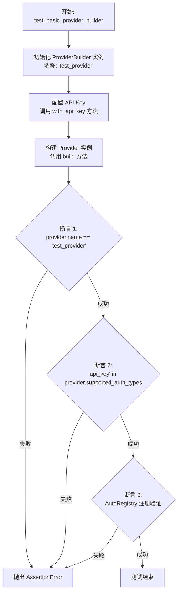

#### 带注释源码

```python
def test_basic_provider_builder(self):
    """Test building a basic provider."""
    # 使用流式 API 构建提供程序实例
    # 1. 指定提供程序名称为 "test_provider"
    # 2. 配置 API Key 认证，指定环境变量名 "TEST_API_KEY" 和显示标题 "Test API Key"
    # 3. 调用 build() 完成构建
    provider = (
        ProviderBuilder("test_provider")
        .with_api_key("TEST_API_KEY", "Test API Key")
        .build()
    )

    # 验证提供程序的名称是否正确设置
    assert provider.name == "test_provider"
    
    # 验证 "api_key" 是否包含在支持的认证类型集合中
    assert "api_key" in provider.supported_auth_types
    
    # 验证该提供程序是否已成功注册到 AutoRegistry 中
    assert AutoRegistry.get_provider("test_provider") == provider
```


### `TestProviderBuilder.test_provider_builder_with_oauth`

该测试方法验证了 `ProviderBuilder` 的流式 API 是否能够成功构建一个配置了 OAuth 处理程序的 Provider 对象。测试通过模拟环境变量、注册自定义 OAuth 处理类并构建 Provider，最终断言生成的 Provider 对象包含正确的 OAuth 配置信息以及 "oauth2" 认证类型。

参数：

- `self`：`TestProviderBuilder`，测试类实例，用于访问测试上下文和断言方法。

返回值：`None`，该函数没有返回值，主要通过断言验证内部逻辑的正确性。

#### 流程图

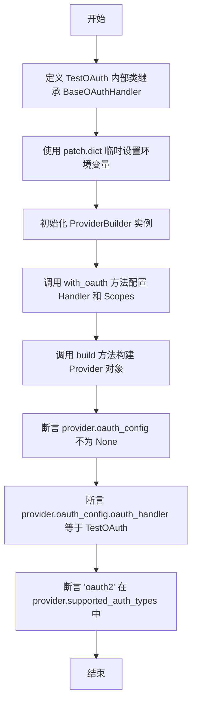

#### 带注释源码

```python
def test_provider_builder_with_oauth(self):
    """Test building a provider with OAuth."""

    # 定义一个用于测试的 OAuth 处理器类，继承自 BaseOAuthHandler
    class TestOAuth(BaseOAuthHandler):
        PROVIDER_NAME = ProviderName.GITHUB

    # 使用 patch.dict 上下文管理器临时设置环境变量
    # 这是 OAuth 初始化通常需要的 Client ID 和 Secret
    with patch.dict(
        os.environ,
        {
            "OAUTH_TEST_CLIENT_ID": "test_id",
            "OAUTH_TEST_CLIENT_SECRET": "test_secret",
        },
    ):
        # 使用流式 API 构建 Provider
        provider = (
            ProviderBuilder("oauth_test")  # 指定 Provider 名称
            .with_oauth(TestOAuth, scopes=["read", "write"])  # 配置 OAuth 处理器和作用域
            .build()  # 构建最终的 Provider 对象
        )

        # 验证构建后的 Provider 对象的 OAuth 配置是否存在
        assert provider.oauth_config is not None
        # 验证 OAuth 配置中的处理器是否为自定义的 TestOAuth 类
        assert provider.oauth_config.oauth_handler == TestOAuth
        # 验证支持的认证类型中是否包含 'oauth2'
        assert "oauth2" in provider.supported_auth_types
```


### `TestProviderBuilder.test_provider_builder_with_webhook`

测试使用 ProviderBuilder 构建带有 webhook 管理器的 Provider，并验证其正确关联。

参数：

- `self`：`TestProviderBuilder`，测试类的实例。

返回值：`None`，测试方法不返回任何值。

#### 流程图

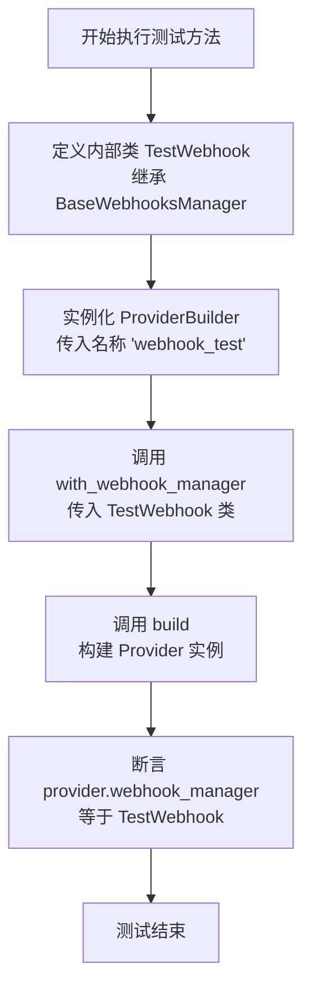

#### 带注释源码

```python
    def test_provider_builder_with_webhook(self):
        """Test building a provider with webhook manager."""

        # 定义一个用于测试的 Webhook 管理器类，继承自基础管理器
        class TestWebhook(BaseWebhooksManager):
            PROVIDER_NAME = ProviderName.GITHUB

        # 使用流式 API 构建提供者对象：
        # 1. 初始化构建器，指定提供者名称为 "webhook_test"
        # 2. 调用 with_webhook_manager 方法，将上面定义的 TestWebhook 类关联进去
        # 3. 调用 build 方法完成构建
        provider = (
            ProviderBuilder("webhook_test").with_webhook_manager(TestWebhook).build()
        )

        # 验证构建出来的 provider 对象，其 webhook_manager 属性确实是我们传入的 TestWebhook 类
        assert provider.webhook_manager == TestWebhook
```


### `TestProviderBuilder.test_provider_builder_with_base_cost`

测试使用 ProviderBuilder 构建包含基础成本配置的 Provider 对象的功能。它验证了通过流式 API 连续调用添加基础成本后，构建出的对象能够正确保存所有成本信息。

参数：

- `self`：`TestProviderBuilder`，测试类实例，用于访问测试上下文和断言方法。

返回值：`None`，无返回值，主要用于通过断言验证逻辑正确性。

#### 流程图

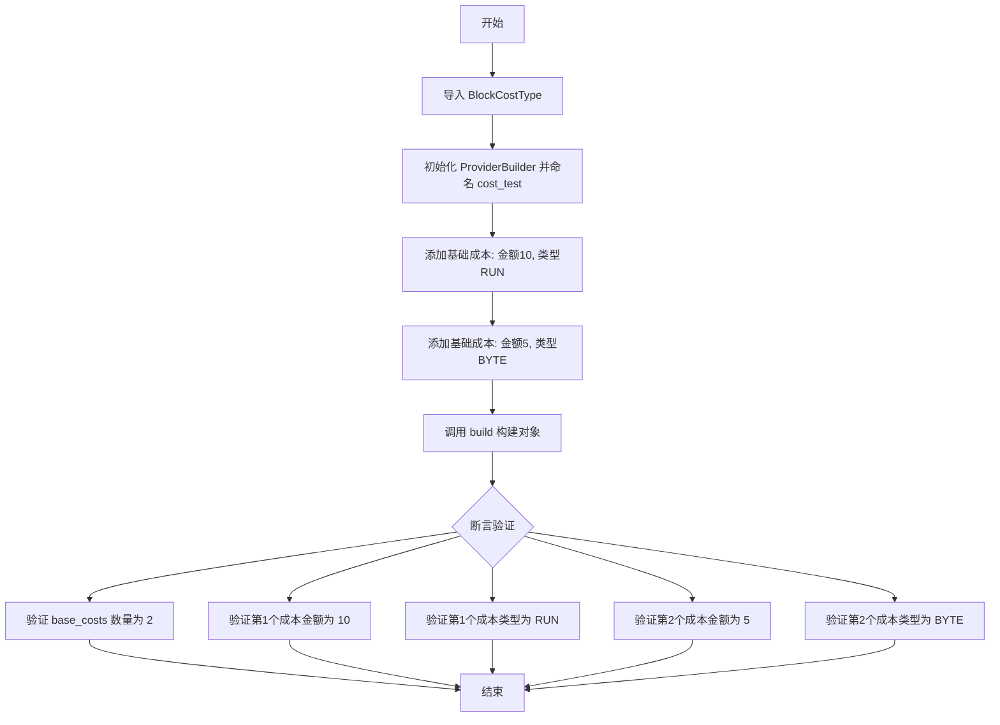

#### 带注释源码

```python
def test_provider_builder_with_base_cost(self):
    """Test building a provider with base costs."""
    # 导入必要的枚举类型 BlockCostType
    from backend.data.block import BlockCostType

    # 使用 ProviderBuilder 流式 API 构建对象：
    # 1. 创建名为 "cost_test" 的构建器
    # 2. 链式调用 with_base_cost 添加第一个成本配置 (金额 10, 类型 RUN)
    # 3. 链式调用 with_base_cost 添加第二个成本配置 (金额 5, 类型 BYTE)
    # 4. 调用 build 生成最终的 Provider 实例
    provider = (
        ProviderBuilder("cost_test")
        .with_base_cost(10, BlockCostType.RUN)
        .with_base_cost(5, BlockCostType.BYTE)
        .build()
    )

    # 断言：验证 provider 对象的 base_costs 列表长度为 2
    assert len(provider.base_costs) == 2
    
    # 断言：验证第一个基础成本的金额是否为 10
    assert provider.base_costs[0].cost_amount == 10
    
    # 断言：验证第一个基础成本的类型是否为 RUN
    assert provider.base_costs[0].cost_type == BlockCostType.RUN
    
    # 断言：验证第二个基础成本的金额是否为 5
    assert provider.base_costs[1].cost_amount == 5
    
    # 断言：验证第二个基础成本的类型是否为 BYTE
    assert provider.base_costs[1].cost_type == BlockCostType.BYTE
```


### `TestProviderBuilder.test_provider_builder_with_api_client`

测试通过 `ProviderBuilder` 构建带有 API 客户端工厂函数的 Provider。

参数：

-  `self`：`TestProviderBuilder`，测试类实例

返回值：`None`，测试方法无返回值

#### 流程图

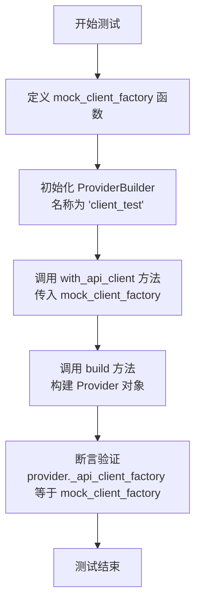

#### 带注释源码

```python
def test_provider_builder_with_api_client(self):
    """Test building a provider with API client factory."""
    # 定义一个模拟的客户端工厂函数，用于后续测试
    def mock_client_factory():
        return Mock()

    # 使用链式调用构建 Provider 对象：
    # 1. 创建名称为 "client_test" 的构建器
    # 2. 配置 API 客户端工厂为 mock_client_factory
    # 3. 构建 Provider 实例
    provider = (
        ProviderBuilder("client_test").with_api_client(mock_client_factory).build()
    )

    # 断言检查：验证生成的 provider 对象中的 _api_client_factory 属性
    # 确实被设置为我们传入的 mock_client_factory
    assert provider._api_client_factory == mock_client_factory
```


### `TestProviderBuilder.test_provider_builder_with_error_handler`

该方法用于测试 `ProviderBuilder` 是否能够成功构建并注册一个包含自定义错误处理函数的 Provider。

参数：

-  `self`：`TestProviderBuilder`，测试类的实例。

返回值：`None`，该方法不返回任何值，仅通过断言验证逻辑正确性。

#### 流程图

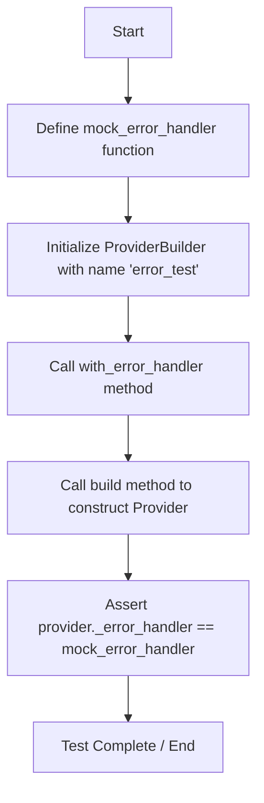

#### 带注释源码

```python
    def test_provider_builder_with_error_handler(self):
        """Test building a provider with error handler."""

        # 定义一个模拟的错误处理函数，接收一个异常对象，返回包含错误信息的字符串
        def mock_error_handler(exc: Exception) -> str:
            return f"Error: {str(exc)}"

        # 使用流式 API 构建 Provider：
        # 1. 创建名为 "error_test" 的构建器
        # 2. 调用 with_error_handler 传入上述定义的 mock 函数
        # 3. 调用 build 完成构建并注册
        provider = (
            ProviderBuilder("error_test")
            .with_error_handler(mock_error_handler)
            .build()
        )

        # 验证构建出的 provider 对象内部的 _error_handler 属性
        # 确实被设置为了我们传入的 mock_error_handler
        assert provider._error_handler == mock_error_handler
```


### `TestProviderBuilder.test_provider_builder_complete_example`

该方法用于验证 `ProviderBuilder` 的完整构建流程，测试通过流式 API（Fluent API）构建一个包含所有可用特性（API Key 认证、OAuth、Webhook 管理器、基础成本、自定义 API 客户端工厂、错误处理器及自定义配置）的 `Provider` 实例，并检查其是否正确注册到 `AutoRegistry` 中。

参数：

-  `self`：`TestProviderBuilder`，测试类实例，用于访问测试上下文和断言方法。

返回值：`None`，该单元测试方法主要执行断言逻辑，无返回值。

#### 流程图

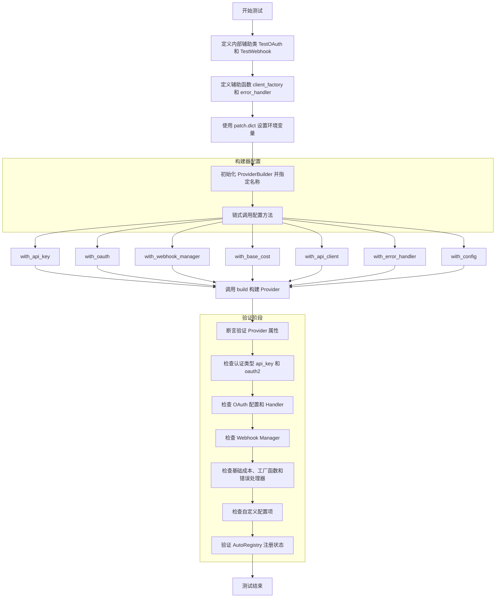

#### 带注释源码

```python
def test_provider_builder_complete_example(self):
    """Test building a complete provider with all features."""
    # 导入必要的枚举类型，用于定义成本类型
    from backend.data.block import BlockCostType

    # 1. 定义模拟的 OAuth 处理器类
    class TestOAuth(BaseOAuthHandler):
        PROVIDER_NAME = ProviderName.GITHUB

    # 2. 定义模拟的 Webhook 管理器类
    class TestWebhook(BaseWebhooksManager):
        PROVIDER_NAME = ProviderName.GITHUB

    # 3. 定义模拟的 API 客户端工厂函数
    def client_factory():
        return Mock()

    # 4. 定义模拟的错误处理函数
    def error_handler(exc):
        return str(exc)

    # 5. 设置环境变量，模拟 OAuth 和 API Key 所需的配置
    with patch.dict(
        os.environ,
        {
            "COMPLETE_TEST_CLIENT_ID": "test_id",
            "COMPLETE_TEST_CLIENT_SECRET": "test_secret",
            "COMPLETE_API_KEY": "test_api_key",
        },
    ):
        # 6. 使用 ProviderBuilder 流式接口构建 Provider
        provider = (
            ProviderBuilder("complete_test")
            .with_api_key("COMPLETE_API_KEY", "Complete API Key")  # 配置 API Key 认证
            .with_oauth(TestOAuth, scopes=["read"])               # 配置 OAuth 认证
            .with_webhook_manager(TestWebhook)                    # 配置 Webhook 管理器
            .with_base_cost(100, BlockCostType.RUN)               # 配置运行成本
            .with_api_client(client_factory)                       # 配置 API 客户端工厂
            .with_error_handler(error_handler)                    # 配置错误处理器
            .with_config(custom_setting="value")                  # 添加自定义配置
            .build()                                               # 构建实例
        )

        # 7. 验证 Provider 的基本属性
        assert provider.name == "complete_test"
        assert "api_key" in provider.supported_auth_types
        assert "oauth2" in provider.supported_auth_types

        # 8. 验证 OAuth 配置是否正确注入
        assert provider.oauth_config is not None
        assert provider.oauth_config.oauth_handler == TestOAuth

        # 9. 验证 Webhook 管理器是否正确设置
        assert provider.webhook_manager == TestWebhook

        # 10. 验证基础成本数量
        assert len(provider.base_costs) == 1

        # 11. 验证自定义工厂和处理器函数
        assert provider._api_client_factory == client_factory
        assert provider._error_handler == error_handler

        # 12. 验证自定义配置项是否可获取
        assert provider.get_config("custom_setting") == "value"

        # 13. 验证 Provider 是否已自动注册到 AutoRegistry
        assert AutoRegistry.get_provider("complete_test") == provider
        assert "complete_test" in AutoRegistry._oauth_handlers
        assert "complete_test" in AutoRegistry._webhook_managers
```


### `TestSDKImports.test_core_block_imports`

该方法用于验证 SDK 中核心 Block 系统组件（`Block` 和 `BlockCategory`）是否能够成功导入，并确认它们在模块中是可用的。

参数：

- `self`：`TestSDKImports`，测试类的实例

返回值：`None`，无显式返回值，通过断言验证导入是否成功

#### 流程图

```mermaid
flowchart TD
    A([开始]) --> B["从 backend.sdk 导入 Block, BlockCategory"]
    B --> C["断言 Block 不为空"]
    C --> D["断言 BlockCategory 不为空"]
    D --> E([结束])
```

#### 带注释源码

```python
    def test_core_block_imports(self):
        """Test core block system imports."""
        # 从 backend.sdk 模块导入核心类 Block 和 BlockCategory
        from backend.sdk import Block, BlockCategory

        # 验证 Block 对象存在且不为 None
        assert Block is not None
        # 验证 BlockCategory 对象存在且不为 None
        assert BlockCategory is not None
```


### `TestSDKImports.test_schema_imports`

该方法用于验证SDK模块中关于架构和模型的核心类（即`APIKeyCredentials`和`SchemaField`）是否能够被正确导入，确保这些关键组件对使用者是可见且可用的。

参数：

- `self`：`TestSDKImports`，测试类的实例，提供测试上下文。

返回值：`None`，无显式返回值，若断言失败则抛出异常，成功时隐式返回 None。

#### 流程图

```mermaid
flowchart TD
    A([开始]) --> B[从 backend.sdk 导入 APIKeyCredentials 和 SchemaField]
    B --> C[断言 SchemaField 不为 None]
    C --> D[断言 APIKeyCredentials 不为 None]
    D --> E([结束])
```

#### 带注释源码

```python
    def test_schema_imports(self):
        """Test schema and model imports."""
        # 从 backend.sdk 模块导入 APIKeyCredentials 和 SchemaField
        # 目的是验证这些类在 SDK 的 __init__.py 或导出逻辑中是否被正确暴露
        from backend.sdk import APIKeyCredentials, SchemaField

        # 断言 SchemaField 已成功导入且不为空
        assert SchemaField is not None

        # 断言 APIKeyCredentials 已成功导入且不为空
        assert APIKeyCredentials is not None
```


### `TestSDKImports.test_type_alias_imports`

该测试方法用于验证 SDK 中已移除了特定的类型别名（Type Alias）导入。作为一个占位测试，它通过注释说明了 SDK 当前不再导出某些类型别名，开发者应当直接使用 Python 标准库 `typing` 模块或内置类型，以此确保代码的向前兼容性和遵循标准实践。

参数：

- `self`：`TestSDKImports`，测试类的实例，用于访问测试上下文。

返回值：`None`，该方法不返回任何值。

#### 流程图

```mermaid
flowchart TD
    Start([方法开始]) --> VerifyAssertion[断言验证: 检查类型别名是否已移除]
    VerifyAssertion -- 执行逻辑仅包含注释 --> Placeholder[占位符: pass 语句]
    Placeholder --> End([方法结束])
```

#### 带注释源码

```python
def test_type_alias_imports(self):
    """Test type alias imports are removed."""
    # 注释：类型别名已从 SDK 中移除
    # 说明：用户应当直接从 typing 导入或使用内置类型
    pass
```


### `TestSDKImports.test_cost_system_imports`

该测试方法用于验证 SDK 的计费系统相关组件（`BlockCost` 和 `BlockCostType`）是否已正确导出并可从 `backend.sdk` 模块中成功引用。

参数：

-   `self`：`TestSDKImports`，测试类的实例，由 pytest 框架自动注入。

返回值：`None`，该方法不返回显式值，通过断言（assert）来判断测试是否通过。

#### 流程图

```mermaid
flowchart TD
    Start([开始]) --> Import[从 backend.sdk 导入 BlockCost 和 BlockCostType]
    Import --> CheckBlockCost[断言 BlockCost 不为 None]
    CheckBlockCost -- 失败 --> FailBlockCost([抛出 AssertionError])
    CheckBlockCost -- 成功 --> CheckBlockCostType[断言 BlockCostType 不为 None]
    CheckBlockCostType -- 失败 --> FailBlockCostType([抛出 AssertionError])
    CheckBlockCostType -- 成功 --> End([结束: 测试通过])
```

#### 带注释源码

```python
    def test_cost_system_imports(self):
        """Test cost system imports."""
        # 从 backend.sdk 模块导入计费相关的类 BlockCost 和 BlockCostType
        from backend.sdk import BlockCost, BlockCostType

        # 验证 BlockCost 类是否成功导入且可用
        assert BlockCost is not None
        # 验证 BlockCostType 枚举/类型是否成功导入且可用
        assert BlockCostType is not None
```


### `TestSDKImports.test_utility_imports`

该测试方法用于验证 `backend.sdk` 模块是否正确暴露了通用的工具类（`BaseModel`、`Requests`）以及标准库模块（`json`），确保这些依赖项可以被外部成功导入且不为空。

参数：

-   `self`：`TestSDKImports`，测试类的实例，提供测试上下文。

返回值：`None`，无返回值。

#### 流程图

```mermaid
flowchart TD
    A["开始: test_utility_imports"] --> B["执行导入: from backend.sdk import BaseModel, Requests, json"]
    B --> C{断言: json is not None}
    C -->|失败| F["抛出 AssertionError"]
    C -->|成功| D{断言: BaseModel is not None}
    D -->|失败| F
    D -->|成功| E{断言: Requests is not None}
    E -->|失败| F
    E -->|成功| G["测试通过"]
```

#### 带注释源码

```python
    def test_utility_imports(self):
        """Test utility imports."""
        # 尝试从 backend.sdk 模块导入 BaseModel, Requests 和 json
        # 这验证了 SDK 暴露了基础的工具类和常用库
        from backend.sdk import BaseModel, Requests, json

        # 验证导入的 json 模块对象不为空
        assert json is not None
        # 验证导入的 BaseModel 类不为空
        assert BaseModel is not None
        # 验证导入的 Requests 类不为空
        assert Requests is not None
```


### `TestSDKImports.test_integration_imports`

该测试方法旨在验证 `ProviderName` 能否成功从 `backend.sdk` 模块导入，以确保 SDK 中与集成提供者名称相关的公共接口是可用的。

参数：

-  `self`：`TestSDKImports`，测试类的实例，用于访问测试上下文。

返回值：`None`，无显式返回值，主要通过断言验证结果。

#### 流程图

```mermaid
graph TD
    A[开始执行] --> B[从 backend.sdk 导入 ProviderName]
    B --> C{判断 ProviderName 是否为 None}
    C -- 否 --> D[断言通过]
    C -- 是 --> E[断言失败/抛出异常]
    D --> F[测试结束]
    E --> F
```

#### 带注释源码

```python
    def test_integration_imports(self):
        """Test integration imports."""
        # 从 backend.sdk 模块导入 ProviderName，验证其作为公共 API 的可访问性
        from backend.sdk import ProviderName

        # 断言导入的 ProviderName 对象不为 None，确保导入成功且对象有效
        assert ProviderName is not None
```


### `TestSDKImports.test_sdk_component_imports`

该测试方法用于验证 SDK 特定的核心组件（`AutoRegistry` 和 `ProviderBuilder`）是否能够从 `backend.sdk` 模块中成功导入，确保公共 API 的可用性。

参数：

- `self`：`TestSDKImports`，测试类的实例，由 pytest 框架自动传入。

返回值：`None`，该函数不返回显式值，通过断言检查来指示测试通过或失败。

#### 流程图

```mermaid
graph TD
    A[开始] --> B[从 backend.sdk 导入 AutoRegistry 和 ProviderBuilder]
    B --> C{断言 AutoRegistry 不为 None}
    C -- 失败 --> D[抛出 AssertionError]
    C -- 成功 --> E{断言 ProviderBuilder 不为 None}
    E -- 失败 --> D
    E -- 成功 --> F[测试结束]
```

#### 带注释源码

```python
def test_sdk_component_imports(self):
    """Test SDK-specific component imports."""
    # 尝试从 backend.sdk 模块导入核心组件类
    from backend.sdk import AutoRegistry, ProviderBuilder

    # 验证 AutoRegistry 类是否成功加载且不为空
    assert AutoRegistry is not None
    # 验证 ProviderBuilder 类是否成功加载且不为空
    assert ProviderBuilder is not None
```


## 关键组件


### AutoRegistry

用于全局管理 SDK 组件的单例注册表，支持提供者、OAuth 处理器、Webhook 管理器、凭证和块配置的注册、检索与清除，并提供运行时动态修补能力。

### Provider

代表外部集成服务的核心实体，封装了认证类型（API Key/OAuth）、OAuth 配置、Webhook 管理器、基础成本模型及默认凭证等元数据。

### ProviderBuilder

用于流式构建和配置 Provider 对象的构建器类，简化了 API Key 设置、OAuth 配置、Webhook 管理器绑定、成本定义及自定义配置的组装过程。

### OAuthConfig

用于定义 OAuth 认证流程的配置对象，包含具体的 OAuth 处理器类实现以及用于存储客户端 ID 和密钥的环境变量映射。

### APIKeyCredentials

基于 API Key 的凭证数据模型，用于安全封装提供者 ID、密钥值（使用 SecretStr 保护）及凭证的标题与元数据。

### BlockConfiguration

将抽象 Block 类与具体 Provider 关联的配置结构，定义了该 Block 在特定提供者下的运行成本、可用凭证及处理逻辑。

### BaseOAuthHandler

OAuth 处理器的基类接口，定义了特定提供者（如 GitHub, Google）实现 OAuth 认证流程所需的标准规范。

### BaseWebhooksManager

Webhook 管理器的基类接口，定义了处理外部服务 Webhook 回调的标准规范，用于在 SDK 中自动注册和集成事件处理逻辑。


## 问题及建议


### 已知问题

-   **全局单例状态管理风险**：`AutoRegistry` 严重依赖全局静态变量（如 `_providers`, `_oauth_handlers`）进行状态存储。虽然测试中通过 `setup_method` 进行了清理，但在生产环境的并发场景或复杂生命周期管理中，这种全局可变状态容易导致数据竞争、内存泄漏以及测试用例间的相互干扰，难以实现隔离。
-   **侵入性的模块补丁机制**：在 `test_webhook_manager_patching` 中，通过 `patch.dict` 修改 `sys.modules` 来实现动态集成是一种高风险的“猴子补丁”操作。这种直接修改 Python 导入系统的方式极其脆弱，可能导致不可预测的副作用、模块加载错误，并严重破坏代码的可维护性和可调试性。
-   **封装性破坏与实现细节耦合**：测试代码直接访问 `AutoRegistry` 的私有成员（如 `AutoRegistry._providers`、`AutoRegistry._oauth_handlers`）进行断言。这表明类的公共接口设计不足以支持必要的验证，导致测试代码与内部实现细节高度耦合。一旦内部存储结构重构，大量测试将面临失效风险。
-   **硬编码 ID 与隐式约定**：测试中存在硬编码的凭证 ID（如 `"test-cred-1"`）以及对默认 ID 生成规则（如 `test_provider-default`）的隐式假设。这种缺乏显式配置或工厂函数约束的方式，在实际集成中极易引发 ID 冲突，且难以追踪数据来源。

### 优化建议

-   **引入依赖注入或上下文管理器**：建议重构 `AutoRegistry`，摒弃全局单例模式，转而使用依赖注入容器或上下文管理器（例如 `with RegistryContext() as registry`）。这样可以显式地管理生命周期，隔离不同测试或请求之间的状态，提高系统的并发安全性和可测试性。
-   **重构集成加载机制**：摒弃运行时修改 `sys.modules` 的补丁方式。应采用显式的注册回调、配置驱动的加载器或插件钩子机制。例如，允许系统启动时通过配置文件或显式调用加载 Webhook 管理器，而非在运行时“欺骗”导入系统。
-   **增强封装性与公共 API**：为 `AutoRegistry` 增加只读的查询接口（如 `list_providers()`、`has_oauth_handler()`），替代直接暴露私有字典。这符合最小知识原则，允许在不破坏测试代码的前提下自由调整内部数据结构。
-   **利用 Pytest Fixture 优化环境管理**：使用 `pytest` 的 `monkeypatch` 和 `tmp_path` fixture 来管理环境变量和配置，替代手动的 `os.environ` 修改和 `try/finally` 清理块。这能提供更安全、更自动化的资源隔离，防止副作用泄漏到其他测试。
-   **实现显式的 ID 生成策略**：为 `ProviderBuilder` 或 `Credentials` 引入显式的 ID 生成器或工厂模式，避免字符串硬编码。确保 ID 的唯一性由逻辑保证而非人工约定，并支持自定义 ID 前缀以适应不同环境（开发、测试、生产）。


## 其它


### 设计目标与约束

**设计目标**：
1.  **自动化注册与管理**：实现一套自动发现、注册和管理第三方集成 Provider 的机制，减少手动配置的复杂性。
2.  **流式接口构建**：通过 `ProviderBuilder` 提供流畅的 API 设计，简化 Provider、凭证、OAuth 配置和 Webhook 管理器的构建过程。
3.  **集中式状态管理**：使用 `AutoRegistry` 作为单例中心，统一管理 Provider 的元数据、凭证映射和处理器，便于全局访问和检索。
4.  **解耦与集成**：通过 `patch_integrations` 机制将 SDK 注册的组件动态注入到现有的后端模块（如 webhooks 模块）中，实现代码的松耦合。

**约束**：
1.  **全局状态依赖**：`AutoRegistry` 维护全局静态变量，这要求在多线程环境或单元测试中必须显式调用 `clear()` 方法以防止状态污染。
2.  **环境变量强依赖**：OAuth 配置（`client_id`, `client_secret`）和部分 API Key 配置强依赖于操作系统的环境变量，如果环境变量缺失，相关注册可能无法完成。
3.  **继承约定**：自定义的 OAuth 处理器和 Webhook 管理器必须严格继承 `BaseOAuthHandler` 和 `BaseWebhooksManager`，并设置 `PROVIDER_NAME` 属性，否则无法被系统识别。

### 错误处理与异常设计

1.  **自定义错误处理**：系统允许通过 `ProviderBuilder.with_error_handler()` 为特定的 Provider 注入自定义的错误处理函数。这种设计允许在 SDK 层面或业务层面对来自第三方 API 的异常进行捕获、转换或重试。
2.  **环境变量校验**：在注册 OAuth Provider 时，系统通过 `os.environ` 检查必需的环境变量。虽然测试代码使用了 `patch.dict` 来模拟，但在生产环境中，缺失环境变量可能导致配置解析失败或运行时异常。
3.  **凭证管理安全**：使用 `SecretStr` 类型封装敏感信息（如 API Key），确保在日志打印或调试过程中不会意外泄露明文密码。
4.  **注册表清理**：`AutoRegistry.clear()` 方法作为异常恢复或状态重置的手段，确保在测试失败或重新初始化时能够清理脏数据。

### 数据流与状态机

**数据流**：
1.  **定义阶段**：开发者定义具体的 `Provider` 组件（如 OAuth Handler, Webhook Manager）。
2.  **构建阶段**：通过 `ProviderBuilder` 链式调用配置 Provider 属性（API Key, OAuth scopes, Base Costs 等）。
3.  **注册阶段**：调用 `.build()` 方法，触发生成 `Provider` 对象，并调用 `AutoRegistry.register_provider()` 将 Provider 及其子组件（Handler, Credentials）存储在内部字典中。
4.  **集成阶段**：调用 `AutoRegistry.patch_integrations()`，修改 `sys.modules` 中的特定模块，将注册的组件注入到系统运行时。
5.  **使用阶段**：业务逻辑通过 `AutoRegistry.get_provider()` 或 `get_oauth_handlers()` 获取配置并执行实际操作。

**状态机**：
*   **初始态**：`AutoRegistry` 初始化后，所有内部存储（`_providers`, `_oauth_handlers` 等）均为空。
*   **注册态**：一个或多个 Provider 成功调用 `register_provider`，数据写入内存。
*   **打补丁态**：执行 `patch_integrations` 后，注册的组件被挂钩到系统依赖项中，处于活跃可调用状态。
*   **重置态**：执行 `clear()` 后，所有数据被清空，系统回归到初始态。

### 外部依赖与接口契约

**外部依赖**：
*   **Python 标准库**：依赖 `os` 模块读取环境变量；依赖 `sys.modules` 进行运行时模块打补丁。
*   **内部模块 `backend.data.block`**：依赖 `BlockCostType` 枚举来定义和计费 Block 的运行成本。
*   **内部模块 `backend.sdk.provider`**：依赖 `OAuthConfig` 数据传输对象（DTO）来承载 OAuth 配置信息。
*   **内部模块 `backend.integrations.providers`**：依赖 `ProviderName` 枚举来标准化服务商的命名。

**接口契约**：
*   **`BaseOAuthHandler` 实现契约**：任何子类必须定义类属性 `PROVIDER_NAME`，类型为 `ProviderName`，以便注册系统能够索引和分类。
*   **`BaseWebhooksManager` 实现契约**：任何子类必须定义类属性 `PROVIDER_NAME`，类型为 `ProviderName`。
*   **`ProviderBuilder` 契约**：所有配置方法（`with_api_key`, `with_oauth` 等）必须返回 `self` 以支持链式调用；`build()` 方法必须在配置链的末尾调用，且无参数。
*   **`AutoRegistry` 契约**：
    *   `register_provider(provider)`: 接受一个完整的 `Provider` 对象。
    *   `get_provider(name)`: 根据字符串名称返回对应的 `Provider` 对象，若不存在则抛出 KeyNotFound 异常。
    *   `patch_integrations()`: 假定目标模块（如 `backend.integrations.webhooks`）已存在于 `sys.modules` 中，且包含可替换的加载函数（如 `load_webhook_managers`）。

    