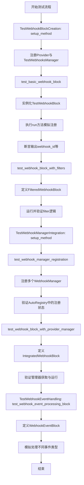
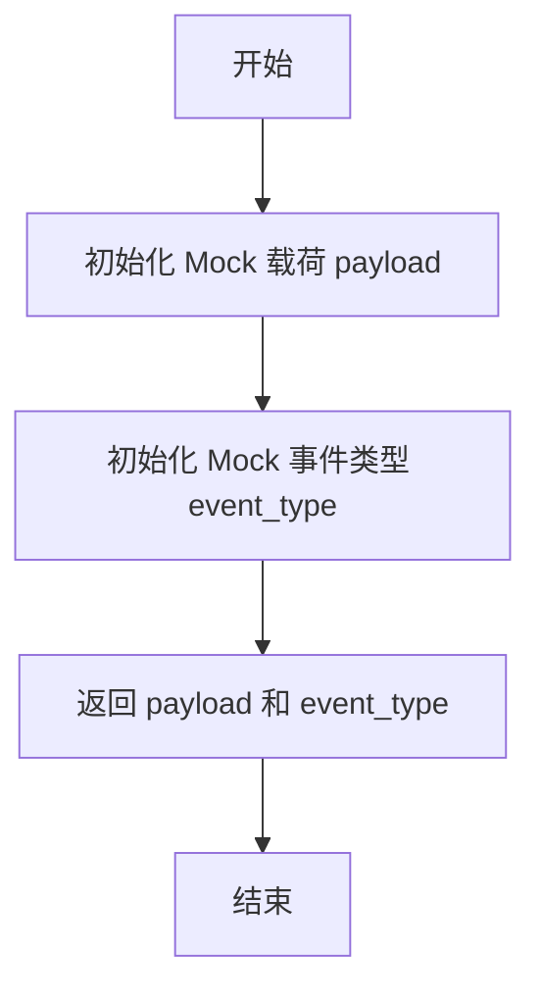
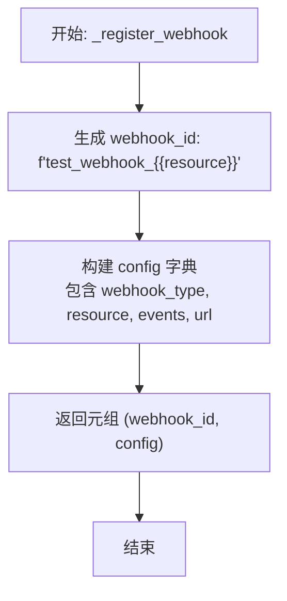
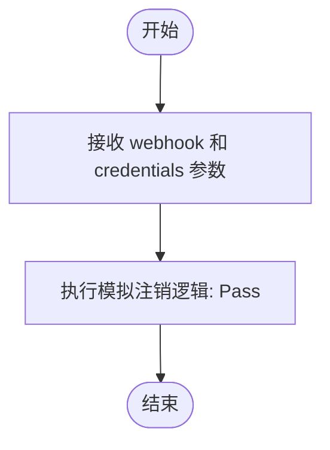
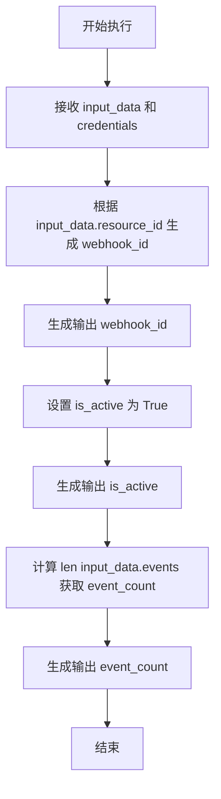
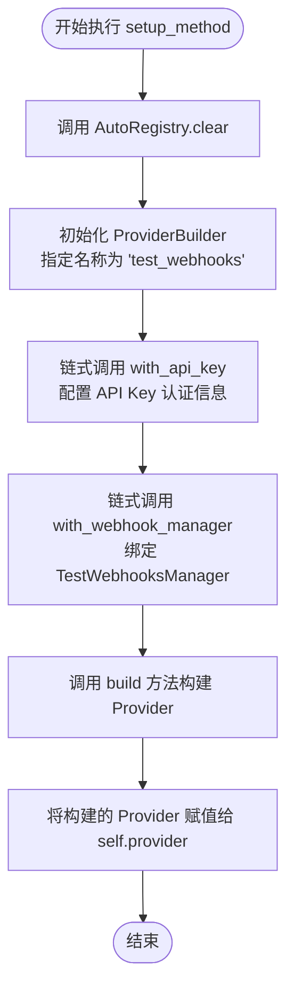
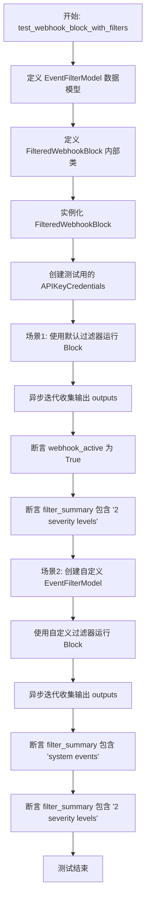
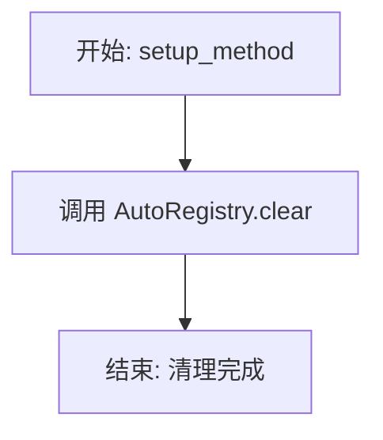
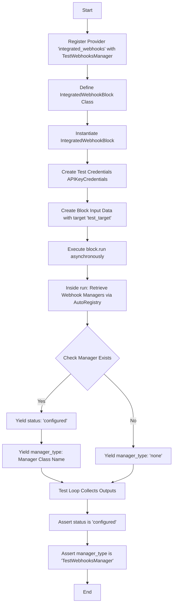
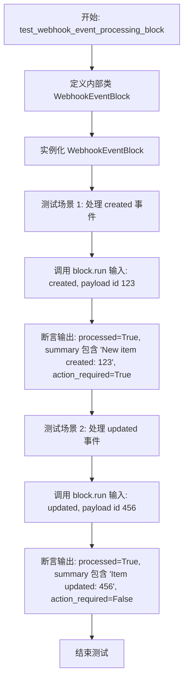

# `.\AutoGPT\autogpt_platform\backend\test\sdk\test_sdk_webhooks.py` 详细设计文档

该文件包含针对 SDK webhook 功能的单元测试套件，覆盖了 webhook 管理器的模拟实现、webhook 块的创建与执行、过滤逻辑测试、以及 webhook 管理器与自动注册系统的集成验证。

## 整体流程



## 类结构

```
Enum
└── TestWebhookTypes

BaseWebhooksManager (External)
└── TestWebhooksManager
    └── WebhookType

Block (External)
└── TestWebhookBlock
    ├── Input
    └── Output

BaseModel (External)
└── EventFilterModel (in TestWebhookBlockCreation)

Test Classes (Pytest)
├── TestWebhookBlockCreation
├── TestWebhookManagerIntegration
└── TestWebhookEventHandling
```

## 全局变量及字段


### `TestWebhookTypes.CREATED`
    
表示资源已创建事件的枚举值，值为 'created'。

类型：`str`
    


### `TestWebhookTypes.UPDATED`
    
表示资源已更新事件的枚举值，值为 'updated'。

类型：`str`
    


### `TestWebhookTypes.DELETED`
    
表示资源已删除事件的枚举值，值为 'deleted'。

类型：`str`
    


### `TestWebhooksManager.PROVIDER_NAME`
    
指定 Webhook 管理器关联的提供程序名称，此处设为 GITHUB 以便复用测试。

类型：`ProviderName`
    


### `TestWebhooksManager.WebhookType`
    
定义测试用例中特定的 Webhook 类型的内部枚举类。

类型：`Enum`
    


### `TestWebhookBlock.Input`
    
定义测试 Webhook Block 所需的输入参数架构。

类型：`BlockSchemaInput`
    


### `TestWebhookBlock.Output`
    
定义测试 Webhook Block 执行后返回的输出结果架构。

类型：`BlockSchemaOutput`
    


### `TestWebhookBlockCreation.EventFilterModel`
    
用于在测试用例中定义和验证 Webhook 事件过滤条件的 Pydantic 模型。

类型：`BaseModel`
    


### `TestWebhookBlockCreation.provider`
    
在测试环境设置中构建并存储的提供程序实例，用于注册 Webhook 支持。

类型：`Provider`
    
    

## 全局函数及方法


### `TestWebhooksManager.validate_payload`

验证传入的 Webhook 载荷（Mock 实现）。

参数：

- `webhook`：`Any`，Webhook 配置对象或相关上下文信息（具体类型取决于基类定义，此处未显式标注）。
- `request`：`Any`，传入的 HTTP 请求对象，包含原始载荷数据（具体类型取决于基类定义，此处未显式标注）。
- `credentials`：`Credentials | None`，用于验证请求身份的凭证对象，默认为 None。

返回值：`tuple[dict, str]`，返回一个元组，包含解析后的载荷字典和事件类型字符串。

#### 流程图



#### 带注释源码

```python
    @classmethod
    async def validate_payload(
        cls, webhook, request, credentials: Credentials | None = None
    ):
        """Validate incoming webhook payload."""
        # Mock implementation: 模拟载荷数据，实际场景中通常会解析 request.body
        payload = {"test": "data"}
        
        # Mock implementation: 模拟事件类型，实际场景中通常从 headers 或 payload 中解析
        event_type = "test_event"
        
        # 返回解析后的载荷和事件类型
        return payload, event_type
```


### `TestWebhooksManager._register_webhook`

这是一个用于向外部服务注册 webhook 的异步方法（模拟实现）。它根据提供的资源信息生成一个 webhook ID，并构建包含配置详情的字典。

参数：

- `credentials`：`Credentials`，用于认证和授权的凭证对象。
- `webhook_type`：`str`，指定要注册的 webhook 类型。
- `resource`：`str`，指定 webhook 关联的资源标识符。
- `events`：`list[str]`，指定需要监听的事件列表。
- `ingress_url`：`str`，指定接收 webhook 请求的入口 URL。
- `secret`：`str`，用于验证 webhook 安全性的密钥。

返回值：`tuple[str, dict]`，返回一个元组，包含生成的 webhook ID（字符串）和包含配置信息的字典。

#### 流程图



#### 带注释源码

```python
async def _register_webhook(
    self,
    credentials,
    webhook_type: str,
    resource: str,
    events: list[str],
    ingress_url: str,
    secret: str,
) -> tuple[str, dict]:
    """Register webhook with external service."""
    # Mock implementation
    # 根据资源生成一个模拟的 webhook ID
    webhook_id = f"test_webhook_{resource}"
    
    # 构建包含 webhook 配置详情的字典
    config = {
        "webhook_type": webhook_type,
        "resource": resource,
        "events": events,
        "url": ingress_url,
    }
    # 返回 webhook ID 和配置字典
    return webhook_id, config
```


### `TestWebhooksManager._deregister_webhook`

模拟从外部服务注销 Webhook 的方法。这是一个用于测试环境的异步方法，当前实现为空，仅作为接口占位符。

参数：

-  `self`：`TestWebhooksManager`，类实例本身
-  `webhook`：`Any`，待注销的 Webhook 对象或标识符（模拟参数，实际类型通常为包含 Webhook ID 的对象或字典）
-  `credentials`：`Credentials`，用于认证注销请求的凭据对象

返回值：`None`，无返回值。

#### 流程图



#### 带注释源码

```python
    async def _deregister_webhook(self, webhook, credentials) -> None:
        """Deregister webhook from external service."""
        # Mock implementation
        # 模拟实现：实际上并未执行任何注销操作，直接返回
        pass
```


### `TestWebhookBlock.__init__`

初始化测试 Webhook 区块，设置其元数据（ID、描述、分类）、输入输出模式以及 Webhook 配置对象。

参数：

-  `self`：`TestWebhookBlock`，类实例本身

返回值：`None`，构造函数不返回任何值

#### 流程图

```mermaid
flowchart TD
    A[开始初始化 TestWebhookBlock] --> B[调用父类 Block.__init__]
    B --> C[传入基础元数据<br/>id: 'test-webhook-block'<br/>description: 'Test webhook block'<br/>categories: {DEVELOPER_TOOLS}]
    B --> D[传入模式定义<br/>input_schema: TestWebhookBlock.Input<br/>output_schema: TestWebhookBlock.Output]
    B --> E[构建并传入 Webhook 配置<br/>BlockWebhookConfig<br/>provider: 'test_webhooks'<br/>webhook_type: 'test'<br/>resource_format: '{resource_id}']
    C & D & E --> F[完成初始化]
```

#### 带注释源码

```python
def __init__(self):
    # 调用父类 Block 的初始化方法
    super().__init__(
        # 定义区块的唯一标识符
        id="test-webhook-block",
        # 定义区块的描述文本
        description="Test webhook block",
        # 定义区块所属的分类，这里归类为开发者工具
        categories={BlockCategory.DEVELOPER_TOOLS},
        # 指定输入数据模式，使用内部定义的 Input 类
        input_schema=TestWebhookBlock.Input,
        # 指定输出数据模式，使用内部定义的 Output 类
        output_schema=TestWebhookBlock.Output,
        # 配置 Webhook 相关参数，指定提供商、类型和资源格式字符串
        webhook_config=BlockWebhookConfig(
            provider="test_webhooks",  # type: ignore
            webhook_type="test",
            resource_format="{resource_id}",
        ),
    )
```


### `TestWebhookBlock.run`

模拟 Webhook 块的执行过程。该方法根据输入的资源 ID 生成模拟的 Webhook ID，并根据输入事件列表计算事件数量，最后通过生成器返回这些状态信息。

参数：

-   `input_data`：`TestWebhookBlock.Input`，包含凭证、Webhook URL、资源 ID 和事件列表的输入数据结构。
-   `credentials`：`APIKeyCredentials`，用于身份验证的 API 凭证对象。
-   `**kwargs`：`dict`，额外的可选关键字参数。

返回值：`BlockOutput`，异步生成器，产生 Webhook 块的输出元组（名称，值）。

#### 流程图



#### 带注释源码

```python
async def run(
    self, input_data: Input, *, credentials: APIKeyCredentials, **kwargs
) -> BlockOutput:
    # 模拟 Webhook 注册过程：根据输入的 resource_id 生成唯一的 webhook_id
    webhook_id = f"webhook_{input_data.resource_id}"

    # 向输出流生成 webhook_id
    yield "webhook_id", webhook_id
    # 向输出流生成 is_active 状态，固定为 True 表示激活
    yield "is_active", True
    # 向输出流生成 event_count，计算输入事件列表的长度
    yield "event_count", len(input_data.events)
```


### `TestWebhookBlockCreation.setup_method`

该方法是 `TestWebhookBlockCreation` 测试类的初始化钩子，用于在每个测试用例执行前清理全局注册状态，并注册一个配置了 API Key 认证和 Webhook 管理器的测试 Provider，以确保测试环境的隔离性和准备就绪。

参数：

- `self`：`TestWebhookBlockCreation`，测试类的实例引用。

返回值：`None`，无显式返回值。

#### 流程图



#### 带注释源码

```python
    def setup_method(self):
        """Set up test environment."""
        # 清空自动注册表，确保测试环境不受之前测试状态的影响
        AutoRegistry.clear()

        # 注册一个支持 Webhook 功能的 Provider 用于测试
        self.provider = (
            ProviderBuilder("test_webhooks")  # 初始化构建器，指定 provider 名称为 "test_webhooks"
            .with_api_key("TEST_WEBHOOK_KEY", "Test Webhook API Key")  # 配置 API Key 类型的凭据支持
            .with_webhook_manager(TestWebhooksManager)  # 绑定自定义的 Webhook 管理器实现
            .build()  # 执行构建，生成 Provider 实例并赋值给实例变量
        )
```


### `TestWebhookBlockCreation.test_basic_webhook_block`

测试创建基本 Webhook 块的功能，验证其配置参数（如提供者、类型和资源格式）是否正确初始化，并模拟运行该块以检查其生成的输出（如 Webhook ID、激活状态和事件计数）是否符合预期。

参数：

- `self`: `TestWebhookBlockCreation`，测试类的实例，用于访问测试上下文或共享的设置方法。

返回值：`None`，该函数为测试方法，不返回具体数值，通过断言抛出异常来指示测试失败，否则表示测试通过。

#### 流程图

```mermaid
graph TD
    A[开始: test_basic_webhook_block] --> B[实例化 TestWebhookBlock]
    B --> C{验证 block.webhook_config 是否为 None}
    C -- 不为空 --> D[断言 provider == 'test_webhooks']
    D --> E[断言 webhook_type == 'test']
    E --> F[断言 resource_format 包含 '{resource_id}']
    F --> G[创建测试凭证 APIKeyCredentials]
    G --> H[构造输入数据 TestWebhookBlock.Input]
    H --> I[调用 block.run 开始异步执行]
    I --> J[异步遍历输出流]
    J --> K[收集输出至 outputs 字典]
    K --> L{遍历结束?}
    L -- 否 --> J
    L -- 是 --> M[断言 outputs['webhook_id'] == 'webhook_resource_123']
    M --> N[断言 outputs['is_active'] == True]
    N --> O[断言 outputs['event_count'] == 2]
    O --> P[结束: 测试通过]
```

#### 带注释源码

```python
@pytest.mark.asyncio
async def test_basic_webhook_block(self):
    """Test creating a basic webhook block."""
    # 1. 实例化被测试的 Block 类
    block = TestWebhookBlock()

    # 2. 验证块配置是否正确设置
    # 检查 webhook_config 是否存在
    assert block.webhook_config is not None
    # 检查 provider 配置是否匹配
    assert block.webhook_config.provider == "test_webhooks"
    # 检查 webhook 类型是否匹配
    assert block.webhook_config.webhook_type == "test"
    # 检查资源格式字符串是否包含必要的占位符
    assert "{resource_id}" in block.webhook_config.resource_format  # type: ignore

    # 3. 准备测试凭证
    test_creds = APIKeyCredentials(
        id="test-webhook-creds",
        provider="test_webhooks",
        api_key=SecretStr("test-key"),
        title="Test Webhook Key",
    )

    # 4. 准备输入数据，模拟外部传入的参数
    # 使用 Input 模型构建数据，包含凭证元信息、URL、资源ID和事件列表
    outputs = {}
    async for name, value in block.run(
        TestWebhookBlock.Input(
            credentials={  # type: ignore
                "provider": "test_webhooks",
                "id": "test-webhook-creds",
                "type": "api_key",
            },
            webhook_url="https://example.com/webhook",
            resource_id="resource_123",
            events=[TestWebhookTypes.CREATED, TestWebhookTypes.UPDATED],
        ),
        credentials=test_creds,
    ):
        # 5. 收集运行时产生的输出
        outputs[name] = value

    # 6. 验证运行结果是否符合预期
    # 检查生成的 webhook_id 格式
    assert outputs["webhook_id"] == "webhook_resource_123"
    # 检查激活状态
    assert outputs["is_active"] is True
    # 检查事件计数 (传入了2个事件)
    assert outputs["event_count"] == 2
```


### `TestWebhookBlockCreation.test_webhook_block_with_filters`

测试带有事件过滤器的 Webhook 块的功能，验证在使用默认过滤器和自定义过滤器配置时，块能正确解析输入并生成预期的输出摘要。

参数：

-  `self`：`TestWebhookBlockCreation`，测试类的实例，用于访问测试上下文和共享设置。

返回值：`None`，该方法是一个异步测试用例，不直接返回数值，而是通过断言验证逻辑的正确性。

#### 流程图



#### 带注释源码

```python
    @pytest.mark.asyncio
    async def test_webhook_block_with_filters(self):
        """Test webhook block with event filters."""

        # 1. 定义一个用于过滤的数据模型，包含系统事件开关和严重性级别列表
        class EventFilterModel(BaseModel):
            include_system: bool = Field(default=False)
            severity_levels: list[str] = Field(
                default_factory=lambda: ["info", "warning"]
            )

        # 2. 定义具体的 Webhook Block 实现，包含过滤逻辑
        class FilteredWebhookBlock(Block):
            """Webhook block with filtering."""

            class Input(BlockSchemaInput):
                credentials: CredentialsMetaInput = CredentialsField(
                    provider="test_webhooks",
                    supported_credential_types={"api_key"},
                )
                resource: str = SchemaField(description="Resource to monitor")
                filters: EventFilterModel = SchemaField(
                    description="Event filters",
                    default_factory=EventFilterModel,
                )
                payload: dict = SchemaField(
                    description="Webhook payload",
                    default={},
                )

            class Output(BlockSchemaOutput):
                webhook_active: bool = SchemaField(description="Webhook active")
                filter_summary: str = SchemaField(description="Active filters")

            def __init__(self):
                super().__init__(
                    id="filtered-webhook-block",
                    description="Webhook with filters",
                    categories={BlockCategory.DEVELOPER_TOOLS},
                    input_schema=FilteredWebhookBlock.Input,
                    output_schema=FilteredWebhookBlock.Output,
                    webhook_config=BlockWebhookConfig(
                        provider="test_webhooks",  # type: ignore
                        webhook_type="filtered",
                        resource_format="{resource}",
                    ),
                )

            # 3. 实现运行逻辑，解析过滤器并生成摘要字符串
            async def run(self, input_data: Input, **kwargs) -> BlockOutput:
                filters = input_data.filters
                filter_parts = []

                # 检查是否包含系统事件
                if filters.include_system:
                    filter_parts.append("system events")

                # 添加严重性级别数量信息
                filter_parts.append(f"{len(filters.severity_levels)} severity levels")

                yield "webhook_active", True
                yield "filter_summary", ", ".join(filter_parts)

        # Test the block
        block = FilteredWebhookBlock()

        # 4. 准备测试凭据
        test_creds = APIKeyCredentials(
            id="test-creds",
            provider="test_webhooks",
            api_key=SecretStr("key"),
            title="Test Key",
        )

        # 5. 测试用例 A：使用默认过滤器运行
        outputs = {}
        async for name, value in block.run(
            FilteredWebhookBlock.Input(
                credentials={  # type: ignore
                    "provider": "test_webhooks",
                    "id": "test-creds",
                    "type": "api_key",
                },
                resource="test_resource",
                # 注意：未显式传递 filters，将使用默认值
            ),
            credentials=test_creds,
        ):
            outputs[name] = value

        # 6. 断言默认情况下的输出结果
        assert outputs["webhook_active"] is True
        assert "2 severity levels" in outputs["filter_summary"]  # 默认是 info 和 warning

        # 7. 测试用例 B：使用自定义过滤器运行
        custom_filters = EventFilterModel(
            include_system=True,
            severity_levels=["error", "critical"],
        )

        outputs = {}
        async for name, value in block.run(
            FilteredWebhookBlock.Input(
                credentials={  # type: ignore
                    "provider": "test_webhooks",
                    "id": "test-creds",
                    "type": "api_key",
                },
                resource="test_resource",
                filters=custom_filters,  # 传入自定义对象
            ),
            credentials=test_creds,
        ):
            outputs[name] = value

        # 8. 断言自定义过滤器情况下的输出结果
        assert "system events" in outputs["filter_summary"]
        assert "2 severity levels" in outputs["filter_summary"]
```


### `TestWebhookManagerIntegration.setup_method`

该方法是测试类 `TestWebhookManagerIntegration` 的初始化钩子，用于在每个测试方法执行前清理 `AutoRegistry` 中的注册信息，以确保测试环境的隔离性。

参数：

-   `self`：`TestWebhookManagerIntegration`，测试类的实例对象。

返回值：`None`，该方法没有返回值。

#### 流程图



#### 带注释源码

```python
def setup_method(self):
    """Clear registry."""
    # 调用全局注册表的清除方法，清空之前注册的 Providers 或 Webhook Managers
    # 以防止测试之间的状态污染，确保每个测试在干净的环境中运行
    AutoRegistry.clear()
```


### `TestWebhookManagerIntegration.test_webhook_manager_registration`

该方法旨在验证 `AutoRegistry` 能够正确处理多个提供者的注册过程，并确保每个提供者关联的 Webhook 管理器类被准确存储在注册表中。测试通过模拟不同提供者的构建过程，检查最终注册表中键值对的正确性。

参数：

-  `self`：`TestWebhookManagerIntegration`，测试类实例，用于访问测试环境设置和断言方法。

返回值：`None`，该函数没有显式返回值，主要通过 pytest 的断言机制来验证注册逻辑是否符合预期。

#### 流程图

```mermaid
graph TD
    A[开始测试] --> B[定义内部类 WebhookManager1];
    B --> C[定义内部类 WebhookManager2];
    C --> D[构建并注册 Provider 'webhook_service_1' <br/> 关联 WebhookManager1];
    D --> E[构建并注册 Provider 'webhook_service_2' <br/> 关联 WebhookManager2];
    E --> F[从 AutoRegistry 获取所有 Webhook 管理器];
    F --> G{断言 'webhook_service_1' <br/> 是否存在于 managers 中};
    G -- 否 --> H[抛出断言错误];
    G -- 是 --> I{断言 'webhook_service_2' <br/> 是否存在于 managers 中};
    I -- 否 --> H;
    I -- 是 --> J{断言 managers['webhook_service_1'] <br/> 是否等于 WebhookManager1};
    J -- 否 --> H;
    J -- 是 --> K{断言 managers['webhook_service_2'] <br/> 是否等于 WebhookManager2};
    K -- 否 --> H;
    K -- 是 --> L[测试通过];
```

#### 带注释源码

```python
    def test_webhook_manager_registration(self):
        """Test that webhook managers are properly registered."""

        # 步骤 1: 模拟定义第一个 Webhook 管理器类，指定其 PROVIDER_NAME 为 GITHUB
        class WebhookManager1(BaseWebhooksManager):
            PROVIDER_NAME = ProviderName.GITHUB

        # 步骤 2: 模拟定义第二个 Webhook 管理器类，指定其 PROVIDER_NAME 为 GOOGLE
        class WebhookManager2(BaseWebhooksManager):
            PROVIDER_NAME = ProviderName.GOOGLE

        # 步骤 3: 使用 ProviderBuilder 构建第一个提供者服务，
        # 并通过 .with_webhook_manager() 关联 WebhookManager1，最后调用 .build() 完成注册
        (
            ProviderBuilder("webhook_service_1")
            .with_webhook_manager(WebhookManager1)
            .build()
        )

        # 步骤 4: 使用 ProviderBuilder 构建第二个提供者服务，
        # 并通过 .with_webhook_manager() 关联 WebhookManager2，最后调用 .build() 完成注册
        (
            ProviderBuilder("webhook_service_2")
            .with_webhook_manager(WebhookManager2)
            .build()
        )

        # 步骤 5: 从 AutoRegistry 获取所有已注册的 webhook 管理器字典
        managers = AutoRegistry.get_webhook_managers()

        # 步骤 6: 验证 'webhook_service_1' 键是否存在
        assert "webhook_service_1" in managers
        # 步骤 7: 验证 'webhook_service_2' 键是否存在
        assert "webhook_service_2" in managers
        
        # 步骤 8: 验证注册的类对象是否正确引用了之前定义的类
        assert managers["webhook_service_1"] == WebhookManager1
        assert managers["webhook_service_2"] == WebhookManager2
```


### `TestWebhookManagerIntegration.test_webhook_block_with_provider_manager`

该函数是一个异步测试方法，旨在验证 Webhook Block 能否正确通过 `AutoRegistry` 获取并使用其所属 Provider 注册的 Webhook Manager。测试流程包括注册一个带有 Webhook Manager 的 Provider，定义并初始化一个使用该 Provider 的 Block，模拟 Block 运行时获取 Manager 的逻辑，并断言输出结果符合预期。

参数：

-  `self`：`TestWebhookManagerIntegration`，测试类的实例，用于访问测试上下文和共享状态。

返回值：`None`，该函数为测试方法，无显式返回值，主要通过断言验证逻辑正确性。

#### 流程图



#### 带注释源码

```python
@pytest.mark.asyncio
async def test_webhook_block_with_provider_manager(self):
    """Test webhook block using a provider's webhook manager."""
    # 注册一个名为 'integrated_webhooks' 的 Provider
    # 该 Provider 配置了 API Key 认证，并绑定了 TestWebhooksManager 作为其 Webhook 管理器
    (
        ProviderBuilder("integrated_webhooks")
        .with_api_key("INTEGRATED_KEY", "Integrated Webhook Key")
        .with_webhook_manager(TestWebhooksManager)
        .build()
    )

    # 定义一个内部类 IntegratedWebhookBlock，继承自 Block
    # 该 Block 模拟使用已注册的 Provider 和 Webhook Manager
    class IntegratedWebhookBlock(Block):
        """Block using integrated webhook manager."""

        class Input(BlockSchemaInput):
            # 定义凭证输入字段，指定 provider 为 'integrated_webhooks'
            credentials: CredentialsMetaInput = CredentialsField(
                provider="integrated_webhooks",
                supported_credential_types={"api_key"},
            )
            target: str = SchemaField(description="Webhook target")
            payload: dict = SchemaField(
                description="Webhook payload",
                default={},
            )

        class Output(BlockSchemaOutput):
            status: str = SchemaField(description="Webhook status")
            manager_type: str = SchemaField(description="Manager type used")

        def __init__(self):
            # 初始化 Block，配置 ID、描述、分类、输入输出 Schema
            # 关键是配置 webhook_config，指定 provider 和 webhook_type
            super().__init__(
                id="integrated-webhook-block",
                description="Uses integrated webhook manager",
                categories={BlockCategory.DEVELOPER_TOOLS},
                input_schema=IntegratedWebhookBlock.Input,
                output_schema=IntegratedWebhookBlock.Output,
                webhook_config=BlockWebhookConfig(
                    provider="integrated_webhooks",  # type: ignore
                    webhook_type=TestWebhooksManager.WebhookType.TEST,
                    resource_format="{target}",
                ),
            )

        async def run(self, input_data: Input, **kwargs) -> BlockOutput:
            # 核心逻辑：从全局注册表 AutoRegistry 获取所有注册的 Webhook Managers
            managers = AutoRegistry.get_webhook_managers()
            # 根据当前 Block 使用的 provider 名称获取对应的 Manager 类
            manager_class = managers.get("integrated_webhooks")

            yield "status", "configured"
            # 如果找到了 Manager，输出其类名，否则输出 "none"
            yield "manager_type", (
                manager_class.__name__ if manager_class else "none"
            )

    # 测试逻辑开始：实例化刚才定义的 Block
    block = IntegratedWebhookBlock()

    # 创建测试用的凭证对象
    test_creds = APIKeyCredentials(
        id="integrated-creds",
        provider="integrated_webhooks",
        api_key=SecretStr("key"),
        title="Integrated Key",
    )

    # 准备输入数据
    outputs = {}
    # 异步执行 Block 的 run 方法，传入输入数据和凭证
    async for name, value in block.run(
        IntegratedWebhookBlock.Input(
            credentials={  # type: ignore
                "provider": "integrated_webhooks",
                "id": "integrated-creds",
                "type": "api_key",
            },
            target="test_target",
        ),
        credentials=test_creds,
    ):
        outputs[name] = value

    # 断言验证：检查状态是否为 'configured'
    assert outputs["status"] == "configured"
    # 断言验证：检查是否正确获取到了 TestWebhooksManager
    assert outputs["manager_type"] == "TestWebhooksManager"
```


### `TestWebhookEventHandling.test_webhook_event_processing_block`

该方法是一个异步测试用例，用于验证 webhook 事件处理 block 的正确性。它在内部定义了一个 `WebhookEventBlock` 类，模拟根据不同的事件类型（如 "created", "updated"）和 payload 处理逻辑并生成输出。测试实例化该 block 并分别传入 "created" 和 "updated" 事件，断言生成的 `processed` 状态、`event_summary` 描述以及 `action_required` 标志是否符合预期。

参数：

- `self`：`TestWebhookEventHandling`，测试类的实例，用于访问测试上下文和 pytest 的 fixtures。

返回值：`None`，该方法不返回值，主要通过 pytest 的断言语句来验证测试结果。

#### 流程图



#### 带注释源码

```python
    @pytest.mark.asyncio
    async def test_webhook_event_processing_block(self):
        """Test a block that processes webhook events."""

        # 定义一个用于处理 Webhook 事件的 Block 类
        class WebhookEventBlock(Block):
            """Block that processes webhook events."""

            class Input(BlockSchemaInput):
                event_type: str = SchemaField(description="Type of webhook event")
                payload: dict = SchemaField(description="Webhook payload")
                verify_signature: bool = SchemaField(
                    description="Whether to verify webhook signature",
                    default=True,
                )

            class Output(BlockSchemaOutput):
                processed: bool = SchemaField(description="Event was processed")
                event_summary: str = SchemaField(description="Summary of event")
                action_required: bool = SchemaField(description="Action required")

            def __init__(self):
                super().__init__(
                    id="webhook-event-processor",
                    description="Processes incoming webhook events",
                    categories={BlockCategory.DEVELOPER_TOOLS},
                    input_schema=WebhookEventBlock.Input,
                    output_schema=WebhookEventBlock.Output,
                )

            # 核心运行逻辑：根据事件类型生成不同的输出
            async def run(self, input_data: Input, **kwargs) -> BlockOutput:
                # Process based on event type
                event_type = input_data.event_type
                payload = input_data.payload

                if event_type == "created":
                    summary = f"New item created: {payload.get('id', 'unknown')}"
                    action_required = True
                elif event_type == "updated":
                    summary = f"Item updated: {payload.get('id', 'unknown')}"
                    action_required = False
                elif event_type == "deleted":
                    summary = f"Item deleted: {payload.get('id', 'unknown')}"
                    action_required = True
                else:
                    summary = f"Unknown event: {event_type}"
                    action_required = False

                yield "processed", True
                yield "event_summary", summary
                yield "action_required", action_required

        # Test the block with different events
        block = WebhookEventBlock()

        # Test created event
        outputs = {}
        # 运行 Block 并收集输出，传入 created 类型的测试数据
        async for name, value in block.run(
            WebhookEventBlock.Input(
                event_type="created",
                payload={"id": "123", "name": "Test Item"},
            )
        ):
            outputs[name] = value

        # 验证 'created' 事件的输出是否符合预期
        assert outputs["processed"] is True
        assert "New item created: 123" in outputs["event_summary"]
        assert outputs["action_required"] is True

        # Test updated event
        outputs = {}
        # 运行 Block 并收集输出，传入 updated 类型的测试数据
        async for name, value in block.run(
            WebhookEventBlock.Input(
                event_type="updated",
                payload={"id": "456", "changes": ["name", "status"]},
            )
        ):
            outputs[name] = value

        # 验证 'updated' 事件的输出是否符合预期
        assert outputs["processed"] is True
        assert "Item updated: 456" in outputs["event_summary"]
        assert outputs["action_required"] is False
```


## 关键组件


### Webhook 管理器
实现外部服务的 Webhook 注册、注销及负载验证逻辑，作为 SDK 与第三方服务交互的模拟接口。

### Webhook 块定义
定义具备输入输出模式的执行单元，封装凭证配置、资源监控、事件监听及过滤器逻辑，实现 Webhook 的配置与运行。

### 提供者注册与自动发现
通过 `AutoRegistry` 将 Webhook 管理器绑定至特定提供者，实现管理器的动态注册、检索与运行时集成。

### 事件处理与过滤
根据事件类型（如创建、更新、删除）和自定义过滤器（如严重性级别）对 Webhook 负载进行解析、分类与响应的逻辑。


## 问题及建议


### 已知问题

-   **测试类中硬编码生产环境 Provider 名称**：`TestWebhooksManager` 中使用了 `ProviderName.GITHUB`，`TestWebhookManagerIntegration` 中使用了 `ProviderName.GOOGLE`。测试代码不应强依赖特定的生产环境枚举值，这可能导致测试受生产代码变更影响或产生意外的副作用。
-   **代码结构混乱与可读性差**：多个 `Block` 类（如 `FilteredWebhookBlock`, `IntegratedWebhookBlock`）定义在测试方法内部。这种内联类的写法虽然 Python 语法允许，但严重降低了代码的可读性、可维护性，且不利于 IDE 进行符号索引和重构。
-   **Mock 实现缺乏逻辑验证**：`TestWebhooksManager` 中的方法（如 `_deregister_webhook`）仅通过 `pass` 或硬编码返回值进行模拟。测试代码仅验证了 Block 的最终输出，并未验证 Manager 的关键方法（如注册、注销）是否被正确调用或参数是否正确，存在测试覆盖盲区。
-   **测试逻辑重复冗余**：在 `test_webhook_event_processing_block` 中，针对 "created"、"updated"、"deleted" 三种事件的测试逻辑是手动重复编写的，导致代码冗余且难以扩展。

### 优化建议

-   **提取测试类或使用 Fixture**：将定义在测试方法内部的 `Block` 类（如 `WebhookEventBlock`）提取到文件顶层，或利用 Pytest 的 `fixture` 功能进行管理。这能显著提高代码复用率，并使测试用例更专注于测试逻辑而非定义逻辑。
-   **采用参数化测试（Parametrize）**：针对 `test_webhook_event_processing_block` 中测试不同事件类型的场景，建议使用 `@pytest.mark.parametrize` 装饰器。将输入事件类型、预期 Payload 和预期结果作为参数传入，从而消除重复代码，使测试更加简洁。
-   **引入 Mock 框架进行交互验证**：建议使用 `unittest.mock` 库（如 `AsyncMock`）替代硬编码的 Mock 类。通过 Mock 对象验证 `validate_payload`、`_register_webhook` 等方法的调用次数及参数，以确保 Block 与 WebhooksManager 之间的集成逻辑符合预期。
-   **使用常量管理魔法值**：将代码中散落的字符串字面量（如 "test_webhooks"、"test-webhook-block" 等）提取为模块级常量，便于统一管理和后期修改。
-   **优化事件处理分支结构**：尽管是测试代码，但 `WebhookEventBlock.run` 中使用的长 `if-elif-else` 链在事件类型增加时将难以维护。建议在实际生产代码参考中使用策略模式或字典映射来重构该逻辑，测试代码应相应调整以覆盖这种结构。


## 其它


### 设计目标与约束

**设计目标：**
该测试套件的核心设计目标是全面验证 SDK 中 Webhook 功能的正确性与集成性。具体包括：
1.  **功能验证**：确保 `Block` 类能够正确配置和执行 Webhook 相关逻辑，包括注册、注销和负载验证。
2.  **集成测试**：验证 `AutoRegistry` 能够正确注册和检索 `Provider` 与 `WebhooksManager` 之间的映射关系。
3.  **扩展性验证**：测试 SDK 是否支持复杂场景，如事件过滤（`EventFilterModel`）、动态负载处理以及多种 Webhook 事件类型的枚举。

**约束：**
1.  **环境隔离**：测试之间必须保持状态隔离，通过 `setup_method` 中调用 `AutoRegistry.clear()` 来防止全局注册表状态污染。
2.  **异步执行**：由于 SDK 的 `Block.run` 和 `WebhooksManager` 方法涉及异步 I/O（模拟网络请求），所有测试方法必须使用 `pytest.mark.asyncio` 并遵循异步编程模式。
3.  **无外部依赖**：为了测试的稳定性和速度，所有对外部服务（如 GitHub API）的调用必须被 Mock（模拟）化，不得进行真实的网络请求。

### 错误处理与异常设计

**测试层面的错误处理：**
1.  **断言机制**：利用 `pytest` 的 `assert` 语句作为主要的错误检测手段。例如，验证 `webhook_config` 是否配置正确，以及输出结果是否符合预期。
2.  **输入验证模拟**：在 `TestWebhooksManager` 中，`validate_payload` 方法被设计为始终返回有效的 Mock 数据。在实际生产代码设计中，此处应包含对签名无效或负载格式错误的异常抛出，而测试代码目前覆盖的是“成功验证”路径。

**代码层面的防御性设计：**
1.  **默认值处理**：在 `TestWebhookBlock.Input` 中，`payload` 和 `events` 字段设置了默认值（`default={}`, `default=[...]`），防止因输入缺失导致的 `TypeError`。
2.  **可选凭证处理**：`validate_payload` 方法签名中包含 `credentials: Credentials | None = None`，表明逻辑设计上支持无凭证的 Webhook 验证场景（尽管本测试中未深入覆盖异常情况）。

### 数据流与状态机

**数据流：**
1.  **注册阶段**：
    *   测试初始化 (`setup_method`) -> `ProviderBuilder` 构建配置 -> 调用 `build()` -> 数据写入全局 `AutoRegistry`。
2.  **执行阶段**：
    *   实例化 `Block` -> 调用 `block.run(input_data)` -> Block 内部逻辑处理 -> 通过 `yield` 生成器模式输出 `BlockOutput` 数据流。
    *   对于 Webhook 管理器：外部请求 -> `TestWebhooksManager.validate_payload` -> 返回解析后的 Payload。

**状态机：**
*   **AutoRegistry 状态**：全局单例状态，存储 Provider 到 Manager 的映射。状态在 `setup_method` 时重置（Empty），在 `ProviderBuilder().build()` 后更新（Filled）。
*   **Webhook 生命周期状态**（隐含）：
    *   *Configured*: Block 实例化并配置了 `webhook_config`。
    *   *Active*: `run` 方法执行后，输出 `is_active: True`。

### 外部依赖与接口契约

**外部依赖：**
1.  **测试框架**：`pytest`，用于测试发现、运行和断言。
2.  **内部 SDK 模块**：
    *   `backend.sdk`: 提供核心基类 `Block`, `BaseWebhooksManager`, `BaseModel`, `Credentials`, `AutoRegistry` 等。
    *   `backend.integrations.providers`: 提供枚举类型 `ProviderName`。

**接口契约：**
1.  **Block 接口**：
    *   必须定义嵌套类 `Input` 和 `Output`，继承自 `BlockSchemaInput` 和 `BlockSchemaOutput`。
    *   必须实现 `async def run(self, input_data: Input, *, credentials: APIKeyCredentials, **kwargs) -> BlockOutput` 方法，该方法必须是一个异步生成器。
2.  **WebhooksManager 接口**：
    *   必须继承 `BaseWebhooksManager`。
    *   必须实现类方法 `async def validate_payload(...)` 用于校验输入。
    *   必须实现实例方法 `async def _register_webhook(...)` 和 `async def _deregister_webhook(...)` 用于生命周期管理。
    *   必须定义类属性 `PROVIDER_NAME` 用于标识所属服务提供商。

    