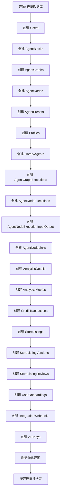
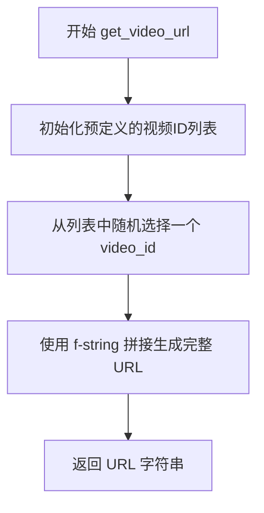
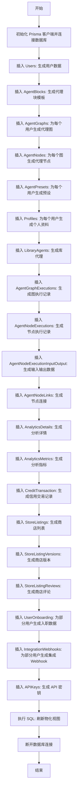
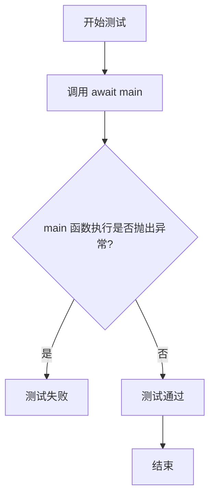

# `.\AutoGPT\autogpt_platform\backend\test\test_data_creator.py` 详细设计文档

该脚本是一个用于生成AutoGPT平台数据库测试数据的异步工具，利用Prisma ORM和Faker库批量创建用户、智能体、图表、执行记录、商店列表及评论等模拟实体，旨在为开发和测试环境提供大规模的逼真数据。

## 整体流程



## 类结构

```
N/A (无自定义类定义)
```

## 全局变量及字段


### `NUM_USERS`
    
定义脚本生成的用户记录总数

类型：`int`
    


### `NUM_AGENT_BLOCKS`
    
定义脚本生成的代理块模板总数

类型：`int`
    


### `MIN_GRAPHS_PER_USER`
    
定义每个用户关联的最小代理图数量

类型：`int`
    


### `MAX_GRAPHS_PER_USER`
    
定义每个用户关联的最大代理图数量

类型：`int`
    


### `MIN_NODES_PER_GRAPH`
    
定义每个代理图包含的最小节点数量

类型：`int`
    


### `MAX_NODES_PER_GRAPH`
    
定义每个代理图包含的最大节点数量

类型：`int`
    


### `MIN_PRESETS_PER_USER`
    
定义每个用户拥有的最小代理预设数量

类型：`int`
    


### `MAX_PRESETS_PER_USER`
    
定义每个用户拥有的最大代理预设数量

类型：`int`
    


### `MIN_AGENTS_PER_USER`
    
定义每个用户拥有的最小库代理数量

类型：`int`
    


### `MAX_AGENTS_PER_USER`
    
定义每个用户拥有的最大库代理数量

类型：`int`
    


### `MIN_EXECUTIONS_PER_GRAPH`
    
定义每个代理图执行记录的最小数量

类型：`int`
    


### `MAX_EXECUTIONS_PER_GRAPH`
    
定义每个代理图执行记录的最大数量

类型：`int`
    


### `MIN_REVIEWS_PER_VERSION`
    
定义每个商店列表版本的最小评论数量

类型：`int`
    


### `MAX_REVIEWS_PER_VERSION`
    
定义每个商店列表版本的最大评论数量

类型：`int`
    


### `faker`
    
Faker 库的实例，用于生成随机测试数据（姓名、邮箱、UUID等）

类型：`Faker`
    


    

## 全局函数及方法


### `get_image`

Generate a consistent image URL using picsum.photos service.

参数：

-  无

返回值：`str`，格式化的图片URL字符串，包含随机种子、宽度和高度。

#### 流程图

```mermaid
flowchart TD
    A[开始] --> B[从预设列表中随机选择宽度 width]
    B --> C[从预设列表中随机选择高度 height]
    C --> D[生成 1 到 1000 之间的随机整数作为种子 seed]
    D --> E[使用 f-string 格式化拼接 URL: https://picsum.photos/seed/{seed}/{width}/{height}]
    E --> F[返回 URL 字符串]
```

#### 带注释源码

```python
def get_image():
    """Generate a consistent image URL using picsum.photos service."""
    # 从预设的宽度列表中随机选择一个尺寸
    width = random.choice([200, 300, 400, 500, 600, 800])
    # 从预设的高度列表中随机选择一个尺寸
    height = random.choice([200, 300, 400, 500, 600, 800])
    # 生成一个 1 到 1000 之间的随机整数作为种子，用于获取不同的图片
    seed = random.randint(1, 1000)
    # 返回构造好的 Picsum 图片 URL
    return f"https://picsum.photos/seed/{seed}/{width}/{height}"
```


### `get_video_url`

该函数用于生成测试数据，通过从预定义的YouTube视频ID列表中随机选择一个，并拼接成标准的YouTube视频播放链接URL。

参数：

-  无

返回值：`str`，生成的YouTube视频完整URL字符串。

#### 流程图



#### 带注释源码

```python
def get_video_url():
    """Generate a consistent video URL using a placeholder service."""
    # 定义一个包含示例 YouTube 视频 ID 的列表
    video_ids = [
        "dQw4w9WgXcQ",  # 示例视频ID (Rick Astley - Never Gonna Give You Up)
        "9bZkp7q19f0",
        "kJQP7kiw5Fk",
        "RgKAFK5djSk",
        "L_jWHffIx5E",
    ]
    # 使用 random.choice 从列表中随机选取一个视频 ID
    video_id = random.choice(video_ids)
    # 返回格式化后的 YouTube 观看链接
    return f"https://www.youtube.com/watch?v={video_id}"
```


### `main`

该方法是脚本的核心入口，负责异步执行数据库测试数据的生成任务。它通过连接数据库，按照预定义的顺序和数量配置，批量创建并插入用户、代理图、节点、执行记录、分析指标、商店列表及相关评论等多种实体数据，最后刷新物化视图并断开连接，以完成整个测试环境的构建。

参数：

-   无

返回值：`None`，无返回值。

#### 流程图



#### 带注释源码

```python
async def main():
    # 初始化数据库连接
    db = Prisma()
    await db.connect()

    # ==================== 用户与基础实体 ====================
    
    # 插入 Users
    # 创建 NUM_USERS (100) 个模拟用户
    print(f"Inserting {NUM_USERS} users")
    users = []
    for _ in range(NUM_USERS):
        user = await db.user.create(
            data=UserCreateInput(
                id=str(faker.uuid4()),
                email=faker.unique.email(),
                name=faker.name(),
                metadata=prisma.Json({}),
                integrations="",
            )
        )
        users.append(user)

    # 插入 AgentBlocks
    # 创建 NUM_AGENT_BLOCKS (100) 个模拟代理块
    agent_blocks = []
    print(f"Inserting {NUM_AGENT_BLOCKS} agent blocks")
    for _ in range(NUM_AGENT_BLOCKS):
        block = await db.agentblock.create(
            data=AgentBlockCreateInput(
                name=f"{faker.word()}_{str(faker.uuid4())[:8]}",
                inputSchema="{}",
                outputSchema="{}",
            )
        )
        agent_blocks.append(block)

    # ==================== 代理图与节点 ====================

    # 插入 AgentGraphs
    # 每个用户随机创建 MIN_GRAPHS_PER_USER 到 MAX_GRAPHS_PER_USER 个图
    agent_graphs = []
    print(f"Inserting {NUM_USERS * MAX_GRAPHS_PER_USER} agent graphs")
    for user in users:
        for _ in range(
            random.randint(MIN_GRAPHS_PER_USER, MAX_GRAPHS_PER_USER)
        ):
            graph = await db.agentgraph.create(
                data=AgentGraphCreateInput(
                    name=faker.sentence(nb_words=3),
                    description=faker.text(max_nb_chars=200),
                    userId=user.id,
                    isActive=True,
                )
            )
            agent_graphs.append(graph)

    # 插入 AgentNodes
    # 每个图随机创建 MIN_NODES_PER_GRAPH 到 MAX_NODES_PER_GRAPH 个节点
    agent_nodes = []
    print(
        f"Inserting {NUM_USERS * MAX_GRAPHS_PER_USER * MAX_NODES_PER_GRAPH} agent nodes"
    )
    for graph in agent_graphs:
        num_nodes = random.randint(MIN_NODES_PER_GRAPH, MAX_NODES_PER_GRAPH)
        for _ in range(num_nodes):
            block = random.choice(agent_blocks)
            node = await db.agentnode.create(
                data=AgentNodeCreateInput(
                    agentBlockId=block.id,
                    agentGraphId=graph.id,
                    agentGraphVersion=graph.version,
                    constantInput=Json({}),
                    metadata=Json({}),
                )
            )
            agent_nodes.append(node)

    # ==================== 预设与资料 ====================

    # 插入 AgentPresets
    # 每个用户随机创建一些预设
    agent_presets = []
    print(f"Inserting {NUM_USERS * MAX_PRESETS_PER_USER} agent presets")
    for user in users:
        num_presets = random.randint(MIN_PRESETS_PER_USER, MAX_PRESETS_PER_USER)
        for _ in range(num_presets):
            graph = random.choice(agent_graphs)
            preset = await db.agentpreset.create(
                data={
                    "name": faker.sentence(nb_words=3),
                    "description": faker.text(max_nb_chars=200),
                    "userId": user.id,
                    "agentGraphId": graph.id,
                    "agentGraphVersion": graph.version,
                    "isActive": True,
                }
            )
            agent_presets.append(preset)

    # 插入 Profiles
    # 为每个用户创建个人资料
    profiles = []
    print(f"Inserting {NUM_USERS} profiles")
    for user in users:
        profile = await db.profile.create(
            data=ProfileCreateInput(
                userId=user.id,
                name=user.name or faker.name(),
                username=faker.unique.user_name(),
                description=faker.text(),
                links=[faker.url() for _ in range(3)],
                avatarUrl=get_image(),
            )
        )
        profiles.append(profile)

    # ==================== 代理库 ====================

    # 插入 LibraryAgents
    # 用户将代理图添加到库中
    library_agents = []
    print("Inserting library agents")
    for user in users:
        num_agents = random.randint(MIN_AGENTS_PER_USER, MAX_AGENTS_PER_USER)
        available_graphs = agent_graphs.copy()
        random.shuffle(available_graphs)
        num_agents = min(num_agents, len(available_graphs))

        for i in range(num_agents):
            graph = available_graphs[i]
            creator_profile = next(
                (p for p in profiles if p.userId == graph.userId), None
            )

            library_agent = await db.libraryagent.create(
                data={
                    "userId": user.id,
                    "agentGraphId": graph.id,
                    "agentGraphVersion": graph.version,
                    "creatorId": creator_profile.id if creator_profile else None,
                    "imageUrl": get_image() if random.random() < 0.5 else None,
                    "useGraphIsActiveVersion": random.choice([True, False]),
                    "isFavorite": random.choice([True, False]),
                    "isCreatedByUser": random.choice([True, False]),
                    "isArchived": random.choice([True, False]),
                    "isDeleted": random.choice([True, False]),
                }
            )
            library_agents.append(library_agent)

    # ==================== 执行记录 ====================

    # 插入 AgentGraphExecutions
    # 为图创建执行记录
    agent_graph_executions = []
    print(
        f"Inserting {NUM_USERS * MAX_GRAPHS_PER_USER * MAX_EXECUTIONS_PER_GRAPH} agent graph executions"
    )
    graph_execution_data = []
    for graph in agent_graphs:
        user = random.choice(users)
        num_executions = random.randint(
            MIN_EXECUTIONS_PER_GRAPH, MAX_EXECUTIONS_PER_GRAPH
        )
        for _ in range(num_executions):
            matching_presets = [p for p in agent_presets if p.agentGraphId == graph.id]
            preset = (
                random.choice(matching_presets)
                if matching_presets and random.random() < 0.5
                else None
            )

            graph_execution_data.append(
                {
                    "agentGraphId": graph.id,
                    "agentGraphVersion": graph.version,
                    "userId": user.id,
                    "executionStatus": prisma.enums.AgentExecutionStatus.COMPLETED,
                    "startedAt": faker.date_time_this_year(),
                    "agentPresetId": preset.id if preset else None,
                }
            )

    agent_graph_executions = await db.agentgraphexecution.create_many(
        data=graph_execution_data
    )
    # fetch created records since create_many doesn't return them
    agent_graph_executions = await db.agentgraphexecution.find_many()

    # 插入 AgentNodeExecutions
    # 为图执行中的每个节点创建执行记录
    print(
        f"Inserting {NUM_USERS * MAX_GRAPHS_PER_USER * MAX_EXECUTIONS_PER_GRAPH} agent node executions"
    )
    node_execution_data = []
    for execution in agent_graph_executions:
        nodes = [
            node for node in agent_nodes if node.agentGraphId == execution.agentGraphId
        ]
        for node in nodes:
            node_execution_data.append(
                {
                    "agentGraphExecutionId": execution.id,
                    "agentNodeId": node.id,
                    "executionStatus": prisma.enums.AgentExecutionStatus.COMPLETED,
                    "addedTime": datetime.now(),
                }
            )

    agent_node_executions = await db.agentnodeexecution.create_many(
        data=node_execution_data
    )
    agent_node_executions = await db.agentnodeexecution.find_many()

    # 插入 AgentNodeExecutionInputOutput
    # 为节点执行生成输入输出数据
    print(
        f"Inserting {NUM_USERS * MAX_GRAPHS_PER_USER * MAX_EXECUTIONS_PER_GRAPH} agent node execution input/outputs"
    )
    input_output_data = []
    for node_execution in agent_node_executions:
        # Input data
        input_output_data.append(
            {
                "name": "input1",
                "data": "{}",
                "time": datetime.now(),
                "referencedByInputExecId": node_execution.id,
            }
        )
        # Output data
        input_output_data.append(
            {
                "name": "output1",
                "data": "{}",
                "time": datetime.now(),
                "referencedByOutputExecId": node_execution.id,
            }
        )

    await db.agentnodeexecutioninputoutput.create_many(data=input_output_data)

    # ==================== 节点连接与分析 ====================

    # 插入 AgentNodeLinks
    # 将图中的节点连接起来
    print(f"Inserting {NUM_USERS * MAX_GRAPHS_PER_USER} agent node links")
    for graph in agent_graphs:
        nodes = [node for node in agent_nodes if node.agentGraphId == graph.id]
        if len(nodes) >= 2:
            source_node = nodes[0]
            sink_node = nodes[1]
            await db.agentnodelink.create(
                data=AgentNodeLinkCreateInput(
                    agentNodeSourceId=source_node.id,
                    sourceName="output1",
                    agentNodeSinkId=sink_node.id,
                    sinkName="input1",
                    isStatic=False,
                )
            )

    # 插入 AnalyticsDetails
    print(f"Inserting {NUM_USERS} analytics details")
    for user in users:
        for _ in range(1):
            await db.analyticsdetails.create(
                data=AnalyticsDetailsCreateInput(
                    userId=user.id,
                    type=faker.word(),
                    data=prisma.Json({}),
                    dataIndex=faker.word(),
                )
            )

    # 插入 AnalyticsMetrics
    print(f"Inserting {NUM_USERS} analytics metrics")
    for user in users:
        for _ in range(1):
            await db.analyticsmetrics.create(
                data=AnalyticsMetricsCreateInput(
                    userId=user.id,
                    analyticMetric=faker.word(),
                    value=random.uniform(0, 100),
                    dataString=faker.word(),
                )
            )

    # ==================== 积分与交易 ====================

    # 插入 CreditTransaction
    print(f"Inserting {NUM_USERS} credit transactions")
    for user in users:
        for _ in range(1):
            block = random.choice(agent_blocks)
            await db.credittransaction.create(
                data=CreditTransactionCreateInput(
                    transactionKey=str(faker.uuid4()),
                    userId=user.id,
                    amount=random.randint(1, 100),
                    type=(
                        prisma.enums.CreditTransactionType.TOP_UP
                        if random.random() < 0.5
                        else prisma.enums.CreditTransactionType.USAGE
                    ),
                    metadata=prisma.Json({}),
                )
            )

    # ==================== 商店列表 ====================

    # 插入 StoreListings
    store_listings = []
    print("Inserting store listings")
    for graph in agent_graphs:
        user = random.choice(users)
        slug = faker.slug()
        listing = await db.storelisting.create(
            data={
                "agentGraphId": graph.id,
                "agentGraphVersion": graph.version,
                "owningUserId": user.id,
                "hasApprovedVersion": random.choice([True, False]),
                "slug": slug,
            }
        )
        store_listings.append(listing)

    # 插入 StoreListingVersions
    store_listing_versions = []
    print("Inserting store listing versions")
    for listing in store_listings:
        graph = [g for g in agent_graphs if g.id == listing.agentGraphId][0]
        version = await db.storelistingversion.create(
            data={
                "agentGraphId": graph.id,
                "agentGraphVersion": graph.version,
                "name": graph.name or faker.sentence(nb_words=3),
                "subHeading": faker.sentence(),
                "videoUrl": get_video_url() if random.random() < 0.3 else None,
                "imageUrls": [get_image() for _ in range(3)],
                "description": faker.text(),
                "categories": [faker.word() for _ in range(3)],
                "isFeatured": random.choice([True, False]),
                "isAvailable": True,
                "storeListingId": listing.id,
                "submissionStatus": random.choice(
                    [
                        prisma.enums.SubmissionStatus.PENDING,
                        prisma.enums.SubmissionStatus.APPROVED,
                        prisma.enums.SubmissionStatus.REJECTED,
                    ]
                ),
            }
        )
        store_listing_versions.append(version)

    # 插入 StoreListingReviews
    print("Inserting store listing reviews")
    for version in store_listing_versions:
        available_reviewers = users.copy()
        random.shuffle(available_reviewers)

        num_reviews = min(
            random.randint(MIN_REVIEWS_PER_VERSION, MAX_REVIEWS_PER_VERSION),
            len(available_reviewers),
        )

        for reviewer in available_reviewers[:num_reviews]:
            await db.storelistingreview.create(
                data=StoreListingReviewCreateInput(
                    storeListingVersionId=version.id,
                    reviewByUserId=reviewer.id,
                    score=random.randint(1, 5),
                    comments=faker.text(),
                )
            )

    # ==================== 用户入职与集成 ====================

    # 插入 UserOnboarding
    print("Inserting user onboarding data")
    for user in random.sample(
        users, k=int(NUM_USERS * 0.7)
    ):  # 70% of users have onboarding data
        completed_steps = []
        possible_steps = list(prisma.enums.OnboardingStep)
        if random.random() < 0.8:
            num_steps = random.randint(1, len(possible_steps))
            completed_steps = random.sample(possible_steps, k=num_steps)

        try:
            await db.useronboarding.create(
                data={
                    "userId": user.id,
                    "completedSteps": completed_steps,
                    "walletShown": random.choice([True, False]),
                    "notified": (
                        random.sample(completed_steps, k=min(3, len(completed_steps)))
                        if completed_steps
                        else []
                    ),
                    "rewardedFor": (
                        random.sample(completed_steps, k=min(2, len(completed_steps)))
                        if completed_steps
                        else []
                    ),
                    "usageReason": (
                        random.choice(["personal", "business", "research", "learning"])
                        if random.random() < 0.7
                        else None
                    ),
                    "integrations": random.sample(
                        ["github", "google", "discord", "slack"], k=random.randint(0, 2)
                    ),
                    "otherIntegrations": (
                        faker.word() if random.random() < 0.2 else None
                    ),
                    "selectedStoreListingVersionId": (
                        random.choice(store_listing_versions).id
                        if store_listing_versions and random.random() < 0.5
                        else None
                    ),
                    "onboardingAgentExecutionId": (
                        random.choice(agent_graph_executions).id
                        if agent_graph_executions and random.random() < 0.3
                        else None
                    ),
                    "agentRuns": random.randint(0, 10),
                }
            )
        except Exception as e:
            print(f"Error creating onboarding for user {user.id}: {e}")
            # Fallback if complex data fails
            await db.useronboarding.create(
                data={
                    "userId": user.id,
                }
            )

    # 插入 IntegrationWebhooks
    print("Inserting integration webhooks")
    for user in random.sample(
        users, k=int(NUM_USERS * 0.3)
    ):  # 30% of users have webhooks
        for _ in range(random.randint(1, 3)):
            await db.integrationwebhook.create(
                data=IntegrationWebhookCreateInput(
                    userId=user.id,
                    provider=random.choice(["github", "slack", "discord"]),
                    credentialsId=str(faker.uuid4()),
                    webhookType=random.choice(["repo", "channel", "server"]),
                    resource=faker.slug(),
                    events=[
                        random.choice(["created", "updated", "deleted"])
                        for _ in range(random.randint(1, 3))
                    ],
                    config=prisma.Json({"url": faker.url()}),
                    secret=str(faker.sha256()),
                    providerWebhookId=str(faker.uuid4()),
                )
            )

    # ==================== API Keys 与收尾 ====================

    # 插入 APIKeys
    print(f"Inserting {NUM_USERS} api keys")
    for user in users:
        api_key = APIKeySmith().generate_key()
        await db.apikey.create(
            data={
                "name": faker.word(),
                "head": api_key.head,
                "tail": api_key.tail,
                "hash": api_key.hash,
                "salt": api_key.salt,
                "status": prisma.enums.APIKeyStatus.ACTIVE,
                "permissions": [
                    prisma.enums.APIKeyPermission.EXECUTE_GRAPH,
                    prisma.enums.APIKeyPermission.READ_GRAPH,
                ],
                "description": faker.text(),
                "userId": user.id,
            }
        )

    # 刷新物化视图
    print("Refreshing materialized views...")
    await db.execute_raw("SELECT refresh_store_materialized_views();")

    # 断开数据库连接
    await db.disconnect()
    print("Test data creation completed successfully!")
```


### `test_main_function_runs_without_errors`

这是一个异步集成测试函数，用于验证主数据生成逻辑 (`main` 函数) 是否能够完整运行且不抛出任何异常。

参数：

无

返回值：`None`，在 pytest 上下文中，若无异常抛出则表示测试通过。

#### 流程图



#### 带注释源码

```python
# 标记该测试函数为异步函数，需要使用 asyncio 事件循环运行
@pytest.mark.asyncio
# 标记该测试为集成测试，通常涉及数据库、外部 API 等真实资源交互
@pytest.mark.integration
async def test_main_function_runs_without_errors():
    """
    验证 main 函数运行无错误的集成测试。
    该函数不包含具体的断言 (assert)，其核心在于
    确保 main() 函数在执行过程中不抛出任何未捕获的异常。
    """
    # 调用 main 函数执行测试数据的生成逻辑
    # 如果 main 内部发生数据库错误、逻辑错误等，
    # 异常会向上传播，导致 pytest 标记此测试为失败
    await main()
```


## 关键组件


### Prisma ORM 客户端

数据库交互的核心组件，负责建立连接、管理事务以及执行用户、代理图、节点、商店列表等各种实体的创建（CRUD）操作。

### Faker 数据生成器

负责生成虚拟数据的第三方库，提供随机的用户名、邮箱、UUID、文本等内容，以模拟真实的业务场景数据。

### APIKeySmith 密钥生成工具

专门用于生成安全 API Key 的组件，能够产生包含 head、tail、hash 和 salt 的完整密钥结构，用于模拟 API 认证数据。

### 数据生成规模配置

定义测试数据生成范围的全局常量集合，控制用户、图表、节点、执行记录等实体的生成总量及每个实体的数量上下限。

### 媒体资源 URL 生成器

辅助函数集合，用于生成固定的图片（通过 picsum.photos）和视频（通过 YouTube）链接，用于填充头像、商店图片和视频链接等多媒体字段。

### 异步数据填充与关联逻辑

脚本的主控制流组件，负责协调各实体的创建顺序，处理实体间的外键依赖关系（如用户与图表、图表与节点、执行记录与节点的关联）。


## 问题及建议


### 已知问题

-   **数据库写入性能瓶颈**：代码中大量使用了循环内的单条记录插入（例如 `db.user.create`, `db.agentgraph.create`），这在面对大量数据（如 100 用户 * 5 图 * 5 节点等）时会产生极高的网络延迟和数据库 I/O 开销，导致整体脚本运行时间过长。
-   **内存占用过高**：脚本将所有生成的数据库实体（Users, AgentGraphs, AgentNodes 等）全部存储在内存列表中（如 `users = []`, `agent_graphs = []`）。随着数据量的线性增长，内存消耗会急剧上升，可能导致 OOM（Out of Memory）错误，特别是在处理更大规模测试数据时。
-   **冗余的数据查询（回读）**：在执行 `create_many` 批量插入 `AgentGraphExecution` 后，立即调用 `find_many()` 获取所有记录以获取 ID，用于后续的 `AgentNodeExecution` 关联。这不仅消耗大量内存来存储所有执行记录，还增加了一次昂贵的全表查询。
-   **低效的数据关联查找**：代码中频繁使用列表推导式进行嵌套循环查找（例如 `[p for p in agent_presets if p.agentGraphId == graph.id]`），这种查找的时间复杂度为 O(N*M)，随着数据量增加，性能会呈指数级下降。
-   **事务与一致性风险**：脚本没有使用数据库事务。如果在脚本运行中途发生崩溃或错误，可能会导致数据库中残留一部分不完整的测试数据，难以清理且影响后续测试。
-   **脆弱的错误处理逻辑**：在 `UserOnboarding` 插入部分，存在 `try...except` 块捕获异常后仅打印日志并尝试“简化版本”插入。这种静默处理掩盖了可能的模式约束违规或数据逻辑错误，使得测试数据的质量不可控。

### 优化建议

-   **全面采用批量写入（Bulk Insert）**：尽可能将所有的单条 `create` 操作替换为 `create_many`。对于依赖关系较强的数据，可以在内存中构建好完整的数据结构后统一批量写入，大幅减少数据库交互次数。
-   **优化 ID 生成策略以避免回读**：对于需要在后续步骤中引用 ID 的实体（如 Graph Executions），建议在客户端直接生成 UUID 并显式指定 ID 插入，而不是依赖数据库自增或默认生成后回读。这样可以完全省略 `create_many` 之后的 `find_many` 操作，显著提升性能并降低内存占用。
-   **使用哈希映射（字典）优化查找**：将频繁通过 ID 查询的列表（如 Graphs, Nodes, Presets）转换为字典（Hash Map），结构如 `{id: entity}`。这将查找操作的时间复杂度从 O(N) 降低到 O(1)，解决嵌套循环带来的性能问题。
-   **引入异步并发处理**：利用 `asyncio.gather` 对不存在强依赖关系的数据库操作进行并发处理。例如，创建 AgentBlocks 和创建 Users 可以同时进行；创建 Graphs 也可以拆分为批次并发写入。
-   **流式处理与内存释放**：避免一次性将所有生成的对象保留在内存中。可以分批次生成和写入数据，或者在写入完成后及时释放不再需要的变量引用，或使用生成器（Generator）来处理数据流。
-   **添加数据库事务支持**：使用 `db.batch_()` 或数据库事务包裹整个数据生成过程，确保原子性。要么全部成功，要么全部回滚，便于维护测试环境的清洁。
-   **改进日志与监控**：将简单的 `print` 替换为标准的 `logging` 模块，并添加进度条（如 `tqdm`）以便更直观地监控长时间运行的数据生成脚本的进度。
-   **模块化代码结构**：将 `main` 函数拆解为多个独立的异步函数（如 `seed_users`, `seed_graphs`），每个函数负责特定领域的测试数据生成，提高代码的可读性和可维护性。


## 其它


### 设计目标与约束

**设计目标：**
1.  **批量数据生成**：旨在为 AutoGPT 平台快速创建大规模的测试数据集，模拟接近真实世界的用户行为、代理构建过程及执行历史。
2.  **数据多样性与真实性**：利用 `Faker` 库生成随机的用户信息、名称和描述，结合 Picsum 和 YouTube 生成多媒体 URL，确保测试数据在视觉和内容上具有多样性。
3.  **关系一致性**：确保生成的关系型数据库记录（如用户、图表、节点、执行记录、评论等）之间的外键引用完整且逻辑正确（例如，执行记录必须属于已存在的图表和用户）。

**约束条件：**
1.  **数据量控制**：通过全局常量（如 `NUM_USERS`, `MAX_GRAPHS_PER_USER`）严格控制生成的数据规模，防止因数据量过大导致数据库溢出或生成脚本运行时间过长。
2.  **外部服务依赖**：图片和视频 URL 依赖于外部服务 `picsum.photos` 和 `youtube.com` 的可用性，需要网络连接。
3.  **执行顺序依赖**：数据插入必须遵循特定的拓扑顺序：先插入基础实体（如 User, AgentBlock），再插入依赖实体（如 AgentGraph 依赖 User），最后插入从属实体（如 Execution 依赖 Graph）。
4.  **数据库 Schema 兼容性**：脚本强依赖于特定的 Prisma Schema 结构，任何数据库模型的变更都可能导致脚本运行失败。

### 错误处理与异常设计

**错误处理策略：**
1.  **局部容错**：代码仅在 `UserOnboarding` 创建部分实现了显式的 `try-except` 块。由于某些用户可能已存在 Onboarding 记录或数据冲突导致唯一性约束失败，脚本会捕获异常并打印错误日志，随后尝试回退到一个简化的插入逻辑（仅包含 userId）。
2.  **全局异常缺失**：对于大部分数据库操作（如 `create`, `create_many`），脚本缺少全局的异常捕获机制。如果发生数据库连接中断、唯一键冲突（除 Onboarding 外）或字段类型不匹配，脚本将直接抛出未处理的异常并终止执行，导致部分数据插入成功而部分失败的不一致状态。
3.  **事务处理**：脚本未使用数据库事务。虽然 `create_many` 操作是原子的，但不同实体类型之间的插入步骤不在同一事务中。如果脚本在中间步骤崩溃，已提交的数据将保留在数据库中，需要手动清理。

**异常设计建议：**
*   应为关键的数据库操作段添加 `try-except` 包装。
*   考虑在脚本开始前引入数据清理机制或在事务中运行脚本（如果性能允许），以保证测试环境的原子性。

### 数据流与状态机

**数据流：**
1.  **配置与初始化阶段**：读取全局常量配置 -> 初始化 `Faker` 和 `Prisma` 客户端 -> 连接数据库。
2.  **基础实体生成流**：生成 `NUM_USERS` 个用户 -> 生成 `NUM_AGENT_BLOCKS` 个代理块模板。这些数据作为后续生成的基石。
3.  **核心业务实体流**：
    *   **图谱构建**：遍历用户 -> 为每个用户创建 `AgentGraph` -> 为每个 Graph 创建 `AgentNode` -> 创建 Node 之间的连接 (`AgentNodeLink`)。
    *   **预设与库**：基于 User 和 Graph 创建 `AgentPreset` 和 `LibraryAgent`。
    *   **资料完善**：为用户创建 `Profile`，关联头像和链接。
4.  **执行与交互流**：
    *   **执行模拟**：遍历 Graph 创建 `AgentGraphExecution` -> 为每个 Execution 创建对应的 `AgentNodeExecution` -> 为 Node Execution 创建输入输出数据 (`AgentNodeExecutionInputOutput`)。
    *   **商店生态**：创建 `StoreListing` -> 创建 `StoreListingVersion` -> 为 Version 创建 `StoreListingReview`。
5.  **扩展数据流**：创建 `AnalyticsDetails`, `CreditTransaction`, `IntegrationWebhook`, `APIKeys`, `UserOnboarding` 等附属数据。
6.  **收尾阶段**：执行数据库存储过程刷新物化视图 -> 断开连接。

**状态机：**
*   本脚本主要是一个数据初始化脚本，不涉及复杂的状态转换。
*   **静态状态模拟**：脚本在创建 `AgentGraphExecution` 时，强制将其状态设置为 `COMPLETED`（已完成）；在创建 `StoreListingVersion` 时，随机分配 `PENDING` (待定), `approved` (已批准), 或 `rejected` (已拒绝) 状态；API Keys 统一设置为 `ACTIVE` (激活)。这些状态是初始化时写入的静态值，不随逻辑变化。

### 外部依赖与接口契约

**外部依赖组件：**

1.  **Prisma (Python Client)**
    *   **描述**：ORM 客户端，用于与数据库交互。
    *   **接口契约**：
        *   `Prisma.connect()`：建立数据库连接。
        *   `db.model.create()` / `db.model.create_many()`：接受符合 Prisma Type 定义的输入参数（如 `UserCreateInput`），返回创建的模型实例或批量操作结果对象。
        *   `db.execute_raw()`：执行原生 SQL 语句。

2.  **Faker**
    *   **描述**：伪造数据生成库。
    *   **接口契约**：
        *   `faker.uuid4()`：返回 UUID 字符串。
        *   `faker.unique.email()`：返回全局唯一的邮箱地址。
        *   `faker.name()`, `faker.url()` 等：返回对应类型的随机字符串。

3.  **autogpt_libs.api_key.keysmith.APIKeySmith**
    *   **描述**：内部 API 密钥生成工具。
    *   **接口契约**：
        *   `APIKeySmith().generate_key()`：返回一个包含 `head`, `tail`, `hash`, `salt` 属性的对象，用于生成符合安全规范的 API Key。

4.  **Picsum Photos (picsum.photos)**
    *   **描述**：图片占位符服务。
    *   **接口契约**：
        *   URL 格式：`https://picsum.photos/seed/{seed}/{width}/{height}`。
        *   行为：根据 seed 返回确定的随机图片，用于保持测试数据的一致性。

5.  **PostgreSQL Database**
    *   **描述**：持久化存储。
    *   **接口契约**：
        *   必须包含特定的表结构（User, AgentGraph, AgentNode 等）。
        *   必须支持 `refresh_store_materialized_views()` 存储过程。

6.  **pytest**
    *   **描述**：测试框架。
    *   **接口契约**：
        *   用于将 `main()` 函数包装为异步测试用例 `test_main_function_runs_without_errors`，支持集成测试标记 `@pytest.mark.integration`。

    