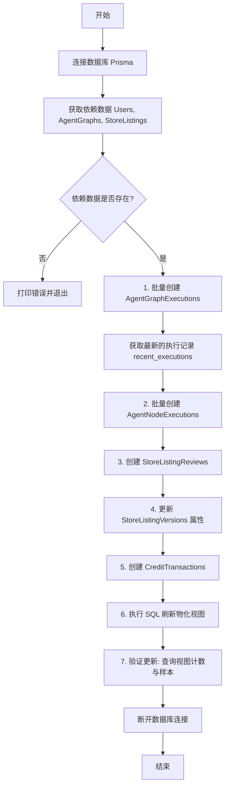
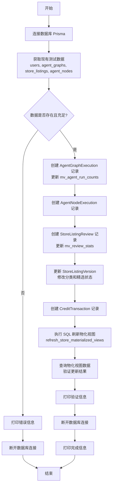

# `.\AutoGPT\autogpt_platform\backend\test\test_data_updater.py` 详细设计文档

该脚本旨在更新现有的测试数据，通过创建新的 AgentGraphExecution、StoreListingReview 和 CreditTransaction 记录来触发数据库中物化视图的变更，并在操作后刷新和验证这些视图，以确保数据聚合逻辑的正确性。

## 整体流程



## 类结构

```
test_data_updater.py (Script Module)
├── Global Variables
│   └── faker
└── Global Functions
    └── main
```

## 全局变量及字段


### `faker`
    
Faker库的实例，用于生成随机的虚拟数据（如日期时间、文本内容等），用于模拟真实的测试数据环境。

类型：`Faker`
    


    

## 全局函数及方法


### `main`

该函数是测试数据更新脚本的核心入口，负责连接数据库，通过生成新的执行记录、节点执行记录、评论、版本更新和交易记录来触发数据库中物化视图（`mv_agent_run_counts` 和 `mv_review_stats`）的更新，最后刷新并验证这些物化视图的数据一致性。

参数：

-   （无）

返回值：`None`，无返回值，直接执行数据库操作并打印日志。

#### 流程图



#### 带注释源码

```python
async def main():
    # 初始化数据库连接
    db = Prisma()
    await db.connect()

    print("Starting test data updates for materialized views...")
    print("=" * 60)

    # 获取现有的基础数据，用于关联新生成的数据
    users = await db.user.find_many(take=50)
    agent_graphs = await db.agentgraph.find_many(where={"isActive": True}, take=50)
    store_listings = await db.storelisting.find_many(
        where={"hasApprovedVersion": True}, include={"Versions": True}, take=30
    )
    agent_nodes = await db.agentnode.find_many(take=100)

    # 检查是否有足够的基础数据支持更新操作
    if not all([users, agent_graphs, store_listings]):
        print(
            "ERROR: Not enough test data found. Please run test_data_creator.py first."
        )
        await db.disconnect()
        return

    print(
        f"Found {len(users)} users, {len(agent_graphs)} graphs, {len(store_listings)} store listings"
    )
    print()

    # 1. 添加新的 AgentGraphExecution 记录以触发 mv_agent_run_counts 更新
    print("1. Adding new agent graph executions...")
    print("-" * 40)

    new_executions_count = 0
    execution_data = []

    for graph in random.sample(agent_graphs, min(20, len(agent_graphs))):
        # 为每个选中的图添加 5-15 个执行记录
        num_new_executions = random.randint(5, 15)
        for _ in range(num_new_executions):
            user = random.choice(users)
            execution_data.append(
                {
                    "agentGraphId": graph.id,
                    "agentGraphVersion": graph.version,
                    "userId": user.id,
                    "executionStatus": random.choice(
                        [
                            prisma.enums.AgentExecutionStatus.COMPLETED,
                            prisma.enums.AgentExecutionStatus.FAILED,
                            prisma.enums.AgentExecutionStatus.RUNNING,
                        ]
                    ),
                    "startedAt": faker.date_time_between(
                        start_date="-7d", end_date="now"
                    ),
                    "stats": Json(
                        {
                            "duration": random.randint(100, 5000),
                            "blocks_executed": random.randint(1, 10),
                        }
                    ),
                }
            )
            new_executions_count += 1

    # 批量创建执行记录
    await db.agentgraphexecution.create_many(data=execution_data)
    print(f"✓ Created {new_executions_count} new executions")

    # 获取刚创建的执行记录，用于后续创建节点执行记录
    recent_executions = await db.agentgraphexecution.find_many(
        take=new_executions_count, order={"createdAt": "desc"}
    )

    # 2. 添加对应的 AgentNodeExecution 记录
    print("\n2. Adding agent node executions...")
    print("-" * 40)

    node_execution_data = []
    for execution in recent_executions:
        # 获取该图对应的节点
        graph_nodes = [
            n for n in agent_nodes if n.agentGraphId == execution.agentGraphId
        ]
        if graph_nodes:
            for node in random.sample(graph_nodes, min(3, len(graph_nodes))):
                node_execution_data.append(
                    {
                        "agentGraphExecutionId": execution.id,
                        "agentNodeId": node.id,
                        "executionStatus": execution.executionStatus,
                        "addedTime": datetime.now(),
                        "startedTime": datetime.now()
                        - timedelta(minutes=random.randint(1, 10)),
                        "endedTime": (
                            datetime.now()
                            if execution.executionStatus
                            == prisma.enums.AgentExecutionStatus.COMPLETED
                            else None
                        ),
                    }
                )

    await db.agentnodeexecution.create_many(data=node_execution_data)
    print(f"✓ Created {len(node_execution_data)} node executions")

    # 3. 添加新的 StoreListingReview 记录以触发 mv_review_stats 更新
    print("\n3. Adding new store listing reviews...")
    print("-" * 40)

    new_reviews_count = 0

    for listing in store_listings:
        if not listing.Versions:
            continue

        # 筛选出已批准的版本
        approved_versions = [
            v
            for v in listing.Versions
            if v.submissionStatus == prisma.enums.SubmissionStatus.APPROVED
        ]
        if not approved_versions:
            continue

        # 随机选择一个版本添加评论
        version = random.choice(approved_versions)

        # 获取已有评论以避免重复
        existing_reviews = await db.storelistingreview.find_many(
            where={"storeListingVersionId": version.id}
        )
        existing_reviewer_ids = {r.reviewByUserId for r in existing_reviews}

        # 找出尚未评论该版本的用户
        available_reviewers = [u for u in users if u.id not in existing_reviewer_ids]

        if available_reviewers:
            # 添加 2-5 条新评论
            num_new_reviews = min(random.randint(2, 5), len(available_reviewers))
            selected_reviewers = random.sample(available_reviewers, num_new_reviews)

            for reviewer in selected_reviewers:
                # 倾向于生成正面评价 (4-5星)
                score = random.choices([1, 2, 3, 4, 5], weights=[5, 10, 20, 40, 25])[0]

                await db.storelistingreview.create(
                    data={
                        "storeListingVersionId": version.id,
                        "reviewByUserId": reviewer.id,
                        "score": score,
                        "comments": (
                            faker.text(max_nb_chars=200)
                            if random.random() < 0.7
                            else None
                        ),
                    }
                )
                new_reviews_count += 1

    print(f"✓ Created {new_reviews_count} new reviews")

    # 4. 更新部分 store listing versions (修改分类和精选状态)
    print("\n4. Updating store listing versions...")
    print("-" * 40)

    updates_count = 0
    for listing in random.sample(store_listings, min(10, len(store_listings))):
        if listing.Versions:
            version = random.choice(listing.Versions)
            if version.submissionStatus == prisma.enums.SubmissionStatus.APPROVED:
                # 切换精选状态或更新分类
                new_categories = random.sample(
                    [
                        "productivity",
                        "ai",
                        "automation",
                        "data",
                        "social",
                        "marketing",
                        "development",
                        "analytics",
                    ],
                    k=random.randint(2, 4),
                )

                await db.storelistingversion.update(
                    where={"id": version.id},
                    data={
                        "isFeatured": (
                            not version.isFeatured
                            if random.random() < 0.3
                            else version.isFeatured
                        ),
                        "categories": new_categories,
                        "updatedAt": datetime.now(),
                    },
                )
                updates_count += 1

    print(f"✓ Updated {updates_count} store listing versions")

    # 5. 创建新的积分交易记录
    print("\n5. Adding credit transactions...")
    print("-" * 40)

    transaction_count = 0
    for user in random.sample(users, min(30, len(users))):
        # 每个用户添加 1-3 条交易
        for _ in range(random.randint(1, 3)):
            transaction_type = random.choice(
                [
                    prisma.enums.CreditTransactionType.USAGE,
                    prisma.enums.CreditTransactionType.TOP_UP,
                    prisma.enums.CreditTransactionType.GRANT,
                ]
            )

            amount = (
                random.randint(10, 500)
                if transaction_type == prisma.enums.CreditTransactionType.TOP_UP
                else -random.randint(1, 50)
            )

            await db.credittransaction.create(
                data={
                    "userId": user.id,
                    "amount": amount,
                    "type": transaction_type,
                    "metadata": Json(
                        {
                            "source": "test_updater",
                            "timestamp": datetime.now().isoformat(),
                        }
                    ),
                }
            )
            transaction_count += 1

    print(f"✓ Created {transaction_count} credit transactions")

    # 6. 刷新物化视图
    print("\n6. Refreshing materialized views...")
    print("-" * 40)

    try:
        await db.execute_raw("SELECT refresh_store_materialized_views();")
        print("✓ Materialized views refreshed successfully")
    except Exception as e:
        print(f"⚠ Warning: Could not refresh materialized views: {e}")
        print(
            "  You may need to refresh them manually with: SELECT refresh_store_materialized_views();"
        )

    # 7. 验证更新结果
    print("\n7. Verifying updates...")
    print("-" * 40)

    # 检查 agent 运行计数视图
    run_counts = await db.query_raw(
        "SELECT COUNT(*) as view_count FROM mv_agent_run_counts"
    )
    print(f"✓ mv_agent_run_counts has {run_counts[0]['view_count']} entries")

    # 检查评论统计视图
    review_stats = await db.query_raw(
        "SELECT COUNT(*) as view_count FROM mv_review_stats"
    )
    print(f"✓ mv_review_stats has {review_stats[0]['view_count']} entries")

    # 采样展示物化视图中的数据
    print("\nSample data from materialized views:")

    sample_runs = await db.query_raw(
        "SELECT * FROM mv_agent_run_counts ORDER BY run_count DESC LIMIT 5"
    )
    print("\nTop 5 agents by run count:")
    for row in sample_runs:
        print(f"  - Agent {row['agentGraphId'][:8]}...: {row['run_count']} runs")

    sample_reviews = await db.query_raw(
        "SELECT * FROM mv_review_stats ORDER BY avg_rating DESC NULLS LAST LIMIT 5"
    )
    print("\nTop 5 store listings by rating:")
    for row in sample_reviews:
        avg_rating = row["avg_rating"] if row["avg_rating"] is not None else 0.0
        print(
            f"  - Listing {row['storeListingId'][:8]}...: {avg_rating:.2f} ⭐ ({row['review_count']} reviews)"
        )

    await db.disconnect()

    print("\n" + "=" * 60)
    print("Test data update completed successfully!")
    print("The materialized views should now reflect the updated data.")
    print(
        "\nTo manually refresh views, run: SELECT refresh_store_materialized_views();"
    )
```


## 关键组件


### AgentGraphExecution 更新器

负责创建新的代理图执行记录，包含随机状态、持续时间统计和时间戳，以触发 mv_agent_run_counts 物化视图的更新。

### StoreListingReview 生成器

负责为已批准的商店列表版本生成新的用户评论和加权随机评分，并确保用户不重复评价，以测试 mv_review_stats 物化视图的数据聚合。

### 物化视图刷新器

负责执行数据库原始 SQL 命令，调用 refresh_store_materialized_views() 存储过程，强制刷新相关的物化视图以反映最新的数据变更。

### 数据验证器

负责查询更新后的物化视图，统计记录总数并输出按运行次数和评分排序的样本数据，以验证视图更新的正确性和完整性。


## 问题及建议


### 已知问题

-   **N+1 查询性能问题**：在生成评论的逻辑中，脚本在循环内部对每个 StoreListingVersion 执行 `await db.storelistingreview.find_many` 以检查是否存在重复评论。这种做法会导致大量的数据库往返查询，随着数据量增加，性能将显著下降。
-   **缺乏事务性保证**：所有的数据库插入和更新操作都是独立执行的。如果在执行过程中途脚本崩溃（例如插入 AgentGraphExecution 后失败），数据库将处于不一致的状态（存在孤儿记录或数据更新不完整），这将影响后续的测试结果验证。
-   **错误处理覆盖不全**：代码仅对物化视图刷新部分（`refresh_store_materialized_views`）进行了 `try-except` 异常捕获。对于核心的数据批量创建操作（如 `create_many`、`create`），如果因为数据库约束或连接问题抛出异常，脚本将直接崩溃且不提供详细的错误上下文。
-   **数据关联依赖风险**：在创建 AgentNodeExecution 时，脚本依赖于内存中预加载的 `agent_nodes` 列表（限制为 100 条）。如果新创建的 AgentGraphExecution 对应的节点不在这 100 条数据中，这些执行记录将无法生成对应的节点执行记录，导致测试数据关联缺失。

### 优化建议

-   **批量查询与内存检查**：优化评论生成逻辑，在循环开始前一次性批量查询所有 StoreListingVersion 的现有评论关系，并在内存中构建 `set` 或 `dict` 用于快速查重，从而消除循环内的数据库查询。
-   **引入数据库事务**：利用 Prisma Client 的事务功能（如 `db.tx()` 或 `batch` 事务），将 AgentGraphExecutions、NodeExecutions、Reviews 及 Updates 的创建过程包裹在一个事务中。这能确保所有操作原子性完成，或在失败时完全回滚，保证数据一致性。
-   **模块化与函数拆分**：将庞大的 `main` 函数拆分为职责单一的子函数（例如 `generate_execution_data`, `generate_review_data`, `refresh_views`, `verify_data`），以提高代码的可读性、可测试性和可维护性。
-   **配置参数化**：将脚本中硬编码的随机范围（如 `random.randint(5, 15)`）、样本数量限制（如 `take=50`）和权重（如评论评分权重）提取为模块顶部的常量或配置参数，便于针对不同压力测试场景调整数据生成量。
-   **时间戳逻辑修正**：改进时间戳生成逻辑。`AgentNodeExecution` 的时间戳（`addedTime`, `startedTime`）应基于其父级 `AgentGraphExecution` 的 `startedAt` 时间进行偏移生成，而不是统一使用 `datetime.now()`，以确保测试数据在时间维度上的逻辑合理性。


## 其它


### 设计目标与约束

**设计目标：**
该脚本的核心设计目标是作为集成测试工具，通过模拟真实的用户行为和系统操作，生成新的增量数据以触发数据库中物化视图（Materialized Views）的更新机制。它旨在验证 `mv_agent_run_counts`（代理运行统计）和 `mv_review_stats`（商店评论统计）是否能够正确反映底层数据的变化。

**约束条件：**
1.  **执行顺序依赖**：脚本必须依赖 `test_data_creator.py` 先行运行，以确保存在基础的 User、AgentGraph 和 StoreListing 数据，否则脚本会报错退出。
2.  **幂等性与完整性**：在创建评论数据时，脚本包含逻辑检查以避免同一用户对同一版本进行重复评论，防止数据库唯一性约束冲突。
3.  **性能考量**：对于 AgentGraphExecution 和 AgentNodeExecution 的大规模数据生成，采用批量写入（`create_many`）策略以减少数据库 I/O 开销；对于逻辑较复杂的评论创建，采用循环写入。
4.  **环境依赖**：要求运行环境能够访问目标数据库，且数据库中必须预定义 `refresh_store_materialized_views` 存储过程。

### 错误处理与异常设计

1.  **前置条件检查**：
    *   脚本在获取基础数据（users, agent_graphs, store_listings）后，立即检查这些集合是否为空。如果数据不足，打印错误信息并优雅退出，避免后续处理出现空指针异常或逻辑错误。

2.  **数据库异常捕获**：
    *   在刷新物化视图的关键步骤中，使用了 `try...except` 块捕获 `Exception`。如果刷新失败（例如存储过程不存在或权限问题），脚本不会崩溃，而是打印警告信息，提示用户可能需要手动执行 SQL，确保后续的验证步骤仍能尝试运行。

3.  **数据一致性保护**：
    *   在添加评论前，先查询已存在的评论记录，构建 `existing_reviewer_ids` 集合，确保只选择未评论过的用户。这是一种防御性编程，防止因违反数据库唯一索引（如 `storeListingVersionId` + `reviewByUserId`）而导致的运行时错误。

4.  **资源清理**：
    *   通过 `await db.disconnect()` 确保在脚本结束或发生错误中断时（前提是逻辑流能走到这里）释放数据库连接资源。

### 数据流与状态机

**数据流：**
1.  **读取阶段**：从数据库读取现有的用户、代理图、商店列表和节点数据作为种子数据。
2.  **生成与写入阶段**：
    *   **流向 1**：基于 AgentGraph 生成随机的执行记录 -> 写入 `AgentGraphExecution` -> 基于生成的执行记录生成节点执行记录 -> 写入 `AgentNodeExecution`。
    *   **流向 2**：基于 StoreListing Version 查找潜在评论者 -> 生成评分和评论内容 -> 写入 `StoreListingReview`。
    *   **流向 3**：随机选取 StoreListing Version -> 修改分类或精选状态 -> 更新 `StoreListingVersion`。
    *   **流向 4**：基于 User 生成信用交易记录 -> 写入 `CreditTransaction`。
3.  **触发阶段**：调用数据库存储过程 `refresh_store_materialized_views()`，触发物化视图的刷新逻辑，将上述写入的数据聚合计算。
4.  **验证阶段**：从物化视图中读取统计结果和样本数据，并在控制台输出，完成闭环验证。

**状态机：**
脚本本身是一个线性执行的批处理任务，其生命周期状态如下：
`Idle` (初始化) -> `Connecting` (连接数据库) -> `Seeding` (获取种子数据) -> `Processing` (执行 5 个数据生成子任务) -> `Refreshing` (刷新视图) -> `Verifying` (验证结果) -> `Disconnecting` (断开连接) -> `Terminated` (结束)。

### 外部依赖与接口契约

1.  **ORM 依赖 (Prisma Client)**：
    *   **契约**：脚本深度依赖 Prisma Python Client。假设数据库 Schema 已定义了 `User`, `AgentGraph`, `AgentNode`, `StoreListing`, `StoreListingVersion`, `AgentGraphExecution`, `AgentNodeExecution`, `StoreListingReview`, `CreditTransaction` 等模型。
    *   **接口**：使用 `db.model.find_many`, `db.model.create_many`, `db.model.create`, `db.model.update`, `db.execute_raw`, `db.query_raw` 等标准接口进行交互。

2.  **数据库 Schema 依赖**：
    *   **枚举类型**：依赖 `prisma.enums.AgentExecutionStatus`, `prisma.enums.SubmissionStatus`, `prisma.enums.CreditTransactionType` 等枚举值的定义。
    *   **数据库函数**：强依赖数据库端存在 `refresh_store_materialized_views()` 这一 SQL 函数，该函数负责执行具体的 `REFRESH MATERIALIZED VIEW CONCURRENTLY` 或类似逻辑。
    *   **物化视图**：依赖 `mv_agent_run_counts` 和 `mv_review_stats` 视图的存在及其特定的列结构（如 `agentGraphId`, `run_count`, `storeListingId`, `avg_rating` 等）。

3.  **第三方库依赖**：
    *   **Faker**：用于生成逼真的随机数据（如日期、文本内容），接口契约为 `Faker` 类及其方法（如 `date_time_between`, `text`）。
    *   **Asyncio**：Python 标准库，用于异步执行数据库操作。

4.  **配置依赖**：
    *   隐式依赖数据库连接字符串（通常通过环境变量或 `.env` 文件被 Prisma 读取），脚本内部不包含连接配置逻辑。

    