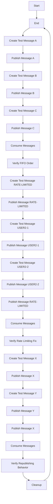
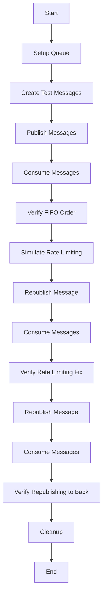
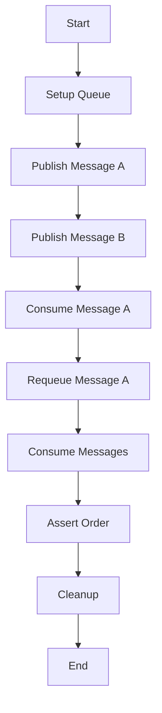
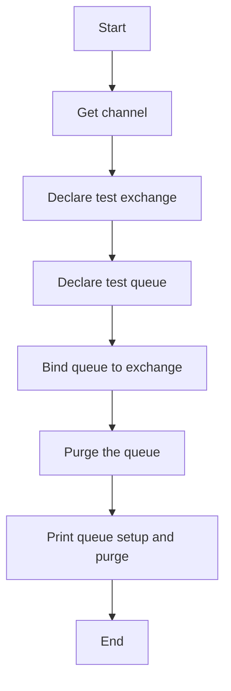
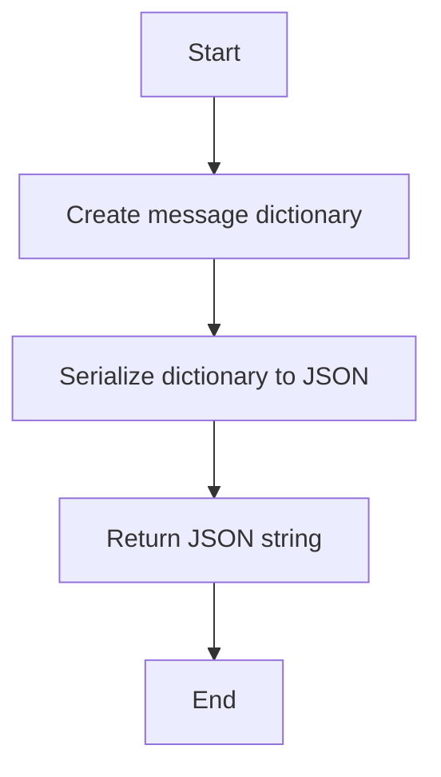
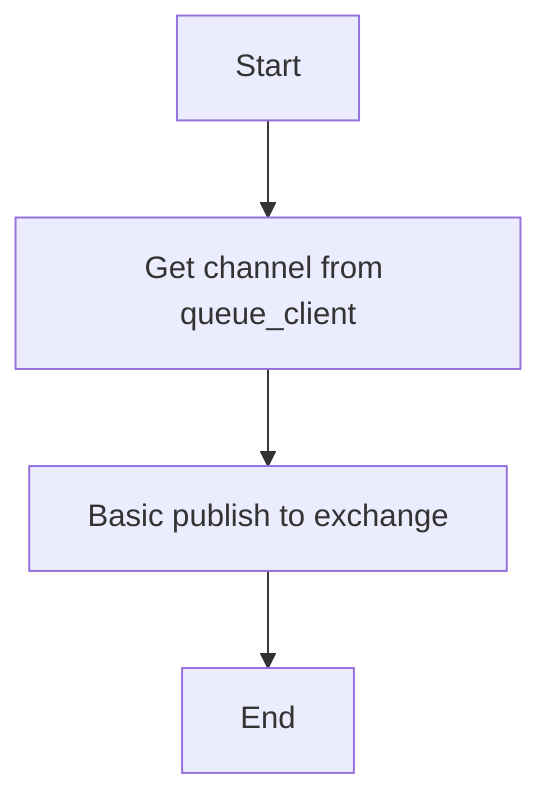
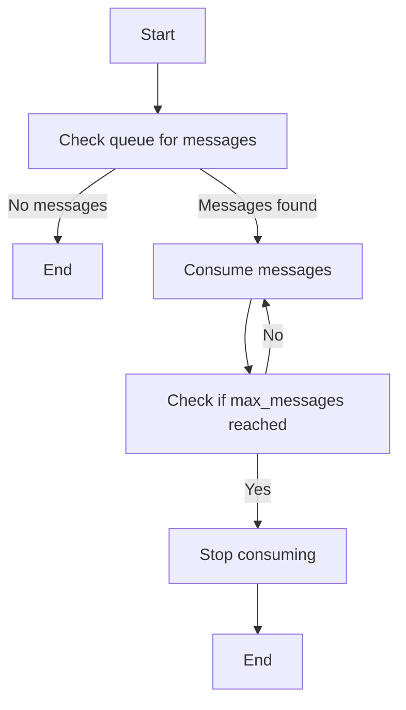
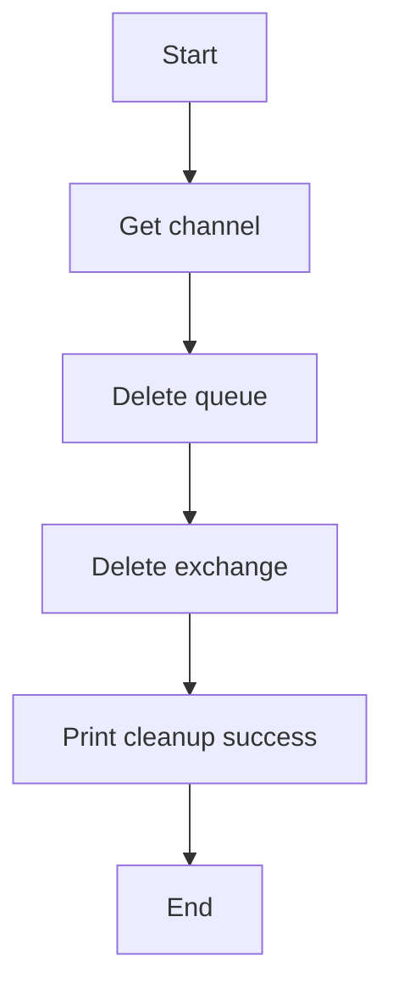

# `.\AutoGPT\autogpt_platform\backend\test_requeue_integration.py` 详细设计文档

This code is an integration test suite for RabbitMQ message ordering, specifically designed to test the behavior of republishing messages to ensure they are sent to the back of the queue, thus preventing blocking issues.

## 整体流程



## 类结构

```
QueueOrderTester (测试类)
├── setup_queue (方法)
│   ├── create_test_message (方法)
│   ├── publish_message (方法)
│   ├── consume_messages (方法)
│   └── cleanup (方法)
└── test_queue_ordering_behavior (函数)
```

## 全局变量及字段


### `test_queue_name`
    
The name of the dedicated test queue used for testing message ordering in RabbitMQ.

类型：`str`
    


### `test_exchange`
    
The name of the test exchange used for routing messages in the test queue.

类型：`str`
    


### `test_routing_key`
    
The routing key used to route messages to the test queue.

类型：`str`
    


### `received_messages`
    
A list to store the received messages from the test queue.

类型：`List[dict]`
    


### `stop_consuming`
    
A threading.Event object used to signal the consumer to stop consuming messages.

类型：`Event`
    


### `queue_client`
    
An instance of SyncRabbitMQ used to interact with the RabbitMQ server.

类型：`SyncRabbitMQ`
    


### `test_queue_name`
    
The name of the dedicated test queue used for testing message ordering in RabbitMQ.

类型：`str`
    


### `test_exchange`
    
The name of the test exchange used for routing messages in the test queue.

类型：`str`
    


### `test_routing_key`
    
The routing key used to route messages to the test queue.

类型：`str`
    


### `QueueOrderTester.received_messages`
    
A list to store the received messages from the test queue.

类型：`List[dict]`
    


### `QueueOrderTester.stop_consuming`
    
A threading.Event object used to signal the consumer to stop consuming messages.

类型：`Event`
    


### `QueueOrderTester.queue_client`
    
An instance of SyncRabbitMQ used to interact with the RabbitMQ server.

类型：`SyncRabbitMQ`
    


### `QueueOrderTester.test_queue_name`
    
The name of the dedicated test queue used for testing message ordering in RabbitMQ.

类型：`str`
    


### `QueueOrderTester.test_exchange`
    
The name of the test exchange used for routing messages in the test queue.

类型：`str`
    


### `QueueOrderTester.test_routing_key`
    
The routing key used to route messages to the test queue.

类型：`str`
    
    

## 全局函数及方法

### test_queue_ordering_behavior

Integration test to verify that our republishing method sends messages to back of queue.

参数：

- `None`：`None`，No parameters are passed directly to this function. It uses instance variables and methods from the `QueueOrderTester` class.

返回值：`None`，This function does not return any value. It performs assertions and prints messages to indicate the outcome of the tests.

#### 流程图



#### 带注释源码

```python
def test_queue_ordering_behavior():
    """
    Integration test to verify that our republishing method sends messages to back of queue.
    This tests the actual fix for the rate limiting queue blocking issue.
    """
    tester = QueueOrderTester()

    try:
        tester.setup_queue()

        print("🧪 Testing actual RabbitMQ queue ordering behavior...")

        # Test 1: Normal FIFO behavior
        print("1. Testing normal FIFO queue behavior")

        # Publish messages in order: A, B, C
        msg_a = tester.create_test_message("A")
        msg_b = tester.create_test_message("B")
        msg_c = tester.create_test_message("C")

        tester.publish_message(msg_a)
        tester.publish_message(msg_b)
        tester.publish_message(msg_c)

        # Consume and verify FIFO order: A, B, C
        tester.received_messages = []
        tester.stop_consuming.clear()
        messages = tester.consume_messages(max_messages=3)

        assert len(messages) == 3, f"Expected 3 messages, got {len(messages)}"
        assert (
            messages[0]["graph_exec_id"] == "exec-A"
        ), f"First message should be A, got {messages[0]['graph_exec_id']}"
        assert (
            messages[1]["graph_exec_id"] == "exec-B"
        ), f"Second message should be B, got {messages[1]['graph_exec_id']}"
        assert (
            messages[2]["graph_exec_id"] == "exec-C"
        ), f"Third message should be C, got {messages[2]['graph_exec_id']}"

        print("✅ FIFO order confirmed: A -> B -> C")

        # Test 2: Rate limiting simulation - the key test!
        print("2. Testing rate limiting fix scenario")

        # Simulate the scenario where user1 is rate limited
        user1_msg = tester.create_test_message("RATE-LIMITED", "user1")
        user2_msg1 = tester.create_test_message("USER2-1", "user2")
        user2_msg2 = tester.create_test_message("USER2-2", "user2")

        # Initially publish user1 message (gets consumed, then rate limited on retry)
        tester.publish_message(user1_msg)

        # Other users publish their messages
        tester.publish_message(user2_msg1)
        tester.publish_message(user2_msg2)

        # Now simulate: user1 message gets "requeued" using our new republishing method
        # This is what happens in manager.py when requeue_by_republishing=True
        tester.publish_message(user1_msg)  # Goes to back via our method

        # Expected order: RATE-LIMITED, USER2-1, USER2-2, RATE-LIMITED (republished to back)
        # This shows that user2 messages get processed instead of being blocked
        tester.received_messages = []
        tester.stop_consuming.clear()
        messages = tester.consume_messages(max_messages=4)

        assert len(messages) == 4, f"Expected 4 messages, got {len(messages)}"

        # The key verification: user2 messages are NOT blocked by user1's rate-limited message
        user2_messages = [msg for msg in messages if msg["user_id"] == "user2"]
        assert len(user2_messages) == 2, "Both user2 messages should be processed"
        assert user2_messages[0]["graph_exec_id"] == "exec-USER2-1"
        assert user2_messages[1]["graph_exec_id"] == "exec-USER2-2"

        print("✅ Rate limiting fix confirmed: user2 executions NOT blocked by user1")

        # Test 3: Verify our method behaves like going to back of queue
        print("3. Testing republishing sends messages to back")

        # Start with message X in queue
        msg_x = tester.create_test_message("X")
        tester.publish_message(msg_x)

        # Add message Y
        msg_y = tester.create_test_message("Y")
        tester.publish_message(msg_y)

        # Republish X (simulates requeue using our method)
        tester.publish_message(msg_x)

        # Expected: X, Y, X (X was republished to back)
        tester.received_messages = []
        tester.stop_consuming.clear()
        messages = tester.consume_messages(max_messages=3)

        assert len(messages) == 3
        # Y should come before the republished X
        y_index = next(
            i for i, msg in enumerate(messages) if msg["graph_exec_id"] == "exec-Y"
        )
        republished_x_index = next(
            i
            for i, msg in enumerate(messages[1:], 1)
            if msg["graph_exec_id"] == "exec-X"
        )

        assert (
            y_index < republished_x_index
        ), f"Y should come before republished X, but got order: {[m['graph_exec_id'] for m in messages]}"

        print("✅ Republishing confirmed: messages go to back of queue")

        print("🎉 All integration tests passed!")
        print("🎉 Our republishing method works correctly with real RabbitMQ")
        print("🎉 Queue blocking issue is fixed!")

    finally:
        tester.cleanup()
```

### test_traditional_requeue_behavior

This function tests the behavior of traditional requeueing in RabbitMQ, specifically using the `basic_nack` method with the `requeue=True` parameter. It verifies that messages are sent to the front of the queue when requeued in this manner.

#### 参数

- `None`：该函数没有参数。

#### 返回值

- `None`：该函数不返回任何值。

#### 流程图



#### 带注释源码

```python
def test_traditional_requeue_behavior():
    """
    Test that traditional requeue (basic_nack with requeue=True) sends messages to FRONT of queue.
    This validates our hypothesis about why queue blocking occurs.
    """
    tester = QueueOrderTester()

    try:
        tester.setup_queue()
        print("🧪 Testing traditional requeue behavior (basic_nack with requeue=True)")

        # Step 1: Publish message A
        msg_a = tester.create_test_message("A")
        tester.publish_message(msg_a)

        # Step 2: Publish message B
        msg_b = tester.create_test_message("B")
        tester.publish_message(msg_b)

        # Step 3: Consume message A and requeue it using traditional method
        channel = tester.queue_client.get_channel()
        method_frame, header_frame, body = channel.basic_get(
            queue=tester.test_queue_name, auto_ack=False
        )

        assert method_frame is not None, "Should have received message A"
        consumed_msg = json.loads(body.decode())
        assert (
            consumed_msg["graph_exec_id"] == "exec-A"
        ), f"Should have consumed message A, got {consumed_msg['graph_exec_id']}"

        # Traditional requeue: basic_nack with requeue=True (sends to FRONT)
        channel.basic_nack(delivery_tag=method_frame.delivery_tag, requeue=True)
        print(f"🔄 Traditional requeue (to FRONT): {consumed_msg['graph_exec_id']}")

        # Step 4: Consume all messages using basic_get for reliability
        received_messages = []

        # Get first message
        method_frame, header_frame, body = channel.basic_get(
            queue=tester.test_queue_name, auto_ack=True
        )
        if method_frame:
            msg = json.loads(body.decode())
            received_messages.append(msg)

        # Get second message
        method_frame, header_frame, body = channel.basic_get(
            queue=tester.test_queue_name, auto_ack=True
        )
        if method_frame:
            msg = json.loads(body.decode())
            received_messages.append(msg)

        # CRITICAL ASSERTION: Traditional requeue should put A at FRONT
        # Expected order: A (requeued to front), B
        assert (
            len(received_messages) == 2
        ), f"Expected 2 messages, got {len(received_messages)}"

        first_msg = received_messages[0]["graph_exec_id"]
        second_msg = received_messages[1]["graph_exec_id"]

        # This is the critical test: requeued message A should come BEFORE B
        assert (
            first_msg == "exec-A"
        ), f"Traditional requeue should put A at FRONT, but first message was: {first_msg}"
        assert (
            second_msg == "exec-B"
        ), f"B should come after requeued A, but second message was: {second_msg}"

        print(
            "✅ HYPOTHESIS CONFIRMED: Traditional requeue sends messages to FRONT of queue"
        )
        print(f"   Order: {first_msg} (requeued to front) → {second_msg}")
        print("   This explains why rate-limited messages block other users!")

    finally:
        tester.cleanup()
```


### QueueOrderTester.__init__

This method initializes the `QueueOrderTester` class, setting up the necessary RabbitMQ connection and configuration for testing message ordering.

参数：

- `self`：`QueueOrderTester` 类的实例，用于访问类的属性和方法。

返回值：无

#### 流程图

```mermaid
graph TD
    A[Start] --> B[Initialize QueueOrderTester]
    B --> C[Set received_messages to List[dict]]
    B --> D[Set stop_consuming to Event]
    B --> E[Set queue_client to SyncRabbitMQ(create_execution_queue_config())]
    B --> F[Connect queue_client]
    B --> G[Set test_queue_name to "test_requeue_ordering"]
    B --> H[Set test_exchange to "test_exchange"]
    B --> I[Set test_routing_key to "test.requeue"]
    B --> J[End]
```

#### 带注释源码

```python
def __init__(self):
    self.received_messages: List[dict] = []  # List to store received messages
    self.stop_consuming = Event()  # Event to stop consuming messages
    self.queue_client = SyncRabbitMQ(create_execution_queue_config())  # RabbitMQ client
    self.queue_client.connect()  # Connect to RabbitMQ

    # Use a dedicated test queue name to avoid conflicts
    self.test_queue_name = "test_requeue_ordering"
    self.test_exchange = "test_exchange"
    self.test_routing_key = "test.requeue"
``` 


### QueueOrderTester.setup_queue

Set up a dedicated test queue for testing.

参数：

- 无

返回值：无

#### 流程图



#### 带注释源码

```python
def setup_queue(self):
    """Set up a dedicated test queue for testing."""
    channel = self.queue_client.get_channel()

    # Declare test exchange
    channel.exchange_declare(
        exchange=self.test_exchange, exchange_type="direct", durable=True
    )

    # Declare test queue
    channel.queue_declare(
        queue=self.test_queue_name, durable=True, auto_delete=False
    )

    # Bind queue to exchange
    channel.queue_bind(
        exchange=self.test_exchange,
        queue=self.test_queue_name,
        routing_key=self.test_routing_key,
    )

    # Purge the queue to start fresh
    channel.queue_purge(self.test_queue_name)
    print(f"✅ Test queue {self.test_queue_name} setup and purged")
```


### QueueOrderTester.create_test_message

Create a test graph execution message.

参数：

- `message_id`：`str`，Unique identifier for the message.
- `user_id`：`str`，Default is "test-user", identifier for the user associated with the message.

返回值：`str`，A JSON string representing the test message.

#### 流程图



#### 带注释源码

```python
def create_test_message(self, message_id: str, user_id: str = "test-user") -> str:
    """Create a test graph execution message."""
    return json.dumps(
        {
            "graph_exec_id": f"exec-{message_id}",
            "graph_id": f"graph-{message_id}",
            "user_id": user_id,
            "execution_context": {"timezone": "UTC"},
            "nodes_input_masks": {},
            "starting_nodes_input": [],
        }
    )
```


### QueueOrderTester.publish_message

Publishes a message to the test queue.

参数：

- `message`：`str`，The message to be published to the test queue.

返回值：`None`，No return value.

#### 流程图



#### 带注释源码

```python
def publish_message(self, message: str):
    """Publish a message to the test queue."""
    channel = self.queue_client.get_channel()
    channel.basic_publish(
        exchange=self.test_exchange,
        routing_key=self.test_routing_key,
        body=message,
    )
```


### `QueueOrderTester.consume_messages`

This method consumes messages from the test queue and tracks their order.

参数：

- `max_messages`：`int`，最大消费消息数，默认为10。
- `timeout`：`float`，消费超时时间，默认为5.0秒。

返回值：`List[dict]`，消费到的消息列表。

#### 流程图



#### 带注释源码

```python
def consume_messages(self, max_messages: int = 10, timeout: float = 5.0):
    """Consume messages and track their order."""

    def callback(ch, method, properties, body):
        try:
            message_data = json.loads(body.decode())
            self.received_messages.append(message_data)
            ch.basic_ack(delivery_tag=method.delivery_tag)

            if len(self.received_messages) >= max_messages:
                self.stop_consuming.set()
        except Exception as e:
            print(f"Error processing message: {e}")
            ch.basic_nack(delivery_tag=method.delivery_tag, requeue=False)

    # Use synchronous consumption with blocking
    channel = self.queue_client.get_channel()

    # Check if there are messages in the queue first
    method_frame, header_frame, body = channel.basic_get(
        queue=self.test_queue_name, auto_ack=False
    )
    if method_frame:
        # There are messages, set up consumer
        channel.basic_nack(
            delivery_tag=method_frame.delivery_tag, requeue=True
        )  # Put message back

        # Set up consumer
        channel.basic_consume(
            queue=self.test_queue_name,
            on_message_callback=callback,
        )

        # Consume with timeout
        start_time = time.time()
        while (
            not self.stop_consuming.is_set()
            and (time.time() - start_time) < timeout
            and len(self.received_messages) < max_messages
        ):
            try:
                channel.connection.process_data_events(time_limit=0.1)
            except Exception as e:
                print(f"Error during consumption: {e}")
                break

        # Cancel the consumer
        try:
            channel.cancel()
        except Exception:
            pass
    else:
        # No messages in queue - this might be expected for some tests
        pass

    return self.received_messages
```


### `QueueOrderTester.cleanup`

This method cleans up the test resources by deleting the test queue and exchange in RabbitMQ.

参数：

- `self`：`QueueOrderTester`，The instance of the QueueOrderTester class.

返回值：`None`，No return value.

#### 流程图



#### 带注释源码

```python
def cleanup(self):
    """Clean up test resources."""
    try:
        channel = self.queue_client.get_channel()
        channel.queue_delete(queue=self.test_queue_name)
        channel.exchange_delete(exchange=self.test_exchange)
        print(f"✅ Test queue {self.test_queue_name} cleaned up")
    except Exception as e:
        print(f"⚠️ Cleanup issue: {e}")
```


## 关键组件


### 张量索引与惰性加载

张量索引与惰性加载是代码中处理数据结构的核心组件，它允许在需要时才计算或访问数据，从而提高性能和内存效率。

### 反量化支持

反量化支持是代码中用于处理量化数据的核心组件，它允许在量化过程中进行反向操作，以便在需要时恢复原始数据。

### 量化策略

量化策略是代码中用于处理数据量化的核心组件，它定义了如何将高精度数据转换为低精度数据，以减少内存使用和提高处理速度。


## 问题及建议


### 已知问题

-   **代码重复性**：`QueueOrderTester` 类中的 `setup_queue` 和 `cleanup` 方法在多个测试函数中被重复调用，这可能导致代码冗余和维护困难。
-   **异常处理**：在 `consume_messages` 方法中，异常处理较为简单，可能需要更详细的异常处理逻辑来确保测试的稳定性和准确性。
-   **测试覆盖率**：虽然代码中包含多个测试用例，但可能存在一些边界情况或异常情况未被覆盖。
-   **全局变量和函数**：代码中未使用全局变量和函数，但如果有需要，应确保其使用符合最佳实践。

### 优化建议

-   **代码重构**：将重复的 `setup_queue` 和 `cleanup` 方法提取为类方法，并在测试函数中调用，以减少代码重复。
-   **增强异常处理**：在 `consume_messages` 方法中，增加对特定异常类型的处理，并记录详细的错误信息，以便于问题追踪和调试。
-   **增加测试用例**：考虑增加更多的测试用例，包括边界情况和异常情况，以提高测试的全面性和准确性。
-   **代码注释**：在代码中添加必要的注释，以提高代码的可读性和可维护性。
-   **性能优化**：在 `consume_messages` 方法中，考虑使用异步处理来提高消息消费的效率。


## 其它


### 设计目标与约束

- 设计目标：确保代码能够准确测试RabbitMQ消息队列的顺序和重试机制，验证重试逻辑是否正确将消息发送到队列的末尾。
- 约束：代码必须与RabbitMQ的API兼容，且测试过程不应影响生产环境。

### 错误处理与异常设计

- 错误处理：代码中应包含异常处理逻辑，确保在消息处理过程中出现的错误能够被捕获并记录。
- 异常设计：使用try-except块捕获可能出现的异常，如JSON解析错误、网络连接问题等。

### 数据流与状态机

- 数据流：消息从生产者发送到RabbitMQ队列，消费者从队列中获取消息并处理。
- 状态机：定义消息在队列中的状态，包括未处理、正在处理、处理完成、重试中等状态。

### 外部依赖与接口契约

- 外部依赖：代码依赖于RabbitMQ和Python的json库。
- 接口契约：定义了与RabbitMQ交互的接口，包括连接、发布、消费消息等操作。

### 测试用例设计

- 测试用例：定义了多个测试用例，包括正常顺序测试、重试机制测试、传统重试机制测试等。

### 性能考量

- 性能考量：测试过程中应考虑消息处理速度和资源消耗，确保测试不会对系统性能产生负面影响。

### 安全性考量

- 安全性考量：确保代码在处理消息时不会泄露敏感信息，且不会受到恶意攻击。

### 可维护性考量

- 可维护性考量：代码应具有良好的可读性和可维护性，便于后续的修改和扩展。

### 可扩展性考量

- 可扩展性考量：设计应考虑未来的扩展需求，如支持更多的消息类型、更复杂的队列管理等。

### 代码风格与规范

- 代码风格：遵循PEP 8编码规范，确保代码的可读性和一致性。
- 规范：定义代码的命名规范、注释规范等。

### 版本控制与文档管理

- 版本控制：使用版本控制系统（如Git）管理代码版本，确保代码的可追溯性和可复现性。
- 文档管理：编写详细的文档，包括设计文档、用户手册、测试报告等。

### 部署与运维

- 部署：定义代码的部署流程，包括环境搭建、配置文件设置等。
- 运维：制定运维计划，包括监控、日志分析、故障处理等。


    