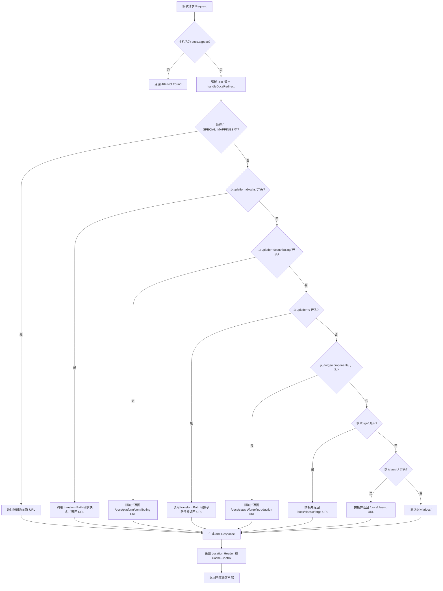
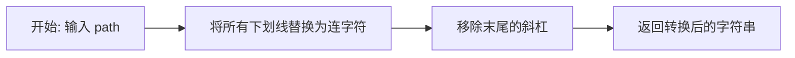
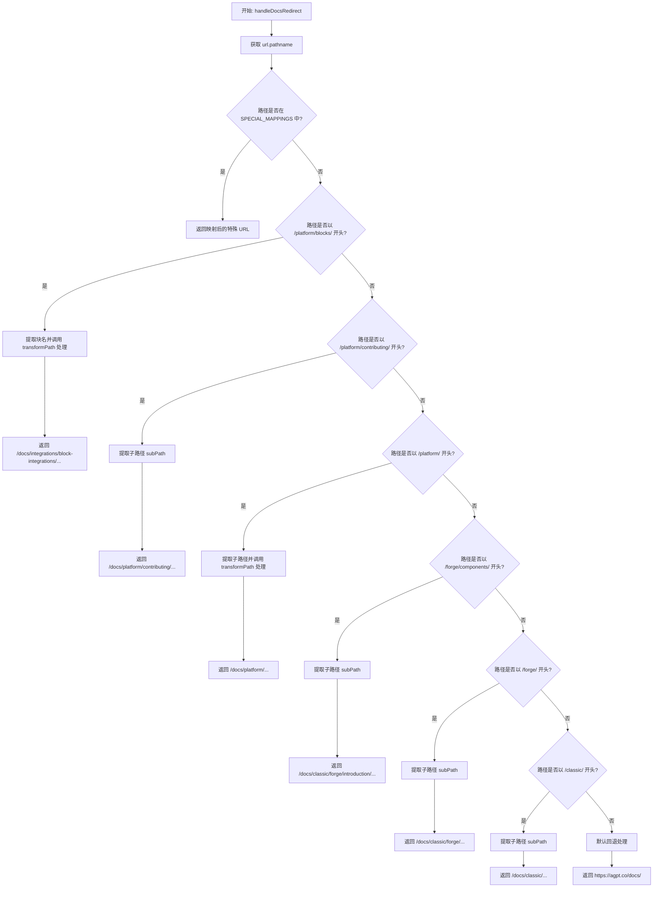
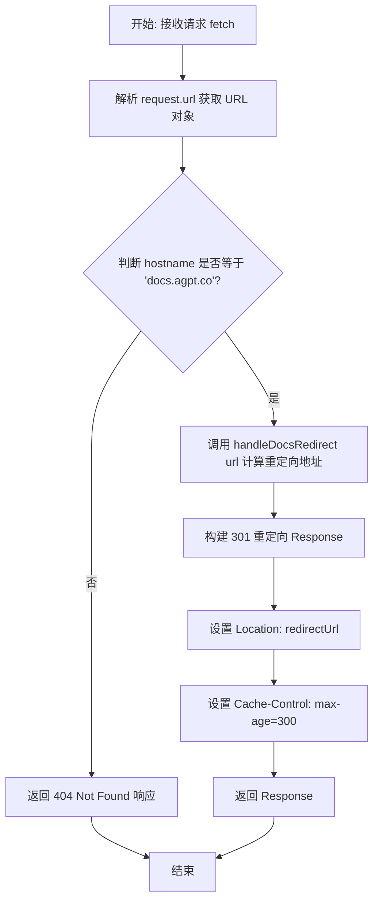
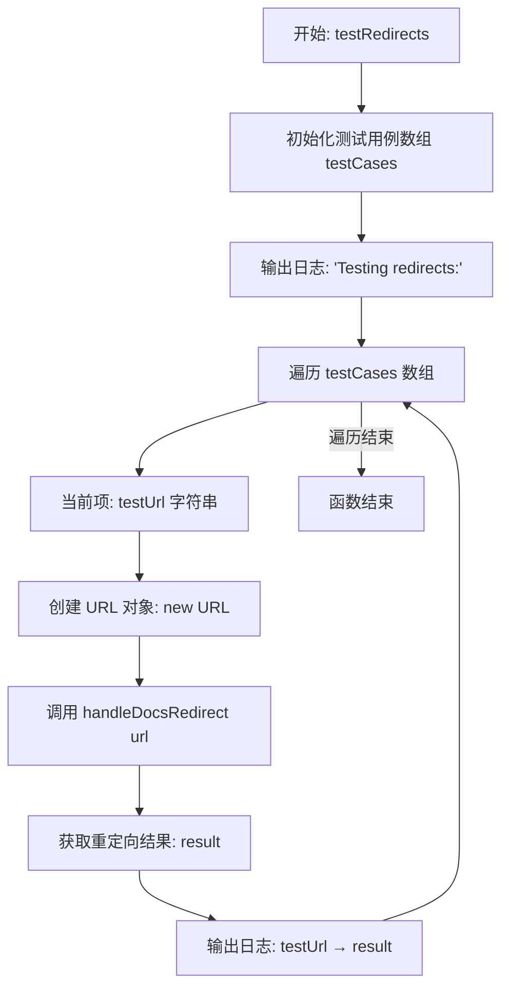

# `.\AutoGPT\autogpt_platform\cloudflare_worker.js` 详细设计文档

该脚本是一个部署在 Cloudflare Workers 上的服务，用于处理从旧文档域名 docs.agpt.co 到新域名 agpt.co/docs 的流量重定向。它通过维护特殊映射表和基于路径前缀的动态规则（如 platform, forge, classic）来匹配 URL，并执行路径转换（如下划线转连字符），最终返回 301 永久重定向响应。

## 整体流程



## 类结构

```
Global Scope (全局作用域)
├── Constants (常量)
│   └── SPECIAL_MAPPINGS
├── Functions (全局函数)
│   ├── transformPath
│   ├── handleDocsRedirect
│   └── testRedirects
└── Export Default Object (默认导出对象)
    └── fetch
```

## 全局变量及字段


### `SPECIAL_MAPPINGS`
    
存储不符合标准模式匹配规则的特殊 URL 路径映射，用于处理特定的重定向情况。

类型：`Object`
    


    

## 全局函数及方法


### `transformPath`

该函数用于转换 URL 路径字符串，主要逻辑是将路径中的所有下划线替换为连字符，并移除路径末尾的斜杠，以符合目标 URL 的规范。

参数：

- `path`：`string`，待处理的 URL 路径字符串。

返回值：`string`，经过格式转换后的路径字符串。

#### 流程图



#### 带注释源码

```javascript
/**
 * Transform path by replacing underscores with hyphens and removing trailing slashes
 * 
 * 该函数接收一个路径字符串，进行规范化处理：
 * 1. 将全局下划线 (_) 替换为连字符 (-)
 * 2. 移除字符串末尾的斜杠 (/)
 */
function transformPath(path) {
  // 使用正则表达式 /_/g 全局匹配下划线并替换为连字符
  // 使用正则表达式 /\/$/ 匹配末尾的斜杠并替换为空字符串
  return path.replace(/_/g, '-').replace(/\/$/, '');
}
```


### `handleDocsRedirect`

该函数是文档迁移重定向逻辑的核心处理单元，负责将旧域名的文档 URL 路径映射到新域名的对应路径。它首先检查是否存在预定义的特殊映射，如果不存在，则根据一系列特定的路径前缀规则（如 Platform、Forge、Classic 等）动态转换 URL，最后返回完整的重定向地址。

参数：

-   `url`：`URL`，表示传入请求的 URL 对象，包含路径名等信息。

返回值：`string`，构建好的目标 URL 字符串，用于 HTTP 301 重定向响应。

#### 流程图



#### 带注释源码

```javascript
/**
 * Handle docs.agpt.co redirects
 * 处理从旧文档 URL 到新文档 URL 的重定向逻辑
 */
function handleDocsRedirect(url) {
  // 从传入的 URL 对象中提取路径部分（例如 "/platform/blocks/..."）
  const pathname = url.pathname;
  
  // 步骤 1: 优先检查硬编码的特殊映射表
  // 这些路径不符合通用模式，需要一对一精确匹配
  if (SPECIAL_MAPPINGS[pathname]) {
    // 如果找到匹配，直接返回完整的新域名 URL
    return `https://agpt.co${SPECIAL_MAPPINGS[pathname]}`;
  }
  
  // 步骤 2: 基于模式的通用重定向规则
  
  // 规则 1: Platform 块集成
  // 匹配模式: /platform/blocks/* -> /docs/integrations/block-integrations/*
  if (pathname.startsWith('/platform/blocks/')) {
    // 截取 '/platform/blocks/' 之后的部分作为块名称
    const blockName = pathname.substring('/platform/blocks/'.length);
    // 转换块名称：将下划线替换为连字符，并移除末尾斜杠
    const transformedName = transformPath(blockName);
    return `https://agpt.co/docs/integrations/block-integrations/${transformedName}`;
  }
  
  // 规则 2: Platform 贡献指南
  // 匹配模式: /platform/contributing/* -> /docs/platform/contributing/*
  if (pathname.startsWith('/platform/contributing/')) {
    // 截取子路径并直接拼接
    const subPath = pathname.substring('/platform/contributing/'.length);
    return `https://agpt.co/docs/platform/contributing/${subPath}`;
  }
  
  // 规则 3: Platform 通用页面
  // 匹配模式: /platform/* -> /docs/platform/*
  // 此处会对路径进行下划线转连字符的处理
  if (pathname.startsWith('/platform/')) {
    const subPath = pathname.substring('/platform/'.length);
    const transformedPath = transformPath(subPath);
    return `https://agpt.co/docs/platform/${transformedPath}`;
  }
  
  // 规则 4: Forge 组件详情
  // 匹配模式: /forge/components/* -> /docs/classic/forge/introduction/*
  if (pathname.startsWith('/forge/components/')) {
    const subPath = pathname.substring('/forge/components/'.length);
    return `https://agpt.co/docs/classic/forge/introduction/${subPath}`;
  }
  
  // 规则 5: Forge 通用页面
  // 匹配模式: /forge/* -> /docs/classic/forge/*
  if (pathname.startsWith('/forge/')) {
    const subPath = pathname.substring('/forge/'.length);
    return `https://agpt.co/docs/classic/forge/${subPath}`;
  }
  
  // 规则 6: Classic 版本页面
  // 匹配模式: /classic/* -> /docs/classic/*
  if (pathname.startsWith('/classic/')) {
    const subPath = pathname.substring('/classic/'.length);
    return `https://agpt.co/docs/classic/${subPath}`;
  }
  
  // 步骤 3: 默认回退机制
  // 如果上述规则均不匹配，则重定向到文档首页
  return 'https://agpt.co/docs/';
}
```


### `default.fetch`

这是 Cloudflare Worker 的主要入口函数，负责拦截传入的 HTTP 请求。如果请求的主机名是 `docs.agpt.co`，它会根据预定义的逻辑计算新的 URL 并返回 301 永久重定向响应；对于其他请求，则返回 404 未找到响应。

参数：

- `request`：`Request`，传入的 HTTP 请求对象，包含请求头、URL 等信息。
- `env`：`Env`，包含环境变量和绑定的对象（Cloudflare Workers 标准参数，本代码中未显式使用）。
- `ctx`：`ExecutionContext`，用于处理异步后台任务的执行上下文（Cloudflare Workers 标准参数，本代码中未显式使用）。

返回值：`Response`，包含 301 重定向状态码和 Location 头部的响应对象，或者包含 404 状态码的错误响应对象。

#### 流程图



#### 带注释源码

```javascript
async fetch(request, env, ctx) {
    // 1. 从请求对象中解析 URL，以便获取路径名和主机名等信息
    const url = new URL(request.url);
    
    // 2. 检查请求的主机名是否为目标域名 docs.agpt.co
    if (url.hostname === 'docs.agpt.co') {
      // 3. 调用辅助函数 handleDocsRedirect 计算新的目标 URL
      // 该函数处理所有的路径映射、特殊规则和正则替换逻辑
      const redirectUrl = handleDocsRedirect(url);
      
      // 4. 返回一个 301 永久重定向响应
      return new Response(null, {
        status: 301, // HTTP 301 Moved Permanently
        headers: {
          'Location': redirectUrl, // 告知客户端跳转的新地址
          'Cache-Control': 'max-age=300' // 设置缓存时间为 5 分钟（300秒），减少 Worker 计算压力
        }
      });
    }
    
    // 5. 如果请求的不是 docs.agpt.co，则返回 404 Not Found
    return new Response('Not Found', { status: 404 });
}
```


### `testRedirects`

用于验证重定向逻辑的测试函数，遍历预定义的 URL 测试用例列表，调用重定向处理程序 `handleDocsRedirect`，并将原始 URL 与重定向后的目标 URL 映射关系输出到控制台，以便于开发或调试时验证规则正确性。

参数：

无参数

返回值：`void`，该函数主要用于执行日志输出操作，不返回具体数值。

#### 流程图



#### 带注释源码

```javascript
// 用于本地开发测试重定向逻辑的导出函数
export function testRedirects() {
  // 定义包含各种边缘情况的标准测试用例URL列表
  const testCases = [
    'https://docs.agpt.co/',                           // 根路径测试
    'https://docs.agpt.co/platform/getting-started/', // 平台通用路径测试
    'https://docs.agpt.co/platform/advanced_setup/',  // 带下划线的路径测试
    'https://docs.agpt.co/platform/blocks/basic/',    // 平台块基础路径测试
    'https://docs.agpt.co/platform/blocks/ai_condition/', // 特殊映射覆盖测试
    'https://docs.agpt.co/classic/setup/',            // Classic路径测试
    'https://docs.agpt.co/forge/components/agents/',  // Forge组件路径测试
    'https://docs.agpt.co/contributing/',             // 贡献页面测试
    'https://docs.agpt.co/unknown-page'               // 未知路径回退测试
  ];
  
  // 在控制台输出测试开始的标识信息
  console.log('Testing redirects:');
  
  // 遍历每一个测试用例
  testCases.forEach(testUrl => {
    // 将字符串格式的URL解析为标准的URL对象，以便传递给处理函数
    const url = new URL(testUrl);
    
    // 调用核心重定向处理函数 handleDocsRedirect 计算目标地址
    const result = handleDocsRedirect(url);
    
    // 在控制台打印源地址到目标地址的映射关系，用于人工验证
    console.log(`${testUrl} → ${result}`);
  });
}
```


## 关键组件


### 特殊路径映射字典 (SPECIAL_MAPPINGS)

定义源路径到目标路径的显式映射关系，用于处理不符合通用模式转换规则的特例路径（如根路径、特定的深层嵌套链接）。

### 路径规范化转换器 (transformPath)

负责清洗和格式化 URL 路径字符串的工具函数，通过将下划线替换为连字符以及移除尾部斜杠来确保路径格式的一致性。

### 重定向逻辑控制器 (handleDocsRedirect)

核心业务逻辑组件，根据 URL 的路径特征按优先级顺序（先查特殊映射，再查模式匹配）执行路由决策，生成最终的跳转地址。

### Worker 请求处理器 (fetch)

脚本的主入口，拦截所有 HTTP 请求，根据主机名进行过滤，调用重定向逻辑，并构造包含 301 重定向状态和缓存头信息的 HTTP 响应对象。

### 本地测试套件 (testRedirects)

验证重定向逻辑正确性的辅助函数，包含一组预设的测试用例，用于在本地开发环境中输出重定向前后的 URL 对比。


## 问题及建议


### 已知问题

-   **查询参数和哈希丢失**：当前逻辑仅处理 `pathname`，忽略了 URL 中的查询参数（`?foo=bar`）和片段标识符（`#section`）。如果源文档链接包含用于状态追踪或页面定位的参数，用户在跳转后将丢失这些信息。
-   **硬编码配置的维护成本**：`SPECIAL_MAPPINGS` 对象直接写在代码中。每当需要添加或修改特殊重定向规则时，都必须修改代码并重新部署 Worker，这在频繁更新映射的场景下效率较低且容易出错。
-   **缺乏无效请求的可观测性**：当遇到未匹配的路径并回退到默认重定向（`https://agpt.co/docs/`）时，代码没有记录这些无效的源 URL。这使得管理员难以发现外部的损坏链接或缺失的映射规则。
-   **目标域名硬编码**：目标域名 `agpt.co` 直接硬编码在字符串字面量中，导致该脚本无法灵活地复用于不同的环境（如 staging 或开发环境）。

### 优化建议

-   **外部化配置存储**：建议利用 Cloudflare KV 或 D1 数据库存储 `SPECIAL_MAPPINGS`。这样可以实现重定向规则的动态读写，无需重新部署代码即可更新映射关系。
-   **完整保留 URL 组件**：在构建重定向 URL 时，应将原始请求的 `search`（查询参数）和 `hash`（哈希）拼接到目标 URL 后面，以确保用户跳转体验的连续性。
-   **引入环境变量**：将目标域名提取为 Cloudflare Workers 的环境变量（例如 `env.TARGET_DOMAIN`），从而通过配置而非代码修改来适应不同的部署环境。
-   **增强日志与监控**：对于触发默认重定向（Fallback）的请求，建议通过 `console.log` 或集成 Sentry/Logpush 等服务记录源 URL，便于后续分析 404 流量并补充缺失的映射规则。
-   **完善自动化测试**：目前的 `testRedirects` 函数仅用于手动验证。建议引入自动化单元测试框架（如 Vitest），并将测试集成到 CI/CD 流程中，确保重定向逻辑的健壮性。


## 其它


### 设计目标与约束

**设计目标：**
1.  **无缝迁移**：实现从旧域名 `docs.agpt.co` 到新域名 `agpt.co/docs` 的透明重定向，确保用户和搜索引擎链接平滑过渡。
2.  **高可用性与性能**：利用 Cloudflare Workers 边缘计算特性，实现全球低延迟响应。
3.  **易于维护**：通过集中式的 JavaScript 代码管理重定向规则，替代复杂的 Web 服务器配置（如 Nginx 重写规则），便于后续添加或修改路径映射。
4.  **全覆盖与兜底**：结合特殊映射（`SPECIAL_MAPPINGS`）和通用模式匹配，处理所有可能的访问请求，包括非预期的路径。

**约束条件：**
1.  **环境限制**：脚本必须运行在 Cloudflare Workers 运行时环境中，遵循其 API 规范（如 `fetch` 事件监听）。
2.  **域名绑定**：脚本仅处理 `hostname` 为 `docs.agpt.co` 的请求，对其他域名的请求直接返回 404 或拒绝处理。
3.  **执行时间**：受限于 Cloudflare Workers 的 CPU 时间限制，逻辑必须保持高效，避免复杂的阻塞操作。

### 错误处理与异常设计

1.  **域名未匹配处理**：
    *   **场景**：当请求的 `hostname` 不是 `docs.agpt.co` 时。
    *   **处理**：直接返回 HTTP 404 Not Found 响应，防止脚本被误用于其他域名。
2.  **路径未映射处理**：
    *   **场景**：当请求的路径既不在 `SPECIAL_MAPPINGS` 中，也不符合任何预设的模式匹配规则（如 `/platform/`，`/forge/` 等）。
    *   **处理**：采用“静默回退”策略，将用户重定向到新文档站的根目录 `https://agpt.co/docs/`，避免展示 404 错误页面，提升用户体验。
3.  **URL 构建异常**：
    *   **场景**：输入的 Request URL 格式非法（在标准 HTTP 请求中极少发生）。
    *   **处理**：代码当前假设传入的 `request.url` 是合法的，未显式捕获 `new URL()` 的异常。在 Workers 环境中，若 URL 极其异常导致崩溃，运行时将返回标准的 520 Web Server Error。

### 数据流与状态机

**数据流：**
1.  **请求接入**：用户客户端发起 HTTP 请求至 Cloudflare 边缘节点。
2.  **触发入口**：Worker 的 `fetch` 函数被触发，接收 `Request` 对象。
3.  **上下文解析**：提取请求 URL 并解析 `hostname` 和 `pathname`。
4.  **路由判定**：
    *   检查 `hostname`：若非 `docs.agpt.co`，生成 404 数据流。
    *   若域名正确，调用 `handleDocsRedirect(url)`。
5.  **规则匹配**：
    *   优先在 `SPECIAL_MAPPINGS` 哈希表中查找。
    *   若未命中，依次遍历特定前缀（`/platform/blocks/`, `/forge/` 等）进行模式匹配。
    *   若均未命中，返回默认目标 URL。
6.  **响应构建**：生成包含 `Location` 头部的 301 响应对象，并设置缓存策略。
7.  **响应返回**：Cloudflare 将响应返回给客户端，客户端跟随 Location 进行跳转。

**状态机：**
该系统为**无状态**架构。每个请求的处理过程相互独立，不依赖前一个请求的状态，也不在内存中存储会话信息。状态流转如下：
*   `Idle` (空闲) -> `Request Received` (收到请求) -> `Processing` (匹配逻辑处理) -> `Response Sent` (发送重定向/404) -> `Idle`。

### 外部依赖与接口契约

**外部依赖：**
1.  **Cloudflare Workers Runtime**：
    *   提供了 `Request`, `Response`, `URL` 等标准 Web API 对象。
    *   提供了 `fetch` 事件监听器模块导出接口。
2.  **无上游依赖**：该脚本不依赖任何数据库、外部 API 或 KV 存储，所有映射逻辑均包含在代码内部。

**接口契约：**

*   **输入接口**
    *   **对象**：`FetchEvent` (隐含) 或标准 `Request` 对象。
    *   **属性要求**：`request.url` (String, 必须为有效的绝对 URL)。

*   **输出接口**
    *   **成功重定向**：
        *   **类型**：`Response` 对象。
        *   **Status Code**：301 (Moved Permanently)。
        *   **Headers**：
            *   `Location`: 目标 URL 字符串。
            *   `Cache-Control`: "max-age=300" (强制缓存 5 分钟)。
            *   `Content-Type`: 通常为 `text/plain` 或 `text/html` (body 为空)。
    *   **拒绝处理**：
        *   **类型**：`Response` 对象。
        *   **Status Code**：404 (Not Found)。
        *   **Body**: "Not Found"。

### 安全性与访问控制

1.  **主机名白名单**：
    *   代码显式检查 `url.hostname === 'docs.agpt.co'`。这是一种安全措施，确保该 Worker 不会被错误地配置到其他路由，从而避免开放重定向或意外的服务代理。
2.  **缓存控制**：
    *   设置 `Cache-Control: max-age=300`。这不仅提升了性能，还在一定程度上减轻了针对源站（虽然这里只是计算重定向）的 DDoS 风险，因为重复请求会在边缘层被处理。
3.  **无注入风险**：
    *   目标 URL 构建基于常量定义和字符串替换逻辑，未直接使用不可信的用户输入作为 URL 的 Host 部分，因此不存在开放重定向漏洞。

### 性能与可扩展性

**性能考量：**
1.  **边缘计算**：部署在 Cloudflare 边缘网络，计算节点离用户极近，通常延迟在几十毫秒以内。
2.  **低 CPU 消耗**：核心逻辑仅涉及字符串查找（哈希表查找）、`startsWith` 判断和简单的正则替换，计算复杂度极低，能够轻松应对突发流量。
3.  **内存占用**：主要内存消耗来自 `SPECIAL_MAPPINGS` 对象，其大小非常小（KB 级别），对 Worker 内存限制（128MB）几乎无影响。

**可扩展性：**
1.  **规则扩展**：如需增加新的重定向规则，只需在 `SPECIAL_MAPPINGS` 中添加条目或在 `handleDocsRedirect` 中增加新的 `if` 分支即可，无需重启服务，部署即生效。
2.  **横向扩展**：Cloudflare Workers 平台自动处理全球流量分发和负载均衡，开发者无需手动扩容。

    