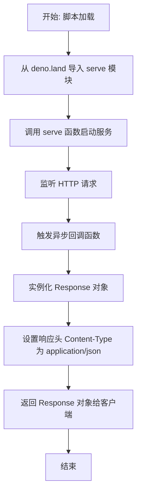

# `.\AutoGPT\autogpt_platform\db\docker\volumes\functions\hello\index.ts` 详细设计文档

该代码利用 Deno 运行时的标准库启动一个简单的 HTTP 服务器，监听传入请求并直接返回一个包含固定问候语 'Hello from Edge Functions!' 的 JSON 格式响应。

## 整体流程



## 类结构

```
Global Scope (全局作用域)
└── Anonymous Arrow Function (匿名箭头函数 - 请求处理器)
```

## 全局变量及字段


    

## 全局函数及方法


## 关键组件


### HTTP 服务器

基于 Deno 标准库 `serve` 函数启动的 HTTP 服务器实例，负责监听端口并分发请求。

### 请求处理器

传递给服务器的异步回调函数，用于处理每个传入的 HTTP 请求，并构造包含问候语的响应。

### HTTP 响应

Web 标准 Response 对象，封装了响应体（JSON 字符串 "Hello from Edge Functions!"）以及指定的 `Content-Type` 头部信息。


## 问题及建议


### 已知问题

-   **请求处理逻辑缺失**：`serve` 的回调函数定义为 `async () =>`，未接收 `Request` 参数，导致无法访问 HTTP 方法、路径、Headers 或请求体。
-   **响应格式不规范**：虽然设置了 `Content-Type` 为 `application/json`，但实际返回的是一个 JSON 格式的字符串字面量，而非标准的 JSON 对象结构。
-   **缺乏错误处理与日志**：代码中没有任何 try-catch 块或日志输出，无法捕获运行时异常或记录请求信息，不利于生产环境的调试和监控。
-   **硬编码内容**：响应消息直接写在代码中，缺乏灵活性，任何修改都需要重新部署代码。

### 优化建议

-   **引入 Request 对象**：修改回调函数签名为 `async (req: Request) =>`，以便根据请求属性（如 URL 路由、Method）进行逻辑分发或处理。
-   **标准化 JSON 响应**：使用 `JSON.stringify` 返回结构化的 JSON 对象（例如 `{ "message": "..." }`），以符合 RESTful API 的常见约定。
-   **添加基础日志**：引入 `console.log` 或相关日志库记录请求接收和响应发送的情况。
-   **配置外部化**：将返回的消息文本提取到环境变量（通过 `Deno.env.get`）中，实现配置与代码的分离。


## 其它


### 设计目标与约束

**设计目标：**
1. 演示基于 Deno 运行时的 Edge Function 基础构建能力。
2. 展示如何通过 Deno 的 HTTP 服务器模块接收传入的 HTTP 请求。
3. 返回一个标准的 JSON 格式响应，确认服务正常运行。

**约束条件：**
1. **运行环境约束：** 代码必须在 Deno 运行时环境中执行，无法直接在 Node.js 或浏览器中原生运行（除非经过编译）。
2. **依赖版本约束：** 显式依赖 `https://deno.land/std@0.177.1/http/server.ts`，锁定标准库版本以确保行为一致性。
3. **无状态约束：** 当前设计为无状态服务，不依赖外部存储或内存中的会话状态，每个请求都是独立处理的。
4. **网络约束：** 需要外部网络环境来获取远程依赖库，并需要绑定端口对外提供服务。

### 错误处理与异常设计

**当前实现分析：**
代码中的异步回调函数 `async () => { ... }` 内部没有包含显式的 `try...catch` 错误捕获块。

**异常行为：**
1. 如果在 `Response` 构造过程中发生错误（例如内存溢出或不可预见的运行时错误），异常将向上抛出至 `serve` 函数的内部处理机制。
2. Deno 的 HTTP 服务器通常会在未捕获异常发生时关闭连接或返回 500 Internal Server Error，但不会返回自定义的错误信息。

**改进建议：**
为了增强系统的健壮性，建议在异步处理函数中包裹 `try...catch` 逻辑，确保即使在发生错误时，也能返回一个结构化的 JSON 错误响应，而不是让服务器崩溃或返回默认的 HTML 错误页面。

### 数据流与状态机

**数据流：**
1. **输入阶段：** 客户端发起 HTTP 请求（如 GET 请求）。
2. **接收阶段：** Deno 的 `serve` 函数监听端口并接收请求，将其封装为标准的 `Request` 对象传递给处理回调。
3. **处理阶段：** 回调函数被调用，创建一个新的 `Response` 对象，设置状态码（默认 200）、Body（字符串内容）和 Headers（Content-Type: application/json）。
4. **输出阶段：** `serve` 函数将 `Response` 对象序列化并通过 HTTP 协议返回给客户端。

**状态机：**
该服务非常简单，主要包含以下状态：
1. **初始化状态：** Deno 脚本启动，导入模块，调用 `serve` 开始监听。
2. **监听状态：** 服务器处于就绪状态，等待连接。这是一个稳定状态，只要进程运行就会保持。
3. **请求处理状态：** 当收到请求时，短暂进入该状态，执行回调逻辑。
4. **销毁状态：** 进程终止时停止监听。

由于是无状态设计，每个请求处理完后立即回归到“监听状态”，不保留中间状态。

### 外部依赖与接口契约

**外部依赖：**
1. **名称：** `deno.land/std` (HTTP Server)
   - **描述：** Deno 官方标准库提供的 HTTP 服务器模块。
   - **版本：** 0.177.1
   - **作用：** 提供底层 TCP 监听、HTTP 请求解析和响应发送的能力。

**接口契约：**
1. **输入契约：**
   - **类型：** HTTP Request 对象 (遵循 Fetch API 标准)。
   - **描述：** 虽然当前代码未显式使用请求参数，但 `serve` 传递给回调的第一个参数即为请求对象，包含 URL、Method、Headers 等信息。

2. **输出契约：**
   - **类型：** HTTP Response 对象 (遵循 Fetch API 标准)。
   - **Content-Type：** `application/json`。
   - **Body 格式：** JSON 字符串（当前为 `"Hello from Edge Functions!"`）。
   - **描述：** 必须返回一个兼容 Web Standard 的 Response 实例，否则 Deno 运行时会抛出错误。

3. **基础设施契约：**
   - 根据注释 `To invoke`，该服务预期部署在 API 网关（如 Kong）之后，路径映射为 `/functions/v1/hello`。
   - 支持 Authorization Header 透传（虽然当前代码未验证它，但基础设施层预期会有该 Header）。

    