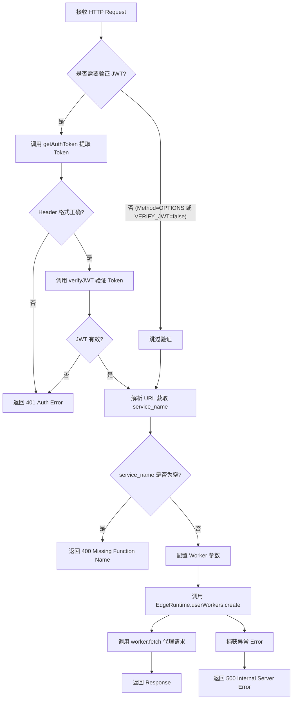
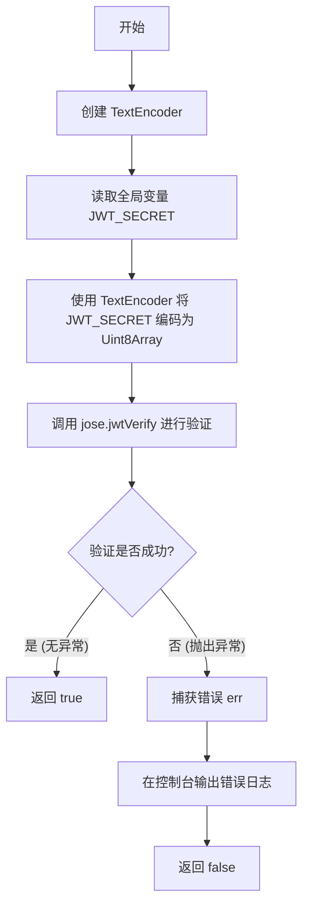
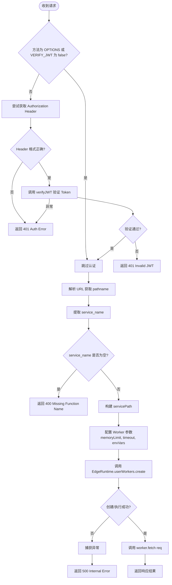

# `.\AutoGPT\autogpt_platform\db\docker\volumes\functions\main\index.ts` 详细设计文档

该代码实现了一个基于 Deno 的边缘函数网关，其核心功能是接收传入的 HTTP 请求，根据配置选择性地验证 JWT 身份认证，解析请求路径以确定目标服务名称，并动态创建 Edge Runtime Worker 将请求代理到指定的函数逻辑中处理。

## 整体流程



## 类结构

```
No Classes Defined (纯函数式脚本)
```

## 全局变量及字段


### `JWT_SECRET`
    
从环境变量中获取的用于验证JWT签名的密钥字符串

类型：`string | undefined`
    


### `VERIFY_JWT`
    
标识是否开启JWT验证功能的全局开关，当环境变量'TRUE'时启用

类型：`boolean`
    


    

## 全局函数及方法


### `getAuthToken`

该函数用于从传入的 HTTP 请求对象中提取 `authorization` 请求头，并验证其格式是否符合标准的 `Bearer {token}` 规范。如果格式正确，则返回提取的 Token 字符串；否则抛出错误。

参数：

- `req`：`Request`，包含 HTTP 请求信息的对象，用于访问请求头。

返回值：`string`，从 Authorization 头中解析出的 Token 字符串。

#### 流程图

```mermaid
graph TD
    A[开始] --> B[从 req.headers 获取 'authorization' 头]
    B --> C{authHeader 是否存在?}
    C -- 否 --> D[抛出错误: Missing authorization header]
    C -- 是 --> E[按空格分割头内容: bearer, token]
    E --> F{bearer 是否等于 'Bearer'?}
    F -- 否 --> G[抛出错误: Auth header is not 'Bearer {token}']
    F -- 是 --> H[返回 token]
```

#### 带注释源码

```typescript
function getAuthToken(req: Request) {
  // 从请求头中获取名为 'authorization' 的字段值
  const authHeader = req.headers.get('authorization')
  
  // 检查 authorization 头是否存在，如果不存在则抛出错误
  if (!authHeader) {
    throw new Error('Missing authorization header')
  }
  
  // 将 authorization 头按空格分割为两部分：类型（Bearer）和凭证（token）
  const [bearer, token] = authHeader.split(' ')
  
  // 检查第一部分是否严格等于 'Bearer'，用于符合 OAuth 2.0 规范
  if (bearer !== 'Bearer') {
    throw new Error(`Auth header is not 'Bearer {token}'`)
  }
  
  // 返回解析出的 token 字符串
  return token
}
```


### `verifyJWT`

该函数用于验证传入的 JSON Web Token (JWT) 字符串的有效性。它利用从环境变量中获取的密钥对令牌进行校验，通过异步操作返回验证结果，能够处理验证过程中的异常情况。

参数：

- `jwt`：`string`，需要进行有效性验证的 JSON Web Token 字符串。

返回值：`Promise<boolean>`，返回一个 Promise 对象，解析为 `true` 表示 JWT 有效，解析为 `false` 表示 JWT 无效或验证过程出错。

#### 流程图



#### 带注释源码

```typescript
async function verifyJWT(jwt: string): Promise<boolean> {
  // 创建一个 TextEncoder 实例，用于将字符串转换为 Uint8Array 格式的密钥
  const encoder = new TextEncoder()
  // 从环境变量获取 JWT_SECRET，并将其编码为 Uint8Array
  const secretKey = encoder.encode(JWT_SECRET)
  
  try {
    // 使用 jose 库的 jwtVerify 方法异步验证 JWT 是否有效且未被篡改
    await jose.jwtVerify(jwt, secretKey)
  } catch (err) {
    // 如果验证失败（如签名错误、过期等），捕获错误并打印到控制台
    console.error(err)
    // 验证失败，返回 false
    return false
  }
  // 验证成功，返回 true
  return true
}
```


### `Anonymous Request Handler (serve callback)`

该函数是 Deno HTTP 服务器的主请求处理回调，负责拦截所有传入的 HTTP 请求。它首先根据环境配置决定是否进行 JWT 身份验证，接着解析请求路径以获取目标服务名称，最后动态创建并调用 EdgeRuntime Worker 来执行具体的业务逻辑，将请求代理给对应的函数服务并返回结果。

参数：

-   `req`：`Request`，表示传入的 HTTP 请求对象，包含请求头、方法和 URL 等信息。

返回值：`Promise<Response>`，返回一个 HTTP 响应对象，包含处理成功的数据、错误信息或 JWT 验证失败的状态码。

#### 流程图



#### 带注释源码

```typescript
serve(async (req: Request) => {
  // 步骤 1: 身份验证检查
  // 如果请求方法不是 OPTIONS (预检请求) 且环境变量开启了 JWT 验证
  if (req.method !== 'OPTIONS' && VERIFY_JWT) {
    try {
      // 从请求头中提取 Bearer Token
      const token = getAuthToken(req)
      // 验证 Token 的有效性
      const isValidJWT = await verifyJWT(token)

      // 如果 Token 无效，返回 401 Unauthorized
      if (!isValidJWT) {
        return new Response(JSON.stringify({ msg: 'Invalid JWT' }), {
          status: 401,
          headers: { 'Content-Type': 'application/json' },
        })
      }
    } catch (e) {
      // 如果获取 Token 或验证过程出错，返回 401
      console.error(e)
      return new Response(JSON.stringify({ msg: e.toString() }), {
        status: 401,
        headers: { 'Content-Type': 'application/json' },
      })
    }
  }

  // 步骤 2: 路由解析
  // 解析请求 URL
  const url = new URL(req.url)
  const { pathname } = url
  const path_parts = pathname.split('/')
  // 假设路径格式为 /service_name/...，提取服务名称
  const service_name = path_parts[1]

  // 如果缺少服务名称，返回 400 Bad Request
  if (!service_name || service_name === '') {
    const error = { msg: 'missing function name in request' }
    return new Response(JSON.stringify(error), {
      status: 400,
      headers: { 'Content-Type': 'application/json' },
    })
  }

  // 步骤 3: 动态函数调用
  // 构建服务文件的物理路径
  const servicePath = `/home/deno/functions/${service_name}`
  console.error(`serving the request with ${servicePath}`)

  // 配置 Worker 运行时参数
  const memoryLimitMb = 150
  const workerTimeoutMs = 1 * 60 * 1000
  const noModuleCache = false
  const importMapPath = null
  // 将当前环境变量转换为键值对数组
  const envVarsObj = Deno.env.toObject()
  const envVars = Object.keys(envVarsObj).map((k) => [k, envVarsObj[k]])

  try {
    // 创建并启动 EdgeRuntime User Worker
    const worker = await EdgeRuntime.userWorkers.create({
      servicePath,
      memoryLimitMb,
      workerTimeoutMs,
      noModuleCache,
      importMapPath,
      envVars,
    })
    // 将原始请求转发给 Worker 并返回结果
    return await worker.fetch(req)
  } catch (e) {
    // 如果 Worker 创建或执行出错，返回 500 Internal Server Error
    const error = { msg: e.toString() }
    return new Response(JSON.stringify(error), {
      status: 500,
      headers: { 'Content-Type': 'application/json' },
    })
  }
})
```


## 关键组件


### JWT 认证模块
负责处理 HTTP 请求的认证逻辑。它从 `Authorization` 请求头中提取 Bearer token，利用环境变量中的 `JWT_SECRET` 通过 `jose` 库进行验证，并根据 `VERIFY_JWT` 标志决定是否强制执行认证，验证失败则返回 401 状态码。

### 请求路由解析
负责解析传入请求的 URL 路径，提取目标服务名称（即路径的第一部分）。该名称用于定位需要调用的具体服务代码，若服务名称缺失则返回 400 错误。

### Worker 代理执行
负责动态创建并调用 Deno Worker 来执行具体的服务逻辑。它根据路由解析出的服务名称定位代码路径（`/home/deno/functions/`），配置内存限制、超时时间和环境变量，将原始请求转发给 Worker 进行处理，并捕获异常返回 500 错误。


## 问题及建议


### 已知问题

-   **严重的性能瓶颈（冷启动问题）**：代码在请求处理循环内部调用了 `EdgeRuntime.userWorkers.create`。这意味着每个请求都可能触发创建新的 Worker 实例或隔离环境，导致极高的资源消耗和延迟，无法满足高并发场景的需求。
-   **路径遍历安全风险**：`service_name` 直接从 URL 路径提取并拼接到文件系统路径 `/home/deno/functions/${service_name}` 中。缺乏对该变量进行校验或过滤（例如防止 `../`），攻击者可能利用此漏洞访问服务器上预期范围之外的文件。
-   **CORS 处理不完整**：代码仅跳过了 `OPTIONS` 方法的 JWT 验证，但并未返回标准的 CORS 响应头（如 `Access-Control-Allow-Origin`）。这会导致浏览器端的预检请求失败或前端无法正确读取响应。
-   **敏感信息泄露**：在错误处理中直接返回 `e.toString()`，可能会将内部的堆栈跟踪、库版本或文件路径等敏感信息暴露给客户端。
-   **日志记录不当**：在正常的请求流程中使用了 `console.error` 来记录服务路径（`serving the request with...`），这会污染错误日志，不利于运维监控和故障排查。

### 优化建议

-   **实现 Worker 缓存或池化机制**：应避免在每次请求时创建 Worker。建议实现一个缓存池，根据 `service_name` 缓存已创建的 Worker 实例，复用现有实例以显著提升响应速度和降低资源开销。
-   **增强输入验证与安全过滤**：对 `service_name` 实施严格的正则表达式校验（例如仅允许字母、数字、下划线和连字符），在构造文件路径之前确保其合法性，防止路径遍历攻击。
-   **外部化配置管理**：将硬编码的常量（如 `memoryLimitMb`, `workerTimeoutMs`, `servicePath` 等）移至环境变量或配置文件中，以提高系统的灵活性和可维护性。
-   **完善启动时的健康检查**：在服务启动阶段（而非请求处理阶段）验证关键环境变量（如 `JWT_SECRET`）的存在性和有效性，实现快速失败，防止运行时因配置错误导致不可预测的行为。
-   **引入中间件处理通用逻辑**：将 CORS 处理、日志记录和 JWT 验证逻辑抽离为独立的中间件函数，使主业务逻辑更加清晰，并确保 CORS 响应头的正确添加。
-   **规范化错误处理与日志**：使用结构化日志库替代 `console.log/error`，并统一错误响应格式，避免直接将异常对象抛出给客户端，仅返回用户友好的错误代码和消息。


## 其它


### 设计目标与约束

该模块旨在作为一个轻量级的边缘网关，负责将传入的 HTTP 请求动态路由到特定的 Deno 函数（Worker）中。
设计目标包括：
1.  **动态路由**：根据 URL 路径动态加载和执行目标服务函数，无需硬编码路由逻辑。
2.  **安全认证**：提供可选的 JWT 令牌验证层，确保只有持有有效令牌的请求才能通过。
3.  **资源隔离与限制**：通过配置内存限制和执行超时，防止个别函数占用过多资源或无限期挂起。

主要约束包括：
1.  **运行时环境**：必须运行在支持 `EdgeRuntime` 全局对象的特定 Deno 环境中（如 Supabase Edge Functions）。
2.  **资源限制**：每个 Worker 的内存限制硬编码为 150MB，执行超时限制为 60 秒（1分钟）。
3.  **文件系统依赖**：目标服务代码必须位于文件系统的 `/home/deno/functions/` 目录下。
4.  **配置依赖**：若启用 JWT 验证（`VERIFY_JWT=true`），则必须正确设置环境变量 `JWT_SECRET`，否则认证逻辑将失效或报错。

### 错误处理与异常设计

系统采用分层防御和统一的错误响应格式进行异常处理，确保错误信息对客户端透明且不泄露敏感的服务器端信息。

1.  **认证层错误 (401 Unauthorized)**：
    *   当请求缺少 `Authorization` 头、格式不正确（非 `Bearer {token}`）或 JWT 验证失败时，立即中断处理。
    *   捕获所有异常并返回状态码 401，响应体为 `{"msg": "error reason"}`。
2.  **输入验证错误 (400 Bad Request)**：
    *   当 URL 路径中未包含服务名称时，返回状态码 400，提示 "missing function name in request"。
3.  **运行时错误 (500 Internal Server Error)**：
    *   当 Worker 创建失败或 Worker 执行期间抛出未捕获异常时，返回状态码 500。
    *   响应体包含具体的错误信息字符串（`e.toString()`），便于调试，但在生产环境中通常应脱敏。
4.  **日志记录**：
    *   所有捕获的错误（认证错误、Worker 错误）均会通过 `console.error` 输出到标准错误流，便于链路追踪。

### 数据流与状态转换

该系统是无状态的，请求处理遵循线性流水线模型，不存在持久化的状态机。数据流向如下：

1.  **请求接收**：HTTP 请求进入服务器。
2.  **认证检查（条件分支）**：
    *   检查 `VERIFY_JWT` 环境变量及请求方法（跳过 OPTIONS 预检请求）。
    *   若需验证，提取 Header 中的 Token 并调用 `jose` 库验证。
    *   *转换*：请求从未认证状态转为已认证状态，或直接拒绝。
3.  **路由解析**：解析 URL 获取 `pathname`，提取第一段作为 `service_name`。
4.  **Worker 实例化**：
    *   构建配置对象（包含环境变量、内存限制等）。
    *   调用 `EdgeRuntime.userWorkers.create` 生成 Worker 实例。
5.  **请求代理**：将原始 Request 对象传递给 Worker 的 `fetch` 方法。
6.  **响应返回**：接收 Worker 的处理结果并直接作为 HTTP 响应返回给客户端。

### 外部依赖与接口契约

代码依赖于以下外部库和环境接口，并遵循特定的契约：

1.  **Deno 标准库 (`std/http/server.ts`)**：
    *   **依赖项**：`serve` 函数。
    *   **契约**：接收一个回调函数 `(req: Request) => Response | Promise<Response>`，用于启动 HTTP 服务器。
2.  **JOSE 库 (`deno.land/x/jose`)**：
    *   **依赖项**：`jose.jwtVerify`。
    *   **契约**：接收 JWT 字符串和 Uint8Array 格式的密钥，异步返回验证结果或抛出异常。
3.  **Edge Runtime (环境特定)**：
    *   **依赖项**：全局对象 `EdgeRuntime.userWorkers`。
    *   **契约**：`create` 方法接收配置对象（`servicePath`, `memoryLimitMb`, `workerTimeoutMs`, `noModuleCache`, `importMapPath`, `envVars`），返回一个具有 `fetch(req: Request): Promise<Response>` 方法的 Worker 实例。
4.  **环境变量**：
    *   读取 `Deno.env` 获取 `JWT_SECRET`（字符串）和 `VERIFY_JWT`（字符串，需转换为布尔值）。

### 配置管理

系统通过环境变量和代码内常量进行配置管理，分为运行时配置和资源限制配置：

1.  **运行时环境变量**：
    *   `VERIFY_JWT`：控制是否启用 JWT 认证的全局开关。设为 `'true'` 时启用，其他值禁用。
    *   `JWT_SECRET`：用于签名和验证 JWT 的密钥。仅在启用认证时生效。
    *   `*` (其他变量)：所有其他环境变量会被收集并注入到子进程中，确保子 Worker 能访问相同的环境上下文。
2.  **硬编码常量**：
    *   `memoryLimitMb = 150`：定义 Worker 可用的最大堆内存。
    *   `workerTimeoutMs = 60000`：定义 Worker 的最大执行时间。
    *   `servicePath` 前缀：`/home/deno/functions/`，定义了函数代码的存储根目录。

    