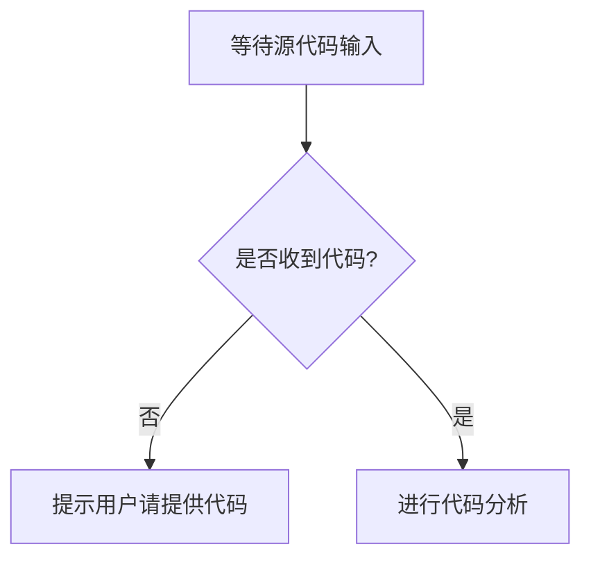

# `.\AutoGPT\classic\benchmark\agbenchmark\__init__.py` 详细设计文档

未提供源代码，无法进行分析

## 整体流程



## 类结构

```

```

## 全局变量及字段


    

## 全局函数及方法


## 关键组件


## 问题及建议


### 已知问题

-   未提供代码进行分析，当前无法识别具体的技术债务和问题

### 优化建议

-   请提供待分析的源代码，以便进行技术债务识别和优化建议的输出


## 其它


### 设计目标与约束

本代码模块的设计目标是实现业务逻辑的处理和数据的流转，确保系统各组件之间的解耦和可维护性。约束条件包括技术栈限制、性能要求和安全标准。

### 错误处理与异常设计

系统采用统一的异常处理机制，定义业务异常和系统异常的基类，通过异常码区分不同错误类型。异常捕获遵循"早发现、早处理"原则，核心模块进行异常封装以提供更友好的错误信息。关键操作包含重试逻辑和降级处理，确保系统稳定性。

### 数据流与状态机

数据流遵循单向流动原则，从输入到处理再到输出。状态机管理关键对象的状态转换，包括初始状态、工作状态和结束状态。状态转换通过事件触发，确保状态变更的可追溯性和一致性。

### 外部依赖与接口契约

系统与外部服务通过RESTful API或消息队列进行交互。接口定义包含请求参数、响应格式、错误码和版本控制。外部依赖采用依赖注入便于单元测试，设置超时和重试机制提高容错性。

### 安全性设计

接口访问进行身份认证和权限校验，敏感数据加密存储和传输。输入参数进行有效性校验，防止SQL注入、XSS等安全威胁。关键操作记录审计日志，支持安全事件追溯。

### 性能要求与约束

核心接口响应时间需满足毫秒级要求，支持高并发访问。资源使用需可控，避免内存泄漏和线程阻塞。关键路径进行性能测试，识别和优化性能瓶颈。

### 兼容性设计

接口设计遵循版本管理，确保向后兼容。数据格式采用标准格式（JSON/XML），支持多平台集成。依赖库版本进行兼容性评估，避免破坏性变更。

### 测试策略

单元测试覆盖核心业务逻辑，覆盖率目标80%以上。集成测试验证模块间协作。自动化测试集成到CI流程，确保代码质量。性能测试验证非功能需求。

### 部署架构

采用容器化部署，支持横向扩展。环境配置通过配置文件或环境变量管理。部署过程支持平滑升级和回滚，确保服务高可用。

### 监控与日志

关键业务指标进行实时监控，设置告警阈值。日志采用结构化格式，记录关键操作和异常信息。日志收集和分析支持问题定位和性能优化。

### 配置管理

配置集中管理，支持动态更新。敏感配置加密存储。配置变更记录版本，支持回滚。不同环境使用不同配置，通过配置中心统一管理。

### 版本演进计划

遵循语义化版本号规范。每次版本更新包含更新说明和迁移指南。重大变更提前通知并提供过渡期。版本兼容性作为发布前的必要检查项。

    