# `.\AutoGPT\classic\benchmark\agbenchmark\__main__.py` 详细设计文档

AGBenchmark CLI工具，提供命令行接口用于运行代理基准测试、列出挑战、查看配置和启动API服务。

## 整体流程

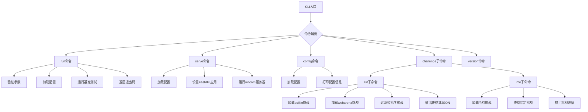

## 类结构

```
CLI Application (基于Click框架)
├── 主命令组: cli
│   ├── 默认命令: run
│   ├── 子命令: serve
│   ├── 子命令: config
│   ├── 子命令: version
│   └── 子命令组: challenge
│       ├── 子命令: list
│       └── 子命令: info
异常类: InvalidInvocationError
```

## 全局变量及字段


### `logger`
    
用于记录模块日志的Logger实例，通过logging.getLogger(__name__)初始化

类型：`logging.Logger`
    


### `BENCHMARK_START_TIME_DT`
    
当前UTC时区的datetime对象，记录基准测试的开始时间

类型：`datetime.datetime`
    


### `BENCHMARK_START_TIME`
    
格式化后的基准测试开始时间字符串，格式为ISO 8601标准（YYYY-MM-DDTHH:MM:SS+00:00）

类型：`str`
    


    

## 全局函数及方法


### `cli`

这是 AGBenchmark 应用程序的入口命令组函数，负责配置日志系统并根据用户输入的 debug 标志设置日志级别，同时作为所有子命令的根容器。

参数：

- `debug`：`bool`，一个布尔标志，用于启用或禁用调试输出。当设置为 True 时，日志级别会被设置为 DEBUG，否则设置为 INFO。

返回值：`Any`，该函数没有显式的返回值，主要通过装饰器 `@click.group` 注册为 Click 命令组。

#### 流程图

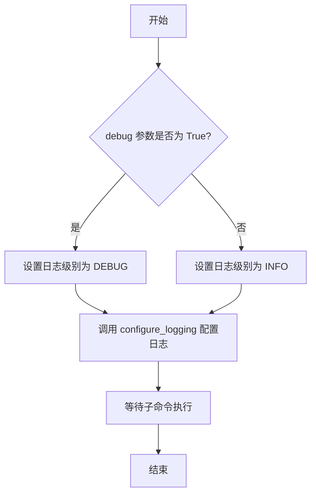

#### 带注释源码

```python
# 导入日志模块
import logging
import os
import sys
from datetime import datetime, timezone
from pathlib import Path
from typing import Any, Optional

# 导入 Click 框架及其默认组扩展
import click
from click_default_group import DefaultGroup
# 导入 dotenv 用于加载环境变量
from dotenv import load_dotenv

# 从配置模块导入 AgentBenchmarkConfig
from agbenchmark.config import AgentBenchmarkConfig
# 从工具模块导入日志配置函数
from agbenchmark.utils.logging import configure_logging

# 加载 .env 文件中的环境变量
load_dotenv()

# 定义一个自定义异常类，用于处理无效的调用错误
class InvalidInvocationError(ValueError):
    pass

# 获取当前模块的日志记录器
logger = logging.getLogger(__name__)

# 记录基准测试的开始时间（UTC 时区）
BENCHMARK_START_TIME_DT = datetime.now(timezone.utc)
BENCHMARK_START_TIME = BENCHMARK_START_TIME_DT.strftime("%Y-%m-%dT%H:%M:%S+00:00")


# 使用 Click 框架定义命令组，default_if_no_args=True 表示没有参数时执行默认命令
@click.group(cls=DefaultGroup, default_if_no_args=True)
# 定义 --debug 选项，是一个布尔标志
@click.option("--debug", is_flag=True, help="Enable debug output")
def cli(
    debug: bool,
) -> Any:
    """
    配置日志系统并作为命令组的入口点。
    
    参数:
        debug: 一个布尔值，当为 True 时启用 DEBUG 级别的日志输出，
               否则使用 INFO 级别。
    
    返回值:
        返回 Any 类型，实际上该函数主要通过装饰器注册命令，
        不返回具体值。
    """
    # 根据 debug 标志配置日志级别：DEBUG 或 INFO
    configure_logging(logging.DEBUG if debug else logging.INFO)
```


### `cli.run`

这是 CLI 的默认命令，用于在当前目录中对代理运行基准测试。它加载配置、验证参数，然后根据 `--backend` 标志要么将日志输出重定向到文件，要么正常运行基准测试，并支持多种过滤选项来选择要运行的测试、类别和挑战类型。

参数：

- `maintain`：`bool`，运行仅回归测试
- `improve`：`bool`，运行仅非回归测试
- `explore`：`bool`，运行从未被击败的挑战
- `mock`：`bool`，使用 mock 运行
- `no_dep`：`bool`，无论依赖成功/失败都运行所有挑战
- `nc`：`bool`，禁用挑战时间限制
- `keep_answers`：`bool`，保留答案
- `test`：`tuple[str]`，选择要运行的测试
- `category`：`tuple[str]`，选择要运行的类别
- `skip_category`：`tuple[str]`，排除要运行的类别
- `attempts`：`int`，运行每个挑战的次数
- `cutoff`：`Optional[int]`，覆盖挑战时间限制（秒）
- `backend`：`Optional[bool]`，将日志输出写入文件而不是终端

返回值：`None`，无返回值（该函数通过 `sys.exit(exit_code)` 退出）

#### 流程图

```mermaid
flowchart TD
    A[开始 run 命令] --> B[加载 AgentBenchmarkConfig]
    B --> C[调用 validate_args 验证参数]
    C --> D{验证是否通过?}
    D -->|否| E[记录错误并 sys.exit(1)]
    D -->|是| F{backend 标志是否设置?}
    F -->|是| G[保存原始 sys.stdout]
    F -->|否| I[直接执行 run_benchmark]
    G --> H[打开 backend_stdout.txt 并重定向 sys.stdout]
    H --> J[执行 run_benchmark]
    J --> K[恢复原始 sys.stdout]
    K --> L[获取 exit_code]
    I --> L
    L --> M[sys.exit(exit_code)]
    
    style A fill:#f9f,stroke:#333
    style M fill:#f9f,stroke:#333
    style D fill:#ff9,stroke:#333
    style F fill:#ff9,stroke:#333
```

#### 带注释源码

```python
@cli.command(default=True)
@click.option(
    "-N", "--attempts", default=1, help="Number of times to run each challenge."
)
@click.option(
    "-c",
    "--category",
    multiple=True,
    help="(+) Select a category to run.",
)
@click.option(
    "-s",
    "--skip-category",
    multiple=True,
    help="(+) Exclude a category from running.",
)
@click.option("--test", multiple=True, help="(+) Select a test to run.")
@click.option("--maintain", is_flag=True, help="Run only regression tests.")
@click.option("--improve", is_flag=True, help="Run only non-regression tests.")
@click.option(
    "--explore",
    is_flag=True,
    help="Run only challenges that have never been beaten.",
)
@click.option(
    "--no-dep",
    is_flag=True,
    help="Run all (selected) challenges, regardless of dependency success/failure.",
)
@click.option("--cutoff", type=int, help="Override the challenge time limit (seconds).")
@click.option("--nc", is_flag=True, help="Disable the challenge time limit.")
@click.option("--mock", is_flag=True, help="Run with mock")
@click.option("--keep-answers", is_flag=True, help="Keep answers")
@click.option(
    "--backend",
    is_flag=True,
    help="Write log output to a file instead of the terminal.",
)
def run(
    maintain: bool,
    improve: bool,
    explore: bool,
    mock: bool,
    no_dep: bool,
    nc: bool,
    keep_answers: bool,
    test: tuple[str],
    category: tuple[str],
    skip_category: tuple[str],
    attempts: int,
    cutoff: Optional[int] = None,
    backend: Optional[bool] = False,
    # agent_path: Optional[Path] = None,
) -> None:
    """
    Run the benchmark on the agent in the current directory.

    Options marked with (+) can be specified multiple times, to select multiple items.
    """
    # 导入必要的函数，在函数内部延迟导入以避免循环依赖
    from agbenchmark.main import run_benchmark, validate_args

    # 加载 AgentBenchmarkConfig 配置对象
    agbenchmark_config = AgentBenchmarkConfig.load()
    logger.debug(f"agbenchmark_config: {agbenchmark_config.agbenchmark_config_dir}")
    
    # 尝试验证传入的参数是否合法
    try:
        validate_args(
            maintain=maintain,
            improve=improve,
            explore=explore,
            tests=test,
            categories=category,
            skip_categories=skip_category,
            no_cutoff=nc,
            cutoff=cutoff,
        )
    # 如果参数验证失败，捕获 InvalidInvocationError 异常
    except InvalidInvocationError as e:
        logger.error("Error: " + "\n".join(e.args))
        sys.exit(1)

    # 保存原始标准输出，用于后续恢复
    original_stdout = sys.stdout
    exit_code = None

    # 如果 backend 标志被设置，将输出重定向到文件
    if backend:
        # 打开后端输出文件
        with open("backend/backend_stdout.txt", "w") as f:
            # 将标准输出重定向到文件
            sys.stdout = f
            # 执行基准测试
            exit_code = run_benchmark(
                config=agbenchmark_config,
                maintain=maintain,
                improve=improve,
                explore=explore,
                mock=mock,
                no_dep=no_dep,
                no_cutoff=nc,
                keep_answers=keep_answers,
                tests=test,
                categories=category,
                skip_categories=skip_category,
                attempts_per_challenge=attempts,
                cutoff=cutoff,
            )

        # 恢复原始标准输出
        sys.stdout = original_stdout

    else:
        # 直接执行基准测试（不重定向输出）
        exit_code = run_benchmark(
            config=agbenchmark_config,
            maintain=maintain,
            improve=improve,
            explore=explore,
            mock=mock,
            no_dep=no_dep,
            no_cutoff=nc,
            keep_answers=keep_answers,
            tests=test,
            categories=category,
            skip_categories=skip_category,
            attempts_per_challenge=attempts,
            cutoff=cutoff,
        )

        # 使用基准测试的退出码退出程序
        sys.exit(exit_code)
```


### `serve`

该函数是 AGBenchmark CLI 的一个命令，用于启动 FastAPI 应用服务器，提供基准测试前端和 API 服务，默认监听 8080 端口。

参数：

- `port`：`Optional[int]`，可选参数，用于指定服务运行的端口号。如果未提供，则从环境变量 `PORT` 读取，默认为 8080。

返回值：`None`，无返回值。

#### 流程图

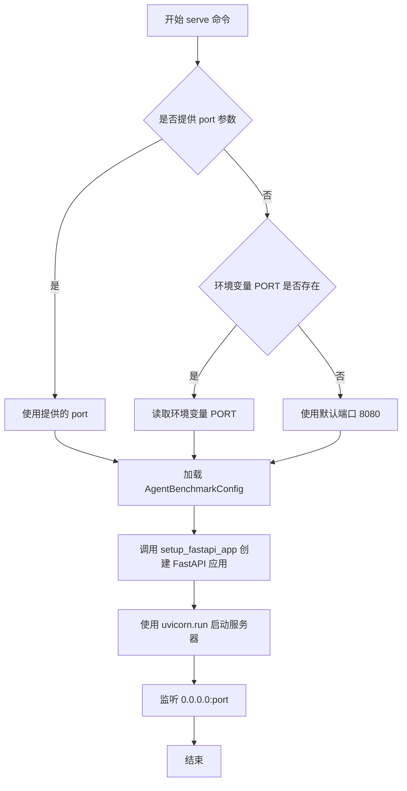

#### 带注释源码

```python
@cli.command()
@click.option("--port", type=int, help="Port to run the API on.")
def serve(port: Optional[int] = None):
    """Serve the benchmark frontend and API on port 8080."""
    # 动态导入 uvicorn，用于运行 ASGI 服务器
    import uvicorn

    # 从 agbenchmark.app 模块导入 FastAPI 应用设置函数
    from agbenchmark.app import setup_fastapi_app

    # 加载 AgentBenchmarkConfig 配置
    config = AgentBenchmarkConfig.load()
    
    # 创建 FastAPI 应用实例
    app = setup_fastapi_app(config)

    # 确定端口号：优先使用传入的 port 参数，其次尝试读取环境变量 PORT，最后使用默认值 8080
    port = port or int(os.getenv("PORT", 8080))
    
    # 使用 uvicorn 启动 FastAPI 应用，监听所有网络接口的指定端口
    uvicorn.run(app, host="0.0.0.0", port=port)
```


### `config`

该函数是 AGBenchmark CLI 的子命令，用于加载并以人类可读的方式显示当前项目的基准测试配置信息。

参数： 无

返回值：`int | None`，成功时返回 `None`，加载配置文件失败时返回 `1` 表示错误状态

#### 流程图

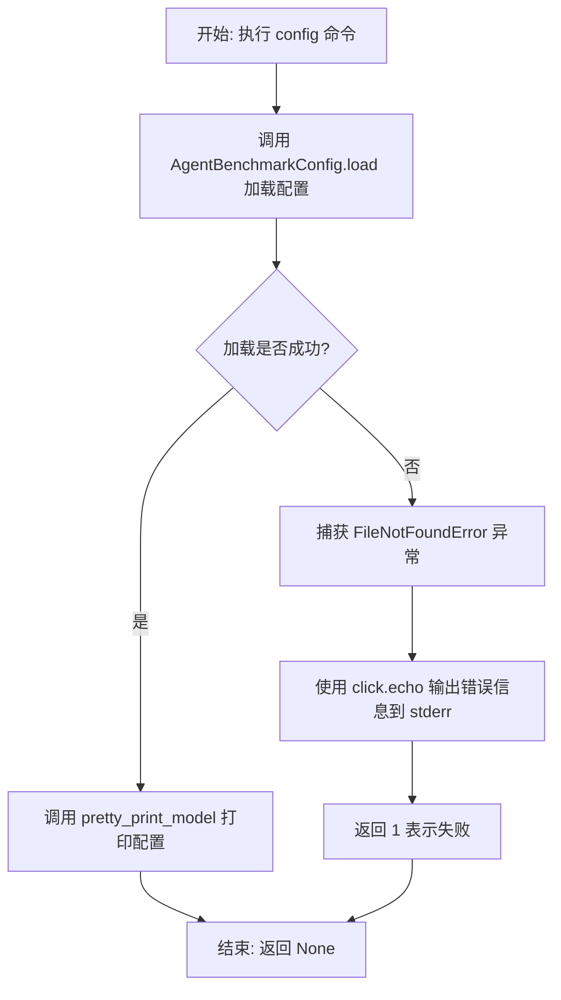

#### 带注释源码

```python
@cli.command()  # 定义 CLI 命令，名称为 'config'
def config():
    """Displays info regarding the present AGBenchmark config."""
    # 从 utils.utils 模块导入 pretty_print_model 函数，用于格式化输出配置对象
    from .utils.utils import pretty_print_model

    try:
        # 尝试加载 AGBenchmark 配置文件
        config = AgentBenchmarkConfig.load()
    except FileNotFoundError as e:
        # 如果配置文件不存在，输出错误信息到 stderr
        click.echo(e, err=True)
        # 返回 1 表示执行失败
        return 1

    # 使用 pretty_print_model 函数以友好格式打印配置内容
    # include_header=False 表示不打印表头
    pretty_print_model(config, include_header=False)
```


### `challenge`

`challenge` 是一个 Click 命令组（group），作为 AGBenchmark CLI 的子命令，用于管理和查看基准测试挑战（challenges）。它作为容器命令，包含了 `list` 和 `info` 两个子命令，分别用于列出挑战和查看挑战详细信息。

参数：无需直接参数（作为命令组入口）

返回值：`None`，无返回值（命令组不直接执行逻辑）

#### 流程图

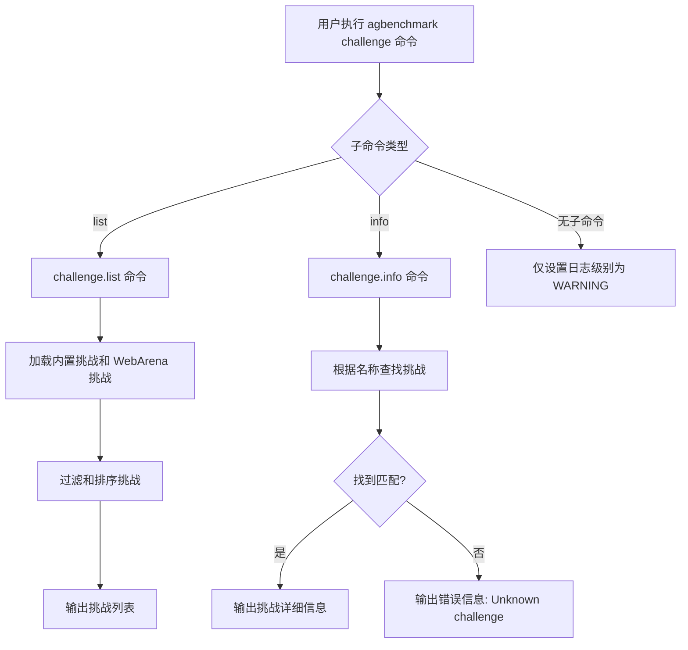

#### 带注释源码

```python
@cli.group()
def challenge():
    logging.getLogger().setLevel(logging.WARNING)
    # challenge 命令组入口，仅设置日志级别为 WARNING
    # 实际的子命令逻辑在 list_challenges 和 info 函数中实现
```

---

### `challenge.list`

列出所有可用的基准测试挑战。

参数：

- `include_unavailable`：`bool`，是否包含不可用的挑战
- `only_names`：`bool`，是否仅列出挑战名称
- `output_json`：`bool`，是否以 JSON 格式输出

返回值：`None`，无返回值（通过 `click.echo` 输出结果）

#### 流程图

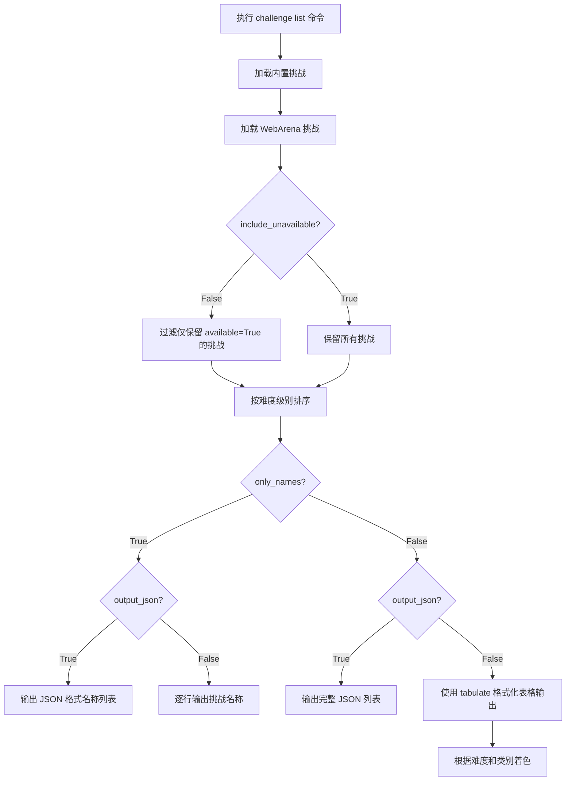

#### 带注释源码

```python
@challenge.command("list")
@click.option(
    "--all", "include_unavailable", is_flag=True, help="Include unavailable challenges."
)
@click.option(
    "--names", "only_names", is_flag=True, help="List only the challenge names."
)
@click.option("--json", "output_json", is_flag=True)
def list_challenges(include_unavailable: bool, only_names: bool, output_json: bool):
    """Lists [available|all] challenges."""
    import json
    from tabulate import tabulate

    # 导入挑战加载器和数据类型
    from .challenges.builtin import load_builtin_challenges
    from .challenges.webarena import load_webarena_challenges
    from .utils.data_types import Category, DifficultyLevel
    from .utils.utils import sorted_by_enum_index

    # 定义难度级别颜色映射
    DIFFICULTY_COLORS = {
        difficulty: color
        for difficulty, color in zip(
            DifficultyLevel,
            ["black", "blue", "cyan", "green", "yellow", "red", "magenta", "white"],
        )
    }
    # 定义类别颜色映射
    CATEGORY_COLORS = {
        category: f"bright_{color}"
        for category, color in zip(
            Category,
            ["blue", "cyan", "green", "yellow", "magenta", "red", "white", "black"],
        )
    }

    # 加载所有挑战（内置 + WebArena）
    challenges = filter(
        lambda c: c.info.available or include_unavailable,  # 根据标志过滤可用性
        [
            *load_builtin_challenges(),
            *load_webarena_challenges(skip_unavailable=False),
        ],
    )
    # 按难度级别排序
    challenges = sorted_by_enum_index(
        challenges, DifficultyLevel, key=lambda c: c.info.difficulty
    )

    # 仅输出名称模式
    if only_names:
        if output_json:
            click.echo(json.dumps([c.info.name for c in challenges]))
            return
        # 不可用的挑战显示为黑色
        for c in challenges:
            click.echo(
                click.style(c.info.name, fg=None if c.info.available else "black")
            )
        return

    # JSON 输出模式
    if output_json:
        click.echo(
            json.dumps([json.loads(c.info.model_dump_json()) for c in challenges])
        )
        return

    # 表格输出模式（默认）
    headers = tuple(
        click.style(h, bold=True) for h in ("Name", "Difficulty", "Categories")
    )
    table = [
        tuple(
            # 不可用的挑战值显示为黑色
            v if challenge.info.available else click.style(v, fg="black")
            for v in (
                challenge.info.name,
                # 难度带颜色或显示 "-"
                (
                    click.style(
                        challenge.info.difficulty.value,
                        fg=DIFFICULTY_COLORS[challenge.info.difficulty],
                    )
                    if challenge.info.difficulty
                    else click.style("-", fg="black")
                ),
                # 类别带颜色
                " ".join(
                    click.style(cat.value, fg=CATEGORY_COLORS[cat])
                    for cat in sorted_by_enum_index(challenge.info.category, Category)
                ),
            )
        )
        for challenge in challenges
    ]
    click.echo(tabulate(table, headers=headers))
```

---

### `challenge.info`

显示指定挑战的详细信息。

参数：

- `name`：`str`，挑战名称（必需参数）
- `json`：`bool`，是否以 JSON 格式输出

返回值：`None`，无返回值（通过 `click.echo` 输出结果）

#### 流程图

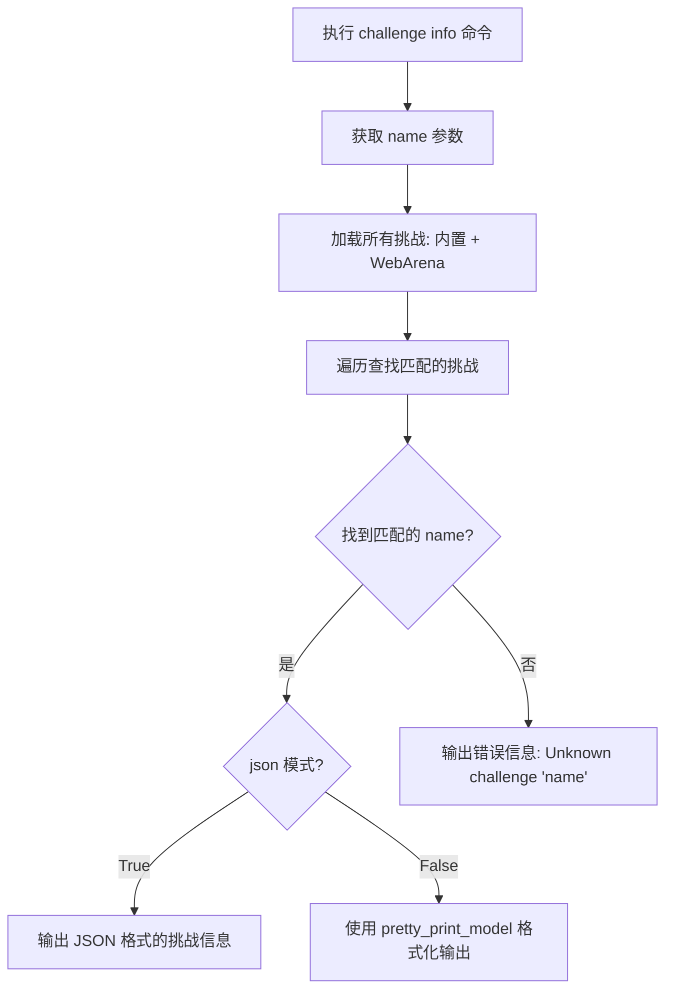

#### 带注释源码

```python
@challenge.command()
@click.option("--json", is_flag=True)
@click.argument("name")
def info(name: str, json: bool):
    """显示指定挑战的详细信息"""
    from itertools import chain

    # 导入挑战加载器和工具函数
    from .challenges.builtin import load_builtin_challenges
    from .challenges.webarena import load_webarena_challenges
    from .utils.utils import pretty_print_model

    # 遍历所有加载的挑战，查找匹配的名称
    for challenge in chain(
        load_builtin_challenges(),
        load_webarena_challenges(skip_unavailable=False),
    ):
        if challenge.info.name != name:
            continue  # 不匹配，继续查找

        # 找到匹配挑战
        if json:
            # JSON 模式：直接输出 JSON
            click.echo(challenge.info.model_dump_json())
            break

        # 人类可读模式：使用 pretty_print_model 格式化输出
        pretty_print_model(challenge.info)
        break
    else:
        # 未找到匹配的挑战，输出错误信息
        click.echo(click.style(f"Unknown challenge '{name}'", fg="red"), err=True)
```


### `list_challenges`

该函数是 AGBenchmark CLI 中 `challenge list` 命令的实现，用于列出所有可用的挑战。它支持按难度排序显示、以纯名称/JSON/表格三种形式输出，并可根据 `include_unavailable` 参数包含或排除不可用的挑战。

参数：

- `include_unavailable`：`bool`，是否包含不可用的挑战（通过 `--all` 选项控制）
- `only_names`：`bool`，是否仅列出挑战名称（通过 `--names` 选项控制）
- `output_json`：`bool`，是否以 JSON 格式输出（通过 `--json` 选项控制）

返回值：`None`，该函数通过 `click.echo` 直接输出结果，无返回值

#### 流程图

```mermaid
flowchart TD
    A[开始] --> B[定义DIFFICULTY_COLORS颜色映射]
    B --> C[定义CATEGORY_COLORS颜色映射]
    C --> D[加载builtin挑战和webarena挑战]
    D --> E{include_unavailable?}
    E -->|No| F[过滤只保留available的挑战]
    E -->|Yes| G[保留所有挑战]
    F --> H[按难度排序]
    G --> H
    H --> I{only_names?}
    I -->|Yes| J{output_json?}
    I -->|No| K{output_json?}
    J -->|Yes| L[输出JSON格式的名称列表]
    J -->|No| M[逐行输出挑战名称,不可用的显示为黑色]
    M --> N[结束]
    L --> N
    K -->|Yes| O[输出JSON格式的完整挑战信息]
    K -->|No| P[构建表格: 名称 | 难度 | 分类]
    P --> Q[使用tabulate渲染表格并输出]
    Q --> N
```

#### 带注释源码

```python
@challenge.command("list")
@click.option(
    "--all", "include_unavailable", is_flag=True, help="Include unavailable challenges."
)
@click.option(
    "--names", "only_names", is_flag=True, help="List only the challenge names."
)
@click.option("--json", "output_json", is_flag=True)
def list_challenges(include_unavailable: bool, only_names: bool, output_json: bool):
    """Lists [available|all] challenges."""
    import json

    from tabulate import tabulate

    from .challenges.builtin import load_builtin_challenges
    from .challenges.webarena import load_webarena_challenges
    from .utils.data_types import Category, DifficultyLevel
    from .utils.utils import sorted_by_enum_index

    # 定义难度等级到终端颜色的映射，用于在输出时着色显示
    DIFFICULTY_COLORS = {
        difficulty: color
        for difficulty, color in zip(
            DifficultyLevel,
            ["black", "blue", "cyan", "green", "yellow", "red", "magenta", "white"],
        )
    }
    
    # 定义分类到终端颜色的映射，用于在输出时着色显示
    CATEGORY_COLORS = {
        category: f"bright_{color}"
        for category, color in zip(
            Category,
            ["blue", "cyan", "green", "yellow", "magenta", "red", "white", "black"],
        )
    }

    # 加载挑战：从builtin和webarena两个来源加载
    # filter根据available标志过滤，include_unavailable决定是否包含不可用的挑战
    challenges = filter(
        lambda c: c.info.available or include_unavailable,
        [
            *load_builtin_challenges(),
            *load_webarena_challenges(skip_unavailable=False),
        ],
    )
    
    # 按难度等级排序，使用sorted_by_enum_index保持枚举顺序
    challenges = sorted_by_enum_index(
        challenges, DifficultyLevel, key=lambda c: c.info.difficulty
    )

    # 如果只输出名称模式
    if only_names:
        # JSON格式输出名称列表
        if output_json:
            click.echo(json.dumps([c.info.name for c in challenges]))
            return

        # 逐行输出名称，不可用的显示为黑色
        for c in challenges:
            click.echo(
                click.style(c.info.name, fg=None if c.info.available else "black")
            )
        return

    # JSON格式输出完整挑战信息
    if output_json:
        click.echo(
            json.dumps([json.loads(c.info.model_dump_json()) for c in challenges])
        )
        return

    # 构建表格形式输出
    headers = tuple(
        click.style(h, bold=True) for h in ("Name", "Difficulty", "Categories")
    )
    table = [
        tuple(
            v if challenge.info.available else click.style(v, fg="black")
            for v in (
                challenge.info.name,
                (
                    click.style(
                        challenge.info.difficulty.value,
                        fg=DIFFICULTY_COLORS[challenge.info.difficulty],
                    )
                    if challenge.info.difficulty
                    else click.style("-", fg="black")
                ),
                " ".join(
                    click.style(cat.value, fg=CATEGORY_COLORS[cat])
                    for cat in sorted_by_enum_index(challenge.info.category, Category)
                ),
            )
        )
        for challenge in challenges
    ]
    # 使用tabulate库渲染表格并输出到终端
    click.echo(tabulate(table, headers=headers))
```


# AGBenchmark CLI 应用程序详细设计文档

## 1. 代码核心功能概述

AGBenchmark 是一个基于 Click 框架构建的基准测试 CLI 工具，用于对 AI Agent 进行自动化挑战测试，支持多种过滤条件（类别、难度、回归/非回归测试）、并发运行、Mock 模式、结果日志记录，并提供 Web API 服务前端界面。

---

### `cli`

CLI 主入口函数，作为 Click 命令组的默认处理函数。

参数：

- `debug`：`bool`，启用调试输出标志

返回值：`Any`，无明确返回值

#### 流程图

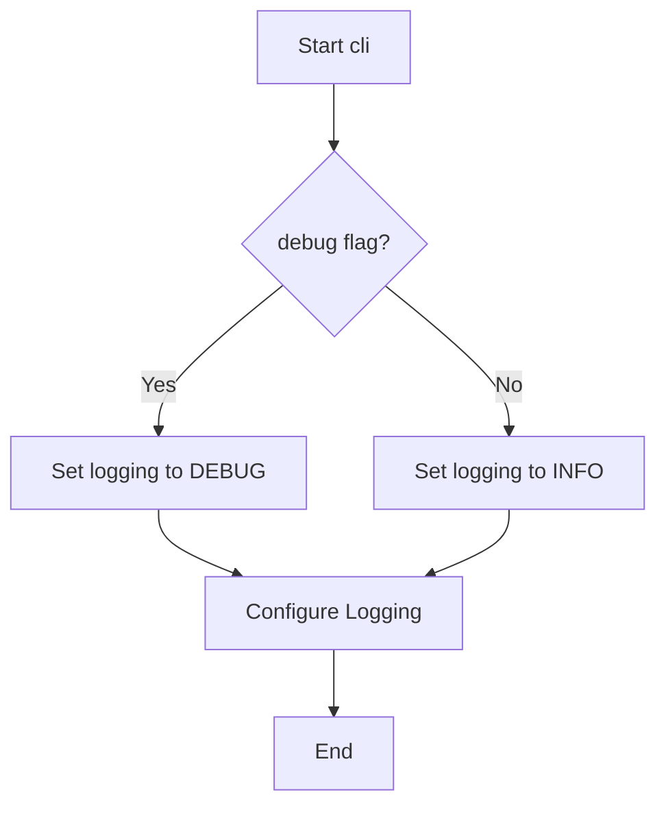

#### 带注释源码

```python
@click.group(cls=DefaultGroup, default_if_no_args=True)
@click.option("--debug", is_flag=True, help="Enable debug output")
def cli(
    debug: bool,
) -> Any:
    """CLI 主入口，根据 debug 参数配置日志级别"""
    configure_logging(logging.DEBUG if debug else logging.INFO)
```

---

### `run`

主基准测试运行命令，执行 Agent 挑战测试的核心逻辑。

参数：

- `maintain`：`bool`，仅运行回归测试标志
- `improve`：`bool`，仅运行非回归测试标志
- `explore`：`bool`，仅运行从未通过的挑战标志
- `mock`：`bool`，使用 Mock 模式运行标志
- `no_dep`：`bool`，忽略依赖成功/失败运行标志
- `nc`：`bool`，禁用挑战时间限制标志
- `keep_answers`：`bool`，保留答案标志
- `test`：`tuple[str]`，要运行的测试选择器
- `category`：`tuple[str]`，要运行的类别选择器
- `skip_category`：`tuple[str]`，要跳过的类别选择器
- `attempts`：`int`，每个挑战运行次数（默认 1）
- `cutoff`：`Optional[int]`，挑战时间限制覆盖值（秒）
- `backend`：`Optional[bool]`，是否将日志输出到文件（默认 False）

返回值：`None`，无返回值

#### 流程图

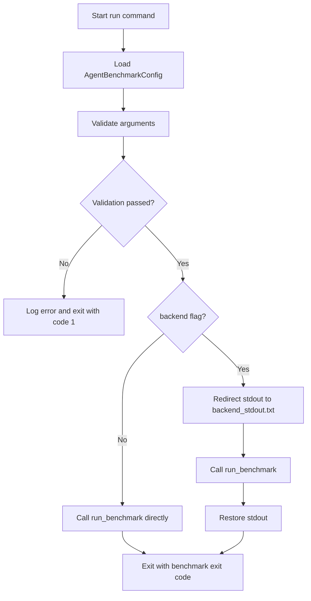

#### 带注释源码

```python
@cli.command(default=True)
@click.option("-N", "--attempts", default=1, help="Number of times to run each challenge.")
@click.option("-c", "--category", multiple=True, help="(+) Select a category to run.")
@click.option("-s", "--skip-category", multiple=True, help="(+) Exclude a category from running.")
@click.option("--test", multiple=True, help="(+) Select a test to run.")
@click.option("--maintain", is_flag=True, help="Run only regression tests.")
@click.option("--improve", is_flag=True, help="Run only non-regression tests.")
@click.option("--explore", is_flag=True, help="Run only challenges that have never been beaten.")
@click.option("--no-dep", is_flag=True, help="Run all challenges, regardless of dependency success/failure.")
@click.option("--cutoff", type=int, help="Override the challenge time limit (seconds).")
@click.option("--nc", is_flag=True, help="Disable the challenge time limit.")
@click.option("--mock", is_flag=True, help="Run with mock")
@click.option("--keep-answers", is_flag=True, help="Keep answers")
@click.option("--backend", is_flag=True, help="Write log output to a file instead of the terminal.")
def run(
    maintain: bool,
    improve: bool,
    explore: bool,
    mock: bool,
    no_dep: bool,
    nc: bool,
    keep_answers: bool,
    test: tuple[str],
    category: tuple[str],
    skip_category: tuple[str],
    attempts: int,
    cutoff: Optional[int] = None,
    backend: Optional[bool] = False,
) -> None:
    """Run the benchmark on the agent in the current directory."""
    # 动态导入，避免循环依赖
    from agbenchmark.main import run_benchmark, validate_args

    # 加载基准测试配置
    agbenchmark_config = AgentBenchmarkConfig.load()
    logger.debug(f"agbenchmark_config: {agbenchmark_config.agbenchmark_config_dir")
    
    # 参数验证，失败则记录错误并退出
    try:
        validate_args(
            maintain=maintain,
            improve=improve,
            explore=explore,
            tests=test,
            categories=category,
            skip_categories=skip_category,
            no_cutoff=nc,
            cutoff=cutoff,
        )
    except InvalidInvocationError as e:
        logger.error("Error: " + "\n".join(e.args))
        sys.exit(1)

    original_stdout = sys.stdout  # 保存原始标准输出
    exit_code = None

    # 根据 backend 标志决定输出目标
    if backend:
        # 将输出重定向到文件
        with open("backend/backend_stdout.txt", "w") as f:
            sys.stdout = f
            exit_code = run_benchmark(
                config=agbenchmark_config,
                maintain=maintain,
                improve=improve,
                explore=explore,
                mock=mock,
                no_dep=no_dep,
                no_cutoff=nc,
                keep_answers=keep_answers,
                tests=test,
                categories=category,
                skip_categories=skip_category,
                attempts_per_challenge=attempts,
                cutoff=cutoff,
            )

        sys.stdout = original_stdout  # 恢复标准输出
    else:
        # 直接运行基准测试
        exit_code = run_benchmark(
            config=agbenchmark_config,
            maintain=maintain,
            improve=improve,
            explore=explore,
            mock=mock,
            no_dep=no_dep,
            no_cutoff=nc,
            keep_answers=keep_answers,
            tests=test,
            categories=category,
            skip_categories=skip_category,
            attempts_per_challenge=attempts,
            cutoff=cutoff,
        )

        sys.exit(exit_code)  # 以基准测试退出码退出
```

---

### `serve`

启动 FastAPI Web 服务器，提供基准测试前端和 API 服务。

参数：

- `port`：`Optional[int]`，服务运行端口（默认从环境变量 PORT 读取或使用 8080）

返回值：`None`，无返回值

#### 流程图

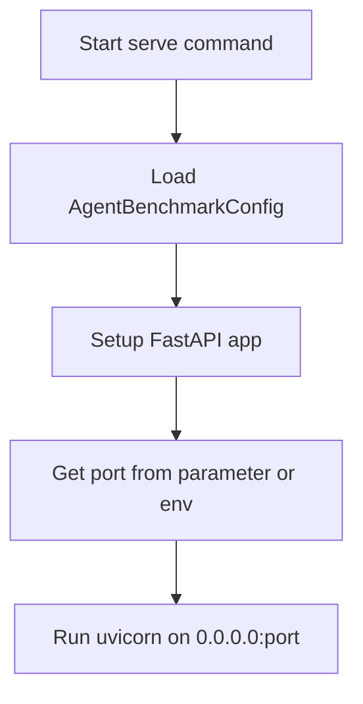

#### 带注释源码

```python
@cli.command()
@click.option("--port", type=int, help="Port to run the API on.")
def serve(port: Optional[int] = None):
    """Serve the benchmark frontend and API on port 8080."""
    import uvicorn

    from agbenchmark.app import setup_fastapi_app

    # 加载配置并初始化 FastAPI 应用
    config = AgentBenchmarkConfig.load()
    app = setup_fastapi_app(config)

    # 确定端口：优先使用参数，其次环境变量，最后默认 8080
    port = port or int(os.getenv("PORT", 8080))
    # 启动 uvicorn 服务器
    uvicorn.run(app, host="0.0.0.0", port=port)
```

---

### `list_challenges`

列出可用的基准测试挑战，支持多种过滤和输出格式。

参数：

- `include_unavailable`：`bool`，包含不可用挑战的标志
- `only_names`：`bool`，仅列出挑战名称的标志
- `output_json`：`bool`，JSON 格式输出的标志

返回值：`None`，无返回值

#### 流程图

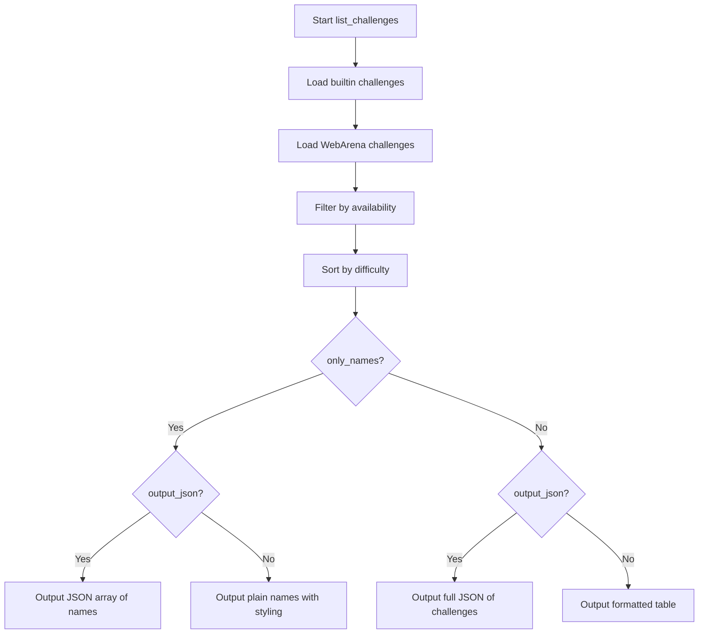

#### 带注释源码

```python
@challenge.command("list")
@click.option("--all", "include_unavailable", is_flag=True, help="Include unavailable challenges.")
@click.option("--names", "only_names", is_flag=True, help="List only the challenge names.")
@click.option("--json", "output_json", is_flag=True)
def list_challenges(include_unavailable: bool, only_names: bool, output_json: bool):
    """Lists [available|all] challenges."""
    import json
    from tabulate import tabulate

    from .challenges.builtin import load_builtin_challenges
    from .challenges.webarena import load_webarena_challenges
    from .utils.data_types import Category, DifficultyLevel
    from .utils.utils import sorted_by_enum_index

    # 定义难度和类别的颜色映射
    DIFFICULTY_COLORS = {
        difficulty: color
        for difficulty, color in zip(
            DifficultyLevel,
            ["black", "blue", "cyan", "green", "yellow", "red", "magenta", "white"],
        )
    }
    CATEGORY_COLORS = {
        category: f"bright_{color}"
        for category, color in zip(
            Category,
            ["blue", "cyan", "green", "yellow", "magenta", "red", "white", "black"],
        )
    }

    # 加载并过滤挑战
    challenges = filter(
        lambda c: c.info.available or include_unavailable,
        [
            *load_builtin_challenges(),
            *load_webarena_challenges(skip_unavailable=False),
        ],
    )
    # 按难度排序
    challenges = sorted_by_enum_index(
        challenges, DifficultyLevel, key=lambda c: c.info.difficulty
    )

    # 仅输出名称的处理分支
    if only_names:
        if output_json:
            click.echo(json.dumps([c.info.name for c in challenges]))
            return

        for c in challenges:
            # 不可用的挑战显示为黑色
            click.echo(
                click.style(c.info.name, fg=None if c.info.available else "black")
            )
        return

    # JSON 完整输出分支
    if output_json:
        click.echo(
            json.dumps([json.loads(c.info.model_dump_json()) for c in challenges])
        )
        return

    # 表格形式输出
    headers = tuple(
        click.style(h, bold=True) for h in ("Name", "Difficulty", "Categories")
    )
    table = [
        tuple(
            v if challenge.info.available else click.style(v, fg="black")
            for v in (
                challenge.info.name,
                (
                    click.style(
                        challenge.info.difficulty.value,
                        fg=DIFFICULTY_COLORS[challenge.info.difficulty],
                    )
                    if challenge.info.difficulty
                    else click.style("-", fg="black")
                ),
                " ".join(
                    click.style(cat.value, fg=CATEGORY_COLORS[cat])
                    for cat in sorted_by_enum_index(challenge.info.category, Category)
                ),
            )
        )
        for challenge in challenges
    ]
    click.echo(tabulate(table, headers=headers))
```

---

### `info`

显示指定挑战的详细信息。

参数：

- `name`：`str`，挑战名称
- `json`：`bool`，JSON 格式输出标志

返回值：`None`，无返回值

#### 流程图

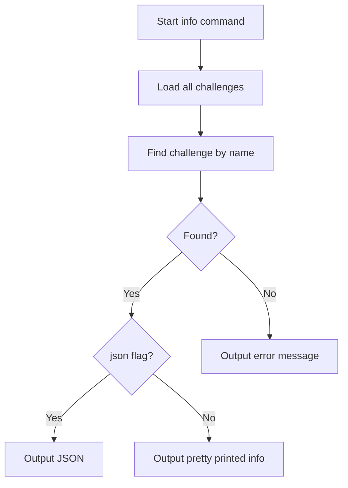

#### 带注释源码

```python
@challenge.command()
@click.option("--json", is_flag=True)
@click.argument("name")
def info(name: str, json: bool):
    """Display information about a specific challenge."""
    from itertools import chain

    from .challenges.builtin import load_builtin_challenges
    from .challenges.webarena import load_webarena_challenges
    from .utils.utils import pretty_print_model

    # 遍历所有加载的挑战，查找匹配名称
    for challenge in chain(
        load_builtin_challenges(),
        load_webarena_challenges(skip_unavailable=False),
    ):
        if challenge.info.name != name:
            continue

        if json:
            # JSON 格式输出
            click.echo(challenge.info.model_dump_json())
            break

        # 美化打印输出
        pretty_print_model(challenge.info)
        break
    else:
        # 未找到挑战
        click.echo(click.style(f"Unknown challenge '{name}'", fg="red"), err=True)
```

---

### `config`

显示当前 AGBenchmark 配置信息。

参数：无

返回值：`int`，成功返回 0，文件未找到返回 1

#### 带注释源码

```python
@cli.command()
def config():
    """Displays info regarding the present AGBenchmark config."""
    from .utils.utils import pretty_print_model

    try:
        config = AgentBenchmarkConfig.load()
    except FileNotFoundError as e:
        # 配置文件不存在时输出错误并返回 1
        click.echo(e, err=True)
        return 1

    pretty_print_model(config, include_header=False)
```

---

### `version`

打印 AGBenchmark 应用程序的版本信息。

参数：无

返回值：`None`，无返回值

#### 带注释源码

```python
@cli.command()
def version():
    """Print version info for the AGBenchmark application."""
    import toml

    # 从 pyproject.toml 读取版本信息
    package_root = Path(__file__).resolve().parent.parent
    pyproject = toml.load(package_root / "pyproject.toml")
    version = pyproject["tool"]["poetry"]["version"]
    click.echo(f"AGBenchmark version {version}")
```

---

### `InvalidInvocationError`

自定义异常类，用于参数验证失败时抛出。

参数：

- `args`：`ValueError`，继承自 ValueError

#### 带注释源码

```python
class InvalidInvocationError(ValueError):
    """当 CLI 参数验证失败时抛出的异常"""
    pass
```

---

## 关键组件信息

| 组件名称 | 一句话描述 |
|---------|-----------|
| `AgentBenchmarkConfig` | 基准测试配置加载与管理类 |
| `run_benchmark` | 执行基准测试的核心函数（动态导入） |
| `validate_args` | CLI 参数验证函数（动态导入） |
| `setup_fastapi_app` | FastAPI 应用初始化函数（动态导入） |
| `load_builtin_challenges` | 加载内置挑战的函数 |
| `load_webarena_challenges` | 加载 WebArena 挑战的函数 |

---

## 潜在技术债务与优化空间

1. **动态导入的循环依赖风险**：`run`、`serve`、`config`、`list_challenges` 等函数内部使用动态导入（`from agbenchmark.main import ...`），这虽然解决了循环依赖问题，但增加了代码理解的难度，且在导入失败时错误信息不够直观。建议重构模块依赖结构。

2. **硬编码的端口和路径**：`serve` 函数中 `backend/backend_stdout.txt` 路径硬编码，缺乏灵活性。

3. **被注释掉的 Helicone 集成代码**：代码中有多处被注释掉的 Helicone 相关逻辑，表明曾经有第三方监控集成计划但已弃用，建议清理这些死代码。

4. **类型注解不完整**：`cli` 函数的返回值类型为 `Any`，不够精确。

5. **错误处理不一致**：部分函数（如 `run`）使用 `sys.exit()`，部分（如 `config`）返回状态码，建议统一错误处理模式。

6. **配置重复加载**：`serve` 和 `run` 命令都会加载 `AgentBenchmarkConfig`，可以考虑添加配置缓存机制。

---

## 其他项目

### 设计目标与约束

- **框架约束**：基于 Click 框架构建 CLI，支持默认命令组
- **配置管理**：使用 `dotenv` 加载环境变量，支持 `.env` 文件配置
- **日志系统**：统一的日志配置管理，支持 Debug/Info 级别切换

### 错误处理与异常设计

- 使用自定义 `InvalidInvocationError` 进行参数验证错误报告
- 验证失败时记录错误日志并以退出码 1 终止程序
- 文件未找到等异常使用 Click 的 `echo(err=True)` 输出到 stderr

### 数据流与状态机

- CLI 参数 → 参数验证 → 配置加载 → 基准测试执行 → 结果输出
- 支持两种输出模式：终端直接输出（默认）和文件重定向（`--backend`）

### 外部依赖与接口契约

- **Click**：CLI 框架
- **uvicorn**：ASGI 服务器
- **toml**：配置文件解析
- **tabulate**：表格格式化输出
- **dotenv**：环境变量加载


### `version`

打印 AGBenchmark 应用程序的版本信息。

参数：

- 无

返回值：`None`，通过 `click.echo` 输出版本信息到标准输出

#### 流程图

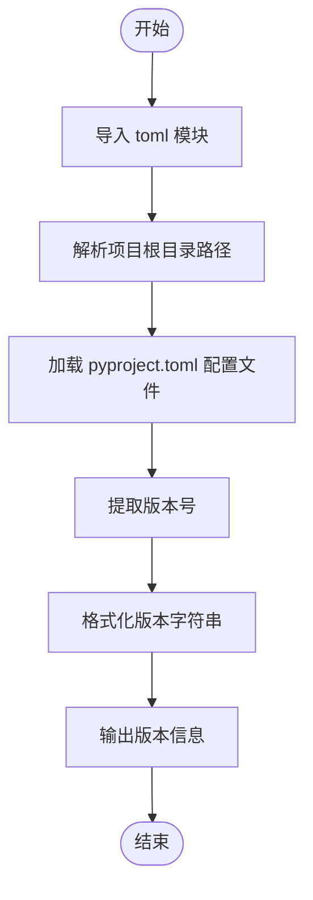

#### 带注释源码

```python
@cli.command()
def version():
    """Print version info for the AGBenchmark application."""
    # 动态导入 toml 模块，用于解析 TOML 格式的配置文件
    import toml

    # 获取当前文件 (__file__) 的绝对路径，然后获取其父目录的父目录作为项目根目录
    # __file__ 是当前 Python 文件的路径，resolve() 将其转换为绝对路径
    # .parent 获取父目录，.parent.parent 获取父目录的父目录（即项目根目录）
    package_root = Path(__file__).resolve().parent.parent

    # 使用 toml.load 加载项目根目录下的 pyproject.toml 文件
    # pyproject.toml 是 Python 项目的标准配置文件，包含项目元数据
    pyproject = toml.load(package_root / "pyproject.toml")

    # 从配置文件中提取版本号
    # pyproject 是一个字典，["tool"]["poetry"]["version"] 是 Poetry 工具配置中的版本字段
    version = pyproject["tool"]["poetry"]["version"]

    # 使用 click.echo 输出格式化的版本信息到标准输出
    # click.echo 是 click 框架提供的输出函数，自动处理跨平台换行符
    click.echo(f"AGBenchmark version {version}")
```


### `start`

该函数是一个已弃用的 CLI 命令，用于提示用户改用 `agbenchmark run` 命令。它不接受任何参数，执行时会抛出 `DeprecationWarning` 异常以通知用户该命令已过时。

参数：该函数没有参数。

返回值：该函数不返回值，会抛出 `DeprecationWarning` 异常。

#### 流程图

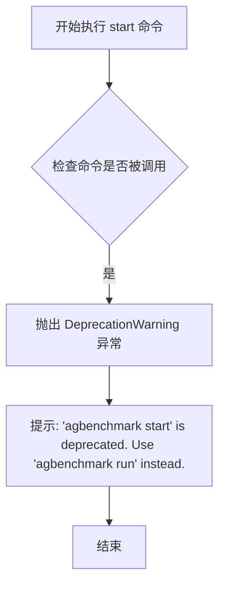

#### 带注释源码

```python
@cli.command(hidden=True)
def start():
    """
    已弃用的命令处理函数。
    
    该函数被标记为隐藏(hidden=True)，用户无法直接看到此命令。
    当用户尝试调用 'agbenchmark start' 时，会抛出弃用警告，
    引导用户使用新的 'agbenchmark run' 命令。
    """
    # 抛出弃用警告异常，提示用户使用新的命令
    raise DeprecationWarning(
        "`agbenchmark start` is deprecated. Use `agbenchmark run` instead."
    )
```

## 关键组件


### CLI 命令框架

使用 Click 框架构建的命令行界面，包含主命令组和多个子命令（run、serve、config、challenge、version），支持通过装饰器定义选项和参数。

### 基准测试运行器 (run 命令)

负责执行基准测试的核心命令，支持多种筛选选项（分类、跳过分类、测试选择、维护/改进/探索模式）、运行次数、截断时间等参数，并通过 `run_benchmark` 函数触发实际测试执行。

### API 服务器 (serve 命令)

基于 FastAPI 和 Uvicorn 搭建的 Web 服务器，默认监听 8080 端口，提供基准测试的前端和 API 服务。

### 挑战管理模块 (challenge 子命令)

包含 `list` 和 `info` 两个子命令，用于列出所有可用挑战及获取特定挑战的详细信息，支持 JSON 输出和颜色高亮。

### 配置加载器

通过 `AgentBenchmarkConfig.load()` 加载基准测试配置文件，并提供 `pretty_print_model` 函数以可读格式展示配置信息。

### 挑战数据加载器

`load_builtin_challenges()` 和 `load_webarena_challenges()` 函数负责从不同来源加载挑战数据，支持过滤可用状态和排序。

### 参数验证器

`validate_args()` 函数验证 CLI 传入的各选项参数是否合法，无效时抛出 `InvalidInvocationError` 异常。

### 日志配置系统

使用 Python logging 模块，通过自定义 `configure_logging()` 函数根据 debug 标志配置日志级别，支持输出到终端或文件。

### 数据类型定义

使用 `Category`（类别）和 `DifficultyLevel`（难度等级）枚举定义挑战的分类体系，用于挑战的元数据管理和排序。

### 版本信息读取器

从项目根目录的 `pyproject.toml` 文件中读取并显示 AGBenchmark 的版本号。


## 问题及建议


### 已知问题

-   **死代码（注释掉的代码）**：代码中包含大量注释掉的代码块，包括 helicone 相关功能、`agent_path` 参数等，这些代码既不执行也不清理，增加了代码维护负担。
-   **重复代码**：在 `run` 函数中，`run_benchmark` 的调用代码块重复了两次（分别在 `backend` 为 True 和 False 时），仅有输出重定向的差异，可通过提取公共逻辑优化。
-   **硬编码值**：`"backend/backend_stdout.txt"` 文件路径和端口 `8080` 被硬编码在多个地方，缺少配置化管理。
-   **导入位置不一致**：部分导入在模块顶部（如 `logging`, `os`, `sys`），部分在函数内部（如 `run_benchmark`, `setup_fastapi_app`），这种不一致的导入模式影响代码可读性。
-   **全局状态**：`BENCHMARK_START_TIME_DT` 和 `BENCHMARK_START_TIME` 作为模块级全局变量，在测试环境中可能导致副作用和不确定性。
-   **类型提示不够精确**：部分函数返回类型使用 `Any`（如 `cli` 函数），降低了类型安全和代码可维护性。
-   **错误处理不一致**：某些地方直接调用 `sys.exit(1)`，某些地方返回错误码（如 `config` 函数返回 `1`），缺乏统一的错误处理机制。
-   **参数验证不足**：例如 `attempts` 参数没有验证是否为正数，可能导致逻辑错误。

### 优化建议

-   **清理死代码**：删除所有注释掉的代码块，或使用版本控制系统保留历史记录。
-   **提取重复逻辑**：将 `run_benchmark` 的调用逻辑提取为一个私有方法或使用模板方法模式减少重复。
-   **配置化管理**：将硬编码的文件路径和端口号提取到配置类或环境变量中，使用 `AgentBenchmarkConfig` 统一管理。
-   **统一导入风格**：要么全部使用懒加载（函数内导入），要么全部在顶部导入，并添加注释说明选择的原因（如避免循环依赖）。
-   **改进全局状态管理**：将时间戳改为按需计算或通过依赖注入方式获取，便于测试。
-   **完善类型提示**：将 `cli` 函数的返回类型从 `Any` 改为 `None`，并为其他模糊类型添加更精确的提示。
-   **统一错误处理**：建立统一的异常处理机制和错误码规范，使用自定义异常类替代直接的 `sys.exit()` 调用。
-   **增强参数验证**：在 `run` 函数入口处添加参数校验逻辑，例如使用 `click.validators` 验证 `attempts > 0`。

## 其它


### 设计目标与约束

该代码是一个名为 AGBenchmark 的智能体基准测试工具的命令行界面（CLI）。其核心设计目标是提供一个统一的接口来运行、管理和展示 AI 智能体的基准测试挑战。主要约束包括：基于 Click 框架构建 CLI 应用；支持多种过滤条件（类别、难度、回归/非回归测试）；支持对挑战的多次尝试运行；支持将输出重定向到后端文件；通过 FastAPI 提供 Web 服务接口。

### 错误处理与异常设计

代码采用分层错误处理策略。在 CLI 层，通过捕获 `InvalidInvocationError` 并使用 `logger.error` 记录错误信息，最后调用 `sys.exit(1)` 返回错误退出码。对于配置加载失败（`FileNotFoundError`），在 `config` 命令中使用 `click.echo(e, err=True)` 向用户展示错误。对于已废弃的命令（如 `start`），抛出 `DeprecationWarning` 异常提示用户使用替代命令。整体采用 Python 异常机制结合日志系统进行错误传播和报告。

### 数据流与状态机

CLI 入口（`cli`）接收用户命令和参数 → 解析并验证参数（如 `validate_args`）→ 加载配置（`AgentBenchmarkConfig.load()`）→ 根据是否启用 `backend` 模式选择输出目标 → 调用核心业务逻辑 `run_benchmark` 执行基准测试 → 返回退出码。在 `backend=True` 时，标准输出被重定向到文件 `"backend/backend_stdout.txt"`，执行完成后恢复标准输出。

### 外部依赖与接口契约

该代码依赖以下外部包：`click`（CLI 框架）、`click_default_group`（默认命令组支持）、`uvicorn`（ASGI 服务器）、`dotenv`（环境变量加载）、`tabulate`（表格格式化）、`toml`（配置文件解析）。可选依赖 `helicone`（AI 观测平台）被注释保留。核心业务逻辑依赖 `agbenchmark.main` 模块的 `run_benchmark` 和 `validate_args` 函数，以及 `agbenchmark.app` 模块的 `setup_fastapi_app` 函数。

### 配置管理

使用 `AgentBenchmarkConfig` 类管理配置，通过 `AgentBenchmarkConfig.load()` 静态方法加载配置。环境变量通过 `load_dotenv()` 从 `.env` 文件加载。配置目录路径可通过 `agbenchmark_config.agbenchmark_config_dir` 访问。PORT 配置默认从环境变量读取（默认为 8080）。

### 日志策略

日志通过 `agbenchmark.utils.logging.configure_logging` 函数统一配置。CLI 接收 `--debug` 标志控制日志级别：启用时设置为 `logging.DEBUG`，否则设置为 `logging.INFO`。特定子命令（如 `challenge`）通过 `logging.getLogger().setLevel(logging.WARNING)` 降低其日志级别以减少输出噪音。

### 命令结构

CLI 采用命令组结构，默认组为 `cli`，默认命令为 `run`。主要命令包括：`run`（执行基准测试）、`serve`（启动 Web 服务）、`config`（显示配置信息）、`challenge`（挑战管理，包含 list 和 info 子命令）、`version`（显示版本信息）。`start` 命令已被废弃并隐藏。

### 潜在技术债务与优化空间

1. 注释掉的可选依赖 helicone 代码块应被移除或完善，以避免未来维护困惑。2. `backend` 选项使用了字符串路径 `"backend/backend_stdout.txt"`，应考虑配置化。3. `run` 函数参数较多（约 14 个），可考虑使用配置对象或配置类进行参数封装以提高可维护性。4. `serve` 命令中直接使用 `int(os.getenv("PORT", 8080))`，缺少异常处理，若环境变量格式错误可能导致崩溃。

### 关键组件信息

- **AgentBenchmarkConfig**：基准测试配置管理类，负责加载和提供配置。
- **run_benchmark**：核心基准测试执行函数，接受配置和各种运行参数。
- **setup_fastapi_app**：FastAPI 应用工厂函数，创建 Web 服务。
- **configure_logging**：日志配置函数，统一管理日志输出格式和级别。
- **validate_args**：参数验证函数，确保 CLI 参数组合合法。


    