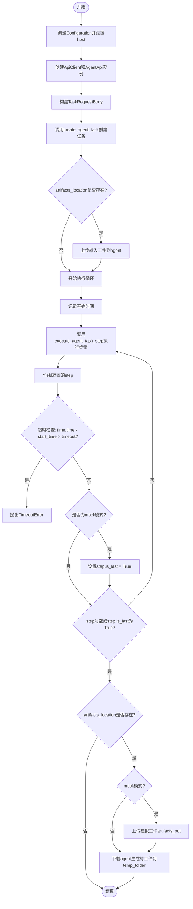
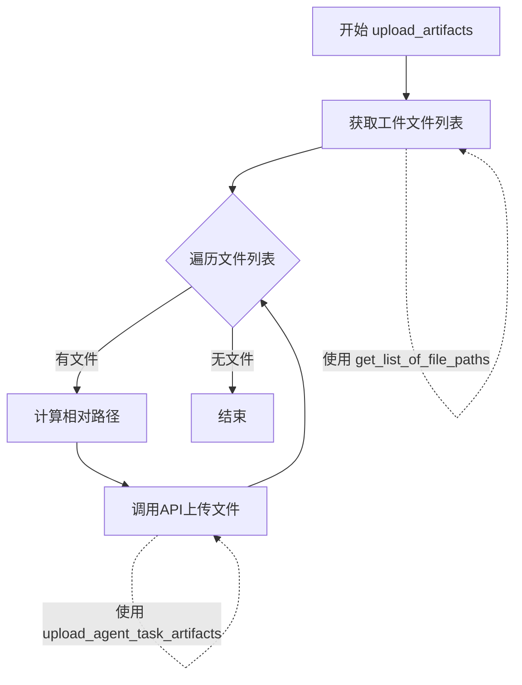

# `.\AutoGPT\classic\benchmark\agbenchmark\agent_api_interface.py` 详细设计文档

这是一个异步API代理运行器，用于在Agent Benchmark框架中通过外部Agent Protocol API创建任务、执行任务步骤、上传输入工件、下载输出工件，并处理超时和mock模式下的特殊逻辑。

## 整体流程

```mermaid
graph TD
    A[开始 run_api_agent] --> B[创建Configuration和ApiClient]
    B --> C[创建AgentApi实例]
    C --> D[创建TaskRequestBody]
    D --> E[调用create_agent_task创建任务]
    E --> F[获取task_id]
    F --> G{artifacts_location?}
    G -- 是 --> H[调用upload_artifacts上传输入工件]
    G -- 否 --> I[开始循环]
    H --> I
    I --> J[调用execute_agent_task_step执行步骤]
    J --> K[yield step返回步骤]
    K --> L{超时检查}
    L -- 是 --> M[抛出TimeoutError]
    L -- 否 --> N{mock模式?}
    N -- 是 --> O[设置is_last=True]
    N -- 否 --> P{step存在且非最后?]
    O --> P
    P -- 是 --> I
    P -- 否 --> Q{artifacts_location?}
    Q -- 否 --> R[结束]
    Q -- 是 --> S{mock模式?}
    S -- 是 --> T[上传mock输出工件]
    S -- 否 --> U[调用download_agent_artifacts_into_folder下载工件]
    T --> U
    U --> R
```

## 类结构

```
该文件为模块级实现
无自定义类定义
仅包含异步函数和导入的外部类型
```

## 全局变量及字段


### `logger`
    
模块级日志记录器，用于记录执行过程中的调试和信息日志

类型：`logging.Logger`
    


### `configuration`
    
Agent API配置对象，包含API服务端点等连接配置

类型：`Configuration`
    


### `api_client`
    
API客户端实例，管理HTTP连接和请求上下文

类型：`ApiClient`
    


### `api_instance`
    
Agent API操作实例，提供任务创建、执行和工件管理等API方法

类型：`AgentApi`
    


### `task_request_body`
    
任务请求体，包含任务输入和附加输入参数

类型：`TaskRequestBody`
    


### `start_time`
    
任务开始时间戳，用于计算任务执行是否超时

类型：`float`
    


### `response`
    
API响应对象，包含新创建任务的ID和状态信息

类型：`Task`
    


### `task_id`
    
任务唯一标识符，用于后续API调用的任务追踪

类型：`str`
    


### `step`
    
任务执行步骤对象，包含每一步的执行结果和状态标志

类型：`Step`
    


### `timeout`
    
超时时间参数，定义任务执行的最大允许时长（秒）

类型：`int`
    


### `artifacts`
    
工件列表，包含任务关联的所有文件工件对象

类型：`Artifacts`
    


### `artifact`
    
单个工件对象，包含文件名、相对路径和唯一标识符

类型：`Artifact`
    


### `path`
    
工件相对路径字符串，用于构建本地文件目录结构

类型：`str`
    


### `folder`
    
目标文件夹路径，指定工件下载或创建的目录位置

类型：`Path`
    


### `file_path`
    
文件完整路径，由文件夹和文件名组合而成的绝对路径

类型：`Path`
    


### `content`
    
工件二进制内容，从API下载的文件原始字节数据

类型：`bytes`
    


### `relative_path`
    
相对路径字符串，表示文件相对于工件类型的路径，可为空

类型：`Optional[str]`
    


    

## 全局函数及方法


### `run_api_agent`

这是一个异步生成器函数，核心功能是连接到Agent API并执行任务循环。它创建代理任务，上传输入工件，然后循环执行任务步骤直到完成或超时，同时yield每个步骤供调用者处理，最后下载生成的输出工件。

参数：

- `task`：`str`，要执行的任务描述
- `config`：`AgentBenchmarkConfig`，包含Agent API主机配置的配置对象
- `timeout`：`int`，任务执行的最大时间限制（秒）
- `artifacts_location`：`Optional[Path]`（可选），包含输入工件的目录路径
- `mock`：`bool`（关键字参数），模拟模式标志，设为True时在最后一步自动停止

返回值：`AsyncIterator[Step]`，一个异步迭代器，每次迭代yield一个Step对象表示代理执行的步骤

#### 流程图



#### 带注释源码

```python
import logging
import time
from pathlib import Path
from typing import AsyncIterator, Optional

from agent_protocol_client import (
    AgentApi,
    ApiClient,
    Configuration,
    Step,
    TaskRequestBody,
)

from agbenchmark.agent_interface import get_list_of_file_paths
from agbenchmark.config import AgentBenchmarkConfig

logger = logging.getLogger(__name__)


async def run_api_agent(
    task: str,
    config: AgentBenchmarkConfig,
    timeout: int,
    artifacts_location: Optional[Path] = None,
    *,
    mock: bool = False,
) -> AsyncIterator[Step]:
    """
    异步生成器：连接到Agent API并执行任务循环
    
    参数:
        task: 任务描述字符串
        config: AgentBenchmarkConfig配置对象，包含API host等信息
        timeout: 超时时间（秒）
        artifacts_location: 可选的输入工件目录路径
        mock: 关键字参数，是否使用mock模式
    
    返回:
        AsyncIterator[Step]: 异步迭代器，每次yield一个Step对象
    """
    # 根据配置创建API Configuration对象，设置Agent API的主机地址
    configuration = Configuration(host=config.host)
    # 使用async context manager创建ApiClient，确保资源正确释放
    async with ApiClient(configuration) as api_client:
        # 创建AgentApi实例用于调用API
        api_instance = AgentApi(api_client)
        # 构建任务请求体，包含任务输入和附加输入
        task_request_body = TaskRequestBody(input=task, additional_input=None)

        # 记录任务开始时间，用于超时检测
        start_time = time.time()
        # 调用API创建agent任务，获取task_id
        response = await api_instance.create_agent_task(
            task_request_body=task_request_body
        )
        task_id = response.task_id

        # 如果提供了artifacts_location，上传任务输入工件到agent
        if artifacts_location:
            logger.debug("Uploading task input artifacts to agent...")
            await upload_artifacts(
                api_instance, artifacts_location, task_id, "artifacts_in"
            )

        # 进入主循环：持续执行agent任务步骤直到完成或超时
        logger.debug("Running agent until finished or timeout...")
        while True:
            # 调用API执行下一个步骤
            step = await api_instance.execute_agent_task_step(task_id=task_id)
            # 将步骤yield给调用者（异步生成器特性）
            yield step

            # 检查是否超时
            if time.time() - start_time > timeout:
                raise TimeoutError("Time limit exceeded")
            
            # 如果是mock模式，标记最后一步以便提前结束
            if step and mock:
                step.is_last = True
            
            # 如果步骤为空或标记为最后一步，退出循环
            if not step or step.is_last:
                break

        # 任务执行完成后处理工件
        if artifacts_location:
            # 在mock模式下，跳过正常流程直接提供正确答案工件以便通过测试
            if mock:
                logger.debug("Uploading mock artifacts to agent...")
                await upload_artifacts(
                    api_instance, artifacts_location, task_id, "artifacts_out"
                )

            # 下载agent生成的输出工件到临时文件夹
            logger.debug("Downloading agent artifacts...")
            await download_agent_artifacts_into_folder(
                api_instance, task_id, temp_folder=config.temp_folder
            )
```

---

### 补充信息

#### 关键组件信息

| 组件名称 | 一句话描述 |
|---------|-----------|
| `AgentApi` | Agent Protocol客户端API封装类，提供与Agent服务交互的方法 |
| `Configuration` | 配置对象，存储Agent API的host等连接配置 |
| `ApiClient` | 异步API客户端，负责发起HTTP请求并处理响应 |
| `TaskRequestBody` | 任务请求体，包含任务输入和附加输入数据 |
| `Step` | 代表Agent执行过程中单个步骤的对象 |
| `upload_artifacts` | 辅助函数，用于将本地文件上传为Agent任务的工件 |
| `download_agent_artifacts_into_folder` | 辅助函数，用于将Agent生成的工件下载到本地目录 |

#### 潜在的技术债务或优化空间

1. **错误处理不足**：函数缺少对API调用异常的捕获和处理，如网络错误、认证失败等情况
2. **资源管理**：虽然使用了`async with`管理ApiClient，但未对超时异常情况进行清理
3. **日志级别**：debug级别的日志在生产环境可能不够详细，建议增加info级别的重要事件记录
4. **参数验证**：缺少对输入参数的有效性校验，如负数超时值、空任务描述等
5. **mock模式逻辑**：mock模式直接修改step.is_last属性可能影响调用者对步骤状态的判断

#### 其它项目

- **设计目标**：提供一个异步迭代接口，使调用者可以在Agent执行过程中实时获取每个步骤并进行处理
- **约束条件**：依赖`agent_protocol_client`库进行API通信，超时检测基于本地系统时间
- **数据流**：调用者输入任务描述 → API执行任务 → 实时yield步骤 → 最终下载输出工件
- **外部依赖**：需要Agent服务正常运行且可访问，依赖`agent_protocol_client`包和`agbenchmark`配置模块


### `download_agent_artifacts_into_folder`

该函数异步下载指定任务的所有工件到指定文件夹，处理相对路径并创建必要的目录结构。

参数：

- `api_instance`：`AgentApi`，用于与 Agent API 交互的 API 实例
- `task_id`：`str`，要下载工件的任务 ID
- `folder`：`Path`，要将工件下载到的目标文件夹路径

返回值：`None`，该函数直接写入文件，不返回任何内容

#### 流程图

```mermaid
flowchart TD
    A[开始] --> B[调用 list_agent_task_artifacts 获取任务工件列表]
    B --> C{遍历每个工件}
    C --> D{工件是否有 relative_path}
    D -->|是| E[处理相对路径<br/>移除前导 /]
    D -->|否| F[使用原始 folder]
    E --> G[计算目标文件夹<br/>folder = (folder / path).parent]
    F --> G
    G --> H{目标文件夹是否存在}
    H -->|否| I[创建文件夹<br/>mkdir parents=True]
    H -->|是| J[继续]
    I --> J
    J --> K[构建完整文件路径<br/>file_path = folder / file_name]
    K --> L[调用 download_agent_task_artifact<br/>下载工件内容]
    L --> M[以二进制写入模式打开文件]
    M --> N[写入下载的内容到文件]
    N --> O{是否还有更多工件}
    O -->|是| C
    O -->|否| P[结束]
```

#### 带注释源码

```python
async def download_agent_artifacts_into_folder(
    api_instance: AgentApi, task_id: str, folder: Path
):
    """
    下载任务产生的所有工件到指定文件夹
    
    Args:
        api_instance: AgentApi 实例，用于调用 API
        task_id: 任务 ID，用于标识要下载工件的任务
        folder: 目标文件夹路径
        
    Returns:
        None: 直接写入文件，不返回值
    """
    # 调用 API 获取该任务的所有工件列表
    artifacts = await api_instance.list_agent_task_artifacts(task_id=task_id)

    # 遍历每个工件进行下载
    for artifact in artifacts.artifacts:
        # current absolute path of the directory of the file
        # 检查工件是否有相对路径信息
        if artifact.relative_path:
            # 处理相对路径：如果以 / 开头则移除
            path: str = (
                artifact.relative_path
                if not artifact.relative_path.startswith("/")
                else artifact.relative_path[1:]
            )
            # 根据相对路径计算目标文件夹
            # 使用 parent 获取文件的上一级目录作为目标文件夹
            folder = (folder / path).parent

        # 如果目标文件夹不存在，则创建它
        # parents=True 确保创建所有必要的父目录
        if not folder.exists():
            folder.mkdir(parents=True)

        # 构建完整的文件路径
        file_path = folder / artifact.file_name
        
        # 记录下载日志
        logger.debug(f"Downloading agent artifact {artifact.file_name} to {folder}")
        
        # 以二进制写入模式打开文件
        with open(file_path, "wb") as f:
            # 调用 API 下载单个工件的内容
            content = await api_instance.download_agent_task_artifact(
                task_id=task_id, artifact_id=artifact.artifact_id
            )

            # 将下载的内容写入文件
            f.write(content)
```


### `upload_artifacts`

该函数是一个异步函数，用于将本地文件系统中的工件上传到指定的任务中，支持输入（artifacts_in）和输出（artifacts_out）两种类型的工件上传。

参数：

- `api_instance`：`AgentApi`，API实例，用于调用Agent API执行上传操作
- `artifacts_location`：`Path`，本地工件存储的根目录路径
- `task_id`：`str`，目标任务的唯一标识符
- `type`：`str`，工件类型，指定是输入工件（"artifacts_in"）还是输出工件（"artifacts_out"）

返回值：`None`，该函数无返回值，通过副作用完成文件上传操作

#### 流程图



#### 带注释源码

```python
async def upload_artifacts(
    api_instance: AgentApi, artifacts_location: Path, task_id: str, type: str
) -> None:
    """
    上传本地工件到指定任务
    
    参数:
        api_instance: AgentApi实例，用于执行API调用
        artifacts_location: 工件所在的本地目录路径
        task_id: 目标任务的ID
        type: 工件类型，'artifacts_in' 或 'artifacts_out'
    """
    # 获取指定类型（输入或输出）的所有文件路径
    for file_path in get_list_of_file_paths(artifacts_location, type):
        # 从文件路径中提取相对于type目录的路径部分
        # 例如: "/path/to/artifacts_in/subdir/file.txt" -> "subdir"
        relative_path: Optional[str] = "/".join(
            str(file_path).split(f"{type}/", 1)[-1].split("/")[:-1]
        )
        # 如果相对路径为空字符串，设置为None
        if not relative_path:
            relative_path = None

        # 调用API上传单个工件文件到任务
        await api_instance.upload_agent_task_artifacts(
            task_id=task_id, file=str(file_path), relative_path=relative_path
        )
```

## 关键组件


### run_api_agent

异步主函数，用于通过Agent Protocol API运行agent任务，管理任务生命周期（创建、执行、超时控制），并处理输入输出artifacts的上传与下载。

### download_agent_artifacts_into_folder

异步函数，负责从Agent API下载任务产生的所有artifacts，根据relative_path构建本地目录结构，并将文件内容写入磁盘。

### upload_artifacts

异步函数，用于将本地artifacts目录中的文件上传到Agent任务，支持根据类型（artifacts_in/artifacts_out）过滤文件并维护相对路径结构。

### get_list_of_file_paths

外部依赖函数，从指定位置获取文件路径列表，供upload_artifacts调用。

### AgentBenchmarkConfig

配置类，存储agent运行的配置参数（如host地址、临时文件夹等），由外部注入。

### TimeoutError

超时异常，当任务执行时间超过指定的timeout参数时抛出。


## 问题及建议


### 已知问题

- **错误处理缺失**：`run_api_agent`、`upload_artifacts`、`download_agent_artifacts_into_folder` 等函数均未对 API 调用进行 try-except 异常处理，网络异常或 API 错误将直接导致程序崩溃
- **超时逻辑缺陷**：超时检查在 `yield step` 之后执行，意味着即使触发超时也会多执行一次迭代，且超时后未进行资源清理
- **变量覆盖风险**：`download_agent_artifacts_into_folder` 中 `folder` 变量在循环内被重新赋值，可能导致不同 artifact 路径计算错误
- **使用了保留关键字**：`upload_artifacts` 函数参数 `type` 是 Python 保留关键字，可能与内置类型冲突
- **文件句柄未显式关闭**：下载 artifact 时使用 `open(file_path, "wb")` 打开文件，虽然 with 语句会自动关闭，但 `content` 是异步获取后再写入，存在潜在的流处理问题
- **路径处理脆弱**：相对路径解析使用字符串分割 `"type/"` ，如果路径格式不符合预期会导致解析错误
- **mock 模式副作用**：直接修改传入的 `step.is_last = True`，修改了外部传入的对象，可能导致调用方状态不一致

### 优化建议

- 为所有 API 调用添加 try-except 异常处理，并区分不同类型的错误（如超时、网络错误、API 错误）
- 将超时检查移至循环开始处，并在超时异常时添加资源清理逻辑（如关闭连接）
- 避免在循环中修改变量 `folder`，使用独立的局部变量进行路径计算
- 将参数名 `type` 改为 `artifact_type` 或其他非关键字名称
- 使用 `aiofiles` 库进行异步文件写入，避免同步 IO 阻塞事件循环
- 增加更详细的日志记录，包括步骤状态、artifact 信息等，便于调试
- 考虑将 mock 模式的逻辑抽取为独立函数，避免修改传入参数

## 其它


### 设计目标与约束

本模块的设计目标是为Agent Benchmark框架提供一个异步API代理执行接口，能够在指定超时时间内运行AI代理任务，并支持文件上传下载功能。核心约束包括：必须使用异步IO操作以提高并发性能；超时机制需要精确控制；mock模式下需要特殊处理以支持测试通过；文件路径处理需要兼容不同操作系统。

### 错误处理与异常设计

代码中涉及的主要异常处理包括：1) TimeoutError当任务执行超过指定时间时抛出；2) 文件操作可能抛出IOError和OSError；3) API调用可能抛出agent_protocol_client库定义的异常。超时检测采用轮询间隔检查，在每次yield之后判断是否超时。文件下载时需要处理relative_path为空或以"/"开头的情况。

### 数据流与状态机

主状态机流程：1) 初始化配置并创建API客户端；2) 创建任务获取task_id；3) 上传输入artifacts（可选）；4) 进入执行循环，不断获取执行步骤；5) 判断是否超时或任务完成；6) 如果有输出artifacts位置，在mock模式下上传mock结果；7) 下载输出artifacts到临时文件夹。关键状态转换点包括任务创建成功、步骤执行完成、is_last标志为true或超时触发。

### 外部依赖与接口契约

主要外部依赖包括：1) agent_protocol_client库，提供AgentApi、ApiClient、Configuration等API调用能力；2) agbenchmark.agent_interface模块的get_list_of_file_paths函数用于获取文件列表；3) agbenchmark.config模块的AgentBenchmarkConfig配置类；4) Python标准库pathlib、typing、logging、time。接口契约方面：run_api_agent是异步生成器函数，yield Step对象；download_agent_artifacts_into_folder和upload_artifacts都是异步函数无返回值。

### 性能考虑与优化空间

当前实现的主要性能问题：1) 超时检查在每次循环中进行，频繁调用time.time()；2) 文件上传下载采用串行处理，大文件场景效率低；3) 每次创建新的ApiClient实例。优化方向：可以使用更长的检查间隔减少time.time()调用频率；文件传输可以采用并发批量处理；考虑连接池复用API客户端；可以添加重试机制处理临时网络故障。

### 并发与资源管理

代码使用async/await实现异步并发，主要资源包括：1) ApiClient使用async context manager确保连接正确关闭；2) 文件操作使用标准上下文管理器；3) 任务循环依赖异步迭代器机制。潜在问题：文件下载循环中没有错误处理，单个文件失败会导致整个下载流程中断；API客户端没有配置连接池大小。

### 配置管理与参数验证

配置来源通过AgentBenchmarkConfig对象传入，主要配置项包括host地址和temp_folder路径。参数验证方面：timeout参数应该为正整数；artifacts_location应为有效的Path对象或None；mock参数为布尔值。建议添加参数类型检查和默认值处理，例如timeout的默认值设置和最小值限制。

### 日志与监控策略

代码使用Python标准logging模块，当前包含的日志点：1) 上传输入artifacts的debug日志；2) 运行代理的debug日志；3) 下载agent artifacts的debug日志；4) mock模式下上传artifacts的debug日志；5) 单个文件下载的debug日志。建议增加：任务创建成功日志、步骤执行计数日志、超时发生时的warning日志、API错误时的error日志、关键性能指标（如总耗时、步骤数）的info日志。

### 安全性考虑

当前代码的安全考量：1) 文件路径处理中防止路径遍历攻击，relative_path去除前导"/"；2) 文件写入使用绝对路径构造；3) 没有涉及敏感信息打印。潜在风险：artifacts_location和folder路径来自配置，应验证路径不会超出预期目录范围；文件上传时应限制文件大小和类型。

### 兼容性设计

代码需要兼容的方面：1) 文件路径分隔符处理，代码中通过字符串操作处理路径；2) Python版本要求至少3.7以支持async/await语法；3) 依赖库版本兼容性，特别是agent_protocol_client库的不同版本可能存在API差异。建议添加Python版本检查和依赖版本范围约束。

    