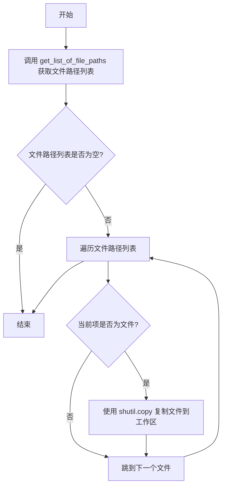

# `.\AutoGPT\classic\benchmark\agbenchmark\agent_interface.py` 详细设计文档

该代码定义了一个文件管理模块，主要用于从指定的挑战目录（challenge_dir_path）下的产物文件夹（artifact_folder_name）中检索所有文件，并将这些文件批量复制到指定的工作区（workspace）中。代码通过 `dotenv` 加载环境变量以控制日志行为，并利用 `shutil` 和 `pathlib` 库处理文件系统操作。

## 整体流程

```mermaid
graph TD
    A[开始: copy_challenge_artifacts_into_workspace] --> B[调用 get_list_of_file_paths]
    B --> C{源目录存在?}
    C -- 否 --> D[返回空列表 []]
    C -- 是 --> E[返回文件路径列表]
    E --> F{遍历文件列表}
    F -- 下一项 --> G{当前项是文件?}
    G -- 否 --> F
    G -- 是 --> H[调用 shutil.copy 复制文件到 workspace]
    H --> F
    F -- 遍历结束 --> I[结束]
```

## 类结构

```
artifact_manager.py (模块)
├── HELICONE_GRAPHQL_LOGS (全局变量)
├── get_list_of_file_paths (全局函数)
└── copy_challenge_artifacts_into_workspace (全局函数)
```

## 全局变量及字段


### `HELICONE_GRAPHQL_LOGS`
    
一个布尔环境变量，用于控制是否启用 Helicone GraphQL 日志功能

类型：`bool`
    


    

## 全局函数及方法


### `get_list_of_file_paths`

该函数接收挑战目录路径和工件文件夹名称，组合成完整的源目录路径，检查该目录是否存在，若存在则返回该目录下所有条目（文件或子目录）的 Path 对象列表，否则返回空列表。

参数：

- `challenge_dir_path`：`str | Path`，挑战目录的路径，可以是字符串或 Path 对象
- `artifact_folder_name`：`str`，工件文件夹的名称，用于构造完整的源目录路径

返回值：`list[Path]`，返回指定目录下所有条目（文件和子目录）的 Path 对象列表，若目录不存在则返回空列表

#### 流程图

```mermaid
flowchart TD
    A[开始] --> B[构造 source_dir 路径]
    B --> C{目录是否存在?}
    C -->|否| D[返回空列表 []]
    C -->|是| E[调用 source_dir.iterdir]
    E --> F[转换为列表]
    F --> G[返回 Path 对象列表]
    D --> G
    G --> H[结束]
```

#### 带注释源码

```python
def get_list_of_file_paths(
    challenge_dir_path: str | Path, artifact_folder_name: str
) -> list[Path]:
    """
    获取指定工件文件夹下的所有文件路径列表。
    
    Args:
        challenge_dir_path: 挑战目录的路径，可以是字符串或 Path 对象
        artifact_folder_name: 工件文件夹的名称
    
    Returns:
        返回指定目录下所有条目的 Path 对象列表，若目录不存在则返回空列表
    """
    # 拼接挑战目录路径和工件文件夹名称，构造完整的源目录路径
    source_dir = Path(challenge_dir_path) / artifact_folder_name
    
    # 检查源目录是否存在，如果不存在则返回空列表
    if not source_dir.exists():
        return []
    
    # 遍历源目录下的所有条目（文件和子目录），转换为列表返回
    return list(source_dir.iterdir())
```


### `copy_challenge_artifacts_into_workspace`

该函数用于将指定挑战目录中的工件文件夹内的所有文件复制到目标工作区，是构建挑战环境的关键步骤之一。

参数：

- `challenge_dir_path`：`str | Path`，挑战目录的路径，指定需要复制工件的源目录
- `artifact_folder_name`：`str`，工件文件夹的名称，位于挑战目录下
- `workspace`：`str | Path`，目标工作区的路径，文件将被复制到此目录

返回值：`None`，该函数仅执行文件复制操作，不返回任何值

#### 流程图



#### 带注释源码

```python
def copy_challenge_artifacts_into_workspace(
    challenge_dir_path: str | Path, artifact_folder_name: str, workspace: str | Path
) -> None:
    """
    将挑战目录中的工件文件夹内的所有文件复制到指定的工作区。
    
    参数:
        challenge_dir_path: 挑战目录的路径
        artifact_folder_name: 工件文件夹的名称
        workspace: 目标工作区路径
    
    返回:
        None: 无返回值，直接修改文件系统
    """
    # 调用辅助函数获取工件文件夹中的所有文件路径
    file_paths = get_list_of_file_paths(challenge_dir_path, artifact_folder_name)
    
    # 遍历所有文件路径
    for file_path in file_paths:
        # 检查当前路径是否为文件（排除目录）
        if file_path.is_file():
            # 使用 shutil.copy 将文件复制到工作区
            # 注意: 此操作会覆盖同名文件，不做额外提示
            shutil.copy(file_path, workspace)
```

## 关键组件


### 环境配置模块

通过 dotenv 库从 .env 文件加载环境变量，用于配置 HELICONE_GRAPHQL_LOGS 开关

### 文件路径获取组件

遍历指定目录下的工件文件夹，返回所有文件路径列表，支持字符串和 Path 类型的输入

### 文件复制组件

将工件文件夹中的所有文件复制到目标工作区，使用 shutil 库进行文件操作

### 配置状态管理

通过全局常量 HELICONE_GRAPHQL_LOGS 存储从环境变量读取的配置值，用于控制 GraphQL 日志功能


## 问题及建议


### 已知问题

-   **未使用的全局变量**：`HELICONE_GRAPHQL_LOGS` 被定义但从未在代码中使用，造成无意义的资源消耗和代码混乱
-   **缺乏错误处理**：`shutil.copy` 操作可能因权限不足、磁盘空间不足、目标路径无效等原因失败，但代码未捕获任何异常
-   **缺少日志输出**：当源目录不存在时静默返回空列表，缺少警告或调试日志，难以排查问题
-   **目标路径验证缺失**：`workspace` 参数未验证其有效性（如路径是否存在、是否可写）
-   **函数设计冗余**：`get_list_of_file_paths` 和 `copy_challenge_artifacts_into_workspace` 逻辑紧密耦合，可考虑合并以减少函数调用开销
-   **返回结果不可知**：复制操作无返回值，调用方无法获知成功复制的文件数量或失败情况
-   **无类型校验**：未对 `artifact_folder_name` 进行校验（如空字符串、特殊字符等）
-   **导入依赖无保护**：`load_dotenv()` 可能失败，但未做异常处理

### 优化建议

-   移除未使用的 `HELICONE_GRAPHQL_LOGS` 全局变量，或在代码中合理使用它
-   为 `shutil.copy` 添加 `try-except` 异常处理，记录失败文件并继续执行
-   在源目录不存在时输出警告日志，便于问题追踪
-   在复制前验证 `workspace` 目录存在性，不存在则创建或抛出明确异常
-   考虑返回复制结果（如成功复制的文件列表或数量），或使用回调函数报告进度
-   添加文件类型过滤参数，限制复制的文件范围（如只复制特定扩展名的文件）
-   为关键操作添加日志记录，使用结构化日志便于监控和分析

## 其它


### 设计目标与约束

本代码模块的核心设计目标是实现挑战工件的自动化复制功能，将指定目录下的工件文件批量复制到目标工作空间。约束条件包括：仅复制文件而非目录、源目录不存在时返回空列表而非抛出异常、支持Path和str两种路径类型输入。

### 错误处理与异常设计

代码采用了防御性编程策略。当source_dir不存在时，get_list_of_file_paths函数返回空列表而非抛出FileNotFoundError，这种静默失败的设计适合批量处理场景。copy_challenge_artifacts_into_workspace函数依赖shutil.copy的内置异常处理，如权限不足或磁盘空间不足时会向上传播OSError及其子类异常。调用方需注意处理这些可能的异常。

### 数据流与状态机

数据流如下：调用方传入challenge_dir_path和artifact_folder_name → 拼接得到source_dir路径 → 检查目录是否存在 → 若存在则遍历获取所有文件项 → 对每个文件项判断是否为文件 → 执行复制操作。状态机相对简单，主要状态包括：初始状态 → 目录检查状态 → 遍历状态 → 复制完成状态。

### 外部依赖与接口契约

本模块依赖以下外部组件：os和shutil模块（Python标准库）、pathlib.Path（Python标准库）、dotenv库用于环境变量加载。接口契约方面，get_list_of_file_paths接收challenge_dir_path（str或Path类型）和artifact_folder_name（str类型），返回list[Path]；copy_challenge_artifacts_into_workspace接收challenge_dir_path、artifact_folder_name和workspace（str或Path类型），返回None。

### 性能考虑

当前实现使用list(source_dir.iterdir())会将所有文件路径加载到内存，对于包含大量文件的目录可能存在内存压力。迭代器直接遍历可能更具效率。此外，shutil.copy在复制大文件时是同步操作，若需处理大量文件可考虑并发或异步方案。

### 安全性考虑

代码未对复制的目标路径进行安全校验，存在路径遍历攻击风险。artifact_folder_name参数应进行严格验证，防止"../../../"等恶意路径构造。此外，workspace参数同样需要验证，避免覆盖重要系统文件。

### 测试策略建议

建议编写单元测试覆盖以下场景：正常文件复制、目录不存在返回空列表、嵌套目录结构、复制空文件夹、大文件复制、目标路径无写权限异常、源文件无读权限异常等情况。

    