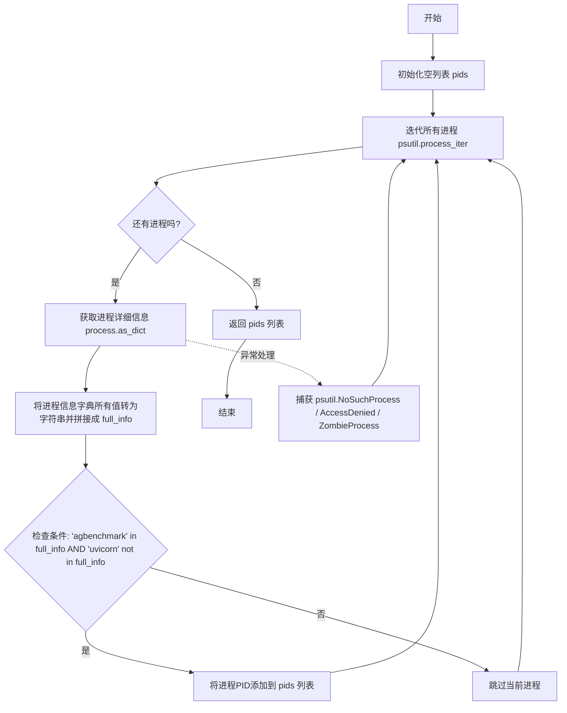
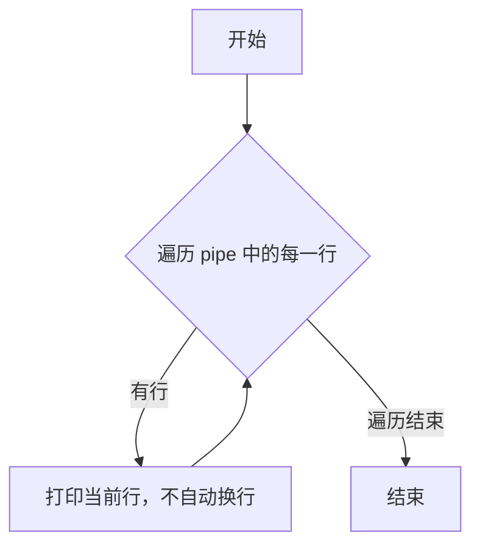
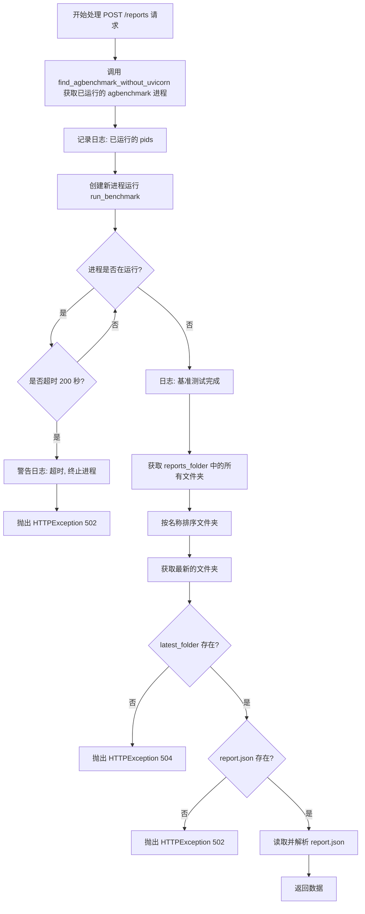
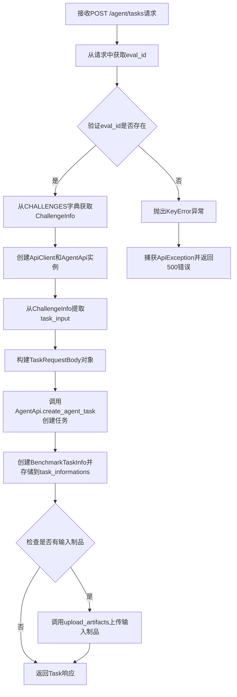

# `.\AutoGPT\classic\benchmark\agbenchmark\app.py` 详细设计文档

该代码是一个FastAPI应用，作为AGBenchmark基准测试框架的API接口层，负责加载和管理基准测试挑战（challenges），提供REST API接口用于运行测试、创建agent任务、转发步骤请求以及执行任务评估，同时实现了CORS中间件配置和进程管理功能。

## 整体流程

```mermaid
graph TD
    A[启动应用] --> B[加载Challenge配置]
    B --> C{遍历challenge_spec_files}
    C --> D[读取data.json]
    D --> E{验证ChallengeInfo}
    E -- 失败 --> F[跳过并记录日志]
    E -- 成功 --> G{检查eval_id}
    G -- 无eval_id --> H[生成UUID并保存]
    G -- 有eval_id --> I[存储到CHALLENGES字典]
    I --> C
    C --> J[启动FastAPI服务]
    J --> K[等待HTTP请求]
    K --> L{请求类型}
    L --> M[/reports 端点]
    L --> N[/agent/tasks 端点]
    L --> O[/agent/tasks/{task_id}/steps 端点]
    L --> P[/agent/tasks/{task_id}/evaluations 端点]
    M --> Q[运行基准测试]
    N --> R[创建Agent任务]
    O --> S[转发步骤请求]
    P --> T[评估任务结果]
```

## 类结构

```
Pydantic BaseModel
├── BenchmarkTaskInfo (数据模型)
│   ├── task_id: str
│   ├── start_time: datetime
│   └── challenge_info: ChallengeInfo
└── CreateReportRequest (请求模型)
    ├── test: str
    ├── test_run_id: str
    └── mock: Optional[bool]

FastAPI Application
└── setup_fastapi_app()
    ├── /reports (POST)
    ├── /agent/tasks (POST)
    ├── /agent/tasks/{task_id}/steps (POST)
    └── /agent/tasks/{task_id}/evaluations (POST)
```

## 全局变量及字段


### `CHALLENGES`
    
存储所有加载的挑战信息，键为eval_id

类型：`dict[str, ChallengeInfo]`
    


### `challenges_path`
    
挑战文件的基础路径

类型：`Path`
    


### `challenge_spec_files`
    
待处理的挑战规范文件队列

类型：`deque`
    


### `task_informations`
    
存储活跃任务的信息

类型：`dict[str, BenchmarkTaskInfo]`
    


### `updates_list`
    
更新列表（当前为空列表）

类型：`list`
    


### `origins`
    
CORS允许的源地址列表

类型：`list`
    


### `logger`
    
模块级日志记录器

类型：`logging.Logger`
    


### `find_agbenchmark_without_uvicorn`
    
查找运行中的agbenchmark进程，排除uvicorn进程

类型：`function`
    


### `BenchmarkTaskInfo.task_id`
    
任务唯一标识符

类型：`str`
    


### `BenchmarkTaskInfo.start_time`
    
任务开始时间

类型：`datetime.datetime`
    


### `BenchmarkTaskInfo.challenge_info`
    
挑战信息对象

类型：`ChallengeInfo`
    


### `CreateReportRequest.test`
    
测试名称或标识

类型：`str`
    


### `CreateReportRequest.test_run_id`
    
测试运行ID

类型：`str`
    


### `CreateReportRequest.mock`
    
是否使用模拟模式

类型：`Optional[bool]`
    


### `FastAPI App.router`
    
API路由对象

类型：`APIRouter`
    


### `FastAPI App.middleware`
    
跨域中间件

类型：`CORSMiddleware`
    
    

## 全局函数及方法


### `find_agbenchmark_without_uvicorn`

查找运行中不带uvicorn的agbenchmark进程PID列表，通过遍历系统所有进程，检查进程的完整信息中是否包含"agbenchmark"关键字且不包含"uvicorn"关键字，将符合条件的进程PID收集到列表中并返回。

参数： 无

返回值：`list[int]`，返回运行中不带uvicorn的agbenchmark进程的PID列表

#### 流程图



#### 带注释源码

```python
def find_agbenchmark_without_uvicorn():
    """查找运行中不带uvicorn的agbenchmark进程PID列表
    
    遍历系统所有进程，筛选出同时满足以下条件的进程：
    1. 进程信息中包含 'agbenchmark' 字符串
    2. 进程信息中不包含 'uvicorn' 字符串
    
    Returns:
        list[int]: 符合条件的进程PID列表
    """
    # 初始化存储PID的列表
    pids = []
    
    # 使用psutil迭代所有进程，获取指定的进程属性
    # attrs参数指定要获取的进程信息字段
    for process in psutil.process_iter(
        attrs=[
            "pid",           # 进程ID
            "cmdline",       # 命令行参数
            "name",          # 进程名称
            "username",      # 进程所有者用户名
            "status",        # 进程状态
            "cpu_percent",   # CPU使用率
            "memory_info",   # 内存信息
            "create_time",   # 进程创建时间
            "cwd",           # 当前工作目录
            "connections",   # 网络连接信息
        ]
    ):
        try:
            # 将process.as_dict()返回的字典中所有值转换为字符串
            # 并使用空格拼接成完整的进程信息字符串
            # 这样可以一次性检查进程的所有信息字段
            full_info = " ".join([str(v) for k, v in process.as_dict().items()])

            # 检查进程信息中是否：
            # 1. 包含 'agbenchmark' 关键字（表示是agbenchmark进程）
            # 2. 不包含 'uvicorn' 关键字（排除作为uvicorn服务器运行的进程）
            if "agbenchmark" in full_info and "uvicorn" not in full_info:
                # 将符合条件的进程PID添加到列表中
                pids.append(process.pid)
        
        # 捕获进程可能出现的异常情况，避免遍历中断
        except (psutil.NoSuchProcess, psutil.AccessDenied, psutil.ZombieProcess):
            # NoSuchProcess: 进程在迭代过程中已退出
            # AccessDenied: 没有权限访问该进程信息
            # ZombieProcess: 进程已终止但父进程未回收
            pass
    
    # 返回找到的agbenchmark进程PID列表（不包含uvicorn服务进程）
    return pids
```


### `stream_output`

该函数是一个简洁的输出流处理函数，用于从管道（pipe）迭代器中逐行读取数据并直接打印到标准输出，常用于实时显示子进程的输出流。

参数：

- `pipe`：`迭代器`，管道或类似可迭代对象，包含要逐行输出的内容

返回值：`None`，该函数没有返回值，仅执行打印操作

#### 流程图



#### 带注释源码

```python
def stream_output(pipe):
    """
    从管道读取并打印输出行
    
    该函数接收一个迭代器（通常是管道对象），遍历其中的每一行，
    并使用 print 函数输出到标准输出。print 的 end="" 参数
    确保不添加额外的换行符，保持原始输出格式。
    
    参数:
        pipe: 可迭代对象，通常为管道输出，用于实时显示子进程的标准输出
        
    返回值:
        None: 该函数仅执行打印操作，无返回值
    """
    for line in pipe:  # 遍历管道中的每一行
        print(line, end="")  # 打印当前行，end="" 避免自动换行
```


### `setup_fastapi_app`

配置并返回一个配置好的FastAPI应用实例，包括CORS中间件设置、API路由定义（涵盖报告生成、Agent任务创建、任务步骤代理和任务评估等功能）。

参数：

- `agbenchmark_config`：`AgentBenchmarkConfig`，用于配置应用的主机地址和其他基准测试相关配置

返回值：`FastAPI`，返回配置完整且包含所有路由的FastAPI应用实例

#### 流程图

```mermaid
flowchart TD
    A[开始 setup_fastapi_app] --> B[创建 Configuration 对象<br/>host: agbenchmark_config.host 或默认 localhost:8000]
    B --> C[创建 FastAPI 应用实例]
    C --> D[添加 CORSMiddleware 中间件<br/>允许指定来源的跨域请求]
    D --> E[创建 APIRouter 实例]
    E --> F[定义 /reports 路由<br/>run_single_test 处理函数]
    F --> G[定义 /agent/tasks 路由<br/>create_agent_task 处理函数]
    G --> H[定义 /agent/tasks/{task_id}/steps 路由<br/>proxy 处理函数]
    H --> I[定义 /agent/tasks/{task_id}/evaluations 路由<br/>create_evaluation 处理函数]
    I --> J[将路由添加到 FastAPI 应用<br/>前缀: /ap/v1]
    J --> K[返回配置好的 FastAPI 应用]
```

#### 带注释源码

```python
def setup_fastapi_app(agbenchmark_config: AgentBenchmarkConfig) -> FastAPI:
    """
    配置并返回FastAPI应用实例
    
    该函数创建一个完整的FastAPI应用，包含：
    - CORS中间件配置
    - 四个API路由：报告生成、任务创建、任务步骤代理、任务评估
    """
    # 导入必要的模块（避免循环依赖）
    from agbenchmark.agent_api_interface import upload_artifacts
    from agbenchmark.challenges import get_challenge_from_source_uri
    from agbenchmark.main import run_benchmark

    # 创建Agent Protocol客户端配置，设置主机地址
    configuration = Configuration(
        host=agbenchmark_config.host or "http://localhost:8000"
    )
    
    # 初始化FastAPI应用实例
    app = FastAPI()
    
    # 添加CORS中间件，允许所有来源的跨域请求
    app.add_middleware(
        CORSMiddleware,
        allow_origins=origins,  # 定义允许的源列表
        allow_credentials=True,
        allow_methods=["*"],
        allow_headers=["*"],
    )
    
    # 创建API路由器
    router = APIRouter()

    # ===== 路由1: /reports - 运行单个测试并生成报告 =====
    @router.post("/reports")
    def run_single_test(body: CreateReportRequest) -> dict:
        """
        接收测试请求，在子进程中运行基准测试，并返回最新的报告数据
        
        处理流程：
        1. 查找已运行的agbenchmark进程
        2. 在新进程中启动基准测试（超时200秒）
        3. 读取最新的报告文件夹中的report.json
        4. 返回报告数据或抛出HTTP异常
        """
        # 查找正在运行的agbenchmark进程（不含uvicorn）
        pids = find_agbenchmark_without_uvicorn()
        logger.info(f"pids already running with agbenchmark: {pids}")

        logger.debug(f"Request to /reports: {body.model_dump()}")

        # 在独立进程中运行基准测试
        benchmark_process = Process(
            target=lambda: run_benchmark(
                config=agbenchmark_config,
                tests=(body.test,),
                mock=body.mock or False,
            )
        )
        benchmark_process.start()

        # 等待基准测试完成，设置200秒超时
        timeout = 200
        start_time = time.time()
        while benchmark_process.is_alive():
            if time.time() - start_time > timeout:
                logger.warning(f"Benchmark run timed out after {timeout} seconds")
                benchmark_process.terminate()
                break
            time.sleep(1)
        else:
            logger.debug(f"Benchmark finished running in {time.time() - start_time} s")

        # 获取报告输出目录
        reports_folder = agbenchmark_config.reports_folder
        
        # 获取最新的报告文件夹
        folders = [folder for folder in reports_folder.iterdir() if folder.is_dir()]
        sorted_folders = sorted(folders, key=lambda x: x.name)
        latest_folder = sorted_folders[-1] if sorted_folders else None

        # 读取最新报告的report.json
        if latest_folder:
            report_path = latest_folder / "report.json"
            logger.debug(f"Getting latest report from {report_path}")
            if report_path.exists():
                with report_path.open() as file:
                    data = json.load(file)
                logger.debug(f"Report data: {data}")
            else:
                raise HTTPException(
                    502,
                    "Could not get result after running benchmark: "
                    f"'report.json' does not exist in '{latest_folder}'",
                )
        else:
            raise HTTPException(
                504, "Could not get result after running benchmark: no reports found"
            )

        return data

    # ===== 路由2: /agent/tasks - 创建Agent任务 =====
    @router.post("/agent/tasks", tags=["agent"])
    async def create_agent_task(task_eval_request: TaskEvalRequestBody) -> Task:
        """
        创建新的Agent任务
        
        功能：
        1. 根据eval_id从CHALLENGES字典获取挑战信息
        2. 通过AgentApi创建任务
        3. 如果有输入 artifacts，上传到任务中
        4. 返回创建的Task对象
        """
        try:
            # 根据eval_id获取挑战信息
            challenge_info = CHALLENGES[task_eval_request.eval_id]
            
            # 使用ApiClient与Agent Protocol服务器通信
            async with ApiClient(configuration) as api_client:
                api_instance = AgentApi(api_client)
                task_input = challenge_info.task

                # 构建任务请求体
                task_request_body = TaskRequestBody(
                    input=task_input, additional_input=None
                )
                
                # 调用API创建任务
                task_response = await api_instance.create_agent_task(
                    task_request_body=task_request_body
                )
                
                # 记录任务信息用于后续跟踪
                task_info = BenchmarkTaskInfo(
                    task_id=task_response.task_id,
                    start_time=datetime.datetime.now(datetime.timezone.utc),
                    challenge_info=challenge_info,
                )
                task_informations[task_info.task_id] = task_info

                # 如果有输入artifacts目录，上传文件到任务
                if input_artifacts_dir := challenge_info.task_artifacts_dir:
                    await upload_artifacts(
                        api_instance,
                        input_artifacts_dir,
                        task_response.task_id,
                        "artifacts_in",
                    )
                return task_response
        except ApiException as e:
            logger.error(f"Error whilst trying to create a task:\n{e}")
            logger.error(
                "The above error was caused while processing request: "
                f"{task_eval_request}"
            )
            raise HTTPException(500)

    # ===== 路由3: /agent/tasks/{task_id}/steps - 代理任务步骤请求 =====
    @router.post("/agent/tasks/{task_id}/steps")
    async def proxy(request: Request, task_id: str):
        """
        将请求代理到Agent Protocol服务器的步骤端点
        
        创建一个5分钟超时的httpx客户端，
        转发请求到配置的Agent Protocol服务器
        """
        timeout = httpx.Timeout(300.0, read=300.0)  # 5 minutes
        async with httpx.AsyncClient(timeout=timeout) as client:
            # 构建转发URL
            new_url = f"{configuration.host}/ap/v1/agent/tasks/{task_id}/steps"

            # 转发请求到上游Agent Protocol服务器
            response = await client.post(
                new_url,
                content=await request.body(),
                headers=dict(request.headers),
            )

            # 返回上游服务器的响应
            return Response(content=response.content, status_code=response.status_code)

    # ===== 路由4: /agent/tasks/{task_id}/evaluations - 创建任务评估 =====
    @router.post("/agent/tasks/{task_id}/evaluations")
    async def create_evaluation(task_id: str) -> BenchmarkRun:
        """
        对已完成的任务进行评估
        
        功能：
        1. 获取任务信息
        2. 根据挑战的source_uri获取挑战实例
        3. 调用挑战的evaluate_task_state方法评估任务
        4. 构建并返回BenchmarkRun评估结果
        """
        # 获取之前创建的任务信息
        task_info = task_informations[task_id]
        
        # 获取挑战实例
        challenge = get_challenge_from_source_uri(task_info.challenge_info.source_uri)
        
        try:
            # 评估任务状态
            async with ApiClient(configuration) as api_client:
                api_instance = AgentApi(api_client)
                eval_results = await challenge.evaluate_task_state(
                    api_instance, task_id
                )

            # 构建评估结果数据模型
            eval_info = BenchmarkRun(
                repository_info=RepositoryInfo(),
                run_details=RunDetails(
                    command=f"agbenchmark --test={challenge.info.name}",
                    benchmark_start_time=(
                        task_info.start_time.strftime("%Y-%m-%dT%H:%M:%S+00:00")
                    ),
                    test_name=challenge.info.name,
                ),
                task_info=TaskInfo(
                    data_path=challenge.info.source_uri,
                    is_regression=None,
                    category=[c.value for c in challenge.info.category],
                    task=challenge.info.task,
                    answer=challenge.info.reference_answer or "",
                    description=challenge.info.description or "",
                ),
                metrics=Metrics(
                    success=all(e.passed for e in eval_results),
                    success_percentage=(
                        100 * sum(e.score for e in eval_results) / len(eval_results)
                        if eval_results  # avoid division by zero
                        else 0
                    ),
                    attempted=True,
                ),
                config={},
            )

            logger.debug(
                f"Returning evaluation data:\n{eval_info.model_dump_json(indent=4)}"
            )
            return eval_info
        except ApiException as e:
            logger.error(f"Error {e} whilst trying to evaluate task: {task_id}")
            raise HTTPException(500)

    # 将路由添加到应用，使用 /ap/v1 前缀
    app.include_router(router, prefix="/ap/v1")

    # 返回配置完整的FastAPI应用
    return app
```


### `run_single_test`

处理 POST /reports 请求，启动基准测试运行，获取并返回最新的测试报告数据。

参数：

- `body`：`CreateReportRequest`，包含测试名称、测试运行 ID 和模拟标志的请求体

返回值：`dict`，从最新的报告文件夹中读取的 report.json 数据

#### 流程图



#### 带注释源码

```python
@router.post("/reports")
def run_single_test(body: CreateReportRequest) -> dict:
    # 步骤1: 查找已运行的 agbenchmark 进程（不在 uvicorn 中运行的）
    pids = find_agbenchmark_without_uvicorn()
    # 记录已运行的 agbenchmark 进程 ID
    logger.info(f"pids already running with agbenchmark: {pids}")

    # 记录请求详情
    logger.debug(f"Request to /reports: {body.model_dump()}")

    # 步骤2: 在单独的进程中启动基准测试
    benchmark_process = Process(
        target=lambda: run_benchmark(
            config=agbenchmark_config,
            tests=(body.test,),
            mock=body.mock or False,
        )
    )
    benchmark_process.start()

    # 步骤3: 等待基准测试完成，设置超时为 200 秒
    timeout = 200
    start_time = time.time()
    while benchmark_process.is_alive():
        if time.time() - start_time > timeout:
            # 超时则警告并终止进程
            logger.warning(f"Benchmark run timed out after {timeout} seconds")
            benchmark_process.terminate()
            break
        time.sleep(1)
    else:
        # 基准测试正常完成
        logger.debug(f"Benchmark finished running in {time.time() - start_time} s")

    # 步骤4: 获取 reports 文件夹中的所有子文件夹
    reports_folder = agbenchmark_config.reports_folder
    folders = [folder for folder in reports_folder.iterdir() if folder.is_dir()]

    # 步骤5: 按名称排序，获取最新的报告文件夹
    sorted_folders = sorted(folders, key=lambda x: x.name)
    latest_folder = sorted_folders[-1] if sorted_folders else None

    # 步骤6: 从最新文件夹读取 report.json
    if latest_folder:
        report_path = latest_folder / "report.json"
        logger.debug(f"Getting latest report from {report_path}")
        if report_path.exists():
            with report_path.open() as file:
                data = json.load(file)
            logger.debug(f"Report data: {data}")
        else:
            # report.json 不存在，抛出 502 错误
            raise HTTPException(
                502,
                "Could not get result after running benchmark: "
                f"'report.json' does not exist in '{latest_folder}'",
            )
    else:
        # 没有找到报告文件夹，抛出 504 错误
        raise HTTPException(
            504, "Could not get result after running benchmark: no reports found"
        )

    # 返回报告数据
    return data
```


### `create_agent_task`

处理POST /agent/tasks请求，根据请求中的eval_id创建对应的评估任务，调用AgentProtocol API创建任务，并返回任务对象。

参数：

- `task_eval_request`：`TaskEvalRequestBody`，请求体，包含eval_id等字段，用于标识要执行的挑战任务

返回值：`Task`，返回创建的任务对象，包含task_id、input、artifacts等属性

#### 流程图



#### 带注释源码

```python
@router.post("/agent/tasks", tags=["agent"])
async def create_agent_task(task_eval_request: TaskEvalRequestBody) -> Task:
    """
    Creates a new task using the provided TaskEvalRequestBody and returns a Task.

    Args:
        task_eval_request: `TaskRequestBody` including an eval_id.

    Returns:
        Task: A new task with task_id, input, additional_input,
            and empty lists for artifacts and steps.

    Example:
        Request (TaskEvalRequestBody defined in schema.py):
            {
                ...,
                "eval_id": "50da533e-3904-4401-8a07-c49adf88b5eb"
            }

        Response (Task defined in `agent_protocol_client.models`):
            {
                "task_id": "50da533e-3904-4401-8a07-c49adf88b5eb",
                "input": "Write the word 'Washington' to a .txt file",
                "artifacts": []
            }
    """
    try:
        # 根据eval_id从预加载的CHALLENGES字典中获取对应的挑战信息
        challenge_info = CHALLENGES[task_eval_request.eval_id]
        
        # 创建API客户端与AgentProtocol服务通信
        async with ApiClient(configuration) as api_client:
            api_instance = AgentApi(api_client)
            
            # 从挑战信息中提取任务输入文本
            task_input = challenge_info.task

            # 构建任务请求体，包含任务输入和额外的输入参数
            task_request_body = TaskRequestBody(
                input=task_input, additional_input=None
            )
            
            # 调用AgentProtocol API创建任务
            task_response = await api_instance.create_agent_task(
                task_request_body=task_request_body
            )
            
            # 创建任务信息记录，包含任务ID、开始时间和挑战信息
            task_info = BenchmarkTaskInfo(
                task_id=task_response.task_id,
                start_time=datetime.datetime.now(datetime.timezone.utc),
                challenge_info=challenge_info,
            )
            
            # 将任务信息存储到全局字典中，供后续步骤和评估使用
            task_informations[task_info.task_id] = task_info

            # 如果挑战存在输入制品目录，则上传制品到任务中
            if input_artifacts_dir := challenge_info.task_artifacts_dir:
                await upload_artifacts(
                    api_instance,
                    input_artifacts_dir,
                    task_response.task_id,
                    "artifacts_in",
                )
            
            # 返回创建的任务响应
            return task_response
    except ApiException as e:
        # 捕获AgentProtocol API异常并记录错误日志
        logger.error(f"Error whilst trying to create a task:\n{e}")
        logger.error(
            "The above error was caused while processing request: "
            f"{task_eval_request}"
        )
        raise HTTPException(500)
```


### `setup_fastapi_app.proxy`

该方法是一个FastAPI路由处理函数，用于代理处理发送到`/agent/tasks/{task_id}/steps`的POST请求。它接收传入的HTTP请求，将其转发到配置的主机上的Agent Protocol API，并将响应返回给客户端，实现前后端API的桥接。

参数：

- `request`：`Request`，FastAPI的Request对象，包含客户端发送的原始HTTP请求内容（body和headers）
- `task_id`：`str`，从URL路径中提取的任务ID，用于标识特定的任务步骤

返回值：`Response`，转发后的响应对象，包含从Agent Protocol API返回的内容和状态码

#### 流程图

```mermaid
graph TD
    A[接收POST /agent/tasks/{task_id}/steps请求] --> B[创建httpx.AsyncClient超时5分钟]
    B --> C[构造新URL: {configuration.host}/ap/v1/agent/tasks/{task_id}/steps]
    C --> D[提取请求body和headers]
    D --> E[异步POST请求转发到Agent API]
    E --> F{是否成功?}
    F -->|是| G[提取响应content和status_code]
    F -->|否| H[返回错误响应]
    G --> I[创建Response对象并返回]
    H --> I
```

#### 带注释源码

```python
@router.post("/agent/tasks/{task_id}/steps")
async def proxy(request: Request, task_id: str):
    """
    代理处理POST /agent/tasks/{task_id}/steps请求
    将请求转发到Agent Protocol API并返回响应
    """
    # 创建httpx客户端，设置超时为5分钟（读和写均为300秒）
    timeout = httpx.Timeout(300.0, read=300.0)  # 5 minutes
    
    # 使用async context manager管理HTTP客户端生命周期
    async with httpx.AsyncClient(timeout=timeout) as client:
        # 构造新的目标URL，指向Agent Protocol的API端点
        # 格式: {host}/ap/v1/agent/tasks/{task_id}/steps
        new_url = f"{configuration.host}/ap/v1/agent/tasks/{task_id}/steps"

        # 提取原始请求的body和headers，转发到新URL
        response = await client.post(
            new_url,
            content=await request.body(),  # 获取请求体内容
            headers=dict(request.headers),  # 转发原始请求头
        )

        # 从Agent API获取响应后，创建新的Response对象返回给客户端
        # 保持原始响应的内容(status code和body)
        return Response(content=response.content, status_code=response.status_code)
```


### `create_evaluation`

处理POST `/agent/tasks/{task_id}/evaluations`请求，根据任务ID获取任务信息，调用挑战的评估方法对任务状态进行评估，并返回包含评估结果的BenchmarkRun对象。

参数：

- `task_id`：`str`，URL路径参数，表示要评估的任务ID

返回值：`BenchmarkRun`，包含评估详细信息的对象，包括仓库信息、运行详情、任务信息和评估指标

#### 流程图

```mermaid
flowchart TD
    A[开始: POST /agent/tasks/{task_id}/evaluations] --> B[从task_informations获取task_info]
    B --> C[通过task_info.challenge_info.source_uri获取challenge]
    C --> D[创建ApiClient和AgentApi实例]
    D --> E[调用challenge.evaluate_task_state获取评估结果]
    E --> F[构造BenchmarkRun对象]
    F --> G[返回评估结果]
    
    E --> H{是否发生ApiException?}
    H -->|是| I[记录错误日志并抛出HTTPException 500]
    H -->|否| F
    
    G --> J[结束]
    I --> J
```

#### 带注释源码

```python
@router.post("/agent/tasks/{task_id}/evaluations")
async def create_evaluation(task_id: str) -> BenchmarkRun:
    """
    处理POST /agent/tasks/{task_id}/evaluations请求
    
    参数:
        task_id: URL路径参数，标识要评估的任务ID
        
    返回:
        BenchmarkRun: 包含评估结果的BenchmarkRun对象
    """
    # 从全局任务信息字典中根据task_id获取任务信息
    task_info = task_informations[task_id]
    
    # 根据挑战的source_uri获取对应的挑战实例
    challenge = get_challenge_from_source_uri(task_info.challenge_info.source_uri)
    
    try:
        # 创建API客户端并调用挑战的评估方法
        async with ApiClient(configuration) as api_client:
            api_instance = AgentApi(api_client)
            # 调用挑战的evaluate_task_state方法获取评估结果
            eval_results = await challenge.evaluate_task_state(
                api_instance, task_id
            )

        # 构造评估信息对象
        eval_info = BenchmarkRun(
            repository_info=RepositoryInfo(),  # 仓库信息（空）
            run_details=RunDetails(
                command=f"agbenchmark --test={challenge.info.name}",
                benchmark_start_time=(
                    task_info.start_time.strftime("%Y-%m-%dT%H:%M:%S+00:00")
                ),
                test_name=challenge.info.name,
            ),
            task_info=TaskInfo(
                data_path=challenge.info.source_uri,
                is_regression=None,
                category=[c.value for c in challenge.info.category],
                task=challenge.info.task,
                answer=challenge.info.reference_answer or "",
                description=challenge.info.description or "",
            ),
            metrics=Metrics(
                success=all(e.passed for e in eval_results),
                success_percentage=(
                    100 * sum(e.score for e in eval_results) / len(eval_results)
                    if eval_results  # avoid division by 0
                    else 0
                ),
                attempted=True,
            ),
            config={},
        )

        # 记录调试日志并返回评估结果
        logger.debug(
            f"Returning evaluation data:\n{eval_info.model_dump_json(indent=4)}"
        )
        return eval_info
    
    # 异常处理：捕获ApiException并返回500错误
    except ApiException as e:
        logger.error(f"Error {e} whilst trying to evaluate task: {task_id}")
        raise HTTPException(500)
```

## 关键组件


### Challenge 加载与缓存机制

使用全局字典 `CHALLENGES` 存储挑战信息，通过 `glob.glob` 递归扫描 `challenges_path` 目录下的 `data.json` 文件，实现惰性加载。包含跳过废弃挑战、验证 JSON 规范、自动生成 `eval_id` 的逻辑。

### FastAPI 应用设置模块

`setup_fastapi_app` 函数负责构建 FastAPI 应用实例，配置 CORS 中间件，注册 API 路由前缀为 `/ap/v1`，并依赖注入 `AgentBenchmarkConfig` 配置对象。

### 基准测试执行流程

`/reports` 端点接收 `CreateReportRequest`，通过 `multiprocessing.Process` 在独立进程中执行 `run_benchmark`，实现 200 秒超时控制，轮询进程状态并读取最新生成的 `report.json` 返回。

### Agent 任务生命周期管理

使用 `task_informations` 字典存储 `BenchmarkTaskInfo` 对象，包含 `task_id`、`start_time` 和 `challenge_info`。`/agent/tasks` 端点创建任务并上传输入工件，`/agent/tasks/{task_id}/steps` 端点代理转发步骤请求至上游 Agent 服务。

### 任务评估与结果封装

`/agent/tasks/{task_id}/evaluations` 端点调用挑战的 `evaluate_task_state` 方法，返回结构化的 `BenchmarkRun` 对象，包含 `RepositoryInfo`、`RunDetails`、`TaskInfo` 和 `Metrics`，计算成功率和评估状态。

### 进程发现与过滤

`find_agbenchmark_without_uvicorn` 函数遍历系统进程，通过 `psutil` 获取进程完整命令行信息，过滤出包含 "agbenchmark" 但不包含 "uvicorn" 的进程 PID 列表。

### 配置与请求模型

定义 `CreateReportRequest` Pydantic 模型约束请求参数，使用 `ConfigDict(extra="forbid")` 拒绝额外字段。挑战信息通过 `ChallengeInfo` 模型验证，支持从 JSON 文件反序列化。

### 跨服务通信代理

使用 `httpx.AsyncClient` 配合 5 分钟超时配置，将客户端请求转发至 `${host}/ap/v1/agent/tasks/${task_id}/steps`，保留原始请求头和请求体，实现无状态代理。


## 问题及建议


### 已知问题

-   **全局状态管理问题**：`task_informations` 作为全局字典，在多进程/多线程环境下缺乏线程安全保护，可能导致竞态条件
-   **模块级 I/O 阻塞**：在模块加载时通过递归 glob 加载所有挑战配置，且使用同步文件 I/O，会导致应用启动缓慢
-   **轮询机制低效**：`/reports` 端点使用 `while benchmark_process.is_alive()` 配合 `time.sleep(1)` 轮询检查子进程状态，200秒超时内最多执行200次无意义的循环迭代
- **硬编码超时和配置**：200秒基准测试超时、300秒 HTTP 超时、CORS origins 均硬编码，缺乏灵活性
- **脆弱的报告查找逻辑**：通过文件夹名排序来查找最新报告，依赖文件系统命名约定，容易出错
- **异常处理过于宽泛**：多处使用 `except Exception` 或裸 `except`，会隐藏潜在错误；`ApiException` 处理时仅记录日志后返回 500，原始错误信息未传递给客户端
- **未使用的变量**：`updates_list` 定义后完全未使用；`BenchmarkTaskInfo` 和 `CreateReportRequest` 的 `model_config` 配置未体现实际作用
- **资源泄露风险**：`httpx.AsyncClient` 和 `ApiClient` 在异常情况下可能未正确关闭
- **缺乏超时控制的进程终止**：`benchmark_process.terminate()` 被调用后未等待进程真正退出，可能产生僵尸进程

### 优化建议

-   **异步化与事件驱动**：使用 `asyncio` 配合 `asyncio.create_subprocess_exec()` 或 `ProcessPoolExecutor`，通过回调或 `asyncio.Event` 通知机制替代轮询
-   **配置外部化**：将超时时间、CORS origins、挑战路径等配置提取到 `AgentBenchmarkConfig` 或环境变量中
-   **改进报告查找**：使用目录的创建/修改时间戳（如 `path.stat().st_mtime`）而非字符串排序来定位最新报告
-   **增强错误处理**：为不同类型的异常设计具体的处理策略；将关键错误信息通过 HTTP 响应体返回给客户端（注意不泄露敏感信息）
-   **线程安全**：使用 `asyncio.Lock` 或 `threading.Lock` 保护 `task_informations` 字典的读写操作
-   **资源管理**：使用 `async with` 上下文管理器确保客户端资源释放；或考虑使用 `finally` 块保证清理逻辑执行
-   **按需加载挑战**：将挑战加载逻辑从模块顶层移至首次请求时执行（懒加载），或使用后台任务预加载
-   **日志分级**：将关键操作（如基准测试超时、进程终止）的日志级别提升至 `warning` 或 `error`，确保在生产环境可观测
-   **删除死代码**：移除未使用的 `updates_list` 变量和可能的无用配置
-   **进程优雅退出**：`terminate()` 后添加 `benchmark_process.join(timeout)` 等待进程真正退出


## 其它


### 设计目标与约束

本系统旨在提供一个RESTful API接口，用于执行和管理AG Benchmark基准测试。核心约束包括：1) 使用FastAPI作为Web框架，支持异步请求处理；2) 基准测试执行限制在200秒超时范围内；3) 仅支持预定义的CORS来源（localhost:8000、localhost:8080、127.0.0.1:5000、localhost:5000）；4) 挑战规范文件从`challenges_path`目录递归加载，跳过deprecated目录。

### 错误处理与异常设计

系统采用分层异常处理策略。对于ChallengeInfo加载失败，仅记录debug级别日志并跳过该文件；ApiException被捕获后统一返回HTTP 500错误；基准测试超时则终止进程并记录警告；report.json文件不存在时返回HTTP 502错误，未找到报告文件夹时返回HTTP 504错误。ValidationError用于捕获Pydantic模型验证异常。

### 数据流与状态机

任务生命周期遵循以下状态流转：1) 创建任务（POST /agent/tasks）→ 任务信息存储至task_informations；2) 执行步骤（POST /agent/tasks/{task_id}/steps）→ 代理转发请求至Agent Protocol；3) 创建评估（POST /agent/tasks/{task_id}/evaluations）→ 根据eval_results构建BenchmarkRun结果。报告生成流程（POST /reports）通过多进程启动基准测试，轮询等待完成后读取最新生成的report.json。

### 外部依赖与接口契约

系统依赖以下外部服务：1) Agent Protocol API（通过agent_protocol_client库）用于任务和步骤管理；2) 本地agbenchmark进程（通过psutil检测）。接口契约包括：TaskEvalRequestBody包含eval_id字段；TaskRequestBody包含input和additional_input；评估结果需返回包含metrics、task_info、run_details的BenchmarkRun对象。

### 并发与同步机制

基准测试执行使用multiprocessing.Process实现进程级隔离，避免阻塞主事件循环。任务信息存储使用全局字典task_informations，属于进程内共享，无线程安全保护。挑战规范文件加载采用deque队列按序处理，支持递归遍历但未加锁。

### 配置管理

系统通过AgentBenchmarkConfig对象注入配置，主要配置项包括host（Agent Protocol服务地址，默认为http://localhost:8000）和reports_folder（报告输出目录）。CORS白名单和超时配置（300秒读超时）为硬编码值。

### 日志与监控

使用标准logging模块，日志级别支持DEBUG/INFO/WARNING。关键日志节点包括：挑战加载进度、基准测试启动/超时/完成、API请求转发、评估结果返回。find_agbenchmark_without_uvicorn函数用于排查进程冲突场景。

### 潜在优化空间

1. 基准测试超时时间200秒硬编码，建议移至配置；2. task_informations字典无过期清理机制，长期运行可能导致内存泄漏；3. 挑战文件加载使用同步glob和文件读取，可考虑异步化；4. find_agbenchmark_without_uvicorn的进程遍历属性过多，可精简；5. 缺少健康检查端点；6. 报告读取逻辑仅取最新文件夹，假设文件名排序可靠，未校验report.json格式完整性。

### 安全考虑

CORS策略allow_credentials=True配合allow_methods=["*"]和allow_headers=["*"]范围过宽，建议限制具体方法。额外禁止字段设置(ConfigDict(extra="forbid"))可防止请求体注入未知字段。process.as_dict()可能泄露敏感进程信息，当前仅用于本地调试场景。

### 测试与扩展

当前代码缺少单元测试覆盖。扩展方向可包括：添加WebSocket支持实时日志推送；实现任务取消/重试机制；支持分布式基准测试执行；集成指标持久化存储。


    