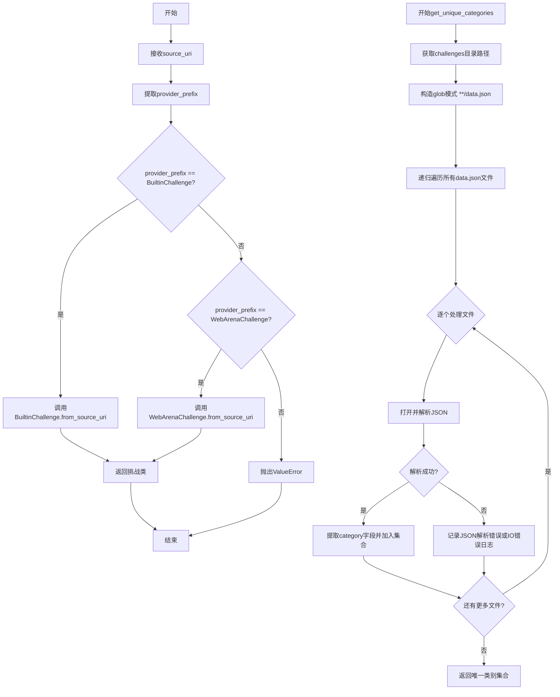
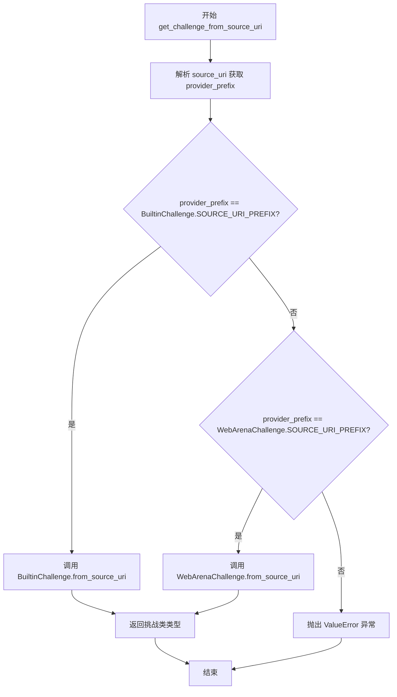
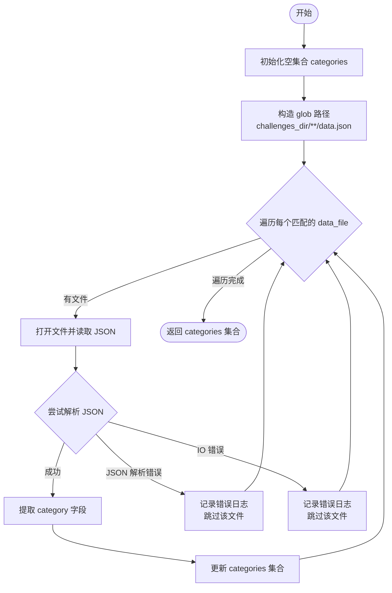
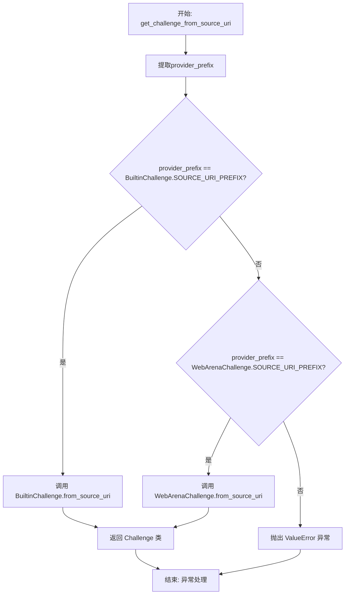
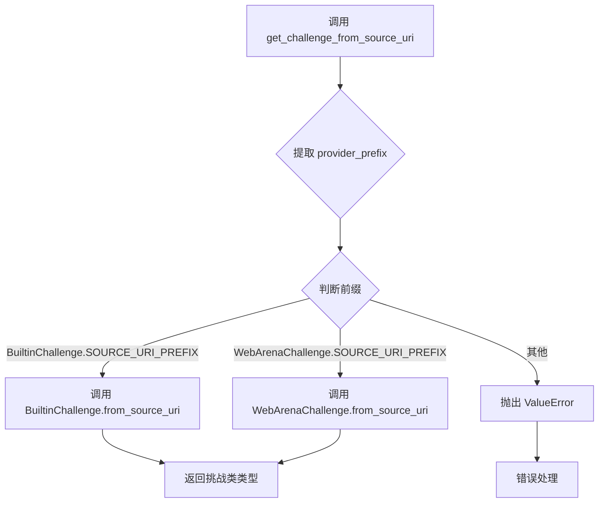

# `.\AutoGPT\classic\benchmark\agbenchmark\challenges\__init__.py` 详细设计文档

该模块是挑战管理系统的入口模块，主要提供动态加载不同类型挑战（BuiltinChallenge和WebArenaChallenge）的功能，以及扫描所有挑战规范文件收集唯一类别标签的工具函数。

## 整体流程



## 类结构

```
BaseChallenge (抽象基类)
├── BuiltinChallenge
└── WebArenaChallenge

ChallengeInfo (数据类)

OPTIONAL_CATEGORIES (常量集合)
```

## 全局变量及字段


### `logger`
    
模块级别的日志记录器，用于记录错误和调试信息

类型：`logging.Logger`
    


### `OPTIONAL_CATEGORIES`
    
从builtin模块导入的可选挑战类别集合

类型：`set[str]`
    


### `BaseChallenge.SOURCE_URI_PREFIX`
    
类属性，表示挑战源的URI前缀，用于标识挑战来源

类型：`str`
    
    

## 全局函数及方法


### `get_challenge_from_source_uri`

该函数是一个工厂方法，用于根据提供的资源 URI（source_uri）解析并返回对应的挑战类类型。它通过识别 URI 的前缀来确定提供者类型，然后委托给相应的挑战类进行实例化。

参数：

- `source_uri`：`str`，挑战资源的统一资源标识符（URI），格式为 `{provider_prefix}/{challenge_id}`

返回值：`type[BaseChallenge]`，返回对应的挑战类类型（BuiltinChallenge 或 WebArenaChallenge 的子类）

#### 流程图



#### 带注释源码

```python
def get_challenge_from_source_uri(source_uri: str) -> type[BaseChallenge]:
    """
    根据资源 URI 解析并返回对应的挑战类类型。
    
    参数:
        source_uri: 挑战资源的统一资源标识符，格式为 {provider_prefix}/{challenge_id}
    
    返回:
        对应的挑战类类型（BuiltinChallenge 或 WebArenaChallenge 的子类）
    
    异常:
        ValueError: 当 provider_prefix 无法识别时抛出
    """
    # 延迟导入，避免循环依赖
    from .builtin import BuiltinChallenge
    from .webarena import WebArenaChallenge

    # 从 URI 中提取提供者前缀（第一个 "/" 之前的部分）
    provider_prefix = source_uri.split("/", 1)[0]

    # 检查是否为内置挑战提供者
    if provider_prefix == BuiltinChallenge.SOURCE_URI_PREFIX:
        # 委托给 BuiltinChallenge 类进行解析
        return BuiltinChallenge.from_source_uri(source_uri)

    # 检查是否为 WebArena 挑战提供者
    if provider_prefix == WebArenaChallenge.SOURCE_URI_PREFIX:
        # 委托给 WebArenaChallenge 类进行解析
        return WebArenaChallenge.from_source_uri(source_uri)

    # 无法识别提供者前缀，抛出异常
    raise ValueError(f"Cannot resolve source_uri '{source_uri}'")
```


### `get_unique_categories`

该函数扫描项目中的所有挑战规格文件（data.json），从中提取并合并所有唯一的类别标签，最终返回一个包含所有不重复挑战类别的字符串集合。

参数： 无

返回值：`set[str]`，返回一个包含所有挑战类别的字符串集合

#### 流程图



#### 带注释源码

```python
def get_unique_categories() -> set[str]:
    """
    Reads all challenge spec files and returns a set of all their categories.
    """
    # 初始化一个空集合用于存储类别
    categories = set()

    # 获取当前文件所在的目录作为挑战文件的基础目录
    challenges_dir = Path(__file__).parent
    # 构造递归搜索路径，匹配所有 data.json 文件
    glob_path = f"{challenges_dir}/**/data.json"

    # 递归遍历所有匹配的 JSON 文件
    for data_file in glob.glob(glob_path, recursive=True):
        with open(data_file, "r") as f:
            try:
                # 解析 JSON 文件内容
                challenge_data = json.load(f)
                # 获取 category 字段（可能是一个列表），并更新集合
                # .get() 方法在字段不存在时返回空列表，避免 KeyError
                categories.update(challenge_data.get("category", []))
            except json.JSONDecodeError:
                # 处理无效 JSON 格式的文件，记录错误并继续处理其他文件
                logger.error(f"Error: {data_file} is not a valid JSON file.")
                continue
            except IOError:
                # 处理文件读取 I/O 错误，记录错误并继续处理其他文件
                logger.error(f"IOError: file could not be read: {data_file}")
                continue

    # 返回所有收集到的唯一类别
    return categories
```


### `get_challenge_from_source_uri`

此函数用于根据提供的数据源 URI 解析并返回对应的 Challenge 类。它通过检查 URI 的前缀来区分不同的 Challenge 提供者（如内置挑战和 WebArena 挑战），并调用相应类的 `from_source_uri` 类方法进行实例化。

参数：

-  `source_uri`：`str`，Challenge 的资源标识符 URI，格式为 `{provider_prefix}/{challenge_id}`

返回值：`type[BaseChallenge]`，返回对应的 Challenge 类类型

#### 流程图



#### 带注释源码

```
def get_challenge_from_source_uri(source_uri: str) -> type[BaseChallenge]:
    """
    根据source_uri解析并返回对应的Challenge类。
    
    Args:
        source_uri: Challenge的资源标识符，格式为 "{provider_prefix}/{challenge_id}"
    
    Returns:
        对应的Challenge类类型
    
    Raises:
        ValueError: 当provider_prefix无法识别时
    """
    # 延迟导入，避免循环依赖
    from .builtin import BuiltinChallenge
    from .webarena import WebArenaChallenge

    # 从URI中提取提供者前缀（第一个 "/" 之前的部分）
    provider_prefix = source_uri.split("/", 1)[0]

    # 检查是否是内置挑战
    if provider_prefix == BuiltinChallenge.SOURCE_URI_PREFIX:
        # 调用BuiltinChallenge类的from_source_uri类方法
        return BuiltinChallenge.from_source_uri(source_uri)

    # 检查是否是WebArena挑战
    if provider_prefix == WebArenaChallenge.SOURCE_URI_PREFIX:
        # 调用WebArenaChallenge类的from_source_uri类方法
        return WebArenaChallenge.from_source_uri(source_uri)

    # 前缀不匹配，抛出异常
    raise ValueError(f"Cannot resolve source_uri '{source_uri}'")
```

---

**注意**：您请求的 `BaseChallenge.from_source_uri` 类方法并未在提供的代码中直接定义。该代码中定义的是独立函数 `get_challenge_from_source_uri`，它内部调用了 `BuiltinChallenge.from_source_uri` 和 `WebArenaChallenge.from_source_uri` 这两个类方法。`BaseChallenge.from_source_uri` 的具体实现应该位于 `base.py` 文件中，但该文件未在当前代码片段中提供。


# 问题分析

在提供的代码中，我没有找到 `BuiltinChallenge` 类的定义，也没有 `from_source_uri` 方法。

提供的代码是一个模块文件（可能是 `__init__.py`），其中包含：

1. `get_challenge_from_source_uri` 函数 - 该函数内部调用了 `BuiltinChallenge.from_source_uri(source_uri)`
2. `get_unique_categories` 函数 - 读取所有挑战规范文件并返回所有类别的集合
3. 一些导入和导出

由于 `BuiltinChallenge` 类不在当前代码片段中，我无法直接提取 `from_source_uri` 方法。

---

# 可提供的文档：get_challenge_from_source_uri

虽然不是原始请求的方法，但我可以从提供的代码中提取 `get_challenge_from_source_uri` 函数，这是调用 `BuiltinChallenge.from_source_uri` 的上层函数。

### `get_challenge_from_source_uri`

该函数根据 source_uri 解析并返回对应的 Challenge 类。它通过检查 URI 前缀来确定是内置挑战（BuiltinChallenge）还是 Web Arena 挑战（WebArenaChallenge），并委托给相应类的 `from_source_uri` 静态方法进行具体解析。

参数：

- `source_uri`：`str`，挑战资源的统一资源标识符，格式为 "{provider_prefix}/{challenge_id}"

返回值：`type[BaseChallenge]`，返回对应的 Challenge 类类型

#### 流程图

```mermaid
flowchart TD
    A[开始: get_challenge_from_source_uri] --> B[提取provider_prefix<br/>source_uri.split("/", 1)[0]]
    C{provider_prefix ==<br/>BuiltinChallenge.SOURCE_URI_PREFIX?}
    C -->|是| D[调用<br/>BuiltinChallenge.from_source_uri]
    C -->|否| E{provider_prefix ==<br/>WebArenaChallenge.SOURCE_URI_PREFIX?}
    E -->|是| F[调用<br/>WebArenaChallenge.from_source_uri]
    E -->|否| G[抛出ValueError<br/>Cannot resolve source_uri]
    D --> H[返回 Challenge 类]
    F --> H
    G --> I[结束: 异常处理]
    H --> J[结束: 返回结果]
```

#### 带注释源码

```python
def get_challenge_from_source_uri(source_uri: str) -> type[BaseChallenge]:
    """
    根据给定的 source_uri 解析并返回对应的 Challenge 类。
    
    该函数通过检查 URI 的前缀来确定挑战的提供者类型，
    并委托给相应提供者的 from_source_uri 方法进行具体解析。
    """
    # 导入避免循环依赖
    from .builtin import BuiltinChallenge
    from .webarena import WebArenaChallenge

    # 提取 provider 前缀（URI 的第一部分）
    provider_prefix = source_uri.split("/", 1)[0]

    # 检查是否是内置挑战
    if provider_prefix == BuiltinChallenge.SOURCE_URI_PREFIX:
        # 委托给 BuiltinChallenge 的 from_source_uri 方法
        return BuiltinChallenge.from_source_uri(source_uri)

    # 检查是否是 Web Arena 挑战
    if provider_prefix == WebArenaChallenge.SOURCE_URI_PREFIX:
        # 委托给 WebArenaChallenge 的 from_source_uri 方法
        return WebArenaChallenge.from_source_uri(source_uri)

    # 如果无法识别 provider 前缀，抛出异常
    raise ValueError(f"Cannot resolve source_uri '{source_uri}'")
```

---

# 建议

如果您需要 `BuiltinChallenge.from_source_uri` 的完整文档，请提供包含该类定义的代码文件。通常该类会在 `builtin.py` 文件中定义。


### `WebArenaChallenge.from_source_uri`

从提供的代码中无法直接获取 `WebArenaChallenge.from_source_uri` 方法的实现。该方法在 `get_challenge_from_source_uri` 函数中被调用，通过导入 `from .webarena import WebArenaChallenge` 可知该类定义在同包下的 `webarena.py` 文件中。以下信息基于代码上下文推断：

参数：

-  `source_uri`：`str`，挑战来源的统一资源标识符，用于定位具体的挑战实例

返回值：`type[BaseChallenge]`，返回对应的挑战类类型（BaseChallenge 的子类）

#### 流程图



#### 带注释源码

```python
def get_challenge_from_source_uri(source_uri: str) -> type[BaseChallenge]:
    """
    根据 source_uri 解析并返回对应的挑战类。
    
    参数:
        source_uri: str - 挑战来源的统一资源标识符，格式为 "前缀/挑战标识"
    
    返回:
        type[BaseChallenge] - 返回对应的挑战类类型（BaseChallenge 的子类）
    """
    from .builtin import BuiltinChallenge
    from .webarena import WebArenaChallenge

    # 提取 URI 前缀（第一个 "/" 之前的部分）作为提供者标识
    provider_prefix = source_uri.split("/", 1)[0]

    # 判断是否为内置挑战
    if provider_prefix == BuiltinChallenge.SOURCE_URI_PREFIX:
        return BuiltinChallenge.from_source_uri(source_uri)

    # 判断是否为 WebArena 挑战
    if provider_prefix == WebArenaChallenge.SOURCE_URI_PREFIX:
        # 注意：此处调用了 WebArenaChallenge.from_source_uri 方法
        # 但该方法的实现在 webarena.py 文件中，未在当前代码段中提供
        return WebArenaChallenge.from_source_uri(source_uri)

    # 无法识别的前缀，抛出异常
    raise ValueError(f"Cannot resolve source_uri '{source_uri}'")
```

---

**注意**：提供的代码片段中仅包含 `get_challenge_from_source_uri` 函数对 `WebArenaChallenge.from_source_uri` 的调用，要获取该方法的完整实现（包含类字段、类方法、流程图和带注释源码），需要查看同目录下的 `webarena.py` 文件。


## 关键组件


### 挑战工厂函数 (get_challenge_from_source_uri)

该函数根据source_uri的前缀解析并返回对应的挑战类型，支持BuiltinChallenge和WebArenaChallenge两种provider，通过provider_prefix匹配实现动态路由，若无法识别则抛出ValueError异常。

### 类别聚合器 (get_unique_categories)

该函数使用glob递归扫描所有data.json文件，读取其中的category字段并聚合为集合返回，包含JSON解析错误和IO错误的异常处理与日志记录。

### 导入的基类与常量

从base模块导入BaseChallenge（挑战基类）和ChallengeInfo（挑战信息数据结构），从builtin模块导入OPTIONAL_CATEGORIES（可选类别常量集合），这些构成模块的公共API接口。

### Provider前缀解析机制

通过source_uri字符串分割提取provider_prefix（如"builtin"或"webarena"），与预定义的SOURCE_URI_PREFIX常量进行匹配，这是实现多provider支持的核心路由逻辑。

### 动态模块导入

在get_challenge_from_source_uri函数内部进行延迟导入（lazy import），避免循环依赖并提高模块加载效率。

### JSON数据文件扫描

使用Path和glob组合递归查找challenge规格文件，遵循项目目录结构约定（challenges_dir下的**/data.json模式）。


## 问题及建议


### 已知问题

-   **函数内导入（Import inside function）**：`get_challenge_from_source_uri` 函数内部导入 `BuiltinChallenge` 和 `WebArenaChallenge`，每次调用函数都会执行导入操作，影响性能且不符合最佳实践
-   **硬编码的提供者扩展性差**：当前仅支持 `BuiltinChallenge` 和 `WebArenaChallenge` 两种 challenge 提供者，新增提供者需修改源码，不符合开闭原则（OCP）
-   **缺少 source_uri 格式验证**：未对 `source_uri` 参数进行有效性检查，若传入空字符串或格式异常的字符串，可能导致运行时错误或难以追踪的问题
-   **get_unique_categories 重复扫描文件**：每次调用该函数都会使用 glob 递归扫描所有 `data.json` 文件，当文件数量增多时性能低下，缺乏缓存机制
-   **文件路径构造方式**：使用字符串拼接构造 glob 路径 `f"{challenges_dir}/**/data.json"`，虽然功能可行但不够规范，应使用 Path 对象统一处理
-   **模块导出不完整**：`__all__` 列表中未包含 `get_challenge_from_source_uri` 函数，影响模块的公开 API 透明度
-   **异常处理粒度不当**：同时捕获 `json.JSONDecodeError` 和 `IOError` 并使用相同的 continue 逻辑，可合并处理或区分更细粒度的异常类型
-   **category 字段处理假设**：代码假设 `challenge_data.get("category", [])` 返回列表类型，若返回其他可迭代对象可能导致类型错误

### 优化建议

-   **将函数内导入移至模块顶部**：将 `BuiltinChallenge` 和 `WebArenaChallenge` 的导入移至文件顶部，避免重复导入开销
-   **引入插件式架构或注册机制**：使用注册表模式动态注册 challenge 提供者，消除硬编码的 if-else 分支，提高扩展性
-   **添加输入参数校验**：在 `get_challenge_from_source_uri` 入口处校验 `source_uri` 参数非空且符合基本格式规范
-   **实现结果缓存**：使用 `@functools.lru_cache` 或自定义缓存装饰器缓存 `get_unique_categories` 的结果，避免重复 I/O 操作；或提供手动刷新缓存的接口
-   **统一使用 Path 对象**：使用 `Path(challenges_dir) / "**" / "data.json"` 构造 glob 路径，提升代码可读性和可维护性
-   **完善 __all__ 导出列表**：将 `get_challenge_from_source_uri` 添加至 `__all__` 列表，保持 API 导出的一致性
-   **增强异常处理**：对 JSON 解析错误和 IO 错误分别记录更详细的日志信息（如异常堆栈），便于问题排查
-   **添加类型校验**：对 `challenge_data.get("category", [])` 的返回值进行类型检查，确保其为 list 或其他可迭代类型后再进行处理

## 其它


### 设计目标与约束

该模块的主要设计目标是提供一个统一的挑战（Challenge）获取机制，能够根据source_uri动态解析并返回对应提供者的Challenge类，同时支持扫描所有挑战规范文件以获取所有可用的类别集合。约束方面，该模块假设所有挑战规范文件都命名为data.json并存在于challenges_dir目录下，且source_uri必须以特定前缀（BuiltinChallenge.SOURCE_URI_PREFIX或WebArenaChallenge.SOURCE_URI_PREFIX）开头才能被正确解析。

### 错误处理与异常设计

代码中涉及三类异常处理：首先是ValueError，当传入的source_uri无法匹配任何已知的provider_prefix时抛出；其次是JSONDecodeError，当data.json文件格式不正确时捕获并记录错误；最后是IOError，当文件无法读取时捕获并记录错误。所有异常都会通过logger记录具体的错误信息，但不会中断程序继续执行其他文件的扫描。

### 数据流与状态机

数据流主要分为两条路径：路径一为Challenge解析流程，接收source_uri字符串，提取provider_prefix，根据前缀匹配调用对应Challenge类的from_source_uri方法，返回Challenge类对象；路径二为类别发现流程，从challenges_dir目录递归搜索所有data.json文件，逐个读取并解析JSON，提取category字段并合并到集合中，最终返回所有唯一类别的集合。整个过程不涉及复杂的状态机，属于简单的线性数据处理流程。

### 外部依赖与接口契约

该模块依赖于三个外部模块契约：BaseChallenge和ChallengeInfo来自.base模块，定义了挑战的基本抽象接口；BuiltinChallenge来自.builtin模块，需提供SOURCE_URI_PREFIX常量和from_source_uri静态方法；WebArenaChallenge来自.webarena模块，同样需提供SOURCE_URI_PREFIX常量和from_source_uri静态方法；OPTIONAL_CATEGORIES来自.builtin模块，提供可选类别的预定义集合。所有Challenge类都必须实现from_source_uri静态方法，接收source_uri字符串并返回对应的Challenge实例。

### 模块初始化与导出

该模块通过__all__显式导出四个公共接口：BaseChallenge（基类）、ChallengeInfo（信息类）、get_unique_categories函数和OPTIONAL_CATEGORIES常量。get_challenge_from_source_uri函数未包含在__all__中但仍可正常导入使用，这可能是一个设计疏忽，建议根据实际使用场景决定是否将其加入公开API。

### 技术债务与优化空间

当前实现存在以下优化空间：JSONDecodeError和IOError的异常处理逻辑几乎完全相同，可以合并为一个except子句；get_unique_categories函数每次调用都会重新扫描文件系统，对于类别列表相对稳定的场景，可以考虑添加缓存机制；source_uri解析逻辑仅支持两个provider，如果需要扩展更多提供者，当前switch-case式的if-else结构需要改为更灵活的注册机制；glob.glob的recursive=True在大型项目中可能产生性能问题，可以考虑限制搜索深度或使用异步IO。

    