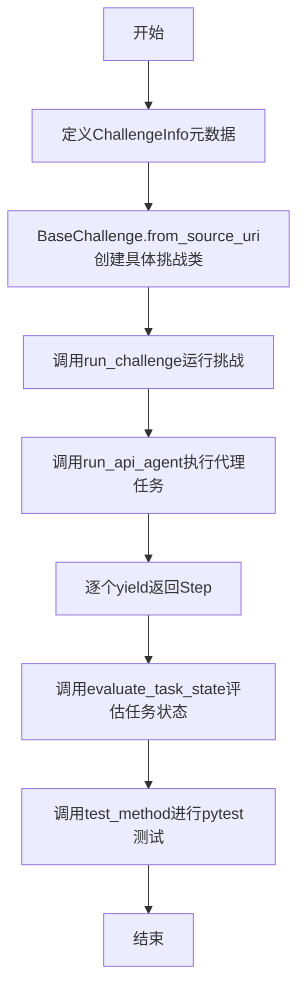
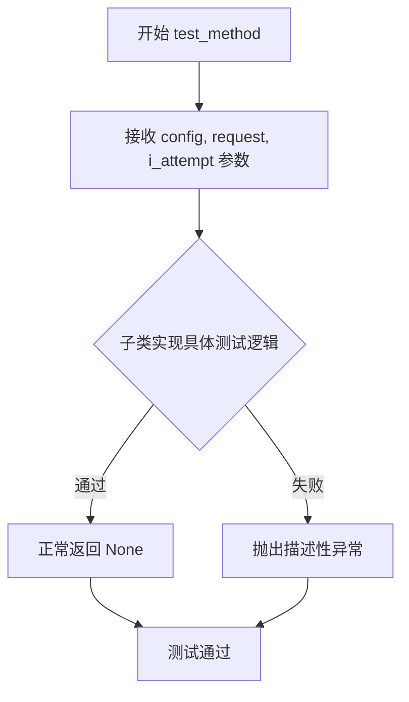
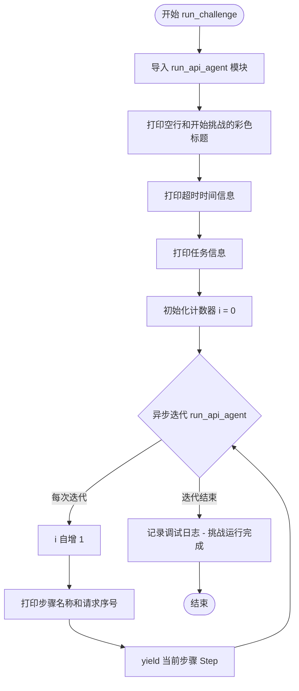
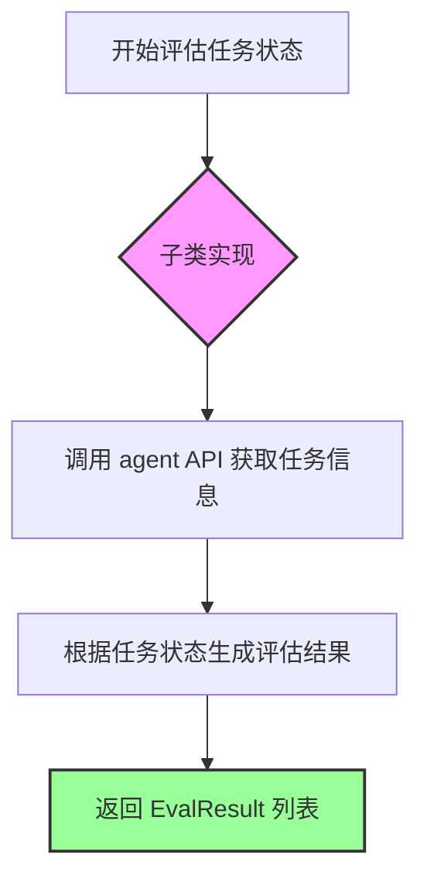

# `.\AutoGPT\classic\benchmark\agbenchmark\challenges\base.py` 详细设计文档

该文件定义了基准测试框架的抽象基类BaseChallenge和挑战信息模型ChallengeInfo，用于标准化AI代理挑战的实现、评估和运行流程。

## 整体流程



## 类结构

```
ChallengeInfo (Pydantic BaseModel)
└── BaseChallenge (ABC 抽象基类)
    ├── 抽象方法: from_source_uri
    ├── 抽象方法: test_method
    ├── 抽象方法: evaluate_task_state
    └── 具体方法: run_challenge
```

## 全局变量及字段


### `logger`
    
用于记录模块日志的日志记录器对象

类型：`logging.Logger`
    


### `ChallengeInfo.eval_id`
    
评估ID，用于唯一标识评估任务

类型：`str`
    


### `ChallengeInfo.name`
    
挑战名称，标识挑战的名称

类型：`str`
    


### `ChallengeInfo.task`
    
任务描述，描述挑战需要完成的具体任务

类型：`str`
    


### `ChallengeInfo.task_artifacts_dir`
    
任务 artifacts 目录，包含任务相关的文件资源路径

类型：`Optional[Path]`
    


### `ChallengeInfo.category`
    
挑战类别列表，表示挑战所属的类别

类型：`list[Category]`
    


### `ChallengeInfo.difficulty`
    
难度级别，表示挑战的难度等级

类型：`Optional[DifficultyLevel]`
    


### `ChallengeInfo.description`
    
描述信息，提供挑战的详细描述

类型：`Optional[str]`
    


### `ChallengeInfo.dependencies`
    
依赖列表，列出挑战所需依赖的包或模块

类型：`list[str]`
    


### `ChallengeInfo.reference_answer`
    
参考答案，用于验证挑战答案的正确性

类型：`Optional[str]`
    


### `ChallengeInfo.source_uri`
    
挑战源URI，指向挑战规范的内部引用

类型：`str`
    


### `ChallengeInfo.available`
    
是否可用，标识挑战当前是否可用

类型：`bool`
    


### `ChallengeInfo.unavailable_reason`
    
不可用原因，说明挑战不可用时的具体原因

类型：`str`
    


### `BaseChallenge.info`
    
类变量，存储挑战的元信息数据

类型：`ClassVar[ChallengeInfo]`
    
    

## 全局函数及方法


我需要先查看 `agent_api_interface` 模块中 `run_api_agent` 函数的实际实现。让我搜索该文件。
<tool_call>
<tool name="SearchFiles">
<parameter name="path">.</parameter>
<parameter name="pattern">**/agent_api_interface.py</parameter>
</tool>
</tool_call>


### `BaseChallenge.from_source_uri`

从给定的 `source_uri` 构造对应的挑战子类实例。该方法是抽象方法，需要子类实现具体的解析逻辑。

参数：

- `source_uri`：`str`，挑战规范的内部引用，指向挑战规范的来源

返回值：`type["BaseChallenge"]`，返回解析 `source_uri` 后构造的具体挑战子类类型

#### 流程图

```mermaid
flowchart TD
    A[开始 from_source_uri] --> B{检查 source_uri 有效性}
    B -->|无效| C[抛出异常或返回错误]
    B -->|有效| D[解析 source_uri]
    D --> E[根据协议加载挑战规范]
    E --> F[实例化对应的挑战子类]
    F --> G[返回挑战子类类型]
    
    style D fill:#f9f,stroke:#333
    style E fill:#f9f,stroke:#333
    style F fill:#f9f,stroke:#333
    note: 此流程图展示抽象方法的一般实现模式，具体逻辑由子类决定
```

#### 带注释源码

```python
@classmethod
@abstractmethod
def from_source_uri(cls, source_uri: str) -> type["BaseChallenge"]:
    """
    Construct an individual challenge subclass from a suitable `source_uri` (as in
    `ChallengeInfo.source_uri`).
    
    Args:
        source_uri: str - Internal reference indicating the source of the challenge specification.
                     This URI should encode enough information to uniquely identify and 
                     locate the challenge specification.
    
    Returns:
        type[BaseChallenge] - The challenge subclass type that corresponds to the given
                             source_uri. This is a class (not an instance) that can be
                             used to create challenge instances.
    
    Note:
        This is an abstract method that must be implemented by concrete subclasses.
        Each subclass should define its own logic for parsing the source_uri and
        returning the appropriate challenge class.
    """
    ...  # 抽象方法，由子类实现具体逻辑
```


### `BaseChallenge.test_method`

抽象测试方法，定义了 pytest 基准测试会话的测试逻辑。子类需实现此方法以执行具体的挑战验证，成功时正常返回，失败时抛出描述性异常。

参数：

- `self`：`BaseChallenge` 子类实例，当前挑战对象本身
- `config`：`AgentBenchmarkConfig`，被测代理的基准配置，包含代理连接信息、运行参数等
- `request`：`pytest.FixtureRequest`，pytest 框架的 fixture 请求对象，用于访问测试上下文和 fixtures
- `i_attempt`：`int`，当前测试尝试的编号，从 1 开始计数，用于区分多次重试执行

返回值：`None | Awaitable[None]`，无返回值。若挑战通过则正常返回；若失败则抛出异常（推荐使用描述性异常）。

#### 流程图



#### 带注释源码

```python
@abstractmethod
def test_method(
    self,
    config: AgentBenchmarkConfig,
    request: pytest.FixtureRequest,
    i_attempt: int,
) -> None | Awaitable[None]:
    """
    Test method for use by Pytest-based benchmark sessions. Should return normally
    if the challenge passes, and raise a (preferably descriptive) error otherwise.
    
    Args:
        config: The subject agent's benchmark config.
        request: Pytest fixture request for accessing test context.
        i_attempt: The current attempt number (1-indexed).
    
    Returns:
        None or Awaitable[None]: Returns normally on success, never returns on failure
        (raises exception instead).
    """
    ...
```

#### 关键组件信息

| 组件名称 | 一句话描述 |
|---------|-----------|
| `BaseChallenge` | 所有具体挑战实现的基类和共享接口 |
| `test_method` | 子类必须实现的抽象测试方法，用于执行挑战验证逻辑 |
| `AgentBenchmarkConfig` | 代理基准测试配置数据模型 |
| `pytest.FixtureRequest` | pytest 框架的 fixture 请求对象 |

#### 潜在技术债务或优化空间

1. **返回值类型不够明确**：返回类型 `None | Awaitable[None]` 允许同步或异步实现，但缺乏对异步测试场景的明确指导，建议通过文档或类型检查工具加强约束。
2. **异常处理依赖于子类实现**：基类未定义统一的异常类型或错误报告机制，子类实现可能缺乏一致的错误处理风格。
3. **参数 `request` 使用不清晰**：`pytest.FixtureRequest` 的使用方式未在基类中定义或示例，子类实现时可能存在困惑。

#### 其它项目

**设计目标与约束**：
- 该方法设计为 pytest 兼容的测试入口点，遵循 pytest 约定（通过正常返回表示通过，通过抛出异常表示失败）。
- 支持同步和异步两种实现模式，通过返回类型 `Awaitable[None]` 兼容异步测试场景。

**错误处理与异常设计**：
- 基类不强制具体异常类型，但推荐子类抛出描述性异常以便调试。
- 异常应在测试失败时立即抛出，不应在内部吞没错误。

**数据流与状态机**：
- `test_method` 是挑战执行流程的终点之一，通常在 `run_challenge` 之后调用，用于验证代理输出是否符合预期。
- 参数 `i_attempt` 支持多次重试机制，便于统计和分析多次尝试的结果。

**外部依赖与接口契约**：
- 依赖 `pytest` 框架的 fixture 系统。
- 依赖 `AgentBenchmarkConfig` 配置对象获取代理相关信息。
- 子类实现需确保与基类声明的抽象方法签名一致。


### `BaseChallenge.run_challenge`

该方法是一个异步类方法，用于在指定超时时间内对受试代理运行挑战，并通过异步迭代器yield代理为挑战任务生成的各个步骤。同时会将基本的挑战和状态信息打印到标准输出。

参数：

- `cls`：代表类本身（classmethod的隐式参数）
- `config`：`AgentBenchmarkConfig`，受试代理的基准测试配置
- `timeout`：`int`，超时时间（秒），如果未完成则在该时间后停止运行
- `mock`：`bool`（关键字参数，默认为False），是否使用模拟模式

返回值：`AsyncIterator[Step]` ，返回代理为挑战任务生成的步骤迭代器

#### 流程图



#### 带注释源码

```python
@classmethod
async def run_challenge(
    cls, config: AgentBenchmarkConfig, timeout: int, *, mock: bool = False
) -> AsyncIterator[Step]:
    """
    Runs the challenge on the subject agent with the specified timeout.
    Also prints basic challenge and status info to STDOUT.

    Params:
        config: The subject agent's benchmark config.
        timeout: Timeout (seconds) after which to stop the run if not finished.

    Yields:
        Step: The steps generated by the agent for the challenge task.
    """
    # 避免循环导入，在方法内部导入依赖模块
    from agbenchmark.agent_api_interface import run_api_agent

    # 打印空行分隔输出
    print()
    # 打印挑战开始的彩色标题，使用Fore.MAGENTA和Style.BRIGHT增强显示
    print(
        f"{Fore.MAGENTA + Style.BRIGHT}{'='*24} "
        f"Starting {cls.info.name} challenge"
        f" {'='*24}{Style.RESET_ALL}"
    )
    # 打印超时时间配置
    print(f"{Fore.CYAN}Timeout:{Fore.RESET} {timeout} seconds")
    # 打印挑战任务描述
    print(f"{Fore.CYAN}Task:{Fore.RESET} {cls.info.task}")

    # 打印空行
    print()
    # 记录调试日志，记录挑战开始
    logger.debug(f"Starting {cls.info.name} challenge run")
    # 初始化步骤计数器
    i = 0
    # 异步迭代运行API代理返回的步骤流
    async for step in run_api_agent(
        cls.info.task, config, timeout, cls.info.task_artifacts_dir, mock=mock
    ):
        # 步骤计数加1
        i += 1
        # 打印当前步骤信息，包括挑战名称、步骤名称和请求序号
        print(f"[{cls.info.name}] - step {step.name} ({i}. request)")
        # 将步骤yield给调用者
        yield step
    # 记录调试日志，记录挑战完成
    logger.debug(f"Finished {cls.info.name} challenge run")
```


### `BaseChallenge.evaluate_task_state`

这是一个抽象的异步类方法，用于评估给定代理在特定任务上的执行状态，并返回评估结果列表。该方法由子类实现，以提供具体的任务状态评估逻辑。

参数：

- `cls`：类本身（classmethod 隐式参数）
- `agent`：`AgentApi`，代理 API 客户端实例，用于与代理交互以获取任务执行状态
- `task_id`：`str`，任务的唯一标识符，用于指定要评估的任务

返回值：`list[EvalResult]`，评估结果列表，包含对任务执行状态的各种评估

#### 流程图



#### 带注释源码

```python
@classmethod
@abstractmethod
async def evaluate_task_state(
    cls, agent: AgentApi, task_id: str
) -> list[EvalResult]:
    """
    抽象方法：评估任务状态
    
    此方法由子类实现，用于评估特定任务的执行状态。它会调用代理 API
    获取任务的当前状态，并根据预设的评估标准生成评估结果列表。
    
    参数说明:
        cls: 类本身，classmethod 的隐式参数
        agent: AgentApi 实例，代表要评估的代理
        task_id: 任务标识符，指定要评估哪个任务
    
    返回值:
        list[EvalResult]: 包含任务评估结果的列表，每个 EvalResult 代表
                         一个维度的评估结果（如正确性、效率等）
    
    注意:
        - 这是一个抽象方法，子类必须实现具体逻辑
        - 方法是异步的，需要使用 await 调用
        - 返回的评估结果用于判断挑战是否成功完成
        - 子类实现时应考虑任务的具体评估标准和成功条件
    """
    ...  # 子类必须实现此方法
```

## 关键组件


### ChallengeInfo

Pydantic数据模型，封装挑战的元信息，包括挑战ID、名称、任务描述、分类、难度级别、依赖项、参考答案以及可用性状态，用于在系统中传递和验证挑战配置数据。

### BaseChallenge

抽象基类，定义所有具体挑战实现的通用接口和共享行为，采用ABC模式确保子类实现必要方法，提供挑战运行、测试和评估的统一框架。

### from_source_uri

工厂方法模式，从给定的source_uri字符串构造对应的挑战子类类型，支持动态加载和实例化不同类型的挑战实现。

### test_method

测试方法接口，接收基准配置、pytest请求和尝试次数，执行挑战验证逻辑，通过返回None表示成功或抛出异常表示失败。

### run_challenge

异步迭代器方法，负责在指定超时时间内运行挑战任务，打印挑战信息和进度状态，通过yield生成agent执行的步骤，支持模拟模式开关。

### evaluate_task_state

抽象方法，定义评估挑战任务状态的接口，接收AgentApi实例和任务ID，返回评估结果列表。

### Category与DifficultyLevel

枚举类型定义（从agbenchmark.utils.data导入），分别表示挑战的分类和难度级别，用于标准化和组织挑战的元信息。

### AgentBenchmarkConfig

基准配置类（从agbenchmark.config导入），封装agent运行所需的配置参数，传递给挑战的测试和运行方法。

### 异步迭代器模式

使用AsyncIterator和yield实现流式返回agent执行步骤，允许调用方逐步处理每个步骤而不需等待全部完成，提高响应性和内存效率。


## 问题及建议


### 已知问题

-   **循环导入设计问题**：在 `run_challenge` 方法内部使用延迟导入（`from agbenchmark.agent_api_interface import run_api_agent`）来避免循环导入，这表明项目存在循环依赖的设计问题，应该通过重构模块结构来解决
-   **类型注解不一致**：使用 `list[Category]` 和 `list[str]` 语法（Python 3.9+），但未显式使用 `from __future__ import annotations`，在某些Python版本中可能不兼容
-   **抽象方法签名不完整**：`evaluate_task_state` 抽象方法仅有签名没有文档注释，而其他方法都有详细的文档说明
-   **硬编码的字符串**：魔法数字 `'='*24` 和颜色格式化字符串在多处重复出现，缺乏统一的常量定义
-   **日志级别使用不当**：使用 `logger.debug` 记录关键流程的开始和结束，在生产环境中这些信息可能被忽略，建议使用 `logger.info`
-   **缺乏超时异常处理**：虽然参数中包含 `timeout`，但代码中没有显式的超时异常处理逻辑
-   **test_method 返回类型设计**：`None | Awaitable[None]` 的返回类型允许同步和异步两种实现，这种灵活性可能导致测试框架行为不一致
-   **mock 参数位置不一致**：`mock` 参数使用关键字参数 `*, mock: bool = False`，但其他可选参数未采用相同风格

### 优化建议

-   将 `run_api_agent` 的导入移到模块顶部，并通过重构消除循环依赖
-   添加 `from __future__ import annotations` 以确保类型注解的前向引用兼容性
-   提取重复的字符串和格式化为常量类，如定义 `CHALLENGE_BANNER_LENGTH = 24`
-   为 `evaluate_task_state` 方法添加文档字符串，保持与其他方法的一致性
-   考虑使用更结构化的日志记录，如使用日志适配器添加上下文信息
-   统一 `mock` 参数的风格，与其他参数保持一致的设计模式
-   添加超时处理的显式异常抛出或重试逻辑
-   考虑为 `test_method` 的同步/异步实现制定明确的规范或分离为两个接口

## 其它


### 设计目标与约束

本模块作为Agent Benchmark框架的核心抽象层，旨在定义挑战(Challenge)的通用接口和元数据结构，使得不同类型的挑战可以以统一的方式被注册、执行和评估。设计约束包括：1) 必须继承BaseChallenge抽象类并实现所有抽象方法；2) ChallengeInfo必须提供完整的挑战元数据；3) 使用异步迭代器模式支持流式步骤输出；4) 依赖注入通过config参数传递以保持可测试性。

### 错误处理与异常设计

BaseChallenge的test_method设计为成功时正常返回，失败时抛出描述性异常。run_challenge方法不直接处理异常，而是将agent执行过程中的异常向上传播。关键异常场景包括：1) 超时异常由调用方处理；2) AgentApi连接异常；3) 任务_artifacts_dir路径不存在；4) from_source_uri无法解析source_uri时返回未实现异常。ChallengeInfo使用Pydantic进行数据验证，验证失败时抛出ValidationError。

### 数据流与状态机

Challenge的生命周期包含三个主要状态：1) 初始化状态 - 通过from_source_uri或直接实例化创建；2) 运行状态 - 通过run_challenge异步迭代器进入，agent执行任务并yield步骤；3) 评估状态 - 调用evaluate_task_state评估任务状态。每个Challenge实例在run_challenge期间维护内部计数器i用于跟踪步骤序号。

### 外部依赖与接口契约

本模块依赖以下外部包：1) agent_protocol_client.AgentApi和Step - agent通信协议；2) pytest.FixtureRequest - pytest fixtures访问；3) pydantic.BaseModel - 数据验证；4) colorama - 终端彩色输出。内部依赖agbenchmark.config.AgentBenchmarkConfig和agbenchmark.agent_api_interface.run_api_agent。ChallengeInfo的source_uri字段是内部契约，格式由挑战注册系统定义。

### 并发与异步处理设计

run_challenge使用async for异步迭代器模式，允许调用方逐个处理agent生成的步骤而无需等待全部完成。这种设计支持：1) 实时输出步骤信息；2) 可能的取消操作；3) 内存效率。Challenge类方法(clsmethod)允许在类级别共享info元数据，减少实例开销。mock参数支持无agent的测试模式。

### 安全性考虑

1) task_artifacts_dir使用Path类型防止路径遍历攻击；2) source_uri作为内部引用不直接暴露给外部agent；3) eval_id用于结果追踪但不包含敏感信息；4) 日志输出使用colorama仅用于人类可读的调试信息，不记录敏感数据。

### 配置管理

AgentBenchmarkConfig通过依赖注入传递给所有challenge方法，允许不同的测试场景使用不同的配置。ChallengeInfo中的可选字段如unavailable_reason用于在配置层面禁用特定挑战。timeout参数在run_challenge签名中显式声明，支持运行时配置。

### 日志与监控

使用标准logging模块，logger用于debug级别跟踪挑战开始和结束。print语句用于向STDOUT输出用户可见的状态信息，使用colorama实现彩色格式化。日志内容包括：挑战名称、任务描述、步骤序号、timeout值。EvalResult用于结构化评估结果，便于后续分析。

### 版本兼容性

代码使用Python 3.11+的类型注解语法(list[Category]而非List[Category])。AsyncIterator和Awaitable来自typing模块保持兼容性。Pydantic v2的Field和BaseModel用法。如需兼容旧版Python需修改类型注解并调整Pydantic用法。

    