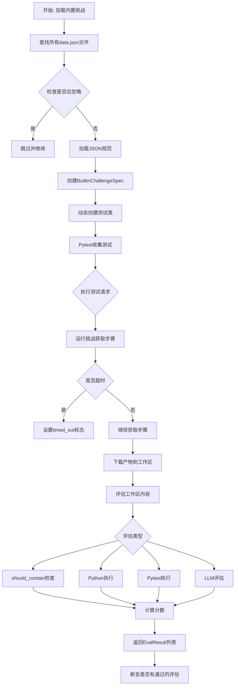
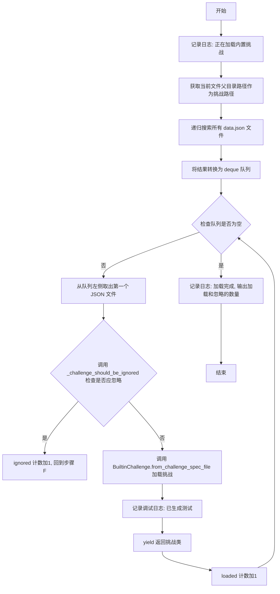
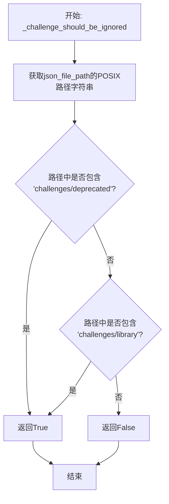
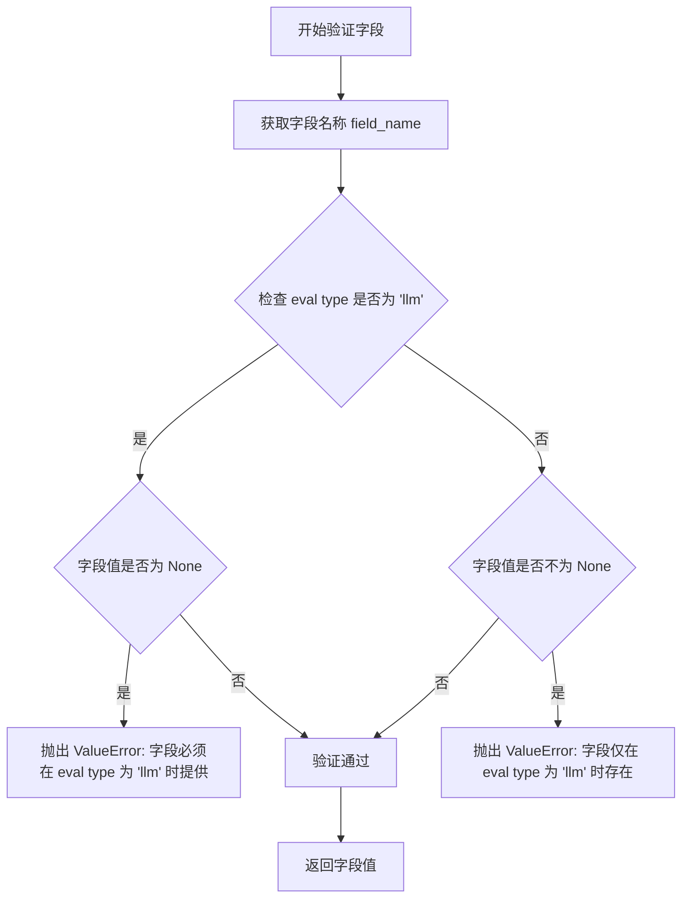
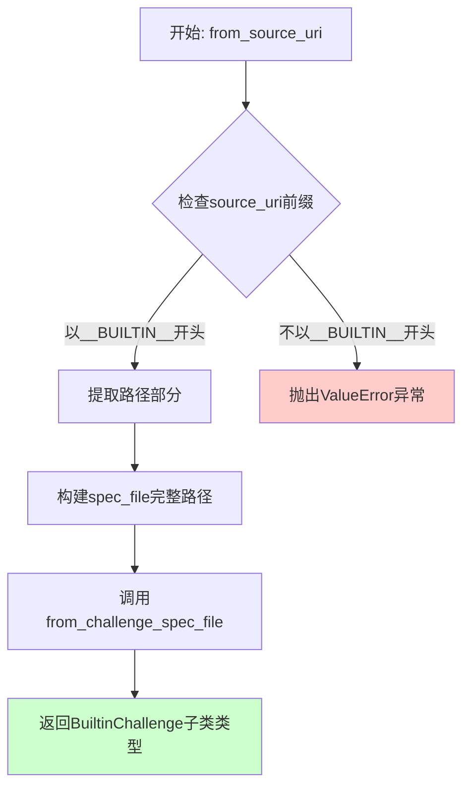
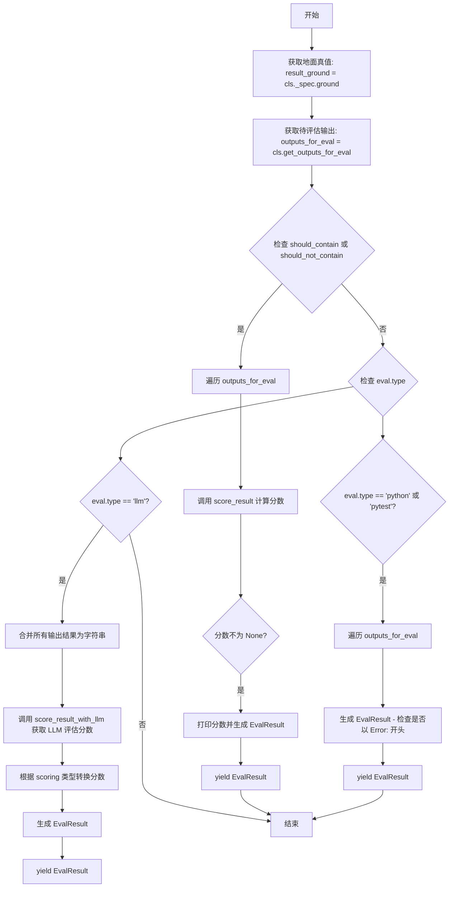
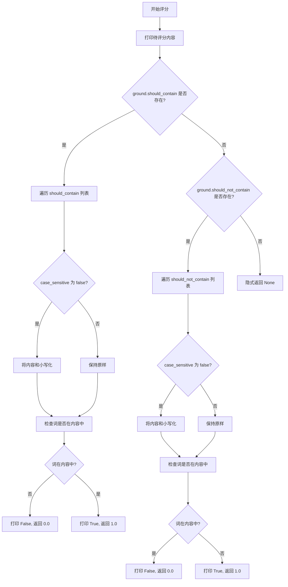
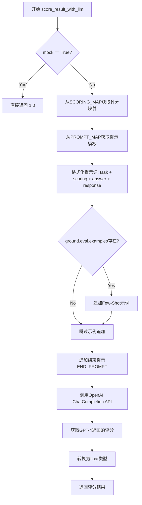

# `.\AutoGPT\classic\benchmark\agbenchmark\challenges\builtin.py` 详细设计文档

该代码实现了AGBenchmark的内置挑战测试框架，通过动态创建继承自BaseChallenge的测试类，从JSON规范文件加载挑战定义，支持多种评估方式（包含/不包含检查、Python执行、pytest测试、LLM评估），并提供完整的测试执行、结果评估和评分功能。

## 整体流程



## 类结构

```
BaseChallenge (抽象基类)
└── BuiltinChallenge (内置挑战实现类)
    ├── BuiltinChallengeSpec (Pydantic规范模型)
    │   ├── Info (难度和描述信息)
    │   ├── Ground (答案和评估规则)
    │   │   └── Eval (评估类型配置)
    │   └── metadata (元数据)
```

## 全局变量及字段


### `OPTIONAL_CATEGORIES`
    
从optional_categories.json加载的可选类别列表

类型：`list[str]`
    


### `logger`
    
模块级日志记录器

类型：`logging.Logger`
    


### `BuiltinChallengeSpec.eval_id`
    
评估ID

类型：`str`
    


### `BuiltinChallengeSpec.name`
    
挑战名称

类型：`str`
    


### `BuiltinChallengeSpec.task`
    
任务描述

类型：`str`
    


### `BuiltinChallengeSpec.category`
    
挑战类别列表

类型：`list[Category]`
    


### `BuiltinChallengeSpec.dependencies`
    
依赖列表

类型：`list[str]`
    


### `BuiltinChallengeSpec.cutoff`
    
超时时间

类型：`int`
    


### `BuiltinChallengeSpec.info`
    
难度和描述信息

类型：`Info`
    


### `BuiltinChallengeSpec.ground`
    
答案和评估规则

类型：`Ground`
    


### `BuiltinChallengeSpec.metadata`
    
额外元数据

类型：`Optional[dict[str, Any]]`
    


### `BuiltinChallengeSpec.spec_file`
    
规范文件路径

类型：`Path | None`
    


### `BuiltinChallengeSpec.Info.difficulty`
    
难度级别

类型：`DifficultyLevel`
    


### `BuiltinChallengeSpec.Info.description`
    
描述信息

类型：`Annotated[str, StringConstraints(...)]`
    


### `BuiltinChallengeSpec.Info.side_effects`
    
副作用列表

类型：`list[str]`
    


### `BuiltinChallengeSpec.Ground.answer`
    
参考答案

类型：`str`
    


### `BuiltinChallengeSpec.Ground.should_contain`
    
必须包含的词

类型：`Optional[list[str]]`
    


### `BuiltinChallengeSpec.Ground.should_not_contain`
    
不应包含的词

类型：`Optional[list[str]]`
    


### `BuiltinChallengeSpec.Ground.files`
    
要评估的文件列表

类型：`list[str]`
    


### `BuiltinChallengeSpec.Ground.case_sensitive`
    
是否区分大小写

类型：`Optional[bool]`
    


### `BuiltinChallengeSpec.Ground.eval`
    
评估配置

类型：`Eval`
    


### `BuiltinChallengeSpec.Ground.Eval.type`
    
评估类型(python/pytest/llm)

类型：`str`
    


### `BuiltinChallengeSpec.Ground.Eval.scoring`
    
计分方式

类型：`Optional[Literal[...]]`
    


### `BuiltinChallengeSpec.Ground.Eval.template`
    
提示模板类型

类型：`Optional[Literal[...]]`
    


### `BuiltinChallengeSpec.Ground.Eval.examples`
    
少样本示例

类型：`Optional[str]`
    


### `BuiltinChallenge._spec`
    
类级别的挑战规范

类型：`ClassVar[BuiltinChallengeSpec]`
    


### `BuiltinChallenge.CHALLENGE_LOCATION`
    
挑战文件位置

类型：`ClassVar[str]`
    


### `BuiltinChallenge.ARTIFACTS_LOCATION`
    
产物目录位置

类型：`ClassVar[str]`
    


### `BuiltinChallenge.SOURCE_URI_PREFIX`
    
源URI前缀

类型：`str`
    
    

## 全局函数及方法


### `load_builtin_challenges`

该函数用于扫描并加载所有内置挑战规范文件（data.json），通过遍历指定路径下的 JSON 文件，利用 `_challenge_should_be_ignored` 辅助函数过滤掉已弃用（deprecated）和库（library）相关的挑战，最后将每个符合规范的文件转换为 `BuiltinChallenge` 类型的类并作为迭代器返回。

参数：

- 无参数

返回值：`Iterator[type[BuiltinChallenge]]`，返回一个挑战类类型的迭代器，每个元素都是 `BuiltinChallenge` 的子类。

#### 流程图



#### 带注释源码

```python
def load_builtin_challenges() -> Iterator[type[BuiltinChallenge]]:
    """加载所有内置挑战,返回挑战类迭代器"""
    # 记录日志,表示开始加载内置挑战
    logger.info("Loading built-in challenges...")

    # 获取当前文件所在目录作为挑战文件的基础路径
    challenges_path = Path(__file__).parent
    # 记录调试日志,显示搜索路径
    logger.debug(f"Looking for challenge spec files in {challenges_path}...")

    # 使用 rglob 递归搜索所有名为 data.json 的文件
    # 并将结果转换为 deque 队列以便高效地进行 popleft 操作
    json_files = deque(challenges_path.rglob("data.json"))

    # 记录找到的挑战文件数量
    logger.debug(f"Found {len(json_files)} built-in challenges.")

    # 初始化加载和忽略计数器
    loaded, ignored = 0, 0
    # 遍历所有 JSON 文件
    while json_files:
        # Take and remove the first element from json_files
        # 从队列左侧取出第一个 JSON 文件
        json_file = json_files.popleft()
        # 检查该文件是否应被忽略(位于 deprecated 或 library 目录)
        if _challenge_should_be_ignored(json_file):
            # 忽略计数加1,继续处理下一个文件
            ignored += 1
            continue

        # 根据 JSON 文件规范创建挑战类
        challenge = BuiltinChallenge.from_challenge_spec_file(json_file)
        # 记录调试日志,显示已生成的测试名称
        logger.debug(f"Generated test for {challenge.info.name}")
        # 使用 yield 返回挑战类(作为迭代器返回)
        yield challenge

        # 加载计数加1
        loaded += 1

    # 记录最终加载结果:加载数量和忽略数量
    logger.info(
        f"Loading built-in challenges complete: loaded {loaded}, ignored {ignored}."
    )


def _challenge_should_be_ignored(json_file_path: Path) -> bool:
    """
    检查挑战文件是否应被忽略
    
    参数:
        json_file_path: 挑战规范文件的路径
        
    返回:
        bool: 如果文件路径中包含 'challenges/deprecated' 或 'challenges/library',返回 True
    """
    # 检查路径字符串中是否包含需要忽略的目录
    return (
        "challenges/deprecated" in json_file_path.as_posix()
        or "challenges/library" in json_file_path.as_posix()
    )
```


### `_challenge_should_be_ignored`

检查挑战文件是否应该被忽略，如果挑战路径包含 "deprecated" 或 "library" 目录则返回 True，用于过滤掉已废弃或库类型的挑战。

参数：

- `json_file_path`：`Path`，需要检查的挑战规范文件路径

返回值：`bool`，如果挑战文件路径中包含 "challenges/deprecated" 或 "challenges/library" 则返回 True（应被忽略），否则返回 False（不应被忽略）

#### 流程图



#### 带注释源码

```python
def _challenge_should_be_ignored(json_file_path: Path):
    """
    检查挑战文件是否应该被忽略（位于deprecated或library目录中）。
    
    Args:
        json_file_path: 挑战规范文件（JSON）的路径对象
        
    Returns:
        bool: 如果文件路径包含 'challenges/deprecated' 或 'challenges/library'
             则返回 True，表示该挑战应被跳过；否则返回 False
    """
    return (
        "challenges/deprecated" in json_file_path.as_posix()
        or "challenges/library" in json_file_path.as_posix()
    )
```


### `BuiltinChallengeSpec.Ground.Eval.validate_eval_fields`

该方法是一个 Pydantic 字段验证器，用于验证 `scoring` 和 `template` 字段的有效性。它确保这两个字段仅在 eval 类型为 "llm" 时提供，并且在这种情况下必须提供。

参数：

- `cls`：类本身（类方法隐式参数）
- `value`：正在验证的字段值（`Any` 类型，当前验证的字段的值）
- `info`：`ValidationInfo` 类型，包含字段名称和数据的验证上下文信息

返回值：`Any` 类型，验证通过后返回字段值

#### 流程图



#### 带注释源码

```python
@field_validator("scoring", "template")
def validate_eval_fields(cls, value, info: ValidationInfo):
    """
    验证 scoring 和 template 字段的有效性。
    
    业务规则：
    1. 当 eval type 为 'llm' 时，scoring 和 template 必须提供
    2. 当 eval type 不为 'llm' 时，scoring 和 template 必须不提供
    """
    # 从 ValidationInfo 获取当前验证的字段名称
    field_name = info.field_name
    
    # 检查 data 中是否存在 'type' 字段，并判断其值是否为 'llm'
    if "type" in info.data and info.data["type"] == "llm":
        # 当 eval type 为 'llm' 时，该字段必须有值
        if value is None:
            raise ValueError(
                f"{field_name} must be provided when eval type is 'llm'"
            )
    else:
        # 当 eval type 不为 'llm' 时，该字段必须为 None
        if value is not None:
            raise ValueError(
                f"{field_name} should only exist when eval type is 'llm'"
            )
    
    # 验证通过，返回原始值
    return value
```


### `BuiltinChallenge.from_challenge_spec`

从挑战规范对象动态创建并返回一个挑战测试类（注意：返回的是类类型而非实例）。该方法通过构建 `ChallengeInfo` 对象并使用 Python 的 `type()` 函数动态创建新的子类，使每个挑战都能被 Pytest 正确收集和执行。

参数：

-  `spec`：`BuiltinChallengeSpec`，包含挑战的名称、任务、类别、依赖、截止时间、难度、地面真值（ground truth）和评估配置等完整规范

返回值：`type["BuiltinChallenge"]`，返回一个动态创建的 `BuiltinChallenge` 子类类型，可直接用于 Pytest 测试收集

#### 流程图

```mermaid
flowchart TD
    A[开始 from_challenge_spec] --> B{检查 spec.spec_file 是否存在}
    B -->|不存在| C[抛出 ValueError: spec.spec_file not defined]
    B -->|存在| D[创建 ChallengeInfo 对象]
    D --> E[从 spec 构建 eval_id, name, task, category, difficulty, description, dependencies, reference_answer, source_uri]
    E --> F[生成类名: Test{challenge_info.name}]
    F --> G[使用 type 动态创建新类]
    G --> H[设置 info, _spec, CHALLENGE_LOCATION, ARTIFACTS_LOCATION 类属性]
    H --> I[返回新创建的类类型]
```

#### 带注释源码

```python
@classmethod
def from_challenge_spec(
    cls, spec: BuiltinChallengeSpec
) -> type["BuiltinChallenge"]:
    """
    从给定的挑战规范动态创建一个 BuiltinChallenge 子类
    
    参数:
        spec: BuiltinChallengeSpec 类型的挑战规范对象，包含完整的挑战定义
        
    返回:
        type[BuiltinChallenge]: 一个新的类类型（非实例），可直接用于 Pytest 收集
    """
    # 验证 spec_file 已设置，这是定位挑战工件的关键路径
    if not spec.spec_file:
        raise ValueError("spec.spec_file not defined")

    # 构建 ChallengeInfo 对象，整合挑战的元数据信息
    # 这些信息将在测试执行时被用于日志记录和结果评估
    challenge_info = ChallengeInfo(
        eval_id=spec.eval_id,
        name=spec.name,
        task=spec.task,
        task_artifacts_dir=spec.spec_file.parent,
        category=spec.category,
        difficulty=spec.info.difficulty,
        description=spec.info.description,
        dependencies=spec.dependencies,
        reference_answer=spec.ground.answer,
        source_uri=(
            f"__BUILTIN__/{spec.spec_file.relative_to(Path(__file__).parent)}"
        ),
    )

    # 生成符合 Pytest 命名约定的测试类名（必须以 Test 开头）
    challenge_class_name = f"Test{challenge_info.name}"
    logger.debug(f"Creating {challenge_class_name} from spec: {spec.spec_file}")
    
    # 使用 type() 动态创建新类
    # 参数: (类名, 父类元组, 属性字典)
    return type(
        challenge_class_name,
        (BuiltinChallenge,),
        {
            "info": challenge_info,                    # 挑战元数据
            "_spec": spec,                              # 原始规范引用
            "CHALLENGE_LOCATION": str(spec.spec_file), # 规范文件路径
            "ARTIFACTS_LOCATION": str(spec.spec_file.resolve().parent),  # 工件目录
        },
    )
```


### `BuiltinChallenge.from_challenge_spec_file`

从规范文件（JSON格式）创建并返回一个新的`BuiltinChallenge`子类。该方法是类工厂方法，接收一个规范文件路径，解析JSON内容为`BuiltinChallengeSpec`对象，然后通过`from_challenge_spec`方法动态创建继承自`BuiltinChallenge`的测试类，使其能够被Pytest收集并执行。

参数：

- `spec_file`：`Path`，规范JSON文件的文件系统路径

返回值：`type["BuiltinChallenge"]`，返回一个新创建的`BuiltinChallenge`子类类型，该子类包含从规范文件中解析的挑战信息和配置

#### 流程图

```mermaid
flowchart TD
    A[开始: from_challenge_spec_file] --> B[读取spec_file文件内容]
    B --> C[使用model_validate_json解析JSON为BuiltinChallengeSpec对象]
    C --> D[设置challenge_spec.spec_file = spec_file]
    D --> E[调用from_challenge_spec方法]
    E --> F[返回创建的BuiltinChallenge子类类型]
    
    subgraph from_challenge_spec
    G[验证spec.spec_file存在] --> H[创建ChallengeInfo对象]
    H --> I[生成挑战类名: Test{challenge_info.name}]
    I --> J[使用type创建新类]
    J --> K[返回新类]
    end
    
    E -.-> G
```

#### 带注释源码

```python
@classmethod
def from_challenge_spec_file(cls, spec_file: Path) -> type["BuiltinChallenge"]:
    """
    从规范文件创建BuiltinChallenge子类
    
    Args:
        spec_file: 包含挑战规范的JSON文件路径
        
    Returns:
        返回一个新创建的BuiltinChallenge子类类型
    """
    # 读取规范文件的内容并解析为BuiltinChallengeSpec模型
    challenge_spec = BuiltinChallengeSpec.model_validate_json(spec_file.read_text())
    
    # 将spec_file路径赋值给challenge_spec对象，供后续使用
    challenge_spec.spec_file = spec_file
    
    # 调用from_challenge_spec类方法完成挑战类的创建
    return cls.from_challenge_spec(challenge_spec)
```


### `BuiltinChallenge.from_source_uri`

从源URI创建BuiltinChallenge类，用于根据包含内置挑战规范的JSON文件路径来动态创建挑战测试类。

参数：
- `source_uri`：`str`，源URI字符串，格式为"__BUILTIN__/相对路径"，用于指定挑战规范文件的位置

返回值：`type["BuiltinChallenge"]`，返回一个动态创建的BuiltinChallenge子类类型，可用于pytest测试集合

#### 流程图



#### 带注释源码

```python
@classmethod
def from_source_uri(cls, source_uri: str) -> type["BuiltinChallenge"]:
    """
    从源URI创建BuiltinChallenge类。
    
    该方法接收一个源URI字符串，验证其格式后，定位对应的挑战规范JSON文件，
    并通过from_challenge_spec_file方法动态创建挑战测试类。
    
    参数:
        source_uri (str): 源URI字符串，格式为"__BUILTIN__/相对路径"
                          例如: "__BUILTIN__/data/math/data.json"
    
    返回:
        type[BuiltinChallenge]: 返回一个动态创建的BuiltinChallenge子类类型
    
    异常:
        ValueError: 当source_uri不以__BUILTIN__前缀开头时抛出
    """
    # 检查source_uri是否以类常量SOURCE_URI_PREFIX开头
    if not source_uri.startswith(cls.SOURCE_URI_PREFIX):
        # 如果前缀不匹配，抛出详细的错误信息
        raise ValueError(f"Invalid source_uri for BuiltinChallenge: {source_uri}")

    # 从source_uri中提取路径部分（去掉前缀"__BUILTIN__/"）
    # 使用split("/", 1)[1]分割字符串并取第二部分
    path = source_uri.split("/", 1)[1]
    
    # 构建完整的规范文件路径
    # Path(__file__).parent 获取当前文件所在目录的父目录
    # 然后与提取的path进行拼接
    spec_file = Path(__file__).parent / path
    
    # 调用from_challenge_spec_file方法，传入规范文件路径
    # 该方法会读取JSON文件、验证规范、创建挑战类并返回
    return cls.from_challenge_spec_file(spec_file)
```

#### 相关上下文信息

**类信息**：
- `BuiltinChallenge`：继承自`BaseChallenge`的基类，用于表示AGBenchmark的内置挑战
- `SOURCE_URI_PREFIX`：类常量，值为`"__BUILTIN__"`，用于标识内置挑战的URI前缀
- `_spec`：类变量，存储挑战规范对象`BuiltinChallengeSpec`

**方法调用链**：
```
from_source_uri
    └── from_challenge_spec_file
            └── from_challenge_spec
                    └── 创建ChallengeInfo对象
                    └── 动态创建子类（type函数）
```

**关键依赖**：
- `BuiltinChallengeSpec`：Pydantic模型，定义挑战规范的数据结构
- `Path`：用于处理文件路径的Python标准库
- `Path(__file__).parent`：获取当前Python文件所在目录的父目录

#### 潜在的技术债务或优化空间

1. **路径解析安全性**：当前实现直接拼接路径，可能存在路径遍历风险，建议增加路径规范化验证
2. **错误信息不够详细**：抛出异常时可考虑包含更多上下文信息，如允许的前缀格式等
3. **硬编码前缀**：SOURCE_URI_PREFIX作为类常量可考虑提取到配置中，提高灵活性


### `BuiltinChallenge.test_method`

执行挑战测试的主方法，负责运行代理任务、收集步骤信息、评估结果并断言通过条件。该方法是异步的，整合了挑战执行、结果收集和评估验证的完整流程。

参数：

- `self`：`BuiltinChallenge` 实例，当前挑战类实例
- `config`：`AgentBenchmarkConfig`，基准测试配置，包含主机地址等配置信息
- `request`：`pytest.FixtureRequest`，pytest  fixture 请求，用于获取命令行选项和存储测试结果属性
- `i_attempt`：`int`，当前尝试次数的索引

返回值：`None`，无显式返回值，通过抛出异常表示失败，或通过 `request.node.user_properties` 传递结果

#### 流程图

```mermaid
flowchart TD
    A[开始 test_method] --> B[获取超时时间: timeout = spec.cutoff 或 60]
    B --> C{检查 --nc 选项}
    C -->|是| D[timeout = 100000]
    C -->|否| E{检查 --cutoff 选项}
    E -->|是| F[timeout = int(cutoff)]
    E -->|否| G[初始化变量: task_id, n_steps, timed_out, agent_task_cost, steps]
    D --> G
    F --> G
    
    G --> H[async for step in run_challenge]
    H --> I{是否有 step}
    I -->|是| J[记录 task_id]
    J --> K[n_steps += 1]
    K --> L[steps.append(step)]
    L --> M{step.additional_output 存在}
    M -->|是| N[提取 agent_task_cost]
    M -->|否| I
    N --> I
    I -->|否| O{捕获 TimeoutError}
    O -->|是| P[timed_out = True]
    O -->|否| Q[继续执行]
    
    P --> R[添加 user_properties: steps, n_steps, timed_out, agent_task_cost]
    Q --> R
    
    R --> S[创建 AgentApi 客户端]
    S --> T[evaluate_task_state 获取 eval_results]
    T --> U{eval_results 存在?}
    U -->|否| V{是否 timed_out}
    V -->|是| W[抛出 TimeoutError]
    V -->|否| X[抛出 ValueError]
    U -->|是| Y[添加 answers 和 scores 到 user_properties]
    Y --> Z[断言: any(r.passed for r in eval_results)]
    Z -->|失败| AA[抛出 AssertionError]
    Z -->|成功| AB[结束]
    W --> AB
    X --> AB
    AA --> AB
```

#### 带注释源码

```python
@pytest.mark.asyncio
async def test_method(
    self,
    config: AgentBenchmarkConfig,
    request: pytest.FixtureRequest,
    i_attempt: int,
) -> None:
    """
    执行挑战测试的主方法。
    
    参数:
        config: AgentBenchmarkConfig - 基准测试配置对象
        request: pytest.FixtureRequest - pytest请求对象，用于访问配置选项和测试节点
        i_attempt: int - 当前尝试的次数索引
    返回:
        None - 通过user_properties传递结果，失败时抛出异常
    """
    # 可选的 Helicone API 集成（已注释）
    # if os.environ.get("HELICONE_API_KEY"):
    #     from helicone.lock import HeliconeLockManager
    #     HeliconeLockManager.write_custom_property("challenge", self.info.name)

    # 从规范获取超时时间，默认60秒
    timeout = self._spec.cutoff or 60

    # 处理命令行选项：--nc (无截止时间) 或 --cutoff (自定义截止时间)
    if request.config.getoption("--nc"):
        timeout = 100000
    elif cutoff := request.config.getoption("--cutoff"):
        timeout = int(cutoff)  # type: ignore

    # 初始化执行状态变量
    task_id = ""          # 任务ID
    n_steps = 0           # 步骤计数
    timed_out = None      # 是否超时
    agent_task_cost = None  # 代理任务成本
    steps: list[Step] = []   # 执行步骤列表
    
    try:
        # 异步迭代执行挑战的步骤
        async for step in self.run_challenge(
            config, timeout, mock=bool(request.config.getoption("--mock"))
        ):
            # 首次迭代时记录任务ID
            if not task_id:
                task_id = step.task_id

            # 累计步骤数
            n_steps += 1
            # 保存步骤副本用于后续评估
            steps.append(step.model_copy())
            
            # 从额外输出中提取任务成本信息
            if step.additional_output:
                agent_task_cost = step.additional_output.get(
                    "task_total_cost",
                    step.additional_output.get("task_cumulative_cost"),
                )
        # 正常完成，未超时
        timed_out = False
    except TimeoutError:
        # 捕获超时异常
        timed_out = True

    # 将执行信息添加到pytest测试节点的用户属性中
    assert isinstance(request.node, pytest.Item)
    request.node.user_properties.append(("steps", steps))
    request.node.user_properties.append(("n_steps", n_steps))
    request.node.user_properties.append(("timed_out", timed_out))
    request.node.user_properties.append(("agent_task_cost", agent_task_cost))

    # 创建Agent API客户端并评估任务状态
    agent_client_config = ClientConfig(host=config.host)
    async with ApiClient(agent_client_config) as api_client:
        api_instance = AgentApi(api_client)
        eval_results = await self.evaluate_task_state(api_instance, task_id)

    # 验证评估结果存在
    if not eval_results:
        if timed_out:
            raise TimeoutError("Timed out, no results to evaluate")
        else:
            raise ValueError("No results to evaluate")

    # 根据配置决定是否保留答案
    request.node.user_properties.append(
        (
            "answers",
            [r.result for r in eval_results]
            if request.config.getoption("--keep-answers")
            else None,
        )
    )
    # 添加分数到用户属性
    request.node.user_properties.append(("scores", [r.score for r in eval_results]))

    # FIXME: this allows partial failure - 断言至少有一个评估通过
    assert any(r.passed for r in eval_results), (
        f"No passed evals: {eval_results}"
        if not timed_out
        else f"Timed out; no passed evals: {eval_results}"
    )
```


### `BuiltinChallenge.evaluate_task_state`

评估任务状态的方法，通过下载智能体的产物到临时工作区，复制挑战产物（如果存在），然后评估工作区内容并返回评估结果列表。

参数：

- `agent`：`AgentApi`，用于下载智能体产物的 API 实例
- `task_id`：`str`，要下载产物的任务 ID

返回值：`list[EvalResult]`，评估工作区内容后返回的评估结果列表

#### 流程图

```mermaid
flowchart TD
    A[Start: evaluate_task_state] --> B[Create temporary directory as workspace]
    B --> C[Download agent artifacts into workspace using agent and task_id]
    C --> D{cls.info.task_artifacts_dir exists?}
    D -->|Yes| E[Copy challenge artifacts into workspace]
    D -->|No| F[Call evaluate_workspace_content]
    E --> F
    F --> G[Convert Iterator[EvalResult] to list]
    G --> H[Return list[EvalResult]]
```

#### 带注释源码

```python
@classmethod
async def evaluate_task_state(
    cls, agent: AgentApi, task_id: str
) -> list[EvalResult]:
    """Evaluate the task state by analyzing artifacts from the agent's execution.
    
    This method creates a temporary workspace, downloads the agent's artifacts,
    optionally copies challenge-specific artifacts, and evaluates the workspace
    content to generate evaluation results.
    
    Args:
        agent: AgentApi instance to download artifacts from
        task_id: The unique identifier for the task whose artifacts to download
        
    Returns:
        A list of EvalResult objects containing evaluation scores and results
    """
    # Create a temporary directory for the workspace
    with tempfile.TemporaryDirectory() as workspace:
        # Convert to Path object for easier manipulation
        workspace = Path(workspace)
        
        # Download all artifacts produced by the agent for this task
        # into the temporary workspace
        await download_agent_artifacts_into_folder(agent, task_id, workspace)
        
        # If challenge-specific artifacts directory exists,
        # copy custom Python artifacts into the workspace
        if cls.info.task_artifacts_dir:
            copy_challenge_artifacts_into_workspace(
                cls.info.task_artifacts_dir, "custom_python", workspace
            )

        # Evaluate the workspace content and return as a list
        return list(cls.evaluate_workspace_content(workspace))
```


### `BuiltinChallenge.evaluate_workspace_content`

评估工作区内容，根据挑战的地面真值规范对工作区进行评估。根据评估类型（should_contain/should_not_contain、python、pytest 或 llm），执行相应的评估逻辑并返回评估结果迭代器。

参数：

- `workspace`：`Path`，要评估的工作区目录路径

返回值：`Iterator[EvalResult]`，评估结果的迭代器，每个结果包含结果内容、结果来源、分数和是否通过的标志

#### 流程图



#### 带注释源码

```python
@classmethod
def evaluate_workspace_content(cls, workspace: Path) -> Iterator[EvalResult]:
    """
    评估工作区内容，根据挑战规范对生成的内容进行评分和验证。
    
    该方法支持多种评估模式：
    1. 字符串匹配评估 (should_contain/should_not_contain)
    2. Python 脚本执行评估
    3. Pytest 测试执行评估
    4. LLM (大语言模型) 评估
    """
    # 1. 从类规格中获取地面真值（预期结果和评估配置）
    result_ground = cls._spec.ground
    
    # 2. 获取需要评估的输出内容（可能是文件内容或脚本执行结果）
    outputs_for_eval = cls.get_outputs_for_eval(workspace, result_ground)

    # 3. 检查是否配置了 should_contain 或 should_not_contain 规则
    #    这是简单的字符串包含检查评估
    if result_ground.should_contain or result_ground.should_not_contain:
        # 遍历所有待评估的输出内容
        for source, content in outputs_for_eval:
            # 调用评分函数计算分数
            score = cls.score_result(content, result_ground)
            # 如果评分返回了有效分数（非 None）
            if score is not None:
                # 打印分数到控制台（使用颜色格式化）
                print(f"{Fore.GREEN}Your score is:{Style.RESET_ALL}", score)
                # 生成评估结果并 yield 返回
                yield EvalResult(
                    result=content,                  # 评估的实际内容
                    result_source=str(source),       # 内容来源（文件路径等）
                    score=score,                      # 获得的分数
                    passed=score > 0.9,               # 是否通过（阈值 0.9）
                )

    # 4. 检查评估类型是否为 python 或 pytest
    #    这两种类型都通过执行脚本/测试来评估
    if result_ground.eval.type in ("python", "pytest"):
        # 遍历所有待评估的输出
        for py_file, output in outputs_for_eval:
            # 根据输出是否以 "Error:" 开头来判断成功与否
            # 如果不是错误，则分数为 1.0（通过），否则为 0.0
            yield EvalResult(
                result=output,
                result_source=str(py_file),
                score=float(not output.startswith("Error:")),
                passed=not output.startswith("Error:"),
            )

    # 5. 检查评估类型是否为 llm（大语言模型评估）
    #    这是最高级的评估方式，使用 GPT-4 进行语义评分
    if result_ground.eval.type == "llm":
        # 将所有输出合并为一个字符串
        combined_results = "\n".join(output[1] for output in outputs_for_eval)
        
        # 调用 LLM 进行评分
        llm_eval = cls.score_result_with_llm(combined_results, result_ground)
        print(f"{Fore.GREEN}Your score is:{Style.RESET_ALL}", llm_eval)
        
        # 根据评分类型进行分数转换
        if result_ground.eval.scoring == "percentage":
            # 百分比评分：分数除以 100 (例如 85 -> 0.85)
            score = llm_eval / 100
        elif result_ground.eval.scoring == "scale":
            # 0-10 评分：分数除以 10 (例如 8 -> 0.8)
            score = llm_eval / 10
        else:
            # 二进制评分或其他：直接使用 LLM 返回的分数
            score = llm_eval

        # 生成最终的评估结果
        yield EvalResult(
            result=combined_results,                              # 合并后的所有输出
            result_source=", ".join(str(res[0]) for res in outputs_for_eval),  # 所有来源文件
            score=score,                                          # 转换后的分数
            passed=score > 0.9,                                   # 是否通过（阈值 0.9）
        )
```


### `BuiltinChallenge.get_outputs_for_eval`

该方法用于获取待评估的输出结果，根据评估类型（python、pytest 或其他文件类型）对工作空间中的文件进行执行或读取，并生成包含文件路径和对应输出的迭代器。

参数：

- `workspace`：`str | Path | dict[str, str]`，工作空间路径，可以是字符串、Path 对象或包含 "output" 键的字典
- `ground`：`BuiltinChallengeSpec.Ground`，评估的基准数据，包含文件列表、评估类型等信息

返回值：`Iterator[tuple[str | Path, str]]`，一个迭代器，返回元组（文件相对路径，输出内容）

#### 流程图

```mermaid
flowchart TD
    A[开始 get_outputs_for_eval] --> B{workspace 是 dict?}
    B -->|是| C[提取 workspace['output']]
    B -->|否| D[直接使用 workspace]
    C --> E[设置 script_dir]
    D --> E
    E --> F[遍历 ground.files 中的文件模式]
    F --> G{文件模式以 . 开头?}
    G -->|是| H[使用 glob 匹配所有对应扩展名文件]
    G -->|否| I[作为具体文件名处理]
    H --> J[获取匹配文件列表]
    I --> K[构建文件完整路径]
    J --> L[遍历匹配的文件]
    K --> L
    L --> M{eval type == 'python'?}
    M -->|是| N[使用 subprocess 运行 Python 文件]
    M -->|否| O[直接读取文件内容]
    N --> P{运行有错误?}
    P -->|是| Q[yield 错误信息]
    P -->|否| R[yield 标准输出]
    O --> S[yield 文件内容]
    Q --> T[处理完所有文件]
    R --> T
    S --> T
    T --> U{eval type == 'pytest'?}
    U -->|是| V[运行 pytest 并 yield 结果]
    U -->|否| W[结束]
    V --> W
```

#### 带注释源码

```python
@staticmethod
def get_outputs_for_eval(
    workspace: str | Path | dict[str, str], ground: BuiltinChallengeSpec.Ground
) -> Iterator[tuple[str | Path, str]]:
    """
    获取用于评估的输出结果。
    
    根据评估类型（python、pytest 或其他），执行或读取工作空间中的文件，
    并返回包含文件路径和对应输出的迭代器。
    
    参数:
        workspace: 工作空间路径，可以是字符串、Path 对象或包含 'output' 键的字典
        ground: 评估基准数据，包含文件列表、评估类型等信息
    
    返回:
        迭代器，返回 (文件相对路径, 输出内容) 的元组
    """
    # 如果 workspace 是字典，提取 'output' 键对应的值
    if isinstance(workspace, dict):
        workspace = workspace["output"]

    # 设置脚本目录为工作空间路径
    script_dir = workspace

    # 遍历评估要求中的所有文件模式
    for file_pattern in ground.files:
        # 判断是否为文件扩展名（以 . 开头）
        if file_pattern.startswith("."):
            # 查找工作空间中所有匹配该扩展名的文件
            matching_files = glob.glob(os.path.join(script_dir, "*" + file_pattern))
        else:
            # 否则作为具体文件名处理
            matching_files = [os.path.join(script_dir, file_pattern)]

        logger.debug(
            f"Files to evaluate for pattern `{file_pattern}`: {matching_files}"
        )

        # 遍历所有匹配的文件
        for file_path in matching_files:
            # 计算文件的相对路径
            relative_file_path = Path(file_path).relative_to(workspace)
            logger.debug(
                f"Evaluating {relative_file_path} "
                f"(eval type: {ground.eval.type})..."
            )
            
            # 根据评估类型执行不同操作
            if ground.eval.type == "python":
                # 使用 subprocess 运行 Python 文件
                result = subprocess.run(
                    [sys.executable, file_path],
                    cwd=os.path.abspath(workspace),
                    capture_output=True,
                    text=True,
                )
                # 检查是否有错误
                if "error" in result.stderr or result.returncode != 0:
                    yield relative_file_path, f"Error: {result.stderr}\n"
                else:
                    yield relative_file_path, f"Output: {result.stdout}\n"
            else:
                # 其他类型文件直接读取内容
                with open(file_path, "r") as f:
                    yield relative_file_path, f.read()
    else:
        # 处理完所有文件后，检查是否为 pytest 评估类型
        if ground.eval.type == "pytest":
            # 运行 pytest
            result = subprocess.run(
                [sys.executable, "-m", "pytest"],
                cwd=os.path.abspath(workspace),
                capture_output=True,
                text=True,
            )
            logger.debug(f"EXIT CODE: {result.returncode}")
            logger.debug(f"STDOUT: {result.stdout}")
            logger.debug(f"STDERR: {result.stderr}")
            
            # 返回 pytest 执行结果
            if "error" in result.stderr or result.returncode != 0:
                yield "pytest", f"Error: {result.stderr.strip() or result.stdout}\n"
            else:
                yield "pytest", f"Output: {result.stdout}\n"
```


### `BuiltinChallenge.score_result`

对内容进行评分，检查内容是否包含必须存在的词（should_contain）或不包含禁止存在的词（should_not_contain），并返回相应的分数。

参数：

- `content`：`str`，需要评分的内容
- `ground`：`BuiltinChallengeSpec.Ground`，包含评估规则的地面真值对象，包含 should_contain、should_not_contain 和 case_sensitive 字段

返回值：`float | None`，如果内容符合 should_contain 或 should_not_contain 规则返回 1.0 或 0.0，如果没有任何评估规则则返回 None

#### 流程图



#### 带注释源码

```python
@staticmethod
def score_result(content: str, ground: BuiltinChallengeSpec.Ground) -> float | None:
    """
    静态方法：对内容进行评分
    
    参数:
        content: str - 需要评分的内容
        ground: BuiltinChallengeSpec.Ground - 包含评估规则的地面真值
    
    返回:
        float | None - 1.0表示通过, 0.0表示失败, None表示无评估规则
    """
    # 打印待评分的内容（蓝色）
    print(f"{Fore.BLUE}Scoring content:{Style.RESET_ALL}", content)
    
    # 首先检查 should_contain 规则（必须包含的词）
    if ground.should_contain:
        # 遍历所有必须包含的词
        for should_contain_word in ground.should_contain:
            # 如果不区分大小写，将内容和目标词都转为小写
            if not ground.case_sensitive:
                should_contain_word = should_contain_word.lower()
                content = content.lower()
            
            # 打印待检查的词（蓝色）
            print_content = (
                f"{Fore.BLUE}Word that should exist{Style.RESET_ALL}"
                f" - {should_contain_word}:"
            )
            
            # 检查词是否在内容中
            if should_contain_word not in content:
                # 词不存在，返回失败分数
                print(print_content, "False")
                return 0.0
            else:
                # 词存在，返回成功分数
                print(print_content, "True")
                return 1.0

    # 然后检查 should_not_contain 规则（禁止包含的词）
    if ground.should_not_contain:
        # 遍历所有禁止包含的词
        for should_not_contain_word in ground.should_not_contain:
            # 如果不区分大小写，将内容和目标词都转为小写
            if not ground.case_sensitive:
                should_not_contain_word = should_not_contain_word.lower()
                content = content.lower()
            
            # 打印待检查的词（蓝色）
            print_content = (
                f"{Fore.BLUE}Word that should not exist{Style.RESET_ALL}"
                f" - {should_not_contain_word}:"
            )
            
            # 检查词是否在内容中
            if should_not_contain_word in content:
                # 词存在（违反规则），返回失败分数
                print(print_content, "False")
                return 0.0
            else:
                # 词不存在（符合规则），返回成功分数
                print(print_content, "True")
                return 1.0
    
    # 如果没有任何评估规则，返回 None
    # （这种情况发生在既没有 should_contain 也没有 should_not_contain 时）
```


### `BuiltinChallenge.score_result_with_llm`

使用LLM（GPT-4）对挑战结果进行评分，根据eval配置中的scoring类型和template模板构建提示词，调用OpenAI API获取评分，支持mock模式用于测试。

参数：

- `cls`：类方法隐式参数，表示BuiltinChallenge类本身
- `content`：`str`，需要评估的模型输出内容
- `ground`：`BuiltinChallengeSpec.Ground`，包含答案、评估类型、评分方式等ground truth信息
- `mock`：`bool`，可选参数，默认为False，用于测试时直接返回1.0而不调用LLM

返回值：`float`，LLM返回的评分结果

#### 流程图



#### 带注释源码

```python
@classmethod
def score_result_with_llm(
    cls, content: str, ground: BuiltinChallengeSpec.Ground, *, mock: bool = False
) -> float:
    """
    使用LLM对挑战结果进行评分
    
    参数:
        content: 需要评估的模型输出内容
        ground: 包含评估标准和答案的Ground对象
        mock: 如果为True,直接返回1.0用于测试
    
    返回:
        float: LLM返回的评分
    """
    # 如果是mock模式,直接返回1.0,不调用LLM
    if mock:
        return 1.0

    # 从SCORING_MAP获取评分映射(percentage/scale/binary)
    # ground.eval.scoring的验证在Eval BaseModel中完成
    scoring = SCORING_MAP[ground.eval.scoring]  # type: ignore
    
    # 从PROMPT_MAP获取提示模板(rubric/reference/question/custom)
    # 格式化基础提示词,包含任务、评分方式、标准答案和模型响应
    prompt = PROMPT_MAP[ground.eval.template].format(  # type: ignore
        task=cls._spec.task, 
        scoring=scoring, 
        answer=ground.answer, 
        response=content
    )

    # 如果提供了Few-Shot示例,追加到提示词中
    if ground.eval.examples:
        prompt += FEW_SHOT_EXAMPLES.format(examples=ground.eval.examples)

    # 追加结束提示
    prompt += END_PROMPT

    # 调用OpenAI API,使用GPT-4模型进行评分
    # 构建消息列表,系统角色包含完整的评分提示
    answer = get_openai_client().chat.completions.create(
        model="gpt-4",
        messages=[
            {"role": "system", "content": prompt},
        ],
    )

    # 提取LLM返回的评分内容并转换为float类型返回
    # 假设返回内容是数值字符串
    return float(answer.choices[0].message.content)  # type: ignore
```

## 关键组件


### BuiltinChallengeSpec

定义内置挑战规格的Pydantic模型，包含eval_id、name、task、category、dependencies、cutoff等字段，以及嵌套的Info和Ground子模型用于描述难度、描述、参考答案和评估配置。

### BuiltinChallenge

继承自BaseChallenge的核心挑战类，动态构建挑战子类用于Pytest收集。负责从JSON规格文件加载挑战、执行测试、评估结果，是整个基准测试框架的主要执行类。

### from_challenge_spec

类方法，根据BuiltinChallengeSpec创建挑战类。通过动态创建子类（type函数）将规格信息映射为Python类，使每个挑战成为可被Pytest收集的测试项。

### from_challenge_spec_file

类方法，从JSON文件路径加载挑战规格。读取文件内容并调用BuiltinChallengeSpec.model_validate_json验证，然后传递给from_challenge_spec创建挑战类。

### test_method

异步测试方法，是Pytest的测试入口点。负责设置超时、执行挑战运行（run_challenge）、收集步骤信息、获取评估结果、断言测试通过，并将步骤数、超时状态、成本等附加到测试节点属性。

### evaluate_task_state

类方法，评估代理完成任务后的状态。创建临时工作区，下载代理产物到工作区，复制挑战资源文件，然后调用evaluate_workspace_content进行内容评估。

### evaluate_workspace_content

类方法，根据ground配置评估工作区内容。支持should_contain/should_not_contain文本匹配评估、python/pytest执行评估、llm调用评估三种模式，返回EvalResult迭代器。

### get_outputs_for_eval

静态方法，获取用于评估的输出内容。根据ground.files指定的文件模式（扩展名或特定文件），使用glob匹配文件，对Python文件执行并捕获输出，对其他文件直接读取内容。

### score_result

静态方法，对内容进行基础评分。检查should_contain和should_not_contain列表，使用大小写敏感/不敏感匹配，返回0.0或1.0。

### score_result_with_llm

类方法，使用LLM进行高级评分。根据ground.eval.scoring和template配置构建提示词，调用OpenAI GPT-4 API获取评分，支持percentage、scale、binary三种计分方式。

### load_builtin_challenges

生成器函数，加载所有内置挑战。递归查找目录下的data.json文件，过滤掉deprecated和library目录中的挑战，为每个有效规格创建BuiltinChallenge类并yield返回。

### _challenge_should_be_ignored

辅助函数，判断挑战文件是否应被忽略。检查文件路径中是否包含"challenges/deprecated"或"challenges/library"路径片段。

### OPTIONAL_CATEGORIES

全局变量，从optional_categories.json文件加载的可选挑战分类列表。


## 问题及建议


### 已知问题

- **硬编码模型名称**：在 `score_result_with_llm` 方法中，模型名称 "gpt-4" 被硬编码，缺乏灵活性，无法轻松切换到其他模型。
- **魔法数字与阈值**：多处使用硬编码的数值（如 `timeout = 60`、`timeout = 100000`、`score > 0.9`），这些阈值分散在代码各处，难以维护和统一调整。
- **FIXME 注释标记**：代码中存在两处 FIXME 注释，分别标记了"允许部分失败"和"任意阈值"的问题，表明这些逻辑需要重新设计。
- **类型推断与忽略**：多处使用 `# type: ignore` 注解，表明类型定义不够精确或存在类型不匹配问题。
- **全局状态加载**：模块级别的 `OPTIONAL_CATEGORIES` 在导入时直接读取 JSON 文件，如果文件不存在会导致整个模块加载失败。
- **日志输出混用**：同时使用 `logger.debug` 和 `print` 输出信息（如 `print(f"{Fore.GREEN}Your score is:..."`），不利于统一的日志管理和日志级别控制。
- **错误处理不完整**：虽然捕获了 `TimeoutError`，但其他可能的异常（如文件读取错误、subprocess 错误）缺乏显式处理，可能导致调试困难。
- **资源清理风险**：`evaluate_task_state` 方法中使用 `tempfile.TemporaryDirectory()`，虽然上下文管理器会处理清理，但在某些异常路径下可能存在资源泄漏风险。

### 优化建议

- 将模型名称、阈值、超时默认值等配置提取为常量或配置文件，提高可维护性。
- 移除 FIXME 标记，明确"部分失败"和"阈值判断"的业务逻辑，必要时使用配置化的评估策略。
- 完善类型注解，减少 `# type: ignore` 的使用，提高代码的可读性和类型安全。
- 统一使用 logger 进行日志输出，或将需要用户可见的信息通过结构化方式返回，而非直接 print。
- 将 `OPTIONAL_CATEGORIES` 的加载改为延迟加载（lazy loading），或在加载失败时提供默认值。
- 对 `subprocess.run` 调用进行更严格的异常捕获和错误处理，特别是文件不存在或权限问题。
- 考虑将 `test_method` 的职责进行拆分，将结果收集、评估和断言逻辑解耦，提高代码的可测试性。

## 其它


### 设计目标与约束

该代码的核心设计目标是创建一个可扩展的基准测试框架，用于评估AI Agent的能力。系统通过动态创建Python测试类（继承自BuiltinChallenge）来将挑战配置化，使得每个挑战都能被pytest自动发现和执行。约束条件包括：挑战规范必须符合BuiltinChallengeSpec的数据模型；评估类型限定为python、pytest或llm三种；超时机制通过cutoff字段控制，默认60秒；LLM评估必须提供scoring和template参数。

### 错误处理与异常设计

系统采用分层错误处理策略。在challenge加载阶段，使用ValueError捕获无效的source_uri和缺失的spec_file。测试执行阶段捕获TimeoutError并标记timed_out状态，允许部分失败但会在最终断言时要求至少一个评估通过。验证逻辑通过Pydantic的field_validator实现，对LLM评估类型的scoring和template字段进行条件验证，非LLM类型若提供这些字段会抛出ValueError。评估结果为空时区分超时和正常失败两种情况抛出不同异常。

### 数据流与状态机

整体数据流为：JSON规范文件 → BuiltinChallengeSpec模型验证 → 动态创建Challenge类 → pytest发现并执行test_method → 运行Agent任务 → 下载产物到临时工作区 → 执行评估逻辑 → 生成EvalResult。状态转换包括：挑战加载态（从JSON解析）、就绪态（动态类创建）、执行态（async test_method运行）、评估态（evaluate_workspace_content迭代）、完成态（返回EvalResult列表）。任务执行采用异步迭代器模式，逐步yield Step对象并累积结果。

### 外部依赖与接口契约

主要外部依赖包括：agent_protocol_client（AgentApi、ApiClient、Step模型）用于与Agent通信；openai（通过_load_client获取）用于LLM评估；pytest（FixtureRequest、mark.asyncio）用于测试框架集成；pydantic（BaseModel、Field、field_validator）用于数据验证；colorama用于终端彩色输出。配置文件依赖optional_categories.json定义可选类别。临时目录使用tempfile模块管理，工作区文件通过Path操作。

### 性能考虑与优化建议

当前实现存在以下性能瓶颈：每次评估都创建新的临时目录并下载Agent产物，可考虑增量同步；LLM评估串行执行多个输出文件，可引入并发；json文件遍历使用rglob递归扫描大量文件时可缓存索引。建议优化点：引入结果缓存机制避免重复评估；支持并行挑战执行；添加评估超时保护；使用连接池复用ApiClient。

### 安全考虑

代码在以下方面存在安全风险：subprocess.run直接执行workspace中的Python文件，未进行沙箱隔离，恶意挑战规范可能导致命令注入；临时目录权限控制依赖操作系统默认设置；下载Agent产物到本地文件系统未进行病毒扫描。建议：添加挑战规范白名单验证；使用容器化执行环境；限制subprocess可执行的命令范围。

### 测试策略

当前代码本身通过pytest框架运行，集成了mock选项用于离线测试。LLM评估支持mock模式直接返回1.0分。建议补充单元测试覆盖：BuiltinChallengeSpec模型的各种验证场景；score_result的字符串匹配逻辑；get_outputs_for_eval的文件扫描和执行逻辑。集成测试应覆盖完整的挑战执行流程。

### 配置管理

系统配置通过AgentBenchmarkConfig对象传入test_method，包括host地址等。挑战级别配置内嵌在JSON规范文件中（BuiltinChallengeSpec），包括cutoff超时、dependencies依赖、category分类、difficulty难度等。命令行参数（--nc、--cutoff、--mock、--keep-answers）通过pytest request对象获取，覆盖规范文件中的默认值。

### 日志与监控

使用Python标准logging模块，logger名称为agbenchmark.challenges.builtin。日志级别通过父模块配置，debug级别输出详细的文件匹配过程、subprocess执行结果和评估中间状态。关键节点使用logger.info记录加载进度（loaded、ignored统计），使用logger.debug输出内部处理细节。评估结果通过colorama实现彩色终端输出。

### 版本兼容性

代码使用Python 3.9+的typing注解（Literal、Optional、Annotated）；Pydantic v2语法（model_validate_json、field_validator）；pytest mark语法（@pytest.mark.asyncio）。需要确保依赖版本：pydantic>=2.0、pytest>=7.0、agent_protocol_client兼容1.x版本。

### 关键架构决策

采用动态类创建而非实例化模式，使挑战能被pytest collection机制识别；评估逻辑设计为可迭代的Iterator模式，支持流式处理多个输出文件；临时工作区在评估结束后自动清理，确保无状态残留；评分阈值硬编码为0.9（score > 0.9），标记为FIXME表示需要配置化。


    