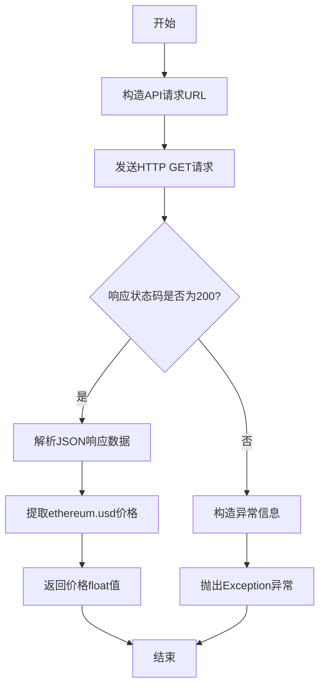

# `.\AutoGPT\classic\benchmark\agbenchmark\challenges\library\ethereum\check_price\artifacts_in\sample_code.py` 详细设计文档

该脚本包含一个核心函数，通过向CoinGecko API发送HTTP请求，获取以太坊（Ethereum）当前的美元价格，并在请求失败时抛出异常。

## 整体流程

```mermaid
graph TD
    Start([开始]) --> Request[调用 requests.get(url)]
    Request --> Check{response.status_code == 200?}
    Check -- 否 --> Exception[raise Exception]
    Check -- 是 --> Parse[response.json()]
    Parse --> Extract[提取 data['ethereum']['usd']]
    Extract --> Return[返回 float 价格]
    Return --> End([结束])
    Exception --> End
```

## 类结构

```
ethereum_price.py (模块)
└── get_ethereum_price (全局函数)
```

## 全局变量及字段


    

## 全局函数及方法


### `get_ethereum_price`

该函数通过调用 CoinGecko 公开 API 接口，发送 HTTP GET 请求获取以太坊（Ethereum）当前的美元价格，并返回该价格值。如果请求失败，则抛出异常以指示错误。

参数：
- （无参数）

返回值：`float`，返回以太坊当前的美元价格

#### 流程图



#### 带注释源码

```python
import requests  # 导入requests库，用于发送HTTP请求


def get_ethereum_price() -> float:
    """
    获取以太坊当前的美元价格
    
    返回值:
        float: 以太坊当前的美元价格
    """
    # 定义CoinGecko API端点，查询以太坊对美元的简单价格
    url = "https://api.coingecko.com/api/v3/simple/price?ids=ethereum&vs_currencies=usd"
    
    # 发送GET请求到API端点
    response = requests.get(url)
    
    # 检查HTTP响应状态码是否为200（成功）
    if response.status_code == 200:
        # 解析响应体中的JSON数据
        data = response.json()
        # 从数据中提取ethereum的USD价格并返回
        return data["ethereum"]["usd"]
    else:
        # 请求失败，抛出异常并包含状态码信息
        raise Exception(f"Failed to fetch data: {response.status_code}")
```

## 关键组件


### HTTP请求模块
使用Python的requests库向CoinGecko API发送GET请求，获取以太坊美元的实时价格数据

### 核心业务函数
get_ethereum_price()函数负责调用加密货币价格API，解析返回的JSON数据，并在请求失败时抛出异常

### API接口
使用CoinGecko的simple price API端点，通过指定ids=ethereum和vs_currencies=usd参数获取以太坊的美元价格

### 错误处理机制
当API返回非200状态码时，函数会捕获错误状态码并抛出Exception，提供清晰的错误信息用于调试


## 问题及建议


### 已知问题

-   缺少网络异常处理：requests.get() 可能抛出网络错误（如超时、DNS 解析失败），但未捕获，会导致程序崩溃。
-   未设置请求超时：请求可能无限期等待，造成线程阻塞或程序挂起。
-   硬编码 API URL：URL 直接写在函数内，降低了可维护性和可测试性。
-   错误处理过于简单：仅检查状态码 200，其他错误（如 404、429、500）统一抛出异常，信息不明确。
-   缺少重试机制：网络请求可能因瞬时故障失败，没有重试逻辑降低成功率。
-   缺乏日志记录：无法追踪请求状态、错误原因或性能指标。
-   数据验证不足：直接访问 data["ethereum"]["usd"]，若 API 返回格式不符预期（如缺少字段），会抛出 KeyError。
-   无缓存策略：频繁调用可能触发 API 速率限制，且增加延迟。

### 优化建议

-   为 requests.get() 添加 timeout 参数（如 timeout=10）避免无限等待。
-   使用 try-except 捕获 requests.exceptions.RequestException，并区分处理网络错误、超时错误等。
-   将 URL 参数化，可通过函数参数或配置文件传入，便于管理和测试。
-   添加重试机制，使用 tenacity 库或 urllib3 实现指数退避重试，提高可靠性。
-   引入日志记录，使用 logging 模块记录请求状态、错误信息和耗时。
-   在解析 JSON 前验证数据结构，确保键存在，使用 data.get("ethereum", {}).get("usd") 或异常处理。
-   考虑实现简单缓存（如 functools.lru_cache）或外部缓存，减少 API 调用频率。
-   定义自定义异常类，提供更具体的错误信息，如 EthPriceFetchError。
-   若需长期运行，可添加速率限制处理，捕获 429 错误并延迟重试。


## 其它


### 设计目标与约束

**设计目标**：提供一个轻量级的HTTP客户端工具，用于从CoinGecko公开API获取以太坊（Ethereum）的实时美元价格，为其他模块提供实时的加密货币价格数据源。

**约束条件**：
- 仅支持查询以太坊对美元的交易对
- 依赖外部CoinGecko API服务，不支持离线或缓存数据
- 未实现重试机制、限流处理或超时控制
- 未处理API限流（Rate Limiting）场景

### 错误处理与异常设计

**异常类型**：
- `Exception`：当HTTP响应状态码非200时抛出，包含HTTP状态码信息

**异常处理策略**：
- 网络请求失败、JSON解析失败、超时等情况由requests库自动抛出异常，调用方需自行捕获处理
- 未对API返回的错误响应体进行解析，仅依赖HTTP状态码判断成功与否

### 外部依赖与接口契约

**外部依赖**：
- `requests` 库（Python标准库之外的第三方依赖），用于发送HTTP GET请求

**接口契约**：
- 函数名：`get_ethereum_price`
- 输入参数：无
- 输出返回值：`float` 类型，表示以太坊的美元价格
- 异常：任何网络错误、API不可用或响应解析失败时抛出 `Exception`
- 调用方需自行处理网络异常、超时和API限流情况

### 数据流与状态机

**数据流**：
1. 发起HTTP GET请求到CoinGecko API端点
2. 接收HTTP响应，检查状态码是否为200
3. 解析JSON响应体，提取 `data["ethereum"]["usd"]` 字段
4. 将提取的价格值（float）返回给调用方

**状态机**：无复杂状态机，属于简单的请求-响应模式

### 性能考虑

- 每次调用都会发起一次独立的HTTP请求，无连接复用
- 未设置请求超时时间，可能导致调用方长时间阻塞
- 无缓存机制，频繁调用会增加API调用次数，可能触发限流

### 安全性考虑

- 未对API响应进行严格的Schema验证，可能存在解析风险
- 未对网络请求进行SSL证书验证配置（requests默认验证）
- 未对用户输入进行过滤（当前无用户输入），但未来扩展时需注意注入风险

### 可测试性

- 缺乏可mock的接口设计，直接依赖requests库
- 未抽象出HTTP客户端层，难以进行单元测试
- 建议引入依赖注入或抽象层以提升可测试性

### 日志与监控

- 当前代码无任何日志输出
- 建议添加请求发起、响应状态、异常发生等关键节点的日志记录
- 建议添加监控指标（如请求成功率、响应时间等）

### 版本兼容性

- 依赖 `requests` 库，需确保目标环境已安装
- 依赖 CoinGecko API v3 端点，需关注API版本变更公告
- 代码仅使用Python 3类型注解（`-> float`），需Python 3.5+

### 配置与扩展性

- API端点URL硬编码在函数内部，难以动态配置
- 建议将API端点、货币对等配置外部化或参数化
- 未来可扩展支持多种加密货币查询


    