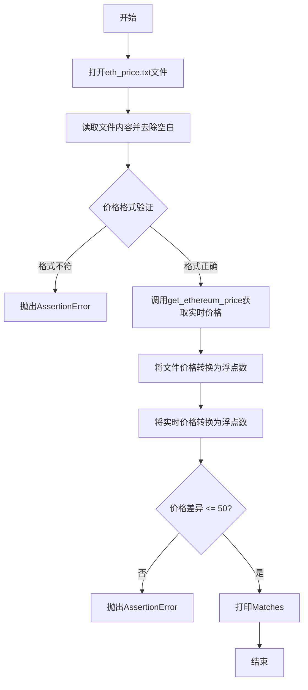
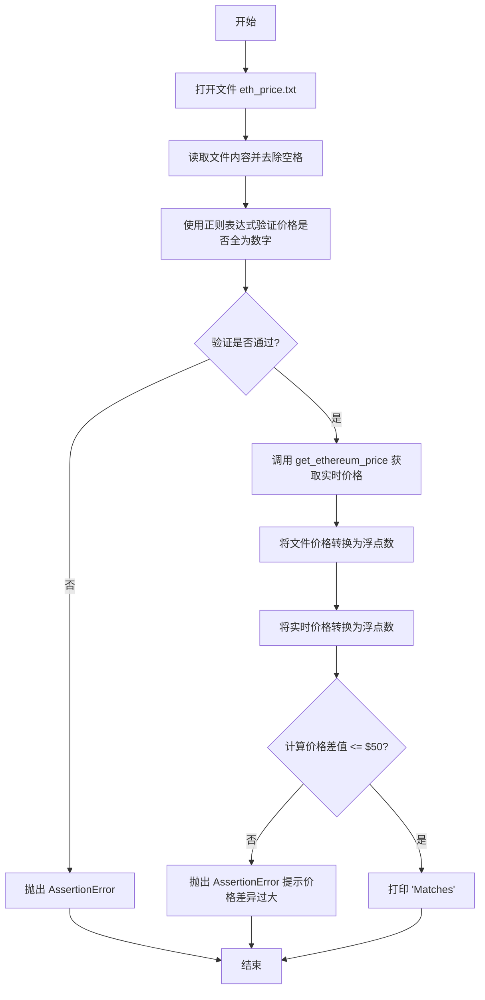

# `.\AutoGPT\classic\benchmark\agbenchmark\challenges\library\ethereum\check_price\artifacts_in\test.py` 详细设计文档

该代码为一个测试文件，用于验证本地存储的以太坊价格与通过第三方接口获取的实时价格之间的差异是否在50美元以内，包含文件读取、价格格式验证、数值转换和断言比较等步骤。

## 整体流程



## 类结构

```
该文件为测试模块，不包含类定义
仅有函数定义：test_get_ethereum_price
```

## 全局变量及字段


### `eth_price`
    
从文件读取的以太坊价格字符串

类型：`str`
    


### `pattern`
    
正则表达式模式 r'^\d+$'

类型：`str`
    


### `matches`
    
布尔值，表示价格格式是否匹配

类型：`bool`
    


### `real_eth_price`
    
从第三方接口获取的实时价格

类型：`str`
    


### `eth_price_value`
    
转换为浮点数的文件价格

类型：`float`
    


### `real_eth_price_value`
    
转换为浮点数的实时价格

类型：`float`
    


    

## 全局函数及方法


### `test_get_ethereum_price`

这是一个主测试函数，用于读取存储在文件中的以太坊价格，验证其格式是否正确，获取实时以太坊价格，并将两者进行比较以确保差异在可接受的范围内（$50以内）。

参数：

- 无

返回值：`None`，该函数不返回任何值，仅执行测试逻辑并打印结果

#### 流程图



#### 带注释源码

```python
import re

# 导入获取以太坊价格的函数
from .sample_code import get_ethereum_price


def test_get_ethereum_price() -> None:
    """
    测试函数：读取文件中的以太坊价格并与实时价格比较
    """
    
    # 读取以太坊价格从文件
    # 打开名为 eth_price.txt 的文件，以只读模式
    with open("eth_price.txt", "r") as file:
        # 读取文件内容并去除首尾空格
        eth_price = file.read().strip()

    # 验证以太坊价格是否全为数字
    # 定义正则表达式模式：必须全是数字
    pattern = r"^\d+$"
    # 使用正则表达式匹配价格字符串
    matches = re.match(pattern, eth_price) is not None
    # 断言价格必须是全数字，否则抛出 AssertionError
    assert (
        matches
    ), f"AssertionError: Ethereum price should be all digits, but got {eth_price}"

    # 获取以太坊的实时价格
    # 调用外部函数获取当前市场价格
    real_eth_price = get_ethereum_price()

    # 将以太坊价格转换为数值类型以便比较
    # 把文件中的价格字符串转换为浮点数
    eth_price_value = float(eth_price)
    # 把实时价格字符串转换为浮点数
    real_eth_price_value = float(real_eth_price)

    # 检查以太坊价格是否在实际价格的 $50 范围内
    # 计算两个价格的绝对差值
    assert abs(real_eth_price_value - eth_price_value) <= 50, (
        "AssertionError: Ethereum price is not within $50 of the actual Ethereum price "
        f"(Provided price: ${eth_price}, Real price: ${real_eth_price})"
    )

    # 测试通过，打印成功消息
    print("Matches")


# 主程序入口
if __name__ == "__main__":
    # 当直接运行此文件时，执行测试函数
    test_get_ethereum_price()
```

## 关键组件


### 文件读取模块

从本地文件 "eth_price.txt" 中读取存储的以太坊价格，使用 strip() 方法去除前后空白字符

### 正则表达式验证

使用正则表达式 `r"^\d+$"` 验证读取的价格是否完全由数字组成，确保数据格式正确

### 价格比较模块

将文件中的价格和通过 get_ethereum_price() 获取的真实价格转换为浮点数，计算差值的绝对值，验证是否在 $50 范围内

### 外部依赖函数

get_ethereum_price() 是从 sample_code 模块导入的外部函数，负责获取当前以太坊的真实市场价格

### 断言错误处理

使用 assert 语句进行价格格式验证和价格差异验证，失败时抛出详细的 AssertionError 错误信息

### 测试入口

if __name__ == "__main__" 块确保测试函数在直接运行时执行，而不是被导入时执行


## 问题及建议


### 已知问题

-   **硬编码文件路径**：`"eth_price.txt"` 路径直接写在代码中，缺乏灵活性和可配置性
-   **硬编码阈值**：$50 的价格差异阈值作为魔法数字直接使用，未定义为常量
-   **缺少文件异常处理**：未对文件不存在、读取权限等异常情况进行捕获和处理
-   **float 转换无错误处理**：若文件内容为无效数字，`float(eth_price)` 会直接抛出 `ValueError` 异常
-   **正则表达式未预编译**：每次调用都重新创建正则表达式 pattern，性能可以优化
-   **assert 用于业务验证**：使用 assert 进行价格格式验证，在 Python 优化模式（`python -O`）下会被跳过
-   **魔法数字和字符串**：多处硬编码的数值和错误消息字符串缺乏统一管理
-   **测试函数缺乏独立性**：测试依赖外部文件状态，文件缺失或损坏会导致测试无法运行

### 优化建议

-   将文件路径和阈值提取为配置文件或函数参数
-   使用 `try-except` 块捕获文件读写和类型转换的异常
-   预编译正则表达式：`pattern = re.compile(r"^\d+$")`
-   使用自定义异常类或日志记录替代 assert 进行业务逻辑验证
-   定义常量类或枚举来管理阈值和错误消息
-   考虑使用 pytest fixtures 管理文件依赖，提升测试的可维护性
-   添加类型注解和详细的 docstring 文档，增强代码可读性

## 其它


### 设计目标与约束

本测试代码的核心目标是以太坊价格验证，确保从文件读取的价格与实际市场价格偏差在50美元以内。约束条件包括：文件必须存在且格式正确、价格必须为数字、测试环境需要网络连接以获取实时价格。

### 错误处理与异常设计

代码主要通过assert语句进行错误处理，涵盖三类错误：文件读取失败（FileNotFoundError）、价格格式不符合数字规范（正则验证失败）、价格偏差超过50美元（断言失败）。当assert失败时，程序会抛出AssertionError并附带详细的错误信息。

### 数据流与状态机

数据流如下：读取文件 → 字符串处理 → 格式验证 → 获取实时价格 → 类型转换 → 数值比较 → 输出结果。无复杂状态机，仅包含开始、执行、结束三个简单状态。

### 外部依赖与接口契约

主要外部依赖为sample_code模块中的get_ethereum_price()函数，该函数返回以太坊实时价格字符串。文件依赖为eth_price.txt，需要预先存在且包含数字格式的价格值。

### 性能考虑

代码性能开销较小，主要瓶颈在于网络请求（get_ethereum_price调用）和文件I/O操作。建议添加超时控制和网络错误重试机制。

### 安全性考虑

代码存在潜在安全风险：文件路径硬编码、缺乏输入消毒。建议使用配置文件管理路径、对读取的价格进行更严格的验证、添加异常处理机制。

### 可维护性与扩展性

当前实现硬编码了50美元阈值和eth_price.txt路径，可通过参数化方式提升扩展性。建议将阈值和路径提取为配置常量或环境变量，便于后续调整。

### 测试策略

当前为集成测试，验证文件价格与实时价格的匹配度。建议补充单元测试：文件读取模块测试、价格验证逻辑测试、边界条件测试（如价格为0、负数、极大数值等）。

### 配置管理

当前缺乏配置管理，阈值（50）和文件名（eth_price.txt）均硬编码。建议引入配置文件或环境变量，实现配置与代码解耦。

### 日志与监控

当前仅使用print输出"Matches"，缺乏详细的日志记录。建议引入标准日志模块，记录测试开始、价格读取、验证结果、异常信息等关键节点，便于问题排查和测试报告生成。


    