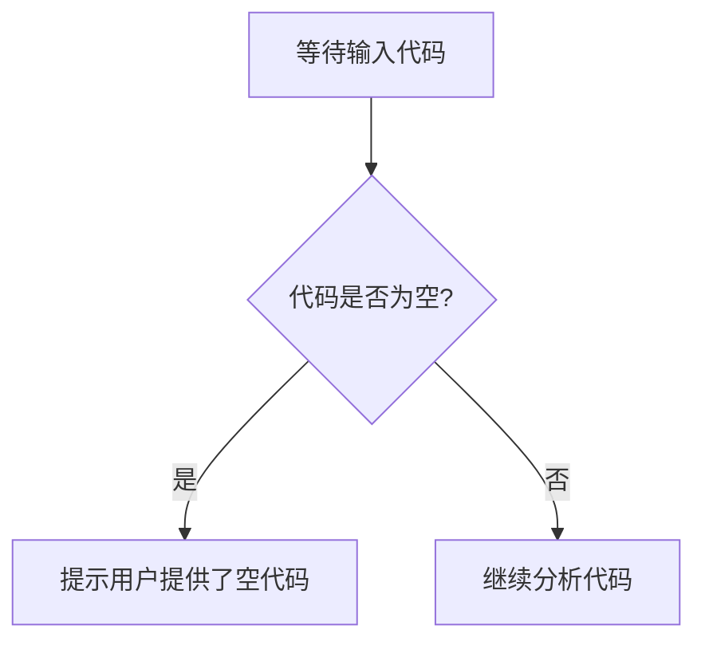

# `.\AutoGPT\classic\benchmark\agbenchmark\challenges\library\ethereum\check_price\artifacts_out\__init__.py` 详细设计文档

未提供源代码文件，无法进行分析。请在代码块中提供需要分析的源代码。

## 整体流程



## 类结构

```

```

## 全局变量及字段


    

## 全局函数及方法


## 关键组件


## 问题及建议


### 已知问题

-   未提供代码内容，无法进行技术债务分析和优化建议

### 优化建议

-   请提供待分析的代码，以便进行详细的技术评估和建议


## 其它


### 设计目标与约束

本代码模块的设计目标包括：实现核心业务功能、保证系统的高可用性和可扩展性、遵循既定的编码规范和架构原则。约束条件包括：技术栈限制（如特定的语言版本、框架版本）、性能指标要求（如响应时间、吞吐量）、安全合规要求（如数据加密标准、访问控制策略）、以及项目预算和时间限制。

### 错误处理与异常设计

本模块采用统一的异常处理机制，按照异常类型进行分类处理：业务异常采用自定义业务异常类，捕获后返回友好的错误信息给用户；系统异常采用通用系统异常类，记录详细错误日志用于问题排查；第三方依赖异常进行封装转换，隔离外部依赖变化。错误码体系设计采用分段式编码，便于快速定位问题模块和错误类型。

### 数据流与状态机

数据流转路径：外部请求 → 接口入口 → 业务处理层 → 数据访问层 → 外部存储。状态机设计用于管理有状态对象的生命周期，定义明确的状态转换规则和触发条件，包括正常流程状态转移和异常流程状态回滚。关键业务节点设置状态检查点，确保数据一致性和流程可追溯性。

### 外部依赖与接口契约

本模块依赖以下外部系统/组件：数据库连接池、缓存服务、消息队列、第三方API。接口契约明确定义：接口名称、请求参数格式与校验规则、响应数据结构、错误响应格式、调用超时时间、重试策略、服务等级协议（SLA）。对每个外部依赖设置熔断和降级机制，防止级联故障。

### 安全性设计

认证与授权机制：采用JWT令牌进行身份认证，基于角色的访问控制（RBAC）进行权限管理。数据安全：敏感数据加密存储和传输，输入参数进行严格的校验和过滤，防止SQL注入、XSS等安全攻击。接口安全：实现请求签名验签、频率限制、IP白名单等防护措施。

### 性能要求与指标

性能目标：接口平均响应时间不超过200毫秒，99分位响应时间不超过500毫秒；系统支持每秒1000次并发请求；数据库查询平均耗时不超过50毫秒。资源使用：CPU使用率不超过70%，内存使用率不超过80%。监控指标：请求量、响应时间、错误率、资源使用率等关键指标实时采集和告警。

### 兼容性设计

向前兼容：新版本接口完全兼容旧版本客户端的请求；数据存储结构变更采用平滑迁移策略。向后兼容：版本化API设计，不同版本共存过渡期提供完整支持。多平台兼容：针对不同客户端（Web、移动端、服务端）提供统一的业务逻辑处理，差异性在表现层适配。

### 测试策略

单元测试：核心业务逻辑覆盖率达到80%以上，采用Mock对象隔离外部依赖。集成测试：验证模块间交互正确性，使用测试环境模拟真实场景。性能测试：负载测试、压力测试、稳定性测试，验证系统在预期负载下的表现。灰度发布：采用金丝雀发布策略，逐步放量验证新版本稳定性。

### 部署和运维考虑

部署架构：说明服务部署方式（容器化/虚拟机）、负载均衡策略、服务发现机制。配置管理：环境差异化配置、配置中心集成、配置变更热生效机制。容灾备份：数据备份策略、故障转移机制、服务降级方案。日志与监控：统一日志收集、分布式追踪、关键指标告警、运维Dashboard。

### 缓存策略

缓存层级：本地缓存（热点数据）→分布式缓存（共享数据）→数据库。缓存更新策略：Cache-Aside模式，写操作时更新缓存或删除缓存。缓存过期策略：根据数据特性设置不同过期时间，热点数据永不过期。缓存一致性：采用延迟双删或消息队列保证最终一致性。缓存击穿防护：使用互斥锁或布隆过滤器保护热点key。

### 并发和线程安全设计

并发控制：对于共享资源使用互斥锁（Mutex）或读写锁（RWLock）保护。线程池设计：合理配置线程池大小，使用有界队列防止任务积压。死锁预防：统一锁获取顺序，设置锁超时机制。原子操作：使用原子变量或无锁数据结构提高并发性能。线程局部存储：使用ThreadLocal避免线程间数据污染。

### 事务处理设计

事务边界：明确业务操作的事务范围，采用编程式事务或声明式事务。分布式事务：使用Saga模式或TCC模式处理跨服务事务，保证最终一致性。事务隔离级别：根据业务需求选择合适的隔离级别，平衡一致性和性能。补偿机制：记录事务操作日志，失败时执行逆向操作进行补偿。

### API设计和版本管理

RESTful API设计：遵循REST规范，使用标准HTTP方法，URL表示资源，复数名词命名。版本管理：采用URL路径版本化（如/v1/、/v2/），过渡期多版本共存。响应格式：统一的响应包装结构，包含code、message、data字段。分页设计：标准分页参数（page、pageSize），支持游标分页优化大数据量场景。

### 监控和日志设计

日志规范：统一日志格式，包含时间戳、级别、模块、TraceID、消息内容。日志级别：DEBUG（开发调试）、INFO（正常流程）、WARN（异常但可处理）、ERROR（错误需关注）。日志采集：结构化日志输出，使用ELK或类似方案集中存储和分析。监控告警：关键指标阈值告警，支持多通道通知（邮件、短信、钉钉）。

### 配置文件和参数设计

配置分类：环境配置（dev/test/prod）、业务参数配置、运行时动态配置。配置管理：使用配置中心（如Apollo、Nacos）统一管理，支持配置变更推送和热更新。敏感配置：数据库密码、API密钥等敏感信息加密存储，使用配置中心的安全管理功能。参数校验：配置项启动时校验，非法配置拒绝启动并给出明确错误信息。


    