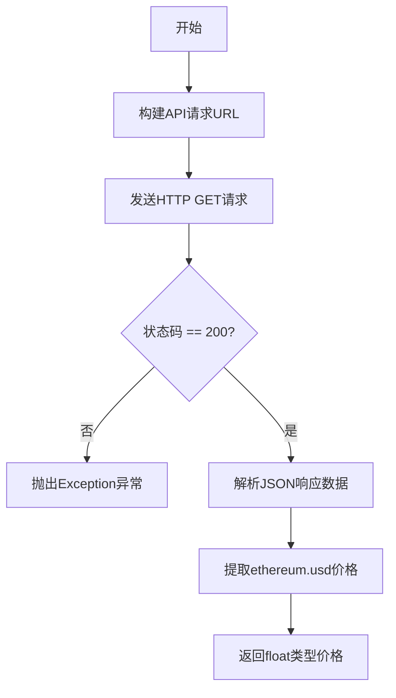
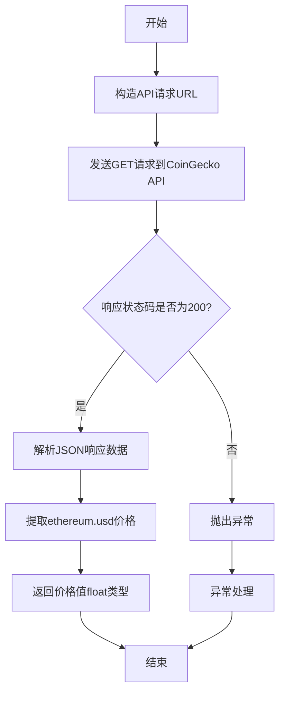

# `.\AutoGPT\classic\benchmark\agbenchmark\challenges\library\ethereum\check_price\artifacts_out\sample_code.py` 详细设计文档

该代码通过调用CoinGecko公开API接口，实时获取以太坊(ETH)相对于美元的当前价格，并返回浮点数格式的汇率值，若API调用失败则抛出异常。

## 整体流程



## 类结构

```
ethereum_price.py (单文件模块)
└── get_ethereum_price (全局函数)
```

## 全局变量及字段


### `url`
    
CoinGecko API端点URL，用于获取以太坊美元价格

类型：`str`
    


### `response`
    
HTTP响应对象，包含API返回的状态码和内容

类型：`requests.Response`
    


### `data`
    
解析后的JSON响应数据，包含以太坊价格信息

类型：`dict`
    


    

## 全局函数及方法


### `get_ethereum_price`

该函数通过调用 CoinGecko 公开 API 获取以太坊（Ethereum）当前的美元价格，并在请求失败时抛出异常。

**参数：**
- 无参数

**返回值：** `float`，返回以太坊当前的美元价格

#### 流程图



#### 带注释源码

```python
import requests


def get_ethereum_price() -> float:
    """
    获取以太坊（Ethereum）当前的美元价格
    
    Returns:
        float: 以太坊当前的美元价格
        
    Raises:
        Exception: 当API请求失败时抛出异常
    """
    # 定义CoinGecko API端点，用于获取以太坊的美元价格
    url = "https://api.coingecko.com/api/v3/simple/price?ids=ethereum&vs_currencies=usd"
    
    # 发送HTTP GET请求到CoinGecko API
    response = requests.get(url)

    # 检查HTTP响应状态码
    if response.status_code == 200:
        # 状态码为200表示请求成功，解析JSON响应数据
        data = response.json()
        # 从返回数据中提取以太坊的美元价格并返回
        return data["ethereum"]["usd"]
    else:
        # 状态码非200表示请求失败，抛出异常并附带状态码信息
        raise Exception(f"Failed to fetch data: {response.status_code}")
```


## 关键组件


### get_ethereum_price()

获取以太坊当前美元价格的函数，通过调用CoinGecko公开API接口并返回浮点数价格。

### requests 库

Python标准HTTP客户端库，用于发送GET请求到CoinGecko API端点。

### CoinGecko API 接口

外部REST API接口，URL为 `https://api.coingecko.com/api/v3/simple/price?ids=ethereum&vs_currencies=usd`，返回JSON格式的加密货币价格数据。

### 异常处理机制

当API响应状态码非200时，抛出Exception异常并携带HTTP状态码信息，用于上层调用者感知和处理请求失败场景。

### 数据解析逻辑

从API返回的JSON响应中提取嵌套数据结构 `data["ethereum"]["usd"]`，获取以太坊的美元价格值。

## 问题及建议


### 已知问题

-   **异常处理过于宽泛**：使用通用 `Exception` 而非具体异常类型，无法精确捕获和处理不同类型的错误（如网络错误、JSON解析错误等）
-   **缺少请求超时设置**：`requests.get()` 未设置 timeout 参数，可能导致请求无限期挂起，在网络不稳定时造成线程阻塞
-   **HTTP 状态码判断不完善**：仅处理 200 状态码，忽略了其他 2xx 成功状态码（如 201、204 等）的可能性
-   **缺乏数据验证**：未验证 API 返回的数据结构，假设 `data["ethereum"]["usd"]` 必然存在，可能导致 KeyError
-   **硬编码配置**：API URL 硬编码在函数内部，不利于配置管理和多环境切换
-   **无重试机制**：网络请求可能因瞬时故障失败，缺乏自动重试逻辑降低成功率
-   **缺少日志记录**：无任何日志输出，难以追踪请求状态和调试问题

### 优化建议

-   使用 `requests.exceptions.RequestException` 捕获具体网络异常，并设置合理的 timeout（如 10 秒）
-   添加数据存在性检查，使用 `.get()` 方法或 try-except 包装 JSON 访问逻辑
-   将 URL 配置外部化，可通过参数或配置文件传入
-   引入重试机制（如使用 `tenacity` 库）处理瞬时网络故障
-   添加结构化日志记录请求 URL、状态码、响应时间等信息
-   考虑添加请求间隔限制，避免触发 API 速率限制
-   考虑添加缓存机制，减少频繁 API 调用


## 其它


### 设计目标与约束

本代码的核心设计目标是提供一个简单、可靠的接口来获取以太坊的实时美元价格。在约束方面，该函数仅依赖Python标准库和requests库，要求网络连接可用，并且受到外部API（CoinGecko）的可用性限制。该函数设计为同步调用，适合小规模和对实时性要求不高的场景。

### 错误处理与异常设计

错误处理采用最直接的异常抛出机制。当HTTP响应状态码不为200时，函数抛出包含状态码信息的Exception。这种设计将错误传播给调用者处理，适合简单场景。潜在的问题是没有区分不同类型的错误（如网络超时、API限流、服务端错误等），也没有提供重试机制。建议增强错误分类，至少区分客户端错误（4xx）和服务端错误（5xx），并为暂时性错误提供重试逻辑。

### 外部依赖与接口契约

外部依赖包括requests库和CoinGecko API。requests库需要通过pip安装，CoinGecko API为免费公开接口，有速率限制（通常为10-50次/分钟）。接口契约方面，该函数无输入参数（固定查询ETH/USD），返回float类型的美元价格。需要注意CoinGecko API的响应结构可能随版本变化，当前依赖data["ethereum"]["usd"]这一固定路径。

### 性能考虑

当前实现为同步阻塞调用，网络请求期间线程会等待响应。性能瓶颈主要在网络延迟和API响应时间。对于高频调用场景，应考虑添加请求间隔控制以避免触发API限流。可以通过添加缓存机制（如30秒缓存）来减少API调用频率，提升响应速度并降低被限流的风险。

### 安全性考虑

代码中未包含任何认证信息，符合公开API的调用规范。潜在安全风险包括：未设置请求超时（可能导致无限等待）、未验证SSL证书（requests默认验证但可配置）、日志中可能暴露敏感信息。建议添加合理的超时设置（如10秒），并对返回数据进行类型和范围验证（价格应为正数）。

### 可测试性

函数设计为纯函数形式，输入输出明确，便于单元测试。测试难点在于依赖外部API，需要使用mock技术（如unittest.mock.patch）来模拟requests.get的响应。建议准备两组mock数据：一组为正常响应（状态码200），一组为异常响应（4xx和5xx），以覆盖不同的错误处理路径。

### 日志与监控

当前代码未包含任何日志记录。在生产环境中，建议添加日志来记录API调用结果、响应时间、错误信息等。关键监控指标包括：API调用成功率、平均响应时间、错误分布（按状态码分类）。可集成结构化日志框架（如logging模块），输出JSON格式日志便于后续分析。

### 配置管理

当前实现将API URL硬编码在函数内部，缺乏灵活性。建议将以下配置外部化：API端点URL、请求超时时间、重试次数和间隔、缓存策略。这些配置可通过环境变量、配置文件或配置中心注入，支持不修改代码的情况下调整行为。

### 版本兼容性

需要Python 3.6+环境（支持类型注解语法）。requests库版本建议>=2.25.0。CoinGecko API为免费接口，可能随时调整响应格式或接口地址，缺乏SLA保障。生产环境应添加版本锁定和响应格式校验逻辑，以应对API变更。

### 错误码与消息规范

当前仅使用通用Exception类型，错误消息为"Failed to fetch data: {status_code}"。建议定义自定义异常类（如EthereumPriceFetchError），并建立错误码体系。例如：E001表示网络连接失败，E002表示API返回格式异常，E003表示数据解析错误，E004表示API限流。这样便于调用者进行针对性的错误处理和用户友好的错误提示。


    