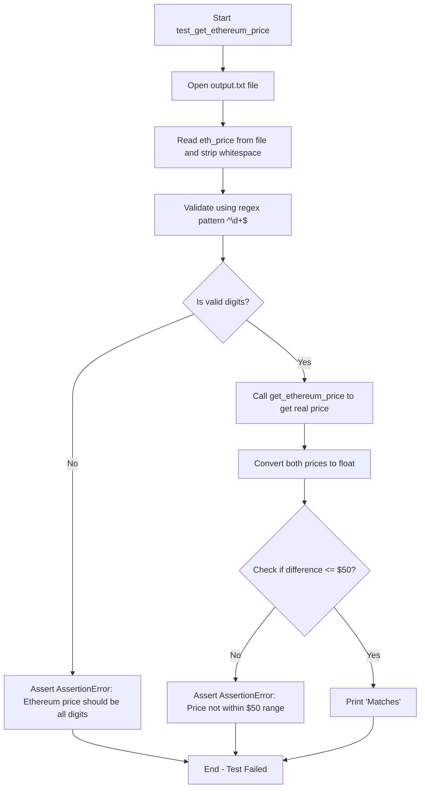
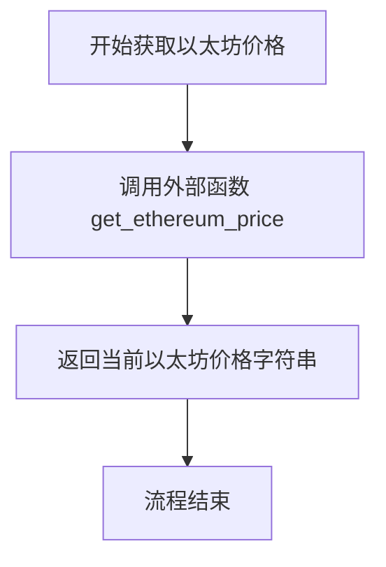

# `.\AutoGPT\classic\benchmark\agbenchmark\challenges\library\ethereum\check_price\artifacts_out\test.py` 详细设计文档

该代码是一个自动化测试脚本，用于验证从本地文件读取的以太坊价格是否与实时获取的以太坊价格一致，误差允许范围为50美元。

## 整体流程

```mermaid
graph TD
    A[开始] --> B[打开output.txt文件]
B --> C[读取以太坊价格字符串]
C --> D[使用正则表达式验证价格是否为纯数字]
D --> E{验证通过?}
E -- 否 --> F[抛出AssertionError]
E -- 是 --> G[调用get_ethereum_price获取实时价格]
G --> H[将两个价格转换为浮点数]
H --> I[计算价格差值的绝对值]
I --> J{差值 <= 50?]
J -- 否 --> K[抛出AssertionError]
J -- 是 --> L[打印Matches]
L --> M[结束]
```

## 类结构

```
该代码为过程式脚本，无类层次结构
```

## 全局变量及字段


### `re`
    
正则表达式模块，用于验证价格字符串是否仅包含数字

类型：`module`
    


### `get_ethereum_price`
    
从 sample_code 模块导入的函数，用于获取以太坊的当前市场价格

类型：`function`
    


### `test_get_ethereum_price`
    
测试函数，验证从文件读取的价格与实际价格的差异是否在50美元以内

类型：`function`
    


    

## 全局函数及方法


### `test_get_ethereum_price`

该测试函数用于验证从文件中读取的以太坊价格是否符合格式要求（纯数字），并与实际市场价格进行比较，确保差异在50美元以内。

参数：

- 无

返回值：`None`，无返回值，仅执行测试逻辑并在成功时打印结果

#### 流程图



#### 带注释源码

```python
import re

from .sample_code import get_ethereum_price


def test_get_ethereum_price() -> None:
    """测试函数：验证文件中的以太坊价格是否在合理范围内
    
    该函数执行以下步骤：
    1. 从output.txt文件读取以太坊价格
    2. 验证价格格式为纯数字
    3. 获取实际市场价格
    4. 比较两者差异是否在50美元以内
    """
    # Read the Ethereum price from the file
    # 从output.txt文件读取以太坊价格
    with open("output.txt", "r") as file:
        eth_price = file.read().strip()

    # Validate that the eth price is all digits
    # 使用正则表达式验证价格是否为纯数字
    pattern = r"^\d+$"
    matches = re.match(pattern, eth_price) is not None
    assert (
        matches
    ), f"AssertionError: Ethereum price should be all digits, but got {eth_price}"

    # Get the current price of Ethereum
    # 调用get_ethereum_price函数获取当前以太坊实际价格
    real_eth_price = get_ethereum_price()

    # Convert the eth price to a numerical value for comparison
    # 将字符串价格转换为浮点数以便进行比较
    eth_price_value = float(eth_price)
    real_eth_price_value = float(real_eth_price)

    # Check if the eth price is within $50 of the actual Ethereum price
    # 验证价格差异是否在50美元以内
    assert abs(real_eth_price_value - eth_price_value) <= 50, (
        "AssertionError: Ethereum price is not within $50 of the actual Ethereum price "
        f"(Provided price: ${eth_price}, Real price: ${real_eth_price})"
    )

    # 测试通过时打印成功消息
    print("Matches")


if __name__ == "__main__":
    # 入口点，直接调用测试函数
    test_get_ethereum_price()
```

---

#### 关键组件信息

| 组件名称 | 一句话描述 |
|---------|-----------|
| `get_ethereum_price` | 从外部API或数据源获取当前以太坊实时价格的函数 |
| `output.txt` | 存储待验证以太坊价格的文本文件 |
| `re` 模块 | Python正则表达式模块，用于验证价格格式 |

#### 潜在的技术债务或优化空间

1. **硬编码值**：文件路径 `"output.txt"` 和阈值 `50` 应提取为配置常量或环境变量
2. **缺少异常处理**：未处理文件不存在、读取权限不足等情况，会导致程序崩溃
3. **类型转换风险**：直接使用 `float()` 转换，未捕获 `ValueError` 异常
4. **测试隔离性差**：依赖外部文件的存在和内容，测试顺序敏感
5. **魔法数字**：50美元阈值缺乏明确业务含义注释

#### 其它项目

**设计目标与约束**：
- 验证文件中的以太坊价格是否为有效数字格式
- 确保缓存的价格与实时价格偏差在可接受范围内（$50）

**错误处理与异常设计**：
- 使用 `assert` 语句进行验证检查，失败时抛出 `AssertionError`
- 缺少对以下异常的处理：
  - `FileNotFoundError`：文件不存在
  - `PermissionError`：文件权限问题
  - `ValueError`：价格字符串无法转换为浮点数

**外部依赖与接口契约**：
- 依赖 `sample_code.get_ethereum_price()` 函数返回有效的价格字符串
- 依赖 `output.txt` 文件存在且包含有效的数字字符串格式


### `get_ethereum_price`

获取以太坊（Ethereum）的当前市场价格。

参数：
- 无参数

返回值：`str`，返回以太坊的当前价格，以字符串形式返回（通常为数字格式，如 "2500.00"）

#### 流程图



#### 带注释源码

```python
# 从 sample_code 模块导入的外部函数
# 根据调用方式推断，该函数:
# 1. 无需参数调用
# 2. 返回以太坊的当前市场价格（字符串类型）
# 3. 返回值可转换为浮点数进行数值计算

real_eth_price = get_ethereum_price()  # 获取当前以太坊价格
real_eth_price_value = float(real_eth_price)  # 转换为浮点数用于比较
```

## 关键组件


### 文件读取与价格获取模块

该模块负责从本地文件读取预先存储的以太坊价格，并调用外部函数获取实时价格数据

### 正则表达式验证模块

使用正则表达式验证以太坊价格格式是否为纯数字，确保数据有效性

### 价格比较与断言模块

将文件读取的价格与实时价格转换为浮点数进行比较，验证差异是否在可接受范围内（$50）

### 错误处理与断言模块

通过多个断言语句验证价格格式和数值准确性，确保测试用例的可靠性


## 问题及建议


### 已知问题

-   **硬编码文件路径**：`"output.txt"` 路径硬编码，缺乏灵活性，无法适应不同环境或配置需求
-   **魔法数字**：阈值 `$50` 硬编码在代码中，缺乏常量定义，修改时需要改动多处
-   **正则表达式未预编译**：每次调用都重新编译正则表达式 `r"^\d+$"`，影响性能
-   **缺乏错误处理**：未处理文件不存在、读取失败、`get_ethereum_price()` 返回无效值等异常情况
-   **类型转换风险**：`float(eth_price)` 和 `float(real_eth_price)` 可能抛出 `ValueError` 异常
-   **测试隔离性差**：测试依赖外部文件状态，无法独立运行，文件不存在或内容异常时测试直接失败
-   **不推荐的测试写法**：使用 `print()` 而非标准测试框架的断言或日志机制

### 优化建议

-   将文件路径和阈值提取为常量或配置文件/环境变量
-   使用 `re.compile()` 预编译正则表达式以提升性能
-   添加 `try-except` 块处理文件读取、类型转换等可能的异常
-   考虑使用 pytest fixtures 或 mock 来管理外部依赖，提高测试隔离性
-   移除 `print("Matches")`，依赖测试框架的报告机制或使用日志
-   添加文件存在性检查，提供更有意义的错误信息

## 其它


### 设计目标与约束

本测试代码的设计目标是验证从文件读取的以太坊价格是否与实际市场价格偏差在可接受的50美元范围内。约束条件包括：文件必须存在且可读、价格必须为纯数字、价格验证失败时抛出断言错误、价格偏差超过50美元时测试失败。

### 错误处理与异常设计

代码采用断言（assert）进行错误处理，共有三处关键验证点：文件读取时的IOError、价格格式验证失败、以太坊价格偏差超出阈值。当断言失败时，程序会抛出AssertionError并附带详细的错误信息，包括期望值和实际值，便于快速定位问题。

### 数据流与状态机

数据流如下：1)从output.txt文件读取字符串形式的价格 → 2)使用正则表达式验证格式为纯数字 → 3)调用get_ethereum_price()获取实时价格 → 4)将两个价格转换为浮点数 → 5)计算差值并验证是否在50美元阈值内 → 6)输出"Matches"表示测试通过。无复杂状态机设计，属于线性流程。

### 外部依赖与接口契约

外部依赖包括：1)sample_code模块的get_ethereum_price()函数（需返回字符串形式的以太坊价格）、2)output.txt文件（需包含数字格式的价格字符串）、3)re模块（正则表达式验证）、4)Python内置的float()转换函数。接口契约：get_ethereum_price()应返回字符串格式的数字，output.txt应包含纯数字字符串。

### 关键组件信息

关键组件为test_get_ethereum_price()函数，负责整体测试流程编排。辅助组件包括：re.match()用于价格格式验证、float()用于类型转换、abs()用于计算价格差异、open()文件操作用于读取价格数据。

### 潜在的技术债务或优化空间

1.硬编码的文件路径"output.txt"和阈值50，应提取为配置参数；2.缺少异常处理机制，文件不存在或读取失败时程序会直接崩溃；3.get_ethereum_price()调用失败时没有错误处理；4.测试函数没有返回值，无法与其他测试框架集成；5.价格验证只检查数字，未验证合理范围（如负数或过大值）；6.缺少日志记录，测试结果缺乏持久化；7.未使用pytest等标准测试框架，而是手动执行。

### 测试覆盖与边界条件

当前测试仅覆盖正常流程，边界条件考虑不足：空文件、文件不存在、价格为0、价格为负数、价格超长、价格包含小数点或空格等情况均未处理。实际价格获取失败（如网络超时）的场景也缺乏容错机制。

    