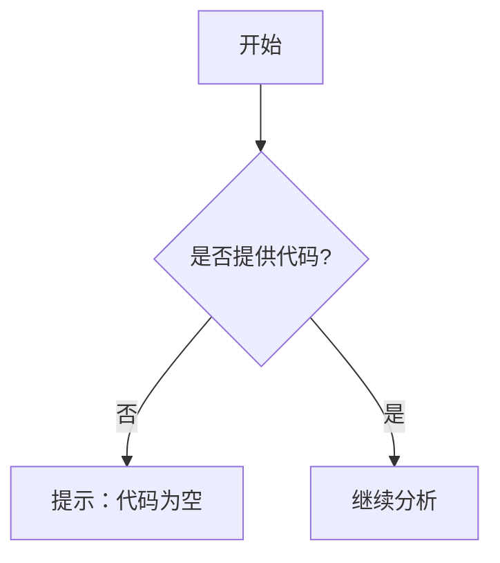

# `.\AutoGPT\classic\benchmark\agbenchmark\challenges\verticals\code\1_three_sum\artifacts_out\__init__.py` 详细设计文档

未提供源代码，无法进行分析。请提供需要分析的代码文件。

## 整体流程



## 类结构

```

```

## 全局变量及字段


    

## 全局函数及方法


## 关键组件


## 问题及建议


### 已知问题

-   未提供代码内容，无法进行具体的技术债务和优化空间分析

### 优化建议

-   请提供需要分析的源代码，以便进行详细的技术债务识别和优化建议
-   在提供代码时，请确保代码完整且格式正确，以便进行准确的架构分析和设计文档生成


## 其它


### 设计目标与约束

待根据实际代码补充设计目标、性能约束、兼容性要求等

### 错误处理与异常设计

待根据实际代码补充异常类型、错误码定义、异常传播机制等

### 数据流与状态机

待根据实际代码补充数据流转图、状态定义、状态转换条件等

### 外部依赖与接口契约

待根据实际代码补充第三方库依赖、API接口定义、服务间通信协议等

### 性能考虑

待根据实际代码补充性能瓶颈分析、资源占用、并发处理等

### 安全性考虑

待根据实际代码补充认证授权、数据加密、输入验证等安全措施

### 可扩展性设计

待根据实际代码补充扩展点设计、模块化程度、插件机制等

### 部署架构

待根据实际代码补充部署拓扑、环境配置、容器化方案等

### 监控与日志

待根据实际代码补充监控指标、日志规范、告警策略等

### 测试策略

待根据实际代码补充单元测试、集成测试、端到端测试策略等

### 配置管理

待根据实际代码补充配置项定义、配置加载机制、环境差异处理等

### 版本兼容性

待根据实际代码补充API版本管理、向前向后兼容性策略等


    