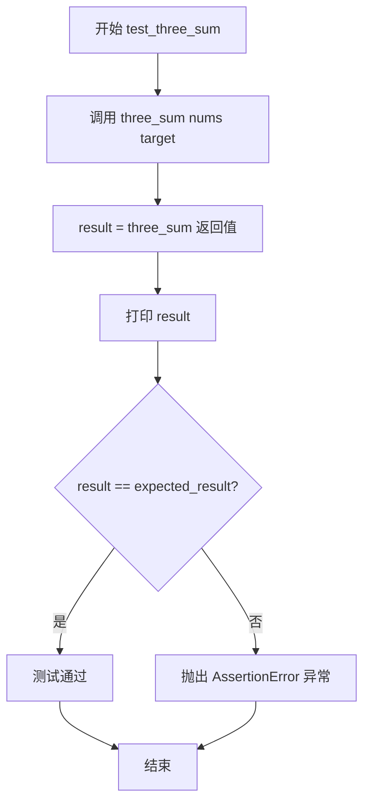

# `.\AutoGPT\classic\benchmark\agbenchmark\challenges\verticals\code\1_three_sum\custom_python\test.py` 详细设计文档

这是一个测试文件，用于验证 sample_code 模块中 three_sum 函数的正确性。该测试文件通过多个测试用例验证三数之和算法能否正确返回满足目标值的三数索引组合。

## 整体流程

```mermaid
graph TD
    A[开始] --> B[定义测试用例1: nums=[2,7,11,15], target=20]
    B --> C[调用 test_three_sum]
    C --> D{调用 three_sum(nums, target)}
    D --> E[返回结果 result]
    E --> F[打印 result]
    F --> G{result == expected_result?}
    G -- 是 --> H[测试通过]
    G -- 否 --> I[抛出 AssertionError]
    H --> J[定义测试用例2: nums=[2,7,0,15,12,0], target=2]
    J --> K[调用 test_three_sum]
    K --> L{调用 three_sum}
    L --> M[返回结果]
    M --> N[打印并断言]
    N --> O[定义测试用例3: nums=[-6,7,11,4], target=9]
    O --> P[调用 test_three_sum]
    P --> Q{调用 three_sum}
    Q --> R[返回结果并断言]
    R --> S[结束]
```

## 类结构

```
无类定义 (纯测试模块)
```

## 全局变量及字段


### `nums`
    
测试输入的数字列表

类型：`List[int]`
    


### `target`
    
目标和值

类型：`int`
    


### `expected_result`
    
预期的结果索引列表

类型：`List[int]`
    


### `result`
    
three_sum函数返回的实际结果索引列表

类型：`List[int]`
    


    

## 全局函数及方法


### `test_three_sum`

该函数是一个测试函数，用于验证 `three_sum` 函数的正确性。它接收一个数字列表、目标值和期望返回的索引列表，调用 `three_sum` 函数获取实际结果，打印结果，并通过断言验证结果是否符合预期。

参数：

- `nums`：`List[int]`，输入的数字列表
- `target`：`int`，需要凑成的目标总和
- `expected_result`：`List[int]`，期望返回的索引列表

返回值：`None`，无返回值，仅进行测试验证

#### 流程图



#### 带注释源码

```python
def test_three_sum(nums: List[int], target: int, expected_result: List[int]) -> None:
    """
    测试 three_sum 函数的正确性
    
    参数:
        nums: 输入的数字列表
        target: 目标总和
        expected_result: 期望返回的索引列表
    返回值:
        无返回值，仅通过断言验证结果
    """
    # 调用被测试的 three_sum 函数，传入数字列表和目标值
    result = three_sum(nums, target)
    
    # 打印实际返回的结果，方便调试查看
    print(result)
    
    # 断言验证实际结果是否与期望结果一致
    # 如果不一致，会抛出 AssertionError 并显示错误信息
    assert (
        result == expected_result
    ), f"AssertionError: Expected the output to be {expected_result}"
```

## 关键组件


### test_three_sum

测试函数，用于验证 three_sum 函数的正确性。该函数接收输入数组、目标和期望结果，调用 three_sum 获取实际结果，并使用断言验证输出是否与期望结果匹配。

### three_sum

外部导入的核心算法函数，根据代码上下文和测试用例，该函数实现在给定数组中查找三个元素的索引，使它们的和等于目标值。测试用例覆盖了基本求和、零和重复数字使用、首尾索引及负数处理等场景。

### 测试用例数据

三组测试数据，分别验证 three_sum 函数的不同边界情况：基础三数求和、零值与重复数字处理、负数与首尾索引组合。


## 问题及建议


### 已知问题

-   **缺少边界条件测试**：未测试空列表、元素少于3个的列表、无解情况等边界场景
-   **测试结果缺乏上下文**：`print(result)` 输出时未标明是哪个测试用例，导致调试困难
-   **断言信息不完整**：错误消息仅显示期望值，未显示实际返回结果，不利于快速定位问题
-   **硬编码测试数据**：测试用例直接写在 `main` 块中，缺乏参数化测试支持，扩展性差
-   **未验证索引有效性**：未检查返回的索引是否超出列表范围、是否重复使用同一索引
-   **异常处理缺失**：未对 `three_sum` 函数可能抛出的异常进行捕获和处理
-   **函数签名不完整**：调用 `three_sum` 时未声明其返回值的类型注解（应标注为 `List[int]` 或类似类型）
-   **测试与实现耦合度高**：测试直接依赖 `sample_code.three_sum` 的具体实现细节，缺乏抽象接口

### 优化建议

-   添加边界条件测试用例：空列表 `[]`、单元素列表 `[1]`、双元素列表 `[1,2]`、无解情况 `[1,2,3]` target=10
-   改进输出格式，使用日志或格式化字符串标识测试用例编号和名称
-   完善断言错误信息：`f"AssertionError: Expected {expected_result}, got {result}"`
-   考虑使用 `pytest` 参数化装饰器 `@pytest.mark.parametrize` 重构测试，提高可维护性
-   在测试中增加索引有效性验证：检查索引范围、确保三个索引互不相同
-   使用 `try/except` 包装测试函数，捕获并记录意外异常
-   补充 `three_sum` 函数的类型注解：`-> List[int]`
-   考虑引入接口抽象层，使测试更易于迁移到不同实现版本

## 其它


### 设计目标与约束

该测试文件旨在验证`three_sum`函数能否正确找到数组中三个元素的索引，使它们的和等于目标值。设计约束包括：输入数组为整数列表，目标值为整数，返回结果为包含三个索引的列表。此外，代码需要处理零值和重复数字的情况，并支持负数。

### 错误处理与异常设计

测试函数使用`assert`语句验证返回值是否与预期结果匹配。如果不匹配，会抛出`AssertionError`并显示详细的错误信息，包括预期结果和实际结果。当`three_sum`函数未定义或导入失败时，会抛出`ImportError`。

### 数据流与状态机

测试数据流分为三个阶段：初始化阶段（定义测试用例）、执行阶段（调用`three_sum`函数并获取结果）、验证阶段（比较结果与预期值）。状态机包含两种状态：测试执行中和测试完成。

### 外部依赖与接口契约

主要外部依赖是`sample_code`模块中的`three_sum`函数。该函数应接受两个参数：`nums`（整数列表）和`target`（整数），返回一个整数列表（三个索引）。接口契约要求函数返回的索引必须指向数组中不同的元素，且这些元素的和必须等于目标值。

### 性能要求与约束

测试文件本身不涉及性能测试，但`three_sum`函数的实现应考虑时间复杂度。典型的三数之和问题最优解法应达到O(n²)的时间复杂度。

### 安全性考虑

代码中未发现明显的安全漏洞。输入数据由测试代码内部提供，不涉及用户输入或外部数据源，因此不存在注入风险。

### 可维护性与扩展性

测试代码结构清晰，每个测试用例相互独立，便于添加新的测试场景。如需扩展，可直接在`if __name__ == "__main__"`块中添加新的测试用例。

### 测试策略

采用基于示例的测试方法，覆盖了基础场景、零值和重复数字场景、负数场景。测试用例数量有限，可能无法覆盖边界情况，如空数组、单元素数组、无法找到解的情况等。

### 版本兼容性

代码仅使用了Python 3的标准语法和`typing`模块，具有良好的版本兼容性。建议在Python 3.6+环境中运行，以支持类型注解的完整功能。

### 部署与运维考虑

该测试文件为开发阶段的单元测试代码，不涉及生产环境部署。运行方式为直接执行Python脚本或作为模块导入使用。

    