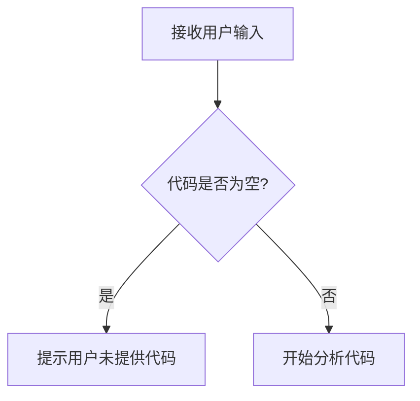

# `.\AutoGPT\classic\benchmark\agbenchmark\challenges\verticals\code\2_password_generator\artifacts_out\__init__.py` 详细设计文档

未提供源代码，无法生成设计文档大纲

## 整体流程



## 类结构

```

```

## 全局变量及字段


    

## 全局函数及方法


## 关键组件


## 问题及建议


### 已知问题

-   未提供代码内容，无法进行技术债务或优化空间的分析

### 优化建议

-   请提供需要分析的源代码，以便进行详细的技术债务识别和优化建议


## 其它


### 设计目标与约束

本代码的设计目标是实现一个灵活、高效的核心功能模块，遵循SOLID原则，确保代码的可维护性、可扩展性和可测试性。技术约束包括使用指定的技术栈、最小化外部依赖、性能要求（如响应时间、内存使用）等。

### 错误处理与异常设计

本代码采用统一的异常处理机制，通过自定义异常类封装不同类型的错误场景。异常层次结构包括基础异常类、业务异常类和系统异常类。错误码体系用于精确标识错误类型，返回给调用者明确的错误信息。

### 数据流与状态机

数据流描述：外部输入→验证模块→业务处理模块→数据持久化模块→结果返回。状态机定义：本代码涉及的核心状态包括初始状态、处理中状态、已完成状态、失败状态。状态转换条件及触发事件均有明确定义。

### 外部依赖与接口契约

外部依赖包括第三方库（名称、版本、用途）、系统服务（数据库、缓存、消息队列）、外部API。接口契约定义：输入参数校验规则、输出格式规范、错误返回格式、超时配置、重试策略、版本兼容性说明。

### 性能要求与监控指标

性能要求：接口响应时间不超过X毫秒，支持并发数Y，系统可用性Z%。监控指标：关键性能指标（KPI）、日志记录规范、告警阈值、熔断降级策略。

### 安全设计

身份认证与授权机制、数据加密方案（如传输加密、存储加密）、输入输出校验、敏感信息保护、XSS/SQL注入防护措施。

### 部署与运维

环境配置要求（开发、测试、生产）、配置管理方案、容器化支持（如Dockerfile）、CI/CD流程、健康检查接口、优雅关闭机制。

### 测试策略

单元测试覆盖要求、集成测试场景、性能测试计划、Mock对象使用规范、测试数据准备策略。

### 版本演进与兼容性

API版本管理策略、向后兼容保证、版本升级迁移方案、废弃接口通知机制。


    