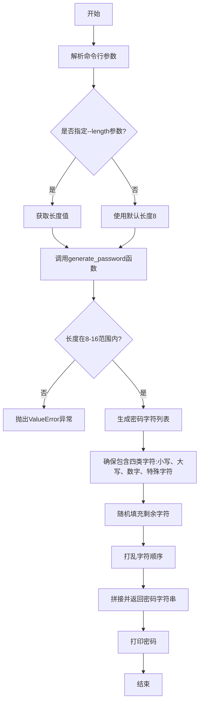
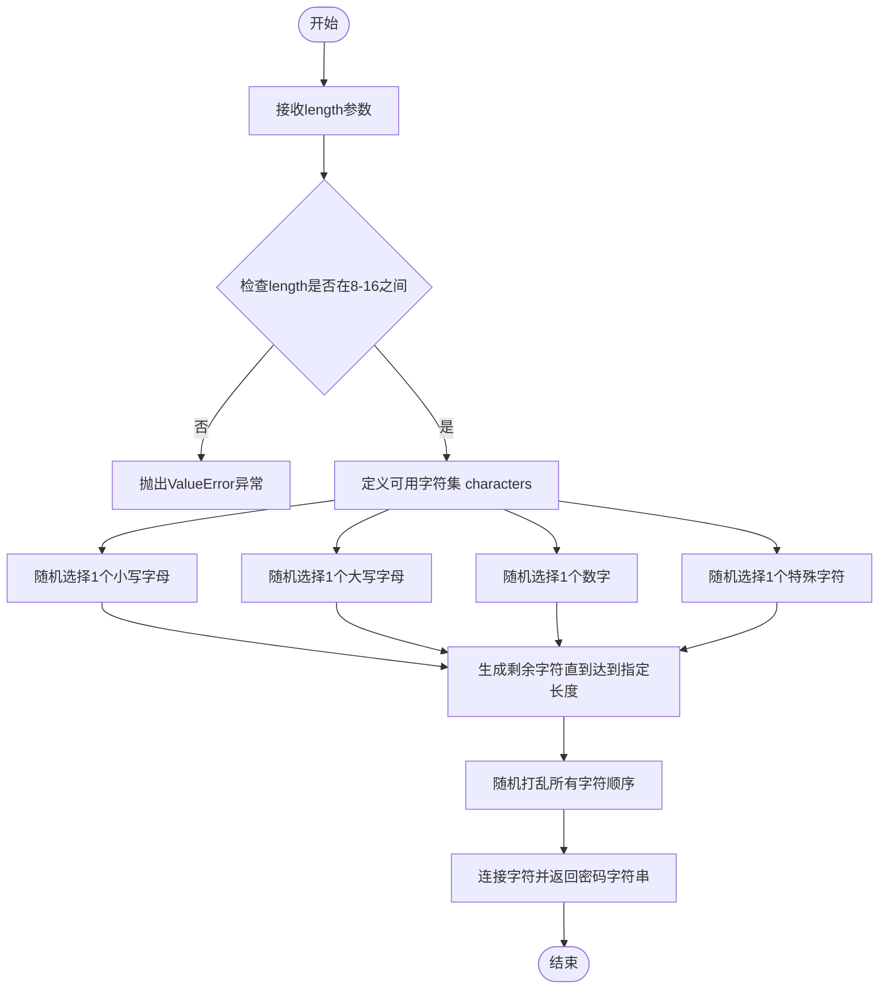

# `.\AutoGPT\classic\benchmark\agbenchmark\challenges\verticals\code\2_password_generator\artifacts_out\password_generator.py` 详细设计文档

这是一个密码生成工具，通过命令行接受长度参数（默认为8），生成包含大小写字母、数字和特殊字符的安全密码，密码长度限制在8-16位之间。

## 整体流程



## 类结构

```
无类结构 (仅包含全局函数)
```

## 全局变量及字段


### `random`
    
Python标准库模块，用于生成随机数和随机选择

类型：`module`
    


### `string`
    
Python标准库模块，包含字符串常量如ascii_letters、digits和punctuation

类型：`module`
    


### `sys`
    
Python标准库模块，用于系统特定的参数和函数操作

类型：`module`
    


### `generate_password`
    
生成随机密码的函数，长度为8-16个字符，包含小写字母、大写字母、数字和标点符号

类型：`function`
    


### `length`
    
参数，指定所需的密码长度（必须在8到16之间）

类型：`int`
    


### `characters`
    
包含密码生成所有允许字符的字符串（ascii字母+数字+标点符号）

类型：`str`
    


### `password`
    
字符列表，将组合形成生成的密码

类型：`list`
    


### `password_length`
    
存储从命令行参数解析的密码长度变量，默认为8

类型：`int`
    


    

## 全局函数及方法


### `generate_password`

该函数用于生成指定长度（8-16位）的随机密码，确保密码包含至少一个小写字母、一个大写字母、一个数字和一个特殊字符，以提高密码安全性。

**参数：**

- `length`：`int`，密码长度，默认为8，取值范围为8到16

**返回值：** `str`，返回生成的随机密码字符串

#### 流程图



#### 带注释源码

```python
import random
import string
import sys


def generate_password(length: int = 8) -> str:
    """
    生成一个指定长度的随机密码
    
    参数:
        length: 密码长度，默认为8，范围8-16
    
    返回:
        生成的随机密码字符串
    
    异常:
        ValueError: 当密码长度不在8-16范围内时抛出
    """
    # 参数校验：密码长度必须在8-16之间
    if length < 8 or length > 16:
        raise ValueError("Password length must be between 8 and 16 characters.")

    # 定义密码可用字符集：字母+数字+标点符号
    characters = string.ascii_letters + string.digits + string.punctuation
    
    # 确保密码至少包含每种类型的字符各一个
    password = [
        random.choice(string.ascii_lowercase),   # 1个小写字母
        random.choice(string.ascii_uppercase),   # 1个大写字母
        random.choice(string.digits),            # 1个数字
        random.choice(string.punctuation),      # 1个特殊字符
    ]
    
    # 填充剩余字符直到达到指定长度
    password += [random.choice(characters) for _ in range(length - 4)]
    
    # 随机打乱字符顺序以确保安全性
    random.shuffle(password)
    
    # 将字符列表连接成字符串并返回
    return "".join(password)


# 主程序入口：通过命令行参数指定密码长度
if __name__ == "__main__":
    # 解析命令行参数，获取--length指定的长度值，默认为8
    password_length = (
        int(sys.argv[sys.argv.index("--length") + 1]) if "--length" in sys.argv else 8
    )
    # 生成并打印密码
    print(generate_password(password_length))
```


## 关键组件


### 密码生成核心函数 generate_password

负责生成符合安全要求的随机密码，确保包含大小写字母、数字和特殊字符，长度在8-16位之间。

### 字符集定义

定义了密码可用字符集，包括ascii字母、数字和标点符号，用于随机选择。

### 命令行参数解析

从sys.argv中解析--length参数，如果没有提供则使用默认值8。

### 密码组成策略

确保生成的密码至少包含一个小写字母、一个 uppercase 字母、一个数字和一个特殊字符，然后填充剩余随机字符。

### 密码长度验证

验证密码长度是否在8-16位范围内，不符合则抛出ValueError异常。

### 随机性保障

使用random.choice和random.shuffle确保密码字符的随机性和位置不确定性。


## 问题及建议


### 已知问题

- **命令行参数解析方式简陋**：使用手动索引`sys.argv`解析参数，当`--length`参数存在但未提供值时会导致`IndexError`异常
- **缺少输入类型验证**：当传入非整数参数时，`int()`会抛出`ValueError`而不是友好的错误提示
- **密码分布不均匀**：前4个固定位置的字符保证了字符类型，但剩余`length-4`个字符完全随机，可能导致某些类型字符过多或过少
- **没有使用标准库`argparse`**：Python标准库提供了功能强大的参数解析模块，当前实现不够专业
- **字符集未考虑可读性**：包含所有标点符号和易混淆字符（如`0`/`O`、`1`/`l`/`I`），影响用户体验和密码可用性
- **缺少单元测试**：没有测试用例覆盖边界条件和异常情况
- **密码长度上限16过小**：现代安全标准建议密码长度至少12-20字符，当前上限可能不满足高安全需求场景

### 优化建议

- 使用`argparse`模块替代手动`sys.argv`解析，提供自动类型转换、帮助信息和错误处理
- 添加输入验证逻辑，处理非数字输入并提供友好错误提示
- 考虑增加可配置的字符排除选项，允许用户排除易混淆字符
- 增加日志记录功能，便于问题排查和审计
- 添加密码强度验证选项，确保生成的密码符合特定复杂度要求
- 考虑增加`random.seed()`选项以支持可复现的测试场景
- 将字符集配置外部化，支持更灵活的定制需求

## 其它


### 设计目标与约束

本项目的设计目标是生成符合安全要求的随机密码，密码必须满足以下约束：长度在8-16位之间、必须包含小写字母、大写字母、数字和特殊字符各至少一个。命令行参数仅支持--length选项，默认密码长度为8位。

### 错误处理与异常设计

当密码长度参数不符合要求（小于8或大于16）时，抛出ValueError异常并附带明确的错误信息。当命令行缺少--length参数时，使用默认值8。当--length参数格式错误或未提供数值时，程序将抛出IndexError或ValueError异常。main函数未进行异常捕获，异常将直接向上传播导致程序终止。

### 数据流与状态机

程序启动后首先检查命令行参数，若存在--length参数则解析其后续值作为密码长度，否则使用默认值8。随后调用generate_password函数，该函数首先验证长度合法性，然后在字符集中随机选择字符生成密码列表，最后将列表随机打乱并拼接为字符串返回。最终结果输出到标准输出流。

### 外部依赖与接口契约

本程序依赖三个Python标准库模块：random用于生成随机数、string提供字符常量、sys用于访问命令行参数。generate_password函数接受一个整数参数length，返回字符串类型的密码。命令行接口约定：--length后必须跟随有效整数，否则程序将异常退出。

### 关键组件信息

generate_password函数：核心密码生成逻辑，负责验证参数并生成符合安全要求的随机密码。__main__模块：命令行入口，负责参数解析和结果输出。string模块：提供ascii_letters、ascii_lowercase、ascii_uppercase、digits、punctuation等字符集常量。random模块：提供choice和shuffle函数用于随机选择和打乱字符顺序。

### 潜在的技术债务或优化空间

1.命令行参数解析方式不够健壮，使用sys.argv手动解析无法处理--length=8这种格式，且参数顺序敏感。2.未对sys.argv.index查询结果进行边界检查，若--length在最后一位会导致IndexError。3.random模块生成的密码在密码学上不够安全，建议使用secrets模块替代。4.密码字符组成逻辑在长度不足4时可能出现问题（虽然有最小长度限制保护）。5.缺少单元测试和日志记录功能。6.未提供帮助信息（-h/--help）和版本信息。7.字符集包含所有标点符号，某些特殊字符可能在命令行或某些系统中引发问题。

    