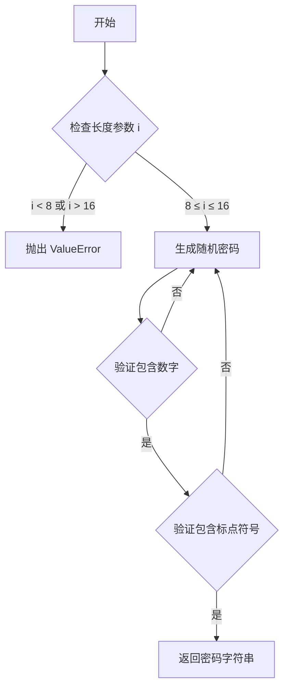
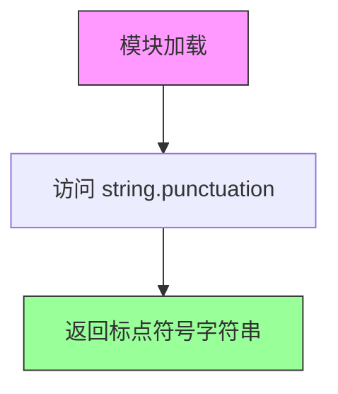
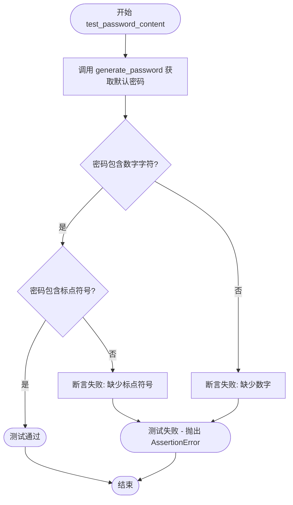

# `.\AutoGPT\classic\benchmark\agbenchmark\challenges\verticals\code\2_password_generator\custom_python\test.py` 详细设计文档

这是一个单元测试文件，用于验证密码生成器模块的功能，包括密码长度验证、异常处理以及密码内容组成（数字和特殊字符）的检查。

## 整体流程

```mermaid
graph TD
A[开始测试] --> B[test_password_length]
B --> B1{遍历长度8-16}
B1 --> B2[调用generate_password(i)]
B2 --> B3{断言密码长度==i}
B3 --> C[test_value_error]
C --> C1[测试长度7是否抛出ValueError]
C1 --> C2[测试长度17是否抛出ValueError]
C2 --> D[test_password_content]
D --> D1[调用generate_password()生成默认密码]
D1 --> D2{断言包含数字}
D2 --> D3{断言包含特殊字符}
D3 --> E[测试结束]
```

## 类结构

```
unittest.TestCase
└── TestPasswordGenerator
```

## 全局变量及字段


### `password_generator`
    
密码生成模块，提供generate_password函数用于生成指定长度的密码，并包含string属性定义字符集（如punctuation）

类型：`module`
    


    

## 全局函数及方法


### `password_generator.generate_password`

根据测试代码分析，该函数用于生成指定长度的随机密码，要求密码必须包含至少一个数字和至少一个标点符号，长度必须控制在 8-16 位之间。

参数：

- `i`：`int`，密码长度，范围 8-16，默认为某个默认值（从测试推断）

返回值：`str`，生成的密码字符串

#### 流程图



#### 带注释源码

```python
# 根据测试代码推断的实现
import string
import random

def generate_password(length: int = 12) -> str:
    """
    生成随机密码
    
    参数:
        length: 密码长度，默认为 12，范围 8-16
    
    返回:
        生成的密码字符串，包含数字和标点符号
    
    异常:
        ValueError: 当长度不在 8-16 范围内时
    """
    # 验证长度参数
    if length < 8 or length > 16:
        raise ValueError("Password length must be between 8 and 16")
    
    # 生成包含数字和标点符号的字符集
    characters = string.digits + string.punctuation
    
    # 确保密码至少包含一个数字和一个标点符号
    password = [
        random.choice(string.digits),      # 至少一个数字
        random.choice(string.punctuation)  # 至少一个标点符号
    ]
    
    # 填充剩余长度
    remaining_length = length - 2
    password.extend(random.choice(characters) for _ in range(remaining_length))
    
    # 随机打乱顺序
    random.shuffle(password)
    
    return ''.join(password)
```

---

**注意**：由于用户提供的是测试代码而非实现代码，以上内容为基于测试用例的合理推断。实际实现可能有所不同，建议查看 `password_generator.py` 源文件获取准确信息。


### `password_generator.string.punctuation`

该变量是 `password_generator` 模块中的一个模块级字符串变量，用于存储密码生成器支持的标点符号字符集。在测试中被用于验证生成的密码是否包含标点符号。

参数： 无（这是一个模块级变量，非函数）

返回值：`str`，返回包含可作为密码字符的标点符号字符串

#### 流程图



#### 带注释源码

```python
# password_generator 模块中的 string.punctuation 变量定义
# 这是一个模块级变量，通常从 Python 内置 string 模块导入或自定义定义
# 用途：提供密码生成器可使用的标点符号集合

# 可能的实现方式 1：直接导入 string 模块的 punctuation
# import string
# punctuation = string.punctuation

# 可能的实现方式 2：自定义标点符号字符串
# punctuation = '!"#$%&\'()*+,-./:;<=>?@[\\]^_`{|}~'

# 在测试中的使用方式：
# self.assertTrue(
#     any(c in password_generator.string.punctuation for c in password)
# )
# 上述代码检查生成的密码中是否至少包含一个标点符号字符
```

---

**注意**：由于提供的代码仅为测试文件，未展示 `password_generator` 模块的实际实现，因此上述内容是基于 Python 标准库 `string.punctuation` 的特性和代码使用方式的推断。实际的 `password_generator.string.punctuation` 具体定义取决于该模块的内部实现。


### `TestPasswordGenerator.test_password_length`

该方法用于测试密码生成器能够正确生成指定长度（8-16位）的密码。通过循环遍历8到16的长度范围，验证`generate_password`函数生成的密码实际长度与请求的长度是否一致。

参数：该方法无显式参数（`self`为Python实例方法隐式参数）

返回值：`None`，测试方法无返回值，通过断言验证密码长度是否符合预期

#### 流程图

```mermaid
flowchart TD
    A[开始测试] --> B[初始化循环变量 i = 8]
    B --> C{i < 17?}
    C -->|是| D[调用 generate_password(i) 生成密码]
    D --> E{断言 len(password) == i}
    E -->|通过| F[i = i + 1]
    E -->|失败| G[抛出 AssertionError]
    F --> C
    C -->|否| H[测试结束]
    G --> H
    
    style G fill:#ffcccc
    style E fill:#ffffcc
```

#### 带注释源码

```python
def test_password_length(self):
    """
    测试密码生成器能正确生成指定长度（8-16位）的密码
    
    测试逻辑：
    - 遍历长度范围 8 到 16（range(8, 17) 生成 8, 9, ..., 16）
    - 对每个长度调用 generate_password(i) 生成密码
    - 验证生成的密码长度是否与请求的长度完全一致
    """
    # 循环测试长度为 8 到 16 的密码生成
    for i in range(8, 17):
        # 调用密码生成器，生成指定长度 i 的密码
        password = password_generator.generate_password(i)
        
        # 断言验证：密码实际长度必须等于请求的长度 i
        # 如果长度不匹配，unittest 会抛出 AssertionError 并标记测试失败
        self.assertEqual(len(password), i)
```


### `TestPasswordGenerator.test_value_error`

该测试方法用于验证密码生成器在接收超出有效范围的密码长度（小于8或大于16）时，能够正确抛出 `ValueError` 异常，确保输入参数的有效性校验机制正常工作。

参数：

- `self`：`TestCase`， unittest 测试框架提供的测试用例实例，用于访问断言方法

返回值：`None`，测试方法不返回任何值，仅通过断言验证行为

#### 流程图

```mermaid
flowchart TD
    A[开始测试 test_value_error] --> B{调用 generate_password(7)}
    B -->|预期抛出 ValueError| C[使用 assertRaises 捕获异常]
    C --> D{调用 generate_password(17)}
    D -->|预期抛出 ValueError| E[使用 assertRaises 捕获异常]
    E --> F[测试通过]
    F --> G[结束测试]
    
    B -.->|未抛出异常| H[测试失败]
    D -.->|未抛出异常| I[测试失败]
```

#### 带注释源码

```python
def test_value_error(self):
    """
    测试密码生成器对无效长度的参数校验。
    
    有效密码长度范围为 8-16 位（包含边界），
    当传入 7（小于最小值）或 17（大于最大值）时，
    应抛出 ValueError 异常。
    """
    # 测试长度小于最小值（7）的情况
    # assertRaises 上下文管理器会捕获异常
    # 若未抛出异常则测试失败
    with self.assertRaises(ValueError):
        password_generator.generate_password(7)
    
    # 测试长度大于最大值（17）的情况
    # 验证边界值之外的输入能正确触发异常
    with self.assertRaises(ValueError):
        password_generator.generate_password(17)
```


### `TestPasswordGenerator.test_password_content`

该测试方法用于验证 `generate_password()` 函数生成的默认密码是否同时包含数字和标点符号（特殊字符），确保密码满足基本的复杂度要求。

参数：

-  `self`：`unittest.TestCase`，测试类实例本身，无需显式传递

返回值：`None`，通过 `unittest.TestCase.assertTrue()` 断言方法验证条件，若失败则抛出 `AssertionError`

#### 流程图



#### 带注释源码

```python
def test_password_content(self):
    """
    测试生成的默认密码是否包含数字和标点符号
    
    验证逻辑：
    1. 调用 generate_password() 生成默认长度和字符集的密码
    2. 验证密码中至少包含一个数字字符 (0-9)
    3. 验证密码中至少包含一个标点符号 (特殊字符)
    """
    # Step 1: 生成默认密码（使用默认长度和字符集）
    password = password_generator.generate_password()
    
    # Step 2: 验证密码包含至少一个数字字符
    # 使用 any() 遍历密码中的每个字符，检查是否有字符满足 isdigit()
    self.assertTrue(any(c.isdigit() for c in password))
    
    # Step 3: 验证密码包含至少一个标点符号
    # 导入的 string.punctuation 包含: !"#$%&'()*+,-./:;<=>?@[\]^_`{|}~
    # 使用 any() 检查密码中是否有任意字符属于标点符号集合
    self.assertTrue(
        any(c in password_generator.string.punctuation for c in password)
    )
```


## 关键组件


### 密码生成器核心函数

负责生成指定长度的随机密码，是被测模块的核心功能，接受长度参数（8-16位），返回包含数字和标点符号的随机密码字符串。

### 密码长度验证模块

验证用户输入的密码长度是否在有效范围内（8-16位），当长度不在此范围内时抛出ValueError异常，确保密码安全性。

### 标点符号常量引用

通过password_generator.string.punctuation访问标点符号字符集，用于密码内容验证，确保生成的密码包含特殊字符。

### 密码内容验证组件

验证生成的密码是否同时包含数字字符和标点符号，确保密码满足复杂度要求，提升密码强度。


## 问题及建议


### 已知问题

-   **边界值测试覆盖不足**：仅测试了 `range(8, 17)` 生成密码的长度，未对每个有效长度（8-16）进行独立验证
-   **密码内容验证不完整**：测试只检查了数字和特殊字符的存在，未验证大写字母（虽然代码可能生成）
-   **缺少负数和零值测试**：未测试 `generate_password(0)`、`generate_password(-1)` 等边界情况
-   **默认参数测试覆盖单一**：仅在 `test_password_content` 中测试了默认长度（通常为8或12），未明确默认长度值
-   **未验证唯一性**：密码生成可能存在重复，未测试连续生成多个密码时的唯一性
-   **外部依赖缺少显式验证**：依赖 `password_generator` 模块但未检查其导入失败或模块结构异常的情况

### 优化建议

-   添加参数化测试（使用 `unittest.subTest` 或 `pytest.mark.parametrize`）覆盖所有有效长度
-   增加负数、零值、超大值（如 `2**31`）的异常测试用例
-   补充大写字母、字母存在性的验证测试
-   考虑添加密码强度评估或字符分布均匀性的统计测试
-   添加重复执行测试验证随机性（如连续生成1000个密码不应全部相同）
-   建议升级至 `pytest` 框架以获得更简洁的参数化测试支持
-   为关键测试添加详细的断言消息，提高失败时的可调试性

## 其它


### 设计目标与约束

本项目旨在实现一个安全可靠的密码生成器，核心目标是生成符合安全要求的随机密码。设计约束包括：密码长度必须介于8-16个字符之间、必须包含至少一个数字、必须包含至少一个特殊字符、生成的密码应具有足够的熵以防止暴力破解。

### 错误处理与异常设计

当密码长度参数不在有效范围内（8-16）时，应抛出ValueError异常。测试用例明确验证了长度小于8和大于等于17时都会触发ValueError。异常信息应清晰说明有效范围，以便调用者能够正确处理错误。

### 数据流与状态机

密码生成过程的状态转换如下：初始状态（接收长度参数）→ 验证状态（检查长度是否在8-16范围内）→ 生成状态（根据长度生成包含数字和特殊字符的随机密码）→ 返回状态（返回生成的密码字符串）。若验证失败则直接进入异常状态。

### 外部依赖与接口契约

主要依赖password_generator模块中的generate_password函数和string包。generate_password函数的接口契约为：参数为可选的整数（默认长度未在测试中明确），返回值为字符串。当传入无效长度时抛出ValueError。string.punctuation用于验证特殊字符。

### 安全性考虑

密码生成应使用安全的随机数生成机制（如secrets模块而非random模块）。密码应包含足够复杂的字符集以抵御暴力破解和字典攻击。生成的密码不应包含容易混淆的字符（如l、1、I、O、0）。

### 性能要求

密码生成操作应在毫秒级完成，即使在频繁调用的场景下也不应造成性能瓶颈。内存占用应保持最小，不应存储生成的密码历史。

### 配置管理

密码长度范围（8-16）可考虑作为可配置参数。字符集配置（数字、特殊字符的集合）应可自定义。配置应支持从配置文件或环境变量加载。

### 版本兼容性

当前版本应兼容Python 3.x版本。generate_password函数的签名应保持向后兼容。string.punctuation的使用应确保在Python不同版本中行为一致。

### 测试覆盖建议

除现有测试外，还应增加以下测试用例：测试长度为边界值（8和16）时的行为、测试生成的密码不包含空白字符、测试多次调用生成的密码具有足够的随机性（不重复）、测试特殊字符覆盖所有string.punctuation中的字符。


    