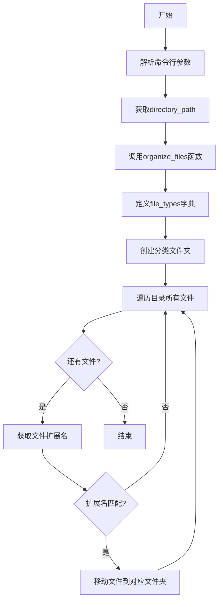

# `.\AutoGPT\classic\benchmark\agbenchmark\challenges\verticals\code\3_file_organizer\artifacts_out\organize_files.py` 详细设计文档

一个文件组织工具，根据文件扩展名将指定目录中的文件自动移动到对应的分类文件夹中（图片、文档、音频）

## 整体流程



## 类结构

```
无类结构（脚本文件）
```

## 全局变量及字段


### `organize_files`
    
根据文件类型将目录中的文件移动到对应类别的子文件夹中

类型：`function`
    


### `file_types`
    
定义常见文件扩展名与类别名称的映射关系

类型：`dict`
    


### `parser`
    
命令行参数解析器，用于获取用户指定的目录路径

类型：`ArgumentParser`
    


### `args`
    
存储解析后的命令行参数，包含directory_path属性

类型：`Namespace`
    


    

## 全局函数及方法


### `organize_files`

该函数根据文件扩展名将指定目录中的文件自动移动到对应的类型文件夹中（图片、文档、音频），实现文件的自动分类整理。

参数：

- `directory_path`：`str`，需要整理的目录路径

返回值：`None`，该函数仅执行文件移动操作，不返回任何值

#### 流程图


#### 带注释源码

```python
import argparse
import os
import shutil


def organize_files(directory_path):
    """
    根据文件扩展名将目录中的文件分类到对应文件夹
    
    参数:
        directory_path: 需要整理的目录路径
    返回:
        无返回值，直接移动文件
    """
    
    # 定义文件类型与扩展名的映射关系
    file_types = {
        "images": [".png", ".jpg", ".jpeg"],      # 图片文件扩展名列表
        "documents": [".pdf", ".docx", ".txt"],    # 文档文件扩展名列表
        "audio": [".mp3", ".wav", ".flac"],        # 音频文件扩展名列表
    }

    # 遍历文件类型字典，创建对应的目标文件夹
    for folder_name in file_types.keys():
        folder_path = os.path.join(directory_path, folder_name)  # 拼接完整文件夹路径
        if not os.path.exists(folder_path):                       # 检查文件夹是否已存在
            os.makedirs(folder_path)                               # 不存在则创建

    # 使用 os.walk 遍历指定目录下的所有文件和子文件夹
    # os.walk 返回: (当前文件夹路径, 子文件夹列表, 文件列表)
    for foldername, subfolders, filenames in os.walk(directory_path):
        for filename in filenames:                                 # 遍历当前目录下的所有文件
            # 获取文件扩展名（包含点号）
            _, file_extension = os.path.splitext(filename)
            
            # 将扩展名转换为小写以进行不区分大小写的匹配
            file_extension = file_extension.lower()

            # 遍历文件类型字典，查找匹配的类型
            for folder_name, extensions in file_types.items():
                if file_extension in extensions:                   # 检查扩展名是否在列表中
                    old_path = os.path.join(foldername, filename)   # 源文件完整路径
                    new_path = os.path.join(directory_path, folder_name, filename)  # 目标文件完整路径
                    
                    # 避免将文件移动到自身（同一路径）
                    if old_path != new_path:
                        shutil.move(old_path, new_path)             # 执行文件移动操作


if __name__ == "__main__":
    # 命令行参数解析器
    parser = argparse.ArgumentParser(
        description="Organize files in a directory based on their file types"
    )
    
    # 添加必需的位置参数：directory_path
    parser.add_argument(
        "--directory_path",
        type=str,
        required=True,
        help="The path of the directory to be organized",
    )

    args = parser.parse_args()

    # 调用文件整理函数
    organize_files(args.directory_path)
```

#### 关键组件信息

| 组件名称 | 一句话描述 |
|---------|-----------|
| `file_types` 字典 | 定义文件扩展名与目标文件夹的映射关系 |
| `os.walk()` | 递归遍历目录树，返回所有文件和子文件夹 |
| `os.path.splitext()` | 分离文件名和扩展名 |
| `shutil.move()` | 将文件从一个位置移动到另一个位置 |
| `argparse` | 命令行参数解析模块 |

#### 潜在的技术债务或优化空间

1. **缺少错误处理**：未处理无效路径、权限不足、文件被占用等异常情况
2. **移动过程中迭代**：`os.walk` 遍历时直接修改文件位置，可能导致意外行为或遗漏
3. **目标文件已存在**：未处理目标文件夹中已存在同名文件的场景（会直接覆盖）
4. **硬编码扩展名**：文件类型分类逻辑硬编码，扩展名列表难以扩展和维护
5. **无日志记录**：文件操作没有任何日志，难以追踪执行过程和排查问题
6. **递归处理子目录**：会遍历所有子目录，可能导致将文件从子目录移动到根目录后，子目录变为空目录
7. **扩展名大小写敏感**：虽然代码中做了小写转换，但原始实现可能存在匹配问题

#### 其它项目

**设计目标与约束**
- 目标：实现基于文件扩展名的自动分类整理
- 约束：仅支持预定义的三种文件类型（图片、文档、音频）

**错误处理与异常设计**
- 目录不存在时：`os.makedirs` 会自动创建
- 文件移动失败：可能抛出异常（如权限问题），未被捕获
- 目标文件已存在：`shutil.move` 会直接覆盖，无任何确认机制

**数据流与状态机**
- 输入：用户提供的目录路径
- 处理：遍历 → 匹配 → 移动
- 输出：无返回值，文件按类型重新组织到不同文件夹

**外部依赖与接口契约**
- 依赖模块：`argparse`（命令行）、`os`（文件系统）、`shutil`（文件操作）
- 接口：单一函数 `organize_files(directory_path)`，接收字符串路径，无返回值

## 关键组件


### 文件组织核心函数 (organize_files)

负责遍历指定目录下的所有文件，根据文件扩展名将文件移动到对应的类型文件夹中，实现自动化文件分类整理功能。

### 文件类型映射字典 (file_types)

定义了三种文件类型分类（images、documents、audio）及其对应的文件扩展名列表，用于判断文件归属类别。

### 命令行参数解析器 (argparse)

通过ArgumentParser创建命令行参数解析，支持--directory_path必需参数，用于接收用户指定的待整理目录路径。

### 主程序入口 (if __name__ == "__main__")

程序入口点，负责初始化参数解析器、解析命令行参数，并调用organize_files函数执行文件整理逻辑。


## 问题及建议


### 已知问题

-   **文件移动时迭代问题**：在 `os.walk` 遍历过程中使用 `shutil.move` 修改目录结构，可能导致文件遗漏或重复处理
-   **扩展名大小写敏感**：只匹配小写扩展名（如 `.jpg`），无法识别大写扩展名（如 `.JPG`、``.PNG`）
-   **文件名冲突无处理**：当目标文件夹已存在同名文件时，后移动的文件会直接覆盖原文件，无任何提示
-   **未知文件类型被忽略**：不在预定义列表中的文件类型（如 `.zip`、`.mp4` 等）会被静默跳过，无日志输出
-   **无错误处理机制**：文件操作（移动、创建目录等）可能因权限不足、文件被占用等原因失败，但代码无任何 try-except 保护
-   **无操作反馈**：程序执行过程中无任何日志输出，用户无法了解文件移动情况
-   **算法效率低下**：对每个文件都遍历所有扩展名分组，时间复杂度为 O(n*m)，可使用字典优化

### 优化建议

-   **构建扩展名映射表**：将扩展名列表转换为字典，以扩展名为键直接查找目标文件夹，避免嵌套循环
-   **统一扩展名大小写**：在比较前将扩展名转换为小写，或同时检查大小写变体
-   **添加文件重名处理**：在目标文件已存在时，添加序号后缀（如 `file_1.txt`）或跳过并记录
-   **增加日志输出**：使用 `logging` 模块记录每个文件的移动操作，便于用户了解执行结果
-   **添加错误处理**：用 try-except 包裹文件操作，捕获并记录 `OSError`、`PermissionError` 等异常
-   **分离遍历与移动**：先将待移动的文件路径收集到列表中，完成遍历后再执行移动操作，避免迭代过程中修改目录结构
-   **扩展文件类型支持**：可通过配置文件或命令行参数扩展支持的文件类型分类

## 其它


### 设计目标与约束

本代码的设计目标是实现一个简单的文件组织工具，能够根据文件扩展名将文件自动移动到对应的类型目录中。设计约束包括：仅支持预定义的几种文件类型（images、documents、audio），不支持配置文件或自定义规则，运行在命令行环境中，需要Python标准库支持。

### 错误处理与异常设计

代码缺少显式的错误处理机制。潜在异常包括：目录路径不存在时os.walk会返回空结果，文件移动冲突时shutil.move可能覆盖已存在文件，权限不足时操作失败，符号链接处理不当等。建议增加try-except捕获OSError和PermissionError，添加文件冲突检测和处理逻辑。

### 外部依赖与接口契约

本代码仅依赖Python标准库：argparse（命令行参数解析）、os（路径操作）、shutil（文件移动）。外部接口契约为：入口函数organize_files接受字符串类型的directory_path参数，无返回值，假设调用方已验证路径有效性且具有相应读写权限。

### 性能考虑

当前实现使用os.walk递归遍历目录，对于大型目录可能存在性能瓶颈。文件移动采用逐个处理方式，未使用并行或批量操作。文件类型映射使用线性搜索，可考虑使用字典提高查找效率。

### 安全性考虑

代码未对输入路径进行安全校验，可能存在路径遍历攻击风险（虽然当前实现仅在指定目录内操作）。未检查文件操作权限，未处理符号链接和特殊文件。建议添加路径规范化、符号链接检测和权限验证逻辑。

### 可配置性与扩展性

文件类型映射硬编码在函数内部，添加新类型需修改代码。建议将file_types配置外部化，支持配置文件或命令行参数传入。函数设计为单一职责，便于扩展但缺乏插件机制。

### 测试考量

建议增加单元测试覆盖：空目录处理、已存在目标文件夹、文件扩展名大小写、文件名编码、目标文件已存在等边界情况。当前代码无测试，建议添加pytest测试用例。

### 使用示例与帮助信息

命令行使用示例：python organize.py --directory_path /path/to/folder。帮助信息通过argparse自动生成，显示description和help内容。可考虑增加-v/--verbose参数显示操作详情，-n/--dry-run参数预览移动结果。

### 部署与运行环境

环境要求：Python 3.6+，标准库依赖无需额外安装。部署方式为直接运行Python脚本，建议打包为可执行文件或添加shebang支持直接执行。跨平台支持依赖shutil和os的跨平台行为。

### 日志与监控

代码无日志输出，操作结果不可追溯。建议添加日志记录：操作时间、移动的文件列表、错误信息等。可集成Python logging模块，支持配置日志级别和输出位置。


    